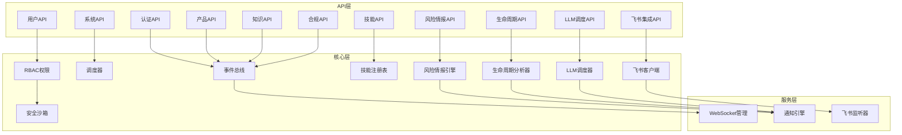
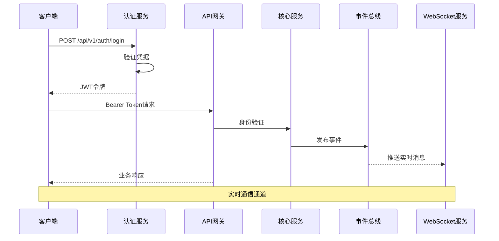
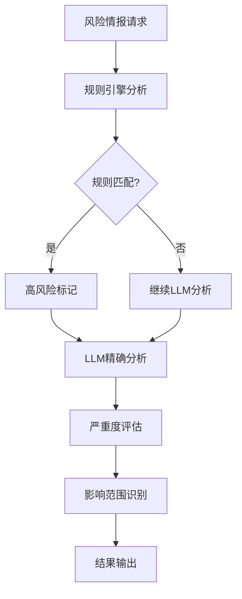
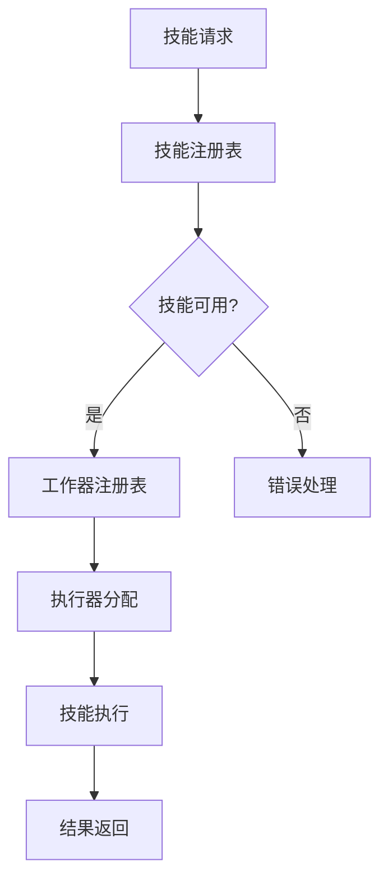
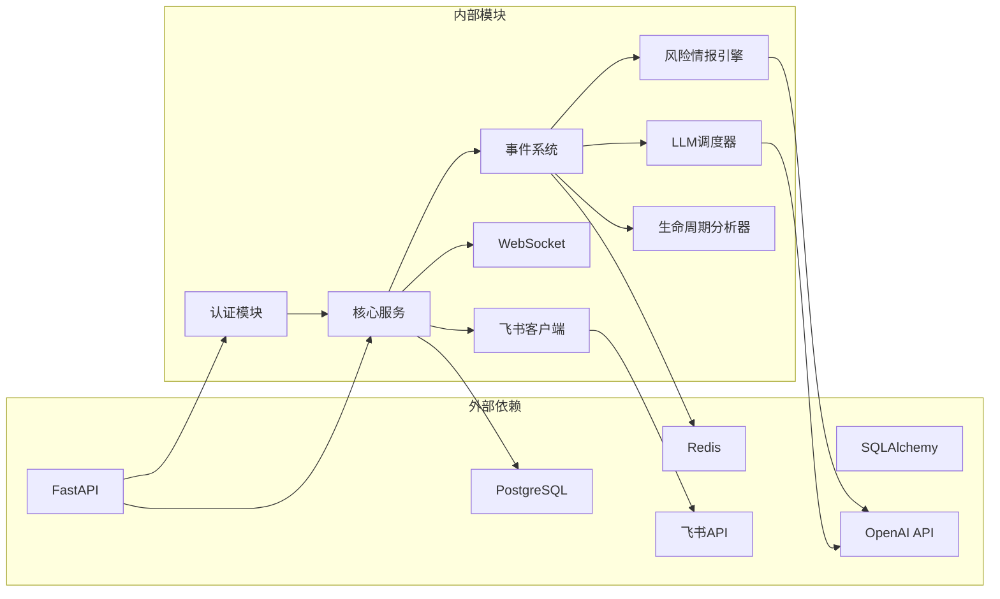

# API参考文档

<cite>
**本文档引用的文件**
- [后端api.md](file://后端api.md)
- [auth.py](file://backend/app/api/auth.py)
- [users.py](file://backend/app/api/users.py)
- [sessions.py](file://backend/app/api/sessions.py)
- [products.py](file://backend/app/api/products.py)
- [knowledge.py](file://backend/app/api/knowledge.py)
- [skills.py](file://backend/app/api/skills.py)
- [compliance.py](file://backend/app/api/compliance.py)
- [integrations.py](file://backend/app/api/integrations.py)
- [shopify.py](file://backend/app/api/shopify.py)
- [metrics.py](file://backend/app/api/metrics.py)
- [notifications.py](file://backend/app/api/notifications.py)
- [streaming.py](file://backend/app/api/streaming.py)
- [ws_manager.py](file://backend/services/ws_manager.py)
- [event_bus.py](file://backend/core/event_bus.py)
- [event_chain.py](file://backend/core/event_chain.py)
- [scheduler.py](file://backend/core/scheduler.py)
- [rbac.py](file://backend/core/rbac.py)
- [oauth_manager.py](file://backend/core/oauth_manager.py)
- [security_sandbox.py](file://backend/core/security_sandbox.py)
- [skill_registry.py](file://backend/core/skill_registry.py)
- [plugin_manager.py](file://backend/core/plugin_manager.py)
- [worker_registry.py](file://backend/core/worker_registry.py)
- [risk_intel.py](file://backend/app/api/risk_intel.py)
- [risk_intel_engine.py](file://backend/app/core/risk_intel_engine.py)
- [risk_intel_analyzer.py](file://backend/app/core/risk_intel_analyzer.py)
- [risk_intel_store.py](file://backend/app/storage/risk_intel_store.py)
- [lifecycle_analyzer.py](file://backend/app/core/lifecycle_analyzer.py)
- [llm_dispatcher.py](file://backend/app/core/llm_dispatcher.py)
- [llm_gateway.py](file://backend/app/core/llm_gateway.py)
- [feishu.py](file://backend/app/api/feishu.py)
- [feishu_client.py](file://backend/app/core/feishu_client.py)
- [feishu_listener.py](file://backend/app/services/feishu_listener.py)
- [feishu_listener.py](file://backend/app/core/event_listeners/feishu_listener.py)
- [test_full_business_flow.py](file://backend/tests/test_full_business_flow.py)
</cite>

## 更新摘要
**所做更改**
- 新增风险情报API模块，包含实时检索、RSS订阅、规则引擎分析
- 新增生命周期管理API，支持产品生命周期状态机和事件驱动流程
- 新增LLM调度API，提供智能决策和预警功能
- 新增飞书集成API，支持企业微信集成和消息推送
- 更新产品API以支持生命周期管理功能
- 增强事件总线和通知系统以支持新功能模块

## 目录
1. [简介](#简介)
2. [项目结构](#项目结构)
3. [核心组件](#核心组件)
4. [架构概览](#架构概览)
5. [详细组件分析](#详细组件分析)
6. [依赖关系分析](#依赖关系分析)
7. [性能考虑](#性能考虑)
8. [故障排除指南](#故障排除指南)
9. [结论](#结论)
10. [附录](#附录)

## 简介
避风港平台是一个基于FastAPI构建的企业级合规与智能代理系统，提供认证、产品管理、合规检查、知识库、技能调度、事件总线、WebSocket实时通信等完整的API生态。本文档面向开发者和集成商，提供REST API、WebSocket API、Socket API以及IPC/Pipe通信的完整接口规范。

**更新** 新增风险情报API、生命周期管理API、LLM调度API、飞书集成API等新功能模块，进一步完善了平台的智能化合规能力。

## 项目结构
后端采用分层架构，主要模块包括：
- API层：各业务模块的REST接口定义
- 核心层：事件总线、调度器、权限控制、安全沙箱等基础设施
- 服务层：WebSocket管理、通知引擎等专用服务
- 存储层：用户、会话、产品等数据持久化
- 数据层：法规、知识库、配置等静态资源

**图表来源**
- [后端api.md:1-100](file://后端api.md#L1-L100)
- [auth.py:1-100](file://backend/app/api/auth.py#L1-L100)
- [risk_intel.py:1-50](file://backend/app/api/risk_intel.py#L1-L50)
- [lifecycle_analyzer.py:1-50](file://backend/app/core/lifecycle_analyzer.py#L1-L50)
- [llm_dispatcher.py:1-50](file://backend/app/core/llm_dispatcher.py#L1-L50)
- [feishu.py:1-50](file://backend/app/api/feishu.py#L1-L50)

**章节来源**
- [后端api.md:1-200](file://后端api.md#L1-L200)

## 核心组件
本节概述平台的核心API组件及其职责分工。

### 认证与授权
- **认证API**：提供JWT令牌生成、用户登录、注册等功能
- **用户管理API**：支持用户列表查询、角色管理、密码修改
- **权限控制**：基于RBAC的角色访问控制机制

### 业务功能API
- **产品API**：产品生命周期管理、库存查询、合规检查
- **知识API**：知识库检索、文档管理、内容分类
- **技能API**：技能调度、执行器管理、技能推荐
- **合规API**：法规扫描、风险评估、合规报告

### 新增功能模块API
- **风险情报API**：实时风险监测、关键词检索、RSS订阅、规则引擎分析
- **生命周期API**：产品生命周期状态管理、事件驱动流程、状态机转换
- **LLM调度API**：智能决策、预警生成、处置建议、实时通知
- **飞书集成API**：企业微信集成、消息推送、事件监听、工作流自动化

### 系统服务API
- **事件总线**：系统事件发布订阅、工作流编排
- **调度器**：定时任务、批处理作业
- **通知系统**：消息推送、邮件通知、WebHook
- **WebSocket**：实时通信、状态同步

**章节来源**
- [后端api.md:536-700](file://后端api.md#L536-L700)
- [auth.py:54-78](file://backend/app/api/auth.py#L54-L78)

## 架构概览
平台采用微服务架构，通过事件驱动实现模块解耦：

**图表来源**
- [auth.py:54-78](file://backend/app/api/auth.py#L54-L78)
- [ws_manager.py:1-100](file://backend/services/ws_manager.py#L1-L100)

## 详细组件分析

### 认证API
提供标准的JWT认证机制，支持多种登录方式：

| 方法 | 路径 | 说明 | 鉪权要求 |
|------|------|------|----------|
| POST | /api/v1/auth/login | 用户名密码登录 | 无 |
| POST | /api/v1/auth/token | OAuth2表单登录 | 无 |
| POST | /api/v1/auth/register | 用户注册 | Admin |
| GET | /api/v1/auth/me | 获取当前用户信息 | Bearer Token |
| PUT | /api/v1/auth/me/password | 修改密码 | Bearer Token |

认证流程：
1. 客户端发送凭据请求登录
2. 服务器验证用户名密码
3. 生成JWT访问令牌
4. 客户端在后续请求中携带Authorization头

**章节来源**
- [后端api.md:536-550](file://后端api.md#L536-L550)
- [auth.py:54-78](file://backend/app/api/auth.py#L54-L78)

### 产品API
管理产品的全生命周期：

| 方法 | 路径 | 说明 | 鉻权要求 |
|------|------|------|----------|
| GET | /api/v1/products | 产品列表查询 | Bearer |
| GET | /api/v1/products/{id} | 产品详情 | Bearer |
| POST | /api/v1/products | 创建产品 | Bearer |
| PUT | /api/v1/products/{id} | 更新产品 | Bearer |
| DELETE | /api/v1/products/{id} | 删除产品 | Bearer |
| GET | /api/v1/products/{id}/compliance | 合规检查 | Bearer |
| PUT | /api/v1/products/{id}/lifecycle | 更新生命周期阶段 | Bearer |
| GET | /api/v1/products/{id}/events | 获取产品事件链 | Bearer |

产品生命周期状态机：
- 概念调研(CONCEPT) → 选品设计(DESIGN)
- 选品设计(DESIGN) → 采购生产(SOURCING)
- 采购生产(SOURCING) → 上架就绪(READY)
- 上架就绪(READY) → 在售活跃(ACTIVE)
- 在售活跃(ACTIVE) → 履约跟踪(FULFILLING) 或 下架退市(END)
- 履约跟踪(FULFILLING) → 售后跟踪(AFTERSALE) 或 在售活跃(ACTIVE)
- 售后跟踪(AFTERSALE) → 在售活跃(ACTIVE) 或 下架退市(END)

**章节来源**
- [后端api.md:580-650](file://后端api.md#L580-L650)
- [products.py:96-113](file://backend/app/api/products.py#L96-L113)

### 风险情报API
提供实时风险监测和智能分析功能：

| 方法 | 路径 | 说明 | 鉻权要求 |
|------|------|------|----------|
| POST | /api/v1/risk-intel/search | 主动关键词检索 | Bearer |
| GET | /api/v1/risk-intel/feed | 风险情报订阅 | Bearer |
| GET | /api/v1/risk-intel/keywords | 关键词管理 | Bearer |
| GET | /api/v1/risk-intel/runs | 运行状态查询 | Bearer |
| POST | /api/v1/risk-intel/runs | 手动触发分析 | Bearer |

风险情报分析流程：
1. 关键词检索 → RSS订阅 → 规则引擎分析
2. 两阶段处理：规则引擎(毫秒级) + LLM精确分析
3. 严重度分级：critical/high/medium/low
4. 影响范围：市场、HS编码、产品类别

**图表来源**
- [risk_intel_engine.py:1-100](file://backend/app/core/risk_intel_engine.py#L1-L100)
- [risk_intel_analyzer.py:136-164](file://backend/app/core/risk_intel_analyzer.py#L136-L164)

**章节来源**
- [risk_intel.py:77-113](file://backend/app/api/risk_intel.py#L77-L113)

### 生命周期管理API
基于事件驱动的产品生命周期管理：

| 方法 | 路径 | 说明 | 鉻权要求 |
|------|------|------|----------|
| GET | /api/v1/lifecycle/stages | 生命周期阶段查询 | Bearer |
| GET | /api/v1/lifecycle/transitions | 状态转换规则 | Bearer |
| POST | /api/v1/lifecycle/analyzer | 生命周期分析 | Bearer |
| GET | /api/v1/lifecycle/analyzer/{id} | 分析结果查询 | Bearer |

生命周期分析器功能：
- 自动判断各阶段推进可行性
- 识别阻塞原因和前置条件
- 提供下一步行动建议
- 支持批量扫描和定期检查

**章节来源**
- [lifecycle_analyzer.py:1-100](file://backend/app/core/lifecycle_analyzer.py#L1-L100)

### LLM调度API
智能决策和预警生成：

| 方法 | 路径 | 说明 | 鉻权要求 |
|------|------|------|----------|
| GET | /api/v1/llm-dispatch/status | 调度器状态 | Bearer |
| GET | /api/v1/llm-dispatch/models | LLM模型配置 | Bearer |
| POST | /api/v1/llm-dispatch/risk-intel | 风险情报处置 | Bearer |
| POST | /api/v1/llm-dispatch/lifecycle | 生命周期处置 | Bearer |
| GET | /api/v1/llm-dispatch/history | 调度历史 | Bearer |

LLM调度器功能：
- 风险情报预警决策
- 生命周期状态推进建议
- 批量资产处置扫描
- 实时WebSocket通知

**章节来源**
- [llm_dispatcher.py:70-317](file://backend/app/core/llm_dispatcher.py#L70-L317)
- [llm_gateway.py:1-33](file://backend/app/core/llm_gateway.py#L1-L33)

### 飞书集成API
企业微信集成和消息推送：

| 方法 | 路径 | 说明 | 鉻权要求 |
|------|------|------|----------|
| GET | /api/v1/feishu/connect | 获取飞书连接信息 | Bearer |
| POST | /api/v1/feishu/auth | 飞书授权 | Bearer |
| GET | /api/v1/feishu/departments | 部门信息 | Bearer |
| GET | /api/v1/feishu/users | 用户信息 | Bearer |
| POST | /api/v1/feishu/messages | 发送消息 | Bearer |
| GET | /api/v1/feishu/webhook | Webhook配置 | Bearer |

飞书集成功能：
- OAuth2授权流程
- 部门和用户信息同步
- 消息模板和推送
- 事件监听和处理

**章节来源**
- [feishu.py:1-100](file://backend/app/api/feishu.py#L1-L100)
- [feishu_client.py:1-100](file://backend/app/core/feishu_client.py#L1-L100)

### 合规API
提供法规扫描和风险评估功能：

| 方法 | 路径 | 说明 | 鉻权要求 |
|------|------|------|----------|
| GET | /api/v1/compliance/regulations | 法规查询 | Bearer |
| POST | /api/v1/compliance/scan | 产品合规扫描 | Bearer |
| GET | /api/v1/compliance/alerts | 风险警报 | Bearer |
| POST | /api/v1/compliance/alerts | 创建警报 | Bearer |

合规检查流程：
1. 触发合规扫描任务
2. 系统查询相关法规
3. 执行规则匹配
4. 生成合规报告
5. 发送风险通知

**章节来源**
- [后端api.md:650-750](file://后端api.md#L650-L750)
- [compliance.py:1-150](file://backend/app/api/compliance.py#L1-L150)

### 技能API
管理AI技能的调度和执行：

| 方法 | 路径 | 说明 | 鉻权要求 |
|------|------|------|----------|
| GET | /api/v1/skills | 技能列表 | Bearer |
| POST | /api/v1/skills/execute | 执行技能 | Bearer |
| GET | /api/v1/skills/{id}/status | 技能状态 | Bearer |
| POST | /api/v1/skills/{id}/cancel | 取消执行 | Bearer |

技能执行架构：

**图表来源**
- [skill_registry.py:1-100](file://backend/core/skill_registry.py#L1-L100)
- [worker_registry.py:1-100](file://backend/core/worker_registry.py#L1-L100)

**章节来源**
- [后端api.md:750-850](file://后端api.md#L750-L850)
- [skills.py:1-120](file://backend/app/api/skills.py#L1-L120)

### 知识API
提供智能问答和知识检索服务：

| 方法 | 路径 | 说明 | 鉻权要求 |
|------|------|------|----------|
| GET | /api/v1/knowledge/search | 文档检索 | Bearer |
| GET | /api/v1/knowledge/sections | 知识分区 | Bearer |
| POST | /api/v1/knowledge/ask | 智能问答 | Bearer |
| GET | /api/v1/knowledge/stats | 统计信息 | Bearer |

知识检索流程：
1. 接收查询请求
2. 文档向量化处理
3. 相似度匹配计算
4. 结果排序和返回

**章节来源**
- [后端api.md:850-950](file://后端api.md#L850-L950)
- [knowledge.py:1-180](file://backend/app/api/knowledge.py#L1-L180)

### 系统API
监控和管理平台运行状态：

| 方法 | 路径 | 说明 | 鉻权要求 |
|------|------|------|----------|
| GET | /api/v1/system/health | 健康检查 | Bearer |
| GET | /api/v1/system/metrics | 性能指标 | Bearer |
| GET | /api/v1/system/logs | 日志查询 | Admin |
| GET | /api/v1/system/config | 配置信息 | Admin |

**章节来源**
- [后端api.md:950-1050](file://后端api.md#L950-L1050)
- [metrics.py:1-100](file://backend/app/api/metrics.py#L1-L100)

## 依赖关系分析

**图表来源**
- [后端api.md:1-50](file://后端api.md#L1-L50)
- [rbac.py:1-80](file://backend/core/rbac.py#L1-L80)
- [llm_dispatcher.py:1-317](file://backend/app/core/llm_dispatcher.py#L1-L317)

### 核心依赖链
1. **认证依赖**：JWT令牌验证依赖于用户数据库
2. **权限依赖**：RBAC权限控制依赖于角色配置
3. **事件依赖**：事件总线依赖于消息队列
4. **存储依赖**：数据持久化依赖于数据库连接池
5. **LLM依赖**：智能决策依赖于外部LLM服务
6. **飞书依赖**：企业微信集成依赖于飞书API

**章节来源**
- [后端api.md:48-70](file://后端api.md#L48-L70)
- [oauth_manager.py:1-80](file://backend/core/oauth_manager.py#L1-L80)

## 性能考虑
- **缓存策略**：使用Redis缓存热点数据，减少数据库压力
- **连接池**：数据库连接池配置，避免连接泄漏
- **异步处理**：长耗时操作使用异步任务队列
- **分页查询**：大数据量场景使用分页机制
- **压缩传输**：启用Gzip压缩减少网络开销
- **LLM优化**：统一LLM网关，支持模型路由和降级
- **风险情报缓存**：高频关键词查询结果缓存
- **WebSocket连接池**：优化实时通信性能

## 故障排除指南
常见问题及解决方案：

### 认证相关问题
- **401未授权**：检查JWT令牌是否过期或格式错误
- **403权限不足**：确认用户角色是否具备相应权限
- **登录失败**：验证用户名密码是否正确

### API调用问题
- **404找不到**：检查URL路径是否正确
- **500服务器错误**：查看后端日志获取详细错误信息
- **超时问题**：检查网络连接和服务器负载

### 新功能模块问题
- **风险情报API**：检查关键词配置和RSS订阅设置
- **LLM调度API**：验证LLM密钥配置和模型可用性
- **飞书集成API**：确认飞书应用配置和授权状态
- **生命周期API**：检查状态转换规则和前置条件

### WebSocket连接问题
- **连接失败**：确认WebSocket服务器地址和端口
- **消息丢失**：检查客户端重连机制
- **并发限制**：避免同时建立过多连接

**章节来源**
- [test_full_business_flow.py:963-989](file://backend/tests/test_full_business_flow.py#L963-L989)

## 结论
避风港平台提供了完整的API生态系统，涵盖企业合规管理的各个方面。通过模块化的架构设计和完善的认证授权机制，确保了系统的安全性、可扩展性和易用性。

**更新** 新增的风险情报、生命周期管理、LLM调度和飞书集成功能，进一步增强了平台的智能化合规能力。这些新模块通过事件驱动架构实现松耦合集成，支持实时风险监测、智能决策和企业级集成。

建议开发者根据具体业务需求选择合适的API组合，并遵循最佳实践进行集成。新功能模块特别适合需要实时合规监控、智能决策支持和企业级集成的场景。

## 附录

### WebSocket API规范
- **连接地址**：ws://host:port/api/v1/ws
- **认证方式**：在握手阶段携带JWT令牌
- **消息格式**：JSON对象，包含type和payload字段
- **事件类型**：message、notification、heartbeat、risk_dispatch_alert

### Socket API规范
- **协议版本**：v1.0
- **数据帧格式**：长度前缀 + JSON负载
- **二进制格式**：UTF-8编码
- **状态管理**：连接状态、心跳检测、自动重连

### IPC/Pipe通信
- **命名管道**：用于本地进程间通信
- **消息传递**：基于JSON的消息格式
- **进程同步**：使用信号量和互斥锁
- **错误处理**：异常捕获和恢复机制

### 版本信息
- **当前版本**：1.0.0
- **API版本**：v1
- **兼容性**：向后兼容，废弃功能将在下个主版本移除

### 迁移指南
从旧版本升级时需要注意：
1. 检查废弃API的替代方案
2. 更新认证机制以支持新的令牌格式
3. 调整配置文件以适配新版本参数
4. 测试所有集成的API端点
5. 配置新的LLM密钥和飞书应用参数
6. 验证风险情报和生命周期管理功能

### 新功能模块集成指南
- **风险情报模块**：配置关键词库和RSS订阅源，设置规则引擎参数
- **生命周期模块**：定义产品状态转换规则，配置前置条件检查
- **LLM调度模块**：配置LLM提供商和模型参数，设置预警阈值
- **飞书集成模块**：配置飞书应用ID和密钥，设置消息模板和推送规则