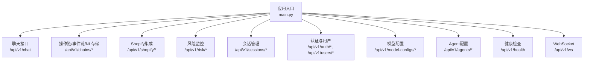
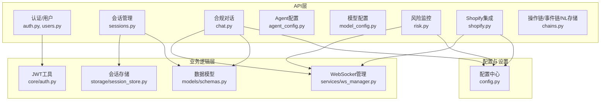
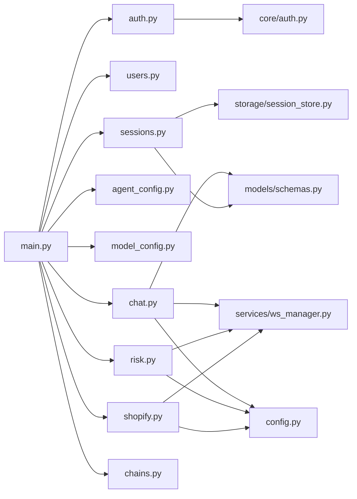

# API参考文档

<cite>
**本文档引用的文件**
- [backend/app/main.py](file://backend/app/main.py)
- [backend/app/api/auth.py](file://backend/app/api/auth.py)
- [backend/app/api/users.py](file://backend/app/api/users.py)
- [backend/app/api/sessions.py](file://backend/app/api/sessions.py)
- [backend/app/api/agent_config.py](file://backend/app/api/agent_config.py)
- [backend/app/api/model_config.py](file://backend/app/api/model_config.py)
- [backend/app/api/risk.py](file://backend/app/api/risk.py)
- [backend/app/api/shopify.py](file://backend/app/api/shopify.py)
- [backend/app/api/chat.py](file://backend/app/api/chat.py)
- [backend/app/api/chains.py](file://backend/app/api/chains.py)
- [backend/app/models/schemas.py](file://backend/app/models/schemas.py)
- [backend/app/core/auth.py](file://backend/app/core/auth.py)
- [backend/app/services/ws_manager.py](file://backend/app/services/ws_manager.py)
- [backend/app/storage/session_store.py](file://backend/app/storage/session_store.py)
- [backend/app/config.py](file://backend/app/config.py)
</cite>

## 目录
1. [简介](#简介)
2. [项目结构](#项目结构)
3. [核心组件](#核心组件)
4. [架构总览](#架构总览)
5. [详细组件分析](#详细组件分析)
6. [依赖分析](#依赖分析)
7. [性能考量](#性能考量)
8. [故障排查指南](#故障排查指南)
9. [结论](#结论)
10. [附录](#附录)

## 简介
本API参考文档面向开发者与集成方，系统性梳理后端提供的RESTful API与WebSocket接口，覆盖认证与用户管理、会话管理、Agent与模型配置、风险监控、Shopify集成、合规对话与操作链/事件链/NL本地存储等模块。文档明确HTTP方法、URL模式、请求参数、响应格式、错误码与安全机制，并提供典型使用示例与最佳实践。

## 项目结构
后端采用FastAPI框架，统一前缀/api/v1，按功能域拆分路由模块，核心入口在应用主文件中注册各模块路由，并提供WebSocket实时推送端点。

**图表来源**
- [backend/app/main.py:21-35](file://backend/app/main.py#L21-L35)

**章节来源**
- [backend/app/main.py:7-35](file://backend/app/main.py#L7-L35)

## 核心组件
- 认证与授权：基于JWT Bearer Token，支持管理员权限校验与可选匿名访问。
- 会话存储：SQLite持久化，支持会话列表、详情与删除。
- WebSocket推送：按用户维度管理连接，推送风险预警与扫描状态。
- 配置中心：模型配置与Agent配置的增删改查与激活。
- 风险监控：预警列表、未读数、手动扫描、仪表盘与Prompt热加载。
- Shopify集成：OAuth授权、产品同步、合规检查、Webhook接收。
- 合规对话：Codex驱动与降级路径，生成结构化合规报告。

**章节来源**
- [backend/app/core/auth.py:19-60](file://backend/app/core/auth.py#L19-L60)
- [backend/app/storage/session_store.py:37-131](file://backend/app/storage/session_store.py#L37-L131)
- [backend/app/services/ws_manager.py:20-95](file://backend/app/services/ws_manager.py#L20-L95)
- [backend/app/api/model_config.py:62-151](file://backend/app/api/model_config.py#L62-L151)
- [backend/app/api/agent_config.py:61-157](file://backend/app/api/agent_config.py#L61-L157)
- [backend/app/api/risk.py:25-153](file://backend/app/api/risk.py#L25-L153)
- [backend/app/api/shopify.py:41-256](file://backend/app/api/shopify.py#L41-L256)
- [backend/app/api/chat.py:205-540](file://backend/app/api/chat.py#L205-L540)

## 架构总览
下图展示API层、业务逻辑层与数据/服务层的关系，以及WebSocket在风险监控中的作用。

**图表来源**
- [backend/app/api/auth.py:16](file://backend/app/api/auth.py#L16)
- [backend/app/api/users.py:9](file://backend/app/api/users.py#L9)
- [backend/app/api/sessions.py:14](file://backend/app/api/sessions.py#L14)
- [backend/app/api/chat.py:42](file://backend/app/api/chat.py#L42)
- [backend/app/api/agent_config.py:16](file://backend/app/api/agent_config.py#L16)
- [backend/app/api/model_config.py:16](file://backend/app/api/model_config.py#L16)
- [backend/app/api/risk.py:20](file://backend/app/api/risk.py#L20)
- [backend/app/api/shopify.py:38](file://backend/app/api/shopify.py#L38)
- [backend/app/api/chains.py:24](file://backend/app/api/chains.py#L24)
- [backend/app/core/auth.py:12](file://backend/app/core/auth.py#L12)
- [backend/app/services/ws_manager.py:20](file://backend/app/services/ws_manager.py#L20)
- [backend/app/storage/session_store.py:21](file://backend/app/storage/session_store.py#L21)
- [backend/app/models/schemas.py:1](file://backend/app/models/schemas.py#L1)
- [backend/app/config.py:5](file://backend/app/config.py#L5)

## 详细组件分析

### 认证与用户管理

- 认证方式
  - JWT Bearer Token，有效期可配置。
  - 登录成功返回access_token与用户角色、ID等信息。
  - 可选匿名访问（聊天接口支持无Token）。

- 端点概览
  - POST /api/v1/auth/login
    - 请求体：用户名、密码
    - 成功：TokenResponse（含access_token、token_type、role、username、user_id）
    - 错误：401 用户名或密码错误
  - POST /api/v1/auth/token
    - 兼容OAuth2PasswordRequestForm（Swagger UI）
  - POST /api/v1/auth/register
    - 请求体：用户名、密码、角色（admin/user）
    - 成功：UserInfoResponse
    - 错误：400 角色非法；409 用户名冲突
  - GET /api/v1/auth/me
    - 成功：UserInfoResponse
  - PUT /api/v1/auth/me/password
    - 请求体：旧密码、新密码（≥6位）
    - 成功：{"ok": true, "message": "密码已修改"}
    - 错误：400 原密码不正确或新密码长度不足

- 用户管理（仅管理员）
  - GET /api/v1/users
    - 成功：用户列表（UserInfo）
  - DELETE /api/v1/users/{user_id}
    - 错误：400 不能删除自己；404 用户不存在
  - PUT /api/v1/users/{user_id}/role
    - 请求体：role=admin/user
    - 错误：400 角色非法或不可修改自身角色；404 用户不存在

- 数据模型
  - TokenResponse、UserInfoResponse、ChangePasswordRequest、RegisterRequest、LoginRequest

- 使用示例（路径）
  - 登录请求体示例：[backend/app/api/auth.py:21-23](file://backend/app/api/auth.py#L21-L23)
  - 注册请求体示例：[backend/app/api/auth.py:26-29](file://backend/app/api/auth.py#L26-L29)
  - 修改密码请求体示例：[backend/app/api/auth.py:32-34](file://backend/app/api/auth.py#L32-L34)
  - 当前用户信息响应示例：[backend/app/models/schemas.py:45-49](file://backend/app/models/schemas.py#L45-L49)

**章节来源**
- [backend/app/api/auth.py:54-107](file://backend/app/api/auth.py#L54-L107)
- [backend/app/api/users.py:23-54](file://backend/app/api/users.py#L23-L54)
- [backend/app/models/schemas.py:45-50](file://backend/app/models/schemas.py#L45-L50)
- [backend/app/core/auth.py:19-60](file://backend/app/core/auth.py#L19-L60)

### 会话管理

- 端点概览
  - GET /api/v1/sessions
    - 描述：普通用户仅看自己的会话，管理员看全部（最近50条）
    - 成功：SessionSummary数组
  - GET /api/v1/sessions/{session_id}
    - 描述：返回会话基本信息+全部消息（含合规结果）
    - 成功：Session
    - 错误：404 会话不存在；403 无权限查看
  - DELETE /api/v1/sessions/{session_id}
    - 成功：{"ok": true}
    - 错误：404 会话不存在；403 无权限删除

- 数据模型
  - Session、SessionSummary、SessionMessage、ComplianceResult

- 使用示例（路径）
  - 会话详情响应示例：[backend/app/models/schemas.py:257-264](file://backend/app/models/schemas.py#L257-L264)

**章节来源**
- [backend/app/api/sessions.py:17-78](file://backend/app/api/sessions.py#L17-L78)
- [backend/app/models/schemas.py:234-264](file://backend/app/models/schemas.py#L234-L264)
- [backend/app/storage/session_store.py:87-167](file://backend/app/storage/session_store.py#L87-L167)

### Agent配置

- 端点概览
  - GET /api/v1/agents
    - 成功：AgentListItem数组（含system_prompt_preview）
  - GET /api/v1/agents/{agent_id}
    - 成功：AgentResponse（含完整system_prompt）
  - POST /api/v1/agents
    - 请求体：AgentUpsertRequest
    - 成功：AgentResponse
  - PUT /api/v1/agents/{agent_id}
    - 请求体：AgentUpsertRequest
    - 成功：AgentResponse
  - DELETE /api/v1/agents/{agent_id}
    - 成功：{"ok": true}
    - 错误：400 内置Agent不可删除或不存在
  - PUT /api/v1/agents/{agent_id}/toggle
    - 请求体：ToggleRequest
    - 成功：{"ok": true, "enabled": bool}

- 数据模型
  - AgentResponse、AgentListItem、AgentUpsertRequest、ToggleRequest

**章节来源**
- [backend/app/api/agent_config.py:61-157](file://backend/app/api/agent_config.py#L61-L157)
- [backend/app/models/schemas.py:21-53](file://backend/app/models/schemas.py#L21-L53)

### 模型配置

- 端点概览
  - GET /api/v1/model-configs
    - 成功：ModelConfigResponse数组（api_key遮蔽显示）
  - GET /api/v1/model-configs/active
    - 成功：ActiveConfigResponse（含完整api_key，通过JWT保护）
  - POST /api/v1/model-configs
    - 请求体：ModelConfigRequest
    - 成功：ModelConfigResponse
  - PUT /api/v1/model-configs/{config_id}
    - 请求体：ModelConfigRequest
    - 成功：ModelConfigResponse
    - 错误：404 预设不存在
  - DELETE /api/v1/model-configs/{config_id}
    - 成功：{"ok": true}
    - 错误：404 预设不存在
  - POST /api/v1/model-configs/{config_id}/activate
    - 成功：{"ok": true, "message": "..."}
    - 错误：404 预设不存在

- 数据模型
  - ModelConfigResponse、ModelConfigRequest、ActiveConfigResponse

**章节来源**
- [backend/app/api/model_config.py:62-151](file://backend/app/api/model_config.py#L62-L151)
- [backend/app/models/schemas.py:21-58](file://backend/app/models/schemas.py#L21-L58)

### 风险监控

- 端点概览
  - GET /api/v1/risk/alerts
    - 查询参数：user_id、alert_type、severity、page、size
    - 成功：{"alerts": [...], "page": ..., "size": ...}
  - GET /api/v1/risk/alerts/unread-count
    - 查询参数：user_id
    - 成功：{"unread_count": ...}
  - POST /api/v1/risk/alerts/{alert_id}/dismiss
    - 路径参数：alert_id
    - 查询参数：user_id
    - 成功：{"status": "ok", "alert_id": ...}
    - 错误：404 Alert not found
  - POST /api/v1/risk/scan
    - 查询参数：user_id
    - 成功：{"status": "completed", "alerts_created": ..., "events_found": ...}
    - 错误：500 Scan failed
  - GET /api/v1/risk/market-status
    - 查询参数：user_id
    - 成功：{"last_scan": "...", "active_alerts": ..., "markets": [...]}
  - GET /api/v1/metrics/dashboard
    - 查询参数：user_id
    - 成功：仪表盘数据
  - POST /api/v1/prompts/reload
    - 成功：{"status": "ok", "reloaded": ..., "prompts": [...]}

- WebSocket推送
  - 扫描开始/完成/错误：type="scan_update"，payload包含status与detail

**章节来源**
- [backend/app/api/risk.py:25-153](file://backend/app/api/risk.py#L25-L153)
- [backend/app/services/ws_manager.py:70-82](file://backend/app/services/ws_manager.py#L70-L82)

### Shopify集成

- 端点概览
  - GET /api/v1/shopify/auth
    - 查询参数：shop（必须以.myshopify.com结尾）
    - 成功：{"authorization_url": "...", "shop": "...", "state": "..."}
    - 错误：400 店铺域名格式错误
  - GET /api/v1/shopify/callback
    - 查询参数：code, shop, state, timestamp, hmac
    - 成功：{"status": "success", "shop": "...", "scope": "...", "message": "..."}
    - 错误：502 授权失败
  - GET /api/v1/shopify/shops
    - 成功：ShopifyShopInfo数组
  - GET /api/v1/shopify/{shop}/products
    - 查询参数：max_count（≤250）
    - 成功：ShopifyProductInfo数组
    - 错误：401 未授权；502 服务异常
  - POST /api/v1/shopify/{shop}/check/{product_id}
    - 请求体：ShopifyComplianceCheckRequest
    - 成功：ChatResponse（含合规结果与来源）
  - POST /api/v1/shopify/webhook
    - 请求头：X-Shopify-Hmac-SHA256、X-Shopify-Topic、X-Shopify-Shop
    - 成功：{"status": "received", "topic": "...", "shop": "..."}

- 数据模型
  - ShopifyAuthRequest、ShopifyCallbackParams、ShopifyShopInfo、ShopifyProductInfo、ShopifyComplianceCheckRequest、ShopifyImportRequest

**章节来源**
- [backend/app/api/shopify.py:41-256](file://backend/app/api/shopify.py#L41-L256)
- [backend/app/models/schemas.py:10-63](file://backend/app/models/schemas.py#L10-L63)

### 合规对话与报告

- 端点概览
  - POST /api/v1/chat
    - 请求体：ComplianceQuery（message, session_id可选）
    - 成功：ChatResponse（message、compliance_result、sources、session_id、action_chain_id、intent）
    - 错误：422 参数校验失败；Codex失败时自动降级

- 处理流程（概览）
  - Codex路径：Codex Agent + MCP工具 + 联网搜索 → 规则引擎 → RAG → 报告
  - 降级路径：NLU → 规则引擎 → RAG → 报告

- 数据模型
  - ComplianceQuery、ChatResponse、ComplianceResult

- 使用示例（路径）
  - 请求体示例：[backend/app/models/schemas.py:73-77](file://backend/app/models/schemas.py#L73-L77)
  - 响应体示例：[backend/app/models/schemas.py:95-104](file://backend/app/models/schemas.py#L95-L104)

**章节来源**
- [backend/app/api/chat.py:205-540](file://backend/app/api/chat.py#L205-L540)
- [backend/app/models/schemas.py:73-104](file://backend/app/models/schemas.py#L73-L104)

### 操作链/事件链/NL本地存储

- 操作链
  - GET /api/v1/chains/actions → ActionChainSummary数组
  - GET /api/v1/chains/actions/{chain_id} → ActionChainSchema
  - GET /api/v1/chains/actions/{chain_id}/trail → 自然语言描述数组

- 事件链
  - GET /api/v1/chains/events → EventChainSummary数组
  - GET /api/v1/chains/events/{chain_id} → EventChainSchema
  - GET /api/v1/chains/events/{chain_id}/timeline → 自然语言时间线数组
  - GET /api/v1/chains/events/{chain_id}/filter → 过滤后的事件列表
  - POST /api/v1/chains/events → 创建事件

- NL本地存储
  - GET /api/v1/nl-store/search → NLSearchResult数组
  - GET /api/v1/nl-store/{namespace} → NLSummaryItem数组
  - GET /api/v1/nl-store/{namespace}/{key} → NLRecordSchema
  - POST /api/v1/nl-store/{namespace} → NLRecordSchema
  - PUT /api/v1/nl-store/{namespace}/{key} → NLRecordSchema
  - DELETE /api/v1/nl-store/{namespace}/{key} → {"status": "deleted", ...}

- 数据模型
  - ActionChainSchema/Summary、EventChainSchema/Summary、EventCreateRequest、NLRecordSchema/Requests、NLSearchResult/NLSummaryItem

**章节来源**
- [backend/app/api/chains.py:31-281](file://backend/app/api/chains.py#L31-L281)
- [backend/app/models/schemas.py:106-232](file://backend/app/models/schemas.py#L106-L232)

### WebSocket接口

- 端点
  - WS /api/v1/ws
    - 查询参数：user_id（默认"default"）
    - 协议：JSON消息，{"type": "alert" | "scan_update", "payload": {...}}
    - 事件类型：
      - alert：推送单条风险预警
      - scan_update：推送扫描状态（scanning/completed/error）

- 连接处理
  - 建立连接后接受并注册
  - 保持连接直至客户端断开
  - 断开时清理连接集合

- 使用示例（路径）
  - 连接示例（前端）：[backend/app/main.py:40-55](file://backend/app/main.py#L40-L55)
  - 消息格式与事件类型：[backend/app/services/ws_manager.py:46-82](file://backend/app/services/ws_manager.py#L46-L82)

**章节来源**
- [backend/app/main.py:40-55](file://backend/app/main.py#L40-L55)
- [backend/app/services/ws_manager.py:20-95](file://backend/app/services/ws_manager.py#L20-L95)

## 依赖分析

**图表来源**
- [backend/app/main.py:21-30](file://backend/app/main.py#L21-L30)
- [backend/app/api/auth.py:8](file://backend/app/api/auth.py#L8)
- [backend/app/api/users.py:6](file://backend/app/api/users.py#L6)
- [backend/app/api/sessions.py:11](file://backend/app/api/sessions.py#L11)
- [backend/app/api/agent_config.py:8](file://backend/app/api/agent_config.py#L8)
- [backend/app/api/model_config.py:8](file://backend/app/api/model_config.py#L8)
- [backend/app/api/risk.py:8](file://backend/app/api/risk.py#L8)
- [backend/app/api/shopify.py:25](file://backend/app/api/shopify.py#L25)
- [backend/app/api/chat.py:14](file://backend/app/api/chat.py#L14)
- [backend/app/api/chains.py:19](file://backend/app/api/chains.py#L19)
- [backend/app/core/auth.py:12](file://backend/app/core/auth.py#L12)
- [backend/app/storage/session_store.py:21](file://backend/app/storage/session_store.py#L21)
- [backend/app/services/ws_manager.py:20](file://backend/app/services/ws_manager.py#L20)
- [backend/app/models/schemas.py:1](file://backend/app/models/schemas.py#L1)
- [backend/app/config.py:5](file://backend/app/config.py#L5)

**章节来源**
- [backend/app/main.py:21-30](file://backend/app/main.py#L21-L30)

## 性能考量
- 会话列表限制：默认最多返回50条，避免大数据量查询。
- 分页与筛选：风险预警列表支持分页与筛选，建议前端合理设置page与size。
- RAG检索：在降级路径中进行检索，注意网络延迟与外部API调用成本。
- Codex降级：当Codex不可用时自动切换至NLU→规则引擎→RAG，保障基本能力。
- WebSocket：按用户维度维护连接集合，避免广播风暴；发送失败自动清理死连接。
- 存储索引：会话存储已建立必要索引，确保查询效率。

[本节为通用性能建议，不直接分析具体文件]

## 故障排查指南
- 认证相关
  - 401 无效或过期Token：检查JWT密钥与过期时间配置。
  - 403 需要管理员权限：确认用户角色为admin。
  - 409 用户名冲突：注册时用户名已被占用。
- 会话相关
  - 404 会话不存在：检查session_id是否正确。
  - 403 无权限：非管理员尝试访问他人会话。
- 风险监控
  - 500 扫描失败：检查外部服务连通性与凭据。
  - 404 Alert not found：确认alert_id存在。
- Shopify
  - 400 店铺域名格式错误：确保以.myshopify.com结尾。
  - 401 未授权：检查OAuth授权状态与令牌有效性。
  - 502 服务异常：检查Shopify API可用性与回调参数。
- WebSocket
  - 连接断开：检查前端是否主动断开或网络异常。
  - 未收到推送：确认user_id一致且存在活跃连接。

**章节来源**
- [backend/app/api/auth.py:58-68](file://backend/app/api/auth.py#L58-L68)
- [backend/app/api/auth.py:87-89](file://backend/app/api/auth.py#L87-L89)
- [backend/app/api/sessions.py:37-42](file://backend/app/api/sessions.py#L37-L42)
- [backend/app/api/sessions.py:73-76](file://backend/app/api/sessions.py#L73-L76)
- [backend/app/api/risk.py:105-107](file://backend/app/api/risk.py#L105-L107)
- [backend/app/api/risk.py:56-58](file://backend/app/api/risk.py#L56-L58)
- [backend/app/api/shopify.py:51-55](file://backend/app/api/shopify.py#L51-L55)
- [backend/app/api/shopify.py:123-124](file://backend/app/api/shopify.py#L123-L124)
- [backend/app/services/ws_manager.py:55-63](file://backend/app/services/ws_manager.py#L55-L63)

## 结论
本API体系围绕合规场景构建，提供从认证、会话、配置到风险监控与Shopify集成的完整能力。通过清晰的REST规范与WebSocket实时推送，满足多端协同与自动化运营需求。建议在生产环境完善限流、缓存与监控策略，并持续优化RAG检索与外部服务调用的稳定性。

[本节为总结性内容，不直接分析具体文件]

## 附录

### API版本控制与兼容性
- 版本前缀：/api/v1
- 当前版本：0.2.0
- 兼容性说明：新增端点遵循同前缀，尽量避免破坏性变更；如需重大调整，将在后续版本中明确迁移指引。

**章节来源**
- [backend/app/main.py:7-11](file://backend/app/main.py#L7-L11)
- [backend/app/main.py:33-35](file://backend/app/main.py#L33-L35)

### 安全与认证
- 认证方式：JWT Bearer Token
- 依赖注入：OAuth2PasswordBearer，tokenUrl指向登录端点
- 管理员权限：require_admin依赖get_current_user进行角色校验
- 配置项：jwt_secret、jwt_expire_hours

**章节来源**
- [backend/app/core/auth.py:12](file://backend/app/core/auth.py#L12)
- [backend/app/core/auth.py:41-59](file://backend/app/core/auth.py#L41-L59)
- [backend/app/config.py:65-67](file://backend/app/config.py#L65-L67)

### 错误码与语义
- 200 OK：请求成功
- 204 No Content：请求成功但无返回体（如删除成功）
- 400 Bad Request：参数错误或业务规则不满足
- 401 Unauthorized：认证失败或Token无效
- 403 Forbidden：权限不足
- 404 Not Found：资源不存在
- 422 Unprocessable Entity：请求参数校验失败
- 500 Internal Server Error：服务器内部错误

**章节来源**
- [backend/app/api/auth.py:58-68](file://backend/app/api/auth.py#L58-L68)
- [backend/app/api/auth.py:87-89](file://backend/app/api/auth.py#L87-L89)
- [backend/app/api/sessions.py:37-42](file://backend/app/api/sessions.py#L37-L42)
- [backend/app/api/sessions.py:73-76](file://backend/app/api/sessions.py#L73-L76)
- [backend/app/api/risk.py:105-107](file://backend/app/api/risk.py#L105-L107)
- [backend/app/api/risk.py:56-58](file://backend/app/api/risk.py#L56-L58)
- [backend/app/api/shopify.py:123-124](file://backend/app/api/shopify.py#L123-L124)

### Rate Limiting与性能优化建议
- 限流策略：建议在网关或中间件层实现基于IP/用户ID的速率限制，防止滥用。
- 缓存：对只读接口（如Agent/模型配置列表、会话列表）引入短期缓存，降低数据库压力。
- 异步处理：对外部服务调用（如Shopify、Codex）采用异步与超时控制，避免阻塞。
- 分页与筛选：前端合理设置分页大小与筛选条件，减少一次性传输大量数据。
- WebSocket：避免频繁广播，按用户维度精准推送；对发送失败的连接及时清理。

[本节为通用建议，不直接分析具体文件]