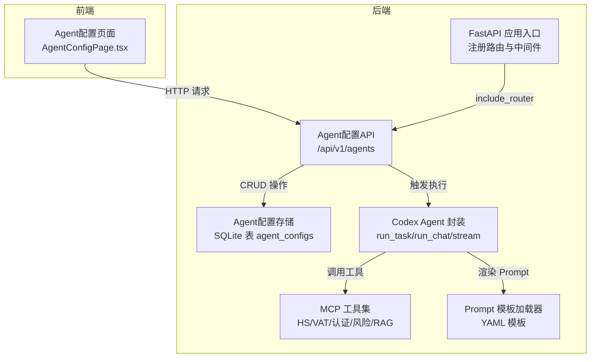
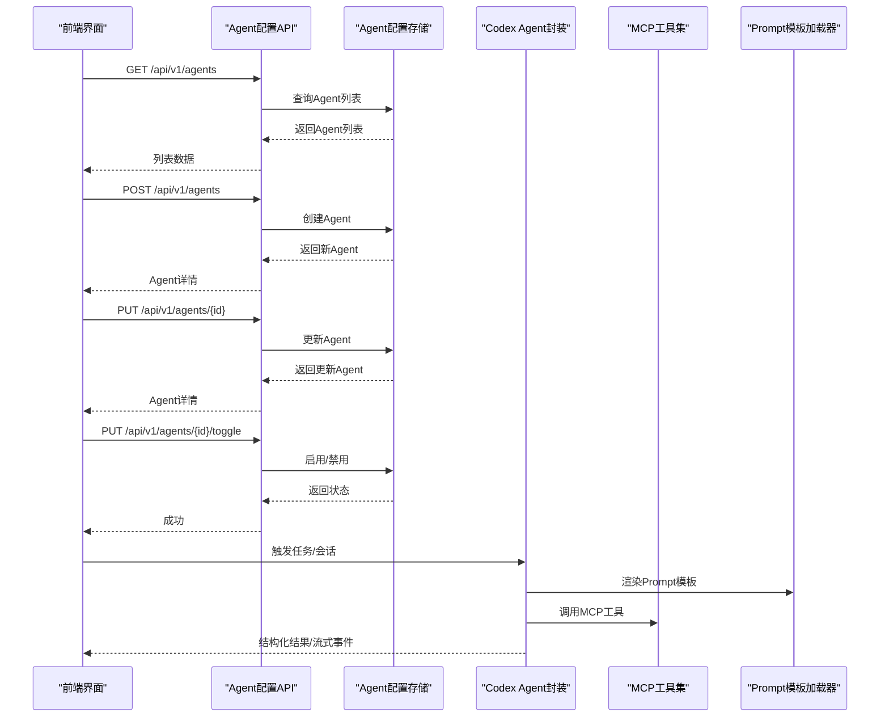
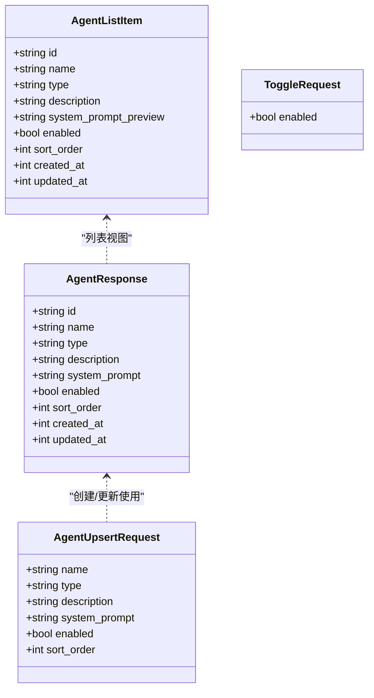
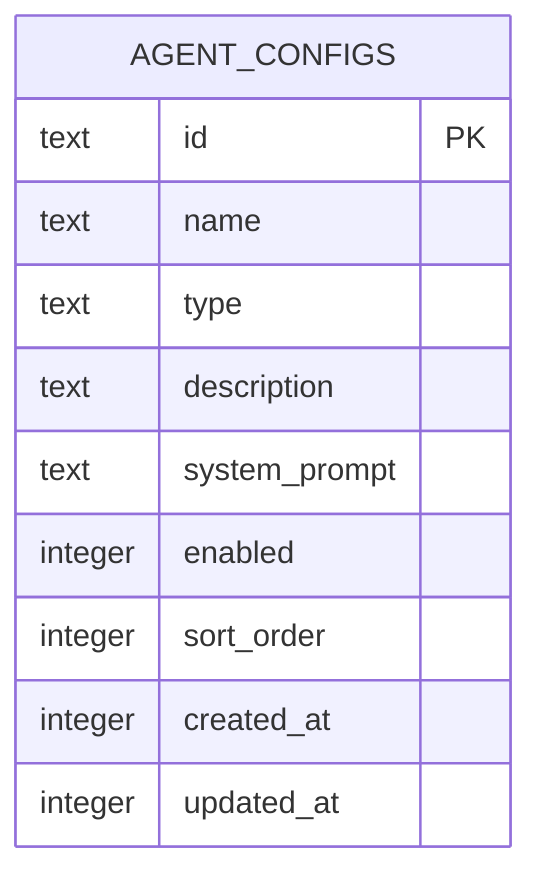
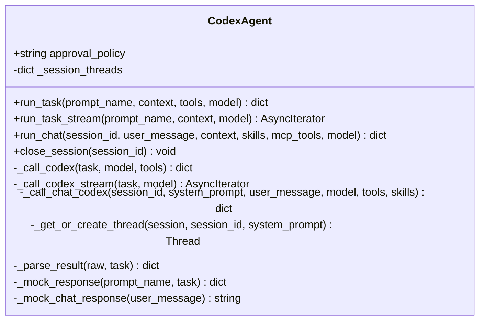
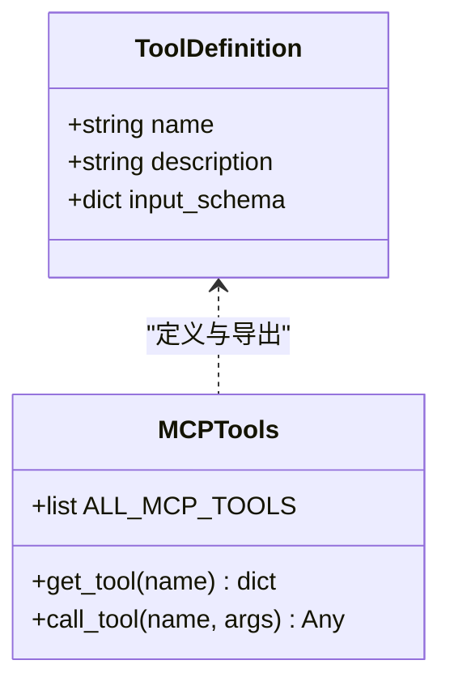
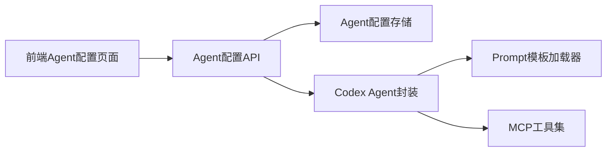

# Agent配置API

<cite>
**本文档引用的文件**
- [backend/app/api/agent_config.py](file://backend/app/api/agent_config.py)
- [backend/app/storage/agent_config_store.py](file://backend/app/storage/agent_config_store.py)
- [backend/app/services/codex_agent.py](file://backend/app/services/codex_agent.py)
- [backend/app/services/codex_tools.py](file://backend/app/services/codex_tools.py)
- [backend/app/services/prompt_loader.py](file://backend/app/services/prompt_loader.py)
- [backend/app/models/schemas.py](file://backend/app/models/schemas.py)
- [backend/app/core/action_chain.py](file://backend/app/core/action_chain.py)
- [backend/app/core/metrics.py](file://backend/app/core/metrics.py)
- [backend/app/main.py](file://backend/app/main.py)
- [backend/app/config.py](file://backend/app/config.py)
- [backend/data/prompts/chat_compliance.yaml](file://backend/data/prompts/chat_compliance.yaml)
- [frontend/src/pages/AgentConfigPage.tsx](file://frontend/src/pages/AgentConfigPage.tsx)
- [backend/README.md](file://backend/README.md)
</cite>

## 目录
1. [简介](#简介)
2. [项目结构](#项目结构)
3. [核心组件](#核心组件)
4. [架构概览](#架构概览)
5. [详细组件分析](#详细组件分析)
6. [依赖关系分析](#依赖关系分析)
7. [性能考虑](#性能考虑)
8. [故障排查指南](#故障排查指南)
9. [结论](#结论)
10. [附录](#附录)

## 简介
本文件系统化梳理了“Agent配置API”的完整实现，涵盖多Agent配置管理、技能与工具集成、工作流与任务执行、监控与诊断、最佳实践与扩展指南，并提供前后端集成与调试方法。该API采用FastAPI构建，支持管理员全量管理与普通用户只读访问，底层通过SQLite存储Agent配置，结合Codex SDK实现多Agent工作流与合规检查。

## 项目结构
- 后端入口与路由注册位于应用入口文件，Agent配置API挂载在统一前缀下。
- Agent配置API负责Agent的增删改查、启停控制与列表展示。
- 存储层使用SQLite表存储Agent配置，包含默认内置Agent与用户自定义Agent。
- 业务层通过Codex Agent封装实现任务执行与多轮对话，工具层提供MCP工具集。
- 前端提供Agent配置管理界面，支持新建、编辑、启用/禁用与删除。

**图表来源**
- [backend/app/main.py:21-30](file://backend/app/main.py#L21-L30)
- [backend/app/api/agent_config.py:16-174](file://backend/app/api/agent_config.py#L16-L174)
- [backend/app/storage/agent_config_store.py:163-310](file://backend/app/storage/agent_config_store.py#L163-L310)
- [backend/app/services/codex_agent.py:40-372](file://backend/app/services/codex_agent.py#L40-L372)
- [backend/app/services/codex_tools.py:34-242](file://backend/app/services/codex_tools.py#L34-L242)
- [backend/app/services/prompt_loader.py:23-79](file://backend/app/services/prompt_loader.py#L23-L79)
- [frontend/src/pages/AgentConfigPage.tsx:1-450](file://frontend/src/pages/AgentConfigPage.tsx#L1-L450)

**章节来源**
- [backend/app/main.py:21-30](file://backend/app/main.py#L21-L30)
- [backend/README.md:9-31](file://backend/README.md#L9-L31)

## 核心组件
- Agent配置API：提供列表、详情、创建、更新、删除、启停等端点，权限控制为管理员可写、普通用户只读。
- Agent配置存储：SQLite表结构与默认内置Agent初始化逻辑，支持启用/禁用与排序。
- Codex Agent封装：统一的任务执行与多轮对话接口，屏蔽底层SDK协议细节。
- MCP工具集：将规则引擎函数包装为Codex可调用的MCP工具，支持HS编码、VAT税率、认证要求、风险评估、RAG检索等。
- Prompt模板加载器：从YAML模板渲染系统提示词，支持热加载。
- 前端Agent配置页面：提供可视化配置界面，支持管理员操作。

**章节来源**
- [backend/app/api/agent_config.py:19-174](file://backend/app/api/agent_config.py#L19-L174)
- [backend/app/storage/agent_config_store.py:10-158](file://backend/app/storage/agent_config_store.py#L10-L158)
- [backend/app/services/codex_agent.py:40-372](file://backend/app/services/codex_agent.py#L40-L372)
- [backend/app/services/codex_tools.py:34-242](file://backend/app/services/codex_tools.py#L34-L242)
- [backend/app/services/prompt_loader.py:23-79](file://backend/app/services/prompt_loader.py#L23-L79)
- [frontend/src/pages/AgentConfigPage.tsx:50-151](file://frontend/src/pages/AgentConfigPage.tsx#L50-L151)

## 架构概览
Agent配置API贯穿“配置—执行—监控—反馈”闭环：
- 配置阶段：管理员通过API创建/更新Agent，设置System Prompt、类型、启用状态与排序。
- 执行阶段：Codex Agent封装根据Prompt模板与工具集执行任务或会话，支持流式事件推送。
- 监控阶段：操作链记录每步动作，指标模块聚合用户健康度与趋势，WebSocket实时推送。
- 反馈阶段：前端界面展示Agent状态与操作链轨迹，便于审计与优化。

**图表来源**
- [backend/app/api/agent_config.py:61-157](file://backend/app/api/agent_config.py#L61-L157)
- [backend/app/storage/agent_config_store.py:203-294](file://backend/app/storage/agent_config_store.py#L203-L294)
- [backend/app/services/codex_agent.py:55-160](file://backend/app/services/codex_agent.py#L55-L160)
- [backend/app/services/codex_tools.py:235-242](file://backend/app/services/codex_tools.py#L235-L242)
- [backend/app/services/prompt_loader.py:54-70](file://backend/app/services/prompt_loader.py#L54-L70)

## 详细组件分析

### Agent配置API
- 端点设计
  - GET /api/v1/agents：返回Agent列表（含预览），支持管理员与普通用户。
  - GET /api/v1/agents/{agent_id}：返回Agent完整配置（含System Prompt），支持管理员与普通用户。
  - POST /api/v1/agents：创建Agent（管理员）。
  - PUT /api/v1/agents/{agent_id}：更新Agent（管理员）。
  - DELETE /api/v1/agents/{agent_id}：删除Agent（管理员，内置Agent不可删除）。
  - PUT /api/v1/agents/{agent_id}/toggle：启用/禁用Agent（管理员）。
- 权限控制：使用依赖注入校验当前用户与管理员权限。
- 数据模型：请求/响应模型与列表项模型分离，列表项不含完整System Prompt以节省带宽。

**图表来源**
- [backend/app/api/agent_config.py:21-57](file://backend/app/api/agent_config.py#L21-L57)

**章节来源**
- [backend/app/api/agent_config.py:61-157](file://backend/app/api/agent_config.py#L61-L157)

### Agent配置存储
- 表结构：agent_configs(id, name, type, description, system_prompt, enabled, sort_order, created_at, updated_at)。
- 默认内置Agent：通用合规、出境法律、税务、民俗文化、认证标准等，初始化时写入数据库。
- CRUD接口：列表、详情、创建/更新、删除（内置Agent不可删除）、启用/禁用、按类型查询。
- 系统提示词：提供通用合规Agent的System Prompt获取方法，作为NLU意图解析的基础。

**图表来源**
- [backend/app/storage/agent_config_store.py:163-178](file://backend/app/storage/agent_config_store.py#L163-L178)

**章节来源**
- [backend/app/storage/agent_config_store.py:24-158](file://backend/app/storage/agent_config_store.py#L24-L158)
- [backend/app/storage/agent_config_store.py:203-310](file://backend/app/storage/agent_config_store.py#L203-L310)

### Codex Agent封装
- 能力矩阵：联网搜索、CLI智能、复杂推理、工具调用（MCP）、Skills、多轮会话。
- 接口设计：
  - run_task：单次任务，使用临时Thread，返回结构化结果。
  - run_task_stream：流式版本，逐事件推送。
  - run_chat：多轮会话，使用持久化Thread，支持Skills与MCP工具。
- 错误处理：封装CodexAgentError，兼容codex-client API不兼容场景，提供降级响应。
- 会话管理：维护session_id到thread_id映射，支持关闭会话释放资源。

**图表来源**
- [backend/app/services/codex_agent.py:40-372](file://backend/app/services/codex_agent.py#L40-L372)

**章节来源**
- [backend/app/services/codex_agent.py:55-235](file://backend/app/services/codex_agent.py#L55-L235)

### MCP工具集
- 工具定义：HS编码查询、VAT税率查询、认证要求查询、风险评估、合规检查、RAG检索、物流要求、文化注意事项。
- 工具函数映射：将工具名映射到规则引擎函数，异步执行。
- 导出列表：ALL_MCP_TOOLS包含全部合规工具，Codex Agent默认加载。

**图表来源**
- [backend/app/services/codex_tools.py:34-242](file://backend/app/services/codex_tools.py#L34-L242)

**章节来源**
- [backend/app/services/codex_tools.py:183-242](file://backend/app/services/codex_tools.py#L183-L242)

### Prompt模板加载器
- 功能：从YAML模板目录加载与渲染Prompt，支持全局缓存与热加载。
- 与Codex集成：Codex Agent在执行任务/会话前通过渲染器生成系统提示词。

**章节来源**
- [backend/app/services/prompt_loader.py:23-79](file://backend/app/services/prompt_loader.py#L23-L79)
- [backend/app/services/codex_agent.py:79-88](file://backend/app/services/codex_agent.py#L79-L88)

### 前端集成与界面
- 页面职责：管理员可新建、编辑、启用/禁用、删除Agent；普通用户只读查看。
- 数据交互：通过authFetch调用后端API，支持错误提示与成功反馈。
- 内置Agent保护：禁止删除内置Agent ID集合中的条目。

**章节来源**
- [frontend/src/pages/AgentConfigPage.tsx:50-151](file://frontend/src/pages/AgentConfigPage.tsx#L50-L151)

## 依赖关系分析
- API依赖存储层提供CRUD能力，依赖Codex Agent封装执行任务与会话。
- Codex Agent依赖Prompt加载器与MCP工具集，内部通过配置控制模型与审批策略。
- 前端依赖API提供Agent配置管理能力，支持管理员操作与只读展示。

**图表来源**
- [backend/app/api/agent_config.py:7-14](file://backend/app/api/agent_config.py#L7-L14)
- [backend/app/services/codex_agent.py:25-27](file://backend/app/services/codex_agent.py#L25-L27)
- [backend/app/services/prompt_loader.py:10-13](file://backend/app/services/prompt_loader.py#L10-L13)
- [backend/app/services/codex_tools.py:20-31](file://backend/app/services/codex_tools.py#L20-L31)
- [frontend/src/pages/AgentConfigPage.tsx:4-10](file://frontend/src/pages/AgentConfigPage.tsx#L4-L10)

**章节来源**
- [backend/app/api/agent_config.py:3-14](file://backend/app/api/agent_config.py#L3-L14)
- [backend/app/services/codex_agent.py:25-27](file://backend/app/services/codex_agent.py#L25-L27)
- [backend/app/services/codex_tools.py:20-31](file://backend/app/services/codex_tools.py#L20-L31)
- [backend/app/services/prompt_loader.py:10-13](file://backend/app/services/prompt_loader.py#L10-L13)
- [frontend/src/pages/AgentConfigPage.tsx:4-10](file://frontend/src/pages/AgentConfigPage.tsx#L4-L10)

## 性能考虑
- 列表预览：列表接口返回预览字段，避免传输完整System Prompt，减少带宽占用。
- 缓存与热加载：Prompt模板加载器提供全局缓存与热加载，避免重复I/O并支持微调后即时生效。
- 会话复用：Codex Agent维护session_id到thread_id映射，复用持久化Thread，降低上下文切换成本。
- 降级策略：当Codex不可用或API不兼容时，提供模拟响应，保证系统可用性。
- 数据库初始化：启动时自动初始化默认Agent，避免运行期动态写入带来的延迟。

**章节来源**
- [backend/app/api/agent_config.py:33-79](file://backend/app/api/agent_config.py#L33-L79)
- [backend/app/services/prompt_loader.py:15-51](file://backend/app/services/prompt_loader.py#L15-L51)
- [backend/app/services/codex_agent.py:236-254](file://backend/app/services/codex_agent.py#L236-L254)
- [backend/app/storage/agent_config_store.py:183-198](file://backend/app/storage/agent_config_store.py#L183-L198)

## 故障排查指南
- Agent不存在：查询Agent详情或启停操作返回404，检查agent_id是否正确。
- 内置Agent不可删除：删除内置Agent会返回错误，确认ID是否属于内置集合。
- Codex不可用：当codex_enabled为False或API不兼容时，返回降级响应；检查配置与SDK版本。
- Prompt模板缺失：渲染Prompt时找不到模板会抛出异常，检查模板文件是否存在与命名一致。
- 权限不足：非管理员调用创建/更新/删除/启停端点会失败，确认JWT令牌与角色。
- WebSocket推送：前端通过WebSocket接收实时消息，若无推送，检查后端WebSocket端点与连接状态。

**章节来源**
- [backend/app/api/agent_config.py:91-92](file://backend/app/api/agent_config.py#L91-L92)
- [backend/app/api/agent_config.py:147-148](file://backend/app/api/agent_config.py#L147-L148)
- [backend/app/services/codex_agent.py:225-234](file://backend/app/services/codex_agent.py#L225-L234)
- [backend/app/services/prompt_loader.py:38-42](file://backend/app/services/prompt_loader.py#L38-L42)
- [backend/app/main.py:40-56](file://backend/app/main.py#L40-L56)

## 结论
Agent配置API提供了完整的多Agent生命周期管理能力，结合Codex SDK与MCP工具集实现了强大的合规检查与对话能力。通过SQLite存储默认Agent与用户自定义Agent，配合前端可视化界面，管理员可以灵活配置Agent的行为与输出。同时，完善的错误处理、降级策略与监控指标为系统稳定性与可观测性提供了保障。

## 附录

### API定义与使用示例
- 获取Agent列表
  - 方法：GET
  - 路径：/api/v1/agents
  - 权限：管理员/普通用户
  - 响应：Agent列表（含预览）
- 获取Agent详情
  - 方法：GET
  - 路径：/api/v1/agents/{agent_id}
  - 权限：管理员/普通用户
  - 响应：Agent完整配置（含System Prompt）
- 创建Agent
  - 方法：POST
  - 路径：/api/v1/agents
  - 权限：管理员
  - 请求体：AgentUpsertRequest
  - 响应：AgentResponse
- 更新Agent
  - 方法：PUT
  - 路径：/api/v1/agents/{agent_id}
  - 权限：管理员
  - 请求体：AgentUpsertRequest
  - 响应：AgentResponse
- 删除Agent
  - 方法：DELETE
  - 路径：/api/v1/agents/{agent_id}
  - 权限：管理员
  - 响应：{"ok": true}
- 启用/禁用Agent
  - 方法：PUT
  - 路径：/api/v1/agents/{agent_id}/toggle
  - 权限：管理员
  - 请求体：{"enabled": true|false}
  - 响应：{"ok": true, "enabled": true|false}

**章节来源**
- [backend/app/api/agent_config.py:61-157](file://backend/app/api/agent_config.py#L61-L157)

### 数据模型与参数设置
- AgentResponse：包含id、name、type、description、system_prompt、enabled、sort_order、created_at、updated_at。
- AgentListItem：列表视图，包含预览字段system_prompt_preview。
- AgentUpsertRequest：创建/更新请求体，包含name、type、description、system_prompt、enabled、sort_order。
- ToggleRequest：启停请求体，包含enabled布尔值。

**章节来源**
- [backend/app/api/agent_config.py:21-57](file://backend/app/api/agent_config.py#L21-L57)

### 状态管理与工作流
- Agent状态：enabled字段控制启用/禁用；sort_order控制排序。
- 工作流：Codex Agent封装提供run_task与run_chat两类执行模式，前者使用临时Thread，后者使用持久化Thread并支持Skills与MCP工具。
- 操作链：ActionChain记录每步操作，支持保存、加载与回溯展示。

**章节来源**
- [backend/app/storage/agent_config_store.py:286-294](file://backend/app/storage/agent_config_store.py#L286-L294)
- [backend/app/services/codex_agent.py:55-160](file://backend/app/services/codex_agent.py#L55-L160)
- [backend/app/core/action_chain.py:77-184](file://backend/app/core/action_chain.py#L77-L184)

### 性能监控与资源统计
- 指标模块：聚合用户级仪表盘数据，包括产品总数、风险分布、最近预警、活跃市场、健康分与趋势。
- 操作链追踪：记录每步操作的开始/结束、耗时与状态，支持可视化链路展示。
- WebSocket：实时推送消息，前端可订阅用户维度的告警与扫描更新。

**章节来源**
- [backend/app/core/metrics.py:20-46](file://backend/app/core/metrics.py#L20-L46)
- [backend/app/core/action_chain.py:143-184](file://backend/app/core/action_chain.py#L143-L184)
- [backend/app/main.py:40-56](file://backend/app/main.py#L40-L56)

### 最佳实践与扩展指南
- System Prompt编写：通用合规Agent需在末尾明确JSON输出格式要求；专项Agent需清晰定义专业边界与输出风格。
- 工具选择：根据业务场景选择合适的MCP工具组合，避免过度调用导致延迟。
- Prompt热加载：微调后可通过reload_all刷新缓存，无需重启服务。
- 内置Agent保护：不要删除内置Agent ID集合中的条目，避免破坏系统基础能力。
- 配置优先级：通过配置文件设置Codex模型与审批策略，确保一致性与可运维性。

**章节来源**
- [frontend/src/pages/AgentConfigPage.tsx:407-414](file://frontend/src/pages/AgentConfigPage.tsx#L407-L414)
- [backend/app/services/prompt_loader.py:49-51](file://backend/app/services/prompt_loader.py#L49-L51)
- [backend/app/config.py:10-16](file://backend/app/config.py#L10-L16)

### 配置示例与调试方法
- 环境变量：参考项目根目录示例文件，配置API密钥、Base URL与Codex相关参数。
- 启动顺序：先启动基础设施（如ChromaDB），再初始化知识库，最后启动后端与前端。
- 健康检查：调用健康检查端点确认服务可用。
- 调试技巧：开启调试模式，观察日志输出；在Codex不可用时使用降级响应验证前端交互。

**章节来源**
- [backend/README.md:41-76](file://backend/README.md#L41-L76)
- [backend/app/main.py:33-35](file://backend/app/main.py#L33-L35)
- [backend/app/config.py:8-9](file://backend/app/config.py#L8-L9)