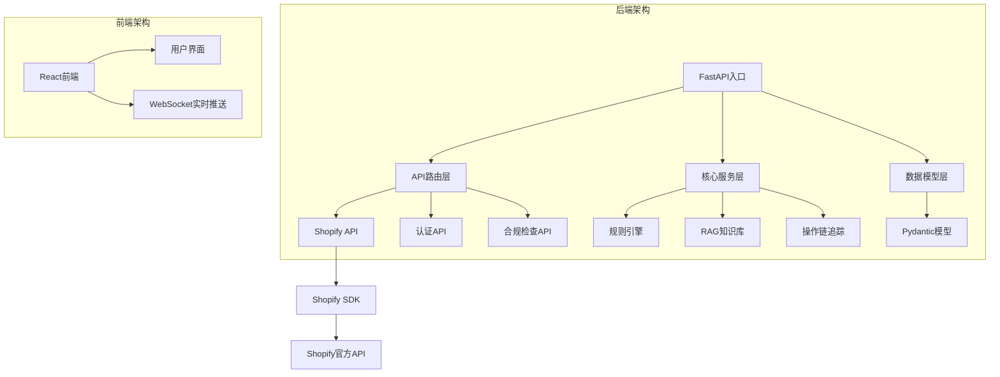
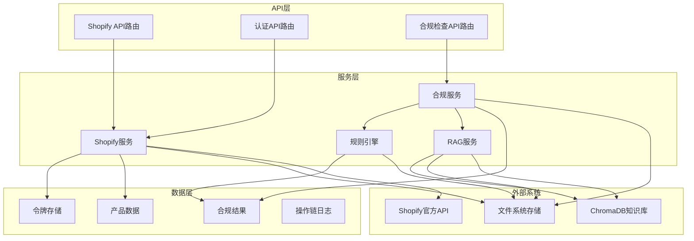
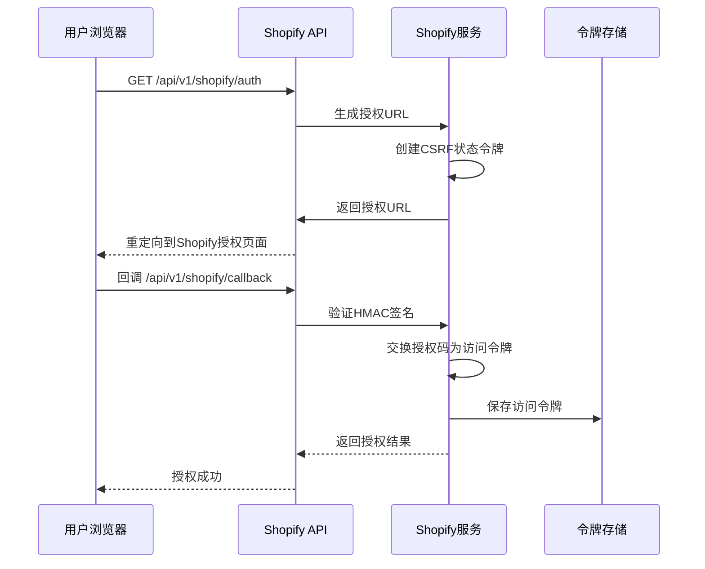
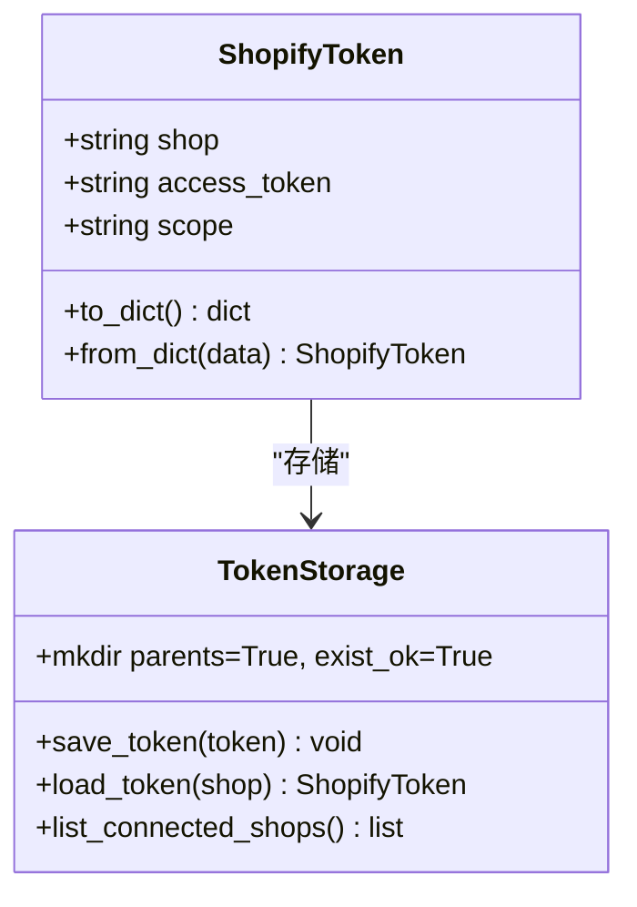
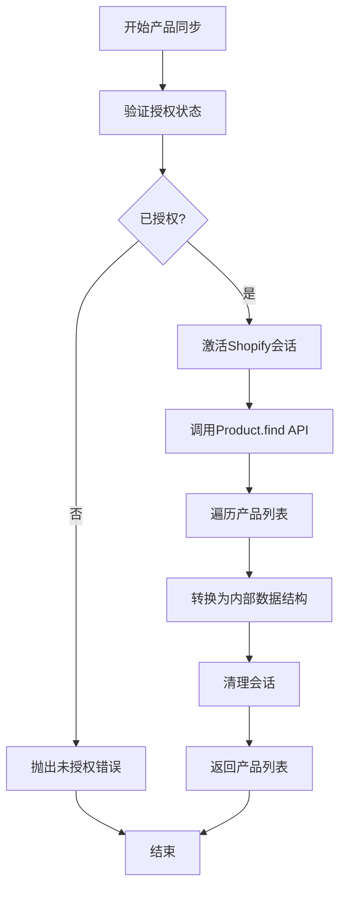
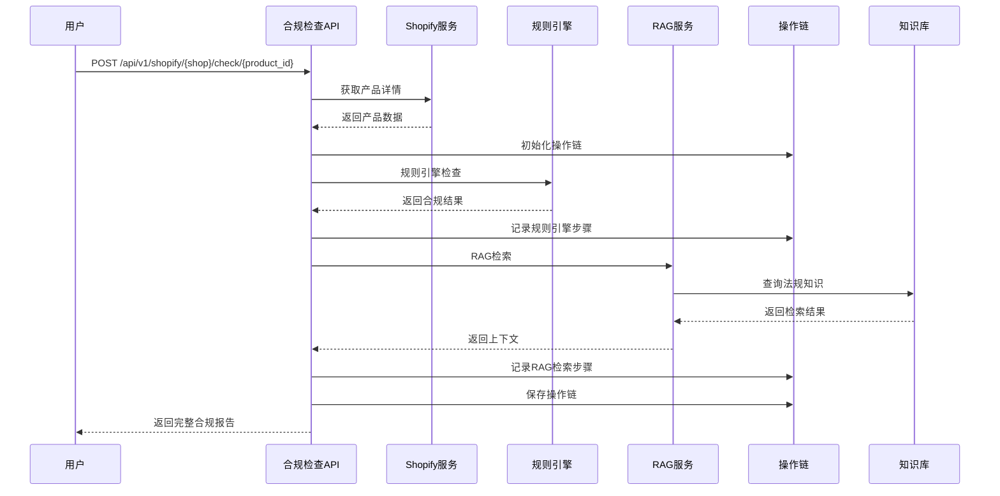
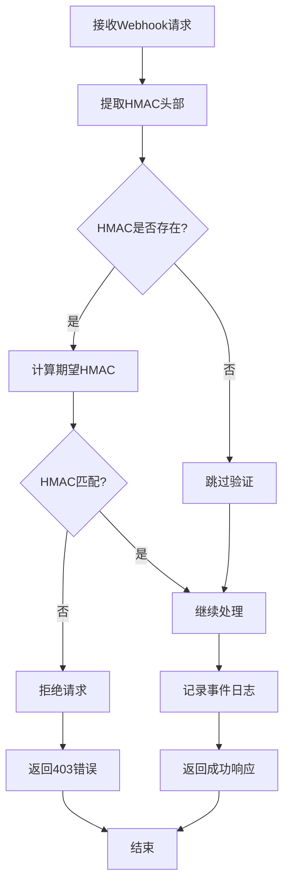
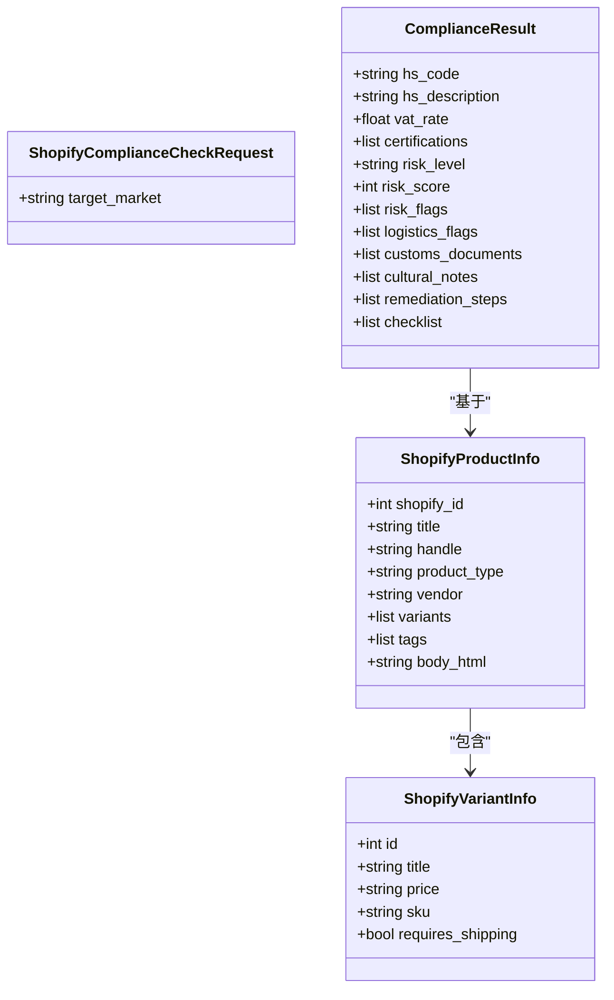
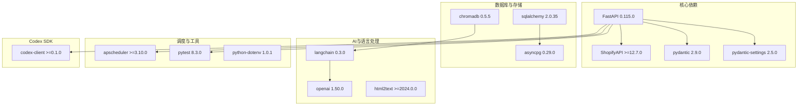
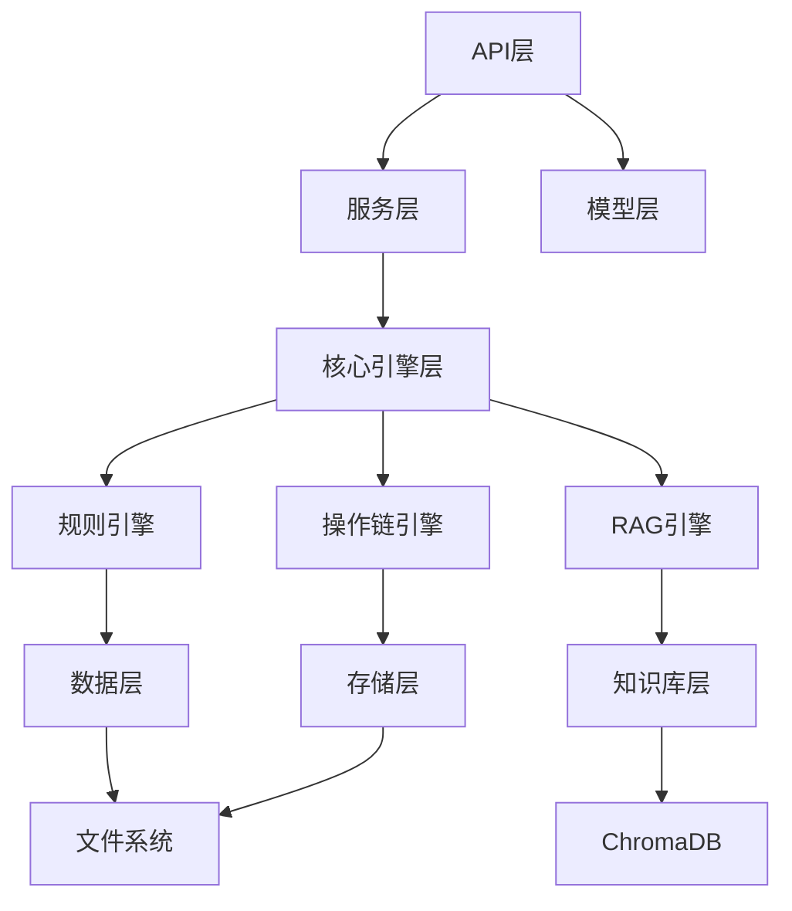

# Shopify集成API

<cite>
**本文引用的文件**
- [backend/app/api/shopify.py](file://backend/app/api/shopify.py)
- [backend/app/services/shopify.py](file://backend/app/services/shopify.py)
- [backend/app/models/schemas.py](file://backend/app/models/schemas.py)
- [backend/app/core/rule_engine.py](file://backend/app/core/rule_engine.py)
- [backend/app/core/rag.py](file://backend/app/core/rag.py)
- [backend/app/core/action_chain.py](file://backend/app/core/action_chain.py)
- [backend/app/config.py](file://backend/app/config.py)
- [backend/requirements.txt](file://backend/requirements.txt)
- [README.md](file://README.md)
- [backend/data/regulations.md](file://backend/data/regulations.md)
- [backend/app/knowledge/store.py](file://backend/app/knowledge/store.py)
- [backend/app/services/compliance.py](file://backend/app/services/compliance.py)
- [backend/app/api/auth.py](file://backend/app/api/auth.py)
- [backend/app/core/risk_alert.py](file://backend/app/core/risk_alert.py)
</cite>

## 目录
1. [简介](#简介)
2. [项目结构](#项目结构)
3. [核心组件](#核心组件)
4. [架构概览](#架构概览)
5. [详细组件分析](#详细组件分析)
6. [依赖分析](#依赖分析)
7. [性能考虑](#性能考虑)
8. [故障排除指南](#故障排除指南)
9. [结论](#结论)
10. [附录](#附录)

## 简介
本文档详细记录了避风港项目的Shopify集成API，涵盖Shopify店铺连接、产品同步、订单查询等电商集成接口。文档说明了Shopify API认证机制、Webhook处理和数据同步流程，记录了产品合规检查、库存管理和销售数据分析功能。同时包含Shopify应用配置、权限授权和数据安全传输的最佳实践，以及完整的API使用示例和集成指南。

## 项目结构
避风港项目采用前后端分离架构，后端基于FastAPI框架，提供RESTful API接口。项目结构清晰，模块化程度高，便于维护和扩展。



**图表来源**
- [README.md:92-200](file://README.md#L92-L200)

**章节来源**
- [README.md:92-200](file://README.md#L92-L200)

## 核心组件
Shopify集成API的核心组件包括认证服务、产品同步服务、合规检查服务和Webhook处理服务。这些组件协同工作，为用户提供完整的Shopify电商集成解决方案。

### 认证组件
- **OAuth授权流程**：支持Shopify OAuth 2.0授权，包括授权URL生成、回调处理和令牌管理
- **令牌存储**：安全存储Shopify访问令牌，支持多店铺管理
- **会话管理**：基于Shopify SDK的会话管理，确保API调用的安全性

### 产品同步组件
- **产品数据获取**：通过Shopify Admin API获取产品列表和详情
- **数据转换**：将Shopify产品数据转换为内部统一的数据结构
- **批量处理**：支持批量产品同步，优化性能

### 合规检查组件
- **规则引擎**：基于HS编码、VAT税率、认证要求的确定性合规检查
- **RAG检索**：利用向量知识库进行法规检索和上下文增强
- **操作链追踪**：记录完整的合规检查过程，支持审计和回溯

**章节来源**
- [backend/app/api/shopify.py:1-257](file://backend/app/api/shopify.py#L1-L257)
- [backend/app/services/shopify.py:1-427](file://backend/app/services/shopify.py#L1-L427)

## 架构概览
Shopify集成API采用分层架构设计，确保各组件职责清晰、耦合度低。



**图表来源**
- [backend/app/api/shopify.py:38-257](file://backend/app/api/shopify.py#L38-L257)
- [backend/app/services/shopify.py:24-427](file://backend/app/services/shopify.py#L24-L427)

## 详细组件分析

### Shopify认证与授权流程

#### OAuth授权机制
Shopify集成API实现了完整的OAuth 2.0授权流程，确保用户能够安全地授权应用访问其Shopify店铺数据。



**图表来源**
- [backend/app/api/shopify.py:41-94](file://backend/app/api/shopify.py#L41-L94)
- [backend/app/services/shopify.py:144-200](file://backend/app/services/shopify.py#L144-L200)

#### 令牌管理与存储
系统采用文件系统存储Shopify访问令牌，确保令牌的安全性和持久性。



**图表来源**
- [backend/app/services/shopify.py:40-250](file://backend/app/services/shopify.py#L40-L250)

**章节来源**
- [backend/app/api/shopify.py:41-94](file://backend/app/api/shopify.py#L41-L94)
- [backend/app/services/shopify.py:144-250](file://backend/app/services/shopify.py#L144-L250)

### 产品数据同步与合规检查

#### 产品数据获取流程
系统通过Shopify Admin API获取产品数据，并进行必要的数据转换和处理。



**图表来源**
- [backend/app/services/shopify.py:257-360](file://backend/app/services/shopify.py#L257-L360)

#### 合规检查完整流程
系统提供端到端的合规检查流程，结合规则引擎和RAG知识库。



**图表来源**
- [backend/app/api/shopify.py:127-201](file://backend/app/api/shopify.py#L127-L201)
- [backend/app/core/rule_engine.py:197-247](file://backend/app/core/rule_engine.py#L197-L247)
- [backend/app/core/rag.py:10-59](file://backend/app/core/rag.py#L10-L59)

**章节来源**
- [backend/app/api/shopify.py:127-201](file://backend/app/api/shopify.py#L127-L201)
- [backend/app/core/rule_engine.py:197-247](file://backend/app/core/rule_engine.py#L197-L247)
- [backend/app/core/rag.py:10-59](file://backend/app/core/rag.py#L10-L59)

### Webhook处理与事件管理

#### Webhook验证机制
系统实现了严格的Webhook验证机制，确保接收到的通知来自Shopify官方。



**图表来源**
- [backend/app/api/shopify.py:203-257](file://backend/app/api/shopify.py#L203-L257)
- [backend/app/services/shopify.py:367-393](file://backend/app/services/shopify.py#L367-L393)

#### 事件日志管理
系统将Webhook事件记录到文件系统，支持后续分析和审计。

**章节来源**
- [backend/app/api/shopify.py:203-257](file://backend/app/api/shopify.py#L203-L257)
- [backend/app/services/shopify.py:367-393](file://backend/app/services/shopify.py#L367-L393)

### 数据模型与接口定义

#### Shopify数据模型
系统定义了完整的Shopify数据模型，确保数据的一致性和完整性。



**图表来源**
- [backend/app/models/schemas.py:39-104](file://backend/app/models/schemas.py#L39-L104)

**章节来源**
- [backend/app/models/schemas.py:39-104](file://backend/app/models/schemas.py#L39-L104)

## 依赖分析

### 外部依赖关系
系统依赖多个关键库来实现Shopify集成功能。



**图表来源**
- [backend/requirements.txt:1-27](file://backend/requirements.txt#L1-L27)

### 内部模块依赖
系统内部模块之间存在清晰的依赖关系，遵循单一职责原则。



**图表来源**
- [backend/app/api/shopify.py:25-36](file://backend/app/api/shopify.py#L25-L36)
- [backend/app/services/shopify.py:22-29](file://backend/app/services/shopify.py#L22-L29)

**章节来源**
- [backend/requirements.txt:1-27](file://backend/requirements.txt#L1-L27)
- [backend/app/api/shopify.py:25-36](file://backend/app/api/shopify.py#L25-L36)
- [backend/app/services/shopify.py:22-29](file://backend/app/services/shopify.py#L22-L29)

## 性能考虑
系统在设计时充分考虑了性能优化，采用多种策略提升响应速度和吞吐量。

### 异步处理与并发控制
- **异步API调用**：使用async/await模式处理Shopify API调用，避免阻塞事件循环
- **线程池执行**：通过run_in_executor将阻塞的SDK调用放入线程池执行
- **连接池管理**：合理管理Shopify API连接，避免资源泄漏

### 缓存策略
- **令牌缓存**：在内存中缓存Shopify访问令牌，减少文件I/O操作
- **产品数据缓存**：对常用产品数据进行缓存，减少重复API调用
- **知识库缓存**：ChromaDB本地持久化，提供快速检索能力

### 错误处理与重试机制
- **指数退避重试**：对Shopify API调用失败的情况实施指数退避重试
- **超时控制**：设置合理的API调用超时时间，避免长时间阻塞
- **降级策略**：当外部服务不可用时，提供降级处理方案

## 故障排除指南

### 常见问题诊断
系统提供了完善的错误处理和诊断机制：

#### OAuth授权失败
- **检查客户端凭据**：确认shopify_client_id和shopify_client_secret配置正确
- **验证回调URL**：确保shopify_redirect_uri与Shopify应用设置一致
- **检查网络连接**：确认能够访问Shopify官方API

#### 产品数据获取失败
- **验证授权状态**：确认店铺已正确授权且令牌有效
- **检查API限制**：Shopify API可能存在速率限制，需要适当节流
- **验证产品ID**：确认产品ID格式正确且存在

#### Webhook验证失败
- **检查密钥配置**：确认shopify_client_secret正确配置
- **验证请求签名**：检查X-Shopify-Hmac-SHA256头部是否正确传递
- **检查请求体**：确认原始请求体未被修改

**章节来源**
- [backend/app/api/shopify.py:51-94](file://backend/app/api/shopify.py#L51-L94)
- [backend/app/services/shopify.py:367-393](file://backend/app/services/shopify.py#L367-L393)

### 日志与监控
系统提供了详细的日志记录和监控机制：

#### 操作链追踪
- **步骤记录**：每个操作步骤都会记录详细信息
- **状态跟踪**：实时跟踪操作链状态变化
- **性能监控**：记录每个步骤的执行时间和耗时

#### 错误日志
- **异常捕获**：系统会捕获并记录所有异常情况
- **堆栈跟踪**：提供完整的堆栈跟踪信息
- **上下文信息**：记录相关的请求和响应上下文

## 结论
Shopify集成API为避风港项目提供了完整的电商集成解决方案。通过OAuth授权、产品同步、合规检查和Webhook处理等功能，系统能够帮助用户高效地管理多个Shopify店铺的合规业务。

系统采用模块化设计，具有良好的可扩展性和维护性。通过规则引擎和RAG知识库的结合，提供了准确可靠的合规检查能力。同时，完善的错误处理和监控机制确保了系统的稳定性和可靠性。

未来可以进一步优化的方向包括：增加更多的数据同步选项、扩展支持更多电商平台、增强实时监控和告警功能等。

## 附录

### API使用示例

#### OAuth授权流程
```bash
# 1. 获取授权URL
curl -X GET "http://localhost:8000/api/v1/shopify/auth?shop=my-store.myshopify.com"

# 2. 用户授权后，处理回调
curl -X GET "http://localhost:8000/api/v1/shopify/callback?code=AUTH_CODE&shop=my-store.myshopify.com&state=STATE&timestamp=TIMESTAMP&hmac=SIGNATURE"
```

#### 产品同步
```bash
# 获取产品列表
curl -X GET "http://localhost:8000/api/v1/shopify/my-store.myshopify.com/products?max_count=50"

# 获取单个产品详情
curl -X GET "http://localhost:8000/api/v1/shopify/my-store.myshopify.com/products/123456789"
```

#### 合规检查
```bash
# 对产品执行合规检查
curl -X POST "http://localhost:8000/api/v1/shopify/my-store.myshopify.com/check/123456789" \
  -H "Content-Type: application/json" \
  -d '{"target_market": "德国"}'
```

### 配置说明
系统主要配置项位于配置文件中：

- **Shopify配置**：client_id、client_secret、redirect_uri、scopes、api_version
- **数据库配置**：数据库连接URL
- **认证配置**：JWT密钥、过期时间
- **知识库配置**：ChromaDB持久化目录

### 最佳实践
1. **安全第一**：始终使用HTTPS传输，妥善保管API密钥
2. **错误处理**：实现完善的错误处理和重试机制
3. **性能优化**：合理使用缓存，避免频繁的API调用
4. **监控告警**：建立完善的监控和告警机制
5. **版本管理**：定期更新依赖库，保持系统安全性