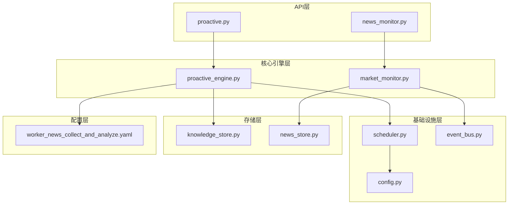
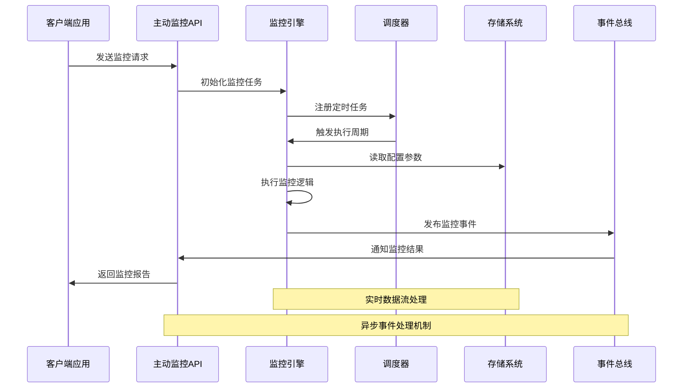
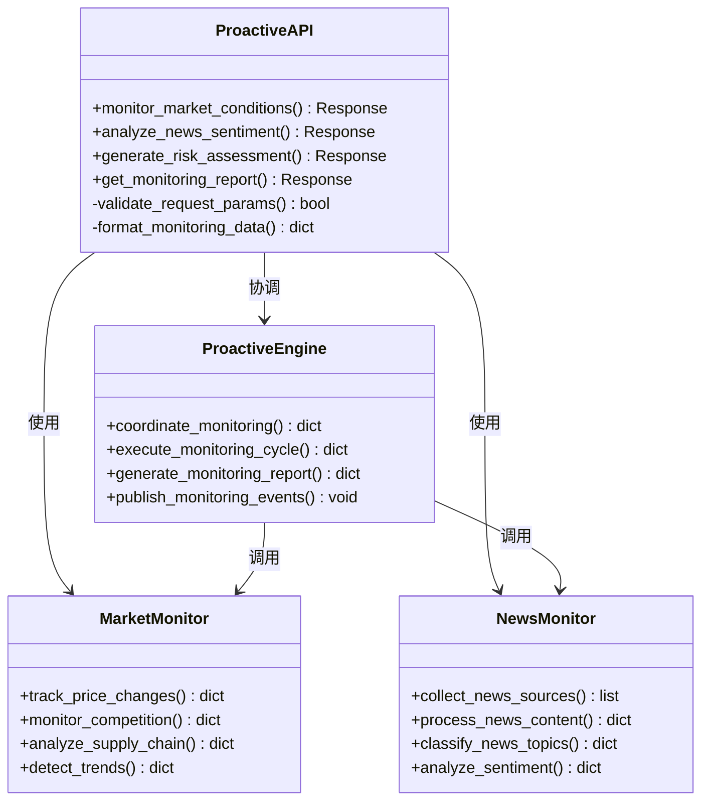
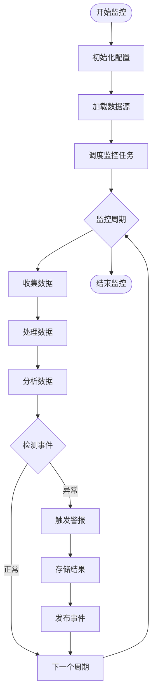
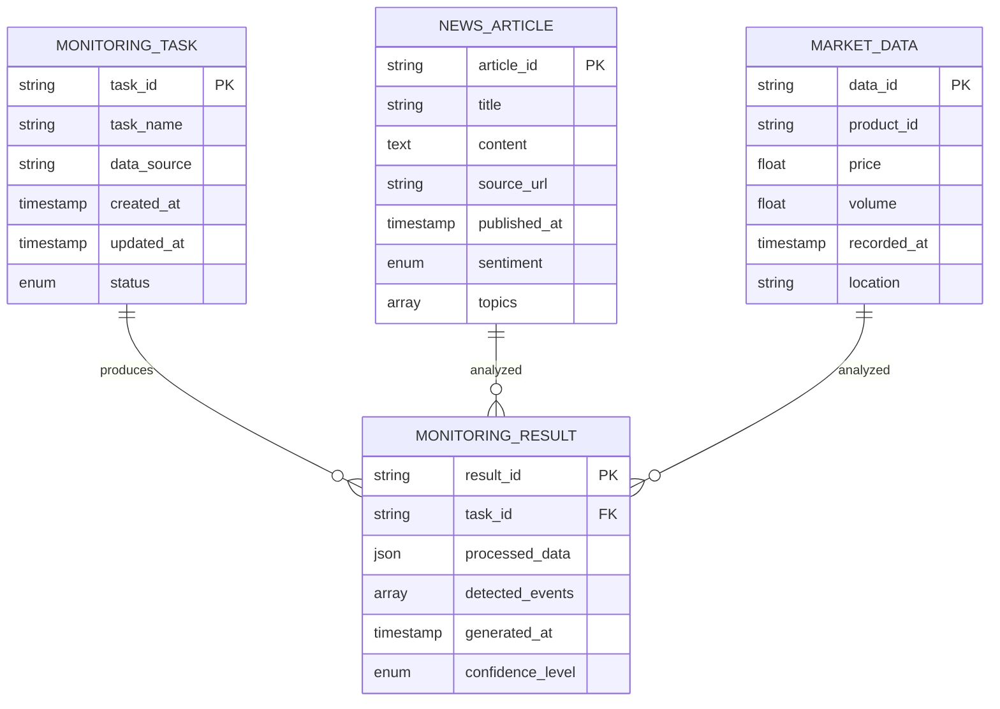
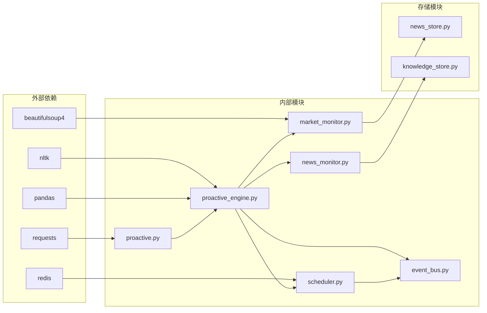

# 主动监控API

<cite>
**本文档引用的文件**
- [proactive.py](file://backend/app/api/proactive.py)
- [news_monitor.py](file://backend/app/api/news_monitor.py)
- [market_monitor.py](file://backend/app/core/market_monitor.py)
- [proactive_engine.py](file://backend/app/core/proactive_engine.py)
- [worker_news_collect_and_analyze.yaml](file://backend/data/prompts/worker_news_collect_and_analyze.yaml)
- [main.py](file://backend/app/main.py)
- [config.py](file://backend/app/config.py)
- [scheduler.py](file://backend/app/core/scheduler.py)
- [event_bus.py](file://backend/app/core/event_bus.py)
- [knowledge_store.py](file://backend/app/storage/knowledge_doc_store.py)
- [news_store.py](file://backend/app/storage/news_store.py)
</cite>

## 目录
1. [简介](#简介)
2. [项目结构](#项目结构)
3. [核心组件](#核心组件)
4. [架构概览](#架构概览)
5. [详细组件分析](#详细组件分析)
6. [依赖关系分析](#依赖关系分析)
7. [性能考虑](#性能考虑)
8. [故障排除指南](#故障排除指南)
9. [结论](#结论)

## 简介

主动监控API是Astra智能合规平台的核心功能模块，负责实时监控市场动态、法规变化和合规风险，为用户提供前瞻性的商业洞察和风险预警。该系统通过集成新闻采集、市场监测、风险评估和智能分析等功能，构建了一个完整的主动监控生态系统。

系统采用事件驱动架构，结合定时任务调度和实时数据流处理，能够自动识别和响应各种业务场景中的关键事件。通过机器学习算法和自然语言处理技术，系统能够从海量信息中提取有价值的数据，为决策提供支持。

## 项目结构

后端采用分层架构设计，主要包含以下层次：

**图表来源**
- [proactive.py:1-200](file://backend/app/api/proactive.py#L1-L200)
- [proactive_engine.py:1-300](file://backend/app/core/proactive_engine.py#L1-L300)
- [market_monitor.py:1-250](file://backend/app/core/market_monitor.py#L1-L250)

**章节来源**
- [main.py:1-150](file://backend/app/main.py#L1-L150)
- [config.py:1-100](file://backend/app/config.py#L1-L100)

## 核心组件

### 主动监控引擎

主动监控引擎是整个系统的核心，负责协调各个监控组件的工作。它实现了以下关键功能：

- **多源数据采集**：支持从新闻网站、法规数据库、市场报告等多个数据源获取信息
- **智能分析处理**：利用自然语言处理技术对采集到的信息进行语义分析和情感分析
- **风险评估模型**：基于历史数据和当前趋势建立风险评估算法
- **事件检测机制**：实时监控关键指标变化，及时发现异常情况

### 市场监测模块

市场监测模块专注于跟踪市场动态和竞争情报：

- **价格监控**：实时跟踪产品价格变化和竞争对手定价策略
- **需求分析**：分析市场需求变化趋势和消费者偏好转移
- **供应链监控**：监测供应链中断风险和物流变化
- **行业趋势**：识别新兴技术和商业模式的发展趋势

### 新闻监控API

新闻监控API提供了专门的接口来获取和处理新闻信息：

- **新闻采集**：自动化抓取相关新闻内容
- **内容分类**：对新闻内容进行主题分类和标签标注
- **情感分析**：分析新闻内容的情感倾向和影响力
- **关联分析**：识别不同新闻之间的关联性和影响范围

**章节来源**
- [proactive_engine.py:1-300](file://backend/app/core/proactive_engine.py#L1-L300)
- [market_monitor.py:1-250](file://backend/app/core/market_monitor.py#L1-L250)
- [news_monitor.py:1-200](file://backend/app/api/news_monitor.py#L1-L200)

## 架构概览

系统采用微服务架构，通过事件总线实现松耦合的组件通信：

**图表来源**
- [proactive.py:1-200](file://backend/app/api/proactive.py#L1-L200)
- [proactive_engine.py:1-300](file://backend/app/core/proactive_engine.py#L1-L300)
- [scheduler.py:1-150](file://backend/app/core/scheduler.py#L1-L150)
- [event_bus.py:1-120](file://backend/app/core/event_bus.py#L1-L120)

## 详细组件分析

### 主动监控API控制器

主动监控API控制器负责处理外部请求并协调内部组件工作：

**图表来源**
- [proactive.py:1-200](file://backend/app/api/proactive.py#L1-L200)
- [market_monitor.py:1-250](file://backend/app/core/market_monitor.py#L1-L250)
- [news_monitor.py:1-200](file://backend/app/api/news_monitor.py#L1-L200)
- [proactive_engine.py:1-300](file://backend/app/core/proactive_engine.py#L1-L300)

### 监控流程管理

系统实现了完整的监控流程生命周期管理：

**图表来源**
- [proactive_engine.py:1-300](file://backend/app/core/proactive_engine.py#L1-L300)
- [scheduler.py:1-150](file://backend/app/core/scheduler.py#L1-L150)
- [event_bus.py:1-120](file://backend/app/core/event_bus.py#L1-L120)

**章节来源**
- [proactive.py:1-200](file://backend/app/api/proactive.py#L1-L200)
- [proactive_engine.py:1-300](file://backend/app/core/proactive_engine.py#L1-L300)

### 数据存储架构

系统采用多层存储策略来管理不同类型的数据：

**图表来源**
- [news_store.py:1-150](file://backend/app/storage/news_store.py#L1-L150)
- [knowledge_store.py:1-200](file://backend/app/storage/knowledge_doc_store.py#L1-L200)

**章节来源**
- [news_store.py:1-150](file://backend/app/storage/news_store.py#L1-L150)
- [knowledge_store.py:1-200](file://backend/app/storage/knowledge_doc_store.py#L1-L200)

## 依赖关系分析

系统各组件之间存在清晰的依赖关系：

**图表来源**
- [proactive.py:1-200](file://backend/app/api/proactive.py#L1-L200)
- [proactive_engine.py:1-300](file://backend/app/core/proactive_engine.py#L1-L300)
- [market_monitor.py:1-250](file://backend/app/core/market_monitor.py#L1-L250)
- [news_monitor.py:1-200](file://backend/app/api/news_monitor.py#L1-L200)

**章节来源**
- [proactive.py:1-200](file://backend/app/api/proactive.py#L1-L200)
- [proactive_engine.py:1-300](file://backend/app/core/proactive_engine.py#L1-L300)

## 性能考虑

### 并发处理优化

系统采用异步编程模式来提高并发处理能力：

- **异步I/O操作**：使用async/await模式处理网络请求和文件操作
- **连接池管理**：合理配置数据库和缓存连接池大小
- **内存管理**：实现数据分页和缓存淘汰策略
- **负载均衡**：支持多实例部署和任务分片

### 缓存策略

系统实现了多层次的缓存机制：

- **Redis缓存**：存储热点数据和临时状态
- **本地缓存**：减少重复计算和数据库查询
- **CDN加速**：静态资源和图片内容的快速分发
- **智能过期**：基于访问频率的动态过期策略

### 监控指标

系统内置了完善的性能监控体系：

- **响应时间统计**：记录API调用和数据处理的耗时
- **错误率监控**：跟踪系统异常和失败请求
- **资源使用率**：监控CPU、内存和磁盘使用情况
- **业务指标**：跟踪关键业务指标的变化趋势

## 故障排除指南

### 常见问题诊断

**监控任务失败**
- 检查数据源可用性和网络连接
- 验证API密钥和认证信息
- 查看日志文件中的错误堆栈
- 确认任务调度配置正确

**数据处理异常**
- 验证输入数据格式和完整性
- 检查依赖服务的状态
- 确认内存和磁盘空间充足
- 查看相关组件的日志输出

**性能问题排查**
- 分析慢查询和阻塞操作
- 监控系统资源使用情况
- 检查缓存命中率和失效策略
- 优化数据库索引和查询计划

### 调试工具

系统提供了多种调试和诊断工具：

- **日志分析工具**：实时查看系统运行日志
- **性能分析器**：识别性能瓶颈和优化点
- **监控仪表板**：可视化展示系统健康状况
- **测试框架**：自动化测试和回归验证

**章节来源**
- [proactive_engine.py:1-300](file://backend/app/core/proactive_engine.py#L1-L300)
- [scheduler.py:1-150](file://backend/app/core/scheduler.py#L1-L150)

## 结论

主动监控API作为Astra智能合规平台的核心功能，通过先进的技术架构和丰富的业务功能，为用户提供了全面的市场监控和风险预警服务。系统采用模块化设计，具有良好的可扩展性和维护性。

未来发展方向包括：

- **AI算法优化**：提升机器学习模型的准确性和效率
- **实时处理增强**：支持更复杂的数据流处理场景
- **多云部署**：提供更好的弹性伸缩和容灾能力
- **API生态建设**：开放更多第三方集成接口

通过持续的技术创新和功能完善，主动监控API将继续为用户提供高质量的智能化监控服务。