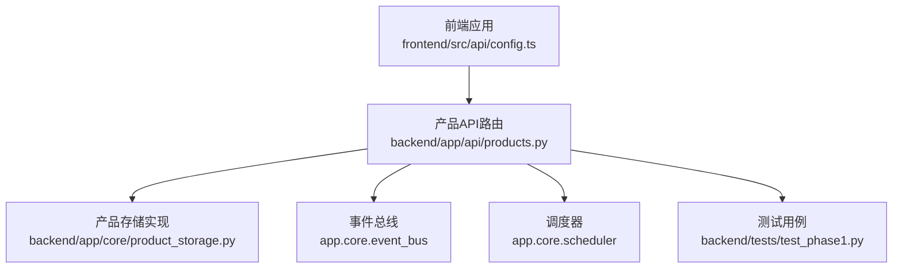
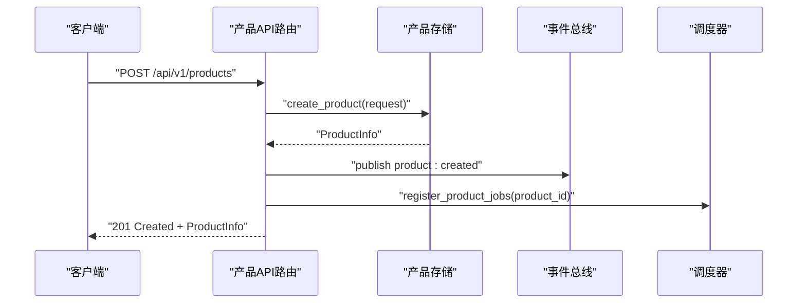
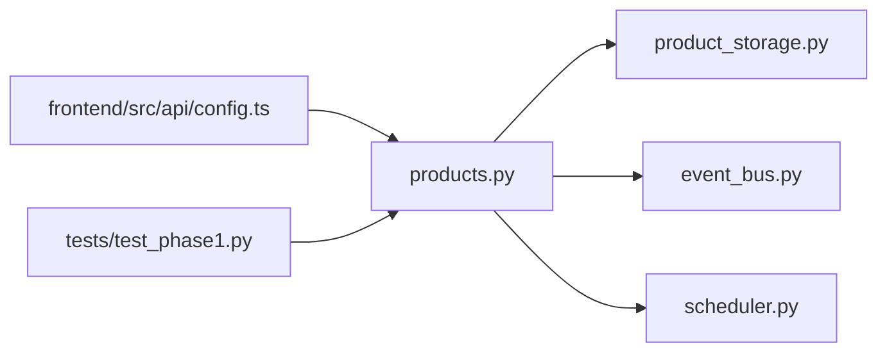

# 产品API

<cite>
**本文引用的文件**
- [backend/app/api/products.py](file://backend/app/api/products.py)
- [后端api.md](file://后端api.md)
- [frontend/src/api/config.ts](file://frontend/src/api/config.ts)
- [frontend/前端api.md](file://前端api.md)
- [backend/data/数据流转.md](file://backend/data/数据流转.md)
- [backend/tests/test_phase1.py](file://backend/tests/test_phase1.py)
</cite>

## 目录
1. [简介](#简介)
2. [项目结构](#项目结构)
3. [核心组件](#核心组件)
4. [架构总览](#架构总览)
5. [详细组件分析](#详细组件分析)
6. [依赖分析](#依赖分析)
7. [性能考虑](#性能考虑)
8. [故障排查指南](#故障排查指南)
9. [结论](#结论)
10. [附录](#附录)

## 简介
本文件为避风港平台“产品”模块的完整API文档，覆盖产品CRUD与生命周期管理相关接口，说明产品数据模型、存储与索引策略、业务规则与约束、错误处理、请求/响应示例、状态码定义及最佳实践。内容基于后端FastAPI路由、前端调用配置以及测试用例进行整理，确保接口规范可追溯至仓库源文件。

## 项目结构
- 后端API路由集中在产品模块，提供产品列表、创建、详情、更新、生命周期变更、删除、事件查询、合规检查触发等能力。
- 前端通过统一的API配置封装调用后端接口。
- 数据流与产品存储职责分离，API层负责对外契约，存储层负责持久化与检索。

图表来源
- [backend/app/api/products.py:1-81](file://backend/app/api/products.py#L1-L81)
- [frontend/src/api/config.ts:362-368](file://frontend/src/api/config.ts#L362-L368)
- [backend/data/数据流转.md:385-386](file://backend/data/数据流转.md#L385-L386)

章节来源
- [后端api.md:414-433](file://后端api.md#L414-L433)
- [frontend/前端api.md:183-196](file://前端api.md#L183-L196)

## 核心组件
- 产品API路由：提供RESTful接口，包括列表、创建、统计、详情、更新、生命周期变更、删除、事件查询、合规检查触发等。
- 产品存储：抽象出产品数据的增删改查与统计方法，供API层调用。
- 事件与调度：创建产品后自动发布事件并注册产品级定时任务；生命周期变更时发布状态变更事件。
- 前端封装：统一的productsApi封装GET /api/v1/products、GET /api/v1/products/{id}、GET /api/v1/products/{id}/events等调用。

章节来源
- [backend/app/api/products.py:16-81](file://backend/app/api/products.py#L16-L81)
- [frontend/src/api/config.ts:362-368](file://frontend/src/api/config.ts#L362-L368)

## 架构总览
产品API采用“路由-存储-事件/调度”的分层设计：
- 路由层：解析请求参数、校验输入、调用存储层并返回标准化响应。
- 存储层：负责产品实体的持久化、检索、统计与过滤。
- 事件与调度：在关键动作（创建、生命周期变更）后触发后续流程。

图表来源
- [backend/app/api/products.py:36-66](file://backend/app/api/products.py#L36-L66)

## 详细组件分析

### 产品CRUD接口
- 列出产品
  - 方法与路径：GET /api/v1/products
  - 查询参数：
    - lifecycle_stage：生命周期阶段（如 concept、design 等）
    - product_type：产品类型
    - market：目标市场
    - limit：限制数量（默认100，最小1，最大500）
    - offset：偏移量（默认0）
  - 响应：产品信息数组（ProductInfo）
  - 示例场景：分页浏览、按阶段/类型/市场筛选
- 创建产品
  - 方法与路径：POST /api/v1/products
  - 请求体：ProductCreateRequest
  - 成功响应：ProductInfo
  - 错误：当唯一性冲突或业务校验失败时返回409
  - 行为：创建成功后发布“product:created”事件，并尝试注册产品级定时任务
- 统计产品数量
  - 方法与路径：GET /api/v1/products/count
  - 查询参数：lifecycle_stage（可选）
  - 响应：{"count": N}
- 获取产品详情
  - 方法与路径：GET /api/v1/products/{product_id}
  - 路径参数：product_id（字符串）
  - 响应：ProductInfo
- 更新产品
  - 方法与路径：PUT /api/v1/products/{product_id}
  - 路径参数：product_id
  - 请求体：ProductUpdateRequest
  - 响应：ProductInfo
- 删除/归档产品
  - 方法与路径：DELETE /api/v1/products/{product_id}
  - 路径参数：product_id
  - 响应：标准HTTP状态码（通常204 No Content或200 OK）
- 获取产品事件列表
  - 方法与路径：GET /api/v1/products/{product_id}/events
  - 路径参数：product_id
  - 响应：事件数组（含id、type、title、description、timestamp、severity）

章节来源
- [backend/app/api/products.py:16-81](file://backend/app/api/products.py#L16-L81)
- [后端api.md:420-431](file://后端api.md#L420-L431)
- [frontend/前端api.md:188-192](file://前端api.md#L188-L192)

### 产品生命周期管理接口
- 更新生命周期状态
  - 方法与路径：PUT /api/v1/products/{product_id}/lifecycle
  - 请求体：包含lifecycle_stage字段
  - 行为：更新产品生命周期阶段，并发布“status_changed”事件
  - 示例场景：从“概念”推进到“设计”，或回退到“归档”
- 合规检查触发
  - 方法与路径：POST /api/v1/products/{product_id}/compliance-check
  - 请求体：无（或空对象）
  - 行为：触发针对该产品的合规检查流程
  - 示例场景：手动触发合规扫描、定期任务触发

章节来源
- [后端api.md:427-431](file://后端api.md#L427-L431)
- [backend/tests/test_phase1.py:173-176](file://backend/tests/test_phase1.py#L173-L176)

### 数据模型与字段说明
- ProductInfo（示例字段）
  - id、name、target_markets、lifecycle_stage、health_score、compliance_status、certifications、hs_code、vendor、created_at、updated_at
- ProductCreateRequest/ProductUpdateRequest（示例字段）
  - 包含产品名称、目标市场、生命周期阶段、HS编码、供应商等必要字段
- ProductEvent（示例字段）
  - id、type、title、description、timestamp、severity（low/medium/high/critical）

章节来源
- [frontend/src/api/config.ts:339-360](file://frontend/src/api/config.ts#L339-L360)
- [frontend/前端api.md:194-195](file://frontend/前端api.md#L194-L195)

### 存储架构与索引机制
- 存储职责
  - 提供list_products、get_product、create_product、count_products等方法
  - 支持按生命周期阶段、产品类型、目标市场等维度过滤
- 索引与检索
  - 仓库中未直接暴露具体索引实现细节，但API层已支持多维过滤参数，表明存储层具备相应索引或查询优化能力
- 版本与历史
  - 仓库未提供独立的“产品版本控制”接口；历史记录可通过事件系统或指标历史接口间接获得

章节来源
- [backend/app/api/products.py:16-81](file://backend/app/api/products.py#L16-L81)
- [backend/data/数据流转.md:385-386](file://backend/data/数据流转.md#L385-L386)

### 业务规则与约束
- 输入校验
  - list_products支持limit范围限制（1-500），避免过大查询导致性能问题
  - lifecycle_stage需为合法枚举值（如concept、design等）
- 并发与幂等
  - 仓库未显式声明幂等等价性；建议客户端在重复提交时使用幂等键
- 事件驱动
  - 创建产品后自动发布事件并注册定时任务，确保后续流程（如合规检查、周期性监控）被触发
- 生命周期事件
  - 生命周期变更会发布状态变更事件，便于下游订阅与联动

章节来源
- [backend/app/api/products.py:16-81](file://backend/app/api/products.py#L16-L81)
- [后端api.md:427-431](file://后端api.md#L427-L431)

### 请求/响应示例与状态码
- 列表查询
  - 请求：GET /api/v1/products?lifecycle_stage=concept&limit=50&offset=0
  - 响应：200 OK，返回ProductInfo数组
- 创建产品
  - 请求：POST /api/v1/products（携带ProductCreateRequest）
  - 成功：201 Created，返回ProductInfo
  - 冲突：409 Conflict（如唯一性冲突）
- 获取详情
  - 请求：GET /api/v1/products/{product_id}
  - 响应：200 OK，返回ProductInfo
- 更新生命周期
  - 请求：PUT /api/v1/products/{product_id}/lifecycle（携带lifecycle_stage）
  - 响应：200 OK，返回ProductInfo
- 删除产品
  - 请求：DELETE /api/v1/products/{product_id}
  - 响应：200 OK 或 204 No Content
- 事件列表
  - 请求：GET /api/v1/products/{product_id}/events
  - 响应：200 OK，返回事件数组

章节来源
- [后端api.md:420-431](file://后端api.md#L420-L431)
- [frontend/前端api.md:188-192](file://frontend/前端api.md#L188-L192)
- [backend/tests/test_phase1.py:146-176](file://backend/tests/test_phase1.py#L146-L176)

## 依赖分析
- 路由依赖
  - 产品API路由依赖产品存储（get_product_storage）、事件总线（get_event_bus）、调度器（register_product_jobs）
- 前后端依赖
  - 前端productsApi封装了后端产品相关接口，字段与后端ProductInfo保持一致
- 测试依赖
  - 测试用例覆盖列表、筛选、详情、生命周期变更等关键路径

图表来源
- [backend/app/api/products.py:11-11](file://backend/app/api/products.py#L11-L11)
- [backend/data/数据流转.md:385-386](file://backend/data/数据流转.md#L385-L386)

章节来源
- [backend/app/api/products.py:47-64](file://backend/app/api/products.py#L47-L64)
- [frontend/src/api/config.ts:362-368](file://frontend/src/api/config.ts#L362-L368)
- [backend/tests/test_phase1.py:146-176](file://backend/tests/test_phase1.py#L146-L176)

## 性能考虑
- 分页与限流
  - 使用limit与offset进行分页，建议前端按需加载，避免一次性拉取过多数据
  - API对limit设置上限（默认100，最大500），防止大查询造成资源压力
- 过滤与索引
  - 列表接口支持按生命周期阶段、产品类型、目标市场过滤，建议在存储层对常用过滤字段建立索引
- 异步事件与定时任务
  - 创建产品后发布事件与注册定时任务可能带来额外开销，建议在高并发场景下评估事件队列与调度器容量
- 缓存策略
  - 对热点产品详情与事件列表可引入缓存（如Redis），降低数据库压力

## 故障排查指南
- 409 冲突
  - 场景：创建产品时唯一性冲突或业务校验失败
  - 处理：检查ProductCreateRequest中的唯一字段（如名称、HS编码等），修正后再试
- 404 未找到
  - 场景：访问不存在的产品ID
  - 处理：确认product_id是否正确，或先调用列表接口获取有效ID
- 事件未触发
  - 场景：创建产品后未见后续流程
  - 处理：检查事件总线与调度器状态，确认异常日志
- 生命周期变更无效
  - 场景：调用更新生命周期接口后状态未变化
  - 处理：确认lifecycle_stage枚举值是否合法，查看事件发布情况

章节来源
- [backend/app/api/products.py:42-43](file://backend/app/api/products.py#L42-L43)
- [backend/tests/test_phase1.py:173-176](file://backend/tests/test_phase1.py#L173-L176)

## 结论
产品API提供了完备的CRUD与生命周期管理能力，配合事件与调度机制形成闭环。建议在生产环境中结合索引优化、缓存与异步处理提升性能，并完善错误监控与告警体系，确保高可用与可观测性。

## 附录
- 前端调用封装
  - productsApi.list()、productsApi.get(id)、productsApi.getEvents(id)
- 相关接口清单
  - GET /api/v1/products、POST /api/v1/products、GET /api/v1/products/count、GET /api/v1/products/{product_id}、PUT /api/v1/products/{product_id}、DELETE /api/v1/products/{product_id}、PUT /api/v1/products/{product_id}/lifecycle、GET /api/v1/products/{product_id}/events、POST /api/v1/products/{product_id}/compliance-check

章节来源
- [frontend/src/api/config.ts:362-368](file://frontend/src/api/config.ts#L362-L368)
- [后端api.md:420-431](file://后端api.md#L420-L431)