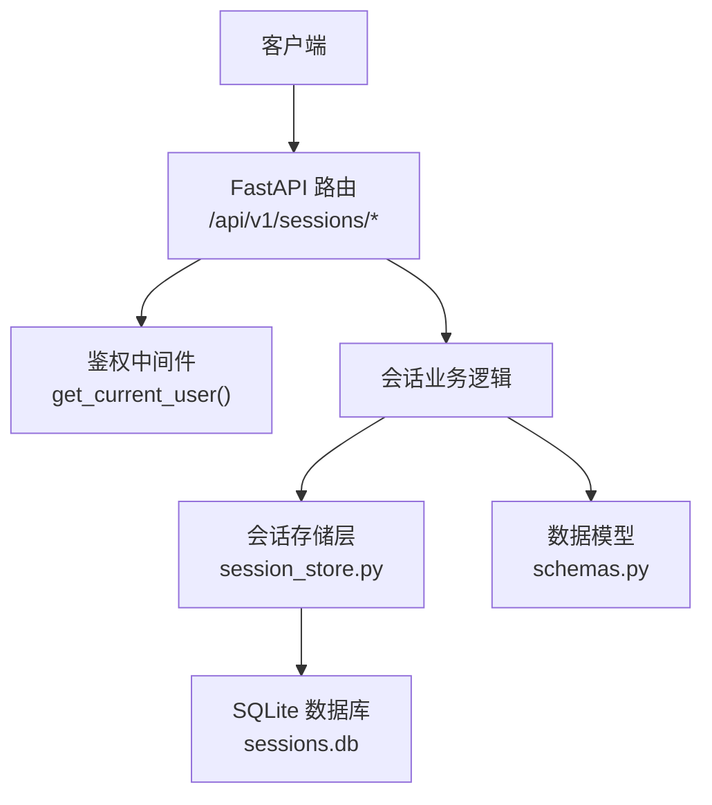
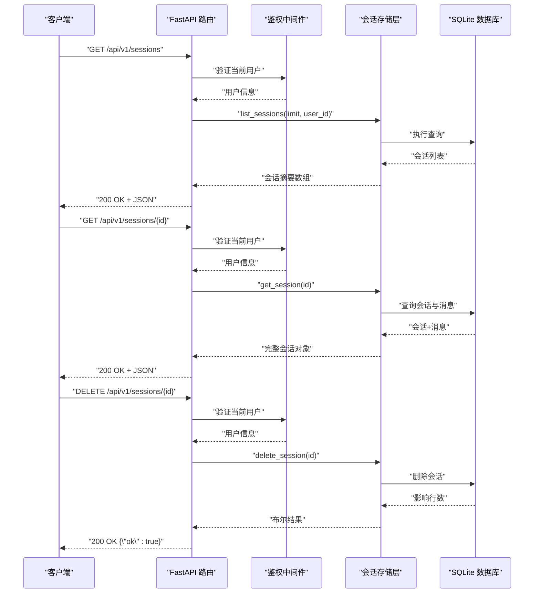
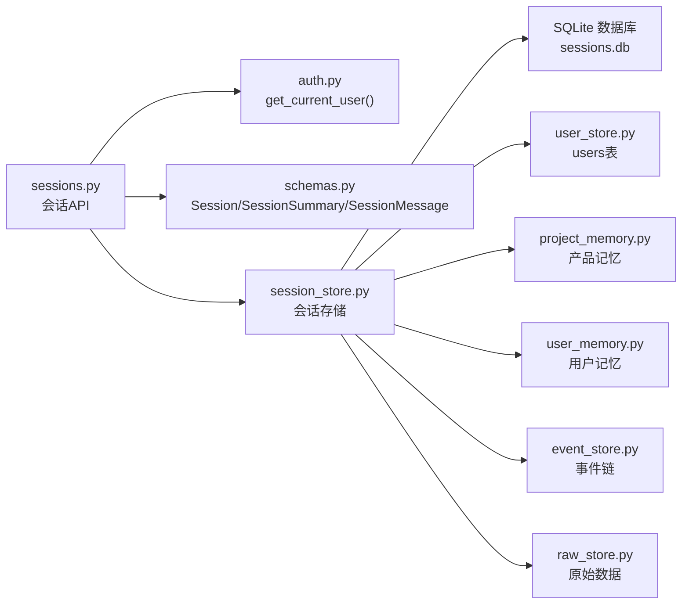

# 会话管理API

<cite>
**本文引用的文件**
- [backend/app/api/sessions.py](file://backend/app/api/sessions.py)
- [backend/app/storage/session_store.py](file://backend/app/storage/session_store.py)
- [backend/app/models/schemas.py](file://backend/app/models/schemas.py)
- [backend/app/main.py](file://backend/app/main.py)
- [backend/app/storage/user_store.py](file://backend/app/storage/user_store.py)
- [backend/app/storage/project_memory.py](file://backend/app/storage/project_memory.py)
- [backend/app/storage/user_memory.py](file://backend/app/storage/user_memory.py)
- [backend/app/storage/event_store.py](file://backend/app/storage/event_store.py)
- [backend/app/storage/raw_store.py](file://backend/app/storage/raw_store.py)
</cite>

## 目录
1. [简介](#简介)
2. [项目结构](#项目结构)
3. [核心组件](#核心组件)
4. [架构概览](#架构概览)
5. [详细组件分析](#详细组件分析)
6. [依赖关系分析](#依赖关系分析)
7. [性能考量](#性能考量)
8. [故障排查指南](#故障排查指南)
9. [结论](#结论)
10. [附录](#附录)

## 简介
本文件面向“会话管理API”，系统性记录以下能力与规范：
- 会话列表查询、会话详情获取、会话删除接口
- 会话ID生成规则与会话生命周期管理
- 会话存储机制、消息持久化与历史记录管理
- 会话状态跟踪、多轮对话支持与上下文维护
- 会话相关数据模型与存储结构
- 会话操作最佳实践与性能优化建议
- 完整的请求/响应示例与错误处理说明

## 项目结构
会话管理API位于后端FastAPI应用中，采用“路由层-存储层-模型层”三层结构：
- 路由层：定义REST接口与鉴权依赖
- 存储层：SQLite持久化与JSON字段存储
- 模型层：Pydantic数据模型与校验

图表来源
- [backend/app/api/sessions.py:1-79](file://backend/app/api/sessions.py#L1-L79)
- [backend/app/storage/session_store.py:1-251](file://backend/app/storage/session_store.py#L1-L251)
- [backend/app/models/schemas.py:234-264](file://backend/app/models/schemas.py#L234-L264)

章节来源
- [backend/app/api/sessions.py:1-79](file://backend/app/api/sessions.py#L1-L79)
- [backend/app/storage/session_store.py:1-251](file://backend/app/storage/session_store.py#L1-L251)
- [backend/app/models/schemas.py:234-264](file://backend/app/models/schemas.py#L234-L264)

## 核心组件
- 会话API路由：提供会话列表、详情、删除三个端点，并通过鉴权依赖限制访问范围
- 会话存储：基于SQLite的会话与消息表，使用JSON字段存储合规结果、意图与来源
- 数据模型：定义会话摘要、完整会话与消息的数据结构，确保前后端一致

章节来源
- [backend/app/api/sessions.py:17-78](file://backend/app/api/sessions.py#L17-L78)
- [backend/app/storage/session_store.py:37-251](file://backend/app/storage/session_store.py#L37-L251)
- [backend/app/models/schemas.py:234-264](file://backend/app/models/schemas.py#L234-L264)

## 架构概览
会话管理API的调用链如下：
- 客户端请求到达FastAPI路由
- 鉴权中间件校验当前用户身份与权限
- 业务逻辑根据用户角色与会话归属进行访问控制
- 存储层执行SQL查询/插入/删除，返回结构化数据
- 路由层将数据映射为Pydantic模型并返回

图表来源
- [backend/app/api/sessions.py:17-78](file://backend/app/api/sessions.py#L17-L78)
- [backend/app/storage/session_store.py:87-225](file://backend/app/storage/session_store.py#L87-L225)

## 详细组件分析

### 会话API接口定义
- 获取会话列表
  - 方法与路径：GET /api/v1/sessions
  - 请求参数：无
  - 响应：会话摘要数组（最多50条，按更新时间倒序）
  - 权限：admin可查看全部；普通用户仅查看自身
- 获取单个会话
  - 方法与路径：GET /api/v1/sessions/{session_id}
  - 请求参数：路径参数session_id
  - 响应：完整会话对象（含全部消息）
  - 权限：admin可查看全部；普通用户仅可查看自身会话
- 删除会话
  - 方法与路径：DELETE /api/v1/sessions/{session_id}
  - 请求参数：路径参数session_id
  - 响应：{"ok": true}
  - 权限：admin可删除全部；普通用户仅可删除自身会话

章节来源
- [backend/app/api/sessions.py:17-78](file://backend/app/api/sessions.py#L17-L78)

### 会话ID生成规则与生命周期
- 会话ID生成：使用UUID v4生成全局唯一ID
- 生命周期管理：
  - 创建：创建会话时生成ID并记录创建/更新时间
  - 更新：新增消息时同步更新会话的updated_at
  - 删除：删除会话级联删除其下所有消息
  - 查询：支持按用户过滤与按更新时间排序

章节来源
- [backend/app/storage/session_store.py:74-84](file://backend/app/storage/session_store.py#L74-L84)
- [backend/app/storage/session_store.py:194-217](file://backend/app/storage/session_store.py#L194-L217)
- [backend/app/storage/session_store.py:220-225](file://backend/app/storage/session_store.py#L220-L225)

### 会话存储机制与消息持久化
- 数据库与表结构
  - sessions表：id、title、created_at、updated_at、user_id
  - messages表：id、session_id、role、content、compliance_result_json、intent_json、sources_json、created_at
  - 索引：messages.session_id、sessions.updated_at DESC
- JSON字段存储
  - compliance_result_json：合规检查结果
  - intent_json：NLU解析结果
  - sources_json：检索来源列表
- 辅助查询
  - list_sessions：支持按user_id过滤与聚合消息数、最后一条用户消息预览
  - get_session：返回会话与全部消息，按时间升序排列
  - get_recent_messages：按最新N条消息用于上下文传递

章节来源
- [backend/app/storage/session_store.py:37-70](file://backend/app/storage/session_store.py#L37-L70)
- [backend/app/storage/session_store.py:87-131](file://backend/app/storage/session_store.py#L87-L131)
- [backend/app/storage/session_store.py:134-167](file://backend/app/storage/session_store.py#L134-L167)
- [backend/app/storage/session_store.py:170-183](file://backend/app/storage/session_store.py#L170-L183)

### 历史记录管理与上下文维护
- 历史记录管理
  - 会话内消息按created_at升序存储，便于顺序展示与审计
  - 会话摘要包含消息总数与最后一条用户消息预览
- 上下文维护
  - get_recent_messages提供最近N条消息（默认6条），用于多轮对话上下文
  - 路由层在组装Session对象时，将合规结果、意图与来源映射为强类型字段

章节来源
- [backend/app/storage/session_store.py:170-183](file://backend/app/storage/session_store.py#L170-L183)
- [backend/app/api/sessions.py:44-63](file://backend/app/api/sessions.py#L44-L63)

### 数据模型与存储结构
- 会话摘要（列表页用）
  - 字段：id、title、created_at、updated_at、message_count、preview
- 完整会话（详情页用）
  - 字段：id、title、created_at、updated_at、messages（列表）
- 单条消息
  - 字段：id、role、content、compliance_result、intent、sources、created_at
- 存储结构
  - sessions表：主键id，外键user_id（迁移后新增）
  - messages表：外键session_id指向sessions.id（CASCADE）

章节来源
- [backend/app/models/schemas.py:247-264](file://backend/app/models/schemas.py#L247-L264)
- [backend/app/models/schemas.py:236-245](file://backend/app/models/schemas.py#L236-L245)
- [backend/app/storage/session_store.py:37-70](file://backend/app/storage/session_store.py#L37-L70)

### 权限控制与鉴权集成
- 鉴权依赖：get_current_user从请求中解析当前用户
- 权限规则：
  - admin可查看/删除全部会话
  - 普通用户仅可查看/删除自身会话
- 未找到与权限不足的错误处理：
  - 会话不存在：404
  - 无权限：403

章节来源
- [backend/app/api/sessions.py:23-26](file://backend/app/api/sessions.py#L23-L26)
- [backend/app/api/sessions.py:35-42](file://backend/app/api/sessions.py#L35-L42)
- [backend/app/api/sessions.py:71-78](file://backend/app/api/sessions.py#L71-L78)

### 与其他存储层的关系
- 用户存储：users表用于鉴权与会话归属（user_id）
- 产品记忆：project_memory记录产品合规历史，与会话ID关联
- 用户记忆：user_memory记录用户画像/偏好，辅助上下文
- 事件链：event_store记录系统事件与用户操作链，支撑审计与回溯
- 原始数据：raw_store提供HS编码/VAT/认证矩阵等静态数据

章节来源
- [backend/app/storage/user_store.py:22-33](file://backend/app/storage/user_store.py#L22-L33)
- [backend/app/storage/project_memory.py:36-87](file://backend/app/storage/project_memory.py#L36-L87)
- [backend/app/storage/user_memory.py:31-51](file://backend/app/storage/user_memory.py#L31-L51)
- [backend/app/storage/event_store.py:76-115](file://backend/app/storage/event_store.py#L76-L115)
- [backend/app/storage/raw_store.py:56-129](file://backend/app/storage/raw_store.py#L56-L129)

## 依赖关系分析
会话管理API的依赖关系如下：

图表来源
- [backend/app/api/sessions.py:9-12](file://backend/app/api/sessions.py#L9-L12)
- [backend/app/storage/session_store.py:19-21](file://backend/app/storage/session_store.py#L19-L21)
- [backend/app/storage/user_store.py:15-17](file://backend/app/storage/user_store.py#L15-L17)
- [backend/app/storage/project_memory.py:17-18](file://backend/app/storage/project_memory.py#L17-L18)
- [backend/app/storage/user_memory.py:15-16](file://backend/app/storage/user_memory.py#L15-L16)
- [backend/app/storage/event_store.py:17-18](file://backend/app/storage/event_store.py#L17-L18)
- [backend/app/storage/raw_store.py:16-17](file://backend/app/storage/raw_store.py#L16-L17)

章节来源
- [backend/app/api/sessions.py:9-12](file://backend/app/api/sessions.py#L9-L12)
- [backend/app/storage/session_store.py:19-21](file://backend/app/storage/session_store.py#L19-L21)

## 性能考量
- 数据库索引
  - messages.session_id：加速按会话查询消息
  - sessions.updated_at DESC：加速按更新时间排序的列表查询
- 查询优化
  - 列表查询限制数量（默认50），避免全表扫描
  - 聚合查询计算消息数与最后一条用户消息预览，减少后续处理
- JSON字段
  - 将合规结果、意图与来源以JSON存储，便于扩展但查询时需注意索引与解析成本
- 并发与连接
  - SQLite连接池策略与线程安全：check_same_thread=False，适合单进程部署；生产环境建议评估并发场景

章节来源
- [backend/app/storage/session_store.py:58-62](file://backend/app/storage/session_store.py#L58-L62)
- [backend/app/storage/session_store.py:87-131](file://backend/app/storage/session_store.py#L87-L131)

## 故障排查指南
- 常见错误与处理
  - 会话不存在：返回404，检查session_id是否正确或是否已被删除
  - 无权限访问：返回403，确认当前用户角色与会话归属user_id
  - 数据库异常：检查sessions.db是否存在与可写，确认迁移脚本已执行（user_id列）
- 排查步骤
  - 确认鉴权中间件正常注入current_user
  - 使用get_session核对会话与消息是否正确落库
  - 检查索引是否存在，必要时重建索引
  - 观察日志与数据库连接状态

章节来源
- [backend/app/api/sessions.py:35-42](file://backend/app/api/sessions.py#L35-L42)
- [backend/app/api/sessions.py:71-78](file://backend/app/api/sessions.py#L71-L78)
- [backend/app/storage/session_store.py:64-69](file://backend/app/storage/session_store.py#L64-L69)

## 结论
会话管理API通过清晰的路由定义、严格的权限控制与可靠的SQLite存储，实现了会话列表、详情与删除的完整能力。配合消息JSON字段与最近N条消息查询，满足多轮对话与上下文维护需求。建议在生产环境中关注索引与并发策略，并结合用户/产品/事件/原始数据存储层实现更全面的合规与审计能力。

## 附录

### 请求/响应示例

- 获取会话列表
  - 请求
    - 方法：GET
    - 路径：/api/v1/sessions
    - 认证：需要登录
  - 响应
    - 状态码：200
    - 示例响应：会话摘要数组（最多50条）
      - 字段：id、title、created_at、updated_at、message_count、preview

- 获取单个会话
  - 请求
    - 方法：GET
    - 路径：/api/v1/sessions/{session_id}
    - 认证：需要登录
  - 响应
    - 状态码：200
    - 示例响应：完整会话对象
      - 字段：id、title、created_at、updated_at、messages[]
        - 消息字段：id、role、content、compliance_result、intent、sources、created_at

- 删除会话
  - 请求
    - 方法：DELETE
    - 路径：/api/v1/sessions/{session_id}
    - 认证：需要登录
  - 响应
    - 状态码：200
    - 示例响应：{"ok": true}

- 错误响应
  - 会话不存在：404
  - 无权限：403

章节来源
- [backend/app/api/sessions.py:17-78](file://backend/app/api/sessions.py#L17-L78)
- [backend/app/models/schemas.py:247-264](file://backend/app/models/schemas.py#L247-L264)