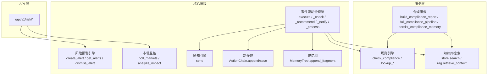
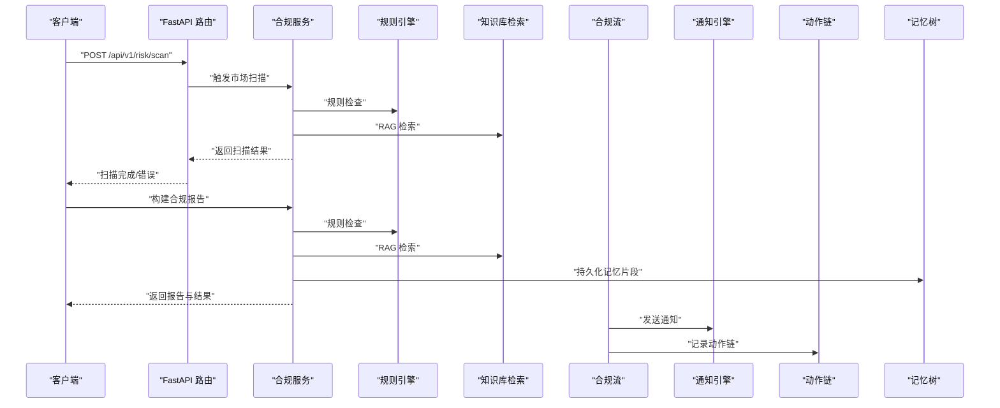
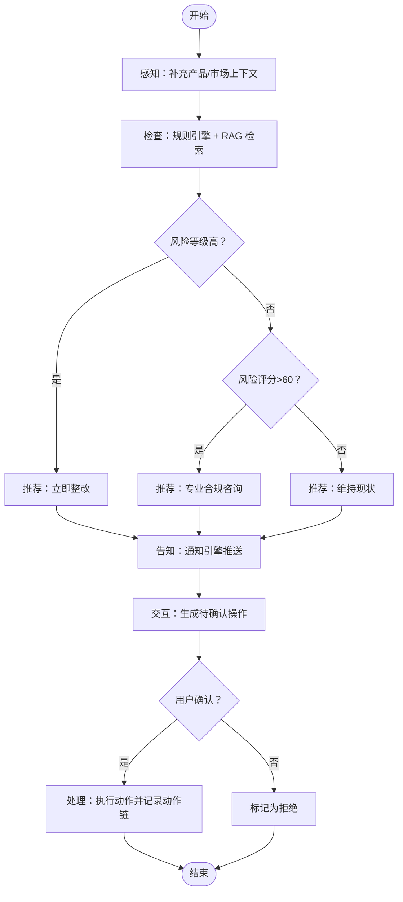
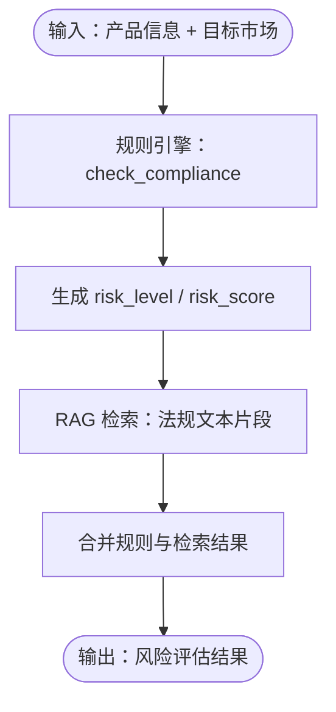
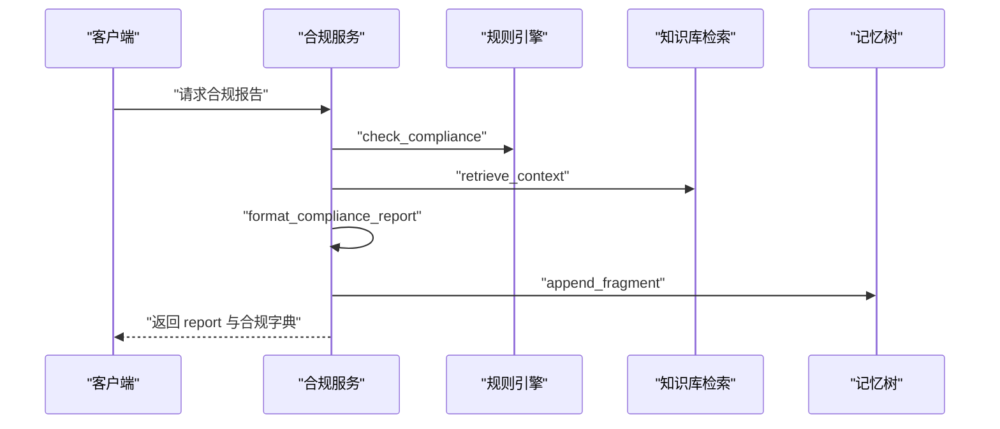
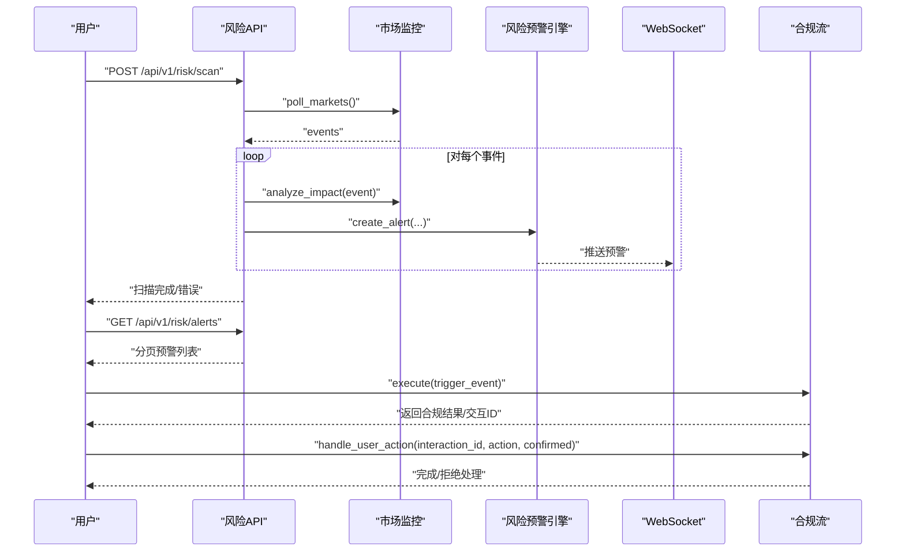
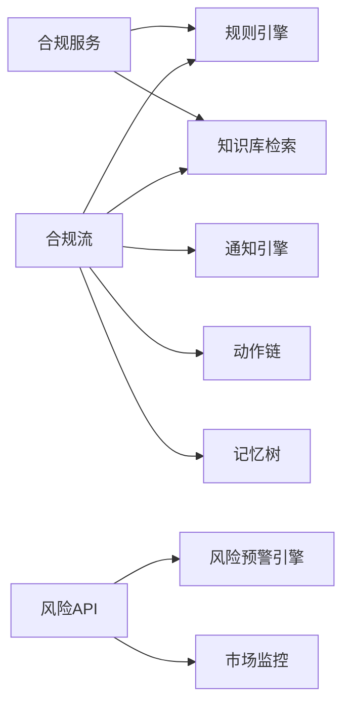

# 合规API

<cite>
**本文引用的文件**
- [compliance_flow.py](file://backend/app/core/compliance_flow.py)
- [compliance.py](file://backend/app/services/compliance.py)
- [risk.py](file://backend/app/api/risk.py)
- [risk_alert.py](file://backend/app/core/risk_alert.py)
- [main.py](file://backend/app/main.py)
- [schemas.py](file://backend/app/models/schemas.py)
- [rule_engine.py](file://backend/app/core/rule_engine.py)
- [market_monitor.py](file://backend/app/core/market_monitor.py)
- [notification_engine.py](file://backend/app/core/notification_engine.py)
- [action_chain.py](file://backend/app/core/action_chain.py)
- [memory_tree.py](file://backend/app/core/memory_tree.py)
- [rag.py](file://backend/app/knowledge/store.py)
- [prompts](file://backend/data/prompts/regulation_scan.yaml)
</cite>

## 目录
1. [简介](#简介)
2. [项目结构](#项目结构)
3. [核心组件](#核心组件)
4. [架构总览](#架构总览)
5. [详细组件分析](#详细组件分析)
6. [依赖分析](#依赖分析)
7. [性能考量](#性能考量)
8. [故障排查指南](#故障排查指南)
9. [结论](#结论)
10. [附录](#附录)

## 简介
本文件面向避风港平台的合规能力，系统化梳理法规扫描引擎、风险评估算法、合规报告生成以及合规检查流程的完整接口链路。内容涵盖：
- 法规查询与扫描触发接口
- 风险评估算法接口规范（含风险计算、等级划分、预警机制）
- 合规报告生成接口（模板、数据提取、格式化输出）
- 合规检查流程的端到端接口链路（启动、进度查询、结果处理）
- 请求/响应示例、参数校验规则、错误处理机制与性能考量
- 合规标准对照与实际应用场景示例

## 项目结构
后端采用 FastAPI 路由组织 API，核心合规逻辑分布在服务层与核心模块中；风险预警与市场扫描位于独立模块并通过 API 路由暴露。

图表来源
- [risk.py:20-154](file://backend/app/api/risk.py#L20-L154)
- [compliance.py:113-296](file://backend/app/services/compliance.py#L113-L296)
- [compliance_flow.py:52-473](file://backend/app/core/compliance_flow.py#L52-L473)
- [risk_alert.py:32-181](file://backend/app/core/risk_alert.py#L32-L181)

章节来源
- [risk.py:1-154](file://backend/app/api/risk.py#L1-L154)
- [compliance.py:1-296](file://backend/app/services/compliance.py#L1-L296)
- [compliance_flow.py:1-473](file://backend/app/core/compliance_flow.py#L1-L473)
- [risk_alert.py:1-181](file://backend/app/core/risk_alert.py#L1-L181)

## 核心组件
- 合规服务（Compliance Service）
  - 提供端到端合规管线：意图识别 → 规则引擎 → RAG 补充 → 报告生成 → 记忆持久化
  - 关键接口：build_compliance_report、full_compliance_pipeline、persist_compliance_memory
- 事件驱动合规流（EventDrivenComplianceFlow）
  - 六阶段闭环：感知 → 检查 → 推荐 → 告知 → 交互 → 处理
  - 支持 5/6 阶段模式，提供流水线健康度统计
- 风险预警引擎（Risk Alert Engine）
  - 预警创建、忽略、查询、未读计数、扫描时间记录
- 市场扫描与监控（Market Monitor）
  - 手动触发扫描，产出事件并进行影响分析，生成预警
- 通知引擎（Notification Engine）
  - 将合规检查结果推送到多渠道
- 动作链（ActionChain）
  - 记录用户确认后的合规操作，形成可追溯的动作链
- 记忆树（MemoryTree）
  - 将合规检查结果以片段形式写入 L0-L3 层记忆

章节来源
- [compliance.py:113-296](file://backend/app/services/compliance.py#L113-L296)
- [compliance_flow.py:33-473](file://backend/app/core/compliance_flow.py#L33-L473)
- [risk_alert.py:32-181](file://backend/app/core/risk_alert.py#L32-L181)
- [risk.py:63-127](file://backend/app/api/risk.py#L63-L127)

## 架构总览
下图展示合规API与核心模块的交互关系，包括法规扫描、风险评估、报告生成与预警联动。

图表来源
- [risk.py:63-108](file://backend/app/api/risk.py#L63-L108)
- [compliance.py:169-225](file://backend/app/services/compliance.py#L169-L225)
- [compliance_flow.py:292-376](file://backend/app/core/compliance_flow.py#L292-L376)

## 详细组件分析

### 合规服务 API
- 端点
  - GET /api/v1/metrics/dashboard
    - 功能：获取用户合规仪表盘数据
    - 参数：user_id（默认 default）
    - 返回：仪表盘聚合指标
  - POST /api/v1/prompts/reload
    - 功能：热加载 Prompt 模板
    - 返回：重载数量与模板列表
- 服务方法
  - build_compliance_report(product, country, intent=None, include_rag=True)
    - 输出：compliance_dict、ComplianceResult、report、rag_results、product_id
  - full_compliance_pipeline(message)
    - 输出：intent、compliance、report、error
  - persist_compliance_memory(product, country, compliance_dict, report, session_id=None, user_id="default", product_id=None)
    - 功能：会话存储、项目记忆、记忆树持久化

章节来源
- [risk.py:131-153](file://backend/app/api/risk.py#L131-L153)
- [compliance.py:169-296](file://backend/app/services/compliance.py#L169-L296)

### 风险预警与市场扫描 API
- 端点
  - GET /api/v1/risk/alerts
    - 功能：分页查询预警，支持按类型与严重度筛选
    - 参数：user_id、alert_type、severity、page、size
    - 返回：alerts、page、size
  - GET /api/v1/risk/alerts/unread-count
    - 功能：获取未读预警数
    - 参数：user_id
    - 返回：unread_count
  - POST /api/v1/risk/alerts/{alert_id}/dismiss
    - 功能：忽略指定预警
    - 参数：alert_id、user_id
    - 返回：status、alert_id
  - POST /api/v1/risk/scan
    - 功能：手动触发市场扫描
    - 参数：user_id
    - 返回：status、alerts_created、events_found
  - GET /api/v1/risk/market-status
    - 功能：获取各市场最新扫描状态
    - 参数：user_id
    - 返回：last_scan、active_alerts、markets
- 风险预警引擎
  - create_alert(...)：创建并持久化预警
  - get_alerts(...) / get_alerts_for_product(...)：查询预警
  - dismiss_alert(...)：忽略预警
  - get_unread_count(...)：未读计数
  - get_last_scan_time(...) / save_last_scan_time(...)：扫描时间记录

章节来源
- [risk.py:25-127](file://backend/app/api/risk.py#L25-L127)
- [risk_alert.py:32-181](file://backend/app/core/risk_alert.py#L32-L181)

### 事件驱动合规流（六阶段闭环）
- 执行入口
  - execute(trigger_event)：返回 CompliancePipelineResult
  - execute_5step(trigger_event)：合并推荐与告知的五阶段模式
- 阶段实现
  - _perceive：补充产品与市场上下文
  - _check：规则引擎 + RAG 检索（超时保护）
  - _recommend：基于风险与缺失认证生成推荐操作
  - _notify：通知引擎推送
  - _prepare_interaction：生成待确认交互
  - _process：用户确认后执行动作并记录动作链
- 健康度统计
  - get_pipeline_health：按产品生命周期阶段统计通过率与风险产品数

图表来源
- [compliance_flow.py:163-376](file://backend/app/core/compliance_flow.py#L163-L376)

章节来源
- [compliance_flow.py:52-473](file://backend/app/core/compliance_flow.py#L52-L473)

### 风险评估算法接口规范
- 输入
  - 产品信息：name、product_type、hs_code
  - 目标市场：country
- 处理
  - 规则引擎：check_compliance 返回 risk_level、risk_score、certifications、rule_results
  - RAG 检索：检索相关法规文本片段
- 输出
  - risk_level：low / medium / high / critical
  - risk_score：0-100 数值
  - regulations：认证/法规列表
  - rule_results：规则匹配详情
- 等级划分与阈值
  - high：risk_level == "high"
  - 中高风险：risk_score > 60
  - 默认：risk_level == "low"

图表来源
- [compliance_flow.py:200-247](file://backend/app/core/compliance_flow.py#L200-L247)
- [rule_engine.py](file://backend/app/core/rule_engine.py)

章节来源
- [compliance_flow.py:200-247](file://backend/app/core/compliance_flow.py#L200-L247)

### 合规报告生成 API
- 端点
  - GET /api/v1/metrics/dashboard（同上）
  - POST /api/v1/prompts/reload（同上）
- 服务方法
  - build_compliance_report：统一报告生成，支持是否包含 RAG 补充
  - format_compliance_report：Markdown 报告格式化
  - empty_compliance_dict：空合规字典（容错）
  - persist_compliance_memory：多层存储持久化（会话/L2/L0-L3）

图表来源
- [compliance.py:169-225](file://backend/app/services/compliance.py#L169-L225)
- [rag.py](file://backend/app/knowledge/store.py)

章节来源
- [compliance.py:28-225](file://backend/app/services/compliance.py#L28-L225)

### 合规检查流程接口链路
- 启动
  - POST /api/v1/risk/scan：手动触发市场扫描，返回发现的预警数量与事件数
- 进度查询
  - GET /api/v1/risk/market-status：返回最后扫描时间、活跃预警数、各市场预警数
- 结果处理
  - GET /api/v1/risk/alerts：分页查询预警，支持筛选
  - POST /api/v1/risk/alerts/{alert_id}/dismiss：忽略预警
  - GET /api/v1/risk/alerts/unread-count：未读预警数
- 事件驱动合规流
  - execute(trigger_event)：返回 CompliancePipelineResult
  - handle_user_action(interaction_id, action, confirmed)：处理用户交互确认/拒绝

图表来源
- [risk.py:63-127](file://backend/app/api/risk.py#L63-L127)
- [risk_alert.py:32-181](file://backend/app/core/risk_alert.py#L32-L181)
- [compliance_flow.py:129-159](file://backend/app/core/compliance_flow.py#L129-L159)

章节来源
- [risk.py:63-127](file://backend/app/api/risk.py#L63-L127)
- [compliance_flow.py:129-159](file://backend/app/core/compliance_flow.py#L129-L159)

## 依赖分析
- 组件耦合
  - 合规服务依赖规则引擎与知识库检索，输出报告与合规字典
  - 事件驱动合规流串联规则引擎、RAG、通知引擎、动作链与记忆树
  - 风险预警引擎与市场监控通过 API 路由对外提供能力
- 外部依赖
  - WebSocket 管理器用于实时推送扫描与预警状态
  - 文件系统用于持久化用户预警与扫描时间
- 循环依赖
  - 当前模块间无明显循环导入

图表来源
- [compliance.py:19-21](file://backend/app/services/compliance.py#L19-L21)
- [compliance_flow.py:214-376](file://backend/app/core/compliance_flow.py#L214-L376)
- [risk.py:6-18](file://backend/app/api/risk.py#L6-L18)

章节来源
- [compliance.py:19-21](file://backend/app/services/compliance.py#L19-L21)
- [compliance_flow.py:214-376](file://backend/app/core/compliance_flow.py#L214-L376)
- [risk.py:6-18](file://backend/app/api/risk.py#L6-L18)

## 性能考量
- RAG 检索超时保护：在合规流检查阶段设置 5 秒超时，避免阻塞主流程
- 异步与并发：合规流与市场扫描均采用异步实现，减少阻塞
- 存储非阻断：记忆树与会话存储异常不影响主流程
- 缓存与索引：建议在知识库检索层引入缓存与向量索引以提升检索速度
- 并发限制：对外部网络请求（如联网搜索）增加速率限制与熔断策略

章节来源
- [compliance_flow.py:232-245](file://backend/app/core/compliance_flow.py#L232-L245)

## 故障排查指南
- 预警查询为空
  - 检查用户目录是否存在 risk_alerts/{user_id}/alerts.json
  - 确认文件读写权限与 JSON 格式
- 忽略预警失败
  - 确认 alert_id 与 user_id 正确，且未被提前删除
- 扫描失败
  - 查看 WebSocket 推送的错误信息
  - 检查 MarketMonitor 的外部数据源可用性
- 合规报告为空
  - 确认规则引擎返回合规字典，必要时使用 empty_compliance_dict 作为兜底
- 记忆持久化失败
  - 检查存储层注册表与路径权限

章节来源
- [risk_alert.py:104-129](file://backend/app/core/risk_alert.py#L104-L129)
- [risk_alert.py:84-94](file://backend/app/core/risk_alert.py#L84-L94)
- [risk.py:105-107](file://backend/app/api/risk.py#L105-L107)
- [compliance.py:196-201](file://backend/app/services/compliance.py#L196-L201)
- [compliance.py:245-295](file://backend/app/services/compliance.py#L245-L295)

## 结论
本合规API体系以事件驱动合规流为核心，结合规则引擎与RAG检索，提供从法规扫描、风险评估到报告生成与预警联动的完整能力。通过清晰的接口定义、参数校验与错误处理，以及对性能与可靠性的优化，能够支撑多场景下的合规检查与治理需求。

## 附录

### 请求/响应示例（路径引用）
- 手动触发市场扫描
  - 请求：POST /api/v1/risk/scan?user_id=default
  - 成功响应字段：status、alerts_created、events_found
  - 错误响应：HTTP 500，包含错误详情
  - 参考路径：[risk.py:63-108](file://backend/app/api/risk.py#L63-L108)
- 获取预警列表
  - 请求：GET /api/v1/risk/alerts?user_id=default&page=1&size=20
  - 成功响应字段：alerts、page、size
  - 参考路径：[risk.py:25-38](file://backend/app/api/risk.py#L25-L38)
- 忽略预警
  - 请求：POST /api/v1/risk/alerts/{alert_id}/dismiss?user_id=default
  - 成功响应：{"status":"ok","alert_id": "..."}
  - 错误响应：HTTP 404（未找到）
  - 参考路径：[risk.py:49-58](file://backend/app/api/risk.py#L49-L58)
- 获取市场监控状态
  - 请求：GET /api/v1/risk/market-status?user_id=default
  - 成功响应字段：last_scan、active_alerts、markets
  - 参考路径：[risk.py:110-126](file://backend/app/api/risk.py#L110-L126)
- 构建合规报告
  - 请求：GET /api/v1/metrics/dashboard?user_id=default
  - 成功响应：仪表盘聚合指标
  - 参考路径：[risk.py:131-136](file://backend/app/api/risk.py#L131-L136)
- 热加载 Prompt 模板
  - 请求：POST /api/v1/prompts/reload
  - 成功响应字段：status、reloaded、prompts
  - 参考路径：[risk.py:141-153](file://backend/app/api/risk.py#L141-L153)

### 参数验证规则
- 分页参数
  - page ≥ 1
  - size ∈ [1, 100]
- 预警筛选
  - alert_type、severity 可选，支持多值筛选
- 扫描触发
  - user_id 可选，默认 "default"
- 报告生成
  - include_rag 布尔值，决定是否包含 RAG 补充

章节来源
- [risk.py:25-38](file://backend/app/api/risk.py#L25-L38)
- [risk.py:30-31](file://backend/app/api/risk.py#L30-L31)
- [risk.py:63-108](file://backend/app/api/risk.py#L63-L108)
- [risk.py:110-126](file://backend/app/api/risk.py#L110-L126)
- [risk.py:131-153](file://backend/app/api/risk.py#L131-L153)

### 错误处理机制
- HTTP 404：忽略预警时未找到对应 alert_id
- HTTP 500：扫描过程异常，返回错误详情
- 文件读写异常：风险预警与扫描时间持久化失败时记录日志并降级处理
- RAG 超时：合规流检查阶段 5 秒超时保护，跳过检索继续执行

章节来源
- [risk.py:54-58](file://backend/app/api/risk.py#L54-L58)
- [risk.py:105-107](file://backend/app/api/risk.py#L105-L107)
- [risk_alert.py:110-115](file://backend/app/core/risk_alert.py#L110-L115)
- [compliance_flow.py:232-245](file://backend/app/core/compliance_flow.py#L232-L245)

### 合规标准对照与应用场景示例
- 合规标准对照
  - 风险等级划分：high/critical 与 medium/low
  - 风险评分阈值：risk_score > 60 视为中高风险
  - 认证缺失：根据检索到的法规文本生成认证准备建议
- 应用场景示例
  - 出口合规检查：输入产品名称与目标国家，输出合规报告与整改建议
  - 市场扫描与预警：定期扫描市场变化，生成监管变更与热点事件预警
  - 交互式合规处理：用户确认后执行动作链，记录处理结果

章节来源
- [compliance_flow.py:255-290](file://backend/app/core/compliance_flow.py#L255-L290)
- [compliance.py:28-81](file://backend/app/services/compliance.py#L28-L81)
- [prompts](file://backend/data/prompts/regulation_scan.yaml)