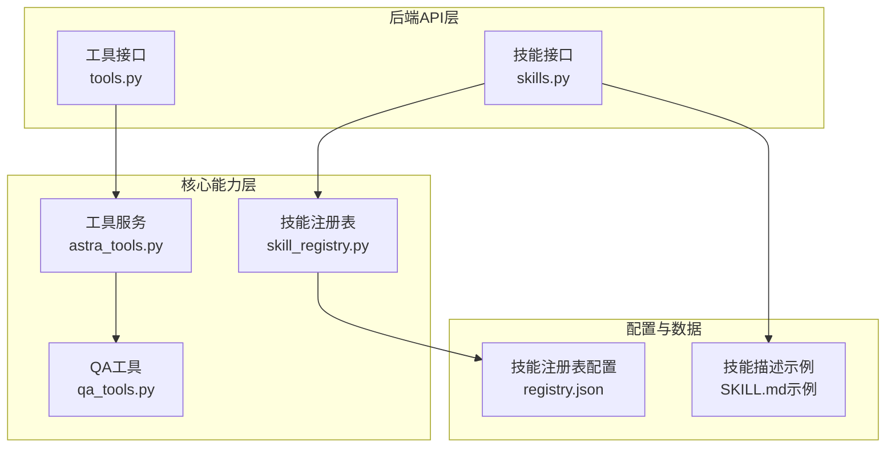
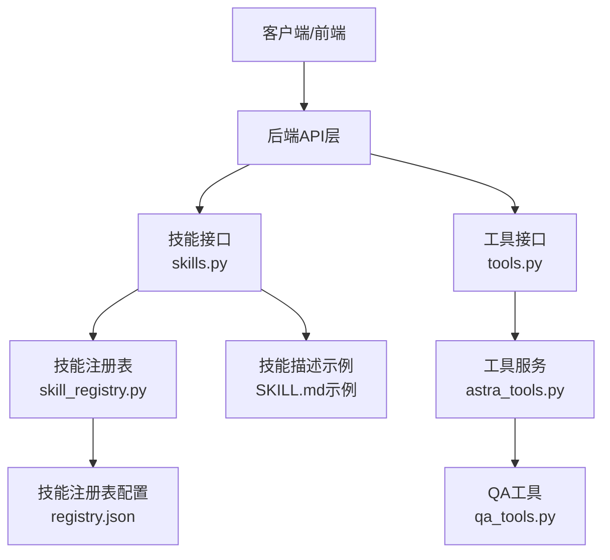
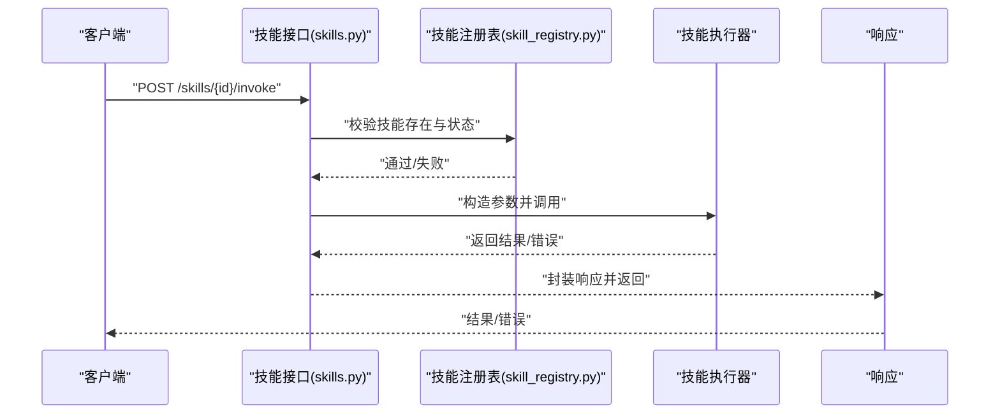
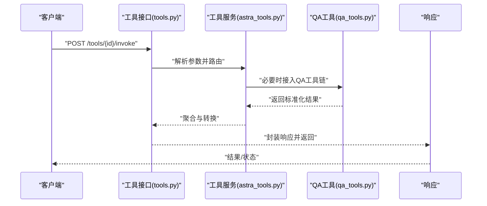
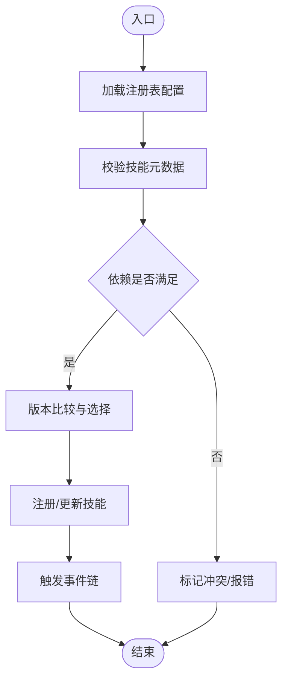
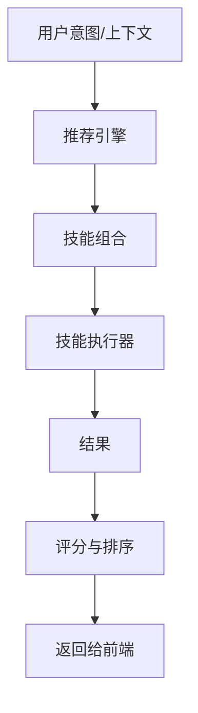
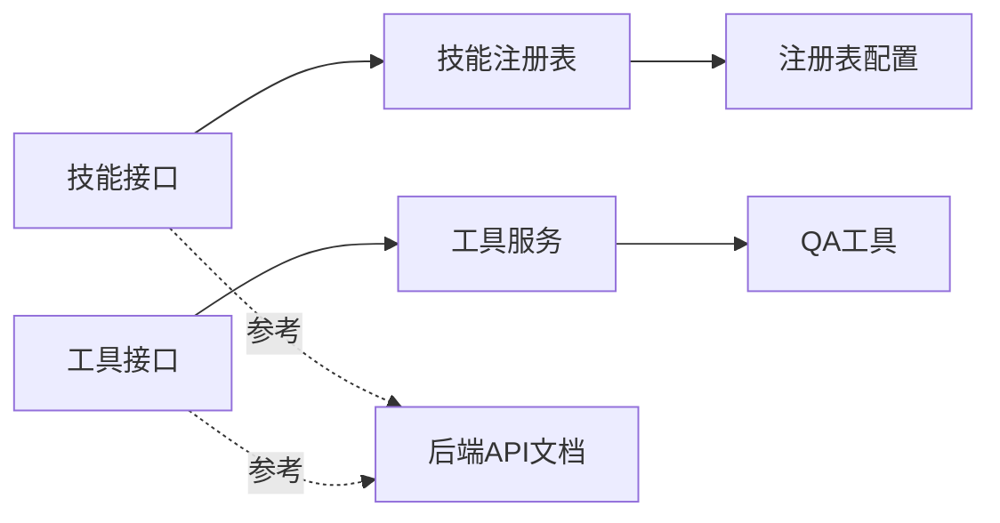

# 技能API

<cite>
**本文引用的文件**
- [skills.py](file://backend/app/api/skills.py)
- [tools.py](file://backend/app/api/tools.py)
- [skill_registry.py](file://backend/app/core/skill_registry.py)
- [astra_tools.py](file://backend/app/services/astra_tools.py)
- [qa_tools.py](file://backend/app/core/qa_tools.py)
- [后端api.md](file://后端api.md)
- [前后端api交互.md](file://前后端api交互.md)
- [registry.json](file://backend/data/config/skills/registry.json)
- [SKILL.md（示例）](file://.agents/skills/stitch-design-taste/SKILL.md)
</cite>

## 目录
1. [简介](#简介)
2. [项目结构](#项目结构)
3. [核心组件](#核心组件)
4. [架构总览](#架构总览)
5. [详细组件分析](#详细组件分析)
6. [依赖关系分析](#依赖关系分析)
7. [性能考量](#性能考量)
8. [故障排查指南](#故障排查指南)
9. [结论](#结论)
10. [附录](#附录)

## 简介
本文件为避风港平台的技能API文档，聚焦技能生命周期管理、技能执行器API、技能推荐与工具集成接口，以及技能版本与依赖管理策略。文档基于后端API与核心模块实现进行梳理，并结合现有交互与接口说明文档，形成可操作的接口规范与最佳实践。

## 项目结构
与技能API相关的核心位置如下：
- 后端API层：技能与工具接口定义
- 核心能力层：技能注册表、工具服务、QA工具等
- 配置与数据：技能注册表配置、示例技能描述文件

**图表来源**
- [skills.py](file://backend/app/api/skills.py)
- [tools.py](file://backend/app/api/tools.py)
- [skill_registry.py](file://backend/app/core/skill_registry.py)
- [astra_tools.py](file://backend/app/services/astra_tools.py)
- [qa_tools.py](file://backend/app/core/qa_tools.py)
- [registry.json](file://backend/data/config/skills/registry.json)
- [SKILL.md（示例）](file://.agents/skills/stitch-design-taste/SKILL.md)

**章节来源**
- [skills.py](file://backend/app/api/skills.py)
- [tools.py](file://backend/app/api/tools.py)
- [skill_registry.py](file://backend/app/core/skill_registry.py)
- [astra_tools.py](file://backend/app/services/astra_tools.py)
- [qa_tools.py](file://backend/app/core/qa_tools.py)
- [registry.json](file://backend/data/config/skills/registry.json)
- [SKILL.md（示例）](file://.agents/skills/stitch-design-taste/SKILL.md)

## 核心组件
- 技能接口层：提供技能注册、配置、启用/禁用、删除等REST接口；支持技能调用、参数传递、结果返回与错误处理。
- 工具接口层：提供工具注册、调用、状态监控等REST接口；与技能执行器协同工作。
- 技能注册表：维护技能清单、版本信息、依赖关系与冲突检测逻辑。
- 工具服务：封装工具调用、状态查询与结果聚合。
- QA工具：面向问答场景的工具集合与调用链适配。
- 配置与示例：技能注册表配置文件与技能描述模板，指导技能开发与集成。

**章节来源**
- [skills.py](file://backend/app/api/skills.py)
- [tools.py](file://backend/app/api/tools.py)
- [skill_registry.py](file://backend/app/core/skill_registry.py)
- [astra_tools.py](file://backend/app/services/astra_tools.py)
- [qa_tools.py](file://backend/app/core/qa_tools.py)
- [registry.json](file://backend/data/config/skills/registry.json)
- [SKILL.md（示例）](file://.agents/skills/stitch-design-taste/SKILL.md)

## 架构总览
技能系统围绕“接口层—核心能力层—配置与数据”展开，接口层负责对外暴露能力，核心能力层负责业务逻辑与状态管理，配置与数据层提供静态配置与动态数据支撑。

**图表来源**
- [skills.py](file://backend/app/api/skills.py)
- [tools.py](file://backend/app/api/tools.py)
- [skill_registry.py](file://backend/app/core/skill_registry.py)
- [astra_tools.py](file://backend/app/services/astra_tools.py)
- [qa_tools.py](file://backend/app/core/qa_tools.py)
- [registry.json](file://backend/data/config/skills/registry.json)
- [SKILL.md（示例）](file://.agents/skills/stitch-design-taste/SKILL.md)

## 详细组件分析

### 技能接口层（skills.py）
职责与能力
- 技能注册：接收技能元数据与配置，写入技能注册表。
- 技能配置：支持更新技能参数、依赖、版本等。
- 启用/禁用：切换技能可用状态，影响调度与执行。
- 删除：移除技能及其历史配置。
- 技能调用：触发技能执行器，传递输入参数，返回执行结果或流式输出。
- 错误处理：统一异常捕获与响应格式，便于前端展示与重试。

接口要点
- 路径与方法：参考后端API文档中的技能相关接口定义。
- 请求体字段：包含技能标识、版本、参数、上下文等。
- 响应体字段：包含执行状态、结果数据、错误码与消息。
- 认证与权限：遵循平台统一鉴权与RBAC策略。

**图表来源**
- [skills.py](file://backend/app/api/skills.py)
- [skill_registry.py](file://backend/app/core/skill_registry.py)

**章节来源**
- [skills.py](file://backend/app/api/skills.py)
- [后端api.md](file://后端api.md)

### 工具接口层（tools.py）
职责与能力
- 工具注册：登记工具元数据、参数规范与调用协议。
- 工具调用：根据工具类型与参数，执行具体动作并返回结果。
- 状态监控：查询工具执行状态、队列长度、错误统计等。
- 结果聚合：对多工具调用结果进行合并与标准化。

接口要点
- 路径与方法：参考后端API文档中的工具相关接口定义。
- 请求体字段：工具标识、参数映射、并发策略等。
- 响应体字段：状态码、结果对象、耗时统计、错误详情。
- 并发与限流：工具侧需配合平台级限流策略。

**图表来源**
- [tools.py](file://backend/app/api/tools.py)
- [astra_tools.py](file://backend/app/services/astra_tools.py)
- [qa_tools.py](file://backend/app/core/qa_tools.py)

**章节来源**
- [tools.py](file://backend/app/api/tools.py)
- [后端api.md](file://后端api.md)

### 技能注册表（skill_registry.py）
职责与能力
- 维护技能清单：包含技能ID、名称、版本、依赖、状态等。
- 版本控制：支持多版本并存与回滚策略。
- 依赖管理：解析技能间依赖关系，避免循环依赖与冲突。
- 冲突解决：当多个技能声明相同能力时，提供优先级与覆盖规则。
- 生命周期事件：在启用/禁用/删除等关键节点触发事件链。

**图表来源**
- [skill_registry.py](file://backend/app/core/skill_registry.py)
- [registry.json](file://backend/data/config/skills/registry.json)

**章节来源**
- [skill_registry.py](file://backend/app/core/skill_registry.py)
- [registry.json](file://backend/data/config/skills/registry.json)

### 工具服务（astra_tools.py）
职责与能力
- 工具编排：根据工具类型与参数，构建调用序列。
- 结果归一化：将不同工具的输出转换为统一结构。
- 错误传播：捕获工具异常并向上游反馈。
- 性能监控：记录调用耗时、成功率与失败原因。

**章节来源**
- [astra_tools.py](file://backend/app/services/astra_tools.py)

### QA工具（qa_tools.py）
职责与能力
- 问答适配：将技能与工具整合到问答流程中。
- 参数注入：根据上下文动态注入参数。
- 结果渲染：将复杂结果转换为可读性更强的表达。

**章节来源**
- [qa_tools.py](file://backend/app/core/qa_tools.py)

### 技能推荐与触发（概念性说明）
- 推荐触发：基于用户意图、历史行为与上下文，触发技能组合。
- 结果获取：从技能执行器获取结构化结果，进行二次加工。
- 评分机制：可基于命中度、时效性、合规性等维度对技能组合打分。
- 注意：本节为概念性说明，不直接对应具体源码文件。

[本图为概念性流程图，无需图表来源]

## 依赖关系分析
- 技能接口依赖技能注册表进行状态与元数据校验。
- 工具接口依赖工具服务与QA工具进行执行与结果处理。
- 技能注册表依赖配置文件进行初始化与持久化。
- 前后端交互遵循统一的API契约与认证授权策略。

**图表来源**
- [skills.py](file://backend/app/api/skills.py)
- [tools.py](file://backend/app/api/tools.py)
- [skill_registry.py](file://backend/app/core/skill_registry.py)
- [astra_tools.py](file://backend/app/services/astra_tools.py)
- [qa_tools.py](file://backend/app/core/qa_tools.py)
- [registry.json](file://backend/data/config/skills/registry.json)
- [后端api.md](file://后端api.md)

**章节来源**
- [skills.py](file://backend/app/api/skills.py)
- [tools.py](file://backend/app/api/tools.py)
- [skill_registry.py](file://backend/app/core/skill_registry.py)
- [astra_tools.py](file://backend/app/services/astra_tools.py)
- [qa_tools.py](file://backend/app/core/qa_tools.py)
- [registry.json](file://backend/data/config/skills/registry.json)
- [后端api.md](file://后端api.md)

## 性能考量
- 异步与流式：技能与工具调用建议采用异步与流式返回，提升用户体验。
- 缓存与预热：对常用技能与工具结果进行缓存，降低重复调用成本。
- 并发与限流：工具侧与平台侧共同实施限流策略，避免过载。
- 超时与重试：为长耗时任务设置合理超时与指数退避重试。
- 监控与告警：对关键指标（成功率、P95/P99、错误分布）建立监控。

[本节为通用性能建议，不直接分析具体文件]

## 故障排查指南
常见问题与定位思路
- 技能不可用：检查技能状态、依赖是否满足、版本是否正确。
- 工具调用失败：查看工具服务日志、参数映射、网络连通性。
- 返回格式异常：核对响应封装逻辑与字段映射。
- 权限不足：确认认证令牌与RBAC角色是否匹配接口要求。

定位依据
- 接口层统一异常处理与错误码。
- 注册表与配置文件的健康状态。
- 工具服务与QA工具的执行轨迹。

**章节来源**
- [skills.py](file://backend/app/api/skills.py)
- [tools.py](file://backend/app/api/tools.py)
- [astra_tools.py](file://backend/app/services/astra_tools.py)
- [skill_registry.py](file://backend/app/core/skill_registry.py)

## 结论
避风港平台的技能API以清晰的分层设计实现了从接口到核心能力再到配置数据的全链路贯通。通过技能注册表与工具服务的协同，平台能够稳定地管理技能生命周期、执行复杂任务并提供一致的响应体验。建议在实际开发中严格遵循接口规范、做好版本与依赖管理，并结合监控体系持续优化性能与稳定性。

## 附录

### 技能开发指南
- 元数据与配置：参考技能描述模板，完善技能ID、版本、参数与依赖。
- 接口契约：遵循后端API文档中的请求/响应规范，确保字段一致。
- 测试与验证：在本地与沙箱环境中验证技能调用与错误处理。
- 文档与示例：提供最小可运行示例与常见问题解答。

**章节来源**
- [SKILL.md（示例）](file://.agents/skills/stitch-design-taste/SKILL.md)
- [后端api.md](file://后端api.md)

### 接口使用示例与最佳实践
- 示例路径：参考后端API文档中的技能与工具接口示例。
- 最佳实践：
  - 明确参数边界与默认值。
  - 对外部依赖进行降级与容错。
  - 使用幂等设计避免重复执行。
  - 在前端进行必要的输入校验与提示。

**章节来源**
- [后端api.md](file://后端api.md)
- [前后端api交互.md](file://前后端api交互.md)