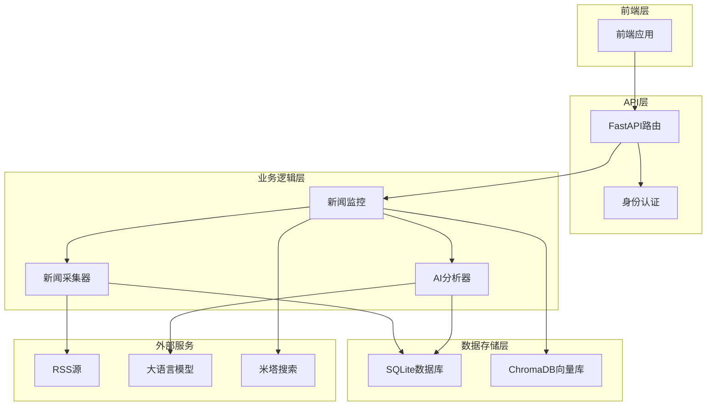
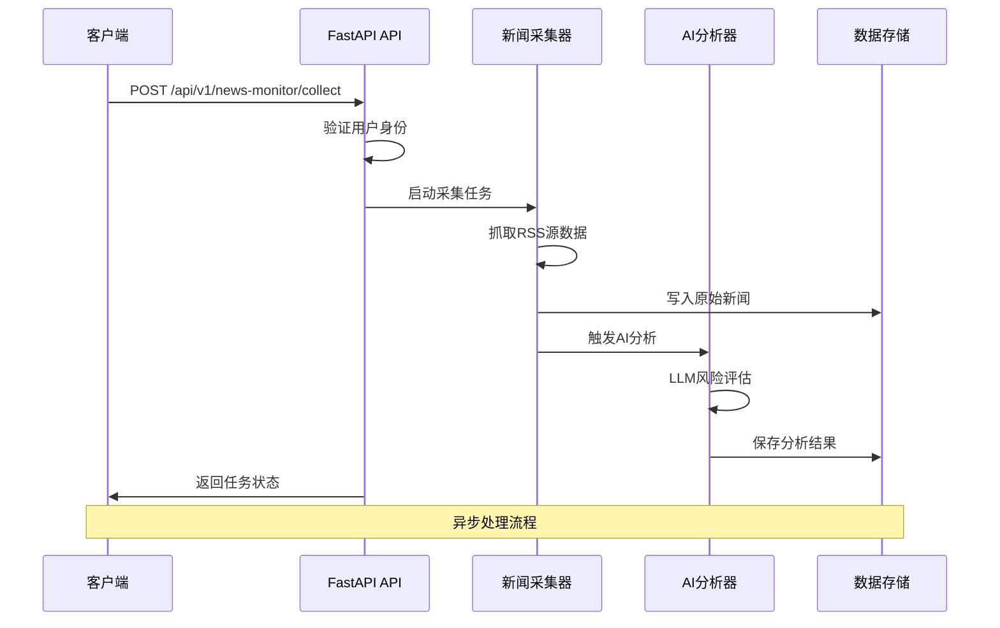
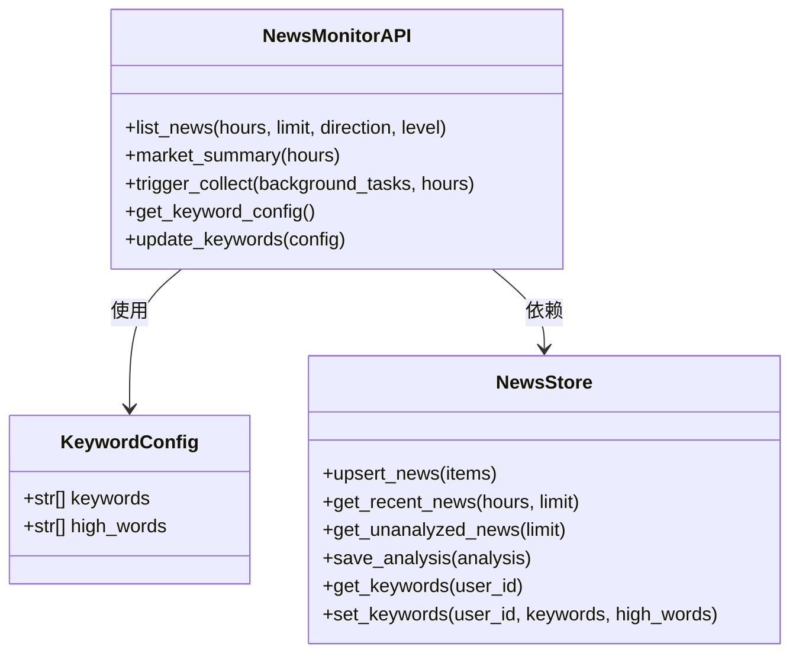
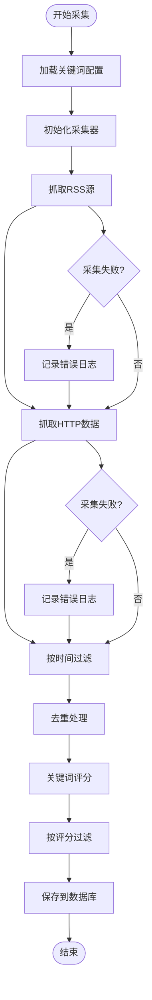
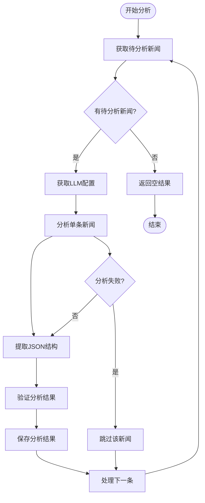
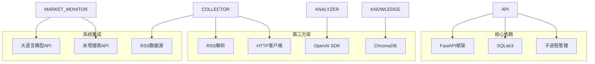

# 新闻监控API

<cite>
**本文档引用的文件**
- [news_monitor.py](file://backend/app/api/news_monitor.py)
- [news_store.py](file://backend/app/storage/news_store.py)
- [news_collector.py](file://backend/data/skills/news-collect/script/news_collector.py)
- [news_analyzer.py](file://backend/data/skills/news-analyze/script/news_analyzer.py)
- [market_monitor.py](file://backend/app/core/market_monitor.py)
- [metaso_search.py](file://backend/app/services/metaso_search.py)
- [store.py](file://backend/app/knowledge/store.py)
</cite>

## 目录
1. [简介](#简介)
2. [项目结构](#项目结构)
3. [核心组件](#核心组件)
4. [架构概览](#架构概览)
5. [详细组件分析](#详细组件分析)
6. [依赖关系分析](#依赖关系分析)
7. [性能考虑](#性能考虑)
8. [故障排除指南](#故障排除指南)
9. [结论](#结论)

## 简介

新闻监控API是一个基于FastAPI构建的跨境电商合规新闻监控系统。该系统能够自动采集全球主要经济和监管新闻源，通过AI分析评估对跨境电商的潜在影响，并提供实时的风险监控和预警功能。

系统采用模块化设计，包含新闻采集、AI分析、数据存储和API服务四个核心层次，支持手动触发和定时任务两种运行模式。

## 项目结构

**图表来源**
- [news_monitor.py:1-158](file://backend/app/api/news_monitor.py#L1-L158)
- [news_store.py:1-210](file://backend/app/storage/news_store.py#L1-L210)

**章节来源**
- [news_monitor.py:1-158](file://backend/app/api/news_monitor.py#L1-L158)
- [news_store.py:1-210](file://backend/app/storage/news_store.py#L1-L210)

## 核心组件

### API路由层
新闻监控API提供以下核心端点：
- `GET /api/v1/news-monitor/news` - 获取最新已分析新闻列表
- `GET /api/v1/news-monitor/summary` - 市场风险摘要
- `POST /api/v1/news-monitor/collect` - 手动触发采集+分析
- `GET /api/v1/news-monitor/keywords` - 获取关键词配置
- `PUT /api/v1/news-monitor/keywords` - 更新关键词配置

### 数据存储层
采用SQLite数据库存储新闻数据，包含三个核心表：
- `monitored_news` - 原始新闻条目
- `news_analyses` - AI分析结果
- `news_keyword_config` - 用户关键词配置

### 新闻采集器
支持多个国际数据源的RSS订阅和HTTP抓取：
- 美联储新闻 (Federal Reserve)
- 中国新闻网财经 (China News)
- 金十数据 (Jin10 Flash)
- WTO新闻 (World Trade Organization)
- 欧洲央行 (European Central Bank)
- 国际清算银行 (Bank for International Settlements)

### AI分析引擎
基于大语言模型的新闻风险分析，提供：
- 风险方向分类（利多/利空/中性）
- 风险等级评估（high/medium/low）
- 影响市场识别
- 分析置信度评分

**章节来源**
- [news_monitor.py:33-158](file://backend/app/api/news_monitor.py#L33-L158)
- [news_store.py:23-210](file://backend/app/storage/news_store.py#L23-L210)

## 架构概览

**图表来源**
- [news_monitor.py:87-137](file://backend/app/api/news_monitor.py#L87-L137)
- [news_collector.py:287-327](file://backend/data/skills/news-collect/script/news_collector.py#L287-L327)
- [news_analyzer.py:130-152](file://backend/data/skills/news-analyze/script/news_analyzer.py#L130-L152)

## 详细组件分析

### 新闻监控API路由

**图表来源**
- [news_monitor.py:33-158](file://backend/app/api/news_monitor.py#L33-L158)
- [news_store.py:63-210](file://backend/app/storage/news_store.py#L63-L210)

### 新闻采集器组件

**图表来源**
- [news_collector.py:287-327](file://backend/data/skills/news-collect/script/news_collector.py#L287-L327)
- [news_collector.py:132-249](file://backend/data/skills/news-collect/script/news_collector.py#L132-L249)

### AI分析器组件

**图表来源**
- [news_analyzer.py:88-128](file://backend/data/skills/news-analyze/script/news_analyzer.py#L88-L128)
- [news_analyzer.py:130-152](file://backend/data/skills/news-analyze/script/news_analyzer.py#L130-L152)

**章节来源**
- [news_monitor.py:40-158](file://backend/app/api/news_monitor.py#L40-L158)
- [news_collector.py:1-382](file://backend/data/skills/news-collect/script/news_collector.py#L1-L382)
- [news_analyzer.py:1-228](file://backend/data/skills/news-analyze/script/news_analyzer.py#L1-L228)

## 依赖关系分析

**图表来源**
- [news_monitor.py:16-25](file://backend/app/api/news_monitor.py#L16-L25)
- [news_collector.py:35-43](file://backend/data/skills/news-collect/script/news_collector.py#L35-L43)
- [news_analyzer.py:103-104](file://backend/data/skills/news-analyze/script/news_analyzer.py#L103-L104)

**章节来源**
- [news_store.py:9-210](file://backend/app/storage/news_store.py#L9-L210)
- [market_monitor.py:19-21](file://backend/app/core/market_monitor.py#L19-L21)

## 性能考虑

### 数据库优化
- 使用SQLite轻量级数据库，适合中小规模数据存储
- 建立适当的索引以优化查询性能
- 批量插入操作减少数据库往返次数

### 缓存策略
- 关键词配置采用内存缓存机制
- ChromaDB向量搜索结果可进行本地缓存
- RSS源数据可设置合理的缓存时间

### 并发处理
- 使用异步任务处理长时间运行的采集和分析
- 子进程隔离确保系统稳定性
- 限流机制防止API滥用

### 监控指标
- 记录采集成功率和失败原因
- 监控分析延迟和吞吐量
- 追踪用户关键词命中率

## 故障排除指南

### 常见问题诊断

**采集器问题**
- RSS源不可达：检查网络连接和代理设置
- 解析失败：验证RSS格式兼容性
- 时间戳解析错误：检查时区转换逻辑

**AI分析问题**
- API密钥配置错误：验证环境变量设置
- LLM响应超时：调整超时参数和重试策略
- JSON格式解析失败：检查系统提示词格式

**数据库问题**
- 连接池耗尽：检查并发连接数限制
- 表结构不匹配：运行数据库初始化脚本
- 索引缺失：创建必要的查询索引

### 日志分析
系统提供详细的日志记录，包括：
- 采集过程中的错误信息
- AI分析的警告和异常
- 数据库操作的执行结果
- 用户权限验证状态

**章节来源**
- [news_monitor.py:99-137](file://backend/app/api/news_monitor.py#L99-L137)
- [news_collector.py:160-162](file://backend/data/skills/news-collect/script/news_collector.py#L160-L162)
- [news_analyzer.py:125-127](file://backend/data/skills/news-analyze/script/news_analyzer.py#L125-L127)

## 结论

新闻监控API提供了一个完整的跨境电商合规新闻监控解决方案。通过模块化的架构设计，系统实现了高效的新闻采集、智能的AI分析和便捷的API服务。

主要优势包括：
- 支持多源数据采集，覆盖主要国际经济和监管新闻
- 基于AI的风险评估提供专业洞察
- 灵活的关键词配置满足个性化需求
- 开放的API接口便于集成到现有系统

未来可以考虑的功能增强：
- 添加更多的数据源支持
- 实现更复杂的机器学习模型
- 增强实时推送功能
- 扩展移动端支持