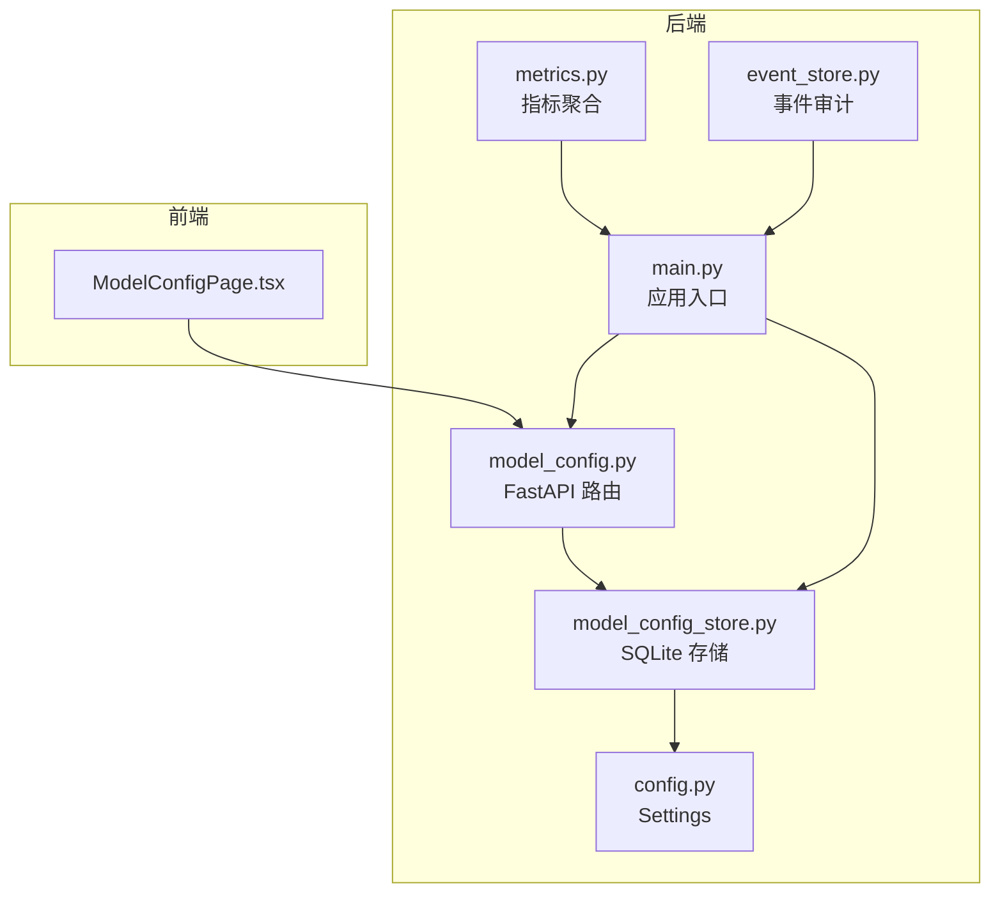
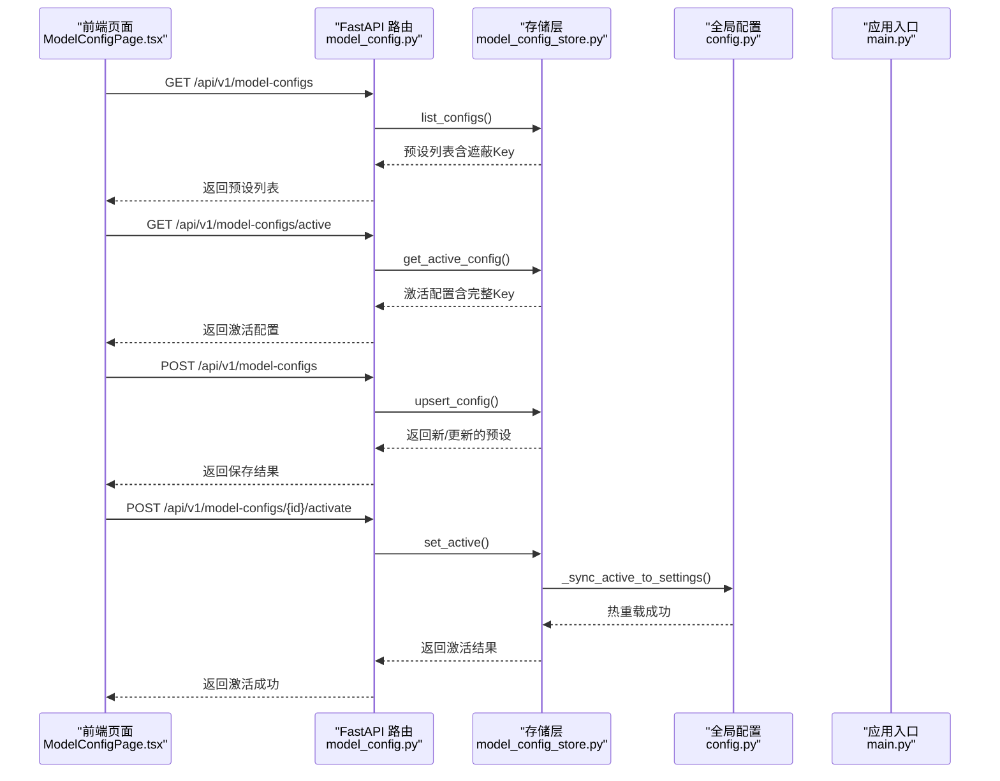
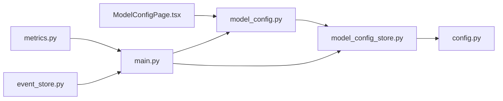

# 模型配置API

<cite>
**本文引用的文件**
- [backend/app/api/model_config.py](file://backend/app/api/model_config.py)
- [backend/app/storage/model_config_store.py](file://backend/app/storage/model_config_store.py)
- [backend/app/config.py](file://backend/app/config.py)
- [backend/app/main.py](file://backend/app/main.py)
- [frontend/src/pages/ModelConfigPage.tsx](file://frontend/src/pages/ModelConfigPage.tsx)
- [backend/app/core/metrics.py](file://backend/app/core/metrics.py)
- [backend/app/storage/event_store.py](file://backend/app/storage/event_store.py)
- [README.md](file://README.md)
</cite>

## 目录
1. [简介](#简介)
2. [项目结构](#项目结构)
3. [核心组件](#核心组件)
4. [架构概览](#架构概览)
5. [详细组件分析](#详细组件分析)
6. [依赖关系分析](#依赖关系分析)
7. [性能考虑](#性能考虑)
8. [故障排除指南](#故障排除指南)
9. [结论](#结论)
10. [附录](#附录)

## 简介
本文件面向“模型配置API”的完整技术文档，涵盖以下方面：
- LLM模型配置、API密钥管理、模型参数调整等配置接口
- 支持的模型提供商、模型切换机制和配置验证功能
- 模型配置的数据结构、参数选项和默认值设置
- 模型性能监控、成本控制和使用统计功能
- 配置变更的日志记录和审计功能
- 最佳实践和性能优化建议
- 完整的配置示例和故障排除指南

该系统采用前后端分离架构：后端使用FastAPI提供REST API，前端使用React进行可视化管理。模型配置采用SQLite存储，并支持热重载至全局配置对象，实现“预设管理（admin写，user只读激活配置）”。

## 项目结构
后端核心文件组织如下：
- API层：负责HTTP接口定义与权限控制
- 存储层：负责模型配置的持久化与热重载
- 配置层：集中管理运行时参数（包括LLM提供商、模型、嵌入模型等）
- 前端页面：提供模型配置的可视化界面与测试能力

图表来源
- [backend/app/api/model_config.py:1-173](file://backend/app/api/model_config.py#L1-L173)
- [backend/app/storage/model_config_store.py:1-174](file://backend/app/storage/model_config_store.py#L1-L174)
- [backend/app/config.py:1-75](file://backend/app/config.py#L1-L75)
- [backend/app/main.py:1-76](file://backend/app/main.py#L1-L76)
- [backend/app/core/metrics.py:1-176](file://backend/app/core/metrics.py#L1-L176)
- [backend/app/storage/event_store.py:1-115](file://backend/app/storage/event_store.py#L1-L115)

章节来源
- [README.md:92-200](file://README.md#L92-L200)

## 核心组件
- 模型配置API（FastAPI）：提供预设列表、激活配置、创建/更新/删除预设、激活预设等接口
- 模型配置存储（SQLite）：提供CRUD与激活逻辑，支持热重载至全局配置
- 全局配置（Settings）：集中管理LLM提供商、模型、嵌入模型、JWT等运行时参数
- 前端模型配置页面：提供可视化编辑、测试连接、激活与删除能力
- 指标监控（metrics.py）：提供用户级仪表盘数据聚合（健康分、风险分布、趋势）
- 事件审计（event_store.py）：记录系统事件与操作链，支持审计追踪

章节来源
- [backend/app/api/model_config.py:1-173](file://backend/app/api/model_config.py#L1-L173)
- [backend/app/storage/model_config_store.py:1-174](file://backend/app/storage/model_config_store.py#L1-L174)
- [backend/app/config.py:1-75](file://backend/app/config.py#L1-L75)
- [frontend/src/pages/ModelConfigPage.tsx:1-441](file://frontend/src/pages/ModelConfigPage.tsx#L1-L441)
- [backend/app/core/metrics.py:1-176](file://backend/app/core/metrics.py#L1-L176)
- [backend/app/storage/event_store.py:1-115](file://backend/app/storage/event_store.py#L1-L115)

## 架构概览
模型配置API的调用链路如下：

图表来源
- [backend/app/api/model_config.py:62-151](file://backend/app/api/model_config.py#L62-L151)
- [backend/app/storage/model_config_store.py:52-156](file://backend/app/storage/model_config_store.py#L52-L156)
- [backend/app/config.py:31-38](file://backend/app/config.py#L31-L38)
- [backend/app/main.py:60-70](file://backend/app/main.py#L60-L70)

## 详细组件分析

### API层：模型配置接口
- 预设列表（GET /api/v1/model-configs）
  - 返回所有预设，API Key以遮蔽形式展示
  - 仅登录用户可访问
- 激活配置（GET /api/v1/model-configs/active）
  - 返回当前激活的预设（含完整API Key），仅登录用户可访问
- 新建预设（POST /api/v1/model-configs）
  - 需要管理员权限
  - 参数包括名称、API Key、Base URL、模型名称、温度、Top-P、最大Token、嵌入模型
- 更新预设（PUT /api/v1/model-configs/{id}）
  - 需要管理员权限
  - 支持部分字段更新
- 删除预设（DELETE /api/v1/model-configs/{id}）
  - 需要管理员权限
- 激活预设（POST /api/v1/model-configs/{id}/activate）
  - 需要管理员权限
  - 激活后同步热重载至全局配置

章节来源
- [backend/app/api/model_config.py:62-151](file://backend/app/api/model_config.py#L62-L151)

### 存储层：模型配置持久化与热重载
- 表结构
  - 字段：id、name、api_key、base_url、model、temperature、top_p、max_tokens、embed_model、is_active、created_at、updated_at
  - is_active为全局唯一激活标志，激活某条时会将其他预设置为非激活
- CRUD与激活
  - list_configs：支持隐藏API Key
  - get_active_config：返回当前激活配置
  - upsert_config：新建或更新预设
  - set_active：激活指定预设并热重载至全局配置
  - delete_config：删除预设
- 热重载机制
  - _sync_active_to_settings：将激活的预设写入全局settings（llm_api_key、llm_base_url、llm_model）

章节来源
- [backend/app/storage/model_config_store.py:20-174](file://backend/app/storage/model_config_store.py#L20-L174)

### 配置层：全局Settings
- 主交互LLM（优先级最高）
  - llm_api_key：主LLM API Key；非空时覆盖openrouter_api_key
  - llm_base_url：主LLM Base URL；非空时覆盖openrouter_base_url
  - llm_model：主LLM模型名称
  - llm_disable_thinking：MiMo关闭thinking模式，降低延迟
- 兼容旧字段/备用LLM
  - openrouter_api_key、openrouter_base_url、embedding_model
- 辅助配置
  - data_dir、prompt_dir、codex_*、jwt_*、scheduler_* 等

章节来源
- [backend/app/config.py:5-75](file://backend/app/config.py#L5-L75)

### 前端：模型配置页面
- 功能特性
  - 预设列表展示与选择
  - 新建/编辑/删除预设（管理员）
  - 激活预设（管理员）
  - 测试后端连接（健康检查）
  - 表单字段：名称、API Key、Base URL、模型、Temperature、Top-P、Max Tokens、Embedding模型
- 默认值
  - Base URL、模型、Temperature、Top-P、Max Tokens、Embedding模型在前端页面中提供默认值

章节来源
- [frontend/src/pages/ModelConfigPage.tsx:1-441](file://frontend/src/pages/ModelConfigPage.tsx#L1-L441)

### 指标监控：健康分与趋势
- 指标聚合
  - total_products、risk_distribution、recent_alerts、active_markets、health_score、trend
- 计算逻辑
  - 健康分：基础100分，扣分项包括高风险产品、无HS编码产品、待处理high/critical预警；近7天合规检查加分
  - 趋势：近30天合规检查数量按日统计
- 数据来源
  - L2项目记忆（产品数、合规记录）
  - L5事件存储（预警数）
  - L3用户记忆（偏好市场）

章节来源
- [backend/app/core/metrics.py:20-176](file://backend/app/core/metrics.py#L20-L176)

### 事件审计：操作链与系统事件
- 事件记录
  - 统一结构：event_id、event_type、source、description_nl、severity、payload、tags、user_id、timestamp
  - 支持系统事件与操作链合并
- 使用场景
  - 审计追踪、Dashboard事件时间线、决策回溯
- 写入时机
  - 每次操作/事件发生时写入

章节来源
- [backend/app/storage/event_store.py:22-115](file://backend/app/storage/event_store.py#L22-L115)

## 依赖关系分析
- API依赖存储层进行CRUD与激活
- 存储层在激活时依赖全局配置进行热重载
- 应用入口在启动时初始化默认模型配置
- 前端通过认证上下文调用API
- 指标模块与事件模块为上层功能提供数据支撑

图表来源
- [backend/app/api/model_config.py:1-173](file://backend/app/api/model_config.py#L1-L173)
- [backend/app/storage/model_config_store.py:1-174](file://backend/app/storage/model_config_store.py#L1-L174)
- [backend/app/config.py:1-75](file://backend/app/config.py#L1-L75)
- [backend/app/main.py:1-76](file://backend/app/main.py#L1-L76)
- [backend/app/core/metrics.py:1-176](file://backend/app/core/metrics.py#L1-L176)
- [backend/app/storage/event_store.py:1-115](file://backend/app/storage/event_store.py#L1-L115)

章节来源
- [backend/app/main.py:60-70](file://backend/app/main.py#L60-L70)

## 性能考虑
- 激活预设的热重载
  - set_active会将激活配置写入全局settings，避免每次调用重建客户端
  - 建议在生产环境避免频繁切换，减少不必要的热重载
- 温度与Top-P
  - Temperature影响生成多样性；Top-P控制核采样范围
  - 建议在稳定场景下调低Temperature以提升确定性
- 最大Token
  - 合理设置max_tokens，避免过长上下文导致延迟增加
- 嵌入模型
  - Embedding模型影响RAG检索效率，建议根据业务规模选择合适模型
- 健康分与趋势
  - 通过指标监控评估整体使用情况，及时发现异常

[本节为通用性能建议，无需特定文件引用]

## 故障排除指南
- 前端无法连接后端
  - 使用“测试后端连接”按钮，检查/health端点是否返回正常
  - 确认CORS配置允许前端域名访问
- 保存/更新预设失败
  - 检查管理员权限；确认必填字段（名称、Base URL、模型）正确
  - 查看后端返回的错误详情
- 激活预设无效
  - 确认预设存在且ID有效
  - 检查全局配置是否成功热重载（可通过重启服务验证）
- API Key显示为遮蔽值
  - 激活配置接口才返回完整Key；非激活预设在前端表单中需手动填写
- 指标数据为空
  - 确认数据目录存在且有产品/预警/用户偏好数据
  - 检查文件读取权限与JSON格式

章节来源
- [frontend/src/pages/ModelConfigPage.tsx:186-198](file://frontend/src/pages/ModelConfigPage.tsx#L186-L198)
- [backend/app/api/model_config.py:76-90](file://backend/app/api/model_config.py#L76-L90)
- [backend/app/storage/model_config_store.py:118-132](file://backend/app/storage/model_config_store.py#L118-L132)
- [backend/app/core/metrics.py:49-91](file://backend/app/core/metrics.py#L49-L91)

## 结论
模型配置API提供了完善的LLM预设管理能力，结合SQLite存储与全局配置热重载，实现了“管理员创建/维护、用户只读激活”的权限模型。配合指标监控与事件审计，能够满足合规场景下的性能监控、成本控制与审计追溯需求。建议在生产环境中遵循最小权限原则与参数优化策略，确保稳定性与安全性。

[本节为总结性内容，无需特定文件引用]

## 附录

### API定义与参数说明
- 获取所有预设
  - 方法：GET
  - 路径：/api/v1/model-configs
  - 权限：登录用户
  - 响应：预设列表（API Key遮蔽）
- 获取当前激活配置
  - 方法：GET
  - 路径：/api/v1/model-configs/active
  - 权限：登录用户
  - 响应：激活配置（含完整API Key）
- 新建预设
  - 方法：POST
  - 路径：/api/v1/model-configs
  - 权限：管理员
  - 请求体：名称、API Key、Base URL、模型、Temperature、Top-P、Max Tokens、Embedding模型
- 更新预设
  - 方法：PUT
  - 路径：/api/v1/model-configs/{id}
  - 权限：管理员
  - 请求体：同上
- 删除预设
  - 方法：DELETE
  - 路径：/api/v1/model-configs/{id}
  - 权限：管理员
- 激活预设
  - 方法：POST
  - 路径：/api/v1/model-configs/{id}/activate
  - 权限：管理员
  - 响应：激活成功提示

章节来源
- [backend/app/api/model_config.py:62-151](file://backend/app/api/model_config.py#L62-L151)
- [README.md:247-253](file://README.md#L247-L253)

### 数据结构与默认值
- 预设字段
  - 名称、Base URL、模型、Temperature、Top-P、Max Tokens、Embedding模型、创建/更新时间
- 默认值（前端页面）
  - Base URL：https://api.xiaomimimo.com/v1
  - 模型：mimo-v2.5-pro
  - Temperature：1.0
  - Top-P：0.95
  - Max Tokens：2048
  - Embedding模型：paraphrase-multilingual-MiniLM-L12-v2

章节来源
- [frontend/src/pages/ModelConfigPage.tsx:32-41](file://frontend/src/pages/ModelConfigPage.tsx#L32-L41)
- [backend/app/api/model_config.py:36-45](file://backend/app/api/model_config.py#L36-L45)

### 支持的模型提供商与切换机制
- 支持的提供商
  - MiMo（通过Base URL与模型名称配置）
  - OpenRouter（兼容旧字段，可作为备用）
- 切换机制
  - 通过激活不同预设实现Provider切换
  - 激活后热重载至全局配置，后续调用使用新配置

章节来源
- [backend/app/config.py:20-30](file://backend/app/config.py#L20-L30)
- [backend/app/storage/model_config_store.py:143-156](file://backend/app/storage/model_config_store.py#L143-L156)

### 配置验证与安全
- 配置验证
  - 前端表单对数值范围进行约束（Temperature、Top-P、Max Tokens）
  - 后端通过Pydantic模型校验请求体
- 安全措施
  - API Key在预设列表中遮蔽显示
  - 激活配置接口仅在受保护的JWT上下文中返回完整Key
  - 管理员权限控制预设的创建/更新/删除/激活

章节来源
- [frontend/src/pages/ModelConfigPage.tsx:352-366](file://frontend/src/pages/ModelConfigPage.tsx#L352-L366)
- [backend/app/api/model_config.py:36-58](file://backend/app/api/model_config.py#L36-L58)

### 性能监控与成本控制
- 指标聚合
  - 健康分、风险分布、趋势、产品数、活跃市场
- 成本控制建议
  - 合理设置Temperature与Top-P，降低生成长度
  - 控制Max Tokens，避免超长上下文
  - 使用合适的嵌入模型，平衡精度与性能

章节来源
- [backend/app/core/metrics.py:20-176](file://backend/app/core/metrics.py#L20-L176)

### 审计与日志
- 事件记录
  - 统一事件结构，支持系统事件与操作链合并
  - 写入时机：每次操作/事件发生时
- 审计用途
  - 审计追踪、Dashboard事件时间线、决策回溯

章节来源
- [backend/app/storage/event_store.py:22-115](file://backend/app/storage/event_store.py#L22-L115)

### 最佳实践
- 管理员职责
  - 仅管理员创建/更新/删除/激活预设
  - 定期检查预设有效性与API Key可用性
- 参数优化
  - 在稳定场景下降低Temperature，提高确定性
  - 合理设置Top-P与Max Tokens，平衡质量与成本
- 安全建议
  - 避免在预设中泄露敏感信息
  - 使用HTTPS与强JWT密钥
- 监控与审计
  - 定期查看健康分与趋势，及时发现异常
  - 保留事件日志以满足审计要求

[本节为通用最佳实践，无需特定文件引用]