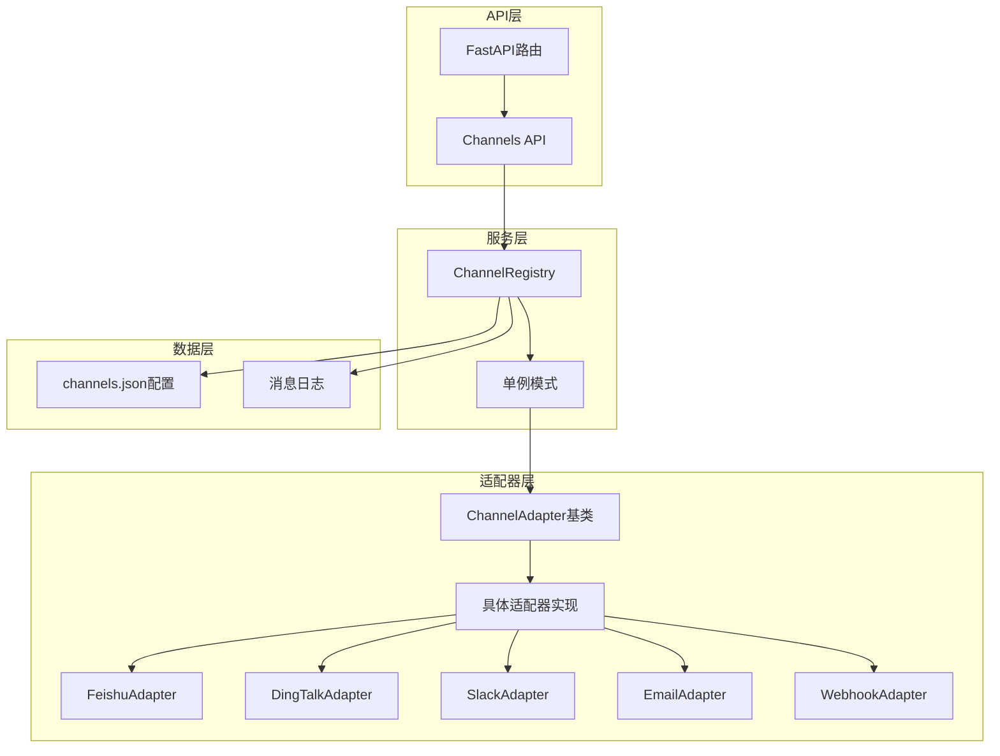
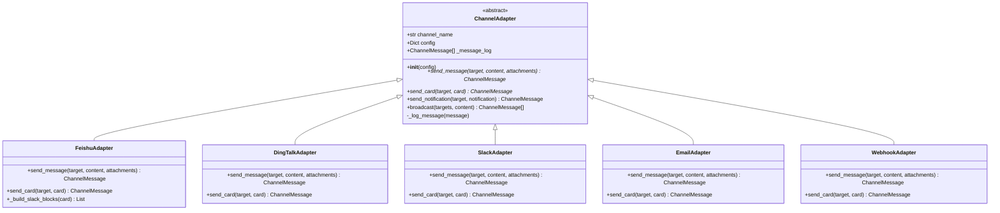
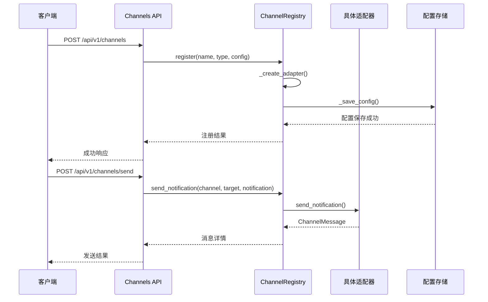
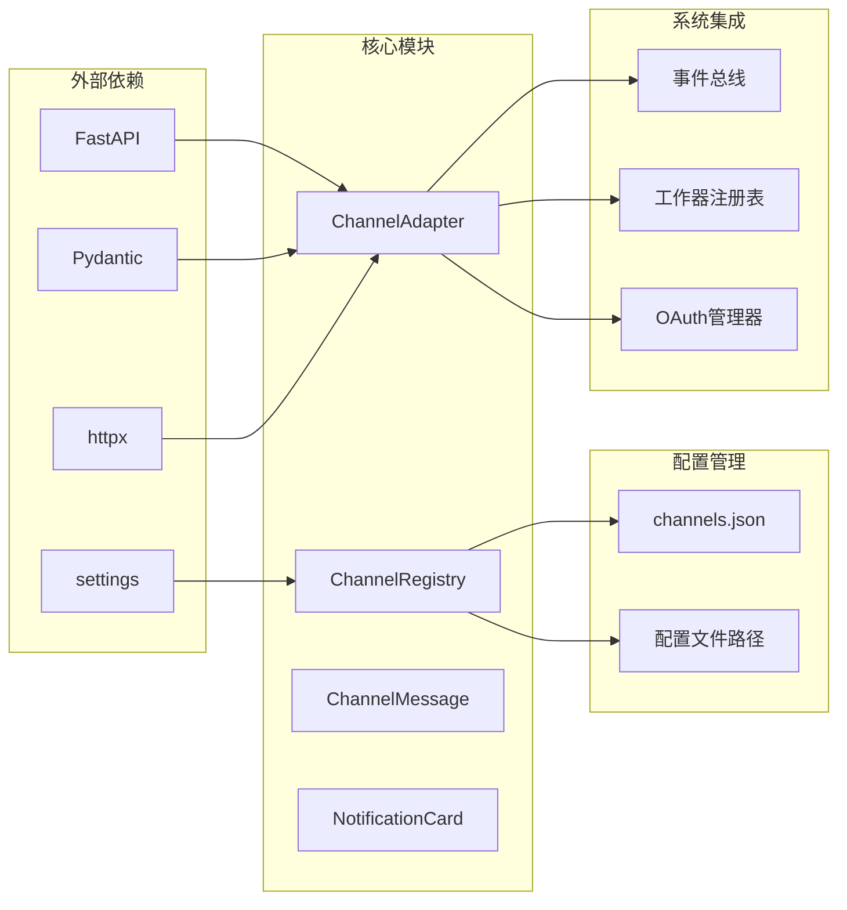

# 渠道适配器API

<cite>
**本文档引用的文件**
- [backend/app/core/channel_adapter.py](file://backend/app/core/channel_adapter.py)
- [backend/app/api/channels.py](file://backend/app/api/channels.py)
- [backend/app/main.py](file://backend/app/main.py)
- [后端api.md](file://后端api.md)
- [后端变更路线图.md](file://后端变更路线图.md)
- [backend/data/config/channels.json](file://backend/data/config/channels.json)
</cite>

## 目录
1. [简介](#简介)
2. [项目结构](#项目结构)
3. [核心组件](#核心组件)
4. [架构概览](#架构概览)
5. [详细组件分析](#详细组件分析)
6. [依赖关系分析](#依赖关系分析)
7. [性能考虑](#性能考虑)
8. [故障排除指南](#故障排除指南)
9. [结论](#结论)

## 简介

渠道适配器API是避风港OS级合规智能体系统中的一个关键组件，负责统一管理和调度各种通信渠道（如飞书、钉钉、Slack、邮件、Webhook等）。该系统采用适配器模式设计，提供了灵活的消息发送机制，支持文本消息、交互式卡片消息和通知等多种消息类型。

该API的核心目标是为系统提供统一的渠道管理接口，使得开发者可以轻松地添加新的通信渠道支持，而无需修改核心业务逻辑。通过配置文件驱动的方式，系统可以在运行时动态注册和管理不同的渠道适配器。

## 项目结构

渠道适配器API在项目中的组织结构如下：

```mermaid
graph TB
subgraph "后端应用结构"
A[backend/] --> B[app/]
B --> C[api/]
B --> D[core/]
B --> E[data/]
C --> F[channels.py<br/>渠道API路由]
D --> G[channel_adapter.py<br/>适配器核心]
E --> H[config/channels.json<br/>配置文件]
end
subgraph "API端点"
I[/api/v1/channels<br/>渠道管理]
J[/api/v1/channels/send<br/>发送通知]
K[/api/v1/channels/broadcast<br/>广播消息]
end
F --> I
F --> J
F --> K
```

**图表来源**
- [backend/app/api/channels.py:1-79](file://backend/app/api/channels.py#L1-L79)
- [backend/app/core/channel_adapter.py:707-809](file://backend/app/core/channel_adapter.py#L707-L809)

**章节来源**
- [backend/app/api/channels.py:1-79](file://backend/app/api/channels.py#L1-L79)
- [backend/app/core/channel_adapter.py:707-809](file://backend/app/core/channel_adapter.py#L707-L809)

## 核心组件

渠道适配器API主要包含以下核心组件：

### 1. ChannelAdapter 抽象基类
这是所有渠道适配器的基础类，定义了统一的接口规范：
- `send_message()`: 发送文本消息
- `send_card()`: 发送交互式卡片消息
- `send_notification()`: 发送通知消息
- `broadcast()`: 广播消息到多个目标

### 2. ChannelRegistry 注册表
管理所有已配置的渠道适配器，提供：
- 频道注册和注销
- 配置文件的持久化
- 频道列表查询
- 广播功能

### 3. ChannelMessage 数据模型
标准化的消息表示，包含：
- 目标ID、内容、标题
- 消息类型（text/card/notification/markdown）
- 状态跟踪（pending/sent/failed）
- 时间戳和错误信息

### 4. NotificationCard 通知卡片
专门用于构建交互式通知的卡片组件，支持：
- 标题和描述
- 严重级别（info/warning/error/success）
- 产品ID深度链接
- 自定义字段和操作按钮

**章节来源**
- [backend/app/core/channel_adapter.py:73-102](file://backend/app/core/channel_adapter.py#L73-L102)
- [backend/app/core/channel_adapter.py:41-68](file://backend/app/core/channel_adapter.py#L41-L68)
- [backend/app/core/channel_adapter.py:707-798](file://backend/app/core/channel_adapter.py#L707-L798)

## 架构概览

渠道适配器API采用了清晰的分层架构设计：



**图表来源**
- [backend/app/api/channels.py:17-79](file://backend/app/api/channels.py#L17-L79)
- [backend/app/core/channel_adapter.py:707-809](file://backend/app/core/channel_adapter.py#L707-L809)

该架构的主要特点：
- **抽象层次清晰**: 通过抽象基类定义统一接口
- **可扩展性强**: 支持轻松添加新的渠道适配器
- **配置驱动**: 通过JSON配置文件管理渠道设置
- **状态管理**: 内置消息发送状态跟踪

## 详细组件分析

### ChannelAdapter 抽象基类

ChannelAdapter是整个系统的核心抽象，定义了所有渠道适配器必须实现的基本方法：



**图表来源**
- [backend/app/core/channel_adapter.py:73-102](file://backend/app/core/channel_adapter.py#L73-L102)
- [backend/app/core/channel_adapter.py:350-420](file://backend/app/core/channel_adapter.py#L350-L420)
- [backend/app/core/channel_adapter.py:421-490](file://backend/app/core/channel_adapter.py#L421-L490)

### ChannelRegistry 注册表

ChannelRegistry负责管理所有渠道适配器的生命周期：



**图表来源**
- [backend/app/api/channels.py:44-79](file://backend/app/api/channels.py#L44-L79)
- [backend/app/core/channel_adapter.py:748-798](file://backend/app/core/channel_adapter.py#L748-L798)

### API端点设计

渠道适配器API提供了完整的RESTful接口：

| 方法 | 路径 | 功能描述 | 请求体 | 响应 |
|------|------|----------|--------|------|
| GET | `/api/v1/channels` | 获取频道列表 | - | `{channels: [...]}` |
| POST | `/api/v1/channels` | 注册新频道 | `{name, channel_type, config}` | `{name, channel_type, status}` |
| PUT | `/api/v1/channels/{name}` | 更新频道配置 | `{config}` | `{name, channel_type, status}` |
| DELETE | `/api/v1/channels/{name}` | 注销频道 | - | `{status, name}` |
| POST | `/api/v1/channels/send` | 发送通知 | `{channel, target, notification}` | `{...ChannelMessage}` |
| POST | `/api/v1/channels/broadcast` | 广播消息 | `{content, channels}` | `[ChannelMessage]` |

**章节来源**
- [backend/app/api/channels.py:37-79](file://backend/app/api/channels.py#L37-L79)
- [后端api.md:327-339](file://后端api.md#L327-L339)

## 依赖关系分析

渠道适配器API与其他系统组件的依赖关系如下：



**图表来源**
- [backend/app/core/channel_adapter.py:707-809](file://backend/app/core/channel_adapter.py#L707-L809)
- [backend/app/main.py:114-130](file://backend/app/main.py#L114-L130)

**章节来源**
- [backend/app/core/channel_adapter.py:707-809](file://backend/app/core/channel_adapter.py#L707-L809)
- [backend/app/main.py:114-130](file://backend/app/main.py#L114-L130)

## 性能考虑

渠道适配器API在设计时充分考虑了性能优化：

### 异步处理
- 所有消息发送操作都采用异步方式实现
- 使用httpx进行高效的HTTP请求处理
- 支持并发消息发送

### 缓存和状态管理
- 内置消息状态跟踪机制
- 支持消息日志记录
- 提供错误处理和重试机制

### 配置优化
- 配置文件采用JSON格式，便于快速读取
- 支持运行时配置更新
- 单例模式确保资源高效利用

## 故障排除指南

### 常见问题及解决方案

#### 1. 频道注册失败
**症状**: 注册新频道时返回错误
**可能原因**:
- 配置参数不正确
- 适配器类不存在
- 权限不足

**解决步骤**:
1. 检查配置文件格式
2. 验证适配器类是否正确实现
3. 确认系统权限设置

#### 2. 消息发送超时
**症状**: 消息发送长时间无响应
**可能原因**:
- 目标渠道不可达
- 网络连接问题
- 配置参数错误

**解决步骤**:
1. 检查网络连接状态
2. 验证目标渠道URL
3. 查看错误日志获取详细信息

#### 3. 配置文件损坏
**症状**: 系统无法启动或频道列表为空
**可能原因**:
- channels.json文件格式错误
- 文件权限问题
- 路径配置错误

**解决步骤**:
1. 检查channels.json语法
2. 验证文件权限
3. 确认配置文件路径

**章节来源**
- [backend/app/core/channel_adapter.py:676-701](file://backend/app/core/channel_adapter.py#L676-L701)
- [backend/data/config/channels.json](file://backend/data/config/channels.json)

## 结论

渠道适配器API为避风港OS级合规智能体系统提供了一个强大而灵活的通信基础设施。通过采用适配器模式和配置驱动的设计理念，该系统实现了高度的可扩展性和可维护性。

### 主要优势

1. **统一接口**: 提供一致的API接口，简化了多渠道管理
2. **灵活扩展**: 支持轻松添加新的通信渠道
3. **配置驱动**: 通过JSON配置文件实现动态管理
4. **状态跟踪**: 内置完整的消息发送状态监控
5. **错误处理**: 提供完善的异常处理和恢复机制

### 未来发展

根据项目规划，渠道适配器API将继续演进：
- 支持更多通信渠道（Discord、Telegram等）
- 增强消息模板和样式定制能力
- 优化性能和扩展性
- 加强安全性和可靠性

该系统为构建复杂的多渠道通信解决方案奠定了坚实的基础，能够满足现代企业级应用的各种通信需求。