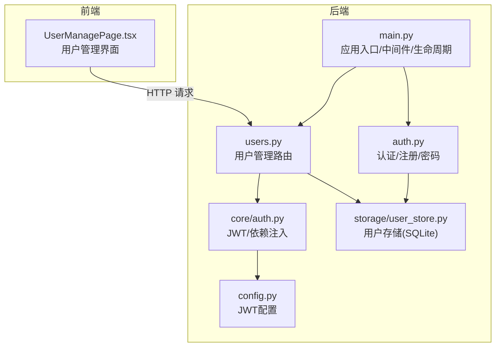
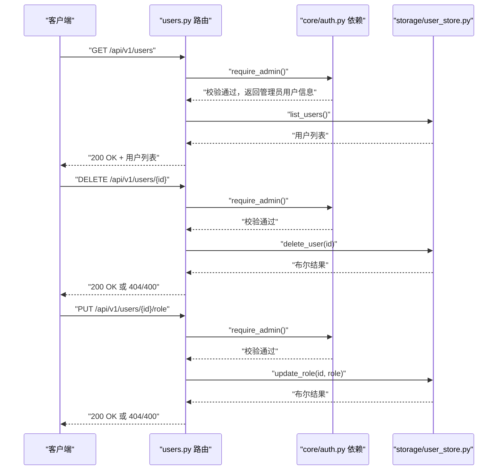
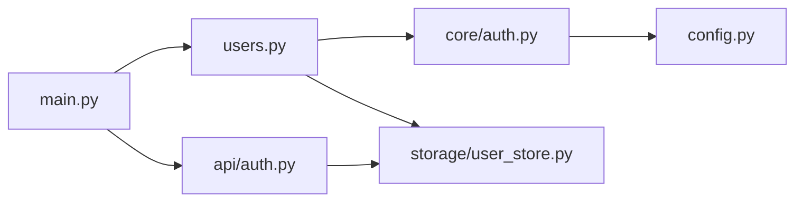

# 用户管理API

<cite>
**本文引用的文件**
- [backend/app/api/users.py](file://backend/app/api/users.py)
- [backend/app/storage/user_store.py](file://backend/app/storage/user_store.py)
- [backend/app/core/auth.py](file://backend/app/core/auth.py)
- [backend/app/api/auth.py](file://backend/app/api/auth.py)
- [backend/app/main.py](file://backend/app/main.py)
- [backend/app/config.py](file://backend/app/config.py)
- [backend/app/storage/event_store.py](file://backend/app/storage/event_store.py)
- [frontend/src/pages/UserManagePage.tsx](file://frontend/src/pages/UserManagePage.tsx)
- [README.md](file://README.md)
</cite>

## 目录
1. [简介](#简介)
2. [项目结构](#项目结构)
3. [核心组件](#核心组件)
4. [架构概览](#架构概览)
5. [详细组件分析](#详细组件分析)
6. [依赖分析](#依赖分析)
7. [性能考虑](#性能考虑)
8. [故障排除指南](#故障排除指南)
9. [结论](#结论)
10. [附录](#附录)

## 简介
本文件面向后端开发者与运维人员，系统化梳理用户管理API的设计与实现，涵盖以下要点：
- 用户列表查询、删除用户、修改用户角色等管理接口
- 用户数据模型、权限级别与访问控制机制
- 管理员权限验证与用户操作审计能力
- 用户状态管理、账户激活与权限变更的实现细节
- 最佳实践与安全考虑
- 完整的API使用示例与错误处理说明
- 用户数据隐私保护与合规要求

## 项目结构
用户管理API位于后端FastAPI应用中，采用“路由-服务-存储”分层架构：
- 路由层：定义REST接口与请求/响应模型
- 核心层：认证与授权依赖注入
- 存储层：SQLite持久化用户数据与密码哈希

**图表来源**
- [backend/app/api/users.py:1-55](file://backend/app/api/users.py#L1-L55)
- [backend/app/api/auth.py:1-108](file://backend/app/api/auth.py#L1-L108)
- [backend/app/core/auth.py:1-60](file://backend/app/core/auth.py#L1-L60)
- [backend/app/storage/user_store.py:1-133](file://backend/app/storage/user_store.py#L1-L133)
- [backend/app/main.py:1-76](file://backend/app/main.py#L1-L76)
- [backend/app/config.py:65-67](file://backend/app/config.py#L65-L67)

**章节来源**
- [backend/app/main.py:21-30](file://backend/app/main.py#L21-L30)
- [README.md:222-246](file://README.md#L222-L246)

## 核心组件
- 用户管理路由：提供用户列表、删除用户、修改角色三个管理端点
- 认证与授权：基于JWT的Bearer Token，require_admin依赖确保仅管理员可调用
- 用户存储：SQLite表users，bcrypt哈希密码，支持角色字段
- 审计与追踪：通过事件存储记录用户操作（系统事件与用户事件）

关键职责与边界：
- 路由层负责参数校验、权限拦截与错误映射
- 存储层负责数据一致性与原子性
- 核心认证层负责令牌解析与角色判定

**章节来源**
- [backend/app/api/users.py:23-54](file://backend/app/api/users.py#L23-L54)
- [backend/app/core/auth.py:55-59](file://backend/app/core/auth.py#L55-L59)
- [backend/app/storage/user_store.py:88-120](file://backend/app/storage/user_store.py#L88-L120)
- [backend/app/storage/event_store.py:117-158](file://backend/app/storage/event_store.py#L117-L158)

## 架构概览
用户管理API的调用链路如下：

**图表来源**
- [backend/app/api/users.py:23-54](file://backend/app/api/users.py#L23-L54)
- [backend/app/core/auth.py:55-59](file://backend/app/core/auth.py#L55-L59)
- [backend/app/storage/user_store.py:88-120](file://backend/app/storage/user_store.py#L88-L120)

## 详细组件分析

### 用户管理路由（users.py）
- 用户列表查询：GET /api/v1/users，返回用户简要信息列表
- 删除用户：DELETE /api/v1/users/{id}，禁止删除自身，不存在时返回404
- 修改角色：PUT /api/v1/users/{id}/role，仅允许admin或user，禁止修改自身角色，不存在时返回404

请求/响应模型：
- 用户信息模型：包含id、username、role、created_at
- 修改角色请求模型：包含role字段

权限控制：
- 通过require_admin依赖进行管理员校验
- 校验失败返回403，参数非法返回400，资源不存在返回404

**章节来源**
- [backend/app/api/users.py:12-17](file://backend/app/api/users.py#L12-L17)
- [backend/app/api/users.py:19-21](file://backend/app/api/users.py#L19-L21)
- [backend/app/api/users.py:23-54](file://backend/app/api/users.py#L23-L54)
- [backend/app/core/auth.py:55-59](file://backend/app/core/auth.py#L55-L59)

### 用户存储（user_store.py）
- 数据表结构：users(id, username, hashed_pw, role, created_at)，角色限定为admin或user
- 密码处理：bcrypt哈希与校验
- CRUD操作：
  - list_users：按创建时间升序返回用户简要信息
  - delete_user：按id删除用户
  - update_role：按id更新用户角色
  - create_user：创建用户并返回用户信息（不含明文密码）
  - get_user_by_username/get_user_by_id：按用户名或id查询用户
  - update_password：按id更新密码
  - init_admin_if_empty：若表为空则创建默认admin账号

初始化与默认行为：
- 应用启动时自动初始化默认管理员账号（admin/admin123），并提示修改密码

**章节来源**
- [backend/app/storage/user_store.py:3-7](file://backend/app/storage/user_store.py#L3-L7)
- [backend/app/storage/user_store.py:22-33](file://backend/app/storage/user_store.py#L22-L33)
- [backend/app/storage/user_store.py:48-65](file://backend/app/storage/user_store.py#L48-L65)
- [backend/app/storage/user_store.py:88-120](file://backend/app/storage/user_store.py#L88-L120)
- [backend/app/main.py:64-69](file://backend/app/main.py#L64-L69)

### 认证与授权（core/auth.py）
- JWT配置：算法HS256，密钥与过期时间来自配置
- 令牌创建：携带用户标识sub，设置过期时间
- 令牌解析：OAuth2PasswordBearer，解析失败或过期返回401
- 用户解析：根据sub查询用户，不存在返回401
- 管理员校验：require_admin仅允许role=admin，否则返回403

**章节来源**
- [backend/app/core/auth.py:19-25](file://backend/app/core/auth.py#L19-L25)
- [backend/app/core/auth.py:28-36](file://backend/app/core/auth.py#L28-L36)
- [backend/app/core/auth.py:41-52](file://backend/app/core/auth.py#L41-L52)
- [backend/app/core/auth.py:55-59](file://backend/app/core/auth.py#L55-L59)
- [backend/app/config.py:65-67](file://backend/app/config.py#L65-L67)

### 审计与追踪（event_store.py）
- 事件记录：支持系统事件与用户操作事件两类
- 用户事件：add_action_event将用户操作写入用户事件链，便于审计与回溯
- 数据隔离：系统事件与用户事件分别存储于不同路径
- 用途：合规查询、导入产品等操作链路的可回溯审计

**章节来源**
- [backend/app/storage/event_store.py:117-158](file://backend/app/storage/event_store.py#L117-L158)

### 前端集成（UserManagePage.tsx）
- 用户列表：GET /api/v1/users
- 删除用户：DELETE /api/v1/users/{id}
- 修改角色：PUT /api/v1/users/{id}/role
- 新建用户：POST /api/v1/auth/register（仅管理员）
- 错误处理：基于响应状态码与错误消息提示

**章节来源**
- [frontend/src/pages/UserManagePage.tsx:24-74](file://frontend/src/pages/UserManagePage.tsx#L24-L74)

## 依赖分析
- 路由依赖核心认证：users.py依赖require_admin，间接依赖get_current_user与JWT解码
- 路由依赖存储：users.py依赖list_users/delete_user/update_role
- 认证依赖配置：JWT密钥与过期时间来自配置
- 应用入口：main.py注册路由并初始化默认管理员

**图表来源**
- [backend/app/api/users.py:6-7](file://backend/app/api/users.py#L6-L7)
- [backend/app/core/auth.py:10-12](file://backend/app/core/auth.py#L10-L12)
- [backend/app/config.py:65-67](file://backend/app/config.py#L65-L67)
- [backend/app/main.py:21-30](file://backend/app/main.py#L21-L30)

**章节来源**
- [backend/app/api/users.py:6-7](file://backend/app/api/users.py#L6-L7)
- [backend/app/core/auth.py:10-12](file://backend/app/core/auth.py#L10-L12)
- [backend/app/config.py:65-67](file://backend/app/config.py#L65-L67)
- [backend/app/main.py:21-30](file://backend/app/main.py#L21-L30)

## 性能考虑
- 查询优化：list_users按created_at升序，SQLite索引可按需扩展
- 并发安全：SQLite事务保证CRUD原子性
- 密码成本：bcrypt哈希计算开销可控，适合生产环境
- JWT负载：仅包含sub，避免冗余字段
- 建议：用户规模增长后可引入分页、缓存与数据库连接池

[本节为通用指导，无需特定文件引用]

## 故障排除指南
常见问题与处理：
- 401 未授权：检查Bearer Token是否有效、是否过期
- 403 禁止访问：确认当前用户角色为admin
- 400 参数错误：检查请求体字段（如role值域）
- 404 资源不存在：确认用户id是否存在
- 409 冲突：新建用户时用户名已存在
- 自身操作限制：删除自身或修改自身角色会被拒绝

调试建议：
- 查看后端日志与异常堆栈
- 核对JWT密钥与过期时间配置
- 确认SQLite表结构与数据一致性

**章节来源**
- [backend/app/api/users.py:33-38](file://backend/app/api/users.py#L33-L38)
- [backend/app/api/users.py:47-54](file://backend/app/api/users.py#L47-L54)
- [backend/app/api/auth.py:82-89](file://backend/app/api/auth.py#L82-L89)
- [backend/app/core/auth.py:38-52](file://backend/app/core/auth.py#L38-L52)

## 结论
用户管理API以简洁的CRUD接口配合严格的管理员权限控制，结合bcrypt密码哈希与JWT认证，提供了安全可靠的用户管理能力。通过事件存储实现用户操作审计，有助于满足合规与审计需求。建议在生产环境中进一步完善分页、缓存与数据库索引，并持续强化安全策略。

[本节为总结性内容，无需特定文件引用]

## 附录

### API定义与使用示例
- 获取用户列表（管理员）
  - 方法：GET
  - 路径：/api/v1/users
  - 认证：Bearer Token（管理员）
  - 成功响应：200，返回用户信息数组
  - 错误：403（非管理员）、401（令牌无效）

- 删除用户（管理员）
  - 方法：DELETE
  - 路径：/api/v1/users/{id}
  - 认证：Bearer Token（管理员）
  - 成功响应：200，{"ok": true}
  - 错误：403（非管理员）、400（不允许删除自身）、404（用户不存在）、401（令牌无效）

- 修改用户角色（管理员）
  - 方法：PUT
  - 路径：/api/v1/users/{id}/role
  - 认证：Bearer Token（管理员）
  - 请求体：{"role": "admin|user"}
  - 成功响应：200，{"ok": true}
  - 错误：403（非管理员）、400（role非法或不允许修改自身）、404（用户不存在）、401（令牌无效）

- 新建用户（管理员）
  - 方法：POST
  - 路径：/api/v1/auth/register
  - 认证：Bearer Token（管理员）
  - 请求体：{"username": "...", "password": "...", "role": "admin|user"}
  - 成功响应：200，用户信息（不含密码）
  - 错误：403（非管理员）、400（role非法）、409（用户名冲突）、401（令牌无效）

- 获取当前用户信息
  - 方法：GET
  - 路径：/api/v1/auth/me
  - 认证：Bearer Token
  - 成功响应：200，用户信息（不含密码）
  - 错误：401（令牌无效）

- 修改当前用户密码
  - 方法：PUT
  - 路径：/api/v1/auth/me/password
  - 认证：Bearer Token
  - 请求体：{"old_password": "...", "new_password": "..."}
  - 成功响应：200，{"ok": true, "message": "..."}
  - 错误：400（原密码错误或新密码长度不足）、401（令牌无效）

**章节来源**
- [README.md:222-246](file://README.md#L222-L246)
- [backend/app/api/users.py:23-54](file://backend/app/api/users.py#L23-L54)
- [backend/app/api/auth.py:54-107](file://backend/app/api/auth.py#L54-L107)

### 数据模型与复杂度
- 用户信息模型：包含id、username、role、created_at
- 用户列表查询：O(n)遍历SQLite表，n为用户数量
- 删除与更新：O(1)按主键操作
- 密码哈希：bcrypt计算，常数级开销

**章节来源**
- [backend/app/api/users.py:12-17](file://backend/app/api/users.py#L12-L17)
- [backend/app/storage/user_store.py:88-120](file://backend/app/storage/user_store.py#L88-L120)

### 安全最佳实践
- 强制管理员权限：所有用户管理端点均需require_admin
- 令牌安全：使用强密钥与合理过期时间，HTTPS传输
- 密码安全：bcrypt哈希存储，禁止明文密码
- 输入校验：严格校验role枚举值与长度
- 自身保护：禁止管理员删除或修改自身权限
- 审计留痕：通过事件存储记录关键操作

**章节来源**
- [backend/app/api/users.py:33-50](file://backend/app/api/users.py#L33-L50)
- [backend/app/core/auth.py:55-59](file://backend/app/core/auth.py#L55-L59)
- [backend/app/config.py:65-67](file://backend/app/config.py#L65-L67)
- [backend/app/storage/event_store.py:117-158](file://backend/app/storage/event_store.py#L117-L158)

### 隐私保护与合规
- 数据最小化：响应中不返回敏感字段（如hashed_pw）
- 日志与追踪：通过事件存储保留审计轨迹，便于合规检查
- 默认管理员：首次启动自动创建默认账号并提示修改密码，降低弱口令风险

**章节来源**
- [backend/app/storage/user_store.py:122-132](file://backend/app/storage/user_store.py#L122-L132)
- [backend/app/storage/event_store.py:117-158](file://backend/app/storage/event_store.py#L117-L158)