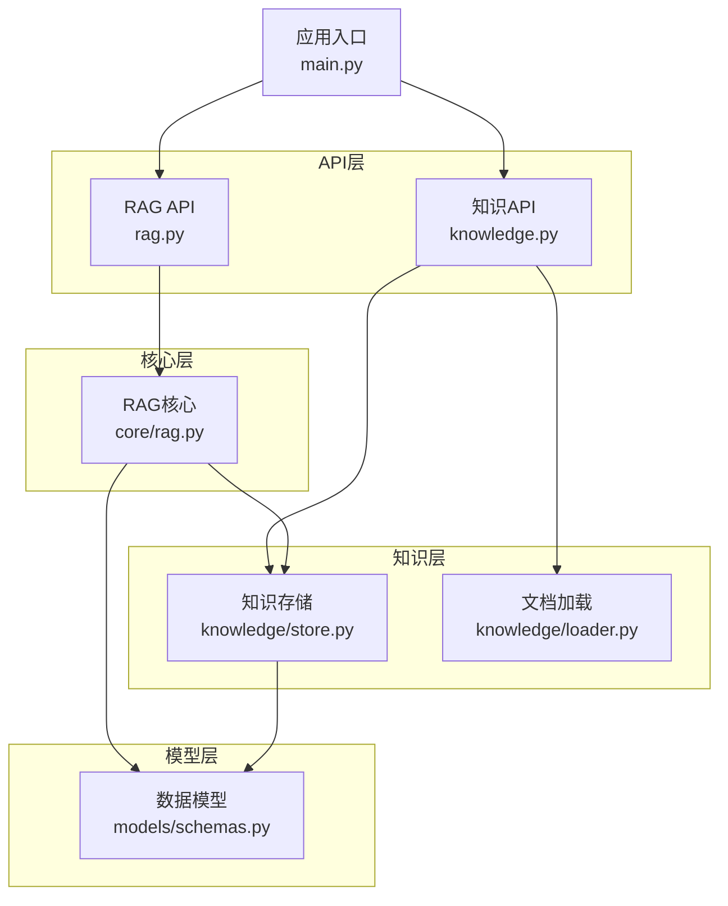
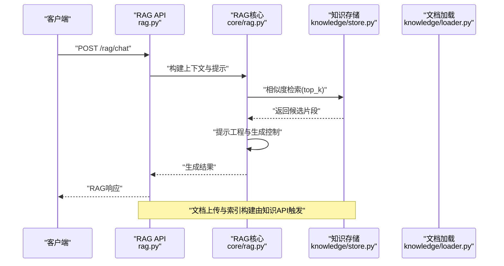
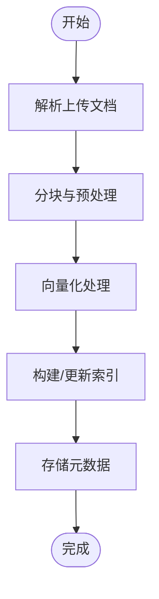
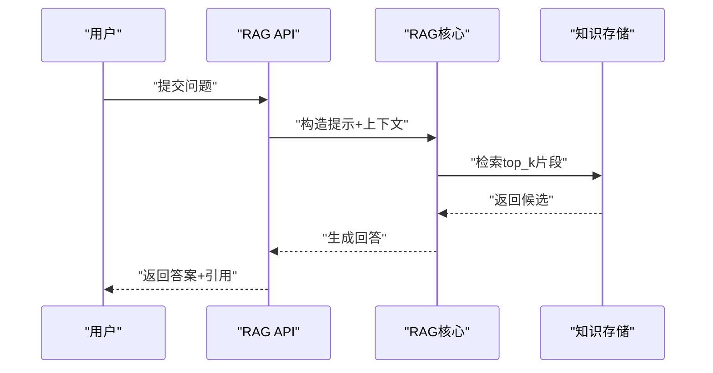
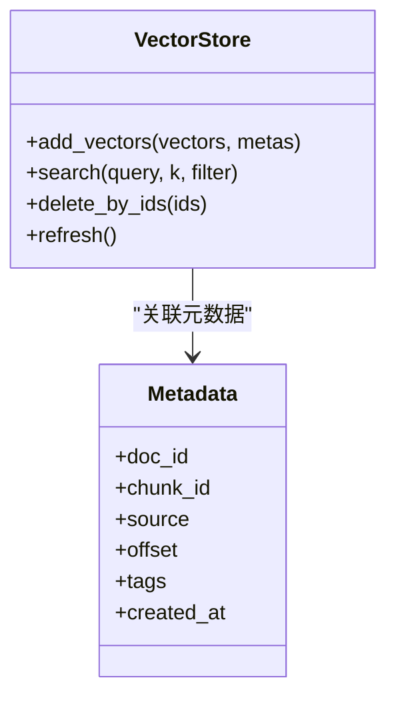
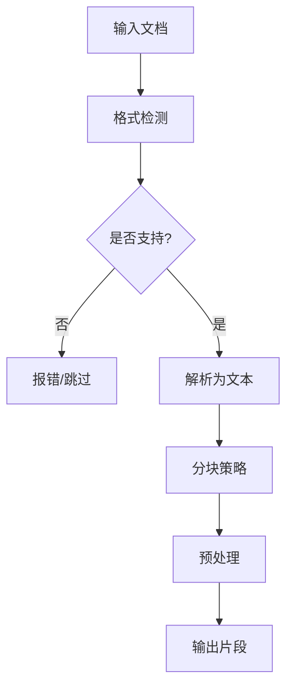
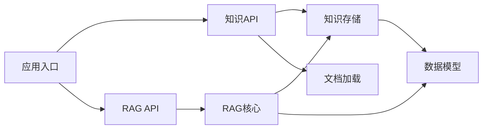

# 知识API

<cite>
**本文引用的文件**
- [backend/app/api/knowledge.py](file://backend/app/api/knowledge.py)
- [backend/app/api/rag.py](file://backend/app/api/rag.py)
- [backend/app/core/rag.py](file://backend/app/core/rag.py)
- [backend/app/knowledge/store.py](file://backend/app/knowledge/store.py)
- [backend/app/knowledge/loader.py](file://backend/app/knowledge/loader.py)
- [backend/app/models/schemas.py](file://backend/app/models/schemas.py)
- [backend/app/main.py](file://backend/app/main.py)
- [后端api.md](file://后端api.md)
- [前后端api交互.md](file://前后端api交互.md)
</cite>

## 目录
1. [简介](#简介)
2. [项目结构](#项目结构)
3. [核心组件](#核心组件)
4. [架构总览](#架构总览)
5. [详细组件分析](#详细组件分析)
6. [依赖分析](#依赖分析)
7. [性能考虑](#性能考虑)
8. [故障排除指南](#故障排除指南)
9. [结论](#结论)
10. [附录](#附录)

## 简介
本文件为避风港平台的知识API文档，聚焦于RAG（检索增强生成）知识系统与知识库管理的后端接口规范。内容覆盖：
- 向量检索系统的API：文档上传、向量化处理、相似度查询、结果排序
- 知识库管理接口：知识库创建、配置、维护、清理
- RAG增强对话API：上下文检索、提示工程、生成控制、结果整合
- 知识图谱相关接口：实体抽取、关系识别、图谱存储、查询优化
- 知识管理全流程：数据预处理、索引构建、缓存策略、性能优化
- 知识质量评估与持续改进接口规范

本文件基于后端代码与API文档进行整理，确保技术细节可追溯至具体源码位置。

## 项目结构
后端采用模块化组织，RAG与知识相关功能主要分布在以下模块：
- API层：提供对外HTTP接口，定义请求/响应模型与路由
- 核心层：封装RAG检索、向量化、提示工程等核心逻辑
- 知识层：负责文档加载、索引存储、检索器管理
- 模型层：定义数据库与序列化模型
- 入口：应用启动与路由注册

**图表来源**
- [backend/app/api/knowledge.py](file://backend/app/api/knowledge.py)
- [backend/app/api/rag.py](file://backend/app/api/rag.py)
- [backend/app/core/rag.py](file://backend/app/core/rag.py)
- [backend/app/knowledge/store.py](file://backend/app/knowledge/store.py)
- [backend/app/knowledge/loader.py](file://backend/app/knowledge/loader.py)
- [backend/app/models/schemas.py](file://backend/app/models/schemas.py)
- [backend/app/main.py](file://backend/app/main.py)

**章节来源**
- [backend/app/main.py](file://backend/app/main.py)
- [后端api.md](file://后端api.md)

## 核心组件
- 知识API模块：提供知识库管理、文档上传与检索等接口
- RAG API模块：提供RAG增强对话、上下文检索与生成控制接口
- RAG核心模块：封装向量化、相似度检索、提示工程与结果整合
- 知识存储模块：负责向量索引、元数据存储与检索器生命周期管理
- 文档加载模块：负责多格式文档解析、分块与预处理
- 数据模型模块：定义请求/响应结构与数据库映射

**章节来源**
- [backend/app/api/knowledge.py](file://backend/app/api/knowledge.py)
- [backend/app/api/rag.py](file://backend/app/api/rag.py)
- [backend/app/core/rag.py](file://backend/app/core/rag.py)
- [backend/app/knowledge/store.py](file://backend/app/knowledge/store.py)
- [backend/app/knowledge/loader.py](file://backend/app/knowledge/loader.py)
- [backend/app/models/schemas.py](file://backend/app/models/schemas.py)

## 架构总览
下图展示从客户端到RAG核心与知识存储的整体调用链路：

**图表来源**
- [backend/app/api/rag.py](file://backend/app/api/rag.py)
- [backend/app/core/rag.py](file://backend/app/core/rag.py)
- [backend/app/knowledge/store.py](file://backend/app/knowledge/store.py)
- [backend/app/knowledge/loader.py](file://backend/app/knowledge/loader.py)

## 详细组件分析

### 知识API组件分析
知识API负责知识库的创建、配置、维护与清理，以及文档上传与索引构建。

- 知识库管理
  - 创建知识库：接收知识库标识、描述、配置参数，返回创建状态
  - 更新配置：支持动态调整索引参数、分块策略、向量化模型
  - 维护与清理：提供批量删除、重索引、统计信息查询
- 文档上传与索引
  - 多格式支持：文本、PDF、HTML等
  - 分块策略：固定长度、语义分段、标题层级
  - 向量化：调用嵌入模型生成向量并写入向量库
  - 索引构建：建立FAISS/Chroma等索引，支持增量更新

**图表来源**
- [backend/app/api/knowledge.py](file://backend/app/api/knowledge.py)
- [backend/app/knowledge/loader.py](file://backend/app/knowledge/loader.py)
- [backend/app/knowledge/store.py](file://backend/app/knowledge/store.py)

**章节来源**
- [backend/app/api/knowledge.py](file://backend/app/api/knowledge.py)
- [backend/app/knowledge/loader.py](file://backend/app/knowledge/loader.py)
- [backend/app/knowledge/store.py](file://backend/app/knowledge/store.py)

### RAG API组件分析
RAG API提供增强对话能力，包括上下文检索、提示工程、生成控制与结果整合。

- 上下文检索
  - 输入用户问题与会话历史
  - 调用相似度检索获取候选片段
  - 支持过滤条件（时间范围、标签、来源）
- 提示工程
  - 动态模板拼接与角色设定
  - 结合历史消息与检索上下文
  - 控制上下文长度与截断策略
- 生成控制
  - 温度、最大令牌数、停止词等参数
  - 流式输出与非流式输出模式
- 结果整合
  - 合并生成文本与引用片段
  - 返回溯源信息与置信度评分

**图表来源**
- [backend/app/api/rag.py](file://backend/app/api/rag.py)
- [backend/app/core/rag.py](file://backend/app/core/rag.py)
- [backend/app/knowledge/store.py](file://backend/app/knowledge/store.py)

**章节来源**
- [backend/app/api/rag.py](file://backend/app/api/rag.py)
- [backend/app/core/rag.py](file://backend/app/core/rag.py)

### 知识存储与检索组件分析
知识存储模块负责向量索引与元数据持久化，支撑高效相似度检索。

- 向量索引
  - 维度管理与归一化
  - 距离度量（余弦/内积）
  - top_k检索与阈值过滤
- 元数据管理
  - 文档ID、来源、时间戳、标签
  - 片段ID、偏移、标题层级
- 检索器生命周期
  - 加载、热更新、失效检测
  - 缓存命中与回退策略

**图表来源**
- [backend/app/knowledge/store.py](file://backend/app/knowledge/store.py)
- [backend/app/models/schemas.py](file://backend/app/models/schemas.py)

**章节来源**
- [backend/app/knowledge/store.py](file://backend/app/knowledge/store.py)
- [backend/app/models/schemas.py](file://backend/app/models/schemas.py)

### 文档加载与预处理组件分析
文档加载模块负责多格式解析、分块与预处理，为后续向量化与索引提供高质量文本。

- 解析器
  - 文本、PDF、HTML等格式解析
  - 标题层级提取与结构化
- 分块策略
  - 固定窗口滑动、语义分段、按标题分块
  - 最小长度过滤与重叠处理
- 预处理
  - 去噪、标准化、编码统一
  - 过滤重复与低质量片段

**图表来源**
- [backend/app/knowledge/loader.py](file://backend/app/knowledge/loader.py)

**章节来源**
- [backend/app/knowledge/loader.py](file://backend/app/knowledge/loader.py)

### 数据模型与序列化
数据模型定义了API请求/响应的结构，确保前后端一致性。

- 请求模型
  - 上传请求：文件、元数据、分块参数
  - 检索请求：查询、过滤条件、top_k
  - 对话请求：问题、历史、生成参数
- 响应模型
  - 成功/失败状态、进度、结果集
  - 片段详情、引用信息、置信度

**章节来源**
- [backend/app/models/schemas.py](file://backend/app/models/schemas.py)

## 依赖分析
RAG与知识系统的关键依赖关系如下：

**图表来源**
- [backend/app/api/knowledge.py](file://backend/app/api/knowledge.py)
- [backend/app/api/rag.py](file://backend/app/api/rag.py)
- [backend/app/core/rag.py](file://backend/app/core/rag.py)
- [backend/app/knowledge/store.py](file://backend/app/knowledge/store.py)
- [backend/app/knowledge/loader.py](file://backend/app/knowledge/loader.py)
- [backend/app/models/schemas.py](file://backend/app/models/schemas.py)
- [backend/app/main.py](file://backend/app/main.py)

**章节来源**
- [backend/app/main.py](file://backend/app/main.py)
- [后端api.md](file://后端api.md)

## 性能考虑
- 向量化性能
  - 批量向量化与GPU加速
  - 嵌入模型选择与维度压缩
- 检索性能
  - 索引类型选择（IVF/PQ/倒排）
  - top_k与阈值调优
  - 缓存热点片段与增量更新
- 生成性能
  - 流式输出减少首字延迟
  - 上下文截断与摘要策略
- 存储与I/O
  - 向量与元数据分离存储
  - 压缩与分区策略

## 故障排除指南
- 文档上传失败
  - 检查格式支持与文件大小限制
  - 查看解析错误日志与分块异常
- 检索结果为空
  - 核对索引是否构建成功
  - 调整top_k与过滤条件
- 生成异常
  - 检查提示长度与参数设置
  - 关注上下文截断与重复片段
- 性能问题
  - 监控向量化与检索耗时
  - 评估索引规模与硬件资源

**章节来源**
- [backend/app/api/knowledge.py](file://backend/app/api/knowledge.py)
- [backend/app/api/rag.py](file://backend/app/api/rag.py)
- [backend/app/core/rag.py](file://backend/app/core/rag.py)

## 结论
本文档系统性梳理了避风港平台的知识API，涵盖RAG检索、知识库管理、对话增强与知识图谱相关接口的设计与实现要点。通过明确的数据模型、清晰的调用流程与性能优化建议，为开发者与运维人员提供了可操作的参考。后续可在质量评估与持续改进方面进一步完善指标体系与自动化流程。

## 附录
- 接口清单与规范参见后端API文档与前后端交互文档
- 示例与最佳实践可结合现有测试用例与脚本进行验证

**章节来源**
- [后端api.md](file://后端api.md)
- [前后端api交互.md](file://前后端api交互.md)