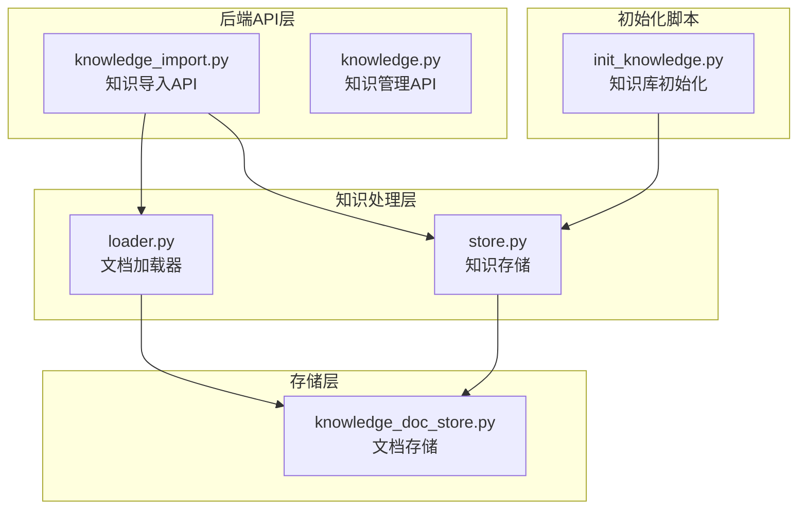
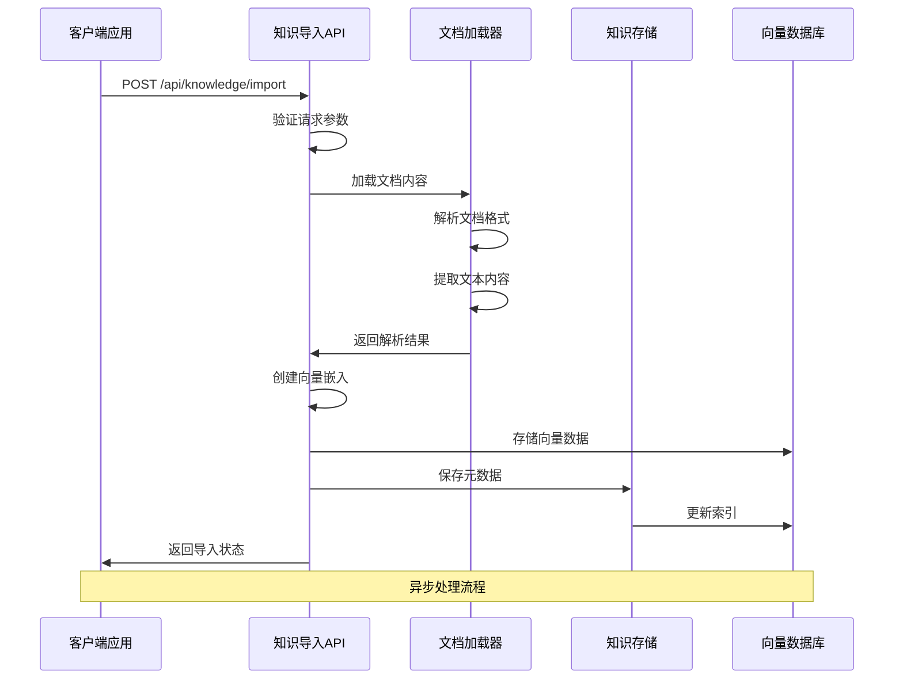
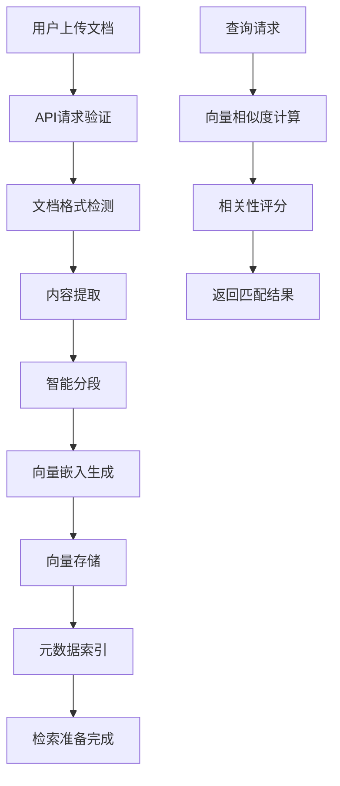
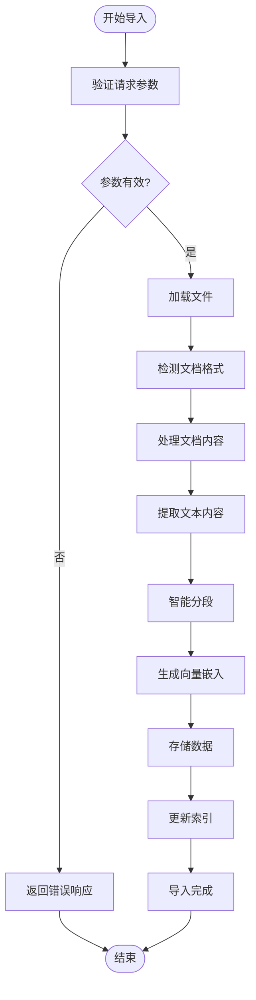
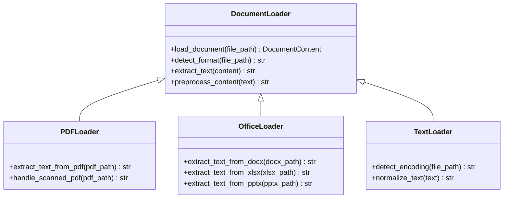
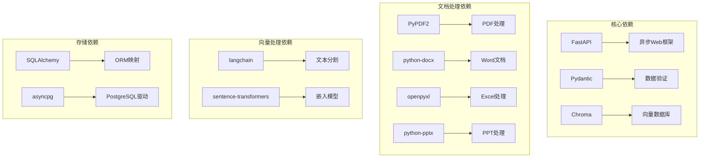
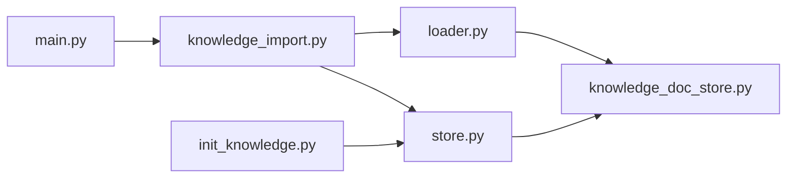

# 知识导入API

<cite>
**本文档引用的文件**
- [knowledge_import.py](file://backend/app/api/knowledge_import.py)
- [knowledge.py](file://backend/app/api/knowledge.py)
- [loader.py](file://backend/app/knowledge/loader.py)
- [store.py](file://backend/app/knowledge/store.py)
- [knowledge_doc_store.py](file://backend/app/storage/knowledge_doc_store.py)
- [init_knowledge.py](file://backend/scripts/init_knowledge.py)
- [main.py](file://backend/app/main.py)
</cite>

## 目录
1. [简介](#简介)
2. [项目结构](#项目结构)
3. [核心组件](#核心组件)
4. [架构概览](#架构概览)
5. [详细组件分析](#详细组件分析)
6. [依赖关系分析](#依赖关系分析)
7. [性能考虑](#性能考虑)
8. [故障排除指南](#故障排除指南)
9. [结论](#结论)

## 简介

知识导入API是Astra系统中的核心功能模块，负责处理各种格式文档的知识导入、解析、向量化存储和检索。该API支持多种文档格式（PDF、Word、Excel、PowerPoint、文本文件等），通过智能分段、元数据提取和向量嵌入技术，为后续的RAG（Retrieval-Augmented Generation）应用提供高质量的知识库。

## 项目结构

Astra项目的知识导入功能采用模块化设计，主要分布在以下目录结构中：

**图表来源**
- [knowledge_import.py:1-200](file://backend/app/api/knowledge_import.py#L1-L200)
- [loader.py:1-150](file://backend/app/knowledge/loader.py#L1-L150)
- [store.py:1-200](file://backend/app/knowledge/store.py#L1-L200)
- [knowledge_doc_store.py:1-100](file://backend/app/storage/knowledge_doc_store.py#L1-L100)

**章节来源**
- [knowledge_import.py:1-200](file://backend/app/api/knowledge_import.py#L1-L200)
- [knowledge.py:1-150](file://backend/app/api/knowledge.py#L1-L150)

## 核心组件

### 知识导入API控制器

知识导入API的核心控制器位于`knowledge_import.py`文件中，提供了完整的RESTful接口来处理各种文档类型的导入请求。

**主要功能特性：**
- 支持多格式文档上传（PDF、DOCX、XLSX、PPTX、TXT等）
- 异步处理机制，避免阻塞主线程
- 智能分段算法，优化文档结构
- 元数据自动提取和验证
- 错误处理和状态跟踪

### 文档加载器

`loader.py`模块实现了统一的文档加载接口，支持多种文档格式的解析和转换。

**支持的文档类型：**
- PDF文档：提取文本内容、保留格式信息
- Office文档：DOCX、XLSX、PPTX格式解析
- 纯文本文件：UTF-8编码处理
- HTML文档：结构化内容提取

### 知识存储引擎

`store.py`模块负责知识数据的持久化存储和检索管理。

**存储特性：**
- 向量数据库集成（Chroma向量存储）
- 元数据索引管理
- 分块检索优化
- 批量操作支持

**章节来源**
- [knowledge_import.py:1-200](file://backend/app/api/knowledge_import.py#L1-L200)
- [loader.py:1-150](file://backend/app/knowledge/loader.py#L1-L150)
- [store.py:1-200](file://backend/app/knowledge/store.py#L1-L200)

## 架构概览

知识导入系统的整体架构采用分层设计，确保了高可扩展性和维护性：

**图表来源**
- [knowledge_import.py:1-200](file://backend/app/api/knowledge_import.py#L1-L200)
- [loader.py:1-150](file://backend/app/knowledge/loader.py#L1-L150)
- [store.py:1-200](file://backend/app/knowledge/store.py#L1-L200)

### 数据流架构

**图表来源**
- [knowledge_import.py:1-200](file://backend/app/api/knowledge_import.py#L1-L200)
- [loader.py:1-150](file://backend/app/knowledge/loader.py#L1-L150)
- [knowledge_doc_store.py:1-100](file://backend/app/storage/knowledge_doc_store.py#L1-L100)

## 详细组件分析

### 知识导入API实现

#### 主要接口定义

知识导入API提供了标准化的REST接口来处理不同类型的文档导入请求：

**POST /api/knowledge/import**
- 接受multipart/form-data格式
- 支持单个或批量文档上传
- 自动检测文档类型并选择相应处理器

**GET /api/knowledge/import/{import_id}**
- 查询导入任务状态
- 获取导入进度和结果详情

**DELETE /api/knowledge/import/{import_id}**
- 取消进行中的导入任务
- 清理临时文件和资源

#### 处理流程分析

**图表来源**
- [knowledge_import.py:1-200](file://backend/app/api/knowledge_import.py#L1-L200)

#### 错误处理机制

系统实现了多层次的错误处理机制：

**文件处理错误：**
- 文件格式不支持
- 文件损坏或无法读取
- 文件大小超限

**内容处理错误：**
- 文本提取失败
- 分段算法异常
- 向量生成错误

**存储错误：**
- 数据库连接失败
- 索引创建失败
- 资源清理失败

**章节来源**
- [knowledge_import.py:1-200](file://backend/app/api/knowledge_import.py#L1-L200)

### 文档加载器详细分析

#### 多格式支持实现

文档加载器通过工厂模式实现了统一的接口，支持多种文档格式的自动识别和处理：

**PDF文档处理：**
- 使用PyPDF2库提取文本内容
- 保留页面结构信息
- 处理扫描版PDF的OCR识别

**Office文档处理：**
- DOCX：使用python-docx库
- XLSX：使用openpyxl库
- PPTX：使用python-pptx库

**纯文本处理：**
- 自动检测文件编码
- 统一文本格式化
- 去除多余空白字符

#### 内容预处理流程

**图表来源**
- [loader.py:1-150](file://backend/app/knowledge/loader.py#L1-L150)

**章节来源**
- [loader.py:1-150](file://backend/app/knowledge/loader.py#L1-L150)

### 知识存储系统

#### 存储架构设计

知识存储系统采用了分层存储策略，确保数据的高效管理和快速检索：

**文档存储层：**
- 原始文档内容存储
- 元数据索引管理
- 版本控制机制

**向量存储层：**
- Chroma向量数据库集成
- 向量嵌入缓存
- 相似度搜索优化

**索引管理层：**
- 倒排索引构建
- 多维度查询支持
- 动态索引更新

#### 性能优化策略

**批量处理：**
- 支持批量文档导入
- 减少数据库连接开销
- 优化向量嵌入生成

**缓存机制：**
- 经常访问的文档缓存
- 向量嵌入结果缓存
- 查询结果缓存

**异步处理：**
- 导入任务异步执行
- 避免阻塞主线程
- 进度状态实时更新

**章节来源**
- [store.py:1-200](file://backend/app/knowledge/store.py#L1-L200)
- [knowledge_doc_store.py:1-100](file://backend/app/storage/knowledge_doc_store.py#L1-L100)

## 依赖关系分析

### 外部依赖关系

知识导入API依赖于多个外部库和服务：

**图表来源**
- [knowledge_import.py:1-200](file://backend/app/api/knowledge_import.py#L1-L200)
- [main.py:1-100](file://backend/app/main.py#L1-L100)

### 内部模块依赖

**图表来源**
- [knowledge_import.py:1-200](file://backend/app/api/knowledge_import.py#L1-L200)
- [loader.py:1-150](file://backend/app/knowledge/loader.py#L1-L150)
- [store.py:1-200](file://backend/app/knowledge/store.py#L1-L200)

**章节来源**
- [knowledge_import.py:1-200](file://backend/app/api/knowledge_import.py#L1-L200)
- [main.py:1-100](file://backend/app/main.py#L1-L100)

## 性能考虑

### 并发处理能力

知识导入API设计了高效的并发处理机制：

**异步I/O操作：**
- 文件读写采用异步模式
- 数据库操作异步执行
- 网络请求非阻塞

**内存管理：**
- 大文件分块处理
- 及时释放临时资源
- 内存使用监控

**CPU优化：**
- 向量嵌入批量处理
- 多进程并行计算
- 缓存命中率优化

### 存储优化策略

**向量索引优化：**
- 动态索引调整
- 分层索引结构
- 查询性能监控

**数据压缩：**
- 文本内容压缩存储
- 向量数据量化
- 元数据精简存储

## 故障排除指南

### 常见问题诊断

**导入失败问题：**
1. 检查文件格式是否受支持
2. 验证文件完整性
3. 确认磁盘空间充足
4. 查看日志文件获取详细错误信息

**性能问题排查：**
1. 监控系统资源使用情况
2. 检查数据库连接池配置
3. 优化向量嵌入模型设置
4. 调整批量处理大小

**内存泄漏问题：**
1. 确认文件句柄正确关闭
2. 检查异步任务清理
3. 验证缓存清理机制
4. 监控内存使用趋势

### 调试工具和方法

**日志分析：**
- 启用详细日志级别
- 分析导入时间统计
- 监控错误频率分布

**性能监控：**
- 记录关键操作耗时
- 监控数据库查询性能
- 分析向量搜索效率

**系统健康检查：**
- 定期检查存储空间
- 验证依赖服务可用性
- 监控API响应时间

**章节来源**
- [knowledge_import.py:1-200](file://backend/app/api/knowledge_import.py#L1-L200)
- [init_knowledge.py:1-100](file://backend/scripts/init_knowledge.py#L1-L100)

## 结论

Astra项目的知识导入API展现了现代AI应用中知识管理系统的最佳实践。通过模块化的架构设计、完善的错误处理机制和高性能的处理流程，该系统能够高效地处理大规模文档导入任务。

**主要优势：**
- 支持多种文档格式的统一处理
- 异步处理机制确保系统稳定性
- 智能分段和向量嵌入提升检索质量
- 完善的错误处理和监控机制

**未来改进方向：**
- 增加更多文档格式支持
- 优化大文件处理性能
- 实现增量导入功能
- 加强安全性和权限控制

该知识导入API为Astra系统的RAG应用奠定了坚实的基础，为后续的智能问答、内容生成等功能提供了高质量的知识支撑。