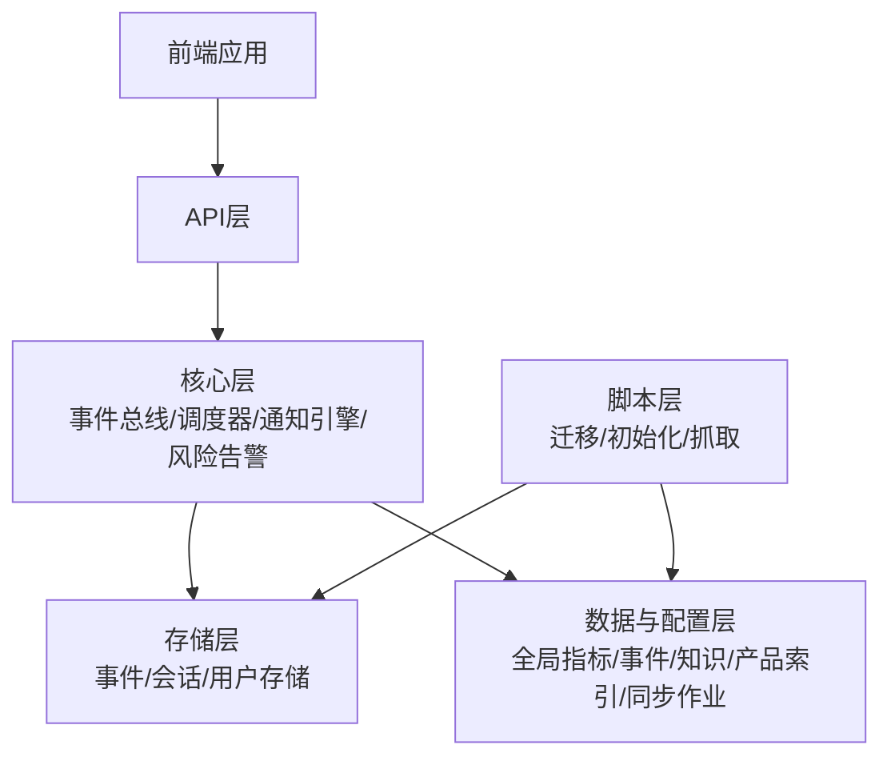
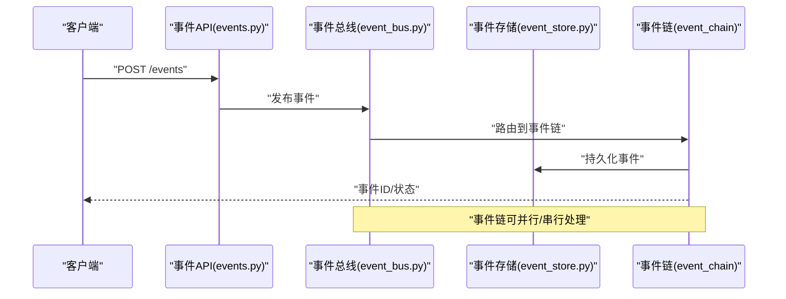
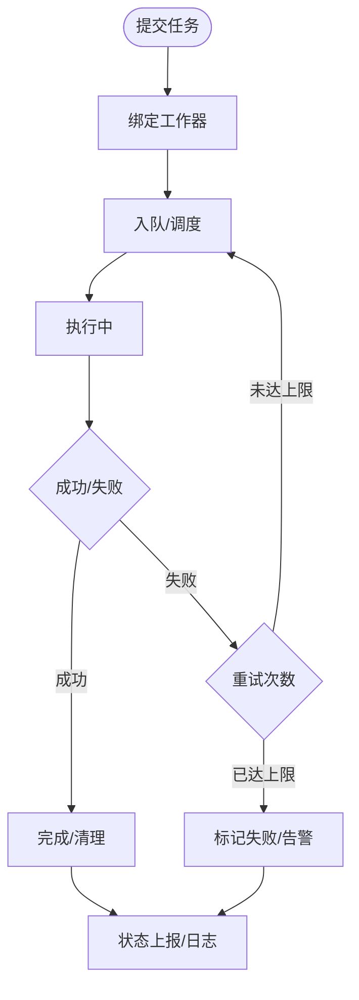
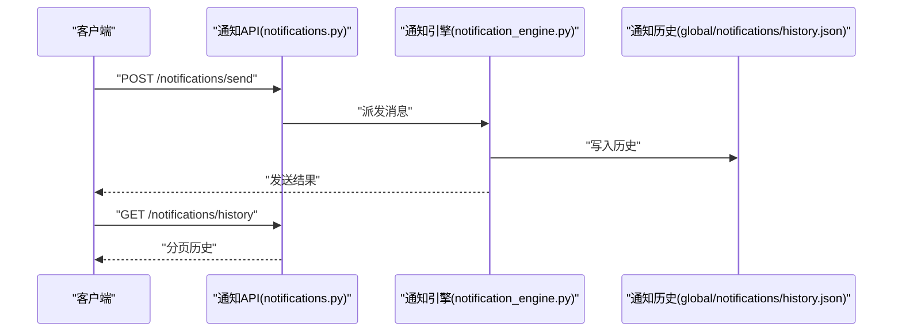
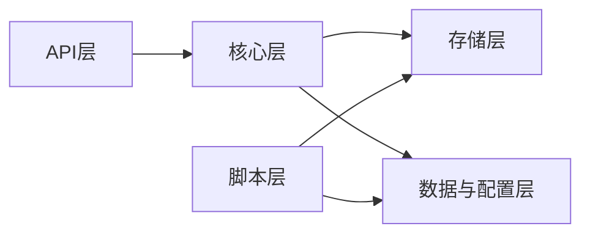

# 系统API

<cite>
**本文引用的文件**
- [backend/app/main.py](file://backend/app/main.py)
- [backend/app/api/admin.py](file://backend/app/api/admin.py)
- [backend/app/api/auth.py](file://backend/app/api/auth.py)
- [backend/app/api/users.py](file://backend/app/api/users.py)
- [backend/app/api/rbac.py](file://backend/app/api/rbac.py)
- [backend/app/api/metrics.py](file://backend/app/api/metrics.py)
- [backend/app/api/events.py](file://backend/app/api/events.py)
- [backend/app/api/event_config.py](file://backend/app/api/event_config.py)
- [backend/app/api/scheduler_config.py](file://backend/app/api/scheduler_config.py)
- [backend/app/api/notifications.py](file://backend/app/api/notifications.py)
- [backend/app/api/integrations.py](file://backend/app/api/integrations.py)
- [backend/app/api/knowledge.py](file://backend/app/api/knowledge.py)
- [backend/app/api/products.py](file://backend/app/api/products.py)
- [backend/app/api/memory.py](file://backend/app/api/memory.py)
- [backend/app/api/pipeline.py](file://backend/app/api/pipeline.py)
- [backend/app/api/tools.py](file://backend/app/api/tools.py)
- [backend/app/api/plugins.py](file://backend/app/api/plugins.py)
- [backend/app/api/shopify.py](file://backend/app/api/shopify.py)
- [backend/app/api/streaming.py](file://backend/app/api/streaming.py)
- [backend/app/api/sdk_sessions.py](file://backend/app/api/sdk_sessions.py)
- [backend/app/api/sessions.py](file://backend/app/api/sessions.py)
- [backend/app/api/worker_config.py](file://backend/app/api/worker_config.py)
- [backend/app/api/code_security.py](file://backend/app/api/code_security.py)
- [backend/app/api/risk.py](file://backend/app/api/risk.py)
- [backend/app/api/model_config.py](file://backend/app/api/model_config.py)
- [backend/app/api/agent_config.py](file://backend/app/api/agent_config.py)
- [backend/app/api/chains.py](file://backend/app/api/chains.py)
- [backend/app/api/cli.py](file://backend/app/api/cli.py)
- [backend/app/core/event_bus.py](file://backend/app/core/event_bus.py)
- [backend/app/core/scheduler.py](file://backend/app/core/scheduler.py)
- [backend/app/core/notification_engine.py](file://backend/app/core/notification_engine.py)
- [backend/app/core/risk_alert.py](file://backend/app/core/risk_alert.py)
- [backend/app/storage/event_store.py](file://backend/app/storage/event_store.py)
- [backend/app/storage/session_store.py](file://backend/app/storage/session_store.py)
- [backend/app/storage/user_store.py](file://backend/app/storage/user_store.py)
- [backend/data/config/events/system_events.md](file://backend/data/config/events/system_events.md)
- [backend/data/config/events/user_action_events.md](file://backend/data/config/events/user_action_events.md)
- [backend/data/config/events/order_events.md](file://backend/data/config/events/order_events.md)
- [backend/data/config/events/certification_events.md](file://backend/data/config/events/certification_events.md)
- [backend/data/config/events/regulation_events.md](file://backend/data/config/events/regulation_events.md)
- [backend/data/config/events/custom_events.md](file://backend/data/config/events/custom_events.md)
- [backend/data/config/events/lifecycle_events.md](file://backend/data/config/events/lifecycle_events.md)
- [backend/data/config/events/compliance_events.md](file://backend/data/config/events/compliance_events.md)
- [backend/data/config/events/risk_alert_events.md](file://backend/data/config/events/risk_alert_events.md)
- [backend/data/config/skills/registry.json](file://backend/data/config/skills/registry.json)
- [backend/data/config/agent_extensions.json](file://backend/data/config/agent_extensions.json)
- [backend/data/config/rbac_users.json](file://backend/data/config/rbac_users.json)
- [backend/data/config/tools.json](file://backend/data/config/tools.json)
- [backend/data/config/channels.json](file://backend/data/config/channels.json)
- [backend/data/config/oauth_connections.json](file://backend/data/config/oauth_connections.json)
- [backend/data/config/model_routes.json](file://backend/data/config/model_routes.json)
- [backend/data/config/scheduler/task_worker_bindings.json](file://backend/data/config/scheduler/task_worker_bindings.json)
- [backend/data/global/metrics/custom_metrics.json](file://backend/data/global/metrics/custom_metrics.json)
- [backend/data/global/metrics/agg_metrics.json](file://backend/data/global/metrics/agg_metrics.json)
- [backend/data/global/notifications/history.json](file://backend/data/global/notifications/history.json)
- [backend/data/global/events/bus.json](file://backend/data/global/events/bus.json)
- [backend/data/global/memory/global_memory.json](file://backend/data/global/memory/global_memory.json)
- [backend/data/global/products_index.json](file://backend/data/global/products_index.json)
- [backend/data/sync/jobs.json](file://backend/data/sync/jobs.json)
- [backend/data/sync/logs.json](file://backend/data/sync/logs.json)
- [backend/scripts/migrate_storage.py](file://backend/scripts/migrate_storage.py)
- [backend/scripts/init_knowledge.py](file://backend/scripts/init_knowledge.py)
- [backend/scripts/fetch_regulations.py](file://backend/scripts/fetch_regulations.py)
- [后端api.md](file://后端api.md)
- [前后端api交互.md](file://前后端api交互.md)
- [README.md](file://README.md)
</cite>

## 目录
1. [简介](#简介)
2. [项目结构](#项目结构)
3. [核心组件](#核心组件)
4. [架构总览](#架构总览)
5. [详细组件分析](#详细组件分析)
6. [依赖关系分析](#依赖关系分析)
7. [性能考量](#性能考量)
8. [故障排查指南](#故障排查指南)
9. [结论](#结论)
10. [附录](#附录)

## 简介
本文件为避风港平台的系统API文档，覆盖系统管理、监控指标、事件驱动、调度器、通知、运维与集成扩展等全栈能力。文档基于后端API模块与核心服务实现进行梳理，提供接口职责、数据流、调用序列与最佳实践，帮助开发者与运维人员快速理解与集成。

## 项目结构
后端采用模块化分层组织：API路由层负责对外暴露REST接口；Core层封装业务内核（事件总线、调度器、通知引擎、风险告警等）；Storage层提供持久化存取；Data层存放配置与全局数据；Scripts提供运维脚本；Tests提供契约与端到端测试。

```mermaid
graph TB
subgraph "API层"
A1["admin.py"]
A2["auth.py"]
A3["users.py"]
A4["metrics.py"]
A5["events.py"]
A6["scheduler_config.py"]
A7["notifications.py"]
A8["integrations.py"]
A9["knowledge.py"]
A10["products.py"]
A11["memory.py"]
A12["pipeline.py"]
A13["tools.py"]
A14["plugins.py"]
A15["shopify.py"]
A16["streaming.py"]
A17["sdk_sessions.py"]
A18["sessions.py"]
A19["worker_config.py"]
A20["code_security.py"]
A21["risk.py"]
A22["model_config.py"]
A23["agent_config.py"]
A24["chains.py"]
A25["cli.py"]
end
subgraph "核心层"
C1["event_bus.py"]
C2["scheduler.py"]
C3["notification_engine.py"]
C4["risk_alert.py"]
end
subgraph "存储层"
S1["event_store.py"]
S2["session_store.py"]
S3["user_store.py"]
end
subgraph "数据与配置"
D1["global/*"]
D2["data/config/*"]
D3["data/sync/*"]
end
subgraph "脚本"
R1["migrate_storage.py"]
R2["init_knowledge.py"]
R3["fetch_regulations.py"]
end
A1 --> C1
A2 --> C1
A3 --> C1
A4 --> C1
A5 --> C1
A6 --> C2
A7 --> C3
A8 --> C1
A9 --> C1
A10 --> C1
A11 --> C1
A12 --> C1
A13 --> C1
A14 --> C1
A15 --> C1
A16 --> C1
A17 --> C1
A18 --> C1
A19 --> C2
A20 --> C1
A21 --> C4
A22 --> C1
A23 --> C1
A24 --> C1
A25 --> C1
C1 --> S1
C2 --> D3
C3 --> D1
C4 --> D1
C1 --> D1
C1 --> D2
R1 --> S1
R2 --> D1
R3 --> D1
```

图表来源
- [backend/app/api/admin.py](file://backend/app/api/admin.py)
- [backend/app/api/auth.py](file://backend/app/api/auth.py)
- [backend/app/api/users.py](file://backend/app/api/users.py)
- [backend/app/api/metrics.py](file://backend/app/api/metrics.py)
- [backend/app/api/events.py](file://backend/app/api/events.py)
- [backend/app/api/scheduler_config.py](file://backend/app/api/scheduler_config.py)
- [backend/app/api/notifications.py](file://backend/app/api/notifications.py)
- [backend/app/api/integrations.py](file://backend/app/api/integrations.py)
- [backend/app/api/knowledge.py](file://backend/app/api/knowledge.py)
- [backend/app/api/products.py](file://backend/app/api/products.py)
- [backend/app/api/memory.py](file://backend/app/api/memory.py)
- [backend/app/api/pipeline.py](file://backend/app/api/pipeline.py)
- [backend/app/api/tools.py](file://backend/app/api/tools.py)
- [backend/app/api/plugins.py](file://backend/app/api/plugins.py)
- [backend/app/api/shopify.py](file://backend/app/api/shopify.py)
- [backend/app/api/streaming.py](file://backend/app/api/streaming.py)
- [backend/app/api/sdk_sessions.py](file://backend/app/api/sdk_sessions.py)
- [backend/app/api/sessions.py](file://backend/app/api/sessions.py)
- [backend/app/api/worker_config.py](file://backend/app/api/worker_config.py)
- [backend/app/api/code_security.py](file://backend/app/api/code_security.py)
- [backend/app/api/risk.py](file://backend/app/api/risk.py)
- [backend/app/api/model_config.py](file://backend/app/api/model_config.py)
- [backend/app/api/agent_config.py](file://backend/app/api/agent_config.py)
- [backend/app/api/chains.py](file://backend/app/api/chains.py)
- [backend/app/api/cli.py](file://backend/app/api/cli.py)
- [backend/app/core/event_bus.py](file://backend/app/core/event_bus.py)
- [backend/app/core/scheduler.py](file://backend/app/core/scheduler.py)
- [backend/app/core/notification_engine.py](file://backend/app/core/notification_engine.py)
- [backend/app/core/risk_alert.py](file://backend/app/core/risk_alert.py)
- [backend/app/storage/event_store.py](file://backend/app/storage/event_store.py)
- [backend/app/storage/session_store.py](file://backend/app/storage/session_store.py)
- [backend/app/storage/user_store.py](file://backend/app/storage/user_store.py)
- [backend/data/global/*](file://backend/data/global/)
- [backend/data/config/*](file://backend/data/config/)
- [backend/data/sync/*](file://backend/data/sync/)
- [backend/scripts/migrate_storage.py](file://backend/scripts/migrate_storage.py)
- [backend/scripts/init_knowledge.py](file://backend/scripts/init_knowledge.py)
- [backend/scripts/fetch_regulations.py](file://backend/scripts/fetch_regulations.py)

章节来源
- [backend/app/main.py](file://backend/app/main.py)
- [后端api.md](file://后端api.md)
- [前后端api交互.md](file://前后端api交互.md)

## 核心组件
- API路由层：统一暴露REST接口，按功能域拆分模块，便于维护与扩展。
- 事件总线：集中式事件发布/订阅与链式处理，支撑合规、生命周期、系统、用户行为等事件域。
- 调度器：支持定时任务、批量处理与状态监控，绑定任务与工作器。
- 通知引擎：统一消息发送、接收、存储与查询，支持多通道与历史归档。
- 风险告警：规则引擎与风险指标联动，触发告警与处置流程。
- 存储与配置：事件存储、会话/用户存储、全局指标/事件/知识/产品索引、同步作业与日志。
- 运维脚本：知识库初始化、法规抓取、存储迁移等自动化任务。

章节来源
- [backend/app/core/event_bus.py](file://backend/app/core/event_bus.py)
- [backend/app/core/scheduler.py](file://backend/app/core/scheduler.py)
- [backend/app/core/notification_engine.py](file://backend/app/core/notification_engine.py)
- [backend/app/core/risk_alert.py](file://backend/app/core/risk_alert.py)
- [backend/app/storage/event_store.py](file://backend/app/storage/event_store.py)
- [backend/app/storage/session_store.py](file://backend/app/storage/session_store.py)
- [backend/app/storage/user_store.py](file://backend/app/storage/user_store.py)

## 架构总览
系统采用“API层-核心层-存储层-数据与配置-脚本”的分层架构。API层通过FastAPI或类似框架注册路由，核心层封装业务逻辑并通过存储层持久化，数据与配置层提供全局共享与策略配置，脚本层提供运维自动化。

图表来源
- [backend/app/api/*](file://backend/app/api/)
- [backend/app/core/*](file://backend/app/core/)
- [backend/app/storage/*](file://backend/app/storage/)
- [backend/data/*](file://backend/data/)
- [backend/scripts/*](file://backend/scripts/)

## 详细组件分析

### 系统管理API
- 用户管理
  - 接口范围：用户创建、更新、删除、查询、角色分配、状态管理。
  - 关键实现：用户存储、RBAC权限模型、认证与会话管理。
  - 数据来源：用户存储、RBAC配置。
- 权限控制
  - 接口范围：角色定义、权限矩阵、访问控制列表、动态授权。
  - 关键实现：RBAC模块、OAuth连接、权限校验中间件。
- 配置管理
  - 接口范围：系统参数、渠道配置、模型路由、工具清单、技能注册表、代理配置。
  - 关键实现：配置文件与内存映射、热更新策略。
- 日志查看
  - 接口范围：系统日志、操作审计、错误追踪、同步日志。
  - 关键实现：日志聚合、分页查询、过滤与导出。

章节来源
- [backend/app/api/users.py](file://backend/app/api/users.py)
- [backend/app/api/rbac.py](file://backend/app/api/rbac.py)
- [backend/app/api/auth.py](file://backend/app/api/auth.py)
- [backend/app/api/sessions.py](file://backend/app/api/sessions.py)
- [backend/app/api/sdk_sessions.py](file://backend/app/api/sdk_sessions.py)
- [backend/app/api/agent_config.py](file://backend/app/api/agent_config.py)
- [backend/app/api/model_config.py](file://backend/app/api/model_config.py)
- [backend/app/api/tools.py](file://backend/app/api/tools.py)
- [backend/data/config/rbac_users.json](file://backend/data/config/rbac_users.json)
- [backend/data/config/channels.json](file://backend/data/config/channels.json)
- [backend/data/config/model_routes.json](file://backend/data/config/model_routes.json)
- [backend/data/config/tools.json](file://backend/data/config/tools.json)
- [backend/data/config/agent_extensions.json](file://backend/data/config/agent_extensions.json)
- [backend/data/config/skills/registry.json](file://backend/data/config/skills/registry.json)
- [backend/data/sync/logs.json](file://backend/data/sync/logs.json)

### 监控指标API
- 指标查询
  - 接口范围：系统状态、性能指标、自定义指标、聚合指标。
  - 关键实现：指标采集、缓存与聚合、指标定义文件。
- 健康检查
  - 接口范围：服务可用性、依赖健康、资源使用率。
  - 关键实现：探针与心跳、异常检测与告警联动。
- 告警管理
  - 接口范围：告警规则、阈值配置、告警抑制、历史查询。
  - 关键实现：风险告警引擎、规则引擎、通知通道。

章节来源
- [backend/app/api/metrics.py](file://backend/app/api/metrics.py)
- [backend/app/core/risk_alert.py](file://backend/app/core/risk_alert.py)
- [backend/data/global/metrics/custom_metrics.json](file://backend/data/global/metrics/custom_metrics.json)
- [backend/data/global/metrics/agg_metrics.json](file://backend/data/global/metrics/agg_metrics.json)

### 事件驱动系统API
- 事件发布
  - 接口范围：系统事件、用户行为事件、订单事件、合规事件、证书事件、法规事件、生命周期事件、自定义事件。
  - 关键实现：事件总线、事件链、事件存储。
- 事件订阅
  - 接口范围：事件监听、过滤器、回调地址、重试策略。
  - 关键实现：事件总线订阅机制、链式处理器。
- 事件处理
  - 接口范围：事件路由、处理器编排、异步处理、幂等控制。
  - 关键实现：事件链、动作链、自动拉取引擎。
- 事件查询
  - 接口范围：事件历史、事件详情、事件统计、关联任务。
  - 关键实现：事件存储、分页与索引。

图表来源
- [backend/app/api/events.py](file://backend/app/api/events.py)
- [backend/app/core/event_bus.py](file://backend/app/core/event_bus.py)
- [backend/app/storage/event_store.py](file://backend/app/storage/event_store.py)
- [backend/data/global/events/bus.json](file://backend/data/global/events/bus.json)

章节来源
- [backend/app/api/events.py](file://backend/app/api/events.py)
- [backend/app/api/event_config.py](file://backend/app/api/event_config.py)
- [backend/app/core/event_bus.py](file://backend/app/core/event_bus.py)
- [backend/app/storage/event_store.py](file://backend/app/storage/event_store.py)
- [backend/data/config/events/system_events.md](file://backend/data/config/events/system_events.md)
- [backend/data/config/events/user_action_events.md](file://backend/data/config/events/user_action_events.md)
- [backend/data/config/events/order_events.md](file://backend/data/config/events/order_events.md)
- [backend/data/config/events/certification_events.md](file://backend/data/config/events/certification_events.md)
- [backend/data/config/events/regulation_events.md](file://backend/data/config/events/regulation_events.md)
- [backend/data/config/events/custom_events.md](file://backend/data/config/events/custom_events.md)
- [backend/data/config/events/lifecycle_events.md](file://backend/data/config/events/lifecycle_events.md)
- [backend/data/config/events/compliance_events.md](file://backend/data/config/events/compliance_events.md)
- [backend/data/config/events/risk_alert_events.md](file://backend/data/config/events/risk_alert_events.md)

### 调度器API
- 任务管理
  - 接口范围：任务创建、暂停、恢复、取消、删除、批量操作。
  - 关键实现：任务定义、状态机、队列与重试。
- 定时任务
  - 接口范围：Cron表达式、触发时间、执行周期、延迟与超时。
  - 关键实现：调度器核心、任务绑定配置。
- 批量处理
  - 接口范围：批处理任务提交、进度跟踪、失败重试、结果汇总。
  - 关键实现：任务分解器、工作器注册。
- 状态监控
  - 接口范围：任务状态查询、执行日志、性能指标、健康度。
  - 关键实现：任务状态存储、作业同步日志。

图表来源
- [backend/app/api/scheduler_config.py](file://backend/app/api/scheduler_config.py)
- [backend/app/core/scheduler.py](file://backend/app/core/scheduler.py)
- [backend/data/config/scheduler/task_worker_bindings.json](file://backend/data/config/scheduler/task_worker_bindings.json)
- [backend/data/sync/jobs.json](file://backend/data/sync/jobs.json)

章节来源
- [backend/app/api/scheduler_config.py](file://backend/app/api/scheduler_config.py)
- [backend/app/core/scheduler.py](file://backend/app/core/scheduler.py)
- [backend/data/config/scheduler/task_worker_bindings.json](file://backend/data/config/scheduler/task_worker_bindings.json)
- [backend/data/sync/jobs.json](file://backend/data/sync/jobs.json)

### 通知系统API
- 消息发送
  - 接口范围：单发/群发、模板渲染、通道选择、优先级与重试。
  - 关键实现：通知引擎、通道适配器、消息模板。
- 接收与存储
  - 接口范围：消息接收、去重、落库、索引。
  - 关键实现：消息存储、历史归档。
- 查询
  - 接口范围：消息历史、发送状态、统计报表。
  - 关键实现：分页查询、条件过滤、聚合统计。

图表来源
- [backend/app/api/notifications.py](file://backend/app/api/notifications.py)
- [backend/app/core/notification_engine.py](file://backend/app/core/notification_engine.py)
- [backend/data/global/notifications/history.json](file://backend/data/global/notifications/history.json)

章节来源
- [backend/app/api/notifications.py](file://backend/app/api/notifications.py)
- [backend/app/core/notification_engine.py](file://backend/app/core/notification_engine.py)
- [backend/data/global/notifications/history.json](file://backend/data/global/notifications/history.json)

### 系统运维API
- 备份与恢复
  - 接口范围：数据备份、增量备份、恢复校验、回滚策略。
  - 关键实现：存储迁移脚本、一致性校验。
- 数据迁移
  - 接口范围：结构迁移、数据转换、版本升级、兼容性检查。
  - 关键实现：迁移脚本、事务与回滚。
- 版本升级
  - 接口范围：升级计划、灰度发布、回滚、健康检查。
  - 关键实现：升级契约、脚本化部署。
- 故障排查
  - 接口范围：日志检索、链路追踪、依赖诊断、容量评估。
  - 关键实现：日志聚合、指标监控、告警联动。

章节来源
- [backend/scripts/migrate_storage.py](file://backend/scripts/migrate_storage.py)
- [backend/scripts/init_knowledge.py](file://backend/scripts/init_knowledge.py)
- [backend/scripts/fetch_regulations.py](file://backend/scripts/fetch_regulations.py)
- [backend/data/sync/logs.json](file://backend/data/sync/logs.json)

### 系统集成与扩展API
- 第三方集成
  - 接口范围：Shopify Webhook、OAuth连接、渠道适配、插件扩展。
  - 关键实现：集成适配器、回调处理、凭证管理。
- 扩展点
  - 接口范围：插件注册、技能注册表、代理扩展、工具扩展。
  - 关键实现：插件管理器、技能注册中心、代理扩展配置。

章节来源
- [backend/app/api/integrations.py](file://backend/app/api/integrations.py)
- [backend/app/api/shopify.py](file://backend/app/api/shopify.py)
- [backend/app/api/plugins.py](file://backend/app/api/plugins.py)
- [backend/app/api/skills.py](file://backend/app/api/skills.py)
- [backend/app/api/worker_config.py](file://backend/app/api/worker_config.py)
- [backend/data/config/oauth_connections.json](file://backend/data/config/oauth_connections.json)
- [backend/data/config/channels.json](file://backend/data/config/channels.json)
- [backend/data/config/agent_extensions.json](file://backend/data/config/agent_extensions.json)
- [backend/data/config/skills/registry.json](file://backend/data/config/skills/registry.json)

## 依赖关系分析
- 组件耦合
  - API层对核心层存在直接依赖，核心层对存储层与数据配置层存在依赖。
  - 事件总线是跨模块枢纽，降低模块间耦合。
- 外部依赖
  - 配置文件与全局数据作为只读依赖，脚本层提供写操作。
  - 同步作业与日志作为运维依赖，保障系统可观测性。

图表来源
- [backend/app/api/*](file://backend/app/api/)
- [backend/app/core/*](file://backend/app/core/)
- [backend/app/storage/*](file://backend/app/storage/)
- [backend/data/*](file://backend/data/)
- [backend/scripts/*](file://backend/scripts/)

章节来源
- [backend/app/api/*](file://backend/app/api/)
- [backend/app/core/*](file://backend/app/core/)
- [backend/app/storage/*](file://backend/app/storage/)
- [backend/data/*](file://backend/data/)
- [backend/scripts/*](file://backend/scripts/)

## 性能考量
- 事件与通知
  - 使用事件链与通知引擎的异步处理，避免阻塞请求；合理设置重试与退避策略。
- 调度器
  - 任务批量化与并发度控制，结合队列深度与工作器绑定，平衡吞吐与延迟。
- 指标与监控
  - 指标聚合与缓存，减少数据库压力；健康检查与告警联动，提前发现瓶颈。
- 存储
  - 分页查询与索引优化，事件与通知历史定期归档，控制热点数据规模。

## 故障排查指南
- 事件未到达
  - 检查事件总线配置与事件链绑定，确认事件存储是否落库。
- 通知未送达
  - 校验通知历史与通道配置，查看重试与失败原因。
- 调度任务卡住
  - 查看作业日志与任务状态，确认工作器是否在线与负载情况。
- 权限问题
  - 校验RBAC配置与OAuth连接，确认会话有效性与令牌刷新。
- 运维脚本失败
  - 查看迁移/初始化/抓取脚本日志，定位具体阶段与错误码。

章节来源
- [backend/data/global/events/bus.json](file://backend/data/global/events/bus.json)
- [backend/data/global/notifications/history.json](file://backend/data/global/notifications/history.json)
- [backend/data/sync/jobs.json](file://backend/data/sync/jobs.json)
- [backend/data/sync/logs.json](file://backend/data/sync/logs.json)
- [backend/data/config/rbac_users.json](file://backend/data/config/rbac_users.json)
- [backend/data/config/oauth_connections.json](file://backend/data/config/oauth_connections.json)

## 结论
避风港平台通过清晰的分层架构与模块化设计，提供了从系统管理、事件驱动、调度与通知到运维与集成的完整API体系。建议在生产环境中结合配置文件与脚本，建立完善的监控、告警与回滚机制，确保系统稳定与可演进。

## 附录
- 快速参考
  - 系统管理：用户、权限、配置、日志
  - 监控指标：指标查询、健康检查、告警管理
  - 事件系统：发布、订阅、处理、查询
  - 调度器：任务管理、定时任务、批量处理、状态监控
  - 通知：发送、接收、存储、查询
  - 运维：备份恢复、数据迁移、版本升级、故障排查
  - 集成与扩展：第三方集成、插件与技能注册、代理扩展