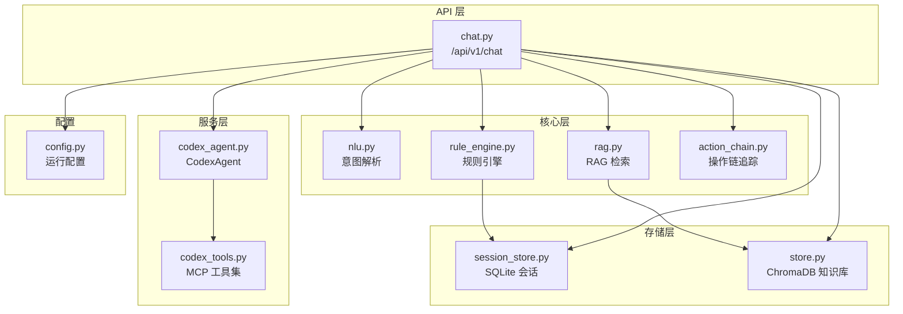
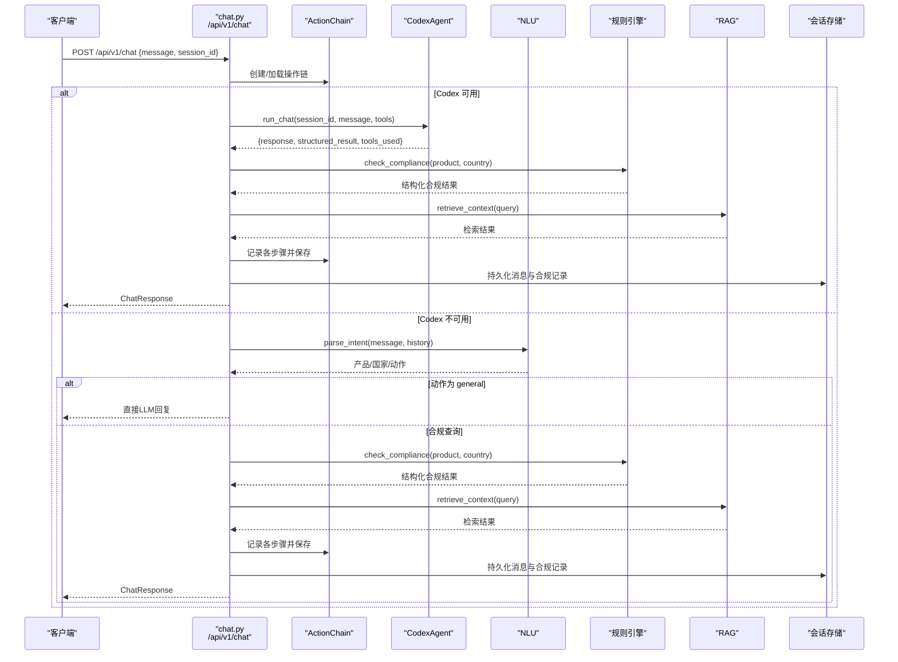
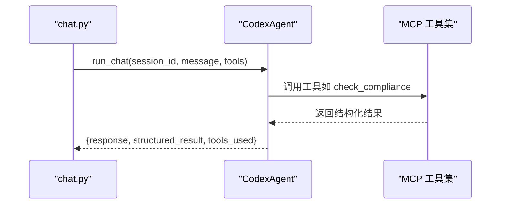
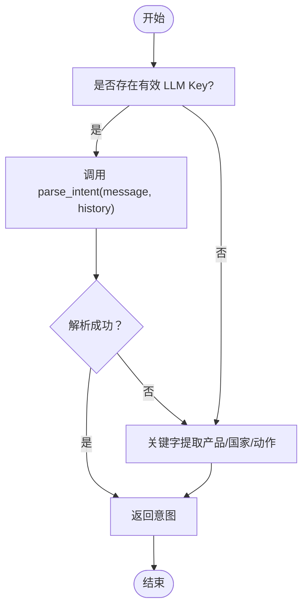
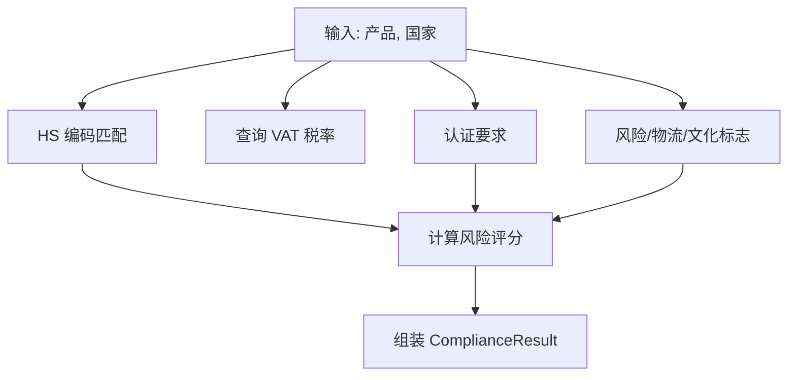
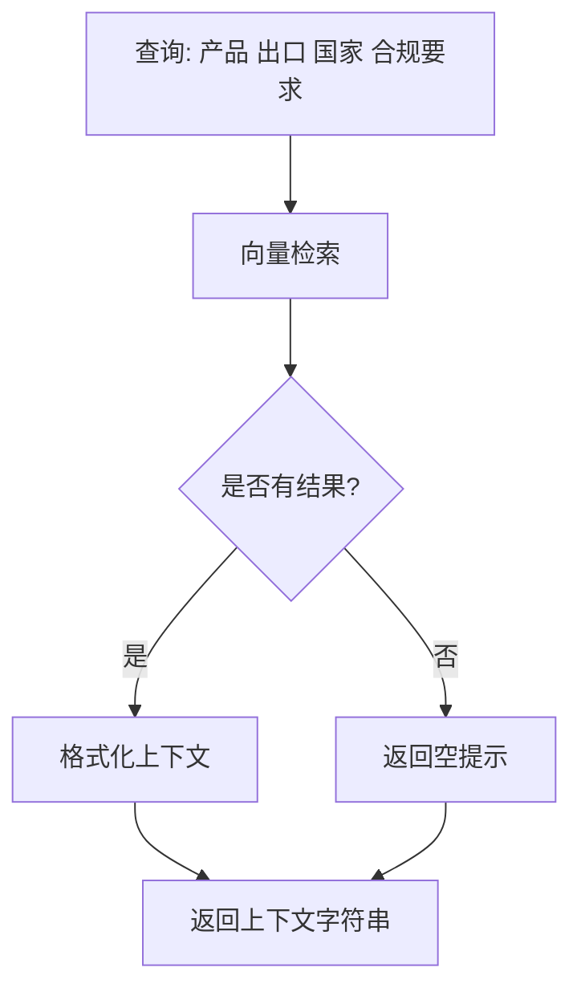
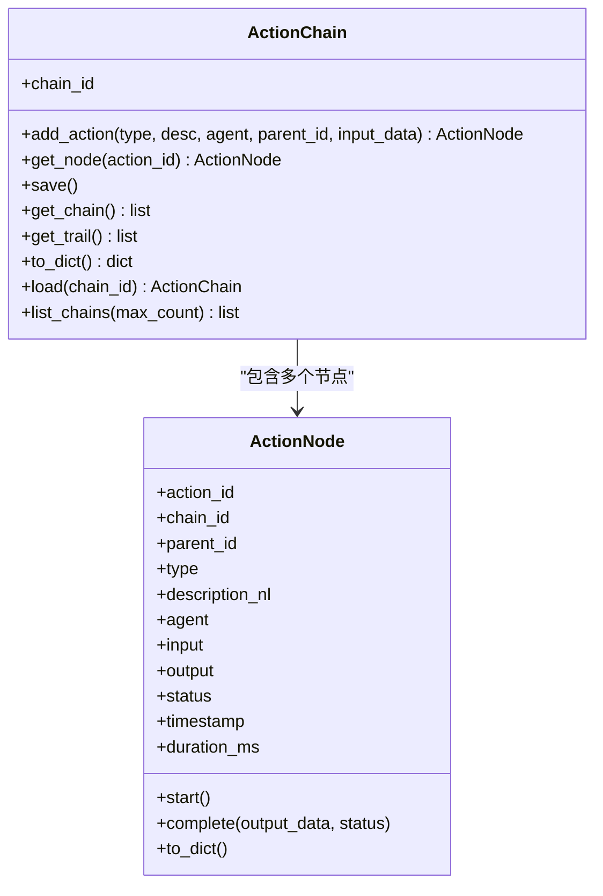
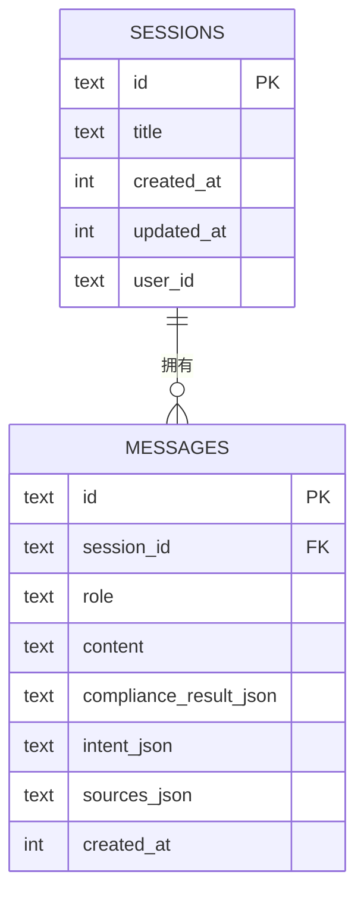
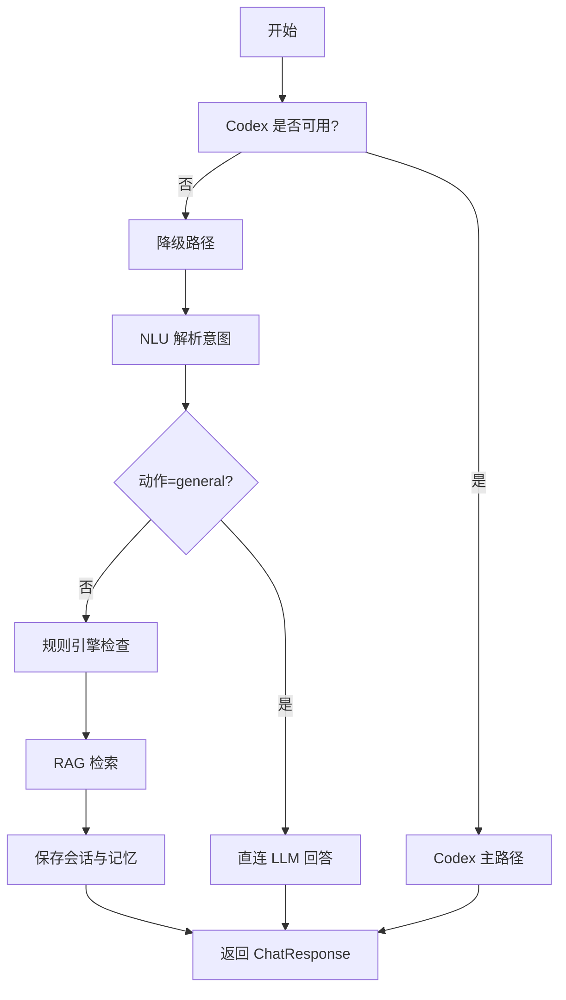
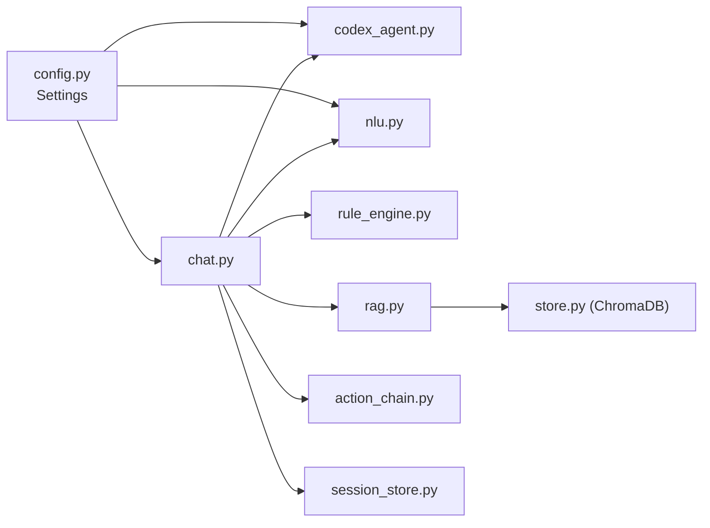

# 聊天对话API

<cite>
**本文档引用的文件**
- [chat.py](file://backend/app/api/chat.py)
- [codex_agent.py](file://backend/app/services/codex_agent.py)
- [nlu.py](file://backend/app/core/nlu.py)
- [rule_engine.py](file://backend/app/core/rule_engine.py)
- [rag.py](file://backend/app/core/rag.py)
- [schemas.py](file://backend/app/models/schemas.py)
- [action_chain.py](file://backend/app/core/action_chain.py)
- [session_store.py](file://backend/app/storage/session_store.py)
- [config.py](file://backend/app/config.py)
- [codex_tools.py](file://backend/app/services/codex_tools.py)
- [store.py](file://backend/app/knowledge/store.py)
- [main.py](file://backend/app/main.py)
- [test_api.py](file://backend/tests/test_api.py)
</cite>

## 目录
1. [简介](#简介)
2. [项目结构](#项目结构)
3. [核心组件](#核心组件)
4. [架构总览](#架构总览)
5. [详细组件分析](#详细组件分析)
6. [依赖分析](#依赖分析)
7. [性能考虑](#性能考虑)
8. [故障排查指南](#故障排查指南)
9. [结论](#结论)
10. [附录](#附录)

## 简介
本文件面向“合规问答”接口（/api/v1/chat）提供完整技术文档，涵盖以下要点：
- HTTP POST 方法与请求/响应规范
- Codex Agent 驱动的主处理流程与降级机制（NLU → RuleEngine → RAG）
- NLU 意图解析、规则引擎合规检查、RAG 检索增强的完整处理管道
- ActionChain 操作链追踪与决策链路回溯
- 会话管理与记忆持久化机制
- 请求/响应示例与错误处理说明

## 项目结构
后端采用 FastAPI + 分层架构：
- API 层：路由与端点定义（/api/v1/chat）
- 服务层：Codex Agent、工具集封装
- 核心层：NLU、规则引擎、RAG、操作链
- 存储层：会话持久化、知识库向量检索
- 配置层：运行时开关与模型参数

图表来源
- [chat.py:205-541](file://backend/app/api/chat.py#L205-L541)
- [codex_agent.py:40-370](file://backend/app/services/codex_agent.py#L40-L370)
- [codex_tools.py:21-242](file://backend/app/services/codex_tools.py#L21-L242)
- [nlu.py:59-99](file://backend/app/core/nlu.py#L59-L99)
- [rule_engine.py:197-247](file://backend/app/core/rule_engine.py#L197-L247)
- [rag.py:10-59](file://backend/app/core/rag.py#L10-L59)
- [action_chain.py:77-236](file://backend/app/core/action_chain.py#L77-L236)
- [session_store.py:74-251](file://backend/app/storage/session_store.py#L74-L251)
- [store.py:127-227](file://backend/app/knowledge/store.py#L127-L227)
- [config.py:5-75](file://backend/app/config.py#L5-L75)

章节来源
- [main.py:21-31](file://backend/app/main.py#L21-L31)
- [chat.py:205-541](file://backend/app/api/chat.py#L205-L541)

## 核心组件
- 接口定义与主流程
  - 端点：POST /api/v1/chat
  - 请求体：ComplianceQuery（message, session_id）
  - 响应体：ChatResponse（message, compliance_result, sources, session_id, action_chain_id, intent）
- Codex Agent 驱动
  - 使用 skills + MCP 工具 + 联网搜索
  - 支持持久化 Thread 维持多轮上下文
- 降级路径
  - NLU → 规则引擎 → RAG
  - 通用问题直连 LLM 回答
- 操作链追踪
  - ActionChain 记录每一步操作的自然语言描述
  - 前端可按 action_chain_id 回溯决策链路
- 会话与记忆
  - SQLite 会话存储（消息、合规结果、意图、来源）
  - 项目级记忆持久化（产品、市场、合规记录）

章节来源
- [chat.py:205-541](file://backend/app/api/chat.py#L205-L541)
- [schemas.py:73-104](file://backend/app/models/schemas.py#L73-L104)
- [codex_agent.py:110-160](file://backend/app/services/codex_agent.py#L110-L160)
- [action_chain.py:77-184](file://backend/app/core/action_chain.py#L77-L184)
- [session_store.py:74-218](file://backend/app/storage/session_store.py#L74-L218)

## 架构总览
主流程与降级流程如下：

图表来源
- [chat.py:228-541](file://backend/app/api/chat.py#L228-L541)
- [codex_agent.py:110-160](file://backend/app/services/codex_agent.py#L110-L160)
- [nlu.py:59-99](file://backend/app/core/nlu.py#L59-L99)
- [rule_engine.py:197-247](file://backend/app/core/rule_engine.py#L197-L247)
- [rag.py:10-59](file://backend/app/core/rag.py#L10-L59)
- [session_store.py:186-218](file://backend/app/storage/session_store.py#L186-L218)

## 详细组件分析

### 接口定义与请求/响应
- 端点：POST /api/v1/chat
- 请求体（ComplianceQuery）
  - message: 用户自然语言消息
  - session_id: 可选，用于恢复/延续会话
- 响应体（ChatResponse）
  - message: 格式化的合规报告
  - compliance_result: 结构化合规结果（ComplianceResult）
  - sources: 检索来源摘要
  - session_id: 会话ID
  - action_chain_id: 操作链ID
  - intent: NLU 解析结果（透传前端展示）

章节来源
- [chat.py:205-227](file://backend/app/api/chat.py#L205-L227)
- [schemas.py:73-104](file://backend/app/models/schemas.py#L73-L104)

### Codex Agent 驱动流程
- run_chat
  - 使用持久化 Thread 维持多轮上下文
  - 支持 skills + MCP 工具 + 联网搜索
  - 返回结构化结果与工具调用列表
- 工具集（MCP）
  - HS/VAT/认证/风险/物流/文化/合规检查/RAG 检索
  - 通过 call_tool 异步执行

图表来源
- [codex_agent.py:110-160](file://backend/app/services/codex_agent.py#L110-L160)
- [codex_tools.py:183-242](file://backend/app/services/codex_tools.py#L183-L242)

章节来源
- [codex_agent.py:110-160](file://backend/app/services/codex_agent.py#L110-L160)
- [codex_tools.py:21-242](file://backend/app/services/codex_tools.py#L21-L242)

### NLU 意图解析
- parse_intent
  - 使用系统提示与历史上下文（最多6条，助手消息截断）
  - 返回结构化意图：product、target_country、action、confidence
- 降级关键字提取
  - 无 LLM Key 时，使用简单规则提取产品与国家

图表来源
- [nlu.py:59-99](file://backend/app/core/nlu.py#L59-L99)
- [chat.py:93-101](file://backend/app/api/chat.py#L93-L101)

章节来源
- [nlu.py:59-99](file://backend/app/core/nlu.py#L59-L99)
- [chat.py:93-101](file://backend/app/api/chat.py#L93-L101)

### 规则引擎合规检查
- check_compliance
  - HS 编码模糊匹配
  - VAT 税率查询
  - 认证要求、风险提示、物流与运输、清关文件、文化注意事项
  - 风险评分与整改建议、出口待办清单
- 输出：ComplianceResult（schema 定义见 schemas.py）

图表来源
- [rule_engine.py:197-247](file://backend/app/core/rule_engine.py#L197-L247)
- [schemas.py:79-93](file://backend/app/models/schemas.py#L79-L93)

章节来源
- [rule_engine.py:197-247](file://backend/app/core/rule_engine.py#L197-L247)
- [schemas.py:79-93](file://backend/app/models/schemas.py#L79-L93)

### RAG 检索增强
- retrieve_context
  - 向量检索相关法规片段（ChromaDB）
  - 返回 top_k 结果（含 text、score、来源等）
- format_context_for_llm
  - 格式化为提示词上下文块（含来源、生效日期等）

图表来源
- [rag.py:10-59](file://backend/app/core/rag.py#L10-L59)
- [store.py:127-192](file://backend/app/knowledge/store.py#L127-L192)

章节来源
- [rag.py:10-59](file://backend/app/core/rag.py#L10-L59)
- [store.py:127-192](file://backend/app/knowledge/store.py#L127-L192)

### 操作链追踪与决策链路回溯
- ActionChain
  - 添加节点、开始/完成、统计状态、保存为 JSON
  - get_trail 生成自然语言链路（带耗时与状态符号）
- ChatResponse 透传 action_chain_id，前端可回溯

图表来源
- [action_chain.py:23-236](file://backend/app/core/action_chain.py#L23-L236)

章节来源
- [action_chain.py:77-184](file://backend/app/core/action_chain.py#L77-L184)

### 会话管理与记忆持久化
- 会话存储（SQLite）
  - sessions 表：id、title、created_at、updated_at、user_id
  - messages 表：content、compliance_result_json、intent_json、sources_json
  - 支持创建、列表、详情、删除、最近消息读取
- 记忆持久化
  - 保存用户消息、助手回复、合规结果、当前产品/市场
  - 项目级合规记录（按产品ID聚合）

图表来源
- [session_store.py:37-70](file://backend/app/storage/session_store.py#L37-L70)
- [session_store.py:186-218](file://backend/app/storage/session_store.py#L186-L218)

章节来源
- [session_store.py:74-218](file://backend/app/storage/session_store.py#L74-L218)
- [chat.py:184-203](file://backend/app/api/chat.py#L184-L203)

### 降级处理机制（NLU → RuleEngine → RAG）
- Codex 不可用时自动切换
- NLU 解析意图，通用问题走直连 LLM 回答，合规问题走规则引擎 + RAG
- 会话恢复：根据 session_id 加载最近消息作为历史上下文

图表来源
- [chat.py:251-264](file://backend/app/api/chat.py#L251-L264)
- [chat.py:415-541](file://backend/app/api/chat.py#L415-L541)

章节来源
- [chat.py:251-264](file://backend/app/api/chat.py#L251-L264)
- [chat.py:415-541](file://backend/app/api/chat.py#L415-L541)

## 依赖分析
- 配置开关
  - codex_enabled 控制 Codex 主/降级路径
  - active_llm_api_key 控制 NLU 与通用 LLM 回答
- 外部依赖
  - ChromaDB（知识库检索）
  - codex-client（Codex SDK）
  - OpenAI 客户端（NLU/通用 LLM）

图表来源
- [config.py:5-75](file://backend/app/config.py#L5-L75)
- [chat.py:205-541](file://backend/app/api/chat.py#L205-L541)
- [codex_agent.py:40-370](file://backend/app/services/codex_agent.py#L40-L370)
- [nlu.py:16-25](file://backend/app/core/nlu.py#L16-L25)
- [rag.py:7-8](file://backend/app/core/rag.py#L7-L8)
- [store.py:43-52](file://backend/app/knowledge/store.py#L43-L52)

章节来源
- [config.py:5-75](file://backend/app/config.py#L5-L75)
- [chat.py:205-541](file://backend/app/api/chat.py#L205-L541)

## 性能考虑
- Codex 主路径
  - 使用持久化 Thread 维持上下文，减少重复提示成本
  - MCP 工具并行执行（由 Agent 协调），提升吞吐
- 降级路径
  - NLU 仅做一次性 JSON 输出解析，延迟低
  - RAG 检索 top_k=3，避免长上下文带来的延迟
- 存储与检索
  - ChromaDB 懒加载嵌入模型，首次使用时初始化
  - 会话存储使用索引优化查询

## 故障排查指南
- 常见错误与处理
  - 422 参数校验失败：请求体缺少 message 字段
  - Codex 调用异常：捕获并自动降级至 NLU → RuleEngine → RAG
  - LLM Key 未配置：通用问题返回引导提示，合规问题走降级
  - ChromaDB 不可用：RAG 返回空结果，不影响主流程
- 日志与可观测性
  - ActionChain 保存每步耗时与状态，便于定位瓶颈
  - CodexAgent 抛出 CodexAgentError，便于上层捕获
- 会话与数据一致性
  - 会话存储失败不影响响应返回（降级处理）
  - 记忆持久化失败被吞掉，保证用户体验连续性

章节来源
- [chat.py:223-227](file://backend/app/api/chat.py#L223-L227)
- [chat.py:254-261](file://backend/app/api/chat.py#L254-L261)
- [codex_agent.py:32-38](file://backend/app/services/codex_agent.py#L32-L38)
- [rag.py:16-18](file://backend/app/core/rag.py#L16-L18)
- [chat.py:200-202](file://backend/app/api/chat.py#L200-L202)

## 结论
本接口通过 Codex 主路径与 NLU 降级路径实现高可用的合规问答服务，结合规则引擎与 RAG 检索，提供结构化、可追溯、可扩展的合规分析能力。ActionChain 与会话存储确保了用户体验与审计需求的平衡。

## 附录

### 请求/响应示例
- 请求
  - POST /api/v1/chat
  - Body: {"message": "手机出口德国需要什么认证？", "session_id": "可选"}
- 响应
  - ChatResponse
    - message: 格式化合规报告（含 HS、VAT、认证、风险、物流、文化、整改建议、待办清单）
    - compliance_result: 结构化合规结果
    - sources: 检索来源摘要
    - session_id: 会话ID
    - action_chain_id: 操作链ID
    - intent: NLU 解析结果

章节来源
- [chat.py:205-227](file://backend/app/api/chat.py#L205-L227)
- [schemas.py:79-104](file://backend/app/models/schemas.py#L79-L104)

### 错误处理说明
- 参数校验：缺少 message 字段返回 422
- Codex 不可用：自动降级并记录降级动作
- LLM Key 未配置：通用问题返回引导提示
- 存储异常：会话与记忆持久化失败不影响响应

章节来源
- [test_api.py:24-30](file://backend/tests/test_api.py#L24-L30)
- [chat.py:223-227](file://backend/app/api/chat.py#L223-L227)
- [chat.py:381-413](file://backend/app/api/chat.py#L381-L413)