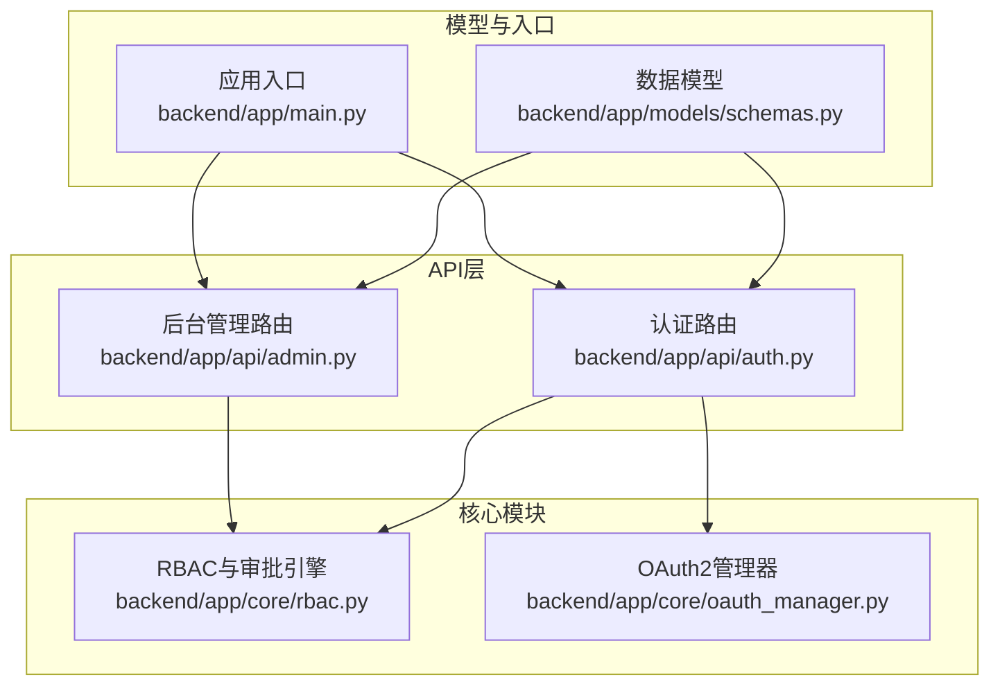
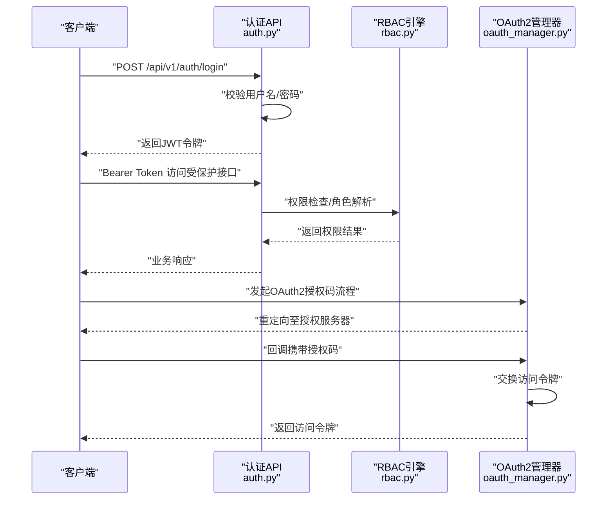
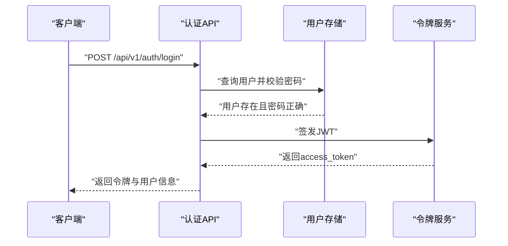
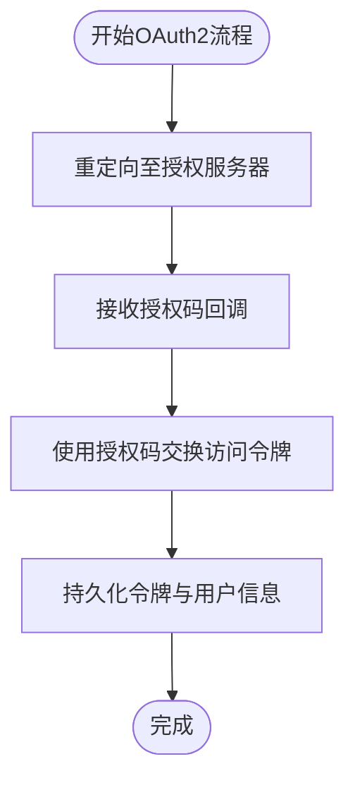
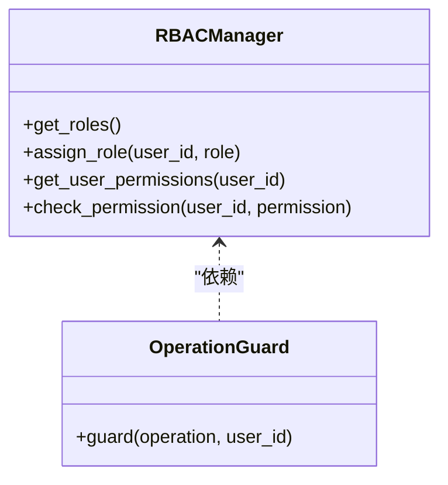
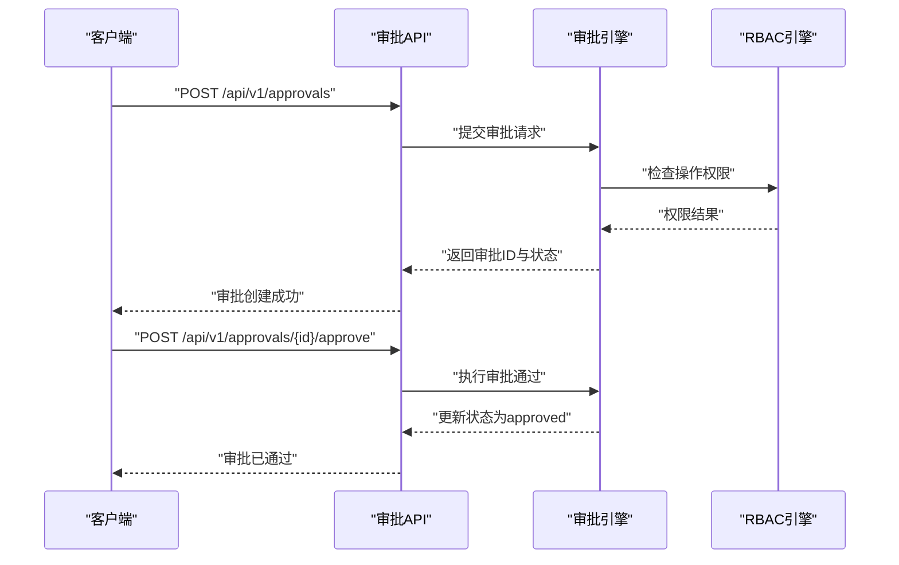
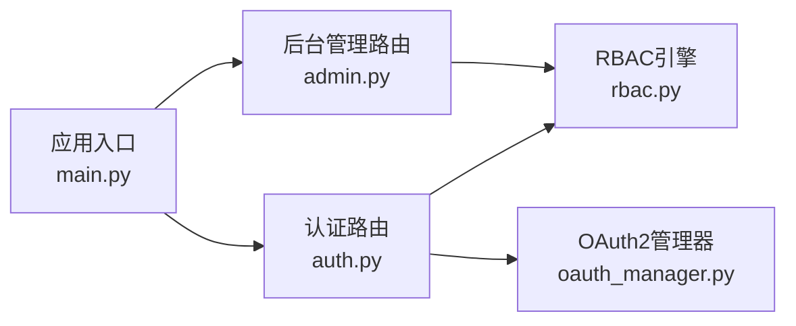

# 认证API

<cite>
**本文引用的文件**
- [backend/app/api/auth.py](file://backend/app/api/auth.py)
- [backend/app/api/admin.py](file://backend/app/api/admin.py)
- [backend/app/core/rbac.py](file://backend/app/core/rbac.py)
- [backend/app/core/oauth_manager.py](file://backend/app/core/oauth_manager.py)
- [backend/app/models/schemas.py](file://backend/app/models/schemas.py)
- [backend/app/main.py](file://backend/app/main.py)
- [后端api.md](file://后端api.md)
- [前端api.md](file://前端api.md)
- [README.md](file://README.md)
</cite>

## 目录
1. [简介](#简介)
2. [项目结构](#项目结构)
3. [核心组件](#核心组件)
4. [架构总览](#架构总览)
5. [详细组件分析](#详细组件分析)
6. [依赖关系分析](#依赖关系分析)
7. [性能考量](#性能考量)
8. [故障排查指南](#故障排查指南)
9. [结论](#结论)
10. [附录](#附录)

## 简介
本文件为避风港平台的认证API技术文档，覆盖以下主题：
- JWT认证机制：登录、登出、令牌刷新等接口与实现要点
- OAuth2集成：授权码获取、访问令牌交换等流程
- RBAC权限管理：角色查询、权限分配、访问控制等接口
- 审批流程：审批请求、审批状态查询、审批历史等接口
- 请求/响应示例、错误码说明、安全考虑与最佳实践
- 客户端实现指南与常见问题解决方案

## 项目结构
认证相关能力主要分布在后端API层与核心模块中：
- API路由层：用户认证、RBAC、审批等接口定义
- 核心模块：JWT生成与校验、OAuth2管理器、RBAC与审批引擎
- 数据模型：请求/响应数据结构定义
- 应用入口：FastAPI应用注册与中间件配置

图表来源
- [backend/app/api/auth.py:1-120](file://backend/app/api/auth.py#L1-L120)
- [backend/app/api/admin.py:1-120](file://backend/app/api/admin.py#L1-L120)
- [backend/app/core/rbac.py:400-500](file://backend/app/core/rbac.py#L400-L500)
- [backend/app/core/oauth_manager.py:1-200](file://backend/app/core/oauth_manager.py#L1-L200)
- [backend/app/models/schemas.py:1-200](file://backend/app/models/schemas.py#L1-L200)
- [backend/app/main.py:1-120](file://backend/app/main.py#L1-L120)

章节来源
- [后端api.md:536-721](file://后端api.md#L536-L721)
- [backend/app/api/auth.py:1-120](file://backend/app/api/auth.py#L1-L120)
- [backend/app/api/admin.py:1-120](file://backend/app/api/admin.py#L1-L120)
- [backend/app/core/rbac.py:400-500](file://backend/app/core/rbac.py#L400-L500)
- [backend/app/core/oauth_manager.py:1-200](file://backend/app/core/oauth_manager.py#L1-L200)
- [backend/app/models/schemas.py:1-200](file://backend/app/models/schemas.py#L1-L200)
- [backend/app/main.py:1-120](file://backend/app/main.py#L1-L120)

## 核心组件
- 认证路由与JWT
  - 登录接口：用户名/密码换取JWT
  - OAuth2表单登录：兼容Swagger UI
  - 当前用户信息：携带Bearer Token访问
  - 修改密码：基于当前会话
- RBAC权限管理
  - 角色定义列表、用户RBAC列表、用户权限详情、用户权限列表
  - 角色分配、权限检查
- 审批流程
  - 审批列表、创建审批请求、审批通过/驳回
  - 审批规则、审批统计
- OAuth2集成
  - 授权码获取、访问令牌交换、回调处理
- 数据模型
  - 登录请求、令牌响应、角色分配请求等

章节来源
- [后端api.md:536-721](file://后端api.md#L536-L721)
- [backend/app/api/auth.py:1-120](file://backend/app/api/auth.py#L1-L120)
- [backend/app/api/admin.py:1-120](file://backend/app/api/admin.py#L1-L120)
- [backend/app/core/rbac.py:400-500](file://backend/app/core/rbac.py#L400-L500)
- [backend/app/core/oauth_manager.py:1-200](file://backend/app/core/oauth_manager.py#L1-L200)
- [backend/app/models/schemas.py:1-200](file://backend/app/models/schemas.py#L1-L200)

## 架构总览
认证与权限的整体架构如下：

图表来源
- [backend/app/api/auth.py:1-120](file://backend/app/api/auth.py#L1-L120)
- [backend/app/core/rbac.py:400-500](file://backend/app/core/rbac.py#L400-L500)
- [backend/app/core/oauth_manager.py:1-200](file://backend/app/core/oauth_manager.py#L1-L200)

## 详细组件分析

### JWT认证机制
- 登录
  - 接口：POST /api/v1/auth/login
  - 输入：用户名、密码
  - 输出：access_token、角色、用户名、用户ID
  - 鉴权：无需鉴权
- OAuth2表单登录（Swagger兼容）
  - 接口：POST /api/v1/auth/token
  - 输入：OAuth2PasswordRequestForm
  - 输出：access_token、token_type
  - 鉴权：无需鉴权
- 当前用户信息
  - 接口：GET /api/v1/auth/me
  - 输入：Bearer Token
  - 输出：当前用户信息
  - 鉴权：Bearer
- 修改密码
  - 接口：PUT /api/v1/auth/me/password
  - 输入：旧密码、新密码
  - 输出：修改结果
  - 鉴权：Bearer

图表来源
- [backend/app/api/auth.py:54-78](file://backend/app/api/auth.py#L54-L78)

章节来源
- [后端api.md:536-560](file://后端api.md#L536-L560)
- [backend/app/api/auth.py:1-120](file://backend/app/api/auth.py#L1-L120)

### OAuth2集成
- 授权码流程
  - 客户端重定向至授权服务器
  - 授权服务器回调携带授权码
  - 服务端使用授权码交换访问令牌
- 回调处理
  - 处理授权码、交换令牌、持久化用户会话
- 数据模型
  - 授权码、访问令牌、刷新令牌、用户信息等

图表来源
- [backend/app/core/oauth_manager.py:1-200](file://backend/app/core/oauth_manager.py#L1-L200)

章节来源
- [后端api.md:536-560](file://后端api.md#L536-L560)
- [backend/app/core/oauth_manager.py:1-200](file://backend/app/core/oauth_manager.py#L1-L200)

### RBAC权限管理
- 角色与权限
  - 角色定义列表：获取系统可用角色
  - 用户RBAC列表：查看用户的角色分配
  - 用户权限详情：查看用户在系统中的权限集合
  - 用户权限列表：按用户查询权限清单
  - 权限检查：校验用户是否具备某项权限
- 角色分配
  - 分配角色：为指定用户分配角色
- 接口概览
  - GET /api/v1/rbac/roles
  - POST /api/v1/rbac/assign
  - GET /api/v1/rbac/users
  - GET /api/v1/rbac/users/{user_id}
  - GET /api/v1/rbac/users/{user_id}/permissions
  - POST /api/v1/rbac/check

图表来源
- [backend/app/core/rbac.py:400-500](file://backend/app/core/rbac.py#L400-L500)

章节来源
- [后端api.md:667-680](file://后端api.md#L667-L680)
- [backend/app/api/admin.py:1-120](file://backend/app/api/admin.py#L1-L120)
- [backend/app/core/rbac.py:400-500](file://backend/app/core/rbac.py#L400-L500)

### 审批流程
- 审批接口
  - GET /api/v1/approvals：审批列表
  - POST /api/v1/approvals：创建审批请求
  - POST /api/v1/approvals/{approval_id}/approve：审批通过
  - POST /api/v1/approvals/{approval_id}/reject：审批驳回
  - GET /api/v1/approvals/rules：审批规则
  - GET /api/v1/approvals/stats：审批统计
- 引擎与守卫
  - 审批引擎负责规则匹配、流转控制、超时与升级策略
  - 操作守卫结合RBAC与审批引擎进行统一访问控制

图表来源
- [backend/app/api/admin.py:1-120](file://backend/app/api/admin.py#L1-L120)
- [backend/app/core/rbac.py:400-500](file://backend/app/core/rbac.py#L400-L500)

章节来源
- [后端api.md:681-694](file://后端api.md#L681-L694)
- [backend/app/api/admin.py:1-120](file://backend/app/api/admin.py#L1-L120)
- [backend/app/core/rbac.py:400-500](file://backend/app/core/rbac.py#L400-L500)

### 数据模型与请求/响应
- 登录请求
  - 字段：username、password
- 令牌响应
  - 字段：access_token、role、username、user_id
- 角色分配请求
  - 字段：user_id、username、role
- 权限检查请求
  - 字段：user_id、permission

章节来源
- [backend/app/models/schemas.py:1-200](file://backend/app/models/schemas.py#L1-L200)
- [backend/app/api/auth.py:1-120](file://backend/app/api/auth.py#L1-L120)
- [backend/app/api/admin.py:1-120](file://backend/app/api/admin.py#L1-L120)

## 依赖关系分析
- 认证API依赖RBAC引擎进行权限校验
- OAuth2管理器负责外部授权码流程
- 应用入口注册路由并加载中间件

图表来源
- [backend/app/main.py:1-120](file://backend/app/main.py#L1-L120)
- [backend/app/api/auth.py:1-120](file://backend/app/api/auth.py#L1-L120)
- [backend/app/api/admin.py:1-120](file://backend/app/api/admin.py#L1-L120)
- [backend/app/core/rbac.py:400-500](file://backend/app/core/rbac.py#L400-L500)
- [backend/app/core/oauth_manager.py:1-200](file://backend/app/core/oauth_manager.py#L1-L200)

章节来源
- [backend/app/main.py:1-120](file://backend/app/main.py#L1-L120)
- [backend/app/api/auth.py:1-120](file://backend/app/api/auth.py#L1-L120)
- [backend/app/api/admin.py:1-120](file://backend/app/api/admin.py#L1-L120)
- [backend/app/core/rbac.py:400-500](file://backend/app/core/rbac.py#L400-L500)
- [backend/app/core/oauth_manager.py:1-200](file://backend/app/core/oauth_manager.py#L1-L200)

## 性能考量
- 令牌签发与校验应采用高效算法与缓存策略
- RBAC权限检查应避免频繁数据库查询，建议引入内存缓存
- OAuth2回调处理需快速完成令牌交换与会话建立
- 审批流程的规则匹配与状态更新应异步化以提升吞吐量

## 故障排查指南
- 登录失败
  - 检查用户名/密码是否正确
  - 确认用户是否存在且未被禁用
- 令牌无效
  - 检查Bearer Token格式与有效期
  - 确认签名算法与密钥一致
- 权限不足
  - 使用“用户权限列表”接口确认当前用户权限
  - 检查角色分配是否正确
- 审批异常
  - 查看审批规则与当前审批状态
  - 确认审批人是否具备相应权限

## 结论
本文档系统性地梳理了避风港平台的认证与权限体系，涵盖JWT登录、OAuth2集成、RBAC与审批流程的接口规范与实现要点。建议在生产环境中强化令牌安全、完善权限审计与审批日志，并持续优化性能与可观测性。

## 附录
- 客户端实现建议
  - 使用Bearer Token访问受保护接口
  - 在令牌即将过期时触发刷新流程
  - 对OAuth2授权码回调进行严格校验
- 最佳实践
  - 令牌最小权限原则与短期有效
  - 审批流程自动化与人工复核相结合
  - RBAC与审批双因子控制关键操作
- 常见问题
  - 如何处理令牌过期？建议实现静默刷新或引导重新登录
  - 如何确保OAuth2回调的安全性？必须校验state与来源域名
  - 如何排查权限不生效？检查角色分配与权限检查接口返回