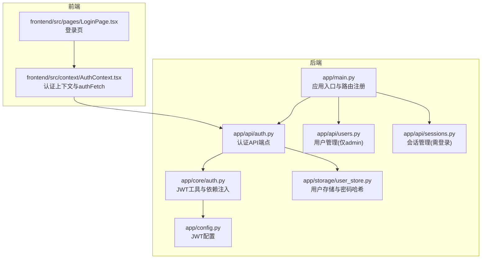
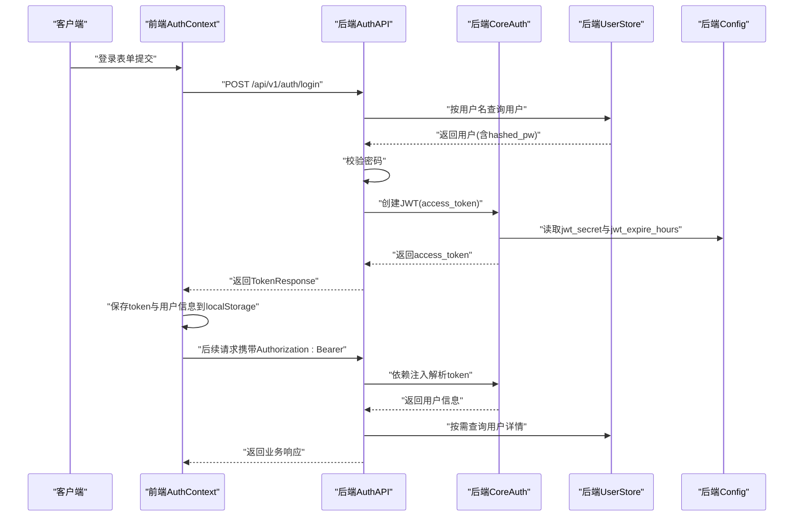
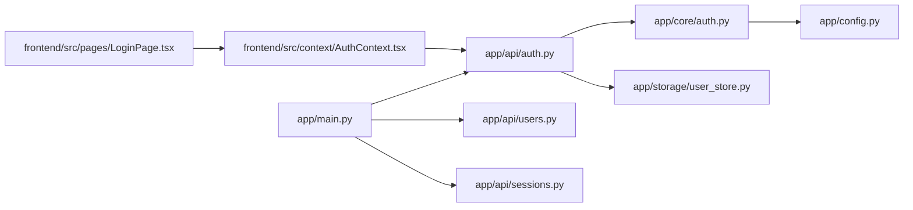

# 认证授权API

<cite>
**本文引用的文件**
- [backend/app/api/auth.py](file://backend/app/api/auth.py)
- [backend/app/core/auth.py](file://backend/app/core/auth.py)
- [backend/app/storage/user_store.py](file://backend/app/storage/user_store.py)
- [backend/app/main.py](file://backend/app/main.py)
- [backend/app/config.py](file://backend/app/config.py)
- [backend/app/api/users.py](file://backend/app/api/users.py)
- [backend/app/api/sessions.py](file://backend/app/api/sessions.py)
- [frontend/src/context/AuthContext.tsx](file://frontend/src/context/AuthContext.tsx)
- [frontend/src/pages/LoginPage.tsx](file://frontend/src/pages/LoginPage.tsx)
- [README.md](file://README.md)
</cite>

## 目录
1. [简介](#简介)
2. [项目结构](#项目结构)
3. [核心组件](#核心组件)
4. [架构总览](#架构总览)
5. [详细组件分析](#详细组件分析)
6. [依赖关系分析](#依赖关系分析)
7. [性能考量](#性能考量)
8. [故障排查指南](#故障排查指南)
9. [结论](#结论)
10. [附录](#附录)

## 简介
本文件面向“避风港”跨境合规智能体系统的认证授权API，系统采用JWT Bearer Token进行身份认证与权限控制，支持用户登录、注册、当前用户信息查询、密码修改等功能，并通过FastAPI依赖注入实现统一的认证中间件。前端通过React上下文封装了基于Bearer Token的HTTP请求，确保API调用具备一致的身份验证与权限校验。

## 项目结构
认证授权相关的核心模块分布如下：
- 后端入口与路由注册：[backend/app/main.py](file://backend/app/main.py)
- 认证API端点：[backend/app/api/auth.py](file://backend/app/api/auth.py)
- 核心认证工具与依赖注入：[backend/app/core/auth.py](file://backend/app/core/auth.py)
- 用户存储与密码哈希：[backend/app/storage/user_store.py](file://backend/app/storage/user_store.py)
- 配置（JWT密钥与过期时间）：[backend/app/config.py](file://backend/app/config.py)
- 用户管理（仅管理员）：[backend/app/api/users.py](file://backend/app/api/users.py)
- 会话管理（需登录）：[backend/app/api/sessions.py](file://backend/app/api/sessions.py)
- 前端认证上下文与登录页：[frontend/src/context/AuthContext.tsx](file://frontend/src/context/AuthContext.tsx)、[frontend/src/pages/LoginPage.tsx](file://frontend/src/pages/LoginPage.tsx)

图表来源
- [backend/app/main.py:1-76](file://backend/app/main.py#L1-L76)
- [backend/app/api/auth.py:1-108](file://backend/app/api/auth.py#L1-L108)
- [backend/app/core/auth.py:1-60](file://backend/app/core/auth.py#L1-L60)
- [backend/app/storage/user_store.py:1-133](file://backend/app/storage/user_store.py#L1-L133)
- [backend/app/config.py:65-68](file://backend/app/config.py#L65-L68)
- [frontend/src/context/AuthContext.tsx:1-106](file://frontend/src/context/AuthContext.tsx#L1-L106)
- [frontend/src/pages/LoginPage.tsx:1-154](file://frontend/src/pages/LoginPage.tsx#L1-L154)

章节来源
- [backend/app/main.py:1-76](file://backend/app/main.py#L1-L76)
- [README.md:222-281](file://README.md#L222-L281)

## 核心组件
- JWT Bearer Token认证机制
  - 使用HS256算法签名，密钥与过期时间由配置提供。
  - 通过OAuth2PasswordBearer在登录端点获取token，随后在后续请求头中携带Authorization: Bearer。
- FastAPI依赖注入
  - get_current_user：解析token并返回用户信息，无效或过期时抛出401。
  - require_admin：仅允许admin角色，否则抛出403。
- 用户存储与密码安全
  - bcrypt哈希密码，SQLite存储用户信息（id、username、hashed_pw、role、created_at）。
- 前端集成
  - 登录成功后将token与用户信息保存至localStorage，并在后续请求中自动添加Authorization头。

章节来源
- [backend/app/core/auth.py:12-59](file://backend/app/core/auth.py#L12-L59)
- [backend/app/config.py:65-68](file://backend/app/config.py#L65-L68)
- [backend/app/storage/user_store.py:38-43](file://backend/app/storage/user_store.py#L38-L43)
- [frontend/src/context/AuthContext.tsx:44-82](file://frontend/src/context/AuthContext.tsx#L44-L82)

## 架构总览
认证授权的整体流程如下：
- 用户通过登录端点提交用户名与密码，后端验证并通过JWT签发token。
- 前端将token保存并在后续请求中以Bearer方式携带。
- 后端通过依赖注入解析token，校验用户是否存在与角色权限，再执行业务逻辑。

图表来源
- [backend/app/api/auth.py:54-68](file://backend/app/api/auth.py#L54-L68)
- [backend/app/core/auth.py:19-36](file://backend/app/core/auth.py#L19-L36)
- [backend/app/storage/user_store.py:68-85](file://backend/app/storage/user_store.py#L68-L85)
- [backend/app/config.py:65-68](file://backend/app/config.py#L65-L68)
- [frontend/src/context/AuthContext.tsx:44-82](file://frontend/src/context/AuthContext.tsx#L44-L82)

## 详细组件分析

### 认证API端点
- 登录
  - 方法与路径：POST /api/v1/auth/login
  - 请求体：包含username与password
  - 成功响应：TokenResponse（access_token、token_type、role、username、user_id）
  - 错误：401（用户名或密码错误）
- 获取token（兼容Swagger UI）
  - 方法与路径：POST /api/v1/auth/token
  - 请求体：OAuth2PasswordRequestForm（username、password）
  - 成功响应：{access_token, token_type}
  - 错误：401（用户名或密码错误）
- 注册（仅管理员）
  - 方法与路径：POST /api/v1/auth/register
  - 请求体：RegisterRequest（username、password、role）
  - 成功响应：UserInfoResponse（id、username、role、created_at）
  - 错误：400（角色非法）、409（用户名冲突）、403（非管理员）
- 当前用户信息
  - 方法与路径：GET /api/v1/auth/me
  - 成功响应：UserInfoResponse（id、username、role、created_at）
  - 错误：401（未登录或token无效）
- 修改密码
  - 方法与路径：PUT /api/v1/auth/me/password
  - 请求体：ChangePasswordRequest（old_password、new_password）
  - 成功响应：{"ok": true, "message": "密码已修改"}
  - 错误：400（原密码不正确或新密码长度不足）

章节来源
- [backend/app/api/auth.py:54-107](file://backend/app/api/auth.py#L54-L107)

### 核心认证工具与依赖注入
- OAuth2PasswordBearer
  - tokenUrl指向登录端点，用于Swagger UI与客户端自动发现。
- create_access_token
  - 以用户id作为sub，设置过期时间（小时），使用HS256签名。
- _decode_token
  - 验证JWT签名与过期时间，无效时抛出401并设置WWW-Authenticate: Bearer。
- get_current_user
  - 依赖注入解析token，获取用户id并查询用户详情，不存在则401。
- require_admin
  - 仅允许admin角色，否则403。

章节来源
- [backend/app/core/auth.py:12-59](file://backend/app/core/auth.py#L12-L59)

### 用户存储与密码安全
- 表结构：users(id, username, hashed_pw, role, created_at)，role为admin或user。
- 密码处理：bcrypt哈希与校验，创建用户时生成哈希并入库。
- 初始化默认管理员：若用户表为空，自动创建admin/admin123。

章节来源
- [backend/app/storage/user_store.py:22-133](file://backend/app/storage/user_store.py#L22-L133)

### 配置（JWT）
- jwt_secret：JWT签名密钥（生产环境必须替换）
- jwt_expire_hours：token有效期（小时）

章节来源
- [backend/app/config.py:65-68](file://backend/app/config.py#L65-L68)

### 前端认证上下文与登录页
- 登录流程：调用POST /api/v1/auth/login，成功后保存token与用户信息到localStorage。
- 请求封装：authFetch自动在请求头添加Authorization: Bearer。
- 登录页：提供默认账号admin/admin123提示。

章节来源
- [frontend/src/context/AuthContext.tsx:44-82](file://frontend/src/context/AuthContext.tsx#L44-L82)
- [frontend/src/pages/LoginPage.tsx:148-149](file://frontend/src/pages/LoginPage.tsx#L148-L149)

### 权限控制与会话管理
- 会话管理端点均需登录，非管理员仅能访问自己的会话。
- 用户管理端点仅admin可用，且禁止删除或修改自身角色。

章节来源
- [backend/app/api/sessions.py:23-78](file://backend/app/api/sessions.py#L23-L78)
- [backend/app/api/users.py:24-54](file://backend/app/api/users.py#L24-L54)

## 依赖关系分析
认证授权模块内部依赖关系如下：
- app/main.py注册认证、用户管理、会话管理等路由。
- app/api/auth.py依赖app/core/auth.py与app/storage/user_store.py。
- app/core/auth.py依赖app/config.py读取JWT配置。
- 前端AuthContext依赖后端认证端点与登录页。

图表来源
- [backend/app/main.py:21-30](file://backend/app/main.py#L21-L30)
- [backend/app/api/auth.py:8-14](file://backend/app/api/auth.py#L8-L14)
- [backend/app/core/auth.py:10](file://backend/app/core/auth.py#L10)
- [frontend/src/context/AuthContext.tsx:3-19](file://frontend/src/context/AuthContext.tsx#L3-L19)

章节来源
- [backend/app/main.py:21-30](file://backend/app/main.py#L21-L30)
- [backend/app/api/auth.py:8-14](file://backend/app/api/auth.py#L8-L14)
- [backend/app/core/auth.py:10](file://backend/app/core/auth.py#L10)
- [frontend/src/context/AuthContext.tsx:3-19](file://frontend/src/context/AuthContext.tsx#L3-L19)

## 性能考量
- JWT解析与数据库查询：get_current_user每次都会查询用户详情，建议在高频场景下结合缓存策略减少数据库压力。
- 密码哈希成本：bcrypt哈希计算开销较高，建议在批量操作或后台任务中避免频繁触发。
- Token有效期：合理设置jwt_expire_hours，平衡安全性与用户体验。

## 故障排查指南
- 401 未认证
  - 检查Authorization头是否为Bearer token，确认token未过期。
  - 确认jwt_secret与jwt_expire_hours配置正确。
- 403 权限不足
  - 注册与用户管理端点仅admin可用，确认当前用户角色。
- 409 用户名冲突
  - 注册时用户名已存在，更换用户名后重试。
- 400 参数错误
  - 修改密码时原密码不正确或新密码长度不足，按提示修正。
- 404 会话不存在
  - 访问或删除不存在的会话ID，确认会话ID正确。

章节来源
- [backend/app/api/auth.py:58-61](file://backend/app/api/auth.py#L58-L61)
- [backend/app/api/auth.py:87-88](file://backend/app/api/auth.py#L87-L88)
- [backend/app/api/sessions.py:37-38](file://backend/app/api/sessions.py#L37-L38)
- [backend/app/api/sessions.py:74-75](file://backend/app/api/sessions.py#L74-L75)

## 结论
本认证授权体系基于JWT Bearer Token与FastAPI依赖注入，实现了清晰的用户身份验证与权限控制。通过统一的登录、注册、当前用户信息与密码修改接口，配合前端上下文封装，为系统提供了安全、易用的认证体验。建议在生产环境中强化JWT密钥管理与会话缓存策略，持续优化性能与安全性。

## 附录

### API端点一览（认证相关）
- POST /api/v1/auth/login：用户登录
- POST /api/v1/auth/token：获取token（兼容Swagger UI）
- POST /api/v1/auth/register：新建用户（仅admin）
- GET /api/v1/auth/me：当前用户信息
- PUT /api/v1/auth/me/password：修改密码
- GET /api/v1/sessions：会话列表（需登录）
- GET /api/v1/sessions/{id}：会话详情（需登录）
- DELETE /api/v1/sessions/{id}：删除会话（需登录）
- GET /api/v1/users：用户列表（仅admin）
- DELETE /api/v1/users/{id}：删除用户（仅admin）
- PUT /api/v1/users/{id}/role：修改用户角色（仅admin）

章节来源
- [README.md:222-281](file://README.md#L222-L281)

### 安全考虑事项
- 生产环境必须更换jwt_secret，避免硬编码密钥。
- 合理设置jwt_expire_hours，定期轮换token。
- 建议引入刷新token机制与黑名单（revoke）策略。
- 前端localStorage存储token需注意XSS防护，必要时采用HttpOnly Cookie替代。
- 密码最小长度与复杂度策略可根据业务需求调整。

章节来源
- [backend/app/config.py:65-68](file://backend/app/config.py#L65-L68)
- [backend/app/api/auth.py:104-105](file://backend/app/api/auth.py#L104-L105)

### 匿名访问与向后兼容性
- 系统部分端点（如聊天、健康检查、风险监控、操作链与事件链等）无需登录即可访问，满足匿名访问与向后兼容性。
- 认证相关端点明确标注“是”或“admin”，便于区分访问权限。

章节来源
- [README.md:222-281](file://README.md#L222-L281)

### API使用示例与最佳实践
- 登录示例
  - POST /api/v1/auth/login
  - 请求体：{username, password}
  - 成功后保存返回的access_token，并在后续请求头添加Authorization: Bearer {access_token}
- 修改密码示例
  - PUT /api/v1/auth/me/password
  - 请求体：{old_password, new_password}
  - 注意新密码长度至少6位
- 管理员操作示例
  - POST /api/v1/auth/register：创建新用户
  - PUT /api/v1/users/{id}/role：修改用户角色
  - DELETE /api/v1/users/{id}：删除用户（不可删除自身）

章节来源
- [backend/app/api/auth.py:54-107](file://backend/app/api/auth.py#L54-L107)
- [backend/app/api/users.py:24-54](file://backend/app/api/users.py#L24-L54)
- [frontend/src/context/AuthContext.tsx:75-82](file://frontend/src/context/AuthContext.tsx#L75-L82)