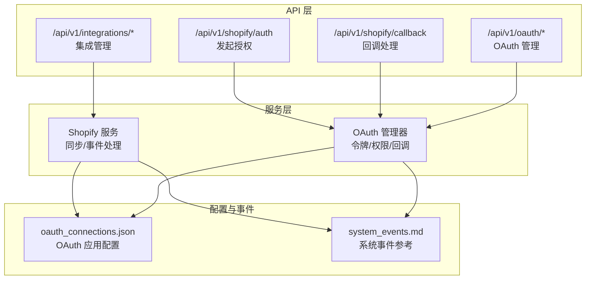
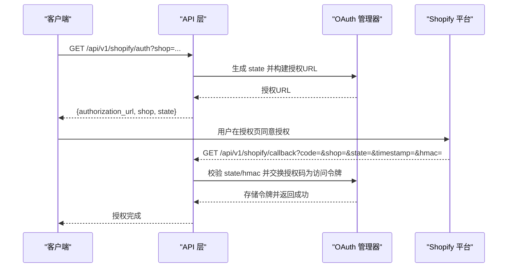
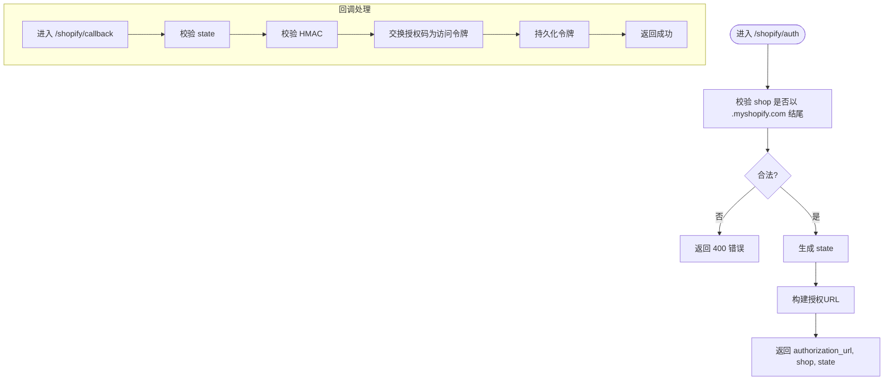
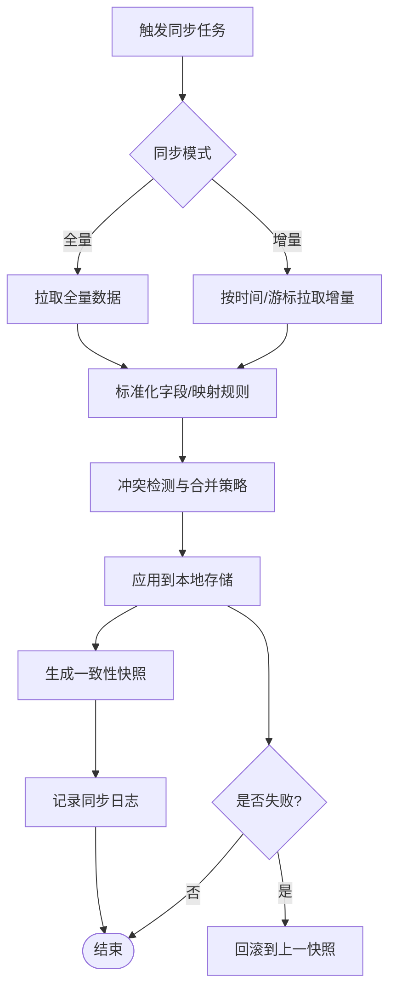
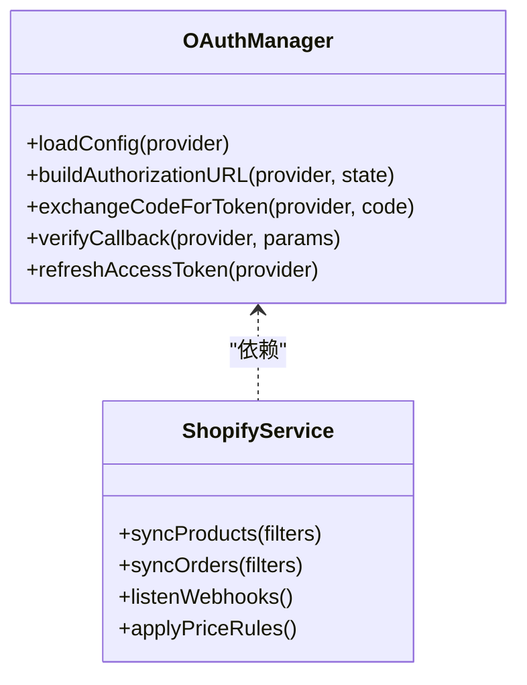
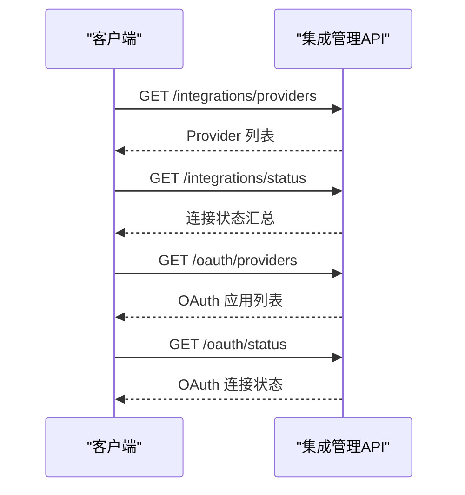
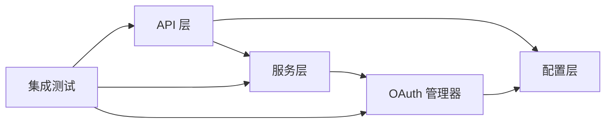

# 集成API

<cite>
**本文引用的文件**
- [backend/app/api/shopify.py](file://backend/app/api/shopify.py)
- [backend/app/services/shopify.py](file://backend/app/services/shopify.py)
- [backend/app/core/oauth_manager.py](file://backend/app/core/oauth_manager.py)
- [backend/app/api/integrations.py](file://backend/app/api/integrations.py)
- [backend/data/config/oauth_connections.json](file://backend/data/config/oauth_connections.json)
- [backend/data/config/events/system_events.md](file://backend/data/config/events/system_events.md)
- [backend/tests/test_all_phases.py](file://backend/tests/test_all_phases.py)
- [后端api.md](file://后端api.md)
- [前后端api交互.md](file://前后端api交互.md)
</cite>

## 目录
1. [简介](#简介)
2. [项目结构](#项目结构)
3. [核心组件](#核心组件)
4. [架构总览](#架构总览)
5. [详细组件分析](#详细组件分析)
6. [依赖关系分析](#依赖关系分析)
7. [性能考量](#性能考量)
8. [故障排除指南](#故障排除指南)
9. [结论](#结论)
10. [附录](#附录)

## 简介
本文件面向集成开发者与平台运营人员，系统化梳理避风港平台的第三方集成能力，重点覆盖：
- Shopify 集成：OAuth 授权、令牌管理、回调处理、Webhook 订阅与事件消费、产品/订单/库存/价格同步策略
- 第三方集成通用接口：配置、数据映射、同步策略、错误处理与回滚
- 数据同步机制：全量/增量同步、冲突解决、回滚机制
- 集成开发指南：SDK 使用建议、最佳实践、性能优化与安全注意事项
- 常见集成场景示例与故障排除

## 项目结构
围绕“集成”主题的关键后端模块与配置如下：
- API 层：提供对外接口，如 Shopify 授权、回调、集成状态查询等
- 服务层：封装具体业务逻辑，如 Shopify 服务、OAuth 管理器
- 配置层：存储 OAuth 应用配置、事件策略、系统事件参考
- 测试层：对集成与 OAuth 能力进行端到端验证

**图表来源**
- [backend/app/api/shopify.py:38-73](file://backend/app/api/shopify.py#L38-L73)
- [backend/app/api/integrations.py](file://backend/app/api/integrations.py)
- [backend/app/core/oauth_manager.py](file://backend/app/core/oauth_manager.py)
- [backend/data/config/oauth_connections.json](file://backend/data/config/oauth_connections.json)
- [backend/data/config/events/system_events.md:22-31](file://backend/data/config/events/system_events.md#L22-L31)

**章节来源**
- [backend/app/api/shopify.py:38-73](file://backend/app/api/shopify.py#L38-L73)
- [backend/app/api/integrations.py](file://backend/app/api/integrations.py)
- [backend/app/core/oauth_manager.py](file://backend/app/core/oauth_manager.py)
- [backend/data/config/oauth_connections.json](file://backend/data/config/oauth_connections.json)
- [backend/data/config/events/system_events.md:22-31](file://backend/data/config/events/system_events.md#L22-L31)

## 核心组件
- Shopify 授权与回调接口：负责发起 OAuth 授权、校验 state、处理回调并换取访问令牌
- Shopify 服务：封装产品/订单/库存/价格的同步逻辑，以及 Webhook 事件处理
- OAuth 管理器：统一管理 OAuth 应用配置、令牌生命周期、权限授权与回调校验
- 集成管理接口：提供第三方 Provider 列表、连接状态、配置管理等
- 配置与事件：通过 oauth_connections.json 维护 OAuth 应用参数；通过 system_events.md 提供系统事件参考（如每20分钟同步）

**章节来源**
- [backend/app/api/shopify.py:38-73](file://backend/app/api/shopify.py#L38-L73)
- [backend/app/services/shopify.py](file://backend/app/services/shopify.py)
- [backend/app/core/oauth_manager.py](file://backend/app/core/oauth_manager.py)
- [backend/app/api/integrations.py](file://backend/app/api/integrations.py)
- [backend/data/config/oauth_connections.json](file://backend/data/config/oauth_connections.json)
- [backend/data/config/events/system_events.md:22-31](file://backend/data/config/events/system_events.md#L22-L31)

## 架构总览
下图展示从客户端到平台再到 Shopify 的典型集成流程，涵盖授权、回调、令牌管理与数据同步。

**图表来源**
- [backend/app/api/shopify.py:38-73](file://backend/app/api/shopify.py#L38-L73)
- [backend/app/core/oauth_manager.py](file://backend/app/core/oauth_manager.py)

## 详细组件分析

### Shopify 授权与回调组件
- 授权入口：接收 shop 参数，校验域名格式，生成 state，构建授权 URL 返回给客户端
- 回调处理：接收 code、shop、state、timestamp、hmac，校验 state 与 HMAC，交换授权码为访问令牌并持久化

**图表来源**
- [backend/app/api/shopify.py:38-73](file://backend/app/api/shopify.py#L38-L73)
- [backend/app/core/oauth_manager.py](file://backend/app/core/oauth_manager.py)

**章节来源**
- [backend/app/api/shopify.py:38-73](file://backend/app/api/shopify.py#L38-L73)

### Shopify 数据同步组件
- 产品同步：支持全量/增量拉取，基于 last_update 时间或游标分页
- 订单同步：按时间窗口或状态过滤，处理退款/取消等事件
- 库存更新：监听库存变化事件或定时轮询
- 价格调整：根据规则映射价格，支持批量更新与冲突合并策略
- 冲突解决：基于时间戳/版本号/业务主键的优先级策略
- 回滚机制：失败时回滚至上一个一致快照，保留操作日志

**图表来源**
- [backend/app/services/shopify.py](file://backend/app/services/shopify.py)

**章节来源**
- [backend/app/services/shopify.py](file://backend/app/services/shopify.py)

### OAuth 管理组件
- 应用配置：从 oauth_connections.json 读取应用 ID、密钥、回调地址、作用域等
- 令牌管理：刷新令牌、过期处理、多租户隔离
- 权限授权：按 scopes 控制可访问范围
- 回调处理：校验 state 与 HMAC，防止 CSRF 与重放攻击

**图表来源**
- [backend/app/core/oauth_manager.py](file://backend/app/core/oauth_manager.py)
- [backend/app/services/shopify.py](file://backend/app/services/shopify.py)

**章节来源**
- [backend/app/core/oauth_manager.py](file://backend/app/core/oauth_manager.py)
- [backend/data/config/oauth_connections.json](file://backend/data/config/oauth_connections.json)

### 集成管理与状态接口
- Provider 列表：返回可用的第三方集成 Provider（如 Shopify、Amazon 等）
- 连接状态：返回各 Provider 的连接状态与健康度
- OAuth 应用与状态：返回 OAuth 应用列表与连接状态

**图表来源**
- [backend/app/api/integrations.py](file://backend/app/api/integrations.py)
- [backend/tests/test_all_phases.py:832-857](file://backend/tests/test_all_phases.py#L832-L857)

**章节来源**
- [backend/app/api/integrations.py](file://backend/app/api/integrations.py)
- [backend/tests/test_all_phases.py:832-857](file://backend/tests/test_all_phases.py#L832-L857)

## 依赖关系分析
- API 层依赖服务层与配置层
- 服务层依赖 OAuth 管理器与配置文件
- 集成测试覆盖了集成与 OAuth 的关键路径

**图表来源**
- [backend/app/api/shopify.py:38-73](file://backend/app/api/shopify.py#L38-L73)
- [backend/app/services/shopify.py](file://backend/app/services/shopify.py)
- [backend/app/core/oauth_manager.py](file://backend/app/core/oauth_manager.py)
- [backend/tests/test_all_phases.py:832-857](file://backend/tests/test_all_phases.py#L832-L857)

**章节来源**
- [backend/app/api/shopify.py:38-73](file://backend/app/api/shopify.py#L38-L73)
- [backend/app/services/shopify.py](file://backend/app/services/shopify.py)
- [backend/app/core/oauth_manager.py](file://backend/app/core/oauth_manager.py)
- [backend/tests/test_all_phases.py:832-857](file://backend/tests/test_all_phases.py#L832-L857)

## 性能考量
- 同步频率：参考系统事件配置，如 Shopify 每20分钟同步一次
- 分页与批处理：产品/订单/库存采用分页或游标，避免一次性拉取过大
- 并发控制：限制并发任务数量，避免触发第三方限流
- 缓存与去重：对重复请求与已处理事件进行去重与缓存
- 异常退避：失败时指数退避重试，避免雪崩

**章节来源**
- [backend/data/config/events/system_events.md:22-31](file://backend/data/config/events/system_events.md#L22-L31)

## 故障排除指南
- 授权失败
  - 检查 shop 域名格式是否以 .myshopify.com 结尾
  - 校验 state 是否匹配且未过期
  - 校验 HMAC 签名是否正确
- 回调异常
  - 确认回调地址与配置一致
  - 检查时间戳与服务器时间差
- 同步中断
  - 查看增量时间窗口是否合理
  - 检查第三方限流与配额
  - 核对冲突解决策略与回滚日志
- 集成状态异常
  - 通过 /integrations/status 与 /oauth/status 获取状态
  - 对 Provider 进行重连与重试

**章节来源**
- [backend/app/api/shopify.py:38-73](file://backend/app/api/shopify.py#L38-L73)
- [backend/app/api/integrations.py](file://backend/app/api/integrations.py)
- [backend/tests/test_all_phases.py:832-857](file://backend/tests/test_all_phases.py#L832-L857)

## 结论
避风港平台提供了完整的第三方集成框架，围绕 Shopify 的 OAuth 授权、令牌管理与数据同步形成了闭环。通过统一的配置与事件策略、完善的错误处理与回滚机制，能够稳定支撑多场景的集成需求。建议在生产环境中结合系统事件配置与性能优化策略，确保高可用与低延迟。

## 附录
- 接口定义与交互参考：参见后端 API 文档与前后端交互文档
- 常见集成场景示例：可在集成测试中参考端到端流程

**章节来源**
- [后端api.md](file://后端api.md)
- [前后端api交互.md](file://前后端api交互.md)