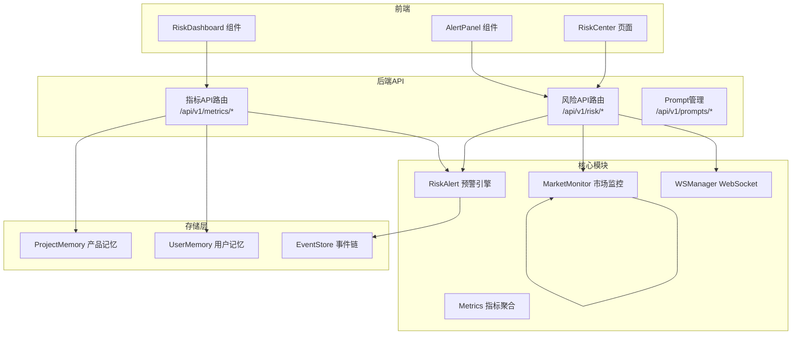
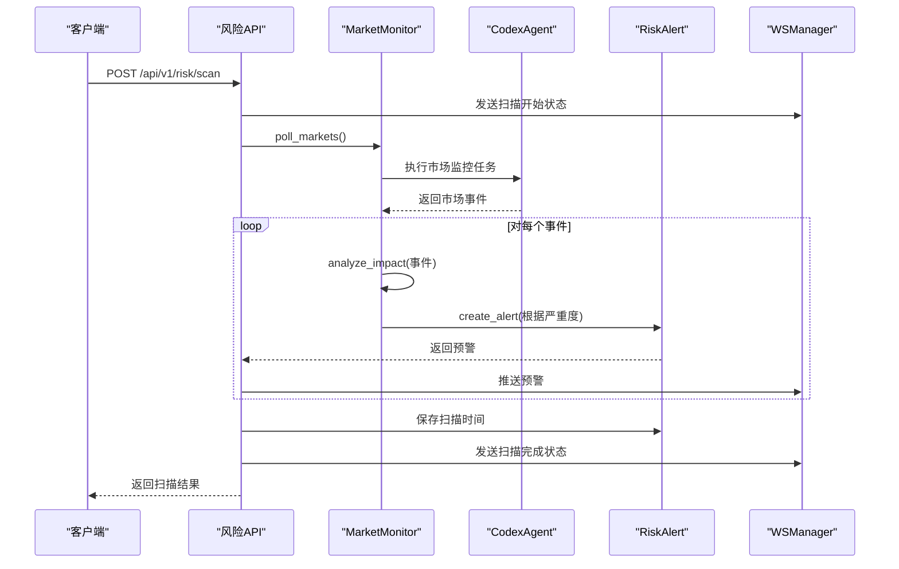
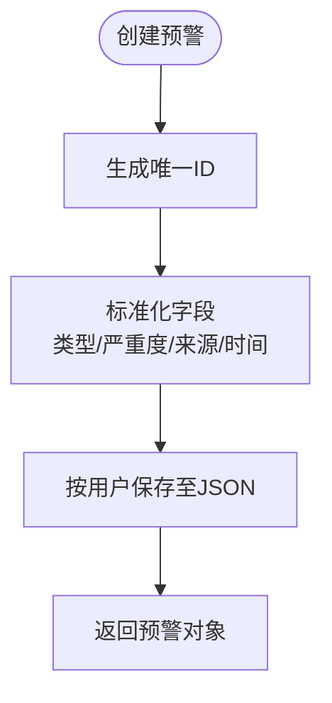
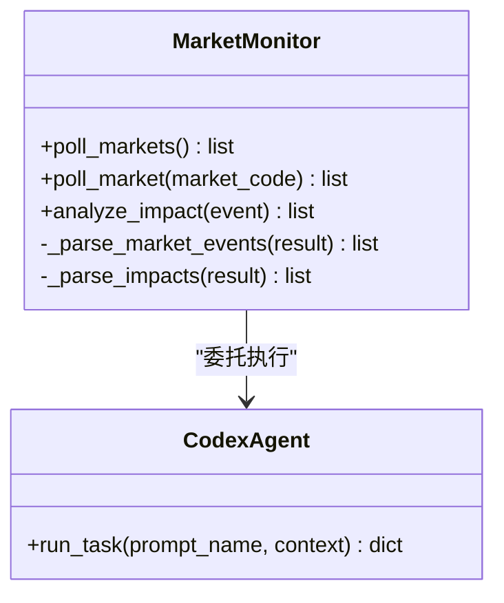
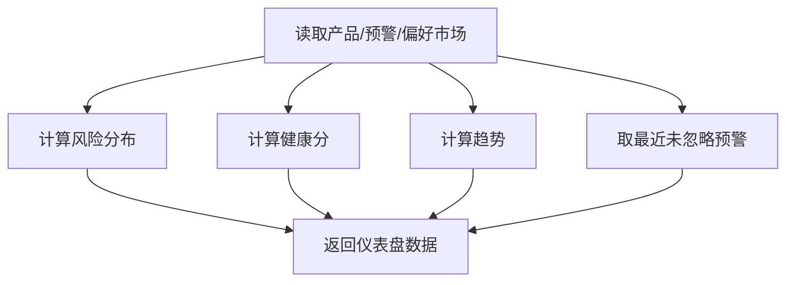
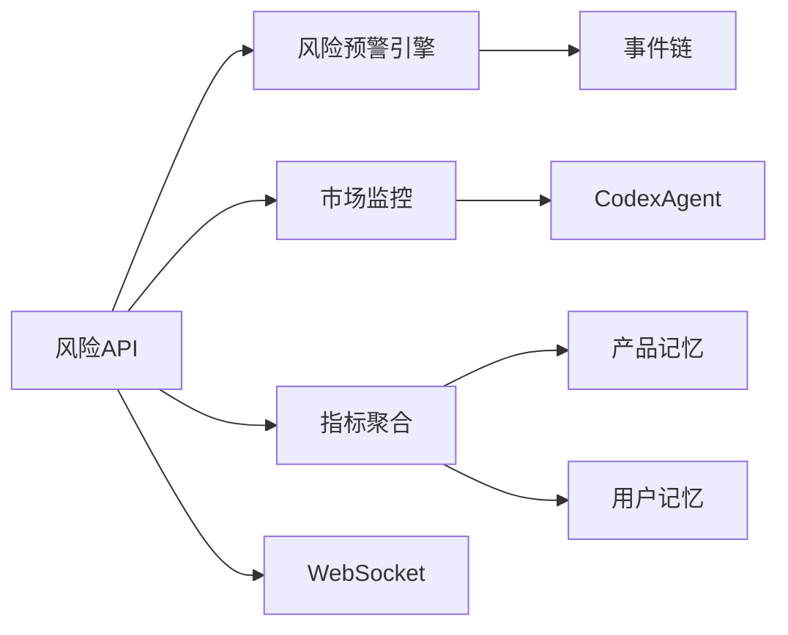

# 风险监控API

<cite>
**本文档引用的文件**
- [backend/app/api/risk.py](file://backend/app/api/risk.py)
- [backend/app/core/risk_alert.py](file://backend/app/core/risk_alert.py)
- [backend/app/core/metrics.py](file://backend/app/core/metrics.py)
- [backend/app/core/market_monitor.py](file://backend/app/core/market_monitor.py)
- [backend/app/services/ws_manager.py](file://backend/app/services/ws_manager.py)
- [backend/app/storage/event_store.py](file://backend/app/storage/event_store.py)
- [backend/app/storage/project_memory.py](file://backend/app/storage/project_memory.py)
- [backend/app/storage/user_memory.py](file://backend/app/storage/user_memory.py)
- [backend/app/models/schemas.py](file://backend/app/models/schemas.py)
- [backend/data/prompts/risk_summary.yaml](file://backend/data/prompts/risk_summary.yaml)
- [backend/app/config.py](file://backend/app/config.py)
- [frontend/src/pages/RiskCenter.tsx](file://frontend/src/pages/RiskCenter.tsx)
- [frontend/src/components/RiskDashboard.tsx](file://frontend/src/components/RiskDashboard.tsx)
- [frontend/src/components/AlertPanel.tsx](file://frontend/src/components/AlertPanel.tsx)
- [frontend/src/types/index.ts](file://frontend/src/types/index.ts)
</cite>

## 目录
1. [简介](#简介)
2. [项目结构](#项目结构)
3. [核心组件](#核心组件)
4. [架构总览](#架构总览)
5. [详细组件分析](#详细组件分析)
6. [依赖分析](#依赖分析)
7. [性能考虑](#性能考虑)
8. [故障排查指南](#故障排查指南)
9. [结论](#结论)
10. [附录](#附录)

## 简介
本文件为“风险监控API”的权威技术文档，覆盖风险评估、风险预警、风险统计与仪表盘等监控相关接口。文档详细说明了风险评分算法、风险等级判断、风险趋势分析、风险数据采集与存储机制，并给出阈值设置、预警触发条件与风险报告生成的实现要点。同时提供数据模型与指标定义、最佳实践与异常处理说明，以及完整的API使用示例与风险评估示例。

## 项目结构
后端采用FastAPI框架，按功能分层组织：
- API路由层：对外暴露REST接口，位于app/api
- 核心业务层：风险预警引擎、市场监控、指标聚合等，位于app/core
- 服务层：WebSocket管理、Codex代理等，位于app/services
- 存储层：多层内存/磁盘存储，位于app/storage
- 前端：React组件与页面，位于frontend/src

图表来源
- [backend/app/api/risk.py:1-154](file://backend/app/api/risk.py#L1-L154)
- [backend/app/core/market_monitor.py:1-156](file://backend/app/core/market_monitor.py#L1-L156)
- [backend/app/core/risk_alert.py:1-181](file://backend/app/core/risk_alert.py#L1-L181)
- [backend/app/core/metrics.py:1-176](file://backend/app/core/metrics.py#L1-L176)
- [backend/app/services/ws_manager.py:1-95](file://backend/app/services/ws_manager.py#L1-L95)
- [backend/app/storage/project_memory.py:1-141](file://backend/app/storage/project_memory.py#L1-L141)
- [backend/app/storage/user_memory.py:1-84](file://backend/app/storage/user_memory.py#L1-L84)
- [backend/app/storage/event_store.py:1-269](file://backend/app/storage/event_store.py#L1-L269)

章节来源
- [backend/app/api/risk.py:1-154](file://backend/app/api/risk.py#L1-L154)
- [backend/app/core/market_monitor.py:1-156](file://backend/app/core/market_monitor.py#L1-L156)
- [backend/app/core/risk_alert.py:1-181](file://backend/app/core/risk_alert.py#L1-L181)
- [backend/app/core/metrics.py:1-176](file://backend/app/core/metrics.py#L1-L176)
- [backend/app/services/ws_manager.py:1-95](file://backend/app/services/ws_manager.py#L1-L95)
- [backend/app/storage/project_memory.py:1-141](file://backend/app/storage/project_memory.py#L1-L141)
- [backend/app/storage/user_memory.py:1-84](file://backend/app/storage/user_memory.py#L1-L84)
- [backend/app/storage/event_store.py:1-269](file://backend/app/storage/event_store.py#L1-L269)

## 核心组件
- 风险API路由：提供预警列表、未读数、忽略预警、手动扫描、市场状态、仪表盘、Prompt热加载等接口
- 风险预警引擎：负责预警创建、持久化、查询、忽略、扫描时间记录
- 市场监控：委托Codex Agent进行联网搜索与事件解析，产出市场事件并进行影响分析
- 指标聚合：基于用户产品、预警与偏好市场计算风险分布、健康分、趋势等
- WebSocket管理：实时推送预警与扫描状态
- 存储层：产品记忆、用户记忆、事件链等多层数据存储

章节来源
- [backend/app/api/risk.py:20-154](file://backend/app/api/risk.py#L20-L154)
- [backend/app/core/risk_alert.py:32-181](file://backend/app/core/risk_alert.py#L32-L181)
- [backend/app/core/market_monitor.py:24-156](file://backend/app/core/market_monitor.py#L24-L156)
- [backend/app/core/metrics.py:20-176](file://backend/app/core/metrics.py#L20-L176)
- [backend/app/services/ws_manager.py:20-95](file://backend/app/services/ws_manager.py#L20-L95)

## 架构总览
风险监控系统通过“市场扫描—影响分析—预警生成—实时推送—仪表盘聚合”的闭环工作流，实现自动化风险监控与可视化。

图表来源
- [backend/app/api/risk.py:63-108](file://backend/app/api/risk.py#L63-L108)
- [backend/app/core/market_monitor.py:35-105](file://backend/app/core/market_monitor.py#L35-L105)
- [backend/app/core/risk_alert.py:32-82](file://backend/app/core/risk_alert.py#L32-L82)
- [backend/app/services/ws_manager.py:70-83](file://backend/app/services/ws_manager.py#L70-L83)

## 详细组件分析

### 风险API路由与接口
- 预警列表：支持按类型、严重度筛选与分页
- 未读预警数：统计未忽略预警数量
- 忽略预警：将指定预警标记为已忽略
- 手动触发扫描：调用市场监控，生成影响分析，创建预警并推送
- 市场监控状态：聚合各市场预警数与最近扫描时间
- 仪表盘：返回用户合规健康分、风险分布、最近预警、活跃市场、趋势
- Prompt热加载：重新加载Prompt模板

章节来源
- [backend/app/api/risk.py:25-154](file://backend/app/api/risk.py#L25-L154)

### 风险预警引擎
- 数据存储：按用户隔离，存储在data/risk_alerts/{user_id}/alerts.json
- 预警创建：生成唯一ID、标准化字段、写入用户收件箱
- 查询与筛选：支持类型、严重度过滤与分页
- 忽略与未读统计：标记dismissed并统计未读数
- 扫描时间：记录最近扫描时间

图表来源
- [backend/app/core/risk_alert.py:32-82](file://backend/app/core/risk_alert.py#L32-L82)
- [backend/app/core/risk_alert.py:165-181](file://backend/app/core/risk_alert.py#L165-L181)

章节来源
- [backend/app/core/risk_alert.py:32-181](file://backend/app/core/risk_alert.py#L32-L181)

### 市场监控与影响分析
- 委托Codex Agent执行联网搜索与事件解析
- 规范化事件字段，支持单市场或多市场返回
- 影响分析：读取用户产品列表，评估受影响产品
- 事件写入：可扩展至事件链存储

图表来源
- [backend/app/core/market_monitor.py:24-156](file://backend/app/core/market_monitor.py#L24-L156)

章节来源
- [backend/app/core/market_monitor.py:35-156](file://backend/app/core/market_monitor.py#L35-L156)

### 指标聚合与仪表盘
- 数据来源：产品记忆、用户偏好市场、风险预警
- 指标计算：
  - 风险分布：按严重度统计未忽略预警
  - 健康分：基础100分，扣分项包括高风险产品、无HS编码、待处理高危预警；近7天合规检查加分
  - 趋势：近30天每日合规检查次数
  - 最近预警：取未忽略预警TopN
- 返回结构：总产品数、风险分布、最近预警、活跃市场、健康分、趋势

图表来源
- [backend/app/core/metrics.py:20-176](file://backend/app/core/metrics.py#L20-L176)

章节来源
- [backend/app/core/metrics.py:20-176](file://backend/app/core/metrics.py#L20-L176)

### WebSocket实时推送
- 管理用户到WebSocket连接集合
- 支持推送预警与扫描状态更新
- 断线自动清理

章节来源
- [backend/app/services/ws_manager.py:20-95](file://backend/app/services/ws_manager.py#L20-L95)

### 存储层
- 产品记忆：按产品ID存储合规检查历史
- 用户记忆：存储用户画像与偏好市场
- 事件链：系统事件与用户操作事件的统一存储

章节来源
- [backend/app/storage/project_memory.py:20-141](file://backend/app/storage/project_memory.py#L20-L141)
- [backend/app/storage/user_memory.py:18-84](file://backend/app/storage/user_memory.py#L18-L84)
- [backend/app/storage/event_store.py:59-269](file://backend/app/storage/event_store.py#L59-L269)

### 数据模型与指标定义
- 风险预警模型：包含类型、严重度、受影响产品/市场、来源、URL、创建时间、忽略状态等
- 仪表盘数据模型：总产品数、风险分布、最近预警、活跃市场、健康分、趋势
- 合规检查结果模型：包含HS编码、VAT率、认证、风险等级、风险分、风险提示、整改建议等

章节来源
- [backend/app/models/schemas.py:225-264](file://backend/app/models/schemas.py#L225-L264)
- [frontend/src/types/index.ts:225-277](file://frontend/src/types/index.ts#L225-L277)

## 依赖分析
- 风险API依赖风险预警引擎、市场监控、指标聚合与WebSocket管理
- 市场监控依赖CodexAgent
- 指标聚合依赖产品记忆、用户记忆与风险预警
- 存储层相互独立，通过文件系统隔离

图表来源
- [backend/app/api/risk.py:6-18](file://backend/app/api/risk.py#L6-L18)
- [backend/app/core/market_monitor.py:19-33](file://backend/app/core/market_monitor.py#L19-L33)
- [backend/app/core/metrics.py:10-17](file://backend/app/core/metrics.py#L10-L17)
- [backend/app/core/risk_alert.py:17-19](file://backend/app/core/risk_alert.py#L17-L19)

章节来源
- [backend/app/api/risk.py:6-18](file://backend/app/api/risk.py#L6-L18)
- [backend/app/core/market_monitor.py:19-33](file://backend/app/core/market_monitor.py#L19-L33)
- [backend/app/core/metrics.py:10-17](file://backend/app/core/metrics.py#L10-L17)
- [backend/app/core/risk_alert.py:17-19](file://backend/app/core/risk_alert.py#L17-L19)

## 性能考虑
- 文件I/O优化：预警列表读取与写入采用临时文件+原子替换，避免并发写冲突
- 分页与筛选：后端对预警列表进行分页与筛选，减少前端负担
- 指标聚合：纯读取聚合，避免重复计算；趋势按日期窗口滑动统计
- WebSocket：批量推送时捕获异常并清理失效连接
- 前端：仪表盘与预警面板懒加载，避免阻塞渲染

## 故障排查指南
- 扫描失败：检查CodexAgent可用性与网络连通性；查看API错误响应与日志
- 预警未显示：确认WebSocket连接状态；检查用户ID与收件箱文件是否存在
- 仪表盘为空：确认产品记忆与用户记忆文件存在且可读
- 未读数不正确：检查dismissed字段更新逻辑与文件写入一致性

章节来源
- [backend/app/api/risk.py:105-107](file://backend/app/api/risk.py#L105-L107)
- [backend/app/core/risk_alert.py:110-115](file://backend/app/core/risk_alert.py#L110-L115)
- [backend/app/services/ws_manager.py:55-63](file://backend/app/services/ws_manager.py#L55-L63)

## 结论
该风险监控API通过清晰的分层架构与稳健的数据流，实现了从市场扫描到预警生成、实时推送与仪表盘可视化的完整闭环。其指标聚合与健康分算法为用户提供直观的风险态势感知，适合在跨境合规场景中部署与扩展。

## 附录

### API参考与使用示例

- 获取预警列表
  - 方法：GET
  - 路径：/api/v1/risk/alerts
  - 参数：user_id（默认"default"）、alert_type、severity、page、size
  - 示例：[backend/app/api/risk.py:25-38](file://backend/app/api/risk.py#L25-L38)

- 未读预警数
  - 方法：GET
  - 路径：/api/v1/risk/alerts/unread-count
  - 示例：[backend/app/api/risk.py:41-46](file://backend/app/api/risk.py#L41-L46)

- 忽略预警
  - 方法：POST
  - 路径：/api/v1/risk/alerts/{alert_id}/dismiss
  - 示例：[backend/app/api/risk.py:49-58](file://backend/app/api/risk.py#L49-L58)

- 手动触发市场扫描
  - 方法：POST
  - 路径：/api/v1/risk/scan
  - 示例：[backend/app/api/risk.py:63-108](file://backend/app/api/risk.py#L63-L108)

- 市场监控状态
  - 方法：GET
  - 路径：/api/v1/risk/market-status
  - 示例：[backend/app/api/risk.py:110-126](file://backend/app/api/risk.py#L110-L126)

- 用户仪表盘
  - 方法：GET
  - 路径：/api/v1/metrics/dashboard
  - 示例：[backend/app/api/risk.py:131-136](file://backend/app/api/risk.py#L131-L136)

- Prompt热加载
  - 方法：POST
  - 路径：/api/v1/prompts/reload
  - 示例：[backend/app/api/risk.py:141-153](file://backend/app/api/risk.py#L141-L153)

### 风险评分与等级判断
- 风险评分算法（规则引擎）：基于HS编码、认证缺失、风险提示、物流提示与产品关键词累加，范围0-100
- 风险等级映射：≥70高风险，≥40中等，否则低风险
- 仪表盘健康分：基础100分，结合高风险产品、无HS编码、待处理高危预警与近期合规检查进行增减

章节来源
- [backend/app/core/risk_alert.py:32-82](file://backend/app/core/risk_alert.py#L32-L82)
- [backend/app/core/metrics.py:112-143](file://backend/app/core/metrics.py#L112-L143)

### 风险阈值与预警触发条件
- 预警触发：市场事件包含变更且严重度为“critical”或“high”时创建“regulation_change”，否则“market_hotspot”
- 严重度：low/medium/high/critical
- 影响分析：基于Codex对用户产品列表的评估结果

章节来源
- [backend/app/api/risk.py:83-94](file://backend/app/api/risk.py#L83-L94)
- [backend/app/core/market_monitor.py:69-104](file://backend/app/core/market_monitor.py#L69-L104)

### 风险报告生成
- Prompt模板：风险摘要（risk_summary.yaml），用于生成面向用户的自然语言风险概况
- 生成内容：总体风险水平、最紧急事项、建议关注市场

章节来源
- [backend/data/prompts/risk_summary.yaml:1-16](file://backend/data/prompts/risk_summary.yaml#L1-L16)

### 前端集成示例
- 风险中心页面：加载预警、未读数、市场状态，支持手动扫描与忽略
- 风险仪表盘：展示健康分、产品数、活跃市场与风险分布
- 预警面板：展示未读预警并支持忽略

章节来源
- [frontend/src/pages/RiskCenter.tsx:19-90](file://frontend/src/pages/RiskCenter.tsx#L19-L90)
- [frontend/src/components/RiskDashboard.tsx:10-96](file://frontend/src/components/RiskDashboard.tsx#L10-L96)
- [frontend/src/components/AlertPanel.tsx:26-166](file://frontend/src/components/AlertPanel.tsx#L26-L166)
- [frontend/src/types/index.ts:225-277](file://frontend/src/types/index.ts#L225-L277)