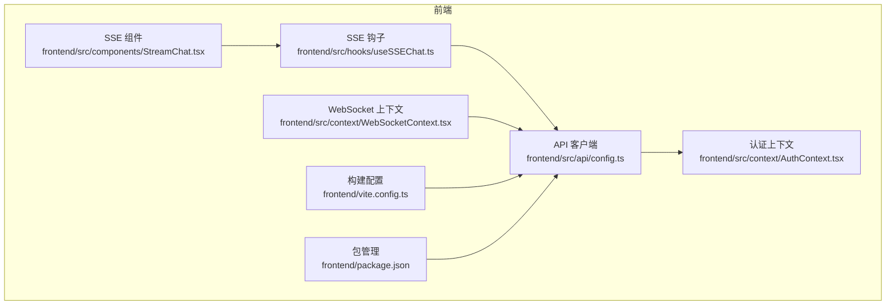
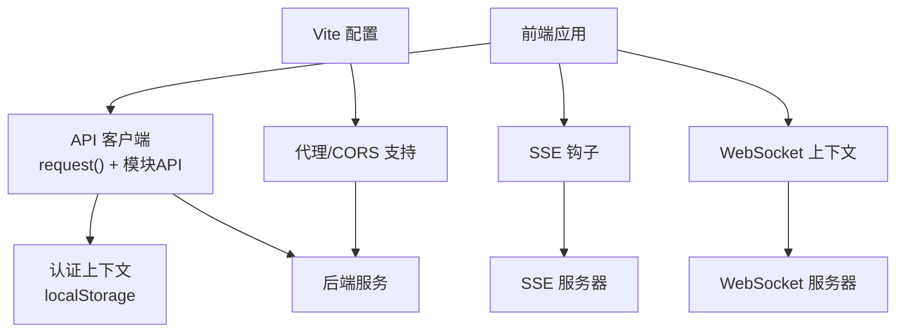
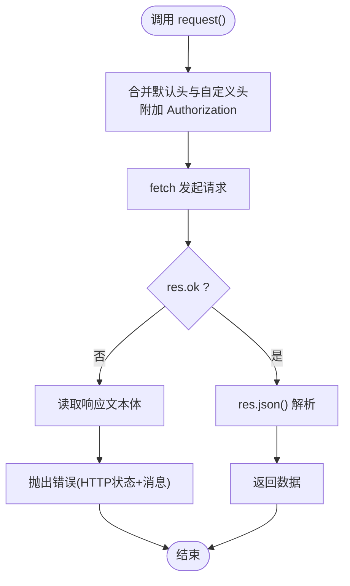
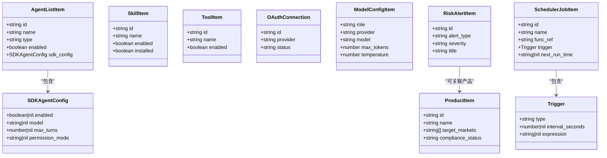
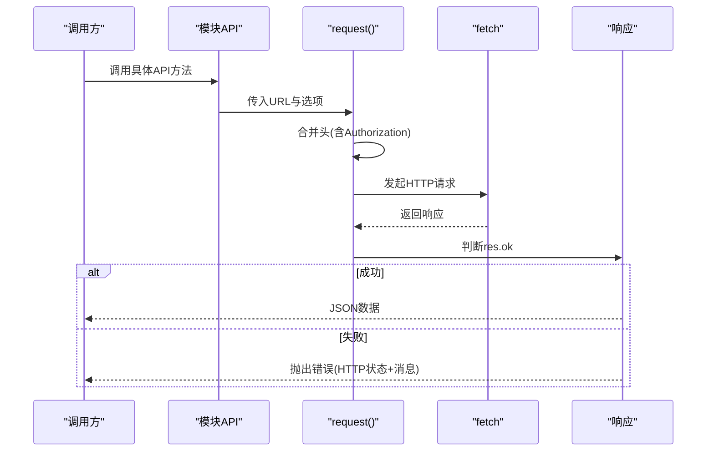
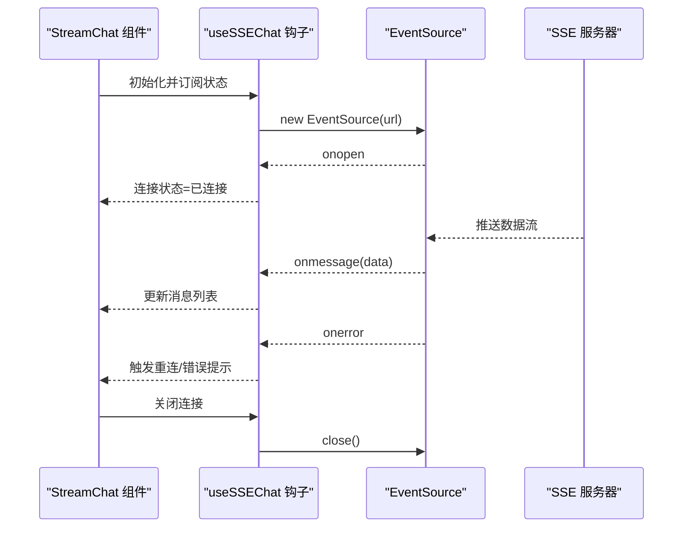
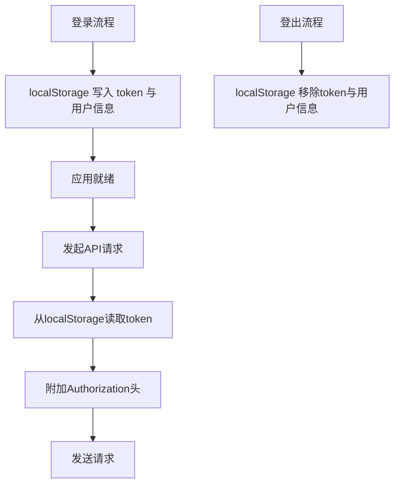
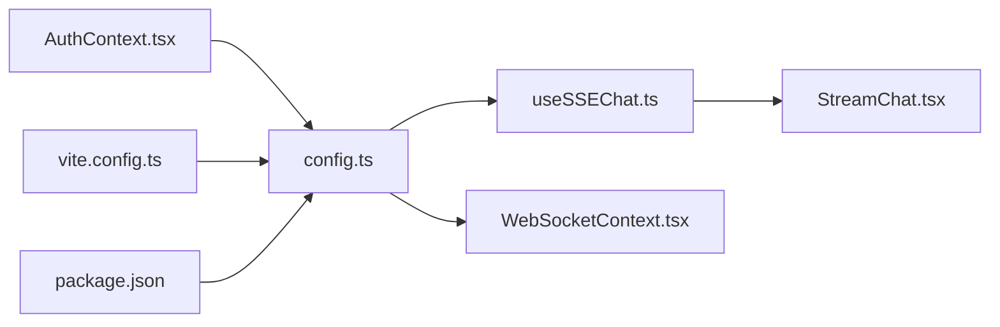

# API客户端集成

<cite>
**本文引用的文件**
- [config.ts](file://frontend/src/api/config.ts)
- [AuthContext.tsx](file://frontend/src/context/AuthContext.tsx)
- [useSSEChat.ts](file://frontend/src/hooks/useSSEChat.ts)
- [StreamChat.tsx](file://frontend/src/components/StreamChat.tsx)
- [WebSocketContext.tsx](file://frontend/src/context/WebSocketContext.tsx)
- [vite.config.ts](file://frontend/vite.config.ts)
- [package.json](file://frontend/package.json)
- [后端api.md](file://后端api.md)
- [前后端api交互.md](file://前后端api交互.md)
</cite>

## 目录
1. [简介](#简介)
2. [项目结构](#项目结构)
3. [核心组件](#核心组件)
4. [架构总览](#架构总览)
5. [详细组件分析](#详细组件分析)
6. [依赖关系分析](#依赖关系分析)
7. [性能考虑](#性能考虑)
8. [故障排除指南](#故障排除指南)
9. [结论](#结论)
10. [附录](#附录)

## 简介
本文件面向避风港平台前端团队，提供完整的API客户端集成文档。内容覆盖API配置设计、请求拦截与响应处理、HTTP客户端统一配置、错误处理策略与重试机制、SSE（服务器发送事件）实现与实时数据流管理、认证令牌管理、CORS与跨域处理、最佳实践与性能优化、错误边界与网络异常恢复、用户体验优化等。目标是帮助开发者从基础HTTP请求到复杂实时通信，构建稳定可靠的API集成方案。

## 项目结构
前端采用模块化组织，API客户端集中于API目录，认证上下文在context目录，SSE钩子与组件位于hooks与components目录，构建配置在vite.config.ts中。

**图表来源**
- [config.ts:1-635](file://frontend/src/api/config.ts#L1-L635)
- [AuthContext.tsx:1-120](file://frontend/src/context/AuthContext.tsx#L1-L120)
- [useSSEChat.ts:1-200](file://frontend/src/hooks/useSSEChat.ts#L1-L200)
- [StreamChat.tsx:1-300](file://frontend/src/components/StreamChat.tsx#L1-L300)
- [WebSocketContext.tsx:1-200](file://frontend/src/context/WebSocketContext.tsx#L1-L200)
- [vite.config.ts:1-200](file://frontend/vite.config.ts#L1-L200)
- [package.json:1-200](file://frontend/package.json#L1-L200)

**章节来源**
- [config.ts:1-635](file://frontend/src/api/config.ts#L1-L635)
- [AuthContext.tsx:1-120](file://frontend/src/context/AuthContext.tsx#L1-L120)
- [useSSEChat.ts:1-200](file://frontend/src/hooks/useSSEChat.ts#L1-L200)
- [StreamChat.tsx:1-300](file://frontend/src/components/StreamChat.tsx#L1-L300)
- [WebSocketContext.tsx:1-200](file://frontend/src/context/WebSocketContext.tsx#L1-L200)
- [vite.config.ts:1-200](file://frontend/vite.config.ts#L1-L200)
- [package.json:1-200](file://frontend/package.json#L1-L200)

## 核心组件
- API客户端封装：统一的请求方法与错误处理，自动注入认证头，支持多种业务模块API。
- 认证上下文：负责token与用户信息的本地存储、恢复与清理。
- SSE钩子与组件：封装SSE连接、事件解析与渲染。
- WebSocket上下文：提供WebSocket连接管理与事件分发。
- 构建配置：代理与CORS相关设置，保障开发环境下的跨域访问。

**章节来源**
- [config.ts:12-30](file://frontend/src/api/config.ts#L12-L30)
- [AuthContext.tsx:20-75](file://frontend/src/context/AuthContext.tsx#L20-L75)
- [useSSEChat.ts:1-200](file://frontend/src/hooks/useSSEChat.ts#L1-L200)
- [StreamChat.tsx:1-300](file://frontend/src/components/StreamChat.tsx#L1-L300)
- [WebSocketContext.tsx:1-200](file://frontend/src/context/WebSocketContext.tsx#L1-L200)
- [vite.config.ts:1-200](file://frontend/vite.config.ts#L1-L200)

## 架构总览
API客户端以单一入口封装所有后端接口，通过统一的请求方法进行HTTP调用，并在请求前自动附加认证头。认证状态由上下文管理，SSE与WebSocket分别处理实时数据流与双向通信。构建工具提供开发期代理与CORS支持。

**图表来源**
- [config.ts:12-30](file://frontend/src/api/config.ts#L12-L30)
- [AuthContext.tsx:20-75](file://frontend/src/context/AuthContext.tsx#L20-L75)
- [useSSEChat.ts:1-200](file://frontend/src/hooks/useSSEChat.ts#L1-L200)
- [StreamChat.tsx:1-300](file://frontend/src/components/StreamChat.tsx#L1-L300)
- [WebSocketContext.tsx:1-200](file://frontend/src/context/WebSocketContext.tsx#L1-L200)
- [vite.config.ts:1-200](file://frontend/vite.config.ts#L1-L200)

## 详细组件分析

### API配置与请求拦截器
- 请求拦截器：在请求发起前合并默认头与自定义头，自动从localStorage读取token并添加到Authorization头。
- 错误处理：当响应非OK时，读取文本体并抛出包含HTTP状态码与消息的错误；成功路径统一解析JSON。
- 统一配置：使用常量作为API前缀，便于迁移与维护。

**图表来源**
- [config.ts:12-30](file://frontend/src/api/config.ts#L12-L30)

**章节来源**
- [config.ts:12-30](file://frontend/src/api/config.ts#L12-L30)

### 响应处理与数据模型
- 数据模型：为Agent、Skills、Tools、OAuth、模型配置、产品、流水线、风险预警、记忆树、CLI、知识库、主动引擎、定时任务等模块定义了对应的接口类型，确保类型安全与文档化。
- 响应解析：每个模块API返回Promise<T>，调用方通过try/catch处理错误，避免未捕获异常导致崩溃。

**图表来源**
- [config.ts:34-633](file://frontend/src/api/config.ts#L34-L633)

**章节来源**
- [config.ts:34-633](file://frontend/src/api/config.ts#L34-L633)

### HTTP客户端统一配置与错误策略
- 统一请求方法：集中处理头注入、错误抛出与JSON解析，降低重复代码与提升一致性。
- 错误策略：非OK响应统一转换为错误对象，便于上层统一处理；成功路径返回解析后的JSON。
- 参数化查询：多处API支持URLSearchParams拼接查询参数，保证REST风格与兼容性。

**图表来源**
- [config.ts:20-30](file://frontend/src/api/config.ts#L20-L30)

**章节来源**
- [config.ts:20-30](file://frontend/src/api/config.ts#L20-L30)

### 重试机制
- 当前实现：未内置自动重试逻辑。建议在调用方或更高层封装统一的重试策略（指数退避、最大重试次数、仅对特定错误类型重试）。
- 实施要点：区分网络错误与业务错误；对幂等操作（GET/DELETE）更安全；结合节流与去抖避免风暴。

[本节为通用指导，不直接分析具体文件，故无“章节来源”]

### SSE（服务器发送事件）实现
- 连接管理：SSE钩子负责建立EventSource连接、处理open/message/error事件、断线重连与关闭清理。
- 实时数据流：将服务端推送的数据流解析为消息片段，供组件渲染与用户交互。
- 组件集成：StreamChat组件消费钩子提供的状态与消息，实现聊天界面的实时展示。

**图表来源**
- [useSSEChat.ts:1-200](file://frontend/src/hooks/useSSEChat.ts#L1-L200)
- [StreamChat.tsx:1-300](file://frontend/src/components/StreamChat.tsx#L1-L300)

**章节来源**
- [useSSEChat.ts:1-200](file://frontend/src/hooks/useSSEChat.ts#L1-L200)
- [StreamChat.tsx:1-300](file://frontend/src/components/StreamChat.tsx#L1-L300)

### 认证令牌管理
- 令牌存储：登录成功后写入localStorage中的token与用户信息；登出时移除。
- 自动注入：请求拦截器从localStorage读取token并附加到Authorization头。
- 生命周期：应用启动时尝试从localStorage恢复认证状态，确保刷新后仍保持登录态。

**图表来源**
- [AuthContext.tsx:20-75](file://frontend/src/context/AuthContext.tsx#L20-L75)
- [config.ts:12-18](file://frontend/src/api/config.ts#L12-L18)

**章节来源**
- [AuthContext.tsx:20-75](file://frontend/src/context/AuthContext.tsx#L20-L75)
- [config.ts:12-18](file://frontend/src/api/config.ts#L12-L18)

### CORS配置与跨域处理
- 开发环境代理：Vite配置提供代理能力，可将/api/v1前缀转发至后端，避免浏览器同源限制。
- 生产环境CORS：需确保后端正确设置Access-Control-Allow-Origin、允许的方法与头，以及凭据传递策略。
- 安全建议：生产环境仅允许受信域名，最小化暴露的头字段与方法。

**章节来源**
- [vite.config.ts:1-200](file://frontend/vite.config.ts#L1-L200)
- [后端api.md:1-200](file://后端api.md#L1-L200)
- [前后端api交互.md:1-200](file://前后端api交互.md#L1-L200)

### 最佳实践与性能优化
- 请求层
  - 使用统一的request()方法，避免分散的fetch调用。
  - 对GET请求启用浏览器缓存策略，减少重复请求。
  - 对长列表与分页接口使用分页参数，避免一次性加载过多数据。
- 错误处理
  - 在调用方捕获并分类错误（网络、业务、认证），提供用户友好的提示。
  - 对可恢复的网络错误实施指数退避重试。
- SSE
  - 合理设置重连间隔与最大重试次数，避免资源浪费。
  - 对消息进行去重与顺序校验，保证显示一致性。
- 缓存策略
  - 对静态配置类数据（如模型配置、技能列表）启用短期缓存。
  - 对用户会话相关数据避免缓存，确保实时性。
- 性能优化
  - 合理拆分请求，避免阻塞主线程。
  - 使用虚拟滚动渲染长列表。
  - 控制并发请求数量，避免拥塞。

[本节为通用指导，不直接分析具体文件，故无“章节来源”]

### 错误边界处理与网络异常恢复
- 错误边界：在UI层包裹错误边界组件，捕获并展示错误，提供重试按钮与返回入口。
- 网络异常：检测离线状态，提供离线提示与本地兜底数据；在线后自动同步。
- 用户体验：在加载与错误状态下提供明确的反馈与进度指示，避免用户困惑。

[本节为通用指导，不直接分析具体文件，故无“章节来源”]

## 依赖关系分析
API客户端与认证上下文存在直接依赖，SSE钩子与组件依赖API客户端进行数据拉取与状态管理，WebSocket上下文独立于API但同样依赖认证上下文的状态。

**图表来源**
- [config.ts:1-635](file://frontend/src/api/config.ts#L1-L635)
- [AuthContext.tsx:1-120](file://frontend/src/context/AuthContext.tsx#L1-L120)
- [useSSEChat.ts:1-200](file://frontend/src/hooks/useSSEChat.ts#L1-L200)
- [StreamChat.tsx:1-300](file://frontend/src/components/StreamChat.tsx#L1-L300)
- [WebSocketContext.tsx:1-200](file://frontend/src/context/WebSocketContext.tsx#L1-L200)
- [vite.config.ts:1-200](file://frontend/vite.config.ts#L1-L200)
- [package.json:1-200](file://frontend/package.json#L1-L200)

**章节来源**
- [config.ts:1-635](file://frontend/src/api/config.ts#L1-L635)
- [AuthContext.tsx:1-120](file://frontend/src/context/AuthContext.tsx#L1-L120)
- [useSSEChat.ts:1-200](file://frontend/src/hooks/useSSEChat.ts#L1-L200)
- [StreamChat.tsx:1-300](file://frontend/src/components/StreamChat.tsx#L1-L300)
- [WebSocketContext.tsx:1-200](file://frontend/src/context/WebSocketContext.tsx#L1-L200)
- [vite.config.ts:1-200](file://frontend/vite.config.ts#L1-L200)
- [package.json:1-200](file://frontend/package.json#L1-L200)

## 性能考虑
- 请求批量化：对多个小请求进行合并或延迟批量提交，减少RTT。
- 数据压缩：后端开启Gzip/Brotli，前端合理设置Accept-Encoding。
- CDN与静态资源：将图片、字体等静态资源走CDN，减轻主站压力。
- 防抖与节流：对高频输入（搜索、滚动）使用防抖/节流，降低请求频率。
- 预加载与预连接：对关键路由与API进行预连接与预加载，缩短首屏时间。

[本节为通用指导，不直接分析具体文件，故无“章节来源”]

## 故障排除指南
- 401/403认证失败
  - 检查localStorage中的token是否存在且未过期。
  - 确认请求头是否正确附加Authorization。
- 404资源不存在
  - 核对API路径与参数，确认后端路由与版本号一致。
- 5xx服务器错误
  - 查看后端日志定位问题；前端记录请求详情与时间戳以便排查。
- CORS跨域失败
  - 检查Vite代理配置与后端CORS头设置，确保Origin与方法匹配。
- SSE连接异常
  - 检查EventSource连接状态与重连逻辑；确认服务端SSE实现与心跳策略。

**章节来源**
- [config.ts:12-30](file://frontend/src/api/config.ts#L12-L30)
- [AuthContext.tsx:20-75](file://frontend/src/context/AuthContext.tsx#L20-L75)
- [useSSEChat.ts:1-200](file://frontend/src/hooks/useSSEChat.ts#L1-L200)
- [vite.config.ts:1-200](file://frontend/vite.config.ts#L1-L200)
- [后端api.md:1-200](file://后端api.md#L1-L200)
- [前后端api交互.md:1-200](file://前后端api交互.md#L1-L200)

## 结论
本文档提供了避风港平台前端API客户端集成的完整方案，涵盖配置设计、请求拦截与响应处理、认证令牌管理、SSE实时通信、CORS与跨域处理、错误处理与重试策略、最佳实践与性能优化。通过统一的API客户端与清晰的模块划分，能够有效提升开发效率与系统稳定性，同时为复杂实时通信场景提供可靠支撑。

## 附录
- 参考后端API文档与前后端交互约定，确保接口一致性与版本兼容。
- 在生产环境中强化CORS与安全头配置，定期审计权限与访问日志。

**章节来源**
- [后端api.md:1-200](file://后端api.md#L1-L200)
- [前后端api交互.md:1-200](file://前后端api交互.md#L1-L200)