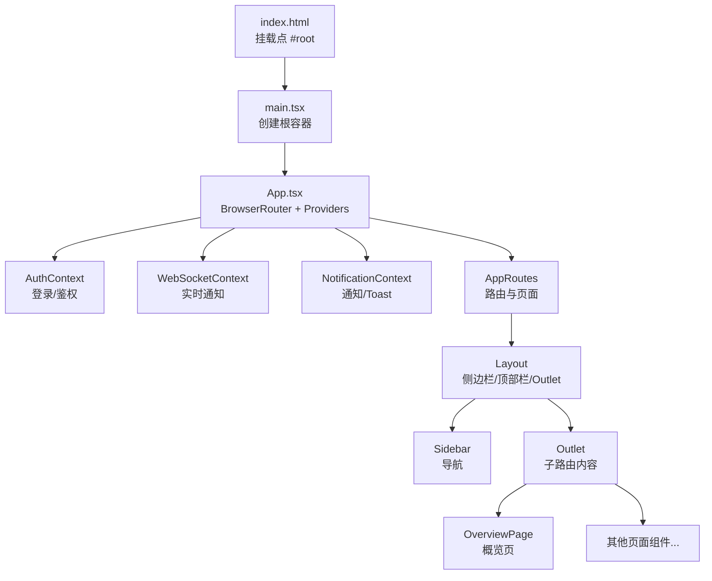
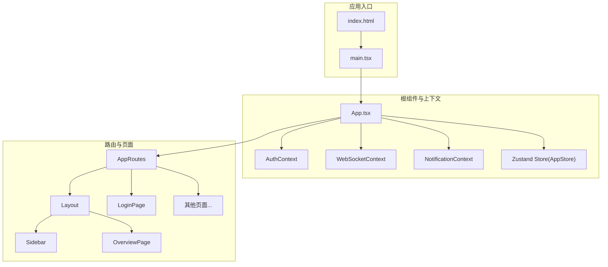
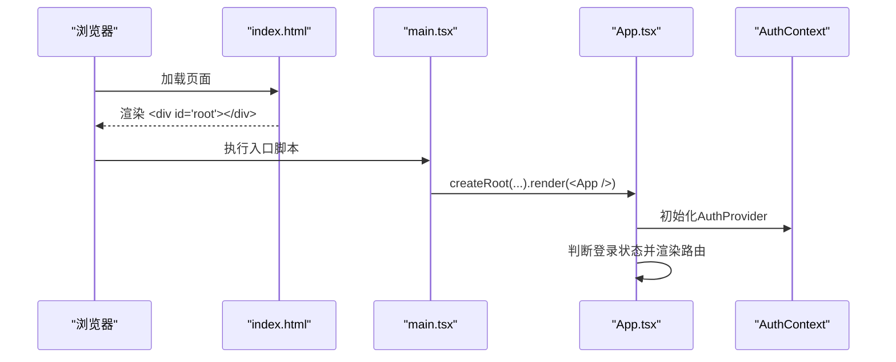
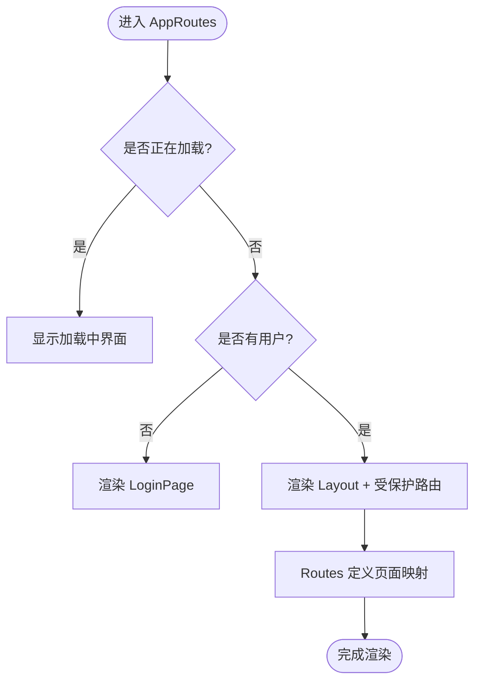
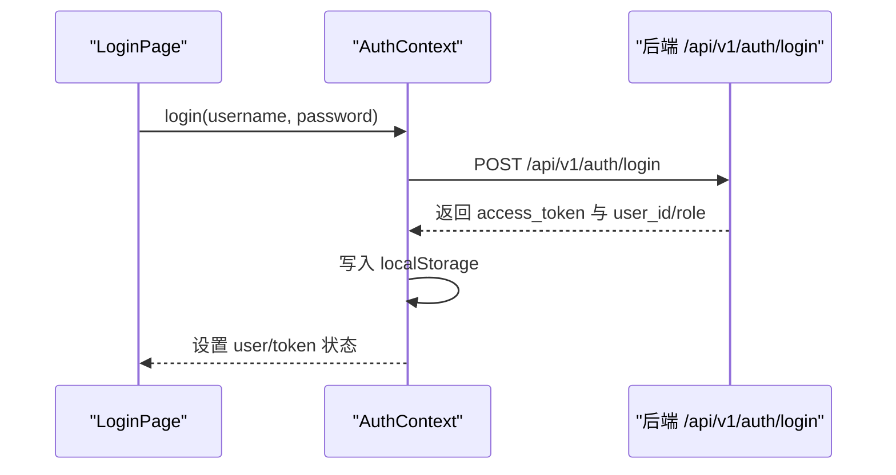
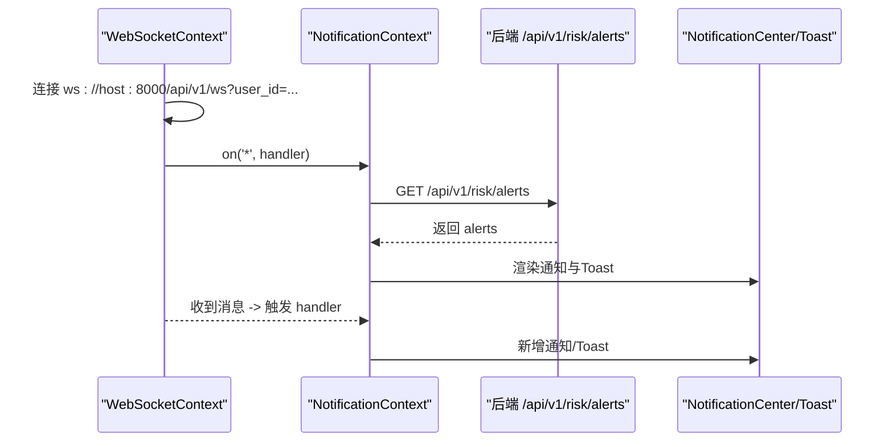
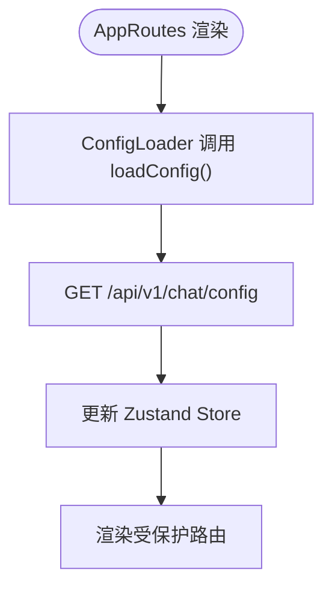
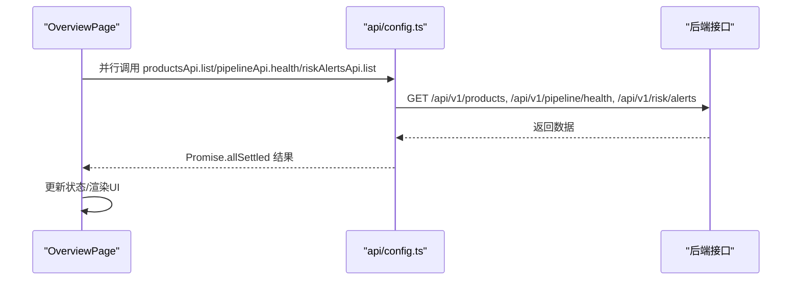
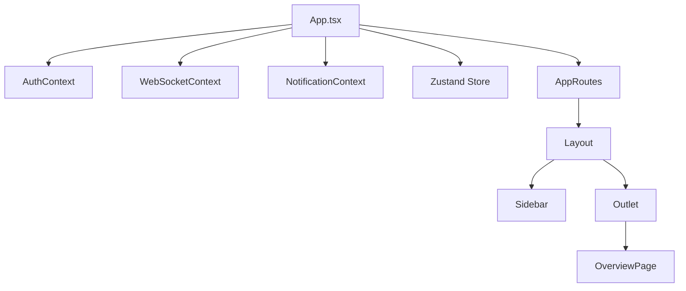
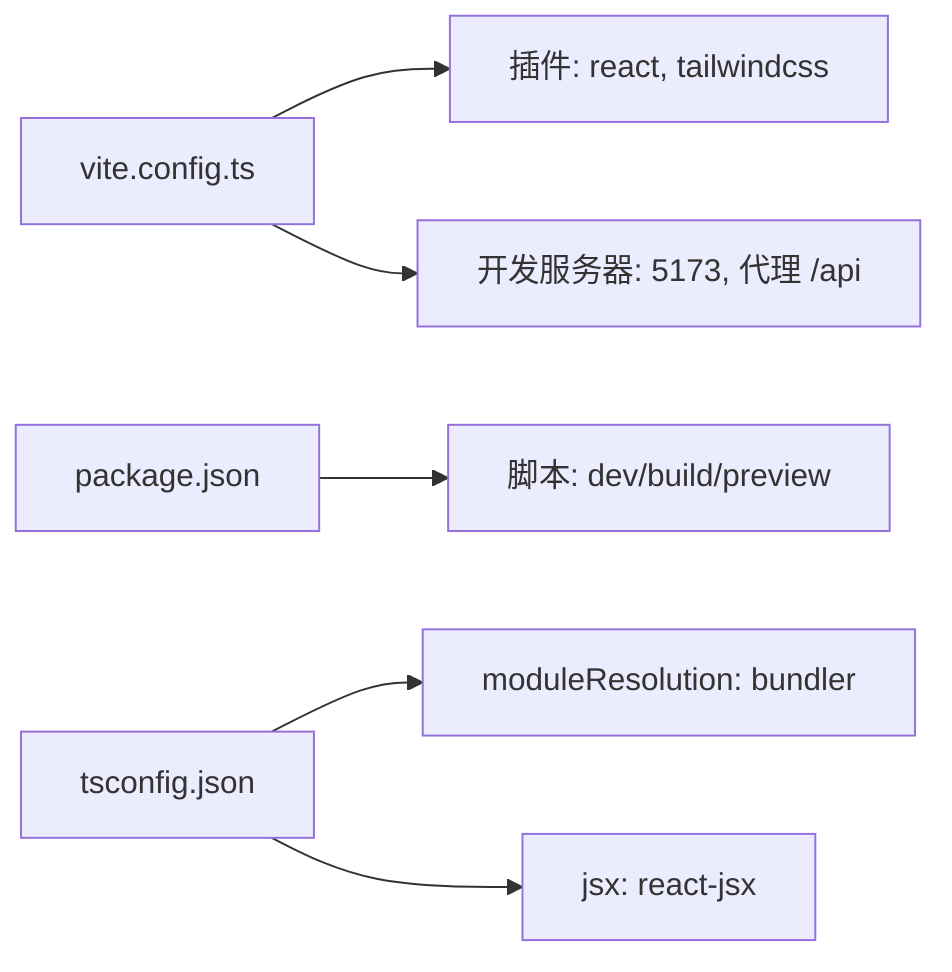

# React应用结构

<cite>
**本文引用的文件**
- [frontend/src/main.tsx](file://frontend/src/main.tsx)
- [frontend/index.html](file://frontend/index.html)
- [frontend/src/App.tsx](file://frontend/src/App.tsx)
- [frontend/vite.config.ts](file://frontend/vite.config.ts)
- [frontend/package.json](file://frontend/package.json)
- [frontend/tsconfig.json](file://frontend/tsconfig.json)
- [frontend/src/context/AuthContext.tsx](file://frontend/src/context/AuthContext.tsx)
- [frontend/src/context/AppStore.tsx](file://frontend/src/context/AppStore.tsx)
- [frontend/src/context/WebSocketContext.tsx](file://frontend/src/context/WebSocketContext.tsx)
- [frontend/src/context/NotificationContext.tsx](file://frontend/src/context/NotificationContext.tsx)
- [frontend/src/components/Layout.tsx](file://frontend/src/components/Layout.tsx)
- [frontend/src/components/Sidebar.tsx](file://frontend/src/components/Sidebar.tsx)
- [frontend/src/components/NotificationCenter.tsx](file://frontend/src/components/NotificationCenter.tsx)
- [frontend/src/components/ToastNotification.tsx](file://frontend/src/components/ToastNotification.tsx)
- [frontend/src/pages/LoginPage.tsx](file://frontend/src/pages/LoginPage.tsx)
- [frontend/src/pages/OverviewPage.tsx](file://frontend/src/pages/OverviewPage.tsx)
- [frontend/src/api/config.ts](file://frontend/src/api/config.ts)
- [frontend/src/types/index.ts](file://frontend/src/types/index.ts)
</cite>

## 目录
1. [引言](#引言)
2. [项目结构](#项目结构)
3. [核心组件](#核心组件)
4. [架构总览](#架构总览)
5. [详细组件分析](#详细组件分析)
6. [依赖关系分析](#依赖关系分析)
7. [性能考虑](#性能考虑)
8. [故障排查指南](#故障排查指南)
9. [结论](#结论)
10. [附录](#附录)

## 引言
本文件面向避风港平台的React前端应用，系统性梳理从应用入口到页面渲染的完整流程，重点覆盖以下方面：
- 应用入口与初始化：main.tsx如何挂载根组件App.tsx
- 根组件设计模式：路由、认证、通知、WebSocket与全局状态的组合使用
- Vite构建与开发服务器：插件、代理与脚本配置
- 路由系统与页面组织：静态路由与布局嵌套
- 生命周期管理、错误边界与性能监控集成
- 组件树结构、代码分割与Bundle优化策略

## 项目结构
前端位于frontend目录，采用React + TypeScript + Vite技术栈，使用TailwindCSS进行样式管理。项目采用按功能域划分的目录组织方式，核心目录包括：
- src：源码目录
  - api：统一的后端API封装
  - components：可复用UI组件
  - context：全局状态与上下文（认证、WebSocket、通知、Zustand）
  - hooks：自定义Hook
  - pages：页面组件
  - types：类型定义
  - main.tsx：应用入口
  - App.tsx：根组件
- 构建配置：vite.config.ts、tsconfig.json、package.json
- HTML入口：index.html

图表来源
- [frontend/index.html:8-11](file://frontend/index.html#L8-L11)
- [frontend/src/main.tsx:1-10](file://frontend/src/main.tsx#L1-L10)
- [frontend/src/App.tsx:1-93](file://frontend/src/App.tsx#L1-L93)

章节来源
- [frontend/index.html:1-12](file://frontend/index.html#L1-L12)
- [frontend/src/main.tsx:1-10](file://frontend/src/main.tsx#L1-L10)

## 核心组件
本节聚焦应用启动与根组件的关键职责与实现要点。

- 应用入口 main.tsx
  - 使用React 18的createRoot挂载App组件
  - 引入全局样式与根组件
  - 严格模式包裹，便于捕获潜在问题

- 根组件 App.tsx
  - 使用BrowserRouter包裹，提供路由能力
  - 通过AuthProvider注入认证上下文
  - AppRoutes根据登录状态决定渲染登录页或受保护路由
  - 在受保护路由下，嵌套WebSocketProvider、NotificationProvider与ConfigLoader，实现实时通知、通知中心与Agent配置加载
  - 路由表定义了完整的页面映射，包含概览、合规、产品、对话、知识库、配置中心、内存树、指标、Agent监控、用户管理、风险中心等

- 全局状态与上下文
  - AuthContext：负责登录、登出、token持久化、鉴权fetch封装
  - WebSocketContext：WebSocket连接、心跳、自动重连、事件分发
  - NotificationContext：通知中心与Toast管理，支持WebSocket事件驱动
  - AppStore（Zustand）：Agent配置、侧边栏状态等

章节来源
- [frontend/src/main.tsx:1-10](file://frontend/src/main.tsx#L1-L10)
- [frontend/src/App.tsx:1-93](file://frontend/src/App.tsx#L1-L93)
- [frontend/src/context/AuthContext.tsx:1-106](file://frontend/src/context/AuthContext.tsx#L1-L106)
- [frontend/src/context/WebSocketContext.tsx:1-132](file://frontend/src/context/WebSocketContext.tsx#L1-L132)
- [frontend/src/context/NotificationContext.tsx:1-187](file://frontend/src/context/NotificationContext.tsx#L1-L187)
- [frontend/src/context/AppStore.tsx:1-107](file://frontend/src/context/AppStore.tsx#L1-L107)

## 架构总览
应用采用“入口 -> 根组件 -> 上下文提供者 -> 路由 -> 页面”的分层架构。认证与实时通信贯穿整个应用，全局状态通过Zustand集中管理。

图表来源
- [frontend/src/main.tsx:1-10](file://frontend/src/main.tsx#L1-L10)
- [frontend/src/App.tsx:1-93](file://frontend/src/App.tsx#L1-L93)
- [frontend/src/context/AuthContext.tsx:1-106](file://frontend/src/context/AuthContext.tsx#L1-L106)
- [frontend/src/context/WebSocketContext.tsx:1-132](file://frontend/src/context/WebSocketContext.tsx#L1-L132)
- [frontend/src/context/NotificationContext.tsx:1-187](file://frontend/src/context/NotificationContext.tsx#L1-L187)
- [frontend/src/context/AppStore.tsx:1-107](file://frontend/src/context/AppStore.tsx#L1-L107)
- [frontend/src/components/Layout.tsx:1-60](file://frontend/src/components/Layout.tsx#L1-L60)
- [frontend/src/components/Sidebar.tsx:1-163](file://frontend/src/components/Sidebar.tsx#L1-L163)
- [frontend/src/pages/OverviewPage.tsx:1-316](file://frontend/src/pages/OverviewPage.tsx#L1-L316)
- [frontend/src/pages/LoginPage.tsx:1-90](file://frontend/src/pages/LoginPage.tsx#L1-L90)

## 详细组件分析

### 应用入口与初始化流程
- HTML提供挂载点#root
- main.tsx创建根容器并渲染<App />
- App.tsx在BrowserRouter内注入AuthProvider，随后根据登录状态决定渲染路径

图表来源
- [frontend/index.html:8-11](file://frontend/index.html#L8-L11)
- [frontend/src/main.tsx:1-10](file://frontend/src/main.tsx#L1-L10)
- [frontend/src/App.tsx:1-93](file://frontend/src/App.tsx#L1-L93)
- [frontend/src/context/AuthContext.tsx:1-106](file://frontend/src/context/AuthContext.tsx#L1-L106)

章节来源
- [frontend/index.html:1-12](file://frontend/index.html#L1-L12)
- [frontend/src/main.tsx:1-10](file://frontend/src/main.tsx#L1-L10)
- [frontend/src/App.tsx:1-93](file://frontend/src/App.tsx#L1-L93)

### 根组件设计模式与路由系统
- 根组件App.tsx通过BrowserRouter提供路由能力
- AppRoutes根据useAuth的状态决定渲染：
  - loading态：显示加载中
  - 未登录：渲染LoginPage
  - 已登录：渲染Layout与受保护路由
- 路由表覆盖概览、系统合规、产品、对话、知识库、配置中心、内存树、指标、Agent监控、用户管理、风险中心等页面
- Layout组件负责侧边栏、顶部状态栏与Outlet，形成主内容区域

图表来源
- [frontend/src/App.tsx:35-82](file://frontend/src/App.tsx#L35-L82)
- [frontend/src/components/Layout.tsx:1-60](file://frontend/src/components/Layout.tsx#L1-L60)
- [frontend/src/pages/LoginPage.tsx:1-90](file://frontend/src/pages/LoginPage.tsx#L1-L90)

章节来源
- [frontend/src/App.tsx:1-93](file://frontend/src/App.tsx#L1-L93)
- [frontend/src/components/Layout.tsx:1-60](file://frontend/src/components/Layout.tsx#L1-L60)
- [frontend/src/pages/LoginPage.tsx:1-90](file://frontend/src/pages/LoginPage.tsx#L1-L90)

### 认证上下文与登录流程
- AuthProvider负责：
  - 启动时从localStorage恢复token与用户信息
  - 提供login、logout方法
  - 封装authFetch，自动附加Authorization头
- LoginPage接收用户名/密码，调用login并处理错误

图表来源
- [frontend/src/context/AuthContext.tsx:44-72](file://frontend/src/context/AuthContext.tsx#L44-L72)
- [frontend/src/pages/LoginPage.tsx:11-23](file://frontend/src/pages/LoginPage.tsx#L11-L23)

章节来源
- [frontend/src/context/AuthContext.tsx:1-106](file://frontend/src/context/AuthContext.tsx#L1-L106)
- [frontend/src/pages/LoginPage.tsx:1-90](file://frontend/src/pages/LoginPage.tsx#L1-L90)

### 实时通知与WebSocket集成
- WebSocketContext：
  - 连接URL基于当前主机与固定端口
  - 支持心跳与自动重连
  - 事件分发：按type分发至注册处理器，支持通配符*
- NotificationContext：
  - 初始化时拉取风险预警作为通知
  - 监听WebSocket事件，生成通知与Toast
  - 提供通知增删改查与Toast管理

图表来源
- [frontend/src/context/WebSocketContext.tsx:31-108](file://frontend/src/context/WebSocketContext.tsx#L31-L108)
- [frontend/src/context/NotificationContext.tsx:59-117](file://frontend/src/context/NotificationContext.tsx#L59-L117)
- [frontend/src/api/config.ts:408-434](file://frontend/src/api/config.ts#L408-L434)

章节来源
- [frontend/src/context/WebSocketContext.tsx:1-132](file://frontend/src/context/WebSocketContext.tsx#L1-L132)
- [frontend/src/context/NotificationContext.tsx:1-187](file://frontend/src/context/NotificationContext.tsx#L1-L187)
- [frontend/src/api/config.ts:1-635](file://frontend/src/api/config.ts#L1-L635)

### 全局状态与配置加载
- AppStore（Zustand）：
  - Agent配置：loadConfig、updateConfig、切换工具/技能、设置当前Agent
  - 侧边栏状态：collapsed、toggle、setCollapsed
- ConfigLoader在AppRoutes中首次渲染时触发loadConfig，保证页面渲染前具备基础配置

图表来源
- [frontend/src/App.tsx:29-33](file://frontend/src/App.tsx#L29-L33)
- [frontend/src/context/AppStore.tsx:28-44](file://frontend/src/context/AppStore.tsx#L28-L44)

章节来源
- [frontend/src/context/AppStore.tsx:1-107](file://frontend/src/context/AppStore.tsx#L1-L107)
- [frontend/src/App.tsx:28-33](file://frontend/src/App.tsx#L28-L33)

### 页面组件与数据流
- OverviewPage：
  - 并行加载产品数量、市场数量、合规总分与风险预警
  - 支持自动刷新与手动刷新
  - 提供风险预警忽略、严重级别筛选、快速入口等交互
- API封装：
  - api/config.ts统一管理各类API，提供request封装与鉴权头处理
  - types/index.ts定义了对话、事件链、风险预警、产品、定时任务等核心类型

图表来源
- [frontend/src/pages/OverviewPage.tsx:54-81](file://frontend/src/pages/OverviewPage.tsx#L54-L81)
- [frontend/src/api/config.ts:362-434](file://frontend/src/api/config.ts#L362-L434)
- [frontend/src/types/index.ts:448-477](file://frontend/src/types/index.ts#L448-L477)

章节来源
- [frontend/src/pages/OverviewPage.tsx:1-316](file://frontend/src/pages/OverviewPage.tsx#L1-L316)
- [frontend/src/api/config.ts:1-635](file://frontend/src/api/config.ts#L1-L635)
- [frontend/src/types/index.ts:1-477](file://frontend/src/types/index.ts#L1-L477)

### 组件树结构与交互
- 组件树（简化）：index.html -> main.tsx -> App.tsx -> AuthProvider -> AppRoutes -> Layout -> Sidebar + Outlet -> 子页面
- 交互链路：用户操作 -> 上下文/状态更新 -> 重新渲染 -> 可能触发API调用

图表来源
- [frontend/src/App.tsx:1-93](file://frontend/src/App.tsx#L1-L93)
- [frontend/src/components/Layout.tsx:1-60](file://frontend/src/components/Layout.tsx#L1-L60)
- [frontend/src/components/Sidebar.tsx:1-163](file://frontend/src/components/Sidebar.tsx#L1-L163)
- [frontend/src/pages/OverviewPage.tsx:1-316](file://frontend/src/pages/OverviewPage.tsx#L1-L316)

## 依赖关系分析
- 构建与开发
  - Vite插件：@vitejs/plugin-react、@tailwindcss/vite
  - 开发服务器：本地端口5173，代理/api到后端服务
  - 脚本：dev/build/preview
- 类型与编译：TypeScript配置为ESNext模块解析，bundler模式，JSX使用react-jsx
- 运行时依赖：react、react-dom、react-router-dom、zustand、react-markdown

图表来源
- [frontend/vite.config.ts:1-16](file://frontend/vite.config.ts#L1-L16)
- [frontend/package.json:1-28](file://frontend/package.json#L1-L28)
- [frontend/tsconfig.json:1-20](file://frontend/tsconfig.json#L1-L20)

章节来源
- [frontend/vite.config.ts:1-16](file://frontend/vite.config.ts#L1-L16)
- [frontend/package.json:1-28](file://frontend/package.json#L1-L28)
- [frontend/tsconfig.json:1-20](file://frontend/tsconfig.json#L1-L20)

## 性能考虑
- 代码分割与懒加载
  - 当前路由以静态导入为主；如需进一步优化，可在路由层面引入动态导入（例如将大型页面组件按需加载），减少首屏包体积
- 构建优化
  - 使用Vite默认Rollup打包器，结合Tree-shaking与最小化策略
  - TailwindCSS按需生成样式，避免冗余类
- 状态与渲染
  - 使用Zustand替代Redux，降低样板代码与内存占用
  - 合理拆分组件，避免不必要的重渲染
- 网络与缓存
  - API封装统一处理鉴权头，减少重复逻辑
  - WebSocket长连接配合心跳维持，提升实时性

[本节为通用指导，不直接分析具体文件]

## 故障排查指南
- 登录失败
  - 检查AuthContext.login的错误处理与提示
  - 确认后端登录接口返回格式与异常分支
- WebSocket无法连接
  - 核对WebSocketContext中的连接地址与端口
  - 关注自动重连逻辑与心跳机制
- 通知不显示
  - 确认NotificationContext已订阅WebSocket事件
  - 检查风险预警API是否可用
- 页面空白或路由不生效
  - 确认BrowserRouter包裹与路由表配置
  - 检查Layout与Outlet的嵌套关系

章节来源
- [frontend/src/context/AuthContext.tsx:44-72](file://frontend/src/context/AuthContext.tsx#L44-L72)
- [frontend/src/context/WebSocketContext.tsx:39-108](file://frontend/src/context/WebSocketContext.tsx#L39-L108)
- [frontend/src/context/NotificationContext.tsx:89-117](file://frontend/src/context/NotificationContext.tsx#L89-L117)
- [frontend/src/App.tsx:35-82](file://frontend/src/App.tsx#L35-L82)

## 结论
避风港React应用采用清晰的分层架构：入口负责挂载，根组件负责路由与上下文整合，页面组件承载业务逻辑。通过认证、WebSocket与通知三大上下文，应用实现了安全、实时与可观测的用户体验。结合Zustand与Vite，整体具备良好的可维护性与性能表现。后续可在路由层引入动态导入以进一步优化首屏加载，并完善错误边界与性能监控集成。

[本节为总结性内容，不直接分析具体文件]

## 附录
- API与类型
  - api/config.ts：统一的API客户端，封装鉴权头与错误处理
  - types/index.ts：核心业务类型定义，覆盖对话、事件链、风险预警、产品、定时任务等
- UI组件
  - Layout/Sidebar/NotificationCenter/ToastNotification：提供一致的导航与通知体验

章节来源
- [frontend/src/api/config.ts:1-635](file://frontend/src/api/config.ts#L1-L635)
- [frontend/src/types/index.ts:1-477](file://frontend/src/types/index.ts#L1-L477)
- [frontend/src/components/Layout.tsx:1-60](file://frontend/src/components/Layout.tsx#L1-L60)
- [frontend/src/components/Sidebar.tsx:1-163](file://frontend/src/components/Sidebar.tsx#L1-L163)
- [frontend/src/components/NotificationCenter.tsx:1-119](file://frontend/src/components/NotificationCenter.tsx#L1-L119)
- [frontend/src/components/ToastNotification.tsx:1-53](file://frontend/src/components/ToastNotification.tsx#L1-L53)