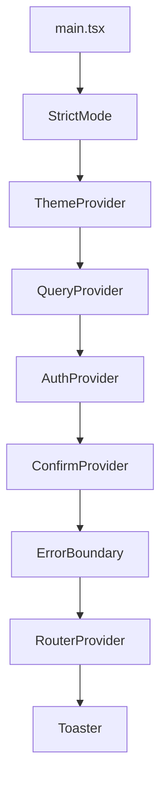
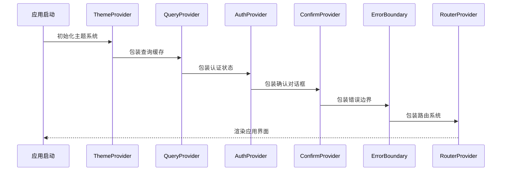
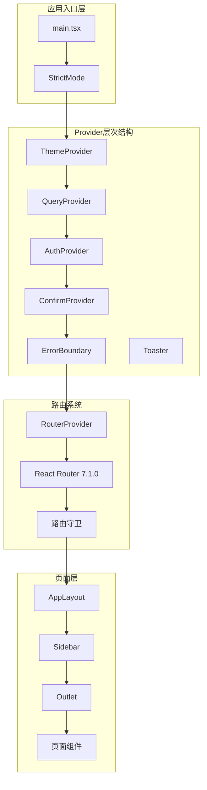
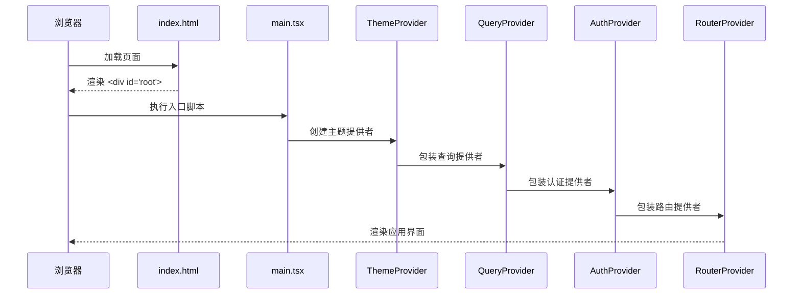
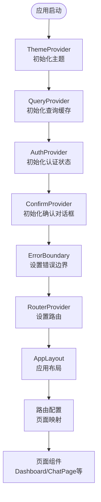
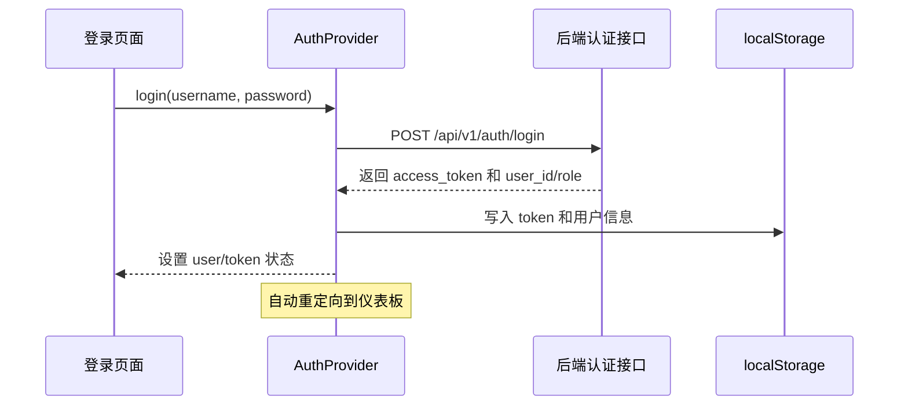

# React应用结构

<cite>
**本文档引用的文件**
- [frontend/src/main.tsx](file://frontend/src/main.tsx)
- [frontend/src/layouts/AppLayout.tsx](file://frontend/src/layouts/AppLayout.tsx)
- [frontend/src/router/index.tsx](file://frontend/src/router/index.tsx)
- [frontend/src/components/CommandPalette.tsx](file://frontend/src/components/CommandPalette.tsx)
- [frontend/src/components/Sidebar.tsx](file://frontend/src/components/Sidebar.tsx)
- [frontend/src/components/ErrorBoundary.tsx](file://frontend/src/components/ErrorBoundary.tsx)
- [frontend/src/providers/QueryProvider.tsx](file://frontend/src/providers/QueryProvider.tsx)
- [frontend/src/providers/ThemeProvider.tsx](file://frontend/src/providers/ThemeProvider.tsx)
- [frontend/src/context/AuthContext.tsx](file://frontend/src/context/AuthContext.tsx)
- [frontend/src/hooks/useConfirm.tsx](file://frontend/src/hooks/useConfirm.tsx)
- [frontend/src/pages/Dashboard.tsx](file://frontend/src/pages/Dashboard.tsx)
- [frontend/src/pages/ChatPage.tsx](file://frontend/src/pages/ChatPage.tsx)
- [frontend/package.json](file://frontend/package.json)
- [frontend/tailwind.config.ts](file://frontend/tailwind.config.ts)
- [frontend/vite.config.ts](file://frontend/vite.config.ts)
</cite>

## 更新摘要
**所做更改**
- 完全重写文档以反映从旧架构到React 19 + TypeScript + Tailwind CSS的现代化迁移
- 新增完整的AppLayout.tsx布局系统和CommandPalette命令面板
- 更新Provider层次结构，包括新的ThemeProvider、QueryProvider、ConfirmProvider
- 重构路由系统，采用React Router 7.1.0的现代化路由能力
- 新增完整的UI组件库系统，包括Radix UI + shadcn/ui + Tailwind CSS
- 更新聊天组件架构，包括ChatPage、MessageBubble、SessionList等
- 优化构建配置，采用Vite 6.0.0和代码分割策略

## 目录
1. [引言](#引言)
2. [项目结构](#项目结构)
3. [核心组件](#核心组件)
4. [架构总览](#架构总览)
5. [详细组件分析](#详细组件分析)
6. [现代化组件库系统](#现代化组件库系统)
7. [聊天组件架构](#聊天组件架构)
8. [依赖关系分析](#依赖关系分析)
9. [性能考虑](#性能考虑)
10. [故障排查指南](#故障排查指南)
11. [结论](#结论)
12. [附录](#附录)

## 引言
本文件面向避风港平台的现代化React前端应用，系统性梳理从应用入口到页面渲染的完整流程。该应用已完成从传统架构到React 19 + TypeScript + Tailwind CSS的全面迁移，采用现代化的组件库系统和路由架构。

**主要技术栈**：
- React 19.0.0：最新React版本，提供并发特性和性能优化
- TypeScript ~5.7.0：强类型安全保障
- Tailwind CSS 3.4.16：实用优先的CSS框架
- Radix UI：无障碍的底层组件库
- shadcn/ui：高质量的UI组件库
- React Router 7.1.0：现代化路由系统
- @tanstack/react-query：智能状态管理

## 项目结构
前端位于frontend目录，采用React 19 + TypeScript + Vite技术栈，使用Tailwind CSS进行样式管理。项目采用按功能域划分的目录组织方式：

```
frontend/
├── src/
│   ├── components/          # 现代化UI组件
│   ├── context/            # 全局状态与上下文
│   ├── hooks/              # 自定义Hook
│   ├── layouts/            # 页面布局组件
│   ├── pages/              # 页面组件
│   ├── providers/          # 应用提供者
│   ├── router/             # 路由配置
│   ├── types/              # 类型定义
│   ├── lib/                # 工具函数
│   └── main.tsx           # 应用入口
├── public/                # 静态资源
├── package.json           # 依赖配置
├── vite.config.ts         # 构建配置
├── tailwind.config.ts     # 样式配置
└── tsconfig.json          # TypeScript配置
```

**章节来源**
- [frontend/src/main.tsx:1-31](file://frontend/src/main.tsx#L1-L31)
- [frontend/package.json:1-56](file://frontend/package.json#L1-L56)

## 核心组件
本节聚焦应用启动与现代化Provider层次结构的关键职责与实现要点。

### 应用入口 main.tsx
应用入口采用React 19的createRoot API，构建了完整的Provider层次结构：



**Provider层次结构**：
- **ThemeProvider**：基于next-themes的主题管理系统
- **QueryProvider**：@tanstack/react-query的状态缓存系统
- **AuthProvider**：认证状态管理和token持久化
- **ConfirmProvider**：全局确认对话框服务
- **ErrorBoundary**：全局错误边界处理
- **RouterProvider**：React Router 7.1.0路由系统

**章节来源**
- [frontend/src/main.tsx:15-30](file://frontend/src/main.tsx#L15-L30)

### Provider层次结构
每个Provider负责特定的功能领域，通过组合提供完整的应用功能：



**章节来源**
- [frontend/src/providers/ThemeProvider.tsx:1-16](file://frontend/src/providers/ThemeProvider.tsx#L1-L16)
- [frontend/src/providers/QueryProvider.tsx:1-31](file://frontend/src/providers/QueryProvider.tsx#L1-L31)
- [frontend/src/context/AuthContext.tsx:1-137](file://frontend/src/context/AuthContext.tsx#L1-L137)
- [frontend/src/hooks/useConfirm.tsx:1-99](file://frontend/src/hooks/useConfirm.tsx#L1-L99)

## 架构总览
应用采用"入口 -> Provider层次结构 -> 路由 -> 页面"的现代化分层架构。这种架构提供了清晰的关注点分离和强大的功能组合能力。

**现代化架构特点**：
- **React 19并发特性**：自动批处理和优先级调度
- **组件库集成**：Radix UI + shadcn/ui + Tailwind CSS
- **状态管理**：@tanstack/react-query智能缓存
- **路由系统**：React Router 7.1.0现代化路由
- **主题系统**：next-themes明暗主题切换
- **错误处理**：全局ErrorBoundary和局部错误边界



**图表来源**
- [frontend/src/main.tsx:15-30](file://frontend/src/main.tsx#L15-L30)
- [frontend/src/router/index.tsx:62-252](file://frontend/src/router/index.tsx#L62-L252)
- [frontend/src/layouts/AppLayout.tsx:29-43](file://frontend/src/layouts/AppLayout.tsx#L29-L43)

**章节来源**
- [frontend/src/main.tsx:1-31](file://frontend/src/main.tsx#L1-L31)
- [frontend/src/router/index.tsx:1-253](file://frontend/src/router/index.tsx#L1-L253)

## 详细组件分析

### 应用入口与初始化流程
应用启动时按照严格的Provider嵌套顺序初始化各个功能模块：



**初始化流程**：
1. **HTML挂载**：index.html提供#root挂载点
2. **StrictMode包裹**：提供开发时警告和错误边界
3. **ThemeProvider**：初始化主题系统，支持明暗主题切换
4. **QueryProvider**：设置@tanstack/react-query客户端
5. **AuthProvider**：恢复本地认证状态
6. **RouterProvider**：配置React Router路由

**章节来源**
- [frontend/src/main.tsx:15-30](file://frontend/src/main.tsx#L15-L30)
- [frontend/index.html:1-12](file://frontend/index.html#L1-L12)

### Provider层次结构与路由系统
路由系统采用React Router 7.1.0，支持现代化的路由特性：



**路由配置特点**：
- **首屏优化**：关键页面直接导入，次要页面懒加载
- **权限控制**：RequireAuth、RequireAdmin路由守卫
- **布局系统**：AppLayout统一页面结构
- **错误处理**：NotFoundPage友好404页面

**章节来源**
- [frontend/src/router/index.tsx:62-252](file://frontend/src/router/index.tsx#L62-L252)
- [frontend/src/layouts/AppLayout.tsx:9-44](file://frontend/src/layouts/AppLayout.tsx#L9-L44)

### 认证上下文与登录流程
AuthProvider负责完整的认证状态管理：



**认证流程**：
1. **启动恢复**：从localStorage恢复token和用户信息
2. **状态验证**：异步验证token有效性
3. **登录处理**：POST请求认证接口
4. **状态更新**：设置认证状态和用户信息
5. **持久化存储**：保存token和用户数据

**章节来源**
- [frontend/src/context/AuthContext.tsx:32-103](file://frontend/src/context/AuthContext.tsx#L32-L103)

### 错误边界与异常处理
ErrorBoundary提供全局错误捕获和用户友好的错误展示：

**错误处理机制**：
- **渲染时异常**：捕获组件渲染错误
- **动态导入错误**：自动刷新解决chunk加载失败
- **用户反馈**：提供重试和刷新按钮
- **日志记录**：控制台错误日志

**章节来源**
- [frontend/src/components/ErrorBoundary.tsx:32-86](file://frontend/src/components/ErrorBoundary.tsx#L32-L86)

## 现代化组件库系统

### Radix UI组件库
应用集成了完整的Radix UI组件库，提供无障碍、可访问性的底层组件：

**基础组件**：
- Button、Input、Label、Separator等
- Dialog、DropdownMenu、Popover、Tooltip等
- NavigationMenu、Tabs、Accordion等
- AlertDialog、Progress、Skeleton等
- Checkbox、RadioGroup、Select、Slider等

**组件特点**：
- **无障碍支持**：符合WCAG标准
- **可访问性**：键盘导航和屏幕阅读器支持
- **轻量级**：无副作用的底层组件
- **可定制性**：CSS变量和样式覆盖

### shadcn/ui组件系统
基于Tailwind CSS的高质量UI组件库，支持主题定制：

**组件配置**：
- **components.json**：组件别名和样式配置
- **设计令牌**：CSS变量和设计系统
- **图标系统**：lucide-react图标库
- **工具函数**：class-variance-authority和clsx

**组件系统**：
- **Button**：多种变体和尺寸
- **Dialog**：模态对话框组件
- **Badge**：标签和徽章组件
- **Card**：卡片布局组件
- **Input**：输入框组件

### Tailwind CSS配置
现代化的Tailwind CSS配置，支持Radix UI和设计令牌：

**设计系统**：
- **颜色系统**：基于CSS变量的颜色令牌
- **字体系统**：DM Sans字体和中英文支持
- **圆角系统**：统一的圆角半径
- **阴影系统**：层次化的阴影效果

**动画系统**：
- **自定义keyframes**：accordion、fade-in、slide-up等
- **动画配置**：ease-out和duration设置
- **响应式设计**：移动端优先的设计系统

**章节来源**
- [frontend/package.json:12-39](file://frontend/package.json#L12-L39)
- [frontend/tailwind.config.ts:14-155](file://frontend/tailwind.config.ts#L14-L155)

## 聊天组件架构

### 聊天组件系统
全新的聊天组件架构，基于现代化React和Tailwind CSS：

**核心组件**：
- **ChatPage**：聊天页面主组件
- **MessageBubble**：消息气泡组件
- **ChatComposer**：聊天输入组件
- **SessionList**：会话列表组件
- **ChainHistoryDrawer**：链历史抽屉

**聊天特性**：
- **实时通信**：基于WebSocket的实时消息传输
- **流式渲染**：支持AI响应的流式显示
- **状态管理**：集成@tanstack/react-query
- **错误处理**：完善的错误边界和用户反馈
- **性能优化**：虚拟滚动和懒加载

```mermaid
graph TB
ChatPage[ChatPage<br/>聊天页面] --> MessageBubble[MessageBubble<br/>消息气泡]
ChatPage --> ChatComposer[ChatComposer<br/>聊天输入]
ChatPage --> SessionList[SessionList<br/>会话列表]
ChatPage --> ChainHistoryDrawer[ChainHistoryDrawer<br/>链历史]
MessageBubble --> StreamMessageRenderer[StreamMessageRenderer<br/>流式渲染]
MessageBubble --> TypewriterEffect[TypewriterEffect<br/>打字机效果]
SessionList --> RuntimePanels[RuntimePanels<br/>运行时面板]
ChatComposer --> WebSocket[WebSocket<br/>实时通信]
MessageBubble --> QueryCache[@tanstack/react-query<br/>状态缓存]
```

**图表来源**
- [frontend/src/pages/ChatPage.tsx:169-362](file://frontend/src/pages/ChatPage.tsx#L169-L362)
- [frontend/src/components/chat/MessageBubble.tsx](file://frontend/src/components/chat/MessageBubble.tsx)
- [frontend/src/components/chat/ChatComposer.tsx](file://frontend/src/components/chat/ChatComposer.tsx)
- [frontend/src/components/chat/SessionList.tsx](file://frontend/src/components/chat/SessionList.tsx)

**章节来源**
- [frontend/src/pages/ChatPage.tsx:169-362](file://frontend/src/pages/ChatPage.tsx#L169-L362)

### 命令面板系统
CommandPalette提供现代化的命令系统：

**功能特性**：
- **键盘快捷键**：Cmd/Ctrl+K打开命令面板
- **智能搜索**：支持关键词搜索和分类导航
- **会话管理**：快速访问最近会话
- **管理员功能**：根据权限显示不同功能
- **快速操作**：新建对话和刷新数据

**命令分类**：
- **导航项**：首页、智能对话、风险监控等
- **合规工具**：店铺合规、产品合规、知识库等
- **管理员功能**：Agent配置、模型配置、用户管理等
- **快速操作**：新建对话、刷新数据等

**章节来源**
- [frontend/src/components/CommandPalette.tsx:71-218](file://frontend/src/components/CommandPalette.tsx#L71-L218)

## 依赖关系分析
现代化依赖配置，提供完整的功能支持：

**核心依赖**：
- **React 19.0.0**：最新React版本
- **TypeScript ~5.7.0**：类型安全保障
- **Tailwind CSS 3.4.16**：实用优先的CSS框架
- **@tanstack/react-query 5.62.0**：智能状态管理

**组件库依赖**：
- **Radix UI**：@radix-ui/react-*系列组件
- **shadcn/ui**：class-variance-authority、clsx
- **图标库**：lucide-react
- **主题系统**：next-themes

**开发工具**：
- **Vite 6.0.0**：现代化构建工具
- **PostCSS**：CSS后处理器
- **TypeScript**：类型检查

**章节来源**
- [frontend/package.json:12-54](file://frontend/package.json#L12-L54)

## 性能考虑
现代化性能优化策略：

**代码分割与懒加载**：
- **首屏优化**：Dashboard和ChatPage直接导入
- **路由级懒加载**：使用React.lazy和Suspense
- **组件级懒加载**：大型聊天组件按需加载
- **查询缓存**：@tanstack/react-query智能缓存策略

**构建优化**：
- **手动代码分割**：react-vendor、ui-radix、cmdk等
- **chunk命名策略**：页面组件特殊命名
- **Tree-shaking**：按需导入减少包体积
- **压缩优化**：Rollup输出优化

**运行时优化**：
- **React 19并发**：自动批处理和优先级调度
- **虚拟滚动**：大量消息的性能优化
- **状态缓存**：智能查询缓存和失效
- **主题切换**：CSS变量切换避免重排

**章节来源**
- [frontend/vite.config.ts:26-61](file://frontend/vite.config.ts#L26-L61)

## 故障排查指南
常见问题和解决方案：

**Provider层次问题**：
- **检查嵌套顺序**：确保ThemeProvider在最外层
- **验证初始化**：确认各Provider正确初始化
- **状态检查**：使用React DevTools检查状态树

**路由问题**：
- **路由配置**：检查React Router 7.1.0配置
- **守卫逻辑**：验证RequireAuth和RequireAdmin
- **懒加载**：确认lazy组件正确导入

**组件库问题**：
- **Radix UI**：验证组件导入和配置
- **Tailwind CSS**：检查类名拼写和配置
- **shadcn/ui**：确认组件别名和样式

**聊天组件问题**：
- **WebSocket连接**：检查连接状态和错误日志
- **消息流式渲染**：验证流式API和事件处理
- **查询缓存**：检查@tanstack/react-query状态

**性能问题**：
- **React Profiler**：分析渲染性能瓶颈
- **内存泄漏**：检查事件监听器清理
- **网络请求**：优化查询缓存策略

**章节来源**
- [frontend/src/main.tsx:17-28](file://frontend/src/main.tsx#L17-L28)
- [frontend/src/router/index.tsx:62-252](file://frontend/src/router/index.tsx#L62-L252)
- [frontend/src/components/ErrorBoundary.tsx:32-86](file://frontend/src/components/ErrorBoundary.tsx#L32-L86)

## 结论
避风港React应用已完成从传统架构到现代化架构的全面升级。新的架构采用React 19 + TypeScript + Tailwind CSS + Radix UI的组合，提供了更好的开发体验、可访问性和性能表现。

**主要成就**：
- **现代化组件库**：Radix UI + shadcn/ui + Tailwind CSS提供一致的设计系统
- **Provider层次结构**：清晰的功能分离和依赖管理
- **命令面板系统**：基于cmdk的现代化命令系统
- **聊天组件架构**：全新的聊天UI架构，支持流式渲染和实时通信
- **查询缓存系统**：@tanstack/react-query提供智能状态管理
- **主题系统**：基于next-themes的明暗主题切换

**未来发展方向**：
- **路由优化**：进一步优化懒加载策略
- **性能监控**：集成更完善的性能监控
- **组件扩展**：探索更多Radix UI组件的应用
- **用户体验**：持续优化交互和视觉体验

## 附录

### 组件库配置
**Radix UI组件**：@radix-ui/react-*系列，提供无障碍底层组件
**shadcn/ui组件**：class-variance-authority、clsx、lucide-react
**Tailwind CSS**：设计令牌系统、动画配置、响应式设计

### 聊天组件
**ChatPage**：聊天页面主组件，支持智能体选择和会话管理
**MessageBubble**：消息显示和样式组件
**ChatComposer**：聊天输入和发送组件
**SessionList**：会话管理和历史记录

### 工具函数
**lib/utils.ts**：class-variance-authority和clsx工具函数
**hooks**：自定义Hook集合，包括查询Hook、确认对话框、WebSocket等

### 类型定义
**types/index.ts**：核心业务类型定义，支持现代化TypeScript特性

**章节来源**
- [frontend/src/pages/Dashboard.tsx:125-400](file://frontend/src/pages/Dashboard.tsx#L125-L400)
- [frontend/src/pages/ChatPage.tsx:169-362](file://frontend/src/pages/ChatPage.tsx#L169-L362)
- [frontend/src/components/Sidebar.tsx:76-462](file://frontend/src/components/Sidebar.tsx#L76-L462)