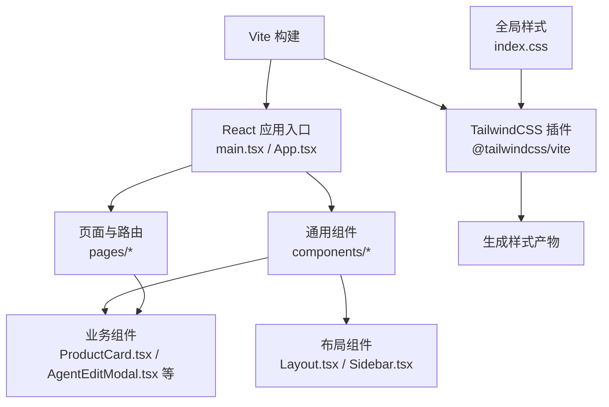
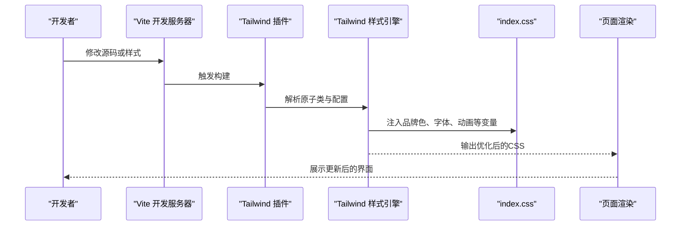
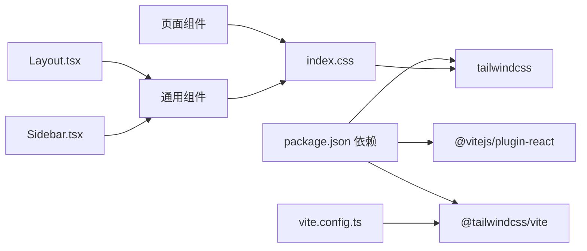

# UI设计系统

<cite>
**本文引用的文件**
- [frontend/src/index.css](file://frontend/src/index.css)
- [frontend/package.json](file://frontend/package.json)
- [frontend/vite.config.ts](file://frontend/vite.config.ts)
- [frontend/src/components/Layout.tsx](file://frontend/src/components/Layout.tsx)
- [frontend/src/components/Sidebar.tsx](file://frontend/src/components/Sidebar.tsx)
- [frontend/src/pages/LoginPage.tsx](file://frontend/src/pages/LoginPage.tsx)
- [frontend/src/pages/UserManagePage.tsx](file://frontend/src/pages/UserManagePage.tsx)
- [frontend/src/components/config/AgentEditModal.tsx](file://frontend/src/components/config/AgentEditModal.tsx)
- [frontend/src/pages/config/SchedulerConfigPage.tsx](file://frontend/src/pages/config/SchedulerConfigPage.tsx)
- [frontend/src/components/ProductCard.tsx](file://frontend/src/components/ProductCard.tsx)
- [.agents/skills/stitch-design-taste/DESIGN.md](file://.agents/skills/stitch-design-taste/DESIGN.md)
- [.agents/skills/stitch-design-taste/SKILL.md](file://.agents/skills/stitch-design-taste/SKILL.md)
- [.agents/skills/minimalist-ui/SKILL.md](file://.agents/skills/minimalist-ui/SKILL.md)
- [.agents/skills/design-taste-frontend-v1/SKILL.md](file://.agents/skills/design-taste-frontend-v1/SKILL.md)
</cite>

## 目录
1. [引言](#引言)
2. [项目结构](#项目结构)
3. [核心组件](#核心组件)
4. [架构总览](#架构总览)
5. [组件详解](#组件详解)
6. [依赖关系分析](#依赖关系分析)
7. [性能考量](#性能考量)
8. [故障排查指南](#故障排查指南)
9. [结论](#结论)
10. [附录](#附录)

## 引言
本文件面向避风港平台的UI设计系统，系统化梳理TailwindCSS配置、样式工具类使用、主题定制策略与设计令牌管理，并覆盖颜色系统、字体排版、间距规范、断点设计、组件样式统一与变体设计、响应式布局、动画与过渡、交互反馈、暗色模式支持、无障碍设计与浏览器兼容性等。文档以仓库现有实现为基础，结合设计技能文档中的风格与规范，形成可落地的设计系统实践指南。

## 项目结构
前端采用Vite + React + TailwindCSS 4.x，通过Vite插件集成TailwindCSS，全局样式通过index.css集中定义品牌色、字体、滚动条与动画令牌，页面与组件按功能模块组织，布局由Layout与Sidebar等核心组件统一承载。

图表来源
- [frontend/vite.config.ts:1-16](file://frontend/vite.config.ts#L1-L16)
- [frontend/src/index.css:1-94](file://frontend/src/index.css#L1-L94)

章节来源
- [frontend/package.json:1-28](file://frontend/package.json#L1-L28)
- [frontend/vite.config.ts:1-16](file://frontend/vite.config.ts#L1-L16)
- [frontend/src/index.css:1-94](file://frontend/src/index.css#L1-L94)

## 核心组件
- 布局层：Layout负责整体容器、顶部状态栏、主内容区与固定通知层；Sidebar负责导航、用户信息与折叠切换。
- 页面层：如LoginPage、UserManagePage等，体现表单、标签、选择器等输入控件的样式规范。
- 配置与抽屉：AgentEditModal与SchedulerConfigPage展示模态/抽屉容器、头部与内容区的统一样式。
- 卡片与状态：ProductCard展示状态标签、悬停与过渡效果。

章节来源
- [frontend/src/components/Layout.tsx:1-60](file://frontend/src/components/Layout.tsx#L1-L60)
- [frontend/src/components/Sidebar.tsx:1-163](file://frontend/src/components/Sidebar.tsx#L1-L163)
- [frontend/src/pages/LoginPage.tsx:39-89](file://frontend/src/pages/LoginPage.tsx#L39-L89)
- [frontend/src/pages/UserManagePage.tsx:182-201](file://frontend/src/pages/UserManagePage.tsx#L182-L201)
- [frontend/src/components/config/AgentEditModal.tsx:79-134](file://frontend/src/components/config/AgentEditModal.tsx#L79-L134)
- [frontend/src/pages/config/SchedulerConfigPage.tsx:489-526](file://frontend/src/pages/config/SchedulerConfigPage.tsx#L489-L526)
- [frontend/src/components/ProductCard.tsx:1-45](file://frontend/src/components/ProductCard.tsx#L1-L45)

## 架构总览
TailwindCSS通过Vite插件在构建期注入，全局样式index.css提供CSS变量、基础排版、滚动条与动画令牌，组件层通过原子类组合实现一致的视觉与交互体验。

图表来源
- [frontend/vite.config.ts:1-16](file://frontend/vite.config.ts#L1-L16)
- [frontend/src/index.css:1-94](file://frontend/src/index.css#L1-L94)

## 组件详解

### 颜色系统与主题定制
- 品牌色：主色、强调色及悬停态；语义色：成功、警告、危险、信息、紫色等；背景与文字：基础背景、表面、次级文本、边框等。
- 字体：无衬线与等宽字体变量，用于正文与代码场景。
- 主题变量：通过CSS自定义属性集中管理，便于在组件中直接引用，避免硬编码。
- 设计参考：设计技能文档建议“单强调色”“暖灰/冷灰一致性”“禁用纯黑”等，可作为扩展时的颜色约束。

章节来源
- [frontend/src/index.css:3-30](file://frontend/src/index.css#L3-L30)
- [.agents/skills/stitch-design-taste/DESIGN.md:23-42](file://.agents/skills/stitch-design-taste/DESIGN.md#L23-L42)

### 字体排版与字号体系
- 字体栈：系统字体优先，兼顾中文显示；等宽字体用于代码与数据密集场景。
- 文体层级：标题、正文、辅助信息、标签等通过字号、字重与行高区分，组件内保持一致的排版节奏。
- 设计参考：设计技能文档对显示/正文/Mono字体与禁用字体有明确建议。

章节来源
- [frontend/src/index.css:27-30](file://frontend/src/index.css#L27-L30)
- [.agents/skills/stitch-design-taste/DESIGN.md:135-139](file://.agents/skills/stitch-design-taste/DESIGN.md#L135-L139)

### 间距与尺寸规范
- 组件内边距与外边距：组件普遍采用统一的内边距与圆角半径，保证视觉密度与可读性。
- 圆角：卡片与输入框常见圆角值，组件间保持一致性。
- 尺寸变量：通过CSS变量与原子类组合，避免重复定义。

章节来源
- [frontend/src/pages/LoginPage.tsx:49-61](file://frontend/src/pages/LoginPage.tsx#L49-L61)
- [frontend/src/components/config/AgentEditModal.tsx:98-116](file://frontend/src/components/config/AgentEditModal.tsx#L98-L116)
- [frontend/src/components/ProductCard.tsx:36-45](file://frontend/src/components/ProductCard.tsx#L36-L45)

### 断点与响应式布局
- 移动优先：组件普遍采用“在小屏上更紧凑”的策略，如标签与输入的字号、内边距在移动端更小。
- 容器约束：页面内容常使用最大宽度与居中布局，避免在大屏上过度铺展。
- 设计参考：设计技能文档强调“严格单列折叠”“网格优先”“避免百分比Flex计算”。

章节来源
- [frontend/src/components/Sidebar.tsx:38-44](file://frontend/src/components/Sidebar.tsx#L38-L44)
- [.agents/skills/stitch-design-taste/DESIGN.md:148-151](file://.agents/skills/stitch-design-taste/DESIGN.md#L148-L151)

### 组件样式统一与变体设计
- 统一样式：按钮、输入框、标签、状态徽章等在各页面与组件中保持一致的圆角、边框、悬停与焦点态。
- 变体：通过状态类（如激活、禁用、错误）与语义色实现不同变体，避免重复定义样式。
- 抽屉与模态：统一的头部、内容区与关闭按钮样式，保证交互一致性。

章节来源
- [frontend/src/pages/LoginPage.tsx:70-80](file://frontend/src/pages/LoginPage.tsx#L70-L80)
- [frontend/src/pages/UserManagePage.tsx:182-201](file://frontend/src/pages/UserManagePage.tsx#L182-L201)
- [frontend/src/components/config/AgentEditModal.tsx:79-134](file://frontend/src/components/config/AgentEditModal.tsx#L79-L134)
- [frontend/src/pages/config/SchedulerConfigPage.tsx:499-520](file://frontend/src/pages/config/SchedulerConfigPage.tsx#L499-L520)

### 动画与过渡、交互反馈
- 动画令牌：提供脉冲点、淡入、旋转、滑入等关键帧，组件可直接复用。
- 交互反馈：按钮悬停、激活、禁用态；输入框聚焦；卡片悬停阴影与边框变化；状态指示器与连接状态提示。
- 设计参考：最小化动效、仅使用transform与opacity、列表级联进入、无限微循环等。

章节来源
- [frontend/src/index.css:63-94](file://frontend/src/index.css#L63-L94)
- [frontend/src/components/Layout.tsx:8-13](file://frontend/src/components/Layout.tsx#L8-L13)
- [frontend/src/components/ProductCard.tsx:36-45](file://frontend/src/components/ProductCard.tsx#L36-L45)
- [.agents/skills/minimalist-ui/SKILL.md:69-75](file://.agents/skills/minimalist-ui/SKILL.md#L69-L75)

### 设计令牌管理与样式复用
- CSS变量：集中管理颜色、字体与基础排版，组件通过变量引用，便于主题切换与一致性维护。
- 原子类：通过Tailwind原子类组合实现复用，减少重复样式。
- 组件抽象：将通用样式封装为组件（如Layout、Sidebar），在多处复用，降低耦合。

章节来源
- [frontend/src/index.css:3-30](file://frontend/src/index.css#L3-L30)
- [frontend/src/components/Layout.tsx:22-26](file://frontend/src/components/Layout.tsx#L22-L26)
- [frontend/src/components/Sidebar.tsx:38-44](file://frontend/src/components/Sidebar.tsx#L38-L44)

### 暗色模式支持与无障碍设计
- 暗色模式：当前仓库以浅色为主，可通过CSS变量与媒体查询扩展暗色主题；建议为关键语义色提供反相映射。
- 无障碍：确保对比度满足可访问标准；为交互元素提供键盘可达与ARIA语义；为动态内容提供可感知的加载与错误状态。
- 设计参考：设计技能文档强调“禁用纯黑”“柔和阴影”“禁用霓虹”等，有助于提升可读性与可访问性。

章节来源
- [frontend/src/index.css:3-30](file://frontend/src/index.css#L3-L30)
- [.agents/skills/stitch-design-taste/DESIGN.md:38-42](file://.agents/skills/stitch-design-taste/DESIGN.md#L38-L42)

### 浏览器兼容性
- 使用现代CSS特性（如CSS变量、原子类）与现代浏览器；对旧版浏览器需评估polyfill与降级策略。
- 滚动条样式为WebKit专属，需提供非WebKit环境下的降级方案。

章节来源
- [frontend/src/index.css:47-61](file://frontend/src/index.css#L47-L61)

## 依赖关系分析

图表来源
- [frontend/package.json:11-26](file://frontend/package.json#L11-L26)
- [frontend/vite.config.ts:1-16](file://frontend/vite.config.ts#L1-L16)
- [frontend/src/index.css:1-1](file://frontend/src/index.css#L1-L1)

章节来源
- [frontend/package.json:1-28](file://frontend/package.json#L1-L28)
- [frontend/vite.config.ts:1-16](file://frontend/vite.config.ts#L1-L16)

## 性能考量
- 动画性能：优先使用transform与opacity，避免触发布局与重绘；列表级联进入与无限微循环需隔离在独立组件中，避免父级重渲染。
- 构建体积：TailwindCSS按需扫描，确保未使用的类不会打包；合理拆分组件，减少不必要的样式注入。
- 渲染优化：使用CSS变量与原子类减少重复样式；对高频交互（如按钮激活、输入聚焦）采用轻量过渡。

章节来源
- [.agents/skills/minimalist-ui/SKILL.md:69-75](file://.agents/skills/minimalist-ui/SKILL.md#L69-L75)
- [frontend/src/index.css:63-94](file://frontend/src/index.css#L63-L94)

## 故障排查指南
- 样式未生效
  - 检查Tailwind插件是否正确引入与配置。
  - 确认index.css已导入且CSS变量定义正确。
- 动画异常
  - 检查关键帧名称与类名是否匹配；确认动画时长与缓动函数设置合理。
- 响应式问题
  - 检查断点类与容器约束是否符合预期；避免在小屏上使用过大的内边距或字号。
- 无障碍问题
  - 确保焦点可见、对比度达标；为动态内容提供可读的加载与错误提示。

章节来源
- [frontend/vite.config.ts:1-16](file://frontend/vite.config.ts#L1-L16)
- [frontend/src/index.css:1-94](file://frontend/src/index.css#L1-L94)

## 结论
避风港平台的UI设计系统以TailwindCSS为核心，配合CSS变量与原子类实现统一的视觉与交互体验。通过Layout与Sidebar等核心组件承载全局布局，页面与业务组件遵循一致的间距、圆角与语义色规范。设计技能文档提供了风格与运动的指导原则，建议在此基础上扩展暗色模式与无障碍能力，并持续优化动画性能与构建体积。

## 附录
- 设计风格参考：单强调色、柔和阴影、禁用纯黑与霓虹、网格优先与高方差布局。
- 最小化动效：仅使用transform与opacity，列表级联进入，无限微循环需隔离。

章节来源
- [.agents/skills/stitch-design-taste/DESIGN.md:20-42](file://.agents/skills/stitch-design-taste/DESIGN.md#L20-L42)
- [.agents/skills/minimalist-ui/SKILL.md:69-75](file://.agents/skills/minimalist-ui/SKILL.md#L69-L75)
- [.agents/skills/design-taste-frontend-v1/SKILL.md:195-216](file://.agents/skills/design-taste-frontend-v1/SKILL.md#L195-L216)