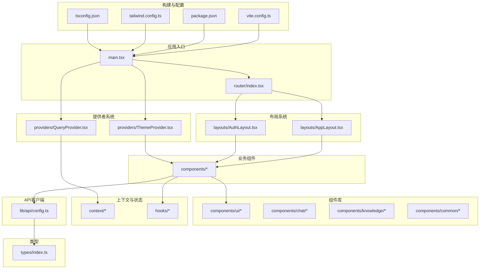
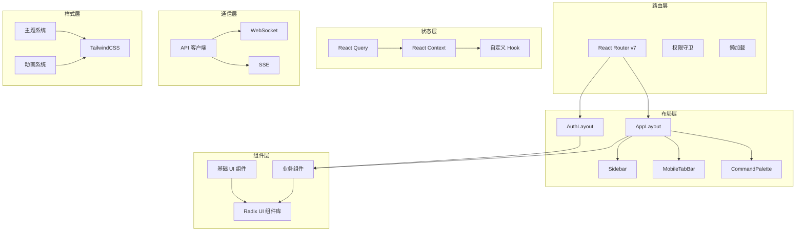
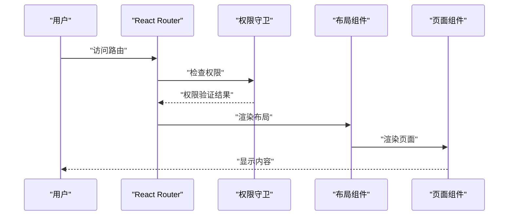
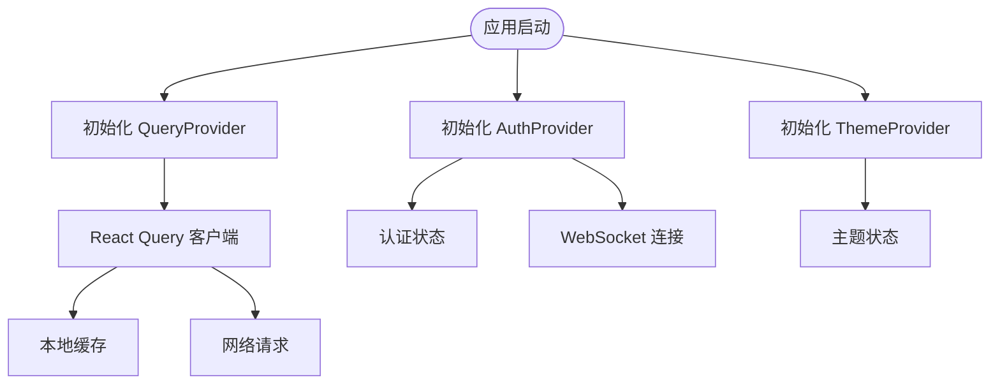
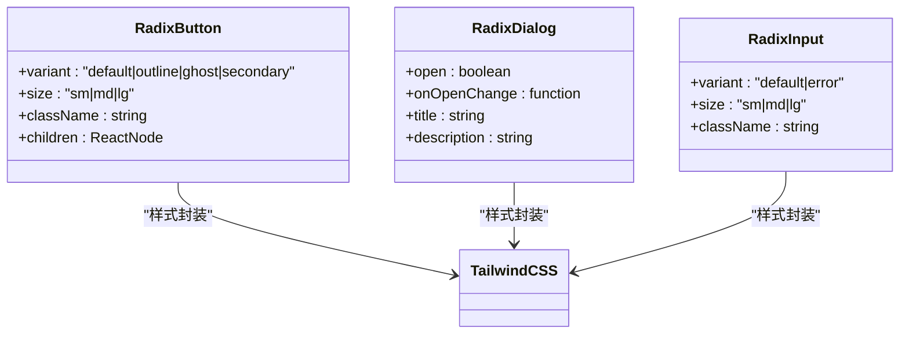
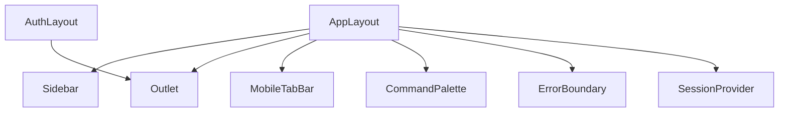
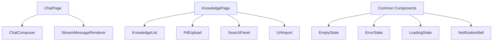
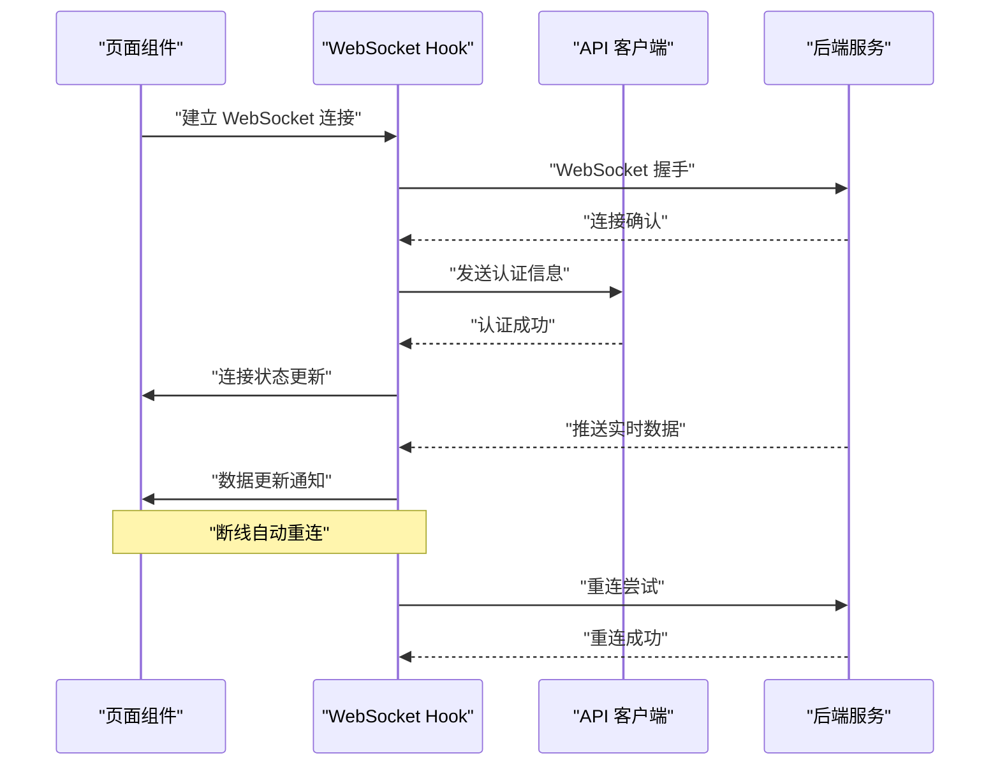
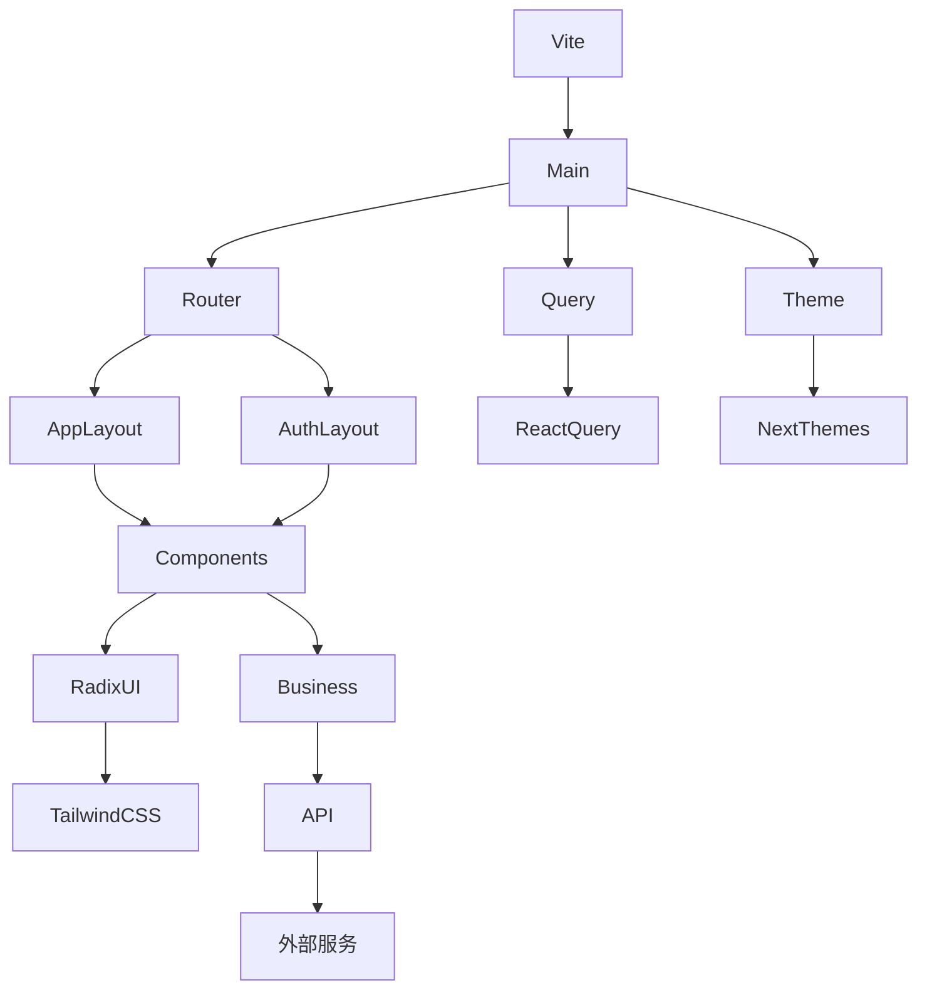

# 前端应用架构

<cite>
**本文引用的文件**
- [vite.config.ts](file://frontend/vite.config.ts)
- [package.json](file://frontend/package.json)
- [tailwind.config.ts](file://frontend/tailwind.config.ts)
- [main.tsx](file://frontend/src/main.tsx)
- [router/index.tsx](file://frontend/src/router/index.tsx)
- [layouts/AppLayout.tsx](file://frontend/src/layouts/AppLayout.tsx)
- [providers/QueryProvider.tsx](file://frontend/src/providers/QueryProvider.tsx)
- [providers/ThemeProvider.tsx](file://frontend/src/providers/ThemeProvider.tsx)
- [context/AuthContext.tsx](file://frontend/src/context/AuthContext.tsx)
- [components/ui/button.tsx](file://frontend/src/components/ui/button.tsx)
- [components/ui/dialog.tsx](file://frontend/src/components/ui/dialog.tsx)
- [components/ui/input.tsx](file://frontend/src/components/ui/input.tsx)
- [components/chat/ChatComposer.tsx](file://frontend/src/components/chat/ChatComposer.tsx)
- [components/chat/StreamMessageRenderer.tsx](file://frontend/src/components/chat/StreamMessageRenderer.tsx)
- [components/knowledge/KnowledgeList.tsx](file://frontend/src/components/knowledge/KnowledgeList.tsx)
- [hooks/useConfirm.tsx](file://frontend/src/hooks/useConfirm.tsx)
- [hooks/useSessions.ts](file://frontend/src/hooks/useSessions.ts)
- [hooks/useWebSocket.ts](file://frontend/src/hooks/useWebSocket.ts)
- [lib/api/config.ts](file://frontend/src/lib/api/config.ts)
- [types/index.ts](file://frontend/src/types/index.ts)
</cite>

## 更新摘要
**所做更改**
- 更新了现代化的组件库架构，采用 Radix UI 作为基础组件库
- 新增了 React Router v7 的路由系统和权限守卫机制
- 引入了 TanStack React Query 作为状态管理解决方案
- 重构了主题系统，采用 next-themes 实现深浅色主题切换
- 更新了构建配置，优化了代码分割和性能
- 新增了命令面板和会话管理功能
- 改进了 TailwindCSS 主题系统和动画配置

## 目录
1. [引言](#引言)
2. [项目结构](#项目结构)
3. [核心组件](#核心组件)
4. [架构总览](#架构总览)
5. [详细组件分析](#详细组件分析)
6. [依赖关系分析](#依赖关系分析)
7. [性能考虑](#性能考虑)
8. [故障排查指南](#故障排查指南)
9. [结论](#结论)
10. [附录](#附录)

## 引言
本文件面向避风港平台前端应用，系统性梳理 React 组件设计、现代化状态管理与路由系统、API 客户端统一配置与类型安全、错误处理机制、Radix UI 组件库设计原则与复用模式、TailwindCSS 样式体系、布局与响应式设计、用户体验优化、自定义 Hook 设计模式与最佳实践、WebSocket 与 SSE 实时通信实现，并提供组件开发指南、测试策略与性能优化建议。文档以"从基础组件到复杂页面"的完整开发流程为主线，帮助开发者快速理解并高效迭代。

**重要更新**：前端架构已完成全面现代化改造，采用最新的 React Router v7、TanStack React Query、Radix UI 组件库和现代化的构建配置，显著提升了开发体验和应用性能。

## 项目结构
前端采用 Vite + React 19 + TypeScript + TailwindCSS + Radix UI 技术栈，目录组织遵循"按功能域分层 + 组件库化 + 状态管理"的原则：
- 构建与配置：vite.config.ts、package.json、tailwind.config.ts、tsconfig.json
- 应用入口：main.tsx
- 路由系统：router/ 下的路由配置和权限守卫
- 布局系统：layouts/ 下的应用布局和认证布局
- 提供者系统：providers/ 下的状态提供者
- 上下文与状态：context/ 下全局状态管理
- 组件库：components/ui/ 下的 Radix UI 组件封装
- 业务组件：components/ 下的聊天、知识库等业务组件
- 自定义 Hook：hooks/ 下业务逻辑抽取
- API 客户端：lib/api/ 下统一配置
- 类型：types/ 下全局类型定义

**图表来源**
- [vite.config.ts](file://frontend/vite.config.ts)
- [package.json](file://frontend/package.json)
- [tailwind.config.ts](file://frontend/tailwind.config.ts)
- [main.tsx](file://frontend/src/main.tsx)
- [router/index.tsx](file://frontend/src/router/index.tsx)
- [layouts/AppLayout.tsx](file://frontend/src/layouts/AppLayout.tsx)
- [providers/QueryProvider.tsx](file://frontend/src/providers/QueryProvider.tsx)
- [providers/ThemeProvider.tsx](file://frontend/src/providers/ThemeProvider.tsx)
- [lib/api/config.ts](file://frontend/src/lib/api/config.ts)
- [types/index.ts](file://frontend/src/types/index.ts)

**章节来源**
- [vite.config.ts](file://frontend/vite.config.ts)
- [package.json](file://frontend/package.json)
- [tailwind.config.ts](file://frontend/tailwind.config.ts)
- [main.tsx](file://frontend/src/main.tsx)
- [router/index.tsx](file://frontend/src/router/index.tsx)

## 核心组件
- **现代化路由系统**
  - React Router v7 + 权限守卫：RequireAuth、RequireAdmin、PublicOnly
  - 懒加载路由：首屏关键页面直接导入，次要页面懒加载
  - 嵌套路由：应用布局和认证布局的嵌套结构
- **状态管理**
  - TanStack React Query：查询客户端和开发工具集成
  - React Context：认证状态、主题状态、会话状态
- **组件库**
  - Radix UI：Accordion、Avatar、Checkbox、Dialog、DropdownMenu、Label、Popover、Select、Separator、Slot、Tabs、Tooltip
  - 自定义封装：Button、Input、Dialog 等组件的样式增强
- **布局系统**
  - AppLayout：主应用布局，包含侧边栏、移动端标签栏、命令面板
  - AuthLayout：认证页面布局
- **业务组件**
  - ChatComposer：聊天输入组件
  - StreamMessageRenderer：消息渲染器
  - KnowledgeList：知识库列表组件
- **提供者系统**
  - QueryProvider：React Query 客户端提供者
  - ThemeProvider：主题提供者
  - AuthProvider：认证状态提供者
- **自定义 Hook**
  - useConfirm：确认对话框 Hook
  - useSessions：会话管理 Hook
  - useWebSocket：WebSocket 连接 Hook
- **API 客户端**
  - 统一配置：基地址、超时、拦截器、错误处理
- **类型系统**
  - 全局类型定义：认证用户、API 响应等类型

**章节来源**
- [router/index.tsx](file://frontend/src/router/index.tsx)
- [layouts/AppLayout.tsx](file://frontend/src/layouts/AppLayout.tsx)
- [providers/QueryProvider.tsx](file://frontend/src/providers/QueryProvider.tsx)
- [providers/ThemeProvider.tsx](file://frontend/src/providers/ThemeProvider.tsx)
- [context/AuthContext.tsx](file://frontend/src/context/AuthContext.tsx)
- [hooks/useConfirm.tsx](file://frontend/src/hooks/useConfirm.tsx)
- [hooks/useSessions.ts](file://frontend/src/hooks/useSessions.ts)
- [hooks/useWebSocket.ts](file://frontend/src/hooks/useWebSocket.ts)
- [lib/api/config.ts](file://frontend/src/lib/api/config.ts)
- [types/index.ts](file://frontend/src/types/index.ts)

## 架构总览
前端采用"现代化路由 + 组件库化 + 状态管理 + 提供者模式 + API 客户端统一"的架构模式：
- **路由层**：React Router v7 + 权限守卫 + 懒加载
- **布局层**：AppLayout + AuthLayout + 响应式设计
- **组件层**：Radix UI 组件库 + 业务组件 + 基础 UI 组件
- **状态层**：React Query + React Context + 自定义 Hook
- **通信层**：统一 API 客户端 + WebSocket + SSE
- **样式层**：TailwindCSS + Radix UI + 动画系统

**图表来源**
- [router/index.tsx](file://frontend/src/router/index.tsx)
- [layouts/AppLayout.tsx](file://frontend/src/layouts/AppLayout.tsx)
- [providers/QueryProvider.tsx](file://frontend/src/providers/QueryProvider.tsx)
- [providers/ThemeProvider.tsx](file://frontend/src/providers/ThemeProvider.tsx)
- [context/AuthContext.tsx](file://frontend/src/context/AuthContext.tsx)
- [lib/api/config.ts](file://frontend/src/lib/api/config.ts)

## 详细组件分析

### 现代化路由系统
- **React Router v7**：采用新的路由 API 和更好的类型安全
- **权限守卫**：RequireAuth（需要登录）、RequireAdmin（管理员权限）、PublicOnly（仅访客）
- **懒加载策略**：首屏关键页面直接导入，其他页面懒加载以优化性能
- **嵌套路由**：应用布局和认证布局的嵌套结构，支持复杂的页面层次

**图表来源**
- [router/index.tsx](file://frontend/src/router/index.tsx)

**章节来源**
- [router/index.tsx](file://frontend/src/router/index.tsx)

### 状态管理系统
- **TanStack React Query**：提供数据获取、缓存、同步和状态管理
- **React Context**：管理认证状态、主题状态、会话状态
- **自定义 Hook**：useConfirm、useSessions、useWebSocket 等业务逻辑封装
- **查询客户端配置**：默认过期时间、重试策略、窗口焦点重新获取

**图表来源**
- [providers/QueryProvider.tsx](file://frontend/src/providers/QueryProvider.tsx)
- [context/AuthContext.tsx](file://frontend/src/context/AuthContext.tsx)
- [providers/ThemeProvider.tsx](file://frontend/src/providers/ThemeProvider.tsx)

**章节来源**
- [providers/QueryProvider.tsx](file://frontend/src/providers/QueryProvider.tsx)
- [context/AuthContext.tsx](file://frontend/src/context/AuthContext.tsx)
- [providers/ThemeProvider.tsx](file://frontend/src/providers/ThemeProvider.tsx)

### Radix UI 组件库
- **基础组件**：Accordion、Avatar、Checkbox、Dialog、DropdownMenu、Label、Popover、Select、Separator、Slot、Tabs、Tooltip
- **样式增强**：基于 TailwindCSS 的样式封装，支持变体和条件样式
- **无障碍支持**：完整的 ARIA 标签和键盘导航支持
- **主题集成**：与 TailwindCSS 主题系统无缝集成

**图表来源**
- [components/ui/button.tsx](file://frontend/src/components/ui/button.tsx)
- [components/ui/dialog.tsx](file://frontend/src/components/ui/dialog.tsx)
- [components/ui/input.tsx](file://frontend/src/components/ui/input.tsx)

**章节来源**
- [components/ui/button.tsx](file://frontend/src/components/ui/button.tsx)
- [components/ui/dialog.tsx](file://frontend/src/components/ui/dialog.tsx)
- [components/ui/input.tsx](file://frontend/src/components/ui/input.tsx)

### 布局系统
- **AppLayout**：主应用布局，包含侧边栏、移动端标签栏、命令面板
- **AuthLayout**：认证页面布局，用于登录和注册页面
- **响应式设计**：基于 TailwindCSS 的响应式断点系统
- **会话管理**：集成会话提供者，支持会话状态管理

**图表来源**
- [layouts/AppLayout.tsx](file://frontend/src/layouts/AppLayout.tsx)

**章节来源**
- [layouts/AppLayout.tsx](file://frontend/src/layouts/AppLayout.tsx)

### 业务组件分析
- **聊天组件**：ChatComposer（聊天输入）、StreamMessageRenderer（消息渲染）
- **知识库组件**：KnowledgeList（知识库列表）、PdfUpload（PDF 上传）、SearchPanel（搜索面板）、UrlImport（URL 导入）
- **通用组件**：EmptyState（空状态）、ErrorState（错误状态）、LoadingState（加载状态）、NotificationBell（通知铃铛）

**图表来源**
- [components/chat/ChatComposer.tsx](file://frontend/src/components/chat/ChatComposer.tsx)
- [components/chat/StreamMessageRenderer.tsx](file://frontend/src/components/chat/StreamMessageRenderer.tsx)
- [components/knowledge/KnowledgeList.tsx](file://frontend/src/components/knowledge/KnowledgeList.tsx)

**章节来源**
- [components/chat/ChatComposer.tsx](file://frontend/src/components/chat/ChatComposer.tsx)
- [components/chat/StreamMessageRenderer.tsx](file://frontend/src/components/chat/StreamMessageRenderer.tsx)
- [components/knowledge/KnowledgeList.tsx](file://frontend/src/components/knowledge/KnowledgeList.tsx)

### 自定义 Hook 设计模式
- **useConfirm**：确认对话框 Hook，提供一致的确认交互体验
- **useSessions**：会话管理 Hook，处理会话状态和生命周期
- **useWebSocket**：WebSocket 连接 Hook，封装连接、重连和事件处理
- **设计原则**：副作用隔离、返回稳定接口、易于测试、可组合性

**章节来源**
- [hooks/useConfirm.tsx](file://frontend/src/hooks/useConfirm.tsx)
- [hooks/useSessions.ts](file://frontend/src/hooks/useSessions.ts)
- [hooks/useWebSocket.ts](file://frontend/src/hooks/useWebSocket.ts)

### API 客户端与类型安全
- **统一配置**：在 lib/api/config.ts 中集中设置基地址、超时、请求头、拦截器与错误处理策略
- **类型安全**：在 types/index.ts 中定义请求/响应类型，结合 React Query 实现编译期校验
- **错误处理**：统一捕获网络错误、业务错误与超时，结合通知系统展示用户可见提示
- **认证集成**：与 AuthContext 集成，自动添加认证头

**章节来源**
- [lib/api/config.ts](file://frontend/src/lib/api/config.ts)
- [types/index.ts](file://frontend/src/types/index.ts)
- [context/AuthContext.tsx](file://frontend/src/context/AuthContext.tsx)

### 实时通信系统
- **WebSocket**：useWebSocket Hook 管理连接、心跳、重连与事件广播
- **SSE**：与 API 客户端集成，支持服务端事件流
- **状态同步**：通过 React Query 和 Context 实现状态同步
- **错误处理**：断线重连、连接状态监控、错误提示

**图表来源**
- [hooks/useWebSocket.ts](file://frontend/src/hooks/useWebSocket.ts)
- [lib/api/config.ts](file://frontend/src/lib/api/config.ts)

**章节来源**
- [hooks/useWebSocket.ts](file://frontend/src/hooks/useWebSocket.ts)
- [lib/api/config.ts](file://frontend/src/lib/api/config.ts)

## 依赖关系分析
- **现代化依赖**：React 19、React Router v7、TanStack React Query、Radix UI、TailwindCSS
- **构建优化**：Vite 提供开发服务器与打包；代码分割和懒加载优化
- **组件生态**：Radix UI 作为基础组件库，提供完整的无障碍支持
- **状态管理**：React Query + Context 的混合状态管理模式
- **样式系统**：TailwindCSS + Radix UI + 动画插件的组合

**图表来源**
- [vite.config.ts](file://frontend/vite.config.ts)
- [main.tsx](file://frontend/src/main.tsx)
- [router/index.tsx](file://frontend/src/router/index.tsx)
- [providers/QueryProvider.tsx](file://frontend/src/providers/QueryProvider.tsx)
- [providers/ThemeProvider.tsx](file://frontend/src/providers/ThemeProvider.tsx)

**章节来源**
- [vite.config.ts](file://frontend/vite.config.ts)
- [package.json](file://frontend/package.json)
- [main.tsx](file://frontend/src/main.tsx)

## 性能考虑
- **路由性能**
  - 首屏关键页面直接导入，次要页面懒加载
  - 嵌套路由优化，避免不必要的重新渲染
- **组件性能**
  - React 19 的并发特性利用
  - Radix UI 组件的轻量级实现
  - TailwindCSS 的原子化样式减少 CSS 体积
- **状态管理性能**
  - React Query 的智能缓存和失效策略
  - 细粒度 Context 分割，避免全局重渲染
- **构建性能**
  - 手动代码分割：react-vendor、ui-radix、cmdk、lucide、utils
  - Chunk 文件名优化：页面路由特殊处理
  - Tree-shaking 和代码压缩
- **网络性能**
  - 请求缓存和去重
  - 防抖和节流策略
  - 连接池和重用机制

## 故障排查指南
- **路由问题**
  - 检查权限守卫配置是否正确
  - 验证懒加载组件的导入路径
  - 确认嵌套路由的布局组件设置
- **状态管理问题**
  - 检查 React Query 客户端配置
  - 验证 Context Provider 的嵌套顺序
  - 确认查询键和缓存策略
- **组件问题**
  - 检查 Radix UI 组件的属性传递
  - 验证 TailwindCSS 类名拼写
  - 确认组件的受控和非受控状态
- **构建问题**
  - 检查 Vite 配置和别名设置
  - 验证代码分割配置
  - 确认环境变量配置
- **性能问题**
  - 使用 React DevTools Profiler 分析渲染性能
  - 检查内存泄漏和未清理的订阅
  - 验证懒加载和代码分割效果

**章节来源**
- [router/index.tsx](file://frontend/src/router/index.tsx)
- [providers/QueryProvider.tsx](file://frontend/src/providers/QueryProvider.tsx)
- [vite.config.ts](file://frontend/vite.config.ts)

## 结论
避风港前端应用已完成全面现代化改造，采用 React Router v7、TanStack React Query、Radix UI 组件库和现代化的构建配置。新架构以"现代化路由 + 组件库化 + 状态管理 + 提供者模式 + API 客户端统一"为核心，结合 TailwindCSS 原子化样式、Radix UI 无障碍组件和响应式设计，形成高性能、可维护、用户体验优秀的前端体系。通过懒加载、代码分割、智能缓存和实时通信优化，能够支撑复杂业务场景下的持续演进和扩展。

## 附录
- **组件开发指南**
  - 命名规范：使用语义化的组件名称，遵循 PascalCase
  - Props 设计：使用 TypeScript 接口定义 Props，提供默认值
  - 样式系统：优先使用 TailwindCSS 类名，支持变体和条件样式
  - 无障碍支持：为所有交互元素提供 ARIA 标签和键盘支持
  - 文档编写：为复杂组件提供使用示例和 API 文档
- **测试策略**
  - 单元测试：使用 React Testing Library 测试组件行为
  - 集成测试：测试路由和状态管理的集成行为
  - 端到端测试：使用 Cypress 测试关键用户流程
  - 性能测试：监控关键指标和性能回归
- **性能优化建议**
  - 持续监控应用性能指标
  - 使用 React DevTools 分析渲染性能
  - 优化代码分割和懒加载策略
  - 实施智能缓存和数据预取
  - 监控网络请求和资源加载