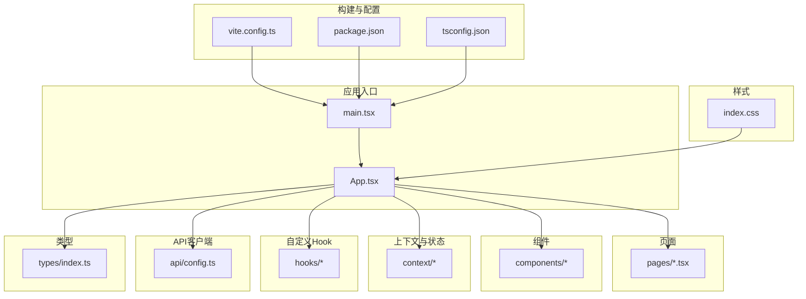
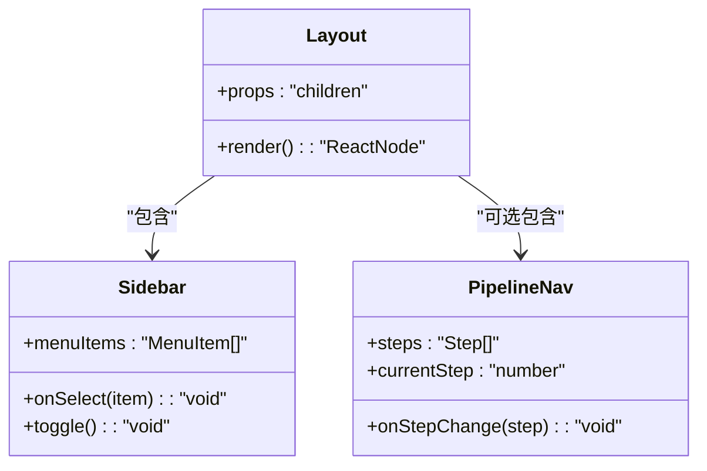
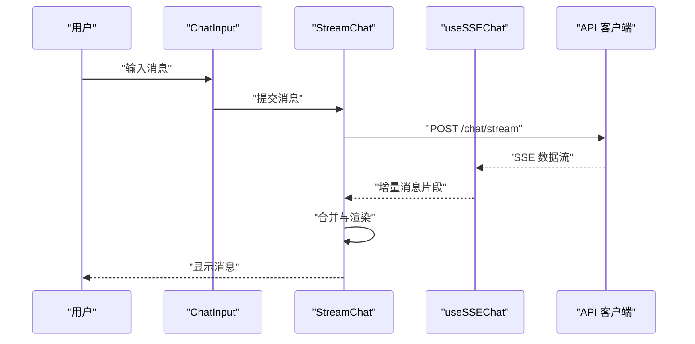
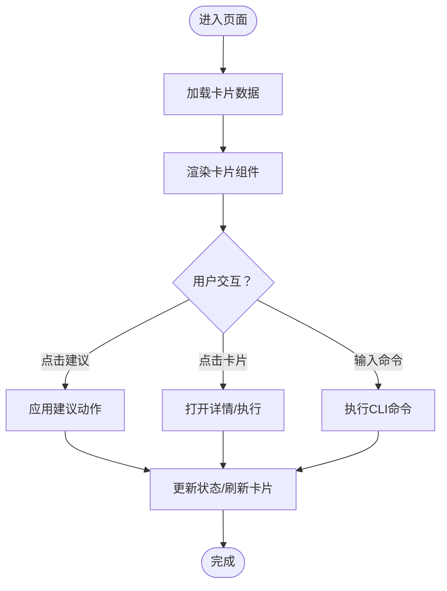
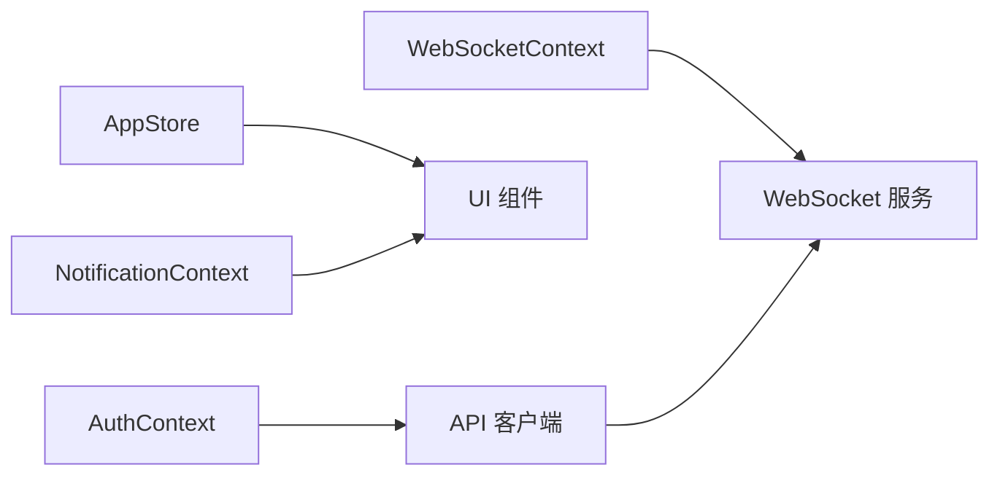
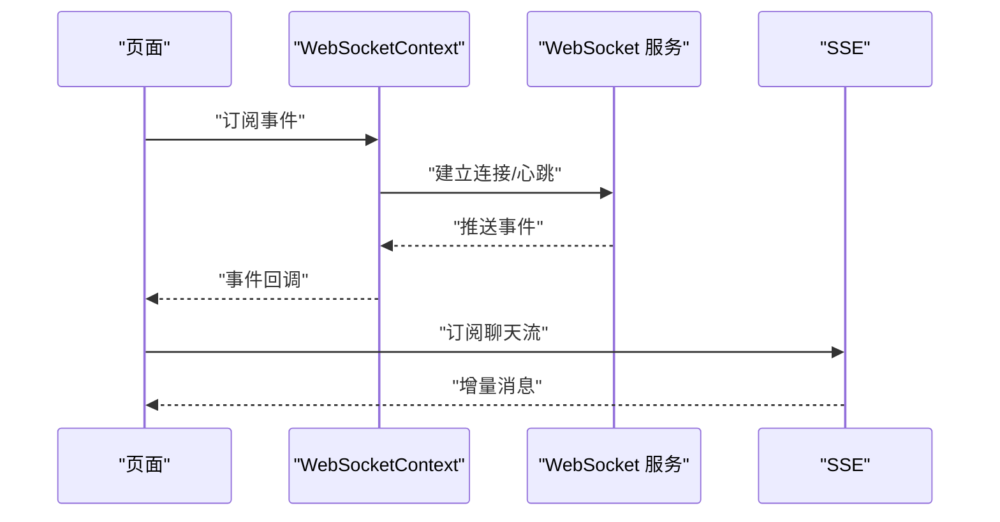
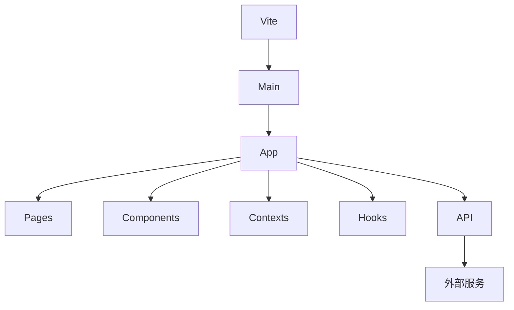

# 前端应用架构

<cite>
**本文引用的文件**
- [vite.config.ts](file://frontend/vite.config.ts)
- [package.json](file://frontend/package.json)
- [tsconfig.json](file://frontend/tsconfig.json)
- [index.css](file://frontend/src/index.css)
- [main.tsx](file://frontend/src/main.tsx)
- [App.tsx](file://frontend/src/App.tsx)
- [Layout.tsx](file://frontend/src/components/Layout.tsx)
- [Sidebar.tsx](file://frontend/src/components/Sidebar.tsx)
- [PipelineNav.tsx](file://frontend/src/components/PipelineNav.tsx)
- [StreamChat.tsx](file://frontend/src/components/StreamChat.tsx)
- [StreamMessageRenderer.tsx](file://frontend/src/components/StreamMessageRenderer.tsx)
- [ChatInput.tsx](file://frontend/src/components/ChatInput.tsx)
- [ProductCard.tsx](file://frontend/src/components/ProductCard.tsx)
- [ActionSuggestionCard.tsx](file://frontend/src/components/ActionSuggestionCard.tsx)
- [ThinkingBlock.tsx](file://frontend/src/components/ThinkingBlock.tsx)
- [PlanBlock.tsx](file://frontend/src/components/PlanBlock.tsx)
- [SkillEventBlock.tsx](file://frontend/src/components/SkillEventBlock.tsx)
- [ToolPanel.tsx](file://frontend/src/components/ToolPanel.tsx)
- [AgentSelector.tsx](file://frontend/src/components/AgentSelector.tsx)
- [CLICommandInput.tsx](file://frontend/src/components/CLICommandInput.tsx)
- [CLICommandResult.tsx](file://frontend/src/components/CLICommandResult.tsx)
- [ExecutionResult.tsx](file://frontend/src/components/ExecutionResult.tsx)
- [EventTimeline.tsx](file://frontend/src/components/EventTimeline.tsx)
- [DailyBrief.tsx](file://frontend/src/components/DailyBrief.tsx)
- [NotificationCenter.tsx](file://frontend/src/components/NotificationCenter.tsx)
- [ToastNotification.tsx](file://frontend/src/components/ToastNotification.tsx)
- [SkillPanel.tsx](file://frontend/src/components/SkillPanel.tsx)
- [AuthContext.tsx](file://frontend/src/context/AuthContext.tsx)
- [AppStore.tsx](file://frontend/src/context/AppStore.tsx)
- [NotificationContext.tsx](file://frontend/src/context/NotificationContext.tsx)
- [WebSocketContext.tsx](file://frontend/src/context/WebSocketContext.tsx)
- [useSSEChat.ts](file://frontend/src/hooks/useSSEChat.ts)
- [config.ts](file://frontend/src/api/config.ts)
- [index.ts](file://frontend/src/types/index.ts)
- [LoginPage.tsx](file://frontend/src/pages/LoginPage.tsx)
- [OverviewPage.tsx](file://frontend/src/pages/OverviewPage.tsx)
- [ProductListPage.tsx](file://frontend/src/pages/ProductListPage.tsx)
- [ProductChatPage.tsx](file://frontend/src/pages/ProductChatPage.tsx)
- [KnowledgePage.tsx](file://frontend/src/pages/KnowledgePage.tsx)
- [MetricsPage.tsx](file://frontend/src/pages/MetricsPage.tsx)
- [SystemCompliancePage.tsx](file://frontend/src/pages/SystemCompliancePage.tsx)
- [RiskCenter.tsx](file://frontend/src/pages/RiskCenter.tsx)
- [MemoryTreePage.tsx](file://frontend/src/pages/MemoryTreePage.tsx)
- [IntegrationPage.tsx](file://frontend/src/pages/IntegrationPage.tsx)
- [AgentMonitorPage.tsx](file://frontend/src/pages/AgentMonitorPage.tsx)
- [UserManagePage.tsx](file://frontend/src/pages/UserManagePage.tsx)
</cite>

## 目录
1. [引言](#引言)
2. [项目结构](#项目结构)
3. [核心组件](#核心组件)
4. [架构总览](#架构总览)
5. [详细组件分析](#详细组件分析)
6. [依赖关系分析](#依赖关系分析)
7. [性能考虑](#性能考虑)
8. [故障排查指南](#故障排查指南)
9. [结论](#结论)
10. [附录](#附录)

## 引言
本文件面向避风港平台前端应用，系统性梳理 React 组件设计、状态管理与页面路由、API 客户端统一配置与类型安全、错误处理机制、组件库设计原则与复用模式、TailwindCSS 样式体系、布局与响应式设计、用户体验优化、自定义 Hook 设计模式与最佳实践、WebSocket 与 SSE 实时通信实现，并提供组件开发指南、测试策略与性能优化建议。文档以“从基础组件到复杂页面”的完整开发流程为主线，帮助开发者快速理解并高效迭代。

## 项目结构
前端采用 Vite + React + TypeScript + TailwindCSS 技术栈，目录组织遵循“按功能域分层 + 类型集中”的原则：
- 构建与配置：vite.config.ts、package.json、tsconfig.json
- 应用入口：main.tsx、App.tsx
- 样式：index.css
- 页面：pages 下各业务页面
- 组件：components 下通用与业务组件
- 上下文与状态：context 下全局状态与通信上下文
- 自定义 Hook：hooks 下业务逻辑抽取
- API 客户端：api 下统一配置
- 类型：types 下全局类型定义

图表来源
- [vite.config.ts](file://frontend/vite.config.ts)
- [package.json](file://frontend/package.json)
- [tsconfig.json](file://frontend/tsconfig.json)
- [main.tsx](file://frontend/src/main.tsx)
- [App.tsx](file://frontend/src/App.tsx)
- [index.css](file://frontend/src/index.css)
- [config.ts](file://frontend/src/api/config.ts)
- [index.ts](file://frontend/src/types/index.ts)

章节来源
- [vite.config.ts](file://frontend/vite.config.ts)
- [package.json](file://frontend/package.json)
- [tsconfig.json](file://frontend/tsconfig.json)
- [main.tsx](file://frontend/src/main.tsx)
- [App.tsx](file://frontend/src/App.tsx)
- [index.css](file://frontend/src/index.css)

## 核心组件
- 布局与导航
  - Layout：容器与栅格布局骨架
  - Sidebar：侧边栏导航
  - PipelineNav：流水线导航
- 会话与消息
  - StreamChat：流式对话容器
  - StreamMessageRenderer：消息渲染器
  - ChatInput：输入框
- 业务卡片与面板
  - ProductCard：产品卡片
  - ActionSuggestionCard：行动建议卡片
  - ThinkingBlock：思考过程块
  - PlanBlock：计划块
  - SkillEventBlock：技能事件块
  - ToolPanel：工具面板
  - AgentSelector：智能体选择器
  - CLICommandInput/CLICommandResult：命令行交互
  - ExecutionResult：执行结果展示
  - EventTimeline：事件时间线
  - DailyBrief：每日简报
  - NotificationCenter/ToastNotification：通知中心与气泡提示
  - SkillPanel：技能面板
- 上下文与状态
  - AuthContext：认证上下文
  - AppStore：应用状态（如主题、语言等）
  - NotificationContext：通知上下文
  - WebSocketContext：WebSocket 连接上下文
- 自定义 Hook
  - useSSEChat：SSE 聊天流处理
- API 客户端
  - config.ts：统一 API 客户端配置（基地址、超时、拦截器等）
- 类型
  - index.ts：全局类型定义

章节来源
- [Layout.tsx](file://frontend/src/components/Layout.tsx)
- [Sidebar.tsx](file://frontend/src/components/Sidebar.tsx)
- [PipelineNav.tsx](file://frontend/src/components/PipelineNav.tsx)
- [StreamChat.tsx](file://frontend/src/components/StreamChat.tsx)
- [StreamMessageRenderer.tsx](file://frontend/src/components/StreamMessageRenderer.tsx)
- [ChatInput.tsx](file://frontend/src/components/ChatInput.tsx)
- [ProductCard.tsx](file://frontend/src/components/ProductCard.tsx)
- [ActionSuggestionCard.tsx](file://frontend/src/components/ActionSuggestionCard.tsx)
- [ThinkingBlock.tsx](file://frontend/src/components/ThinkingBlock.tsx)
- [PlanBlock.tsx](file://frontend/src/components/PlanBlock.tsx)
- [SkillEventBlock.tsx](file://frontend/src/components/SkillEventBlock.tsx)
- [ToolPanel.tsx](file://frontend/src/components/ToolPanel.tsx)
- [AgentSelector.tsx](file://frontend/src/components/AgentSelector.tsx)
- [CLICommandInput.tsx](file://frontend/src/components/CLICommandInput.tsx)
- [CLICommandResult.tsx](file://frontend/src/components/CLICommandResult.tsx)
- [ExecutionResult.tsx](file://frontend/src/components/ExecutionResult.tsx)
- [EventTimeline.tsx](file://frontend/src/components/EventTimeline.tsx)
- [DailyBrief.tsx](file://frontend/src/components/DailyBrief.tsx)
- [NotificationCenter.tsx](file://frontend/src/components/NotificationCenter.tsx)
- [ToastNotification.tsx](file://frontend/src/components/ToastNotification.tsx)
- [SkillPanel.tsx](file://frontend/src/components/SkillPanel.tsx)
- [AuthContext.tsx](file://frontend/src/context/AuthContext.tsx)
- [AppStore.tsx](file://frontend/src/context/AppStore.tsx)
- [NotificationContext.tsx](file://frontend/src/context/NotificationContext.tsx)
- [WebSocketContext.tsx](file://frontend/src/context/WebSocketContext.tsx)
- [useSSEChat.ts](file://frontend/src/hooks/useSSEChat.ts)
- [config.ts](file://frontend/src/api/config.ts)
- [index.ts](file://frontend/src/types/index.ts)

## 架构总览
前端采用“页面驱动 + 组件复用 + 上下文共享 + Hook 抽象 + API 客户端统一”的架构模式：
- 页面层：按业务划分页面，负责编排组件与上下文
- 组件层：通用基础组件与业务组件，强调可组合与可复用
- 状态层：通过 React Context 管理认证、应用状态、通知与实时连接
- 通信层：统一 API 客户端 + SSE/WS 实时通道
- 样式层：TailwindCSS 提供原子化样式与主题扩展

```mermaid
graph TB
subgraph "页面层"
P1["OverviewPage"]
P2["ProductListPage"]
P3["ProductChatPage"]
P4["KnowledgePage"]
P5["MetricsPage"]
P6["SystemCompliancePage"]
P7["RiskCenter"]
P8["MemoryTreePage"]
P9["IntegrationPage"]
P10["AgentMonitorPage"]
P11["UserManagePage"]
P12["LoginPage"]
end
subgraph "组件层"
L["Layout"]
S["Sidebar"]
PN["PipelineNav"]
SC["StreamChat"]
SMR["StreamMessageRenderer"]
CI["ChatInput"]
PC["ProductCard"]
ASC["ActionSuggestionCard"]
TB["ThinkingBlock"]
PB["PlanBlock"]
SEB["SkillEventBlock"]
TP["ToolPanel"]
AS["AgentSelector"]
CLI["CLICommandInput"]
CLR["CLICommandResult"]
ER["ExecutionResult"]
ET["EventTimeline"]
DB["DailyBrief"]
NC["NotificationCenter"]
TN["ToastNotification"]
SP["SkillPanel"]
end
subgraph "状态层"
AC["AuthContext"]
AS_CTX["AppStore"]
NCTX["NotificationContext"]
WSC["WebSocketContext"]
end
subgraph "通信层"
API["API 客户端(config.ts)"]
SSE["useSSEChat"]
end
P1 --> L
P2 --> L
P3 --> L
P4 --> L
P5 --> L
P6 --> L
P7 --> L
P8 --> L
P9 --> L
P10 --> L
P11 --> L
P12 --> L
L --> S
L --> PN
P3 --> SC
SC --> SMR
SC --> CI
P2 --> PC
P1 --> ASC
P1 --> TB
P1 --> PB
P1 --> SEB
P4 --> TP
P10 --> AS
P9 --> CLI
P9 --> CLR
P8 --> ER
P1 --> ET
P1 --> DB
P1 --> NC
P1 --> TN
P4 --> SP
AC --> API
NCTX --> API
WSC --> API
SSE --> API
```

图表来源
- [App.tsx](file://frontend/src/App.tsx)
- [Layout.tsx](file://frontend/src/components/Layout.tsx)
- [Sidebar.tsx](file://frontend/src/components/Sidebar.tsx)
- [PipelineNav.tsx](file://frontend/src/components/PipelineNav.tsx)
- [StreamChat.tsx](file://frontend/src/components/StreamChat.tsx)
- [StreamMessageRenderer.tsx](file://frontend/src/components/StreamMessageRenderer.tsx)
- [ChatInput.tsx](file://frontend/src/components/ChatInput.tsx)
- [ProductCard.tsx](file://frontend/src/components/ProductCard.tsx)
- [ActionSuggestionCard.tsx](file://frontend/src/components/ActionSuggestionCard.tsx)
- [ThinkingBlock.tsx](file://frontend/src/components/ThinkingBlock.tsx)
- [PlanBlock.tsx](file://frontend/src/components/PlanBlock.tsx)
- [SkillEventBlock.tsx](file://frontend/src/components/SkillEventBlock.tsx)
- [ToolPanel.tsx](file://frontend/src/components/ToolPanel.tsx)
- [AgentSelector.tsx](file://frontend/src/components/AgentSelector.tsx)
- [CLICommandInput.tsx](file://frontend/src/components/CLICommandInput.tsx)
- [CLICommandResult.tsx](file://frontend/src/components/CLICommandResult.tsx)
- [ExecutionResult.tsx](file://frontend/src/components/ExecutionResult.tsx)
- [EventTimeline.tsx](file://frontend/src/components/EventTimeline.tsx)
- [DailyBrief.tsx](file://frontend/src/components/DailyBrief.tsx)
- [NotificationCenter.tsx](file://frontend/src/components/NotificationCenter.tsx)
- [ToastNotification.tsx](file://frontend/src/components/ToastNotification.tsx)
- [SkillPanel.tsx](file://frontend/src/components/SkillPanel.tsx)
- [AuthContext.tsx](file://frontend/src/context/AuthContext.tsx)
- [AppStore.tsx](file://frontend/src/context/AppStore.tsx)
- [NotificationContext.tsx](file://frontend/src/context/NotificationContext.tsx)
- [WebSocketContext.tsx](file://frontend/src/context/WebSocketContext.tsx)
- [useSSEChat.ts](file://frontend/src/hooks/useSSEChat.ts)
- [config.ts](file://frontend/src/api/config.ts)

## 详细组件分析

### 布局与导航系统
- Layout：提供页面骨架、网格与响应式断点；作为页面容器承载 Sidebar 与主内容区
- Sidebar：基于路由生成导航项，支持折叠/展开与当前页高亮
- PipelineNav：在多阶段流程中提供步骤导航与进度指示

图表来源
- [Layout.tsx](file://frontend/src/components/Layout.tsx)
- [Sidebar.tsx](file://frontend/src/components/Sidebar.tsx)
- [PipelineNav.tsx](file://frontend/src/components/PipelineNav.tsx)

章节来源
- [Layout.tsx](file://frontend/src/components/Layout.tsx)
- [Sidebar.tsx](file://frontend/src/components/Sidebar.tsx)
- [PipelineNav.tsx](file://frontend/src/components/PipelineNav.tsx)

### 会话与消息流
- StreamChat：封装流式消息容器，负责消息列表、滚动、发送与接收
- StreamMessageRenderer：根据消息类型渲染文本、代码、富媒体等
- ChatInput：支持文本输入、快捷操作、附件上传与发送控制
- useSSEChat：封装 SSE 连接与事件解析，提供订阅/取消订阅能力

图表来源
- [ChatInput.tsx](file://frontend/src/components/ChatInput.tsx)
- [StreamChat.tsx](file://frontend/src/components/StreamChat.tsx)
- [useSSEChat.ts](file://frontend/src/hooks/useSSEChat.ts)
- [config.ts](file://frontend/src/api/config.ts)

章节来源
- [StreamChat.tsx](file://frontend/src/components/StreamChat.tsx)
- [StreamMessageRenderer.tsx](file://frontend/src/components/StreamMessageRenderer.tsx)
- [ChatInput.tsx](file://frontend/src/components/ChatInput.tsx)
- [useSSEChat.ts](file://frontend/src/hooks/useSSEChat.ts)

### 业务卡片与面板
- ProductCard：展示产品信息、状态与操作按钮
- ActionSuggestionCard：基于规则或模型给出行动建议
- ThinkingBlock/PlanBlock/SkillEventBlock：可视化思考链、计划与事件
- ToolPanel/AgentSelector：工具与智能体选择
- CLICommandInput/CLICommandResult：命令行交互与结果展示
- ExecutionResult/EventTimeline/DailyBrief：执行结果、事件时间线与每日简报
- NotificationCenter/ToastNotification：通知中心与气泡提示
- SkillPanel：技能面板

图表来源
- [ProductCard.tsx](file://frontend/src/components/ProductCard.tsx)
- [ActionSuggestionCard.tsx](file://frontend/src/components/ActionSuggestionCard.tsx)
- [ThinkingBlock.tsx](file://frontend/src/components/ThinkingBlock.tsx)
- [PlanBlock.tsx](file://frontend/src/components/PlanBlock.tsx)
- [SkillEventBlock.tsx](file://frontend/src/components/SkillEventBlock.tsx)
- [ToolPanel.tsx](file://frontend/src/components/ToolPanel.tsx)
- [AgentSelector.tsx](file://frontend/src/components/AgentSelector.tsx)
- [CLICommandInput.tsx](file://frontend/src/components/CLICommandInput.tsx)
- [CLICommandResult.tsx](file://frontend/src/components/CLICommandResult.tsx)
- [ExecutionResult.tsx](file://frontend/src/components/ExecutionResult.tsx)
- [EventTimeline.tsx](file://frontend/src/components/EventTimeline.tsx)
- [DailyBrief.tsx](file://frontend/src/components/DailyBrief.tsx)
- [NotificationCenter.tsx](file://frontend/src/components/NotificationCenter.tsx)
- [ToastNotification.tsx](file://frontend/src/components/ToastNotification.tsx)
- [SkillPanel.tsx](file://frontend/src/components/SkillPanel.tsx)

章节来源
- [ProductCard.tsx](file://frontend/src/components/ProductCard.tsx)
- [ActionSuggestionCard.tsx](file://frontend/src/components/ActionSuggestionCard.tsx)
- [ThinkingBlock.tsx](file://frontend/src/components/ThinkingBlock.tsx)
- [PlanBlock.tsx](file://frontend/src/components/PlanBlock.tsx)
- [SkillEventBlock.tsx](file://frontend/src/components/SkillEventBlock.tsx)
- [ToolPanel.tsx](file://frontend/src/components/ToolPanel.tsx)
- [AgentSelector.tsx](file://frontend/src/components/AgentSelector.tsx)
- [CLICommandInput.tsx](file://frontend/src/components/CLICommandInput.tsx)
- [CLICommandResult.tsx](file://frontend/src/components/CLICommandResult.tsx)
- [ExecutionResult.tsx](file://frontend/src/components/ExecutionResult.tsx)
- [EventTimeline.tsx](file://frontend/src/components/EventTimeline.tsx)
- [DailyBrief.tsx](file://frontend/src/components/DailyBrief.tsx)
- [NotificationCenter.tsx](file://frontend/src/components/NotificationCenter.tsx)
- [ToastNotification.tsx](file://frontend/src/components/ToastNotification.tsx)
- [SkillPanel.tsx](file://frontend/src/components/SkillPanel.tsx)

### 上下文与状态管理
- AuthContext：登录态、权限与鉴权拦截
- AppStore：主题、语言、布局偏好等应用级状态
- NotificationContext：通知队列、去重与自动消失
- WebSocketContext：长连接生命周期、重连与事件派发

图表来源
- [AuthContext.tsx](file://frontend/src/context/AuthContext.tsx)
- [AppStore.tsx](file://frontend/src/context/AppStore.tsx)
- [NotificationContext.tsx](file://frontend/src/context/NotificationContext.tsx)
- [WebSocketContext.tsx](file://frontend/src/context/WebSocketContext.tsx)
- [config.ts](file://frontend/src/api/config.ts)

章节来源
- [AuthContext.tsx](file://frontend/src/context/AuthContext.tsx)
- [AppStore.tsx](file://frontend/src/context/AppStore.tsx)
- [NotificationContext.tsx](file://frontend/src/context/NotificationContext.tsx)
- [WebSocketContext.tsx](file://frontend/src/context/WebSocketContext.tsx)

### 自定义 Hook 设计模式
- useSSEChat：封装 SSE 订阅、错误处理与清理，暴露 subscribe/unsubscribe 与消息队列
- 其他 Hook 建议：useLocalStorage、useDebounce、useIntersectionObserver 等，遵循“副作用隔离 + 返回稳定接口 + 易于测试”的原则

章节来源
- [useSSEChat.ts](file://frontend/src/hooks/useSSEChat.ts)

### API 客户端与类型安全
- 统一配置：在 config.ts 中集中设置基地址、超时、请求头、拦截器与错误处理策略
- 类型安全：在 types/index.ts 中定义请求/响应类型，结合 React Query 或自研请求库实现编译期校验
- 错误处理：统一捕获网络错误、业务错误与超时，结合 NotificationContext 展示用户可见提示

章节来源
- [config.ts](file://frontend/src/api/config.ts)
- [index.ts](file://frontend/src/types/index.ts)

### 实时通信：WebSocket 与 SSE
- SSE：useSSEChat 订阅服务端事件流，按消息类型分发至消息渲染器
- WebSocket：WebSocketContext 管理连接、心跳、重连与事件广播，供页面与组件订阅

图表来源
- [WebSocketContext.tsx](file://frontend/src/context/WebSocketContext.tsx)
- [useSSEChat.ts](file://frontend/src/hooks/useSSEChat.ts)

章节来源
- [WebSocketContext.tsx](file://frontend/src/context/WebSocketContext.tsx)
- [useSSEChat.ts](file://frontend/src/hooks/useSSEChat.ts)

## 依赖关系分析
- 构建与运行时：Vite 提供开发服务器与打包；TypeScript 提供类型检查；TailwindCSS 提供样式
- 组件与页面：页面依赖布局与导航组件；业务页面组合卡片与面板组件
- 状态与通信：上下文为组件提供共享状态；Hook 将业务逻辑抽象为可复用单元；API 客户端统一出入口
- 外部依赖：React 生态、TailwindCSS、可选的 React Router（页面路由）、Axios/Fetch（HTTP 客户端）

图表来源
- [vite.config.ts](file://frontend/vite.config.ts)
- [main.tsx](file://frontend/src/main.tsx)
- [App.tsx](file://frontend/src/App.tsx)
- [config.ts](file://frontend/src/api/config.ts)

章节来源
- [vite.config.ts](file://frontend/vite.config.ts)
- [package.json](file://frontend/package.json)
- [tsconfig.json](file://frontend/tsconfig.json)
- [main.tsx](file://frontend/src/main.tsx)
- [App.tsx](file://frontend/src/App.tsx)
- [config.ts](file://frontend/src/api/config.ts)

## 性能考虑
- 组件层面
  - 使用 React.memo、useMemo、useCallback 缓存计算与渲染
  - 列表虚拟化：对长列表使用 react-window 或类似方案
  - 图片懒加载与尺寸适配：避免阻塞主线程
- 状态层面
  - 分离细粒度状态，避免不必要的重渲染
  - 使用 Context 仅暴露必要字段，减少订阅范围
- 网络层面
  - 请求合并与防抖：减少重复请求
  - 缓存策略：本地缓存 + 服务端 ETag/Cache-Control
- 样式层面
  - Tailwind 原子类优先，避免内联样式；按需引入样式模块
- 构建层面
  - Tree-shaking：确保未使用代码被移除
  - 代码分割：路由级懒加载与动态导入

## 故障排查指南
- 登录与鉴权
  - 检查 AuthContext 的令牌存储与刷新逻辑
  - 关注 API 客户端拦截器中的 401/403 处理
- SSE 与 WebSocket
  - useSSEChat 是否正确订阅；SSE 地址与认证头是否正确
  - WebSocketContext 是否处理了断线重连与心跳
- 错误提示
  - NotificationContext 是否正确入队与去重
  - 用户可感知的错误文案与重试按钮
- 性能问题
  - 使用 React DevTools Profiler 定位重渲染热点
  - 检查是否存在过度的 useEffect 依赖或无限循环

章节来源
- [AuthContext.tsx](file://frontend/src/context/AuthContext.tsx)
- [NotificationContext.tsx](file://frontend/src/context/NotificationContext.tsx)
- [WebSocketContext.tsx](file://frontend/src/context/WebSocketContext.tsx)
- [useSSEChat.ts](file://frontend/src/hooks/useSSEChat.ts)

## 结论
避风港前端以“页面驱动 + 组件复用 + 上下文共享 + Hook 抽象 + API 客户端统一”为核心架构，结合 TailwindCSS 原子化样式与响应式设计，形成高可维护、可扩展且用户体验友好的前端体系。通过 SSE/WS 实现实时交互，配合完善的错误处理与性能优化策略，能够支撑复杂业务场景下的持续演进。

## 附录
- 组件开发指南
  - 命名规范：语义化组件名，Props 与事件命名清晰
  - 可访问性：为交互元素提供 aria 标签与键盘支持
  - 文档与示例：为复杂组件提供 Storybook 示例与使用说明
- 测试策略
  - 单元测试：针对 Hook 与纯函数进行快照与行为测试
  - 组件测试：使用 React Testing Library 验证交互与渲染
  - 端到端测试：Cypress/Playwright 覆盖关键业务流程
- 性能优化建议
  - 持续监控首屏时间与交互延迟
  - 对高频渲染组件进行拆分与缓存
  - 使用 Profiler 识别并解决渲染瓶颈