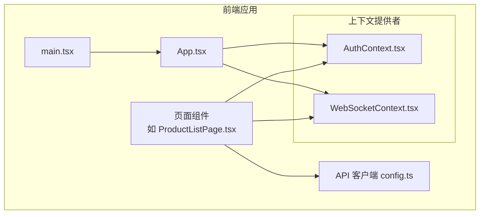
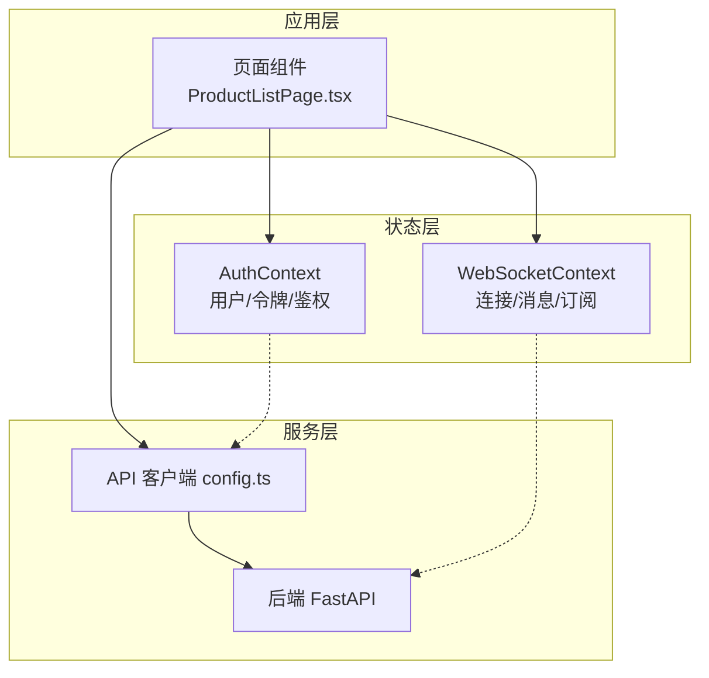
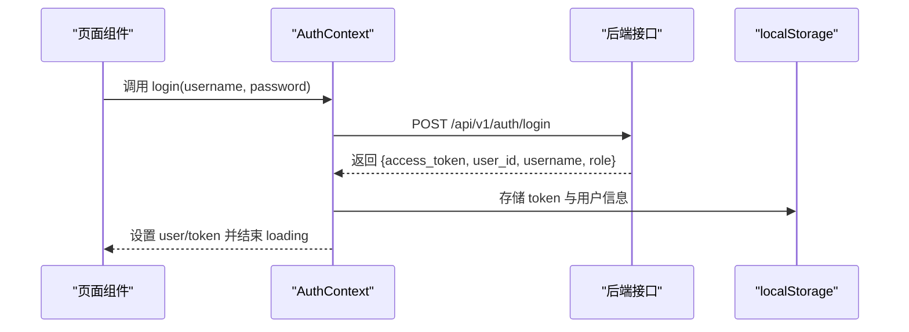
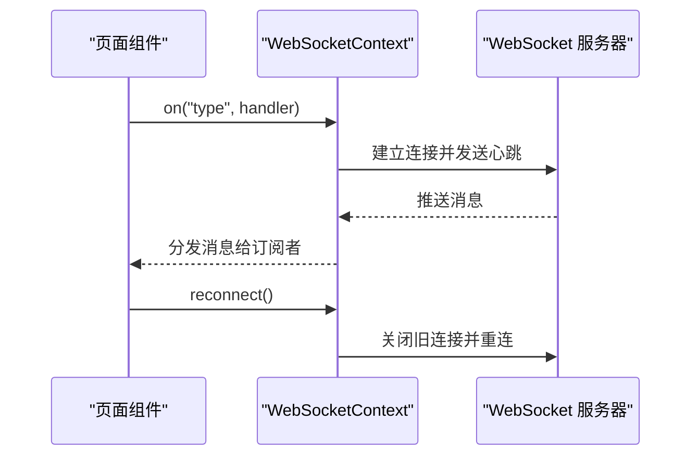
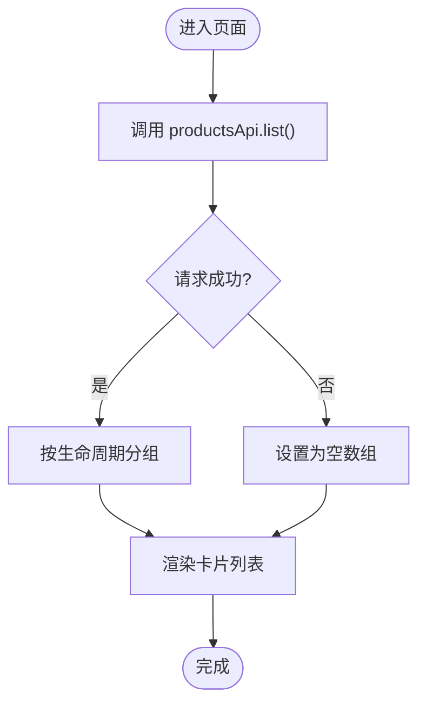
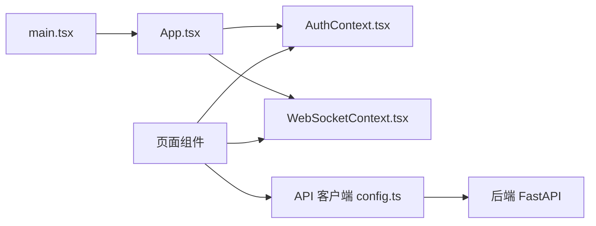

# 状态管理

<cite>
**本文引用的文件**
- [AuthContext.tsx](file://frontend/src/context/AuthContext.tsx)
- [WebSocketContext.tsx](file://frontend/src/context/WebSocketContext.tsx)
- [App.tsx](file://frontend/src/App.tsx)
- [main.tsx](file://frontend/src/main.tsx)
- [ProductListPage.tsx](file://frontend/src/pages/ProductListPage.tsx)
- [config.ts](file://frontend/src/api/config.ts)
- [前后端api交互.md](file://前后端api交互.md)
</cite>

## 目录
1. [简介](#简介)
2. [项目结构](#项目结构)
3. [核心组件](#核心组件)
4. [架构总览](#架构总览)
5. [详细组件分析](#详细组件分析)
6. [依赖分析](#依赖分析)
7. [性能考虑](#性能考虑)
8. [故障排查指南](#故障排查指南)
9. [结论](#结论)
10. [附录](#附录)

## 简介
本文件面向避风港平台的前端状态管理，聚焦于 Context API 的使用模式、状态提升策略与组件间数据共享机制。文档覆盖应用状态（通过 Context 提供）、认证状态（AuthContext）与 WebSocket 状态（WebSocketContext）的管理方式，并结合仓库中已实现的代码，阐述状态持久化（localStorage）、状态恢复、最佳实践、性能优化与内存泄漏防护。同时给出自定义 Hook 设计模式、状态订阅机制与调试建议，以及全局状态与局部状态的划分原则。

## 项目结构
前端采用 React SPA 架构，状态管理主要由 Context Provider 组成，配合 API 客户端层进行数据访问。页面组件通过自定义 Hook 订阅状态，实现跨层级的数据共享与控制流。

**图表来源**
- [App.tsx](file://frontend/src/App.tsx)
- [main.tsx](file://frontend/src/main.tsx)
- [AuthContext.tsx](file://frontend/src/context/AuthContext.tsx)
- [WebSocketContext.tsx](file://frontend/src/context/WebSocketContext.tsx)
- [ProductListPage.tsx](file://frontend/src/pages/ProductListPage.tsx)
- [config.ts](file://frontend/src/api/config.ts)

**章节来源**
- [App.tsx](file://frontend/src/App.tsx)
- [main.tsx](file://frontend/src/main.tsx)
- [AuthContext.tsx](file://frontend/src/context/AuthContext.tsx)
- [WebSocketContext.tsx](file://frontend/src/context/WebSocketContext.tsx)
- [ProductListPage.tsx](file://frontend/src/pages/ProductListPage.tsx)
- [config.ts](file://frontend/src/api/config.ts)

## 核心组件
- 认证上下文（AuthContext）
  - 管理用户信息、令牌、管理员标识与加载状态
  - 提供登录、登出与带鉴权头的请求封装
  - 支持启动时从 localStorage 恢复状态
- WebSocket 上下文（WebSocketContext）
  - 管理连接状态、最后一条消息与重连逻辑
  - 提供事件订阅（on）与取消订阅能力
  - 内置心跳与自动重连机制
- 页面与 Hook
  - 页面组件通过 API 客户端拉取数据，结合上下文状态进行渲染与交互
  - 可扩展自定义 Hook 实现状态订阅与副作用管理

**章节来源**
- [AuthContext.tsx](file://frontend/src/context/AuthContext.tsx)
- [WebSocketContext.tsx](file://frontend/src/context/WebSocketContext.tsx)
- [ProductListPage.tsx](file://frontend/src/pages/ProductListPage.tsx)
- [config.ts](file://frontend/src/api/config.ts)

## 架构总览
下图展示前端应用、上下文提供者与 API 层之间的关系，以及认证与 WebSocket 的状态流转。

**图表来源**
- [ProductListPage.tsx](file://frontend/src/pages/ProductListPage.tsx)
- [AuthContext.tsx](file://frontend/src/context/AuthContext.tsx)
- [WebSocketContext.tsx](file://frontend/src/context/WebSocketContext.tsx)
- [config.ts](file://frontend/src/api/config.ts)
- [前后端api交互.md](file://前后端api交互.md)

## 详细组件分析

### 认证上下文（AuthContext）
- 使用模式
  - 创建 Context 并导出 Provider 与 Hook
  - 在 Provider 中维护 user、token、loading 状态
  - 提供 login、logout、authFetch 方法
- 状态提升策略
  - 将认证状态提升至应用根节点 Provider，使多页面共享
  - 通过 useAuth Hook 在任意子组件中读取与更新
- 数据持久化与恢复
  - 启动时从 localStorage 读取令牌与用户信息
  - 登录成功写入 localStorage；登出清理
- 错误处理
  - 登录失败抛出错误；authFetch 自动附加 Authorization 头
- 性能与内存安全
  - 使用 useCallback 包裹异步方法与回调，减少重渲染
  - 清理定时器与订阅（如需）

**图表来源**
- [AuthContext.tsx](file://frontend/src/context/AuthContext.tsx)

**章节来源**
- [AuthContext.tsx](file://frontend/src/context/AuthContext.tsx)

### WebSocket 上下文（WebSocketContext）
- 使用模式
  - Provider 内部维护连接状态、最后消息与事件处理器集合
  - 提供 on(type, handler) 订阅与取消订阅、reconnect 主动重连
- 状态提升策略
  - 将连接状态与消息提升至根 Provider，便于全局通知中心等组件共享
- 数据持久化与恢复
  - 通过 userId 参数区分不同用户会话
- 连接与心跳
  - 自动重连、心跳保活、错误状态处理
- 性能与内存安全
  - 使用 useRef 存储定时器与 WebSocket 引用
  - 组件卸载时清理定时器与连接

**图表来源**
- [WebSocketContext.tsx](file://frontend/src/context/WebSocketContext.tsx)

**章节来源**
- [WebSocketContext.tsx](file://frontend/src/context/WebSocketContext.tsx)

### 页面与 API 客户端
- 页面组件通过 API 客户端发起请求，结合认证上下文的 authFetch 获取受保护资源
- 示例：产品列表页按生命周期分组渲染，首次挂载触发数据加载

**图表来源**
- [ProductListPage.tsx](file://frontend/src/pages/ProductListPage.tsx)
- [config.ts](file://frontend/src/api/config.ts)

**章节来源**
- [ProductListPage.tsx](file://frontend/src/pages/ProductListPage.tsx)
- [config.ts](file://frontend/src/api/config.ts)

## 依赖分析
- Provider 层
  - App.tsx/main.tsx 作为入口，注入 AuthProvider 与 WebSocketProvider
- 组件层
  - 页面组件依赖 API 客户端与上下文 Hook
- 服务层
  - API 客户端基于 fetch，结合 AuthContext 的 authFetch 注入鉴权头
  - WebSocketContext 与后端 WebSocket 服务通信

**图表来源**
- [main.tsx](file://frontend/src/main.tsx)
- [App.tsx](file://frontend/src/App.tsx)
- [AuthContext.tsx](file://frontend/src/context/AuthContext.tsx)
- [WebSocketContext.tsx](file://frontend/src/context/WebSocketContext.tsx)
- [config.ts](file://frontend/src/api/config.ts)

**章节来源**
- [main.tsx](file://frontend/src/main.tsx)
- [App.tsx](file://frontend/src/App.tsx)
- [AuthContext.tsx](file://frontend/src/context/AuthContext.tsx)
- [WebSocketContext.tsx](file://frontend/src/context/WebSocketContext.tsx)
- [config.ts](file://frontend/src/api/config.ts)

## 性能考虑
- 减少重渲染
  - 对频繁调用的方法使用 useCallback 包裹（如登录、鉴权请求、事件订阅）
  - 对依赖稳定性的依赖数组进行最小化
- 释放资源
  - 清理 WebSocket 连接与心跳定时器
  - 在组件卸载时移除事件监听
- 请求与缓存
  - 对重复请求进行去抖或节流
  - 对可缓存数据采用本地缓存策略（如 localStorage）
- 渲染优化
  - 使用 React.memo 或 useMemo 优化昂贵计算
  - 将不随状态变化的部分拆分为独立组件

## 故障排查指南
- 认证问题
  - 检查 localStorage 是否存在有效 token 与用户信息
  - 确认 authFetch 是否正确附加 Authorization 头
  - 登录失败时查看后端返回的错误详情
- WebSocket 连接
  - 观察状态变化（connecting/connected/disconnected/error）
  - 检查心跳是否正常，必要时主动调用 reconnect
  - 确认后端 WebSocket 地址与端口配置
- 资源清理
  - 卸载组件时确保定时器与连接被清理
  - 订阅事件时保留取消函数并在卸载时调用

**章节来源**
- [AuthContext.tsx](file://frontend/src/context/AuthContext.tsx)
- [WebSocketContext.tsx](file://frontend/src/context/WebSocketContext.tsx)

## 结论
本项目采用 Context API 实现认证与 WebSocket 状态的集中管理，结合 API 客户端完成跨层级数据共享与控制流。通过 localStorage 实现状态持久化与恢复，配合 useCallback 与资源清理策略保障性能与稳定性。未来可在现有基础上引入更细粒度的状态模块（如 Zustand）以进一步优化复杂业务场景下的状态管理。

## 附录
- 全局状态与局部状态划分原则
  - 全局状态：跨页面共享且影响范围广的状态（如用户认证、全局通知）
  - 局部状态：仅在单个页面或组件内使用的状态（如表单输入、临时提示）
- 状态订阅机制
  - 通过 useAuth/useWebSocketContext 订阅状态
  - 页面组件在 useEffect 中根据状态变化发起请求或更新 UI
- 调试工具
  - 使用浏览器开发者工具观察网络请求与 WebSocket 事件
  - 在开发环境开启严格模式，定位异常重渲染与未清理的副作用