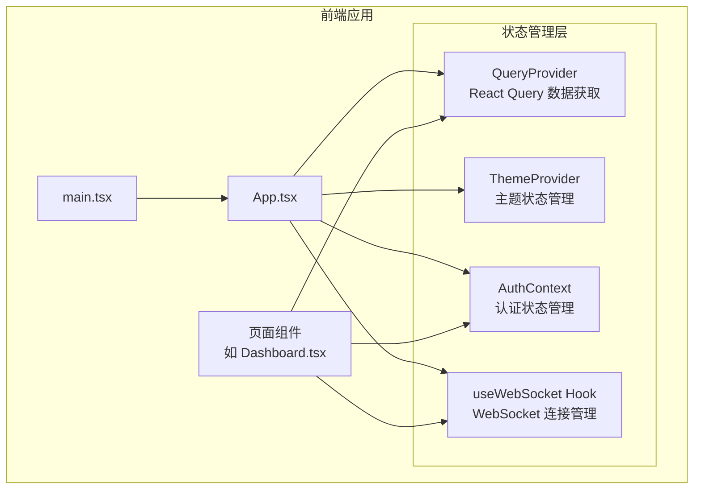
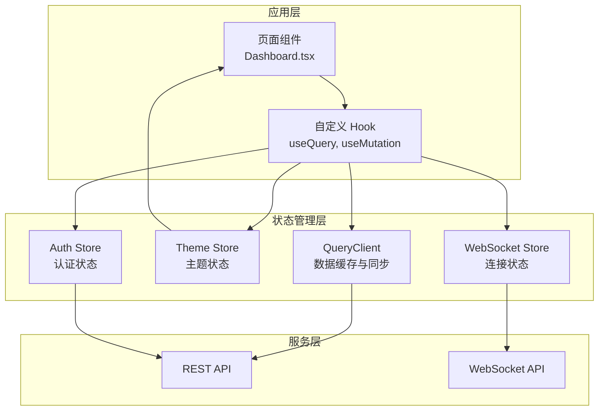
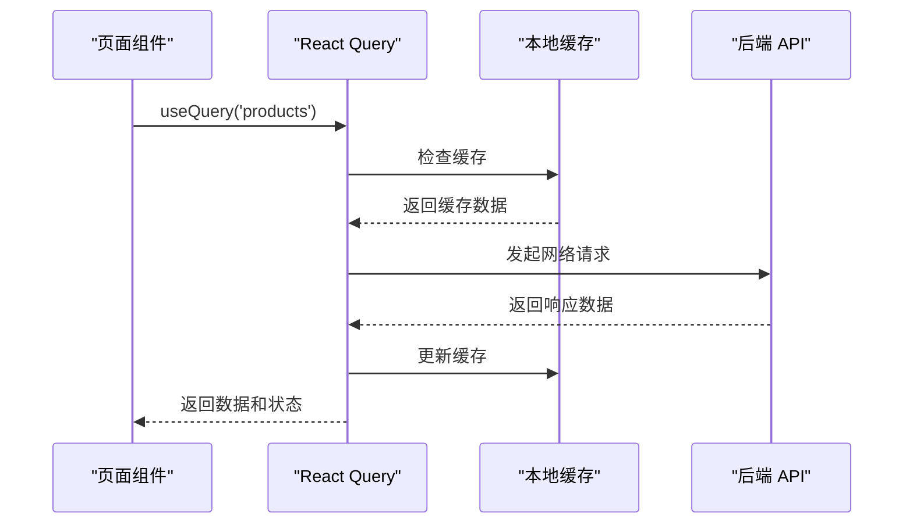
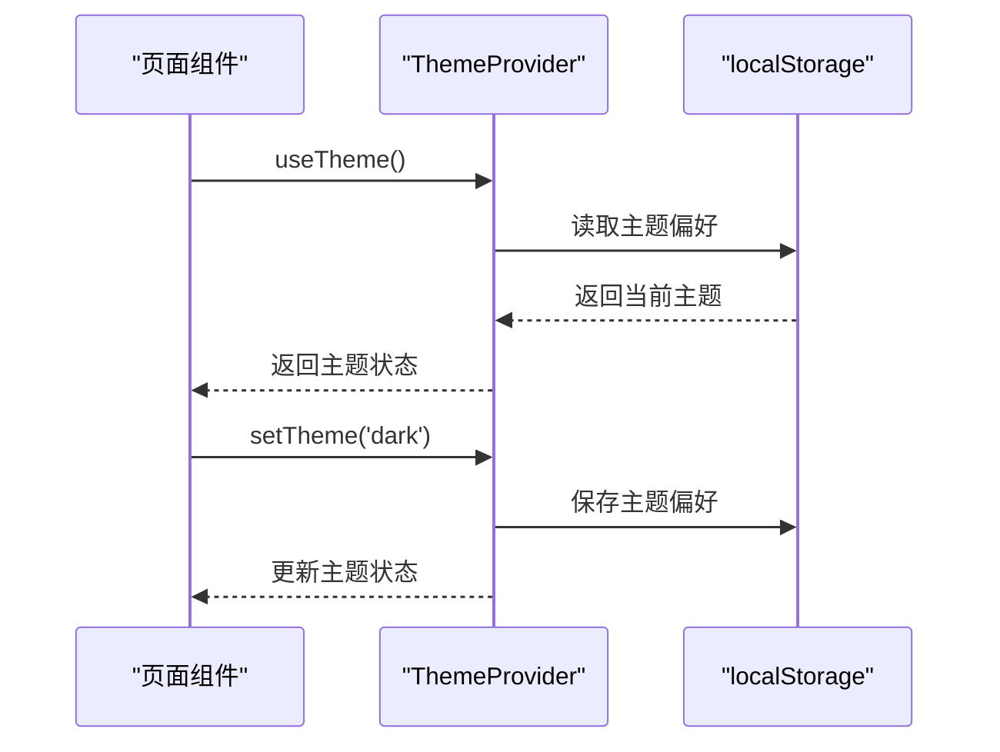
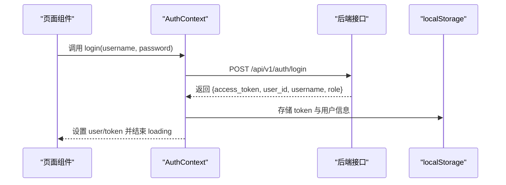
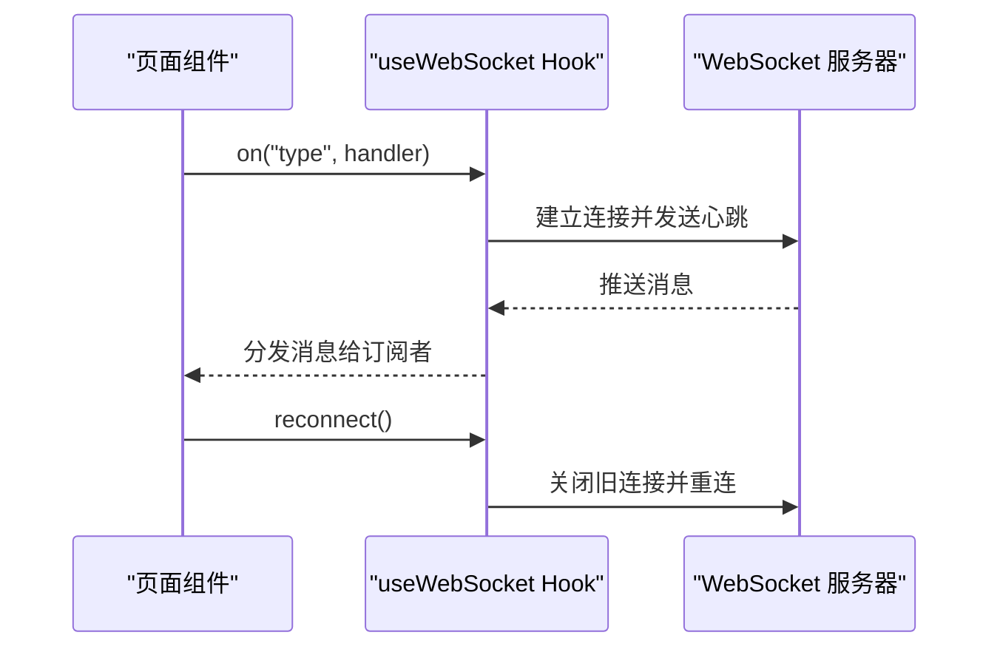
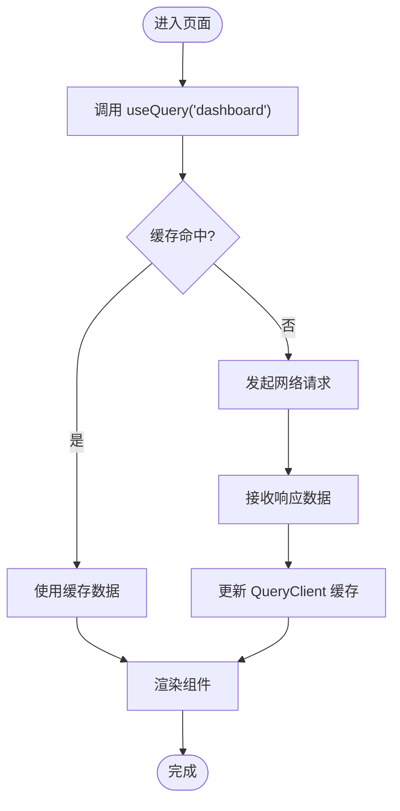
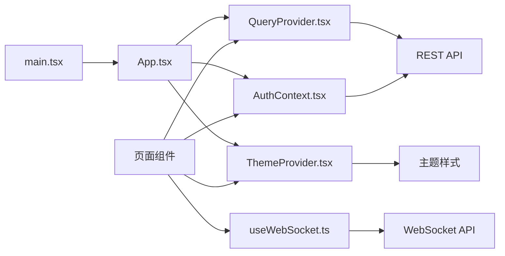

# 状态管理

<cite>
**本文引用的文件**
- [QueryProvider.tsx](file://frontend/src/providers/QueryProvider.tsx)
- [ThemeProvider.tsx](file://frontend/src/providers/ThemeProvider.tsx)
- [useWebSocket.ts](file://frontend/src/hooks/useWebSocket.ts)
- [AuthContext.tsx](file://frontend/src/context/AuthContext.tsx)
- [main.tsx](file://frontend/src/main.tsx)
- [App.tsx](file://frontend/src/App.tsx)
- [Dashboard.tsx](file://frontend/src/pages/Dashboard.tsx)
- [package.json](file://frontend/package.json)
</cite>

## 更新摘要
**所做更改**
- 新增 TanStack React Query 数据获取层的详细说明
- 新增 Next Themes 主题系统的状态管理模式
- 更新 WebSocket 连接管理的现代化实现
- 扩展状态持久化策略和性能优化方案
- 增强自定义 Hook 设计模式和调试工具使用指南

## 目录
1. [简介](#简介)
2. [项目结构](#项目结构)
3. [核心组件](#核心组件)
4. [架构总览](#架构总览)
5. [详细组件分析](#详细组件分析)
6. [依赖分析](#依赖分析)
7. [性能考虑](#性能考虑)
8. [故障排查指南](#故障排查指南)
9. [结论](#结论)
10. [附录](#附录)

## 简介
本文件面向避风港平台的前端状态管理，重点介绍新的状态管理模式，包括 TanStack React Query 的数据获取层、Next Themes 主题系统和现代化的 WebSocket 连接管理。文档详细阐述了应用状态（QueryClient）、认证状态（AuthContext）和主题状态（ThemeProvider）的管理方式，以及三者的协同工作机制。涵盖状态持久化策略、本地存储集成、状态恢复机制、性能优化和内存泄漏防护等最佳实践。

## 项目结构
前端采用现代化 React 架构，集成了多个状态管理解决方案。主要状态管理层次包括：React Query 数据获取层、主题状态管理、认证状态管理和 WebSocket 连接管理。各层之间通过 Provider 模式进行组合，实现状态的统一管理和高效共享。

**图表来源**
- [main.tsx](file://frontend/src/main.tsx)
- [App.tsx](file://frontend/src/App.tsx)
- [QueryProvider.tsx](file://frontend/src/providers/QueryProvider.tsx)
- [ThemeProvider.tsx](file://frontend/src/providers/ThemeProvider.tsx)
- [AuthContext.tsx](file://frontend/src/context/AuthContext.tsx)
- [useWebSocket.ts](file://frontend/src/hooks/useWebSocket.ts)
- [Dashboard.tsx](file://frontend/src/pages/Dashboard.tsx)

**章节来源**
- [main.tsx](file://frontend/src/main.tsx)
- [App.tsx](file://frontend/src/App.tsx)
- [QueryProvider.tsx](file://frontend/src/providers/QueryProvider.tsx)
- [ThemeProvider.tsx](file://frontend/src/providers/ThemeProvider.tsx)
- [AuthContext.tsx](file://frontend/src/context/AuthContext.tsx)
- [useWebSocket.ts](file://frontend/src/hooks/useWebSocket.ts)
- [Dashboard.tsx](file://frontend/src/pages/Dashboard.tsx)

## 核心组件
- **React Query 数据获取层（QueryProvider）**
  - 基于 TanStack React Query 实现的全局数据缓存和同步
  - 提供查询、突变和缓存失效的统一管理
  - 支持自动重试、后台刷新和乐观更新
- **主题状态管理（ThemeProvider）**
  - 集成 Next Themes 实现深浅主题切换
  - 支持系统主题检测和用户偏好保存
  - 实现主题状态的持久化和跨组件共享
- **认证上下文（AuthContext）**
  - 管理用户信息、令牌、管理员标识与加载状态
  - 提供登录、登出与带鉴权头的请求封装
  - 支持启动时从 localStorage 恢复状态
- **WebSocket Hook（useWebSocket）**
  - 现代化的 WebSocket 连接管理
  - 提供事件订阅、自动重连和心跳保活
  - 支持连接状态跟踪和错误处理

**章节来源**
- [QueryProvider.tsx](file://frontend/src/providers/QueryProvider.tsx)
- [ThemeProvider.tsx](file://frontend/src/providers/ThemeProvider.tsx)
- [AuthContext.tsx](file://frontend/src/context/AuthContext.tsx)
- [useWebSocket.ts](file://frontend/src/hooks/useWebSocket.ts)

## 架构总览
下图展示现代前端应用的状态管理架构，包括 React Query 数据层、主题管理、认证管理和 WebSocket 连接的协同工作模式。

**图表来源**
- [Dashboard.tsx](file://frontend/src/pages/Dashboard.tsx)
- [QueryProvider.tsx](file://frontend/src/providers/QueryProvider.tsx)
- [ThemeProvider.tsx](file://frontend/src/providers/ThemeProvider.tsx)
- [AuthContext.tsx](file://frontend/src/context/AuthContext.tsx)
- [useWebSocket.ts](file://frontend/src/hooks/useWebSocket.ts)

## 详细组件分析

### React Query 数据获取层（QueryProvider）
- **使用模式**
  - 创建全局 QueryClient 实例，配置默认选项和缓存策略
  - 通过 QueryClientProvider 在应用根部提供数据获取能力
  - 支持查询、突变和缓存失效的统一管理
- **状态提升策略**
  - 将数据获取状态提升至应用根节点，实现全应用范围的数据共享
  - 通过 useQuery、useMutation 等 Hook 在任意组件中访问数据
- **性能优化**
  - 自动缓存机制减少重复请求
  - 背景刷新和智能缓存失效策略
  - 查询去重和并发控制
- **错误处理**
  - 全局错误边界和查询错误处理
  - 自动重试机制和错误状态管理

**图表来源**
- [QueryProvider.tsx](file://frontend/src/providers/QueryProvider.tsx)

**章节来源**
- [QueryProvider.tsx](file://frontend/src/providers/QueryProvider.tsx)

### 主题状态管理（ThemeProvider）
- **使用模式**
  - 集成 Next Themes 实现深浅主题切换
  - 支持系统主题检测和用户偏好保存
  - 通过 ThemeProvider 在应用根部提供主题状态
- **状态提升策略**
  - 将主题状态提升至应用根节点，实现全应用范围的主题切换
  - 通过 useTheme Hook 在任意组件中读取和更新主题
- **数据持久化与恢复**
  - 启动时从 localStorage 读取用户主题偏好
  - 自动保存用户选择的主题设置
- **性能与内存安全**
  - 使用 React Context 实现高效的主题状态传递
  - 避免不必要的重渲染和状态提升

**图表来源**
- [ThemeProvider.tsx](file://frontend/src/providers/ThemeProvider.tsx)

**章节来源**
- [ThemeProvider.tsx](file://frontend/src/providers/ThemeProvider.tsx)

### 认证上下文（AuthContext）
- **使用模式**
  - 创建 Context 并导出 Provider 与 Hook
  - 在 Provider 中维护 user、token、loading 状态
  - 提供 login、logout、authFetch 方法
- **状态提升策略**
  - 将认证状态提升至应用根节点 Provider，使多页面共享
  - 通过 useAuth Hook 在任意子组件中读取与更新
- **数据持久化与恢复**
  - 启动时从 localStorage 读取令牌与用户信息
  - 登录成功写入 localStorage；登出清理
- **错误处理**
  - 登录失败抛出错误；authFetch 自动附加 Authorization 头
- **性能与内存安全**
  - 使用 useCallback 包裹异步方法与回调，减少重渲染
  - 清理定时器与订阅（如需）

**图表来源**
- [AuthContext.tsx](file://frontend/src/context/AuthContext.tsx)

**章节来源**
- [AuthContext.tsx](file://frontend/src/context/AuthContext.tsx)

### WebSocket Hook（useWebSocket）
- **使用模式**
  - Hook 内部维护连接状态、最后消息与事件处理器集合
  - 提供 on(type, handler) 订阅与取消订阅、reconnect 主动重连
- **状态提升策略**
  - 将连接状态与消息提升至根 Provider，便于全局通知中心等组件共享
- **数据持久化与恢复**
  - 通过 userId 参数区分不同用户会话
- **连接与心跳**
  - 自动重连、心跳保活、错误状态处理
- **性能与内存安全**
  - 使用 useRef 存储定时器与 WebSocket 引用
  - 组件卸载时清理定时器与连接

**图表来源**
- [useWebSocket.ts](file://frontend/src/hooks/useWebSocket.ts)

**章节来源**
- [useWebSocket.ts](file://frontend/src/hooks/useWebSocket.ts)

### 页面与数据获取客户端
- **页面组件通过 React Query Hook 发起数据请求**
  - 结合认证上下文的 authFetch 获取受保护资源
  - 使用 QueryClient 管理数据缓存和同步
- **示例：仪表板页面按生命周期分组渲染**
  - 首次挂载触发数据加载
  - 自动处理加载状态、错误状态和数据更新

**图表来源**
- [Dashboard.tsx](file://frontend/src/pages/Dashboard.tsx)
- [QueryProvider.tsx](file://frontend/src/providers/QueryProvider.tsx)

**章节来源**
- [Dashboard.tsx](file://frontend/src/pages/Dashboard.tsx)
- [QueryProvider.tsx](file://frontend/src/providers/QueryProvider.tsx)

## 依赖分析
- **Provider 层**
  - main.tsx/App.tsx 作为入口，注入 QueryProvider、ThemeProvider、AuthProvider
- **组件层**
  - 页面组件依赖 React Query Hook、主题 Hook 和认证 Hook
- **服务层**
  - REST API 客户端基于 fetch，结合 AuthContext 的 authFetch 注入鉴权头
  - WebSocket Hook 与后端 WebSocket 服务通信

**图表来源**
- [main.tsx](file://frontend/src/main.tsx)
- [App.tsx](file://frontend/src/App.tsx)
- [QueryProvider.tsx](file://frontend/src/providers/QueryProvider.tsx)
- [ThemeProvider.tsx](file://frontend/src/providers/ThemeProvider.tsx)
- [AuthContext.tsx](file://frontend/src/context/AuthContext.tsx)
- [useWebSocket.ts](file://frontend/src/hooks/useWebSocket.ts)

**章节来源**
- [main.tsx](file://frontend/src/main.tsx)
- [App.tsx](file://frontend/src/App.tsx)
- [QueryProvider.tsx](file://frontend/src/providers/QueryProvider.tsx)
- [ThemeProvider.tsx](file://frontend/src/providers/ThemeProvider.tsx)
- [AuthContext.tsx](file://frontend/src/context/AuthContext.tsx)
- [useWebSocket.ts](file://frontend/src/hooks/useWebSocket.ts)

## 性能考虑
- **React Query 优化**
  - 合理配置缓存时间，避免过度缓存导致数据陈旧
  - 使用查询去重和并发控制减少重复请求
  - 利用背景刷新保持数据新鲜度
- **主题切换优化**
  - 使用 CSS 变量实现平滑的主题过渡
  - 避免不必要的主题状态更新
  - 优化主题切换的重渲染开销
- **认证状态优化**
  - 对频繁调用的方法使用 useCallback 包裹
  - 优化 token 刷新和验证流程
  - 减少认证状态的不必要重渲染
- **WebSocket 连接优化**
  - 合理的心跳间隔和重连策略
  - 连接池管理和资源复用
  - 事件处理的防抖和节流

## 故障排查指南
- **React Query 相关问题**
  - 检查 QueryClient 配置和缓存策略
  - 确认查询键的唯一性和一致性
  - 查看网络请求和缓存状态
- **主题切换问题**
  - 检查 localStorage 中的主题偏好设置
  - 确认 CSS 变量和主题类名的应用
  - 验证主题切换的动画效果
- **认证问题**
  - 检查 localStorage 是否存在有效 token 与用户信息
  - 确认 authFetch 是否正确附加 Authorization 头
  - 登录失败时查看后端返回的错误详情
- **WebSocket 连接**
  - 观察状态变化（connecting/connected/disconnected/error）
  - 检查心跳是否正常，必要时主动调用 reconnect
  - 确认后端 WebSocket 地址与端口配置
- **资源清理**
  - 卸载组件时确保定时器与连接被清理
  - 订阅事件时保留取消函数并在卸载时调用

**章节来源**
- [QueryProvider.tsx](file://frontend/src/providers/QueryProvider.tsx)
- [ThemeProvider.tsx](file://frontend/src/providers/ThemeProvider.tsx)
- [AuthContext.tsx](file://frontend/src/context/AuthContext.tsx)
- [useWebSocket.ts](file://frontend/src/hooks/useWebSocket.ts)

## 结论
本项目采用现代化的状态管理模式，集成了 TanStack React Query、Next Themes 和自定义 Hook 技术栈。通过 QueryClient 实现高效的数据获取和缓存管理，通过 ThemeProvider 提供灵活的主题切换功能，通过 AuthContext 管理认证状态，通过 useWebSocket Hook 处理实时通信。这种多层次的状态管理架构提供了更好的性能、可维护性和用户体验。未来可以在现有基础上进一步优化复杂业务场景下的状态管理策略。

## 附录
- **全局状态与局部状态划分原则**
  - 全局状态：跨页面共享且影响范围广的状态（如用户认证、主题偏好、数据缓存）
  - 局部状态：仅在单个页面或组件内使用的状态（如表单输入、临时提示、组件内部状态）
- **状态订阅机制**
  - 通过 useQuery、useTheme、useAuth、useWebSocket 订阅状态
  - 页面组件在 useEffect 中根据状态变化发起请求或更新 UI
  - React Query 自动处理数据同步和缓存失效
- **调试工具**
  - 使用 React DevTools 观察组件重渲染和状态变化
  - 在浏览器开发者工具中监控网络请求和 WebSocket 事件
  - 利用 React Query Devtools 进行数据获取调试
  - 检查 localStorage 中的状态持久化情况
- **性能监控**
  - 监控 QueryClient 缓存命中率和内存使用
  - 跟踪主题切换的渲染性能
  - 分析认证状态的更新频率和开销
  - 监控 WebSocket 连接的稳定性和延迟