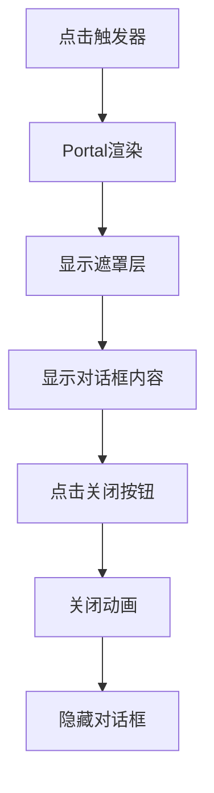
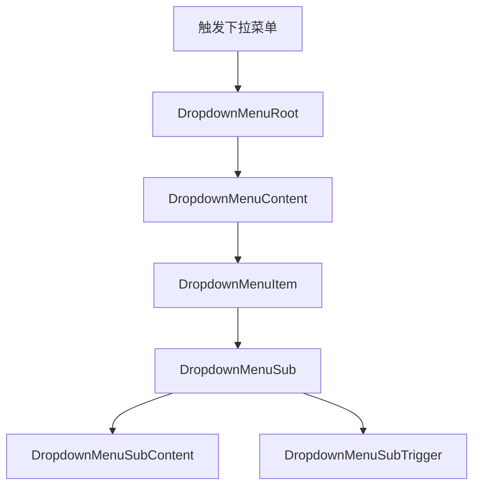
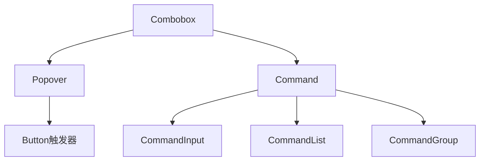
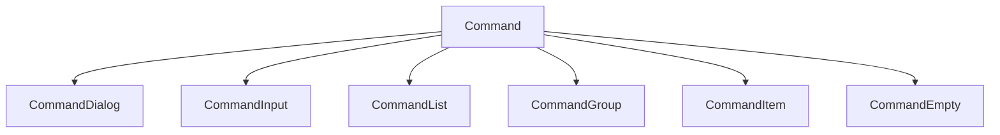
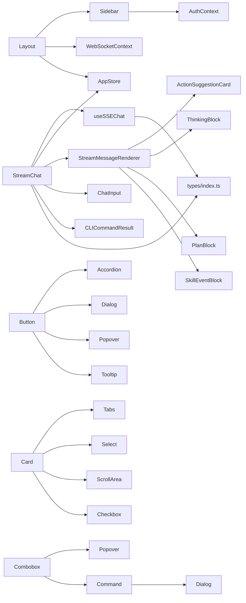

# 组件库系统

<cite>
**本文档引用的文件**
- [Layout.tsx](file://frontend/src/components/Layout.tsx)
- [Sidebar.tsx](file://frontend/src/components/Sidebar.tsx)
- [StreamChat.tsx](file://frontend/src/components/StreamChat.tsx)
- [StreamMessageRenderer.tsx](file://frontend/src/components/StreamMessageRenderer.tsx)
- [AppStore.tsx](file://frontend/src/context/AppStore.tsx)
- [WebSocketContext.tsx](file://frontend/src/context/WebSocketContext.tsx)
- [useSSEChat.ts](file://frontend/src/hooks/useSSEChat.ts)
- [index.ts](file://frontend/src/types/index.ts)
- [ChatInput.tsx](file://frontend/src/components/ChatInput.tsx)
- [CLICommandResult.tsx](file://frontend/src/components/CLICommandResult.tsx)
- [ActionSuggestionCard.tsx](file://frontend/src/components/ActionSuggestionCard.tsx)
- [ThinkingBlock.tsx](file://frontend/src/components/ThinkingBlock.tsx)
- [PlanBlock.tsx](file://frontend/src/components/PlanBlock.tsx)
- [SkillEventBlock.tsx](file://frontend/src/components/SkillEventBlock.tsx)
- [AuthContext.tsx](file://frontend/src/context/AuthContext.tsx)
- [accordion.tsx](file://frontend/src/components/ui/accordion.tsx)
- [alert.tsx](file://frontend/src/components/ui/alert.tsx)
- [avatar.tsx](file://frontend/src/components/ui/avatar.tsx)
- [badge.tsx](file://frontend/src/components/ui/badge.tsx)
- [button.tsx](file://frontend/src/components/ui/button.tsx)
- [card.tsx](file://frontend/src/components/ui/card.tsx)
- [checkbox.tsx](file://frontend/src/components/ui/checkbox.tsx)
- [combobox.tsx](file://frontend/src/components/ui/combobox.tsx)
- [command.tsx](file://frontend/src/components/ui/command.tsx)
- [dialog.tsx](file://frontend/src/components/ui/dialog.tsx)
- [dropdown-menu.tsx](file://frontend/src/components/ui/dropdown-menu.tsx)
- [input.tsx](file://frontend/src/components/ui/input.tsx)
- [label.tsx](file://frontend/src/components/ui/label.tsx)
- [popover.tsx](file://frontend/src/components/ui/popover.tsx)
- [scroll-area.tsx](file://frontend/src/components/ui/scroll-area.tsx)
- [select.tsx](file://frontend/src/components/ui/select.tsx)
- [separator.tsx](file://frontend/src/components/ui/separator.tsx)
- [sheet.tsx](file://frontend/src/components/ui/sheet.tsx)
- [skeleton.tsx](file://frontend/src/components/ui/skeleton.tsx)
- [sonner.tsx](file://frontend/src/components/ui/sonner.tsx)
- [tabs.tsx](file://frontend/src/components/ui/tabs.tsx)
- [textarea.tsx](file://frontend/src/components/ui/textarea.tsx)
- [tooltip.tsx](file://frontend/src/components/ui/tooltip.tsx)
</cite>

## 更新摘要
**所做更改**
- 新增完整的Radix UI组件库系统，包含22个基础UI组件
- 更新组件层次结构以包含新的UI组件层
- 扩展样式系统与主题定制章节
- 增强组件开发规范与测试策略
- 新增组合组件（Combobox）和命令面板组件（Command）

## 目录
1. [引言](#引言)
2. [项目结构](#项目结构)
3. [核心组件](#核心组件)
4. [架构总览](#架构总览)
5. [组件详解](#组件详解)
6. [Radix UI组件库系统](#radix-ui组件库系统)
7. [依赖关系分析](#依赖关系分析)
8. [性能与可扩展性](#性能与可扩展性)
9. [故障排查指南](#故障排查指南)
10. [结论](#结论)
11. [附录](#附录)

## 弹窗组件 Dialog
- 职责：模态对话框容器，支持遮罩层、内容区域、标题、描述和关闭按钮。
- 特性：内置动画效果（淡入淡出、缩放、滑动），支持键盘导航和焦点管理。
- 组合：DialogTrigger用于触发，DialogOverlay遮罩层，DialogContent内容容器。



**图表来源**
- [dialog.tsx:30-52](file://frontend/src/components/ui/dialog.tsx#L30-L52)

**章节来源**
- [dialog.tsx:15-52](file://frontend/src/components/ui/dialog.tsx#L15-L52)

## 下拉菜单组件 DropdownMenu
- 职责：复杂的下拉菜单系统，支持多级子菜单、复选框项、单选项、标签和快捷键。
- 特性：自动定位、滚动适配、键盘导航、焦点管理。
- 组合：DropdownMenuRoot根组件，DropdownMenuTrigger触发器，DropdownMenuContent内容，DropdownMenuItem各项。



**图表来源**
- [dropdown-menu.tsx:59-76](file://frontend/src/components/ui/dropdown-menu.tsx#L59-L76)

**章节来源**
- [dropdown-menu.tsx:9-76](file://frontend/src/components/ui/dropdown-menu.tsx#L9-L76)

## 输入组件 Input
- 职责：原生输入框的增强版本，支持类型、禁用、只读等状态。
- 特性：统一的边框、内边距、阴影和焦点样式；响应式字体大小。
- 变体：支持多种输入类型（text、password、email等）。

**章节来源**
- [input.tsx:5-21](file://frontend/src/components/ui/input.tsx#L5-L21)

## 标签组件 Label
- 职责：可访问的表单标签，与输入组件完美配合。
- 特性：支持禁用状态、统一的字体样式和对齐方式。
- 可变体：通过cva提供语义化的标签样式。

**章节来源**
- [label.tsx:11-22](file://frontend/src/components/ui/label.tsx#L11-L22)

## 弹出层组件 Popover
- 职责：弹出层组件，支持多种触发方式和定位策略。
- 特性：自动定位、边界检测、动画过渡、焦点管理。
- 组合：PopoverRoot根组件，PopoverTrigger触发器，PopoverContent内容。

**章节来源**
- [popover.tsx:6-29](file://frontend/src/components/ui/popover.tsx#L6-L29)

## 滚动区域组件 ScrollArea
- 职责：自定义滚动区域，提供更好的滚动体验和滚动条样式。
- 特性：隐藏原生滚动条、显示自定义滚动条、支持水平和垂直滚动。
- 组合：ScrollAreaRoot根组件，ScrollAreaViewport视口，ScrollBar滚动条。

**章节来源**
- [scroll-area.tsx:6-44](file://frontend/src/components/ui/scroll-area.tsx#L6-L44)

## 选择器组件 Select
- 职责：下拉选择器，支持搜索、分组、滚动按钮等功能。
- 特性：自动宽度适配、滚动适配、图标指示器、键盘导航。
- 组合：SelectRoot根组件，SelectTrigger触发器，SelectContent内容，SelectItem各项。

**章节来源**
- [select.tsx:7-98](file://frontend/src/components/ui/select.tsx#L7-L98)

## 分隔线组件 Separator
- 职责：分隔线组件，支持水平和垂直方向。
- 特性：简单的装饰性组件，支持自定义样式和方向。

**章节来源**
- [separator.tsx:1-100](file://frontend/src/components/ui/separator.tsx#L1-L100)

## 抽屉组件 Sheet
- 职责：抽屉式面板，适合移动端交互和侧边栏导航。
- 特性：支持从不同方向滑入、遮罩层、键盘导航、焦点管理。
- 组合：SheetRoot根组件，SheetTrigger触发器，SheetContent内容。

**章节来源**
- [sheet.tsx:1-100](file://frontend/src/components/ui/sheet.tsx#L1-L100)

## 选项卡组件 Tabs
- 职责：选项卡组件，支持动态内容切换和键盘导航。
- 特性：自动宽度适配、滚动适配、动画过渡、焦点管理。
- 组合：TabsRoot根组件，TabsList列表，TabsTrigger触发器，TabsContent内容。

**章节来源**
- [tabs.tsx:1-100](file://frontend/src/components/ui/tabs.tsx#L1-L100)

## 多行文本组件 Textarea
- 职责：多行文本输入框，支持自动调整大小和禁用状态。
- 特性：统一的边框、内边距、阴影和焦点样式；支持自动高度调整。

**章节来源**
- [textarea.tsx:1-100](file://frontend/src/components/ui/textarea.tsx#L1-L100)

## 工具提示组件 Tooltip
- 职责：工具提示，提供上下文帮助信息和键盘导航支持。
- 特性：延迟显示、自动定位、边界检测、焦点管理。
- 组合：TooltipRoot根组件，TooltipTrigger触发器，TooltipContent内容。

**章节来源**
- [tooltip.tsx:1-100](file://frontend/src/components/ui/tooltip.tsx#L1-L100)

## 组合组件系统

### 组合框组件 Combobox
- 职责：结合输入框和下拉菜单的组合组件，支持搜索、选择和自定义占位符。
- 特性：内置搜索功能、选择状态管理、键盘导航、自动宽度适配。
- 使用：作为Popover和Command的组合封装，提供简化的API。



**图表来源**
- [combobox.tsx:49-97](file://frontend/src/components/ui/combobox.tsx#L49-L97)

**章节来源**
- [combobox.tsx:34-99](file://frontend/src/components/ui/combobox.tsx#L34-L99)

### 命令面板组件 Command
- 职责：全局命令面板，支持快速搜索和执行操作。
- 特性：键盘快捷键支持、搜索过滤、分组显示、快捷键提示。
- 组合：CommandRoot根组件，CommandDialog对话框，CommandInput输入，CommandList列表。



**图表来源**
- [command.tsx:16-45](file://frontend/src/components/ui/command.tsx#L16-L45)

**章节来源**
- [command.tsx:16-162](file://frontend/src/components/ui/command.tsx#L16-L162)

## Radix UI组件库系统

### 组件库概述
Radix UI是一套开源的可访问性优先的UI组件库，专门为React应用设计。避风港平台集成了22个核心组件，提供可组合、可访问且无副作用的UI基础。

### 组件分类与特性

#### 基础交互组件
- **Button**：增强的按钮组件，支持多种变体、尺寸和状态
- **Checkbox**：可访问的复选框，支持受控和非受控状态
- **Input**：原生输入框的增强版本，支持禁用、只读等状态
- **Label**：可访问的表单标签，与输入组件完美配合
- **Textarea**：多行文本输入框，支持自动调整大小

#### 布局与容器组件
- **Card**：卡片容器，支持头部、主体、底部的灵活布局
- **Separator**：分隔线组件，支持水平和垂直方向
- **ScrollArea**：自定义滚动区域，提供更好的滚动体验

#### 导航与覆盖组件
- **Accordion**：手风琴组件，支持单开或多开模式
- **Dialog**：模态对话框，支持键盘导航和焦点管理
- **DropdownMenu**：下拉菜单，支持复杂的菜单结构
- **Popover**：弹出层组件，支持多种触发方式
- **Sheet**：抽屉式面板，适合移动端交互
- **Tabs**：选项卡组件，支持动态内容切换
- **Tooltip**：工具提示，提供上下文帮助信息

#### 选择与表单组件
- **Select**：下拉选择器，支持搜索和分组
- **Avatar**：头像组件，支持占位符和错误处理
- **Badge**：徽章标签，支持多种视觉变体
- **Alert**：警告提示，支持成功和错误状态

#### 组合与高级组件
- **Combobox**：组合框，结合输入和选择功能
- **Command**：命令面板，支持全局搜索和操作执行
- **Skeleton**：骨架屏，提供加载状态指示
- **Sonner**：通知系统，支持多种通知类型

### 设计原则
- **可访问性优先**：所有组件都遵循ARIA标准，支持键盘导航
- **可组合性**：组件通过Slot模式实现高度可组合
- **无副作用**：不强制样式，允许完全的主题定制
- **TypeScript友好**：完整的类型定义和智能提示

### 使用示例与最佳实践

#### Button组件
```typescript
// 基础按钮
<Button>点击我</Button>

// 变体和尺寸
<Button variant="destructive">删除</Button>
<Button size="sm">小按钮</Button>

// 禁用状态
<Button disabled>禁用按钮</Button>
```

#### Form组件组合
```typescript
// 表单结构
<form>
  <div className="space-y-2">
    <Label htmlFor="email">邮箱</Label>
    <Input id="email" type="email" />
  </div>
  
  <div className="flex items-center space-x-2 pt-4">
    <Checkbox id="terms" />
    <Label htmlFor="terms">同意条款</Label>
  </div>
  
  <Button type="submit" className="mt-4">提交</Button>
</form>
```

#### 导航组件
```typescript
// 下拉菜单
<DropdownMenu>
  <DropdownMenuTrigger asChild>
    <Button variant="outline">菜单</Button>
  </DropdownMenuTrigger>
  <DropdownMenuContent>
    <DropdownMenuItem>选项1</DropdownMenuItem>
    <DropdownMenuItem>选项2</DropdownMenuItem>
  </DropdownMenuContent>
</DropdownMenu>
```

#### 覆盖层组件
```typescript
// 对话框
<Dialog>
  <DialogTrigger asChild>
    <Button>打开对话框</Button>
  </DialogTrigger>
  <DialogContent>
    <DialogHeader>
      <DialogTitle>标题</DialogTitle>
      <DialogDescription>描述信息</DialogDescription>
    </DialogHeader>
    <div>对话框内容</div>
  </DialogContent>
</Dialog>
```

### 样式系统集成
Radix UI组件与TailwindCSS无缝集成，通过CSS变量和原子类实现主题定制：

```typescript
// 主题变量映射
:root {
  --primary: 221 83% 53%;
  --primary-foreground: 0 0% 98%;
  --secondary: 220 14% 96%;
  --secondary-foreground: 220 14% 4%;
}

// 组件样式继承
.Button {
  @apply inline-flex items-center justify-center rounded-md text-sm font-medium transition-colors focus-visible:outline-none focus-visible:ring-2 focus-visible:ring-ring focus-visible:ring-offset-2 disabled:opacity-50 disabled:pointer-events-none ring-offset-background;
}
```

### 可访问性特性
- **键盘导航**：完整的键盘操作支持
- **屏幕阅读器**：ARIA属性自动管理
- **焦点管理**：自动焦点管理和循环
- **颜色对比**：符合WCAG 2.1 AA标准

**章节来源**
- [accordion.tsx:1-56](file://frontend/src/components/ui/accordion.tsx#L1-L56)
- [alert.tsx:1-60](file://frontend/src/components/ui/alert.tsx#L1-L60)
- [avatar.tsx:1-49](file://frontend/src/components/ui/avatar.tsx#L1-L49)
- [badge.tsx:1-37](file://frontend/src/components/ui/badge.tsx#L1-L37)
- [button.tsx:1-58](file://frontend/src/components/ui/button.tsx#L1-L58)
- [card.tsx:1-77](file://frontend/src/components/ui/card.tsx#L1-L77)
- [checkbox.tsx:1-29](file://frontend/src/components/ui/checkbox.tsx#L1-L29)
- [combobox.tsx:1-100](file://frontend/src/components/ui/combobox.tsx#L1-L100)
- [command.tsx:1-163](file://frontend/src/components/ui/command.tsx#L1-L163)
- [dialog.tsx:1-121](file://frontend/src/components/ui/dialog.tsx#L1-L121)
- [dropdown-menu.tsx:1-202](file://frontend/src/components/ui/dropdown-menu.tsx#L1-L202)
- [input.tsx:1-23](file://frontend/src/components/ui/input.tsx#L1-L23)
- [label.tsx:1-25](file://frontend/src/components/ui/label.tsx#L1-L25)
- [popover.tsx:1-32](file://frontend/src/components/ui/popover.tsx#L1-L32)
- [scroll-area.tsx:1-47](file://frontend/src/components/ui/scroll-area.tsx#L1-L47)
- [select.tsx:1-158](file://frontend/src/components/ui/select.tsx#L1-L158)
- [separator.tsx:1-100](file://frontend/src/components/ui/separator.tsx#L1-L100)
- [sheet.tsx:1-100](file://frontend/src/components/ui/sheet.tsx#L1-L100)
- [skeleton.tsx:1-100](file://frontend/src/components/ui/skeleton.tsx#L1-L100)
- [sonner.tsx:1-100](file://frontend/src/components/ui/sonner.tsx#L1-L100)
- [tabs.tsx:1-100](file://frontend/src/components/ui/tabs.tsx#L1-L100)
- [textarea.tsx:1-100](file://frontend/src/components/ui/textarea.tsx#L1-L100)
- [tooltip.tsx:1-100](file://frontend/src/components/ui/tooltip.tsx#L1-L100)

## 依赖关系分析
- 组件依赖：Layout 依赖 Sidebar、WebSocketContext、AppStore；Sidebar 依赖 AuthContext；StreamChat 依赖 useSSEChat、AppStore、StreamMessageRenderer、ChatInput、CLICommandResult。
- 状态依赖：AppStore 提供聊天配置与侧边栏状态；WebSocketContext 提供 WS 连接状态与事件分发；AuthContext 提供登录态与鉴权。
- 数据契约：types/index.ts 定义了 SSE 事件、消息、动作、计划、技能结果等统一类型。
- **新增** UI组件依赖：所有业务组件都可以自由组合使用Radix UI基础组件，形成强大的UI构建能力。组合组件（Combobox、Command）依赖基础UI组件实现复杂交互。



**图表来源**
- [Layout.tsx:1-7](file://frontend/src/components/Layout.tsx#L1-L7)
- [Sidebar.tsx:1-4](file://frontend/src/components/Sidebar.tsx#L1-L4)
- [StreamChat.tsx:1-9](file://frontend/src/components/StreamChat.tsx#L1-L9)
- [AppStore.tsx:1-3](file://frontend/src/context/AppStore.tsx#L1-L3)
- [WebSocketContext.tsx:1-19](file://frontend/src/context/WebSocketContext.tsx#L1-L19)
- [AuthContext.tsx:1-19](file://frontend/src/context/AuthContext.tsx#L1-L19)
- [useSSEChat.ts:1-8](file://frontend/src/hooks/useSSEChat.ts#L1-L8)
- [index.ts:306-429](file://frontend/src/types/index.ts#L306-L429)
- [button.tsx:1-100](file://frontend/src/components/ui/button.tsx#L1-L100)
- [accordion.tsx:1-100](file://frontend/src/components/ui/accordion.tsx#L1-L100)
- [dialog.tsx:1-100](file://frontend/src/components/ui/dialog.tsx#L1-L100)
- [popover.tsx:1-100](file://frontend/src/components/ui/popover.tsx#L1-L100)
- [tooltip.tsx:1-100](file://frontend/src/components/ui/tooltip.tsx#L1-L100)
- [card.tsx:1-100](file://frontend/src/components/ui/card.tsx#L1-L100)
- [tabs.tsx:1-100](file://frontend/src/components/ui/tabs.tsx#L1-L100)
- [select.tsx:1-100](file://frontend/src/components/ui/select.tsx#L1-L100)
- [scroll-area.tsx:1-100](file://frontend/src/components/ui/scroll-area.tsx#L1-L100)
- [checkbox.tsx:1-100](file://frontend/src/components/ui/checkbox.tsx#L1-L100)
- [combobox.tsx:1-100](file://frontend/src/components/ui/combobox.tsx#L1-L100)
- [command.tsx:1-163](file://frontend/src/components/ui/command.tsx#L1-L163)

**章节来源**
- [Layout.tsx:1-7](file://frontend/src/components/Layout.tsx#L1-L7)
- [Sidebar.tsx:1-4](file://frontend/src/components/Sidebar.tsx#L1-L4)
- [StreamChat.tsx:1-9](file://frontend/src/components/StreamChat.tsx#L1-L9)
- [AppStore.tsx:1-3](file://frontend/src/context/AppStore.tsx#L1-L3)
- [WebSocketContext.tsx:1-19](file://frontend/src/context/WebSocketContext.tsx#L1-L19)
- [AuthContext.tsx:1-19](file://frontend/src/context/AuthContext.tsx#L1-L19)
- [useSSEChat.ts:1-8](file://frontend/src/hooks/useSSEChat.ts#L1-L8)
- [index.ts:306-429](file://frontend/src/types/index.ts#L306-L429)

## 性能与可扩展性
- 流式渲染优化：useSSEChat 使用 AbortController 中断上一次请求，避免并发冲突；仅在 done/error 时终止流，减少无效渲染。
- 状态最小化：AppStore 使用 zustand，局部状态更新避免全量重渲染；Sidebar 状态独立于聊天配置，降低耦合。
- 滚动与懒加载：StreamChat 自动滚动到底部；消息块按需渲染，避免一次性渲染大量节点。
- 可扩展点：StreamMessageRenderer 的聚合策略可扩展更多事件类型；ActionSuggestionCard 支持外部 onAction 回调扩展业务动作。
- **新增** 组件性能：Radix UI组件经过优化，支持条件渲染和懒加载；组件间通过context共享状态，避免重复渲染。组合组件通过状态提升和受控模式实现高性能。

**章节来源**
- [useSSEChat.ts:128-131](file://frontend/src/hooks/useSSEChat.ts#L128-L131)
- [useSSEChat.ts:197-208](file://frontend/src/hooks/useSSEChat.ts#L197-L208)
- [StreamChat.tsx:64-66](file://frontend/src/components/StreamChat.tsx#L64-L66)
- [StreamMessageRenderer.tsx:65-146](file://frontend/src/components/StreamMessageRenderer.tsx#L65-L146)

## 故障排查指南
- WebSocket 连接问题：检查 WebSocketProvider 的连接 URL、心跳与重连逻辑；通过 useWebSocketContext 的 status 与 reconnect 快速定位。
- SSE 连接异常：useSSEChat 在网络错误时注入 error 事件，检查后端 SSE 端点与跨域配置；关注 isStreaming 与 status 的状态变化。
- CLI 命令不可用：CLICommandResult 在 CLI API 不可用时提供本地回退（/help、/status、/config、/clear），确认本地回退分支是否触发。
- 登录态失效：AuthContext 通过 localStorage 恢复登录态，若登录失败检查 /api/v1/auth/login 返回与本地存储一致性。
- **新增** Radix UI组件问题：检查组件导入路径、CSS变量定义和主题配置；验证可访问性属性和键盘导航功能。组合组件检查状态同步和事件传播。

**章节来源**
- [WebSocketContext.tsx:39-92](file://frontend/src/context/WebSocketContext.tsx#L39-L92)
- [useSSEChat.ts:221-258](file://frontend/src/hooks/useSSEChat.ts#L221-L258)
- [StreamChat.tsx:78-114](file://frontend/src/components/StreamChat.tsx#L78-L114)
- [AuthContext.tsx:28-42](file://frontend/src/context/AuthContext.tsx#L28-L42)

## 结论
避风港组件库以清晰的分层与职责划分实现高内聚、低耦合：容器组件编排、渲染组件专注展示、钩子抽象底层协议、上下文统一状态。通过统一类型契约与事件聚合渲染，系统在复杂业务场景下仍保持良好的可维护性与扩展性。

**更新** 新增的Radix UI组件库系统进一步增强了组件库的完整性和可访问性，提供了22个高质量的基础UI组件，支持可组合、可访问和无副作用的UI开发模式。组合组件（Combobox、Command）提供了强大的交互能力。建议后续持续完善组件文档与测试覆盖，强化主题与响应式体系，充分利用Radix UI的可访问性优势。

## 附录

### Props 接口设计要点
- StreamChat：支持 initialMessage、endpoint、sessionId、title/subtitle/placeholder、onAction 等可选参数。
- StreamMessageRenderer：接收 message 与可选 onAction 回调。
- ActionSuggestionCard：actions 数组与 onAction 回调。
- ChatInput：onSend/onCLI/onAbort/disabled/isStreaming/placeholder。
- CLICommandResult：result、onRerun/onCopy。
- **新增** Radix UI组件：遵循Radix UI的标准化Props设计，支持变体(variant)、尺寸(size)、状态(state)等参数。
- **新增** 组合组件：Combobox支持items、value、onSelect等属性，Command支持搜索、分组、快捷键等功能。

**章节来源**
- [StreamChat.tsx:10-27](file://frontend/src/components/StreamChat.tsx#L10-L27)
- [StreamMessageRenderer.tsx:8-11](file://frontend/src/components/StreamMessageRenderer.tsx#L8-L11)
- [ActionSuggestionCard.tsx:3-6](file://frontend/src/components/ActionSuggestionCard.tsx#L3-L6)
- [ChatInput.tsx:4-11](file://frontend/src/components/ChatInput.tsx#L4-L11)
- [CLICommandResult.tsx:3-7](file://frontend/src/components/CLICommandResult.tsx#L3-L7)

### 事件处理与状态管理
- SSE 事件解析：parseSSEChunk + parseStreamEvent，提取 token 文本与事件元数据。
- 状态流转：idle/connecting/connected/reconnecting/disconnected/error。
- 交互反馈：流式光标、空状态占位、错误块提示。
- **新增** Radix UI状态管理：组件内部状态通过context共享，支持受控和非受控两种模式。
- **新增** 组合组件状态：Combobox通过useState管理open和search状态，Command通过CommandPrimitive实现搜索过滤。

**章节来源**
- [useSSEChat.ts:17-45](file://frontend/src/hooks/useSSEChat.ts#L17-L45)
- [useSSEChat.ts:89-90](file://frontend/src/hooks/useSSEChat.ts#L89-L90)
- [StreamMessageRenderer.tsx:34-51](file://frontend/src/components/StreamMessageRenderer.tsx#L34-L51)

### 样式系统与主题定制
- TailwindCSS：通过原子类组合实现布局、颜色、间距与动画；主题色通过语义化变量（如 text-[#1D1D1F]、bg-[#F5F5F7]）统一风格。
- 响应式：Flex 布局与 min-w-0、truncate 等类保证在不同尺寸下的可读性与紧凑性。
- 主题扩展：建议在 tailwind.config 中集中定义品牌色与字体，避免直接硬编码颜色值。
- **新增** Radix UI主题：通过CSS变量和Tailwind配置实现主题定制，支持深色模式和品牌色彩。

**章节来源**
- [Layout.tsx:22-26](file://frontend/src/components/Layout.tsx#L22-L26)
- [Sidebar.tsx:38-43](file://frontend/src/components/Sidebar.tsx#L38-L43)
- [StreamChat.tsx:119-139](file://frontend/src/components/StreamChat.tsx#L119-L139)

### 开发规范与测试策略
- 规范
  - 组件命名：语义化、单一职责；容器组件以名词，渲染组件以名词短语。
  - Props：必填与可选明确区分，提供合理默认值；避免过度嵌套。
  - 状态：优先使用 zustand 管理轻量全局状态；避免跨组件深层传递。
  - 样式：优先使用 Tailwind 原子类；必要时抽取可复用片段。
  - **新增** Radix UI规范：遵循可访问性标准，提供aria-*属性；支持键盘导航和屏幕阅读器。
  - **新增** 组合组件规范：状态提升、受控模式、事件传播；避免重复渲染。
- 测试
  - 单元测试：针对 useSSEChat 的事件解析与状态机；针对 StreamMessageRenderer 的聚合逻辑。
  - 集成测试：模拟 SSE 事件流，验证消息渲染与交互回调。
  - 端到端：登录 → 进入聊天 → 发送消息 → 查看技能/计划/思考块 → CLI 命令。
  - **新增** 组件测试：验证Radix UI组件的可访问性、键盘导航和状态变化。
  - **新增** 组合组件测试：验证状态同步、事件传播和性能表现。

**章节来源**
- [useSSEChat.ts:17-45](file://frontend/src/hooks/useSSEChat.ts#L17-L45)
- [StreamMessageRenderer.tsx:65-146](file://frontend/src/components/StreamMessageRenderer.tsx#L65-L146)

### Radix UI组件使用指南
- **导入方式**：从`frontend/src/components/ui/`目录导入所需组件
- **主题定制**：通过CSS变量和Tailwind配置实现品牌化定制
- **可访问性**：所有组件自动支持ARIA属性和键盘导航
- **组合模式**：利用Slot模式实现高度可组合的UI结构
- **最佳实践**：优先使用受控组件模式，确保状态一致性
- **组合组件**：Combobox用于简单选择场景，Command用于复杂搜索场景

**章节来源**
- [button.tsx:1-58](file://frontend/src/components/ui/button.tsx#L1-L58)
- [dialog.tsx:1-121](file://frontend/src/components/ui/dialog.tsx#L1-L121)
- [accordion.tsx:1-56](file://frontend/src/components/ui/accordion.tsx#L1-L56)
- [popover.tsx:1-32](file://frontend/src/components/ui/popover.tsx#L1-L32)
- [tooltip.tsx:1-100](file://frontend/src/components/ui/tooltip.tsx#L1-L100)
- [combobox.tsx:1-100](file://frontend/src/components/ui/combobox.tsx#L1-L100)
- [command.tsx:1-163](file://frontend/src/components/ui/command.tsx#L1-L163)