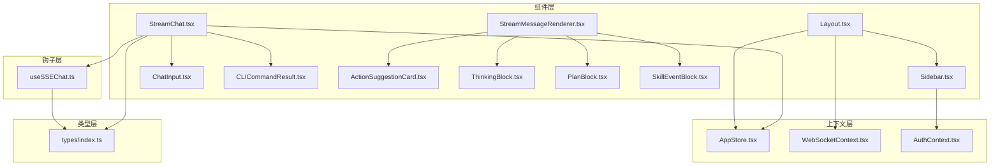
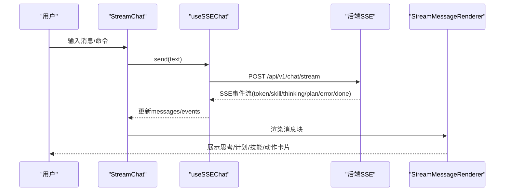
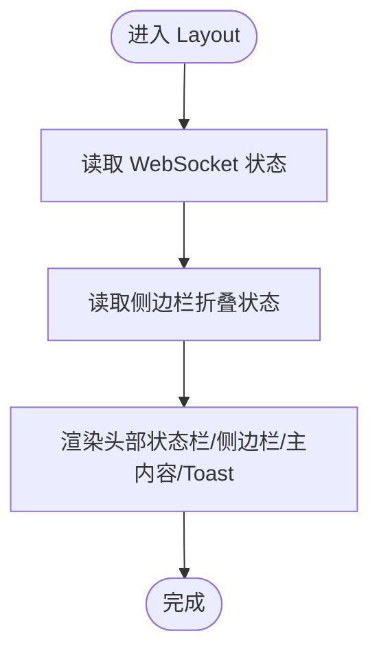
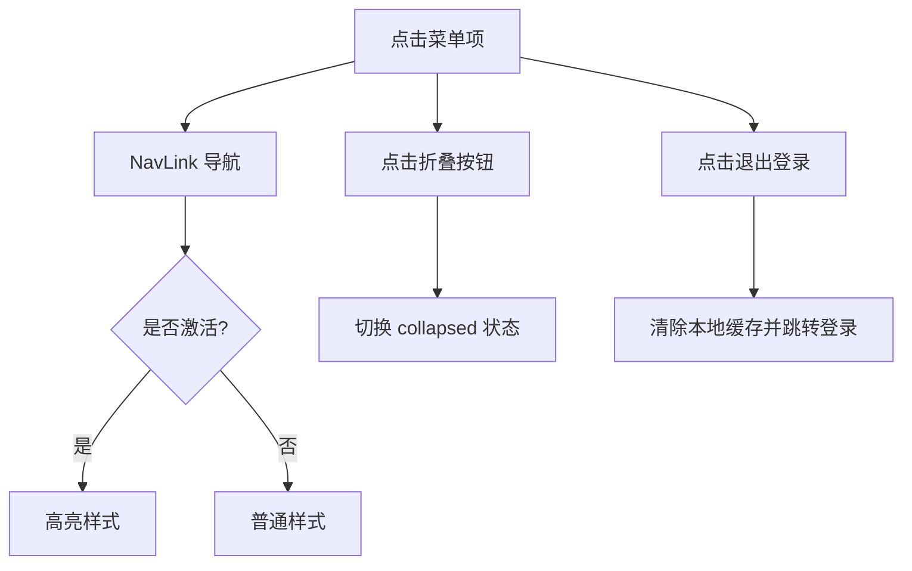
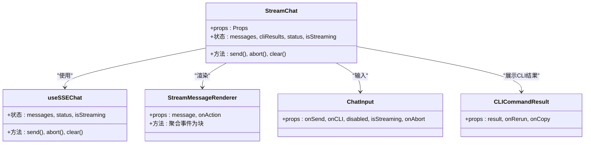
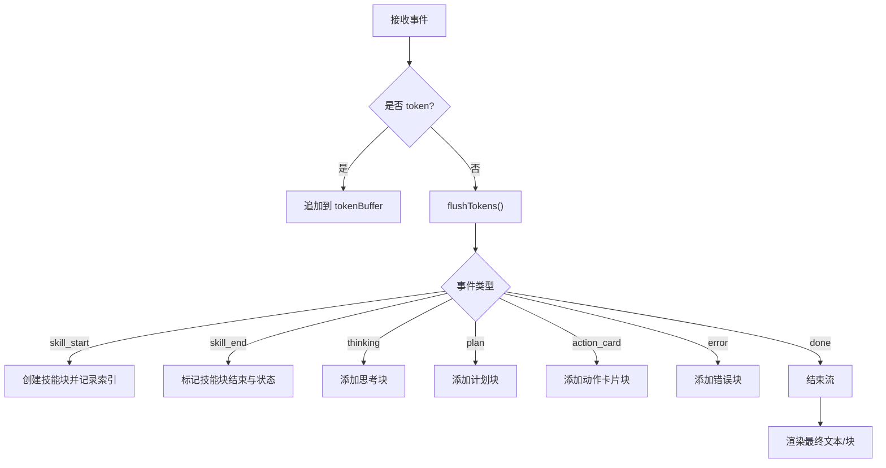
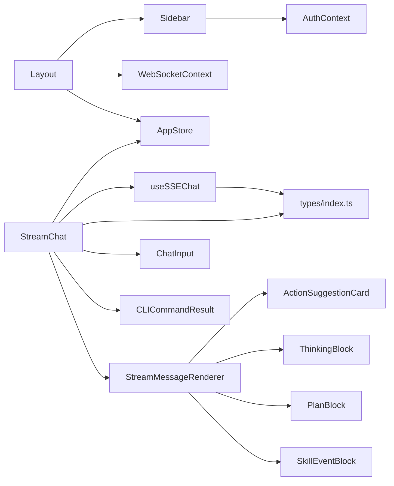

# 组件库系统

<cite>
**本文档引用的文件**
- [Layout.tsx](file://frontend/src/components/Layout.tsx)
- [Sidebar.tsx](file://frontend/src/components/Sidebar.tsx)
- [StreamChat.tsx](file://frontend/src/components/StreamChat.tsx)
- [StreamMessageRenderer.tsx](file://frontend/src/components/StreamMessageRenderer.tsx)
- [AppStore.tsx](file://frontend/src/context/AppStore.tsx)
- [WebSocketContext.tsx](file://frontend/src/context/WebSocketContext.tsx)
- [useSSEChat.ts](file://frontend/src/hooks/useSSEChat.ts)
- [index.ts](file://frontend/src/types/index.ts)
- [ChatInput.tsx](file://frontend/src/components/ChatInput.tsx)
- [CLICommandResult.tsx](file://frontend/src/components/CLICommandResult.tsx)
- [ActionSuggestionCard.tsx](file://frontend/src/components/ActionSuggestionCard.tsx)
- [ThinkingBlock.tsx](file://frontend/src/components/ThinkingBlock.tsx)
- [PlanBlock.tsx](file://frontend/src/components/PlanBlock.tsx)
- [SkillEventBlock.tsx](file://frontend/src/components/SkillEventBlock.tsx)
- [AuthContext.tsx](file://frontend/src/context/AuthContext.tsx)
</cite>

## 目录
1. [引言](#引言)
2. [项目结构](#项目结构)
3. [核心组件](#核心组件)
4. [架构总览](#架构总览)
5. [组件详解](#组件详解)
6. [依赖关系分析](#依赖关系分析)
7. [性能与可扩展性](#性能与可扩展性)
8. [故障排查指南](#故障排查指南)
9. [结论](#结论)
10. [附录](#附录)

## 引言
本文件面向避风港平台的前端组件库系统，系统化梳理基础组件的设计原则、复用模式与层次结构；重点解析布局组件(Layout)、导航组件(Sidebar)、聊天组件(StreamChat)及其配套子组件；阐述Props接口设计、事件处理机制与状态管理；说明样式系统(TailwindCSS)、主题定制与响应式策略；给出组件开发规范、测试策略与文档编写指南，并总结组件间通信模式、依赖关系与最佳实践。

## 项目结构
前端组件库位于 frontend/src/components 与 frontend/src/context、frontend/src/hooks、frontend/src/types 下，采用按功能域分层组织：
- 组件层：页面级与业务组件（如 Layout、Sidebar、StreamChat 等）
- 上下文层：全局状态与服务（如 AppStore、WebSocketContext、AuthContext）
- 钩子层：通用能力封装（如 useSSEChat）
- 类型层：统一的数据契约（frontend/src/types/index.ts）

图表来源
- [Layout.tsx:1-60](file://frontend/src/components/Layout.tsx#L1-L60)
- [Sidebar.tsx:1-163](file://frontend/src/components/Sidebar.tsx#L1-L163)
- [StreamChat.tsx:1-207](file://frontend/src/components/StreamChat.tsx#L1-L207)
- [StreamMessageRenderer.tsx:1-200](file://frontend/src/components/StreamMessageRenderer.tsx#L1-L200)
- [AppStore.tsx:1-107](file://frontend/src/context/AppStore.tsx#L1-L107)
- [WebSocketContext.tsx:1-132](file://frontend/src/context/WebSocketContext.tsx#L1-L132)
- [useSSEChat.ts:1-278](file://frontend/src/hooks/useSSEChat.ts#L1-L278)
- [index.ts:1-477](file://frontend/src/types/index.ts#L1-L477)
- [ChatInput.tsx:1-118](file://frontend/src/components/ChatInput.tsx#L1-L118)
- [CLICommandResult.tsx:1-67](file://frontend/src/components/CLICommandResult.tsx#L1-L67)
- [ActionSuggestionCard.tsx:1-89](file://frontend/src/components/ActionSuggestionCard.tsx#L1-L89)
- [ThinkingBlock.tsx:1-35](file://frontend/src/components/ThinkingBlock.tsx#L1-L35)
- [PlanBlock.tsx:1-69](file://frontend/src/components/PlanBlock.tsx#L1-L69)
- [SkillEventBlock.tsx:1-69](file://frontend/src/components/SkillEventBlock.tsx#L1-L69)

章节来源
- [Layout.tsx:1-60](file://frontend/src/components/Layout.tsx#L1-L60)
- [Sidebar.tsx:1-163](file://frontend/src/components/Sidebar.tsx#L1-L163)
- [StreamChat.tsx:1-207](file://frontend/src/components/StreamChat.tsx#L1-L207)
- [StreamMessageRenderer.tsx:1-200](file://frontend/src/components/StreamMessageRenderer.tsx#L1-L200)
- [AppStore.tsx:1-107](file://frontend/src/context/AppStore.tsx#L1-L107)
- [WebSocketContext.tsx:1-132](file://frontend/src/context/WebSocketContext.tsx#L1-L132)
- [useSSEChat.ts:1-278](file://frontend/src/hooks/useSSEChat.ts#L1-L278)
- [index.ts:1-477](file://frontend/src/types/index.ts#L1-L477)
- [ChatInput.tsx:1-118](file://frontend/src/components/ChatInput.tsx#L1-L118)
- [CLICommandResult.tsx:1-67](file://frontend/src/components/CLICommandResult.tsx#L1-L67)
- [ActionSuggestionCard.tsx:1-89](file://frontend/src/components/ActionSuggestionCard.tsx#L1-L89)
- [ThinkingBlock.tsx:1-35](file://frontend/src/components/ThinkingBlock.tsx#L1-L35)
- [PlanBlock.tsx:1-69](file://frontend/src/components/PlanBlock.tsx#L1-L69)
- [SkillEventBlock.tsx:1-69](file://frontend/src/components/SkillEventBlock.tsx#L1-L69)

## 核心组件
- 布局组件 Layout：负责页面骨架、顶部状态栏、侧边栏、主内容区与全局通知层的组合。
- 导航组件 Sidebar：提供主菜单与管理员专属菜单、用户信息展示、折叠切换与登出。
- 聊天组件 StreamChat：承载对话流式渲染、SSE连接管理、CLI命令支持与操作建议交互。
- 子组件族：StreamMessageRenderer 负责将SSE事件聚合为 UI 块；ThinkingBlock/PlanBlock/SkillEventBlock/ActionSuggestionCard 提供专业块级渲染；ChatInput 提供输入与快捷命令入口；CLICommandResult 展示CLI执行结果。

章节来源
- [Layout.tsx:15-59](file://frontend/src/components/Layout.tsx#L15-L59)
- [Sidebar.tsx:27-129](file://frontend/src/components/Sidebar.tsx#L27-L129)
- [StreamChat.tsx:38-206](file://frontend/src/components/StreamChat.tsx#L38-L206)
- [StreamMessageRenderer.tsx:22-53](file://frontend/src/components/StreamMessageRenderer.tsx#L22-L53)

## 架构总览
组件库采用“容器组件 + 渲染组件 + 钩子 + 上下文”的分层架构：
- 容器组件：Layout、Sidebar、StreamChat 负责编排与状态接入。
- 渲染组件：StreamMessageRenderer 及其子块组件负责事件聚合与 UI 呈现。
- 钩子：useSSEChat 封装 SSE 连接、事件解析与消息队列。
- 上下文：AppStore（Zustand）、WebSocketContext（自定义）、AuthContext（登录态）提供跨层级共享状态。

图表来源
- [StreamChat.tsx:51-56](file://frontend/src/components/StreamChat.tsx#L51-L56)
- [useSSEChat.ts:102-261](file://frontend/src/hooks/useSSEChat.ts#L102-L261)
- [StreamMessageRenderer.tsx:22-53](file://frontend/src/components/StreamMessageRenderer.tsx#L22-L53)

## 组件详解

### 布局组件 Layout
- 职责：固定页面骨架，挂载侧边栏、顶部通知栏、主内容 Outlet 与全局 Toast。
- 状态接入：WebSocket 连接状态与重连控制、侧边栏折叠状态。
- 样式：TailwindCSS 实现 Flex 布局、边框与背景色，响应式适配。

图表来源
- [Layout.tsx:15-59](file://frontend/src/components/Layout.tsx#L15-L59)

章节来源
- [Layout.tsx:15-59](file://frontend/src/components/Layout.tsx#L15-L59)

### 导航组件 Sidebar
- 职责：主菜单与管理员菜单、用户信息展示、折叠切换、登出。
- 交互：NavLink 激活态样式、图标与文字在折叠状态下的隐藏/居中。
- 权限：根据 isAdmin 动态渲染管理员区块。

图表来源
- [Sidebar.tsx:27-129](file://frontend/src/components/Sidebar.tsx#L27-L129)

章节来源
- [Sidebar.tsx:27-129](file://frontend/src/components/Sidebar.tsx#L27-L129)

### 聊天组件 StreamChat
- 职责：承载对话界面、SSE 连接、消息流式渲染、CLI 命令支持、操作建议交互。
- Props 设计：initialMessage/onInitialMessageConsumed、endpoint/sessionId、title/subtitle/placeholder、onAction。
- 状态管理：内部维护 messages/cliResults，通过 useSSEChat 获取 status/isStreaming/send/abort/clear。
- 事件处理：将 SSE 事件聚合为 UI 块，支持 token、skill、thinking、plan、action_card、error、done。

图表来源
- [StreamChat.tsx:10-27](file://frontend/src/components/StreamChat.tsx#L10-L27)
- [StreamChat.tsx:38-206](file://frontend/src/components/StreamChat.tsx#L38-L206)
- [useSSEChat.ts:85-277](file://frontend/src/hooks/useSSEChat.ts#L85-L277)
- [StreamMessageRenderer.tsx:8-11](file://frontend/src/components/StreamMessageRenderer.tsx#L8-L11)
- [ChatInput.tsx:4-11](file://frontend/src/components/ChatInput.tsx#L4-L11)
- [CLICommandResult.tsx:3-7](file://frontend/src/components/CLICommandResult.tsx#L3-L7)

章节来源
- [StreamChat.tsx:10-27](file://frontend/src/components/StreamChat.tsx#L10-L27)
- [StreamChat.tsx:38-206](file://frontend/src/components/StreamChat.tsx#L38-L206)
- [useSSEChat.ts:85-277](file://frontend/src/hooks/useSSEChat.ts#L85-L277)
- [StreamMessageRenderer.tsx:22-53](file://frontend/src/components/StreamMessageRenderer.tsx#L22-L53)

### 事件渲染器 StreamMessageRenderer
- 职责：将 SSE 事件流聚合为有序 UI 块，包括连续 token 文本、skill_start/skill_end 技能块、thinking/plan/action_card 独立块、error 错误提示。
- 聚合策略：token 缓冲合并、skill 块匹配开始/结束、done/error 控制流结束。
- 子块：ThinkingBlock、PlanBlock、SkillEventBlock、ActionSuggestionCard。

图表来源
- [StreamMessageRenderer.tsx:65-146](file://frontend/src/components/StreamMessageRenderer.tsx#L65-L146)
- [StreamMessageRenderer.tsx:150-199](file://frontend/src/components/StreamMessageRenderer.tsx#L150-L199)

章节来源
- [StreamMessageRenderer.tsx:22-53](file://frontend/src/components/StreamMessageRenderer.tsx#L22-L53)
- [StreamMessageRenderer.tsx:65-146](file://frontend/src/components/StreamMessageRenderer.tsx#L65-L146)
- [StreamMessageRenderer.tsx:150-199](file://frontend/src/components/StreamMessageRenderer.tsx#L150-L199)

### 子组件族
- ActionSuggestionCard：展示可执行动作建议，支持风险级别与状态标签，提供确认/跳过交互。
- ThinkingBlock：可展开的思考过程块，支持深度标注与折叠。
- PlanBlock：执行计划进度条与步骤列表，可视化当前步骤与状态。
- SkillEventBlock：技能执行详情，展示入参、结果与耗时。
- ChatInput：多行输入、自动高度、快捷命令识别、Enter/Shift+Enter 行为控制。
- CLICommandResult：展示 CLI 命令执行结果与错误，支持重新执行与复制。

章节来源
- [ActionSuggestionCard.tsx:25-88](file://frontend/src/components/ActionSuggestionCard.tsx#L25-L88)
- [ThinkingBlock.tsx:8-34](file://frontend/src/components/ThinkingBlock.tsx#L8-L34)
- [PlanBlock.tsx:15-68](file://frontend/src/components/PlanBlock.tsx#L15-L68)
- [SkillEventBlock.tsx:11-68](file://frontend/src/components/SkillEventBlock.tsx#L11-L68)
- [ChatInput.tsx:13-117](file://frontend/src/components/ChatInput.tsx#L13-L117)
- [CLICommandResult.tsx:9-66](file://frontend/src/components/CLICommandResult.tsx#L9-L66)

## 依赖关系分析
- 组件依赖：Layout 依赖 Sidebar、WebSocketContext、AppStore；Sidebar 依赖 AuthContext；StreamChat 依赖 useSSEChat、AppStore、StreamMessageRenderer、ChatInput、CLICommandResult。
- 状态依赖：AppStore 提供聊天配置与侧边栏状态；WebSocketContext 提供 WS 连接状态与事件分发；AuthContext 提供登录态与鉴权。
- 数据契约：types/index.ts 定义了 SSE 事件、消息、动作、计划、技能结果等统一类型。

图表来源
- [Layout.tsx:1-7](file://frontend/src/components/Layout.tsx#L1-L7)
- [Sidebar.tsx:1-4](file://frontend/src/components/Sidebar.tsx#L1-L4)
- [StreamChat.tsx:1-9](file://frontend/src/components/StreamChat.tsx#L1-L9)
- [AppStore.tsx:1-3](file://frontend/src/context/AppStore.tsx#L1-L3)
- [WebSocketContext.tsx:1-19](file://frontend/src/context/WebSocketContext.tsx#L1-L19)
- [AuthContext.tsx:1-19](file://frontend/src/context/AuthContext.tsx#L1-L19)
- [useSSEChat.ts:1-8](file://frontend/src/hooks/useSSEChat.ts#L1-L8)
- [index.ts:306-429](file://frontend/src/types/index.ts#L306-L429)

章节来源
- [Layout.tsx:1-7](file://frontend/src/components/Layout.tsx#L1-L7)
- [Sidebar.tsx:1-4](file://frontend/src/components/Sidebar.tsx#L1-L4)
- [StreamChat.tsx:1-9](file://frontend/src/components/StreamChat.tsx#L1-L9)
- [AppStore.tsx:1-3](file://frontend/src/context/AppStore.tsx#L1-L3)
- [WebSocketContext.tsx:1-19](file://frontend/src/context/WebSocketContext.tsx#L1-L19)
- [AuthContext.tsx:1-19](file://frontend/src/context/AuthContext.tsx#L1-L19)
- [useSSEChat.ts:1-8](file://frontend/src/hooks/useSSEChat.ts#L1-L8)
- [index.ts:306-429](file://frontend/src/types/index.ts#L306-L429)

## 性能与可扩展性
- 流式渲染优化：useSSEChat 使用 AbortController 中断上一次请求，避免并发冲突；仅在 done/error 时终止流，减少无效渲染。
- 状态最小化：AppStore 使用 zustand，局部状态更新避免全量重渲染；Sidebar 状态独立于聊天配置，降低耦合。
- 滚动与懒加载：StreamChat 自动滚动到底部；消息块按需渲染，避免一次性渲染大量节点。
- 可扩展点：StreamMessageRenderer 的聚合策略可扩展更多事件类型；ActionSuggestionCard 支持外部 onAction 回调扩展业务动作。

章节来源
- [useSSEChat.ts:128-131](file://frontend/src/hooks/useSSEChat.ts#L128-L131)
- [useSSEChat.ts:197-208](file://frontend/src/hooks/useSSEChat.ts#L197-L208)
- [StreamChat.tsx:64-66](file://frontend/src/components/StreamChat.tsx#L64-L66)
- [StreamMessageRenderer.tsx:65-146](file://frontend/src/components/StreamMessageRenderer.tsx#L65-L146)

## 故障排查指南
- WebSocket 连接问题：检查 WebSocketProvider 的连接 URL、心跳与重连逻辑；通过 useWebSocketContext 的 status 与 reconnect 快速定位。
- SSE 连接异常：useSSEChat 在网络错误时注入 error 事件，检查后端 SSE 端点与跨域配置；关注 isStreaming 与 status 的状态变化。
- CLI 命令不可用：CLICommandResult 在 CLI API 不可用时提供本地回退（/help、/status、/config、/clear），确认本地回退分支是否触发。
- 登录态失效：AuthContext 通过 localStorage 恢复登录态，若登录失败检查 /api/v1/auth/login 返回与本地存储一致性。

章节来源
- [WebSocketContext.tsx:39-92](file://frontend/src/context/WebSocketContext.tsx#L39-L92)
- [useSSEChat.ts:221-258](file://frontend/src/hooks/useSSEChat.ts#L221-L258)
- [StreamChat.tsx:78-114](file://frontend/src/components/StreamChat.tsx#L78-L114)
- [AuthContext.tsx:28-42](file://frontend/src/context/AuthContext.tsx#L28-L42)

## 结论
避风港组件库以清晰的分层与职责划分实现高内聚、低耦合：容器组件编排、渲染组件专注展示、钩子抽象底层协议、上下文统一状态。通过统一类型契约与事件聚合渲染，系统在复杂业务场景下仍保持良好的可维护性与扩展性。建议后续持续完善组件文档与测试覆盖，强化主题与响应式体系。

## 附录

### Props 接口设计要点
- StreamChat：支持 initialMessage、endpoint、sessionId、title/subtitle/placeholder、onAction 等可选参数。
- StreamMessageRenderer：接收 message 与可选 onAction 回调。
- ActionSuggestionCard：actions 数组与 onAction 回调。
- ChatInput：onSend/onCLI/onAbort/disabled/isStreaming/placeholder。
- CLICommandResult：result、onRerun/onCopy。

章节来源
- [StreamChat.tsx:10-27](file://frontend/src/components/StreamChat.tsx#L10-L27)
- [StreamMessageRenderer.tsx:8-11](file://frontend/src/components/StreamMessageRenderer.tsx#L8-L11)
- [ActionSuggestionCard.tsx:3-6](file://frontend/src/components/ActionSuggestionCard.tsx#L3-L6)
- [ChatInput.tsx:4-11](file://frontend/src/components/ChatInput.tsx#L4-L11)
- [CLICommandResult.tsx:3-7](file://frontend/src/components/CLICommandResult.tsx#L3-L7)

### 事件处理与状态管理
- SSE 事件解析：parseSSEChunk + parseStreamEvent，提取 token 文本与事件元数据。
- 状态流转：idle/connecting/connected/reconnecting/disconnected/error。
- 交互反馈：流式光标、空状态占位、错误块提示。

章节来源
- [useSSEChat.ts:17-45](file://frontend/src/hooks/useSSEChat.ts#L17-L45)
- [useSSEChat.ts:89-90](file://frontend/src/hooks/useSSEChat.ts#L89-L90)
- [StreamMessageRenderer.tsx:34-51](file://frontend/src/components/StreamMessageRenderer.tsx#L34-L51)

### 样式系统与主题定制
- TailwindCSS：通过原子类组合实现布局、颜色、间距与动画；主题色通过语义化变量（如 text-[#1D1D1F]、bg-[#F5F5F7]）统一风格。
- 响应式：Flex 布局与 min-w-0、truncate 等类保证在不同尺寸下的可读性与紧凑性。
- 主题扩展：建议在 tailwind.config 中集中定义品牌色与字体，避免直接硬编码颜色值。

章节来源
- [Layout.tsx:22-26](file://frontend/src/components/Layout.tsx#L22-L26)
- [Sidebar.tsx:38-43](file://frontend/src/components/Sidebar.tsx#L38-L43)
- [StreamChat.tsx:119-139](file://frontend/src/components/StreamChat.tsx#L119-L139)

### 开发规范与测试策略
- 规范
  - 组件命名：语义化、单一职责；容器组件以名词，渲染组件以名词短语。
  - Props：必填与可选明确区分，提供合理默认值；避免过度嵌套。
  - 状态：优先使用 zustand 管理轻量全局状态；避免跨组件深层传递。
  - 样式：优先使用 Tailwind 原子类；必要时抽取可复用片段。
- 测试
  - 单元测试：针对 useSSEChat 的事件解析与状态机；针对 StreamMessageRenderer 的聚合逻辑。
  - 集成测试：模拟 SSE 事件流，验证消息渲染与交互回调。
  - 端到端：登录 → 进入聊天 → 发送消息 → 查看技能/计划/思考块 → CLI 命令。

章节来源
- [useSSEChat.ts:17-45](file://frontend/src/hooks/useSSEChat.ts#L17-L45)
- [StreamMessageRenderer.tsx:65-146](file://frontend/src/components/StreamMessageRenderer.tsx#L65-L146)