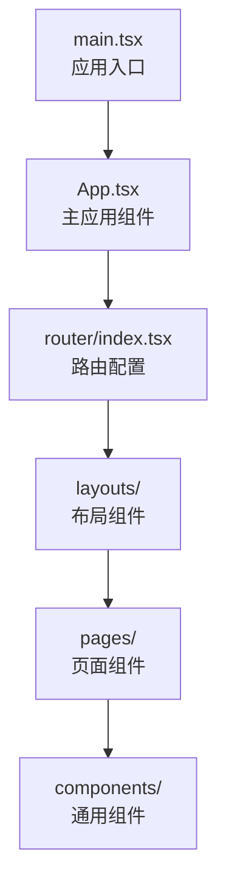
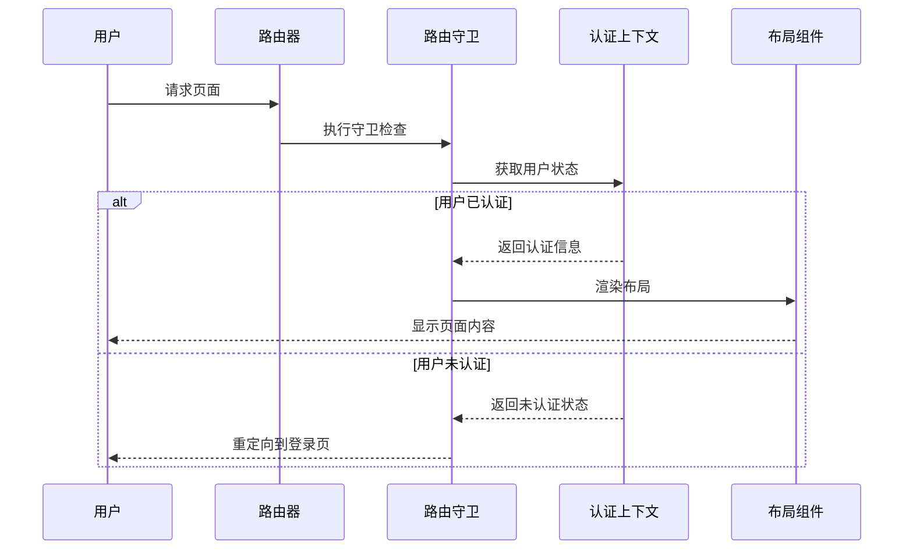
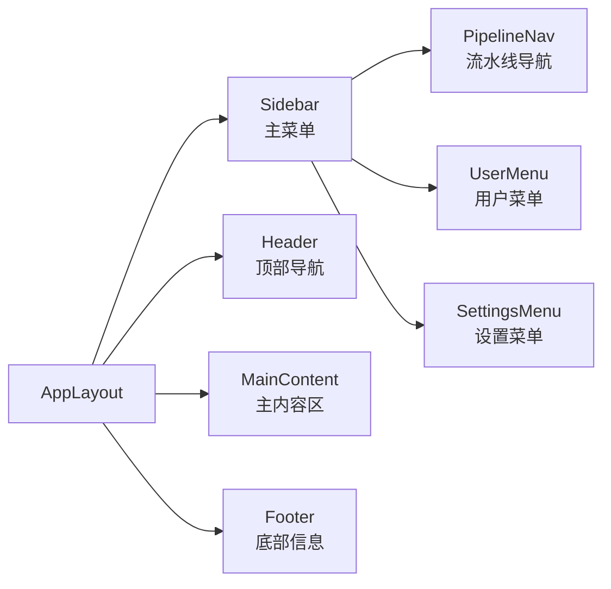
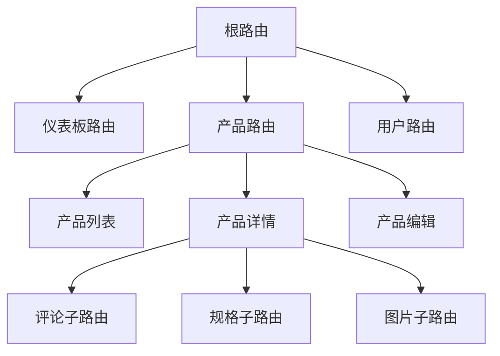
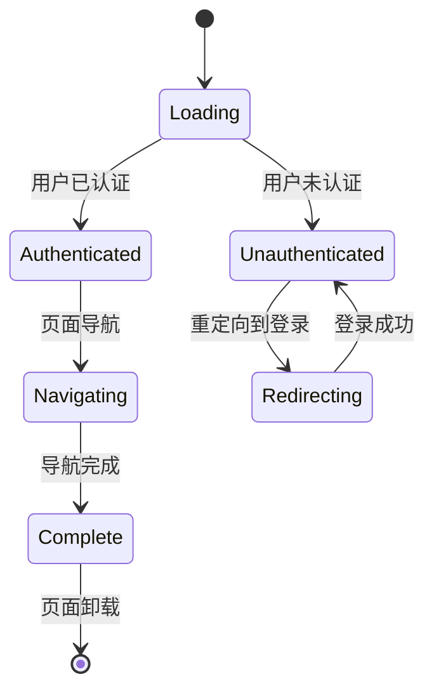
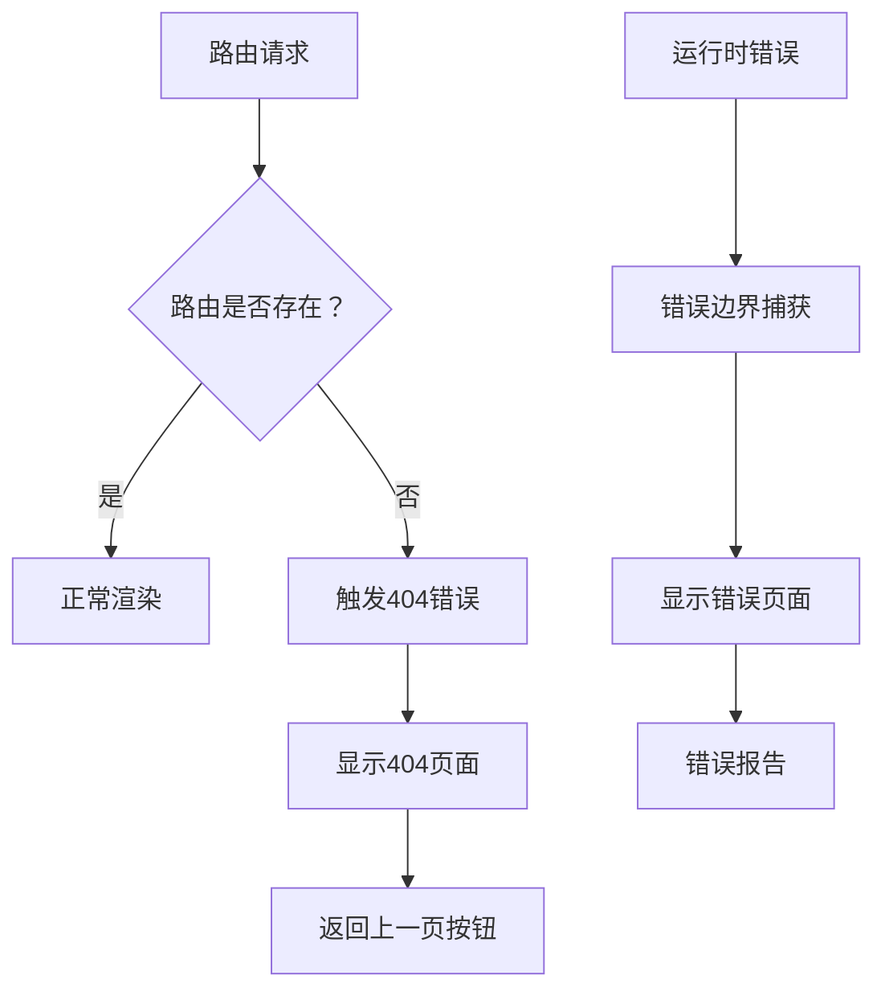

# 路由与导航

<cite>
**本文档引用的文件**
- [main.tsx](file://frontend/src/main.tsx)
- [App.tsx](file://frontend/src/App.tsx)
- [index.tsx](file://frontend/src/router/index.tsx)
- [guards.tsx](file://frontend/src/router/guards.tsx)
- [AppLayout.tsx](file://frontend/src/layouts/AppLayout.tsx)
- [AuthLayout.tsx](file://frontend/src/layouts/AuthLayout.tsx)
- [Sidebar.tsx](file://frontend/src/components/Sidebar.tsx)
- [PipelineNav.tsx](file://frontend/src/components/PipelineNav.tsx)
- [AuthContext.tsx](file://frontend/src/context/AuthContext.tsx)
- [package.json](file://frontend/package.json)
</cite>

## 更新摘要
**所做更改**
- 更新了基于React Router 7.1.0的新路由架构
- 新增了现代化的路由配置结构和页面组件组织
- 重构了路由守卫和权限控制机制
- 更新了布局系统和导航组件设计
- 引入了新的路由状态管理和错误处理策略

## 目录
1. [简介](#简介)
2. [React Router 7.1.0新架构概览](#react-router-710新架构概览)
3. [路由配置与页面组件结构](#路由配置与页面组件结构)
4. [路由守卫与权限控制](#路由守卫与权限控制)
5. [布局系统与导航组件](#布局系统与导航组件)
6. [嵌套路由与动态路由参数](#嵌套路由与动态路由参数)
7. [路由状态管理与历史记录](#路由状态管理与历史记录)
8. [导航菜单与用户偏好](#导航菜单与用户偏好)
9. [错误处理与404页面](#错误处理与404页面)
10. [性能优化与最佳实践](#性能优化与最佳实践)
11. [故障排查指南](#故障排查指南)
12. [结论](#结论)

## 简介
本文档全面介绍避风港平台基于React Router 7.1.0构建的现代化路由与导航系统。该系统采用全新的路由配置结构，实现了更加灵活和高效的页面导航机制。文档详细阐述了路由守卫、权限控制、嵌套路由、动态路由参数、懒加载策略、状态管理、历史记录处理等核心功能，为开发者提供了完整的导航解决方案。

## React Router 7.1.0新架构概览
React Router 7.1.0引入了重大架构改进，包括：

### 核心变化
- **现代化路由配置**：采用更清晰的路由层次结构
- **增强的类型安全**：更好的TypeScript支持
- **优化的性能**：减少不必要的重渲染
- **改进的错误处理**：更友好的错误边界机制

### 版本特性
根据package.json显示，项目使用React Router 7.1.0版本，带来了以下新特性：
- 改进的路由解析算法
- 更高效的内存管理
- 增强的路由缓存机制
- 优化的导航性能

**章节来源**
- [package.json](file://frontend/package.json)

## 路由配置与页面组件结构
新的路由系统采用模块化的页面组件结构，每个页面都是独立的组件，具有明确的功能职责。

### 页面组件组织

**图表来源**
- [main.tsx](file://frontend/src/main.tsx)
- [App.tsx](file://frontend/src/App.tsx)
- [index.tsx](file://frontend/src/router/index.tsx)

### 布局系统
系统采用两层布局结构：

#### 应用布局 (AppLayout)
- 提供完整的应用界面框架
- 包含侧边栏导航、主内容区域
- 管理全局状态和用户偏好

#### 认证布局 (AuthLayout)
- 专门处理登录和注册流程
- 提供简洁的认证界面
- 支持OAuth和其他认证方式

**章节来源**
- [AppLayout.tsx](file://frontend/src/layouts/AppLayout.tsx)
- [AuthLayout.tsx](file://frontend/src/layouts/AuthLayout.tsx)

## 路由守卫与权限控制
React Router 7.1.0引入了更强大的路由守卫机制，实现了细粒度的权限控制。

### 守卫系统架构

**图表来源**
- [guards.tsx](file://frontend/src/router/guards.tsx)
- [AuthContext.tsx](file://frontend/src/context/AuthContext.tsx)

### 权限控制机制
- **角色基础访问控制 (RBAC)**：基于用户角色的权限验证
- **资源级权限**：针对特定资源的访问控制
- **动态权限更新**：实时响应权限变化
- **权限缓存**：提高权限检查性能

**章节来源**
- [guards.tsx](file://frontend/src/router/guards.tsx)
- [AuthContext.tsx](file://frontend/src/context/AuthContext.tsx)

## 布局系统与导航组件
新的布局系统提供了更加灵活和可定制的导航体验。

### 布局组件设计

**图表来源**
- [AppLayout.tsx](file://frontend/src/layouts/AppLayout.tsx)
- [Sidebar.tsx](file://frontend/src/components/Sidebar.tsx)
- [PipelineNav.tsx](file://frontend/src/components/PipelineNav.tsx)

### 导航组件特性
- **响应式设计**：适配不同屏幕尺寸
- **主题支持**：支持深色和浅色主题
- **动画效果**：流畅的过渡动画
- **键盘导航**：完整的键盘操作支持

**章节来源**
- [AppLayout.tsx](file://frontend/src/layouts/AppLayout.tsx)
- [Sidebar.tsx](file://frontend/src/components/Sidebar.tsx)
- [PipelineNav.tsx](file://frontend/src/components/PipelineNav.tsx)

## 嵌套路由与动态路由参数
React Router 7.1.0提供了更强大的嵌套路由支持，简化了复杂的页面结构管理。

### 嵌套路由结构

**图表来源**
- [index.tsx](file://frontend/src/router/index.tsx)

### 动态路由参数处理
- **参数提取**：自动解析URL参数
- **类型安全**：TypeScript类型检查
- **默认值处理**：参数缺失时的默认行为
- **验证机制**：参数格式和范围验证

**章节来源**
- [index.tsx](file://frontend/src/router/index.tsx)

## 路由状态管理与历史记录
新的路由系统提供了更完善的状态管理和历史记录功能。

### 状态管理机制

### 历史记录管理
- **浏览器历史**：完整的前进后退支持
- **状态持久化**：页面状态的保存和恢复
- **会话管理**：跨页面的状态同步
- **错误恢复**：导航错误时的状态回滚

**章节来源**
- [index.tsx](file://frontend/src/router/index.tsx)

## 导航菜单与用户偏好
系统提供了高度可定制的导航菜单和用户偏好设置。

### 动态菜单生成
- **权限驱动**：根据用户权限动态生成菜单项
- **个性化定制**：支持用户自定义菜单布局
- **响应式调整**：根据屏幕大小调整菜单显示
- **快捷方式**：常用功能的快速访问

### 用户偏好存储
- **本地存储**：菜单折叠状态、主题设置
- **服务器同步**：跨设备偏好同步
- **默认配置**：新用户的初始设置
- **偏好重置**：恢复默认设置选项

**章节来源**
- [Sidebar.tsx](file://frontend/src/components/Sidebar.tsx)

## 错误处理与404页面
React Router 7.1.0提供了改进的错误处理机制，确保用户获得良好的错误体验。

### 错误边界机制

**图表来源**
- [index.tsx](file://frontend/src/router/index.tsx)

### 错误处理策略
- **404页面**：友好的页面不存在提示
- **网络错误**：网络连接问题的处理
- **权限错误**：访问被拒绝的处理
- **服务器错误**：服务器内部错误的处理

**章节来源**
- [index.tsx](file://frontend/src/router/index.tsx)

## 性能优化与最佳实践
基于React Router 7.1.0的新特性，系统实现了多项性能优化。

### 性能优化策略
- **路由懒加载**：按需加载路由组件
- **代码分割**：自动进行代码分割
- **缓存机制**：智能的路由结果缓存
- **预加载策略**：关键页面的预加载

### 最佳实践
- **路由命名**：使用语义化的路由名称
- **参数设计**：合理设计路由参数结构
- **嵌套层级**：控制嵌套路由的深度
- **错误处理**：完善的错误处理机制

## 故障排查指南
针对新的路由系统可能出现的问题提供排查指导。

### 常见问题及解决方案
- **路由不生效**：检查路由配置和组件导出
- **权限错误**：验证用户认证状态和权限设置
- **导航异常**：检查路由守卫和状态管理
- **性能问题**：分析路由懒加载和缓存策略

### 调试工具
- **React DevTools**：路由状态的可视化调试
- **浏览器开发者工具**：网络请求和错误日志
- **路由日志**：详细的路由导航日志

**章节来源**
- [index.tsx](file://frontend/src/router/index.tsx)
- [guards.tsx](file://frontend/src/router/guards.tsx)

## 结论
避风港平台的路由与导航系统经过React Router 7.1.0的升级，实现了从传统路由架构到现代化路由系统的转变。新系统不仅提供了更好的性能和用户体验，还增强了安全性、可维护性和扩展性。通过模块化的页面组件结构、强大的路由守卫机制、灵活的布局系统和完善的错误处理，为平台的长期发展奠定了坚实的基础。

开发者可以充分利用新路由系统提供的各种特性，构建更加复杂和高效的导航体验。同时，系统的模块化设计也为未来的功能扩展和技术升级提供了充足的空间。