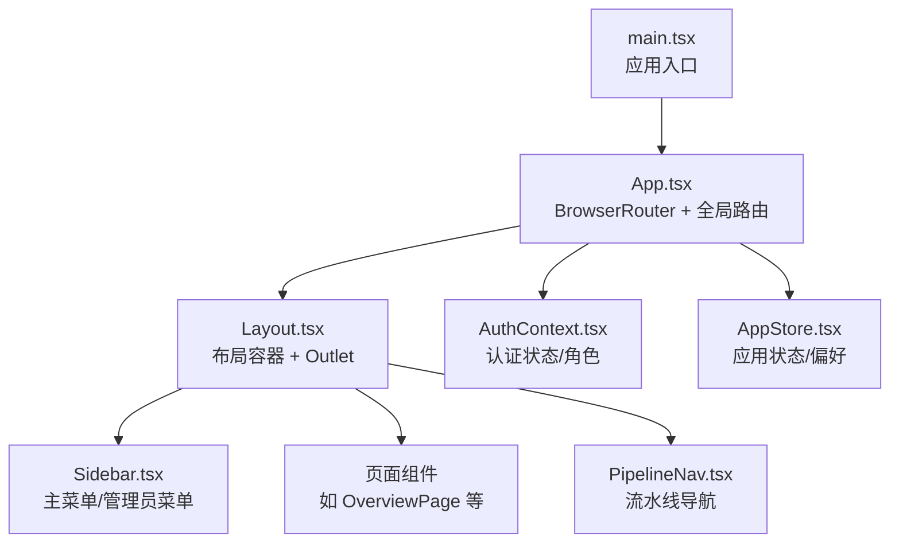
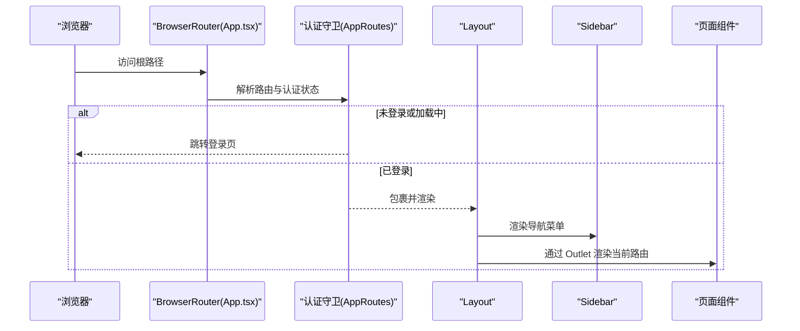
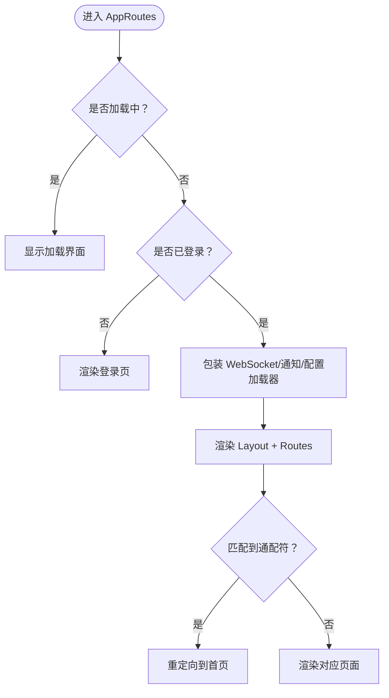
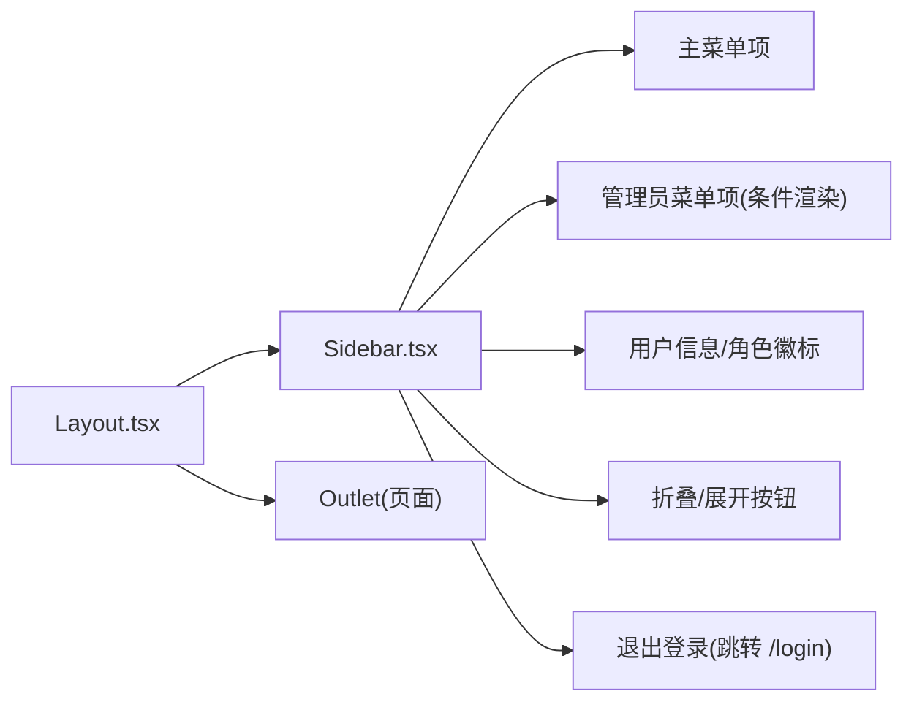
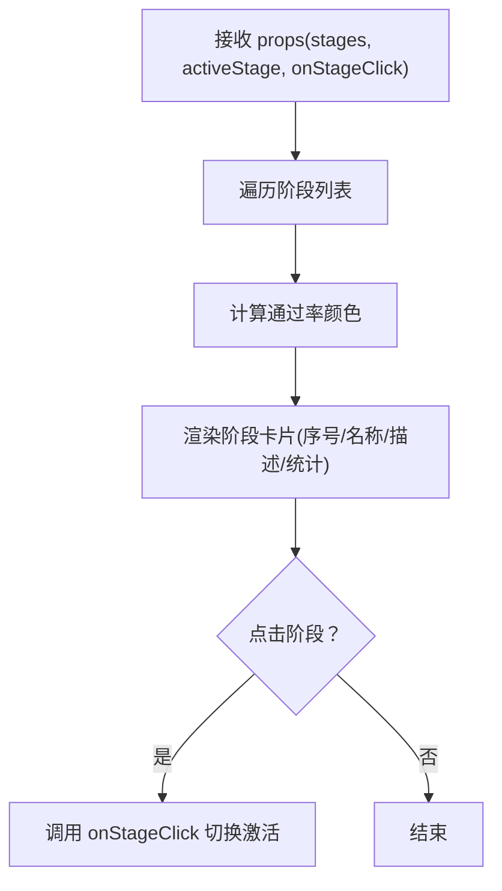
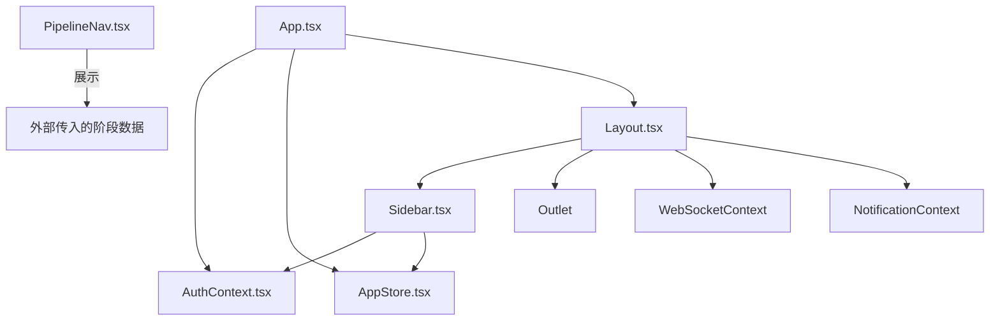

# 路由与导航

<cite>
**本文引用的文件**   
- [App.tsx](file://frontend/src/App.tsx)
- [main.tsx](file://frontend/src/main.tsx)
- [Layout.tsx](file://frontend/src/components/Layout.tsx)
- [Sidebar.tsx](file://frontend/src/components/Sidebar.tsx)
- [PipelineNav.tsx](file://frontend/src/components/PipelineNav.tsx)
- [AuthContext.tsx](file://frontend/src/context/AuthContext.tsx)
- [AppStore.tsx](file://frontend/src/context/AppStore.tsx)
</cite>

## 目录
1. [简介](#简介)
2. [项目结构](#项目结构)
3. [核心组件](#核心组件)
4. [架构总览](#架构总览)
5. [详细组件分析](#详细组件分析)
6. [依赖分析](#依赖分析)
7. [性能考虑](#性能考虑)
8. [故障排查指南](#故障排查指南)
9. [结论](#结论)
10. [附录](#附录)

## 简介
本文件面向避风港平台的前端路由与导航体系，系统性梳理页面路由配置、路由守卫与权限控制、导航组件设计（含 PipelineNav）、面包屑与页面跳转逻辑、嵌套路由与动态路由参数、懒加载策略、路由状态管理与历史记录、前进后退控制、导航菜单的动态生成与权限过滤、用户偏好存储、以及路由错误处理与 404 重定向机制。目标是帮助开发者与产品人员快速理解并高效扩展平台的导航能力。

## 项目结构
前端采用 React + react-router-dom 构建，入口在 main.tsx 中挂载 App；App.tsx 定义全局路由与认证守卫；Layout.tsx 提供页面布局与侧边栏容器；Sidebar.tsx 实现主菜单与管理员菜单的动态渲染；PipelineNav.tsx 用于流水线阶段导航展示；权限与状态通过 AuthContext 与 AppStore 提供。

图表来源
- [main.tsx:1-10](file://frontend/src/main.tsx#L1-L10)
- [App.tsx:1-93](file://frontend/src/App.tsx#L1-L93)
- [Layout.tsx:1-60](file://frontend/src/components/Layout.tsx#L1-L60)
- [Sidebar.tsx:1-163](file://frontend/src/components/Sidebar.tsx#L1-L163)
- [PipelineNav.tsx:1-95](file://frontend/src/components/PipelineNav.tsx#L1-L95)
- [AuthContext.tsx](file://frontend/src/context/AuthContext.tsx)
- [AppStore.tsx](file://frontend/src/context/AppStore.tsx)

章节来源
- [main.tsx:1-10](file://frontend/src/main.tsx#L1-L10)
- [App.tsx:1-93](file://frontend/src/App.tsx#L1-L93)

## 核心组件
- 全局路由与守卫：在 AppRoutes 中根据认证状态与加载状态决定渲染内容，并统一包裹 WebSocketProvider、通知 Provider 与配置加载器。
- 布局容器：Layout 提供顶部状态栏、侧边栏、主内容区与全局通知层，使用 Outlet 渲染当前路由页面。
- 侧边导航：Sidebar 动态渲染主菜单与管理员菜单，支持折叠/展开与登出跳转。
- 流水线导航：PipelineNav 展示阶段列表、通过率、风险与待办等统计信息，支持点击切换激活阶段。
- 权限与状态：AuthContext 提供用户、角色与登录状态；AppStore 提供应用级状态与偏好（如侧边栏折叠）。

章节来源
- [App.tsx:35-82](file://frontend/src/App.tsx#L35-L82)
- [Layout.tsx:15-59](file://frontend/src/components/Layout.tsx#L15-L59)
- [Sidebar.tsx:27-129](file://frontend/src/components/Sidebar.tsx#L27-L129)
- [PipelineNav.tsx:21-95](file://frontend/src/components/PipelineNav.tsx#L21-L95)
- [AuthContext.tsx](file://frontend/src/context/AuthContext.tsx)
- [AppStore.tsx](file://frontend/src/context/AppStore.tsx)

## 架构总览
下图展示了从浏览器请求到页面渲染的关键路径，以及权限与状态如何贯穿整个导航链路。

图表来源
- [App.tsx:35-82](file://frontend/src/App.tsx#L35-L82)
- [Layout.tsx:15-59](file://frontend/src/components/Layout.tsx#L15-L59)
- [Sidebar.tsx:27-129](file://frontend/src/components/Sidebar.tsx#L27-L129)

## 详细组件分析

### 全局路由与守卫（App.tsx）
- 路由组织：BrowserRouter 包裹整个应用；Routes 下定义多条静态路由与一条通配符路由。
- 守卫逻辑：
  - 加载中：显示加载提示。
  - 未登录：直接渲染登录页。
  - 已登录：渲染 Layout，并在 Layout 内部按需渲染各页面。
- 重定向：
  - 将 /config 重定向至 /config/agents。
  - 通配符 * 重定向至首页。
- 嵌套与布局：所有页面均包裹在 Layout 下，形成统一布局容器。

图表来源
- [App.tsx:35-82](file://frontend/src/App.tsx#L35-L82)

章节来源
- [App.tsx:35-82](file://frontend/src/App.tsx#L35-L82)

### 布局与侧边导航（Layout.tsx 与 Sidebar.tsx）
- Layout：
  - 顶部状态栏：左侧可折叠侧边栏；右侧显示 WebSocket 连接状态与手动重连按钮。
  - 主区域：Outlet 占位，承载当前路由页面。
  - 通知层：ToastNotification 固定覆盖。
- Sidebar：
  - 主菜单与管理员菜单分离，依据 isAdmin 动态渲染。
  - 使用 NavLink 高亮当前路由；支持 end 精确匹配首页。
  - 支持折叠/展开，折叠时仅显示图标；登出后跳转到 /login。

图表来源
- [Layout.tsx:15-59](file://frontend/src/components/Layout.tsx#L15-L59)
- [Sidebar.tsx:27-129](file://frontend/src/components/Sidebar.tsx#L27-L129)

章节来源
- [Layout.tsx:15-59](file://frontend/src/components/Layout.tsx#L15-L59)
- [Sidebar.tsx:27-129](file://frontend/src/components/Sidebar.tsx#L27-L129)

### 流水线导航（PipelineNav.tsx）
- 输入：阶段数组、当前激活阶段 ID、点击回调。
- 展示：每个阶段包含序号、名称、描述、通过率进度条、风险产品数、待办任务数。
- 交互：点击阶段按钮可切换激活状态；激活时显示更明显的高亮与向上的指示符。
- 视觉：根据通过率自动选择颜色主题，体现高/中/低风险。

图表来源
- [PipelineNav.tsx:21-95](file://frontend/src/components/PipelineNav.tsx#L21-L95)

章节来源
- [PipelineNav.tsx:21-95](file://frontend/src/components/PipelineNav.tsx#L21-L95)

### 权限控制与用户偏好
- 权限控制：
  - 登录态：通过 AuthContext 的 user 字段判断是否渲染受保护内容。
  - 角色控制：isAdmin 控制管理员菜单的可见性与部分功能入口。
- 用户偏好：
  - 侧边栏折叠状态：通过 AppStore 的状态与方法进行持久化与切换。
  - WebSocket 连接状态：Layout 中展示并支持手动重连。

章节来源
- [App.tsx:35-48](file://frontend/src/App.tsx#L35-L48)
- [Sidebar.tsx:28-103](file://frontend/src/components/Sidebar.tsx#L28-L103)
- [Layout.tsx:16-46](file://frontend/src/components/Layout.tsx#L16-L46)
- [AppStore.tsx](file://frontend/src/context/AppStore.tsx)

### 嵌套路由、动态路由参数与懒加载
- 嵌套路由：所有页面均在 Layout 下渲染，形成“布局嵌套”模式，便于共享头部、侧边栏与通知。
- 动态路由参数：存在形如 /products/:id/chat 的动态段，可用于在页面内读取参数并加载数据。
- 懒加载策略：当前路由配置未显式使用 React.lazy/异步组件，建议对大型页面或不常用模块采用懒加载以优化首屏性能。

章节来源
- [App.tsx:54-78](file://frontend/src/App.tsx#L54-L78)
- [App.tsx:59](file://frontend/src/App.tsx#L59)

### 路由状态管理、历史记录与前进后退
- 历史记录：BrowserRouter 默认维护浏览器历史栈，支持前进/后退。
- 状态管理：通过 useNavigate/useLocation 等钩子实现程序化导航；Layout 中的 WebSocket 状态与 Sidebar 折叠状态通过 AppStore 管理。
- 建议：对于复杂页面的状态（如筛选器、分页），可结合 URL 查询参数与本地状态共同管理，提升可恢复性与分享性。

章节来源
- [Sidebar.tsx:30](file://frontend/src/components/Sidebar.tsx#L30)
- [Layout.tsx:16-17](file://frontend/src/components/Layout.tsx#L16-L17)
- [AppStore.tsx](file://frontend/src/context/AppStore.tsx)

### 导航菜单的动态生成、权限过滤与用户偏好
- 动态生成：Sidebar 通过常量数组 mainItems/adminItems 定义菜单项，运行时根据 isAdmin 条件渲染。
- 权限过滤：仅管理员可见“管理员”分区下的菜单项；用户角色信息来自 AuthContext。
- 用户偏好：侧边栏折叠状态通过 AppStore 的 toggle 方法切换并持久化，Layout 与 Sidebar 共享该状态。

章节来源
- [Sidebar.tsx:7-23](file://frontend/src/components/Sidebar.tsx#L7-L23)
- [Sidebar.tsx:92-103](file://frontend/src/components/Sidebar.tsx#L92-L103)
- [Sidebar.tsx:29](file://frontend/src/components/Sidebar.tsx#L29)
- [AppStore.tsx](file://frontend/src/context/AppStore.tsx)

### 路由错误处理、404 页面与重定向机制
- 404 与兜底：通配符路由 * 将未匹配路径重定向至首页，避免白屏。
- 登录态兜底：未登录时直接渲染登录页，防止未授权访问。
- 建议：可在 Layout 外层增加错误边界组件，捕获渲染异常并提供友好提示。

章节来源
- [App.tsx:75-76](file://frontend/src/App.tsx#L75-L76)
- [App.tsx:46-48](file://frontend/src/App.tsx#L46-L48)

## 依赖分析
- 组件耦合：
  - App.tsx 是路由与守卫的核心入口，依赖 AuthContext 与 AppStore。
  - Layout 依赖 Sidebar、WebSocket 上下文与通知组件。
  - Sidebar 依赖 AuthContext 与 AppStore。
  - PipelineNav 为纯展示组件，依赖外部传入的数据与回调。
- 外部依赖：
  - react-router-dom：BrowserRouter、Routes、Route、Navigate、NavLink、useNavigate、useLocation、Outlet。
  - 自定义上下文与状态：AuthContext、WebSocketContext、NotificationContext、AppStore。

图表来源
- [App.tsx:1-93](file://frontend/src/App.tsx#L1-L93)
- [Layout.tsx:1-60](file://frontend/src/components/Layout.tsx#L1-L60)
- [Sidebar.tsx:1-163](file://frontend/src/components/Sidebar.tsx#L1-L163)
- [PipelineNav.tsx:1-95](file://frontend/src/components/PipelineNav.tsx#L1-L95)
- [AuthContext.tsx](file://frontend/src/context/AuthContext.tsx)
- [AppStore.tsx](file://frontend/src/context/AppStore.tsx)

章节来源
- [App.tsx:1-93](file://frontend/src/App.tsx#L1-L93)
- [Layout.tsx:1-60](file://frontend/src/components/Layout.tsx#L1-L60)
- [Sidebar.tsx:1-163](file://frontend/src/components/Sidebar.tsx#L1-L163)
- [PipelineNav.tsx:1-95](file://frontend/src/components/PipelineNav.tsx#L1-L95)

## 性能考虑
- 路由懒加载：对大型页面（如配置中心、监控面板）采用动态导入与 React.lazy，减少初始包体积。
- 渲染优化：Sidebar 与 PipelineNav 为纯展示组件，建议使用 memo 化避免重复渲染。
- 状态下沉：将高频更新的状态（如 WebSocket 状态）限制在局部组件，避免不必要的全局重渲染。
- 预加载：对用户即将访问的页面（如配置页）在进入上一页时预加载资源。

## 故障排查指南
- 登录后仍显示登录页
  - 检查 AuthContext 的 user 是否正确设置；确认 AppRoutes 的加载状态与守卫分支。
- 侧边栏无法折叠/展开
  - 检查 AppStore 的状态与 toggle 方法；确认 Layout 与 Sidebar 是否共享同一状态实例。
- WebSocket 断连
  - 在 Layout 中检查状态映射与重连按钮；确认服务端连接可用。
- 动态路由参数无效
  - 检查页面是否正确读取 useParams；确认路由定义中的动态段拼写一致。
- 404 页面未生效
  - 确认通配符路由位于路由表末尾；检查是否有更具体的路由覆盖了通配符。

章节来源
- [App.tsx:35-82](file://frontend/src/App.tsx#L35-L82)
- [Layout.tsx:16-46](file://frontend/src/components/Layout.tsx#L16-L46)
- [Sidebar.tsx:29-35](file://frontend/src/components/Sidebar.tsx#L29-L35)

## 结论
避风港平台的路由与导航体系以 App.tsx 为核心入口，结合 Layout 的统一布局与 Sidebar 的动态菜单，实现了清晰的权限控制与良好的用户体验。通过将权限、状态与导航解耦，系统具备良好的可扩展性。建议后续引入路由懒加载、错误边界与更完善的面包屑/历史记录管理，进一步提升性能与可维护性。

## 附录
- 关键实现位置参考
  - 全局路由与守卫：[App.tsx:35-82](file://frontend/src/App.tsx#L35-L82)
  - 布局容器与 Outlet：[Layout.tsx:15-59](file://frontend/src/components/Layout.tsx#L15-L59)
  - 侧边导航与菜单项：[Sidebar.tsx:27-129](file://frontend/src/components/Sidebar.tsx#L27-L129)
  - 流水线导航组件：[PipelineNav.tsx:21-95](file://frontend/src/components/PipelineNav.tsx#L21-L95)
  - 权限与状态上下文：[AuthContext.tsx](file://frontend/src/context/AuthContext.tsx)、[AppStore.tsx](file://frontend/src/context/AppStore.tsx)