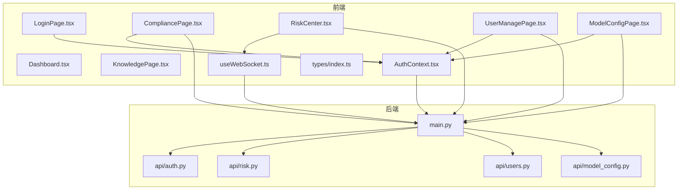
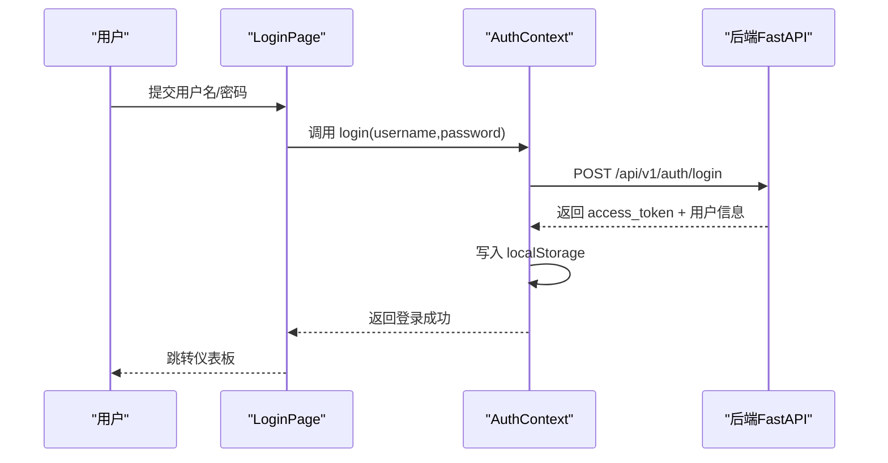
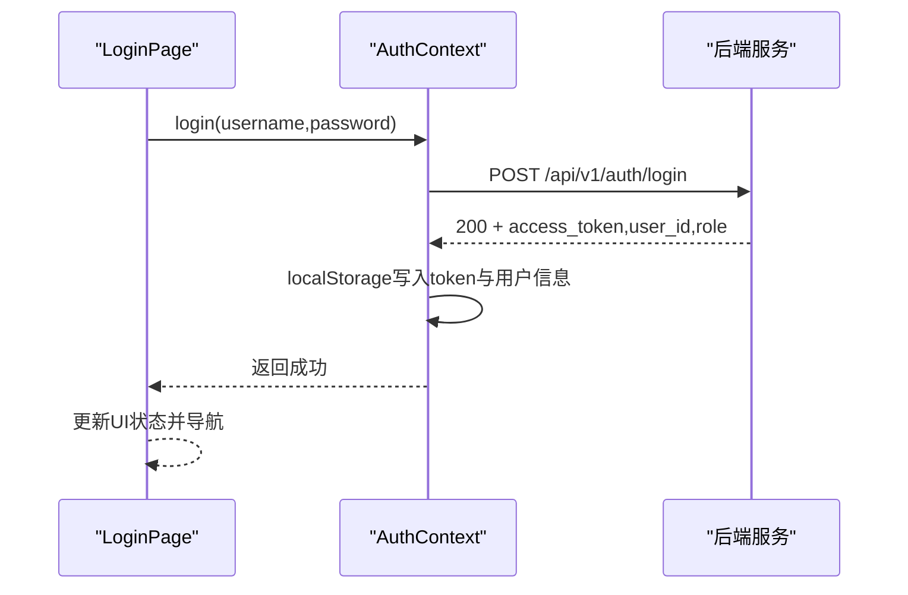
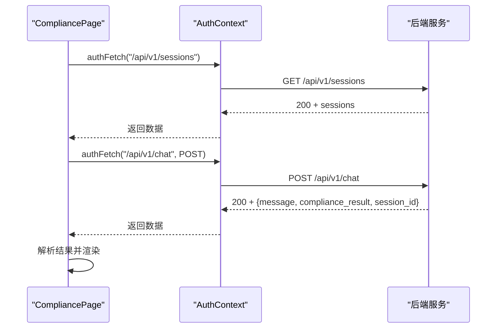
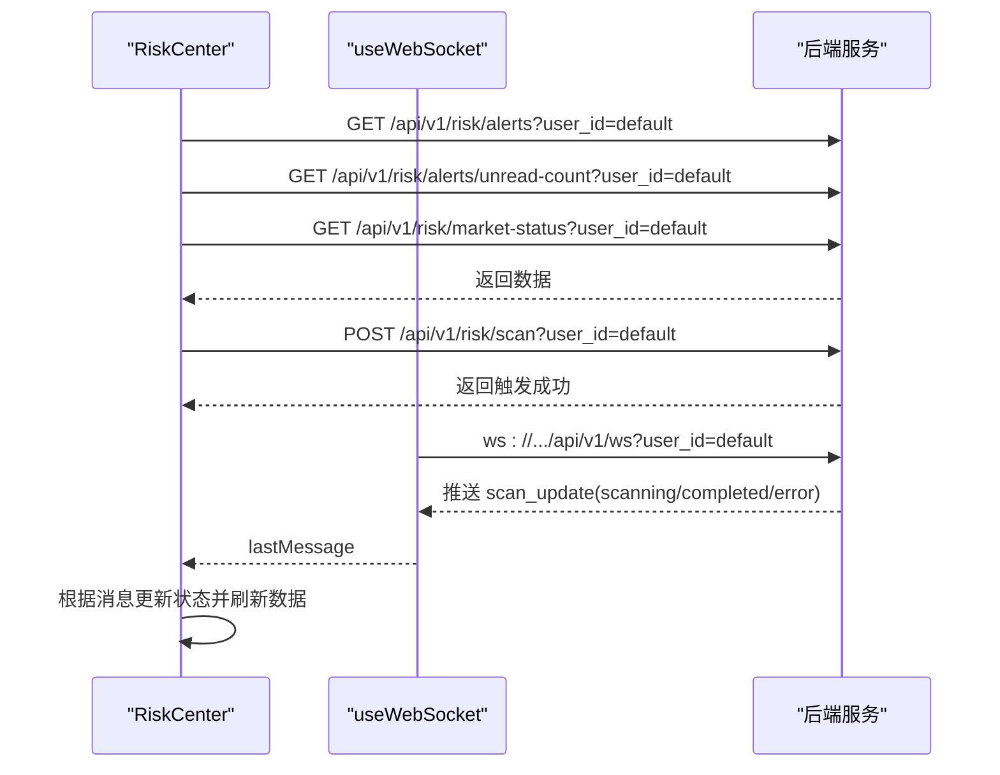
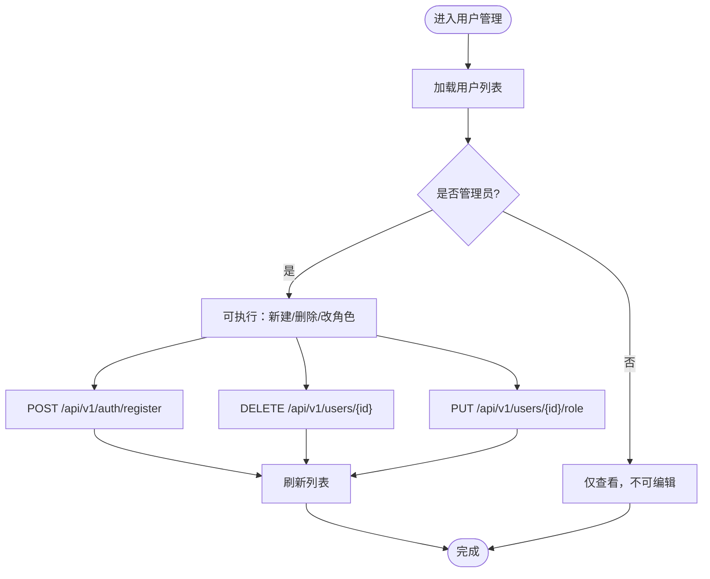
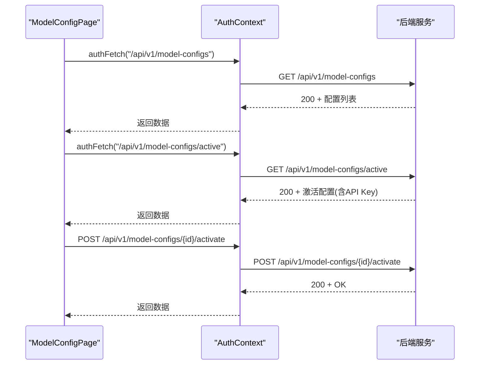
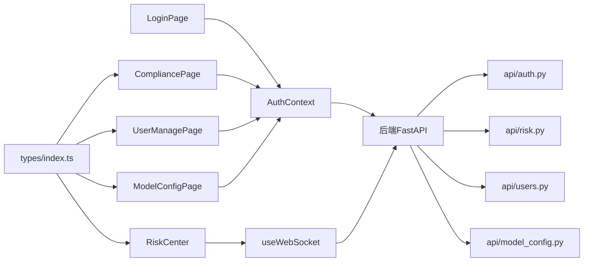

# API集成

<cite>
**本文引用的文件**
- [frontend/src/pages/LoginPage.tsx](file://frontend/src/pages/LoginPage.tsx)
- [frontend/src/context/AuthContext.tsx](file://frontend/src/context/AuthContext.tsx)
- [frontend/src/pages/Dashboard.tsx](file://frontend/src/pages/Dashboard.tsx)
- [frontend/src/pages/CompliancePage.tsx](file://frontend/src/pages/CompliancePage.tsx)
- [frontend/src/pages/RiskCenter.tsx](file://frontend/src/pages/RiskCenter.tsx)
- [frontend/src/pages/UserManagePage.tsx](file://frontend/src/pages/UserManagePage.tsx)
- [frontend/src/pages/ModelConfigPage.tsx](file://frontend/src/pages/ModelConfigPage.tsx)
- [frontend/src/pages/KnowledgePage.tsx](file://frontend/src/pages/KnowledgePage.tsx)
- [frontend/src/hooks/useWebSocket.ts](file://frontend/src/hooks/useWebSocket.ts)
- [frontend/src/types/index.ts](file://frontend/src/types/index.ts)
- [backend/app/main.py](file://backend/app/main.py)
- [backend/app/api/auth.py](file://backend/app/api/auth.py)
- [backend/app/api/risk.py](file://backend/app/api/risk.py)
- [backend/app/api/users.py](file://backend/app/api/users.py)
- [backend/app/api/model_config.py](file://backend/app/api/model_config.py)
</cite>

## 目录
1. [简介](#简介)
2. [项目结构](#项目结构)
3. [核心组件](#核心组件)
4. [架构总览](#架构总览)
5. [详细组件分析](#详细组件分析)
6. [依赖分析](#依赖分析)
7. [性能考虑](#性能考虑)
8. [故障排查指南](#故障排查指南)
9. [结论](#结论)
10. [附录](#附录)

## 简介
本文件面向前端工程师，系统梳理本项目的前端API集成模式与最佳实践，覆盖以下页面组件的调用路径与交互流程：
- 登录页面 LoginPage：认证流程与token管理
- 仪表板 Dashboard：静态内容与导航跳转
- 合规页面 CompliancePage：合规查询、会话历史、导出
- 风险中心 RiskCenter：预警列表、市场状态、扫描触发与WebSocket实时推送
- 用户管理 UserManagePage：用户增删改查（管理员）
- 模型配置 ModelConfigPage：模型预设的增删改查与激活
- 知识库页面 KnowledgePage：静态知识内容浏览

同时，文档说明HTTP请求封装策略、错误处理机制、加载状态管理、数据缓存策略，以及认证token自动添加、请求重试与超时处理的实现要点。

## 项目结构
前端采用按页面组织的结构，页面组件位于 src/pages，共享的上下文与工具位于 src/context 与 src/hooks，类型定义位于 src/types。后端使用FastAPI，路由集中在 backend/app/api 下，主入口在 backend/app/main.py。

图表来源
- [frontend/src/pages/LoginPage.tsx:1-154](file://frontend/src/pages/LoginPage.tsx#L1-L154)
- [frontend/src/context/AuthContext.tsx:1-106](file://frontend/src/context/AuthContext.tsx#L1-L106)
- [frontend/src/pages/CompliancePage.tsx:1-655](file://frontend/src/pages/CompliancePage.tsx#L1-L655)
- [frontend/src/pages/RiskCenter.tsx:1-180](file://frontend/src/pages/RiskCenter.tsx#L1-L180)
- [frontend/src/pages/UserManagePage.tsx:1-314](file://frontend/src/pages/UserManagePage.tsx#L1-L314)
- [frontend/src/pages/ModelConfigPage.tsx:1-441](file://frontend/src/pages/ModelConfigPage.tsx#L1-L441)
- [frontend/src/hooks/useWebSocket.ts:1-68](file://frontend/src/hooks/useWebSocket.ts#L1-L68)
- [frontend/src/types/index.ts:1-305](file://frontend/src/types/index.ts#L1-L305)
- [backend/app/main.py:1-76](file://backend/app/main.py#L1-L76)
- [backend/app/api/auth.py:1-108](file://backend/app/api/auth.py#L1-L108)
- [backend/app/api/risk.py:1-154](file://backend/app/api/risk.py#L1-L154)
- [backend/app/api/users.py:1-55](file://backend/app/api/users.py#L1-L55)
- [backend/app/api/model_config.py:1-173](file://backend/app/api/model_config.py#L1-L173)

章节来源
- [frontend/src/pages/LoginPage.tsx:1-154](file://frontend/src/pages/LoginPage.tsx#L1-L154)
- [frontend/src/context/AuthContext.tsx:1-106](file://frontend/src/context/AuthContext.tsx#L1-L106)
- [frontend/src/pages/CompliancePage.tsx:1-655](file://frontend/src/pages/CompliancePage.tsx#L1-L655)
- [frontend/src/pages/RiskCenter.tsx:1-180](file://frontend/src/pages/RiskCenter.tsx#L1-L180)
- [frontend/src/pages/UserManagePage.tsx:1-314](file://frontend/src/pages/UserManagePage.tsx#L1-L314)
- [frontend/src/pages/ModelConfigPage.tsx:1-441](file://frontend/src/pages/ModelConfigPage.tsx#L1-L441)
- [frontend/src/pages/KnowledgePage.tsx:1-143](file://frontend/src/pages/KnowledgePage.tsx#L1-L143)
- [frontend/src/hooks/useWebSocket.ts:1-68](file://frontend/src/hooks/useWebSocket.ts#L1-L68)
- [frontend/src/types/index.ts:1-305](file://frontend/src/types/index.ts#L1-L305)
- [backend/app/main.py:1-76](file://backend/app/main.py#L1-L76)
- [backend/app/api/auth.py:1-108](file://backend/app/api/auth.py#L1-L108)
- [backend/app/api/risk.py:1-154](file://backend/app/api/risk.py#L1-L154)
- [backend/app/api/users.py:1-55](file://backend/app/api/users.py#L1-L55)
- [backend/app/api/model_config.py:1-173](file://backend/app/api/model_config.py#L1-L173)

## 核心组件
- 认证上下文 AuthContext：提供登录、登出、authFetch（自动注入Authorization）、用户信息与角色判断；token与用户信息持久化至localStorage。
- WebSocket Hook：统一管理WebSocket连接、状态与自动重连，向RiskCenter等组件推送实时消息。
- 页面组件：围绕各自业务职责发起HTTP请求，处理加载态、错误态与成功态，并进行必要的UI反馈。

章节来源
- [frontend/src/context/AuthContext.tsx:1-106](file://frontend/src/context/AuthContext.tsx#L1-L106)
- [frontend/src/hooks/useWebSocket.ts:1-68](file://frontend/src/hooks/useWebSocket.ts#L1-L68)

## 架构总览
前端通过AuthContext封装的authFetch统一发起受保护的HTTP请求，后端以FastAPI提供REST API与WebSocket端点，CORS允许本地开发源。页面组件按职责分别调用不同API端点，RiskCenter通过WebSocket接收实时推送。

图表来源
- [frontend/src/pages/LoginPage.tsx:1-154](file://frontend/src/pages/LoginPage.tsx#L1-L154)
- [frontend/src/context/AuthContext.tsx:44-72](file://frontend/src/context/AuthContext.tsx#L44-L72)
- [backend/app/api/auth.py:54-68](file://backend/app/api/auth.py#L54-L68)

## 详细组件分析

### 登录页面 LoginPage 的认证流程
- 表单校验：非空校验，防止无效请求。
- 加载态：提交期间禁用按钮并显示加载状态。
- 错误处理：捕获异常并展示错误信息。
- 认证调用：通过AuthContext.login发起登录请求，成功后写入localStorage并更新上下文状态。

图表来源
- [frontend/src/pages/LoginPage.tsx:11-23](file://frontend/src/pages/LoginPage.tsx#L11-L23)
- [frontend/src/context/AuthContext.tsx:44-72](file://frontend/src/context/AuthContext.tsx#L44-L72)
- [backend/app/api/auth.py:54-68](file://backend/app/api/auth.py#L54-L68)

章节来源
- [frontend/src/pages/LoginPage.tsx:1-154](file://frontend/src/pages/LoginPage.tsx#L1-L154)
- [frontend/src/context/AuthContext.tsx:44-72](file://frontend/src/context/AuthContext.tsx#L44-L72)
- [backend/app/api/auth.py:54-68](file://backend/app/api/auth.py#L54-L68)

### 仪表板 Dashboard 的数据展示
- 该页面为纯展示组件，不直接发起API请求，通过导航回调跳转到合规查询、智能对话等功能页面。

章节来源
- [frontend/src/pages/Dashboard.tsx:1-429](file://frontend/src/pages/Dashboard.tsx#L1-L429)

### 合规页面 CompliancePage 的查询与会话管理
- 历史加载：使用AuthContext.authFetch获取会话列表与详情。
- 查询流程：构造消息文本，POST到/chat接口，解析返回的合规结果与会话ID。
- 导出功能：Markdown与PDF导出，PDF导出基于合规结果渲染。
- 错误处理：对网络错误与业务错误进行统一捕获与提示。
- 加载状态：查询期间显示加载动画与禁用交互。

图表来源
- [frontend/src/pages/CompliancePage.tsx:47-114](file://frontend/src/pages/CompliancePage.tsx#L47-L114)
- [frontend/src/context/AuthContext.tsx:74-82](file://frontend/src/context/AuthContext.tsx#L74-L82)
- [backend/app/main.py:22-30](file://backend/app/main.py#L22-L30)

章节来源
- [frontend/src/pages/CompliancePage.tsx:1-655](file://frontend/src/pages/CompliancePage.tsx#L1-L655)
- [frontend/src/context/AuthContext.tsx:74-82](file://frontend/src/context/AuthContext.tsx#L74-L82)
- [frontend/src/types/index.ts:19-42](file://frontend/src/types/index.ts#L19-L42)
- [backend/app/main.py:22-30](file://backend/app/main.py#L22-L30)

### 风险中心 RiskCenter 的监控数据与WebSocket
- 并发加载：同时拉取预警列表与未读数、市场状态。
- 扫描触发：POST触发扫描，等待WebSocket推送扫描完成事件后刷新数据。
- 实时推送：useWebSocket监听WebSocket消息，根据消息类型更新状态。
- 错误处理：对fetch与WebSocket异常进行降级处理。

图表来源
- [frontend/src/pages/RiskCenter.tsx:18-77](file://frontend/src/pages/RiskCenter.tsx#L18-L77)
- [frontend/src/hooks/useWebSocket.ts:24-51](file://frontend/src/hooks/useWebSocket.ts#L24-L51)
- [backend/app/api/risk.py:63-107](file://backend/app/api/risk.py#L63-L107)
- [backend/app/main.py:40-55](file://backend/app/main.py#L40-L55)

章节来源
- [frontend/src/pages/RiskCenter.tsx:1-180](file://frontend/src/pages/RiskCenter.tsx#L1-L180)
- [frontend/src/hooks/useWebSocket.ts:1-68](file://frontend/src/hooks/useWebSocket.ts#L1-L68)
- [backend/app/api/risk.py:1-154](file://backend/app/api/risk.py#L1-L154)
- [backend/app/main.py:40-55](file://backend/app/main.py#L40-L55)

### 用户管理 UserManagePage 的权限控制
- 仅管理员可见与可操作：新建用户、删除用户、修改角色。
- 使用AuthContext.authFetch进行受保护的用户管理操作。
- 成功/失败提示：通过局部状态反馈操作结果。

图表来源
- [frontend/src/pages/UserManagePage.tsx:24-74](file://frontend/src/pages/UserManagePage.tsx#L24-L74)
- [frontend/src/context/AuthContext.tsx:89-94](file://frontend/src/context/AuthContext.tsx#L89-L94)
- [backend/app/api/users.py:23-54](file://backend/app/api/users.py#L23-L54)

章节来源
- [frontend/src/pages/UserManagePage.tsx:1-314](file://frontend/src/pages/UserManagePage.tsx#L1-L314)
- [frontend/src/context/AuthContext.tsx:89-94](file://frontend/src/context/AuthContext.tsx#L89-L94)
- [backend/app/api/users.py:1-55](file://backend/app/api/users.py#L1-L55)

### 模型配置 ModelConfigPage 的参数设置
- 预设列表：GET /api/v1/model-configs。
- 激活配置：GET /api/v1/model-configs/active（含完整API Key），POST /api/v1/model-configs/{id}/activate。
- 新建/更新/删除：仅管理员可用，POST/PUT/DELETE对应端点。
- 健康检查：GET /api/v1/health（无需认证）。

图表来源
- [frontend/src/pages/ModelConfigPage.tsx:55-172](file://frontend/src/pages/ModelConfigPage.tsx#L55-L172)
- [frontend/src/context/AuthContext.tsx:74-82](file://frontend/src/context/AuthContext.tsx#L74-L82)
- [backend/app/api/model_config.py:62-151](file://backend/app/api/model_config.py#L62-L151)

章节来源
- [frontend/src/pages/ModelConfigPage.tsx:1-441](file://frontend/src/pages/ModelConfigPage.tsx#L1-L441)
- [frontend/src/context/AuthContext.tsx:74-82](file://frontend/src/context/AuthContext.tsx#L74-L82)
- [backend/app/api/model_config.py:1-173](file://backend/app/api/model_config.py#L1-L173)

### 知识库页面 KnowledgePage 的内容管理
- 该页面为静态内容展示，不涉及API调用。

章节来源
- [frontend/src/pages/KnowledgePage.tsx:1-143](file://frontend/src/pages/KnowledgePage.tsx#L1-L143)

## 依赖分析
- 前端依赖关系：页面组件依赖AuthContext与useWebSocket；类型定义被多个页面与API响应模型共享。
- 后端依赖关系：FastAPI主应用注册各模块路由，WebSocket端点由ws_manager管理连接生命周期。

图表来源
- [frontend/src/pages/LoginPage.tsx:1-154](file://frontend/src/pages/LoginPage.tsx#L1-L154)
- [frontend/src/pages/CompliancePage.tsx:1-655](file://frontend/src/pages/CompliancePage.tsx#L1-L655)
- [frontend/src/pages/RiskCenter.tsx:1-180](file://frontend/src/pages/RiskCenter.tsx#L1-L180)
- [frontend/src/pages/UserManagePage.tsx:1-314](file://frontend/src/pages/UserManagePage.tsx#L1-L314)
- [frontend/src/pages/ModelConfigPage.tsx:1-441](file://frontend/src/pages/ModelConfigPage.tsx#L1-L441)
- [frontend/src/context/AuthContext.tsx:1-106](file://frontend/src/context/AuthContext.tsx#L1-L106)
- [frontend/src/hooks/useWebSocket.ts:1-68](file://frontend/src/hooks/useWebSocket.ts#L1-L68)
- [frontend/src/types/index.ts:1-305](file://frontend/src/types/index.ts#L1-L305)
- [backend/app/main.py:1-76](file://backend/app/main.py#L1-L76)
- [backend/app/api/auth.py:1-108](file://backend/app/api/auth.py#L1-L108)
- [backend/app/api/risk.py:1-154](file://backend/app/api/risk.py#L1-L154)
- [backend/app/api/users.py:1-55](file://backend/app/api/users.py#L1-L55)
- [backend/app/api/model_config.py:1-173](file://backend/app/api/model_config.py#L1-L173)

章节来源
- [frontend/src/pages/LoginPage.tsx:1-154](file://frontend/src/pages/LoginPage.tsx#L1-L154)
- [frontend/src/pages/CompliancePage.tsx:1-655](file://frontend/src/pages/CompliancePage.tsx#L1-L655)
- [frontend/src/pages/RiskCenter.tsx:1-180](file://frontend/src/pages/RiskCenter.tsx#L1-L180)
- [frontend/src/pages/UserManagePage.tsx:1-314](file://frontend/src/pages/UserManagePage.tsx#L1-L314)
- [frontend/src/pages/ModelConfigPage.tsx:1-441](file://frontend/src/pages/ModelConfigPage.tsx#L1-L441)
- [frontend/src/context/AuthContext.tsx:1-106](file://frontend/src/context/AuthContext.tsx#L1-L106)
- [frontend/src/hooks/useWebSocket.ts:1-68](file://frontend/src/hooks/useWebSocket.ts#L1-L68)
- [frontend/src/types/index.ts:1-305](file://frontend/src/types/index.ts#L1-L305)
- [backend/app/main.py:1-76](file://backend/app/main.py#L1-L76)
- [backend/app/api/auth.py:1-108](file://backend/app/api/auth.py#L1-L108)
- [backend/app/api/risk.py:1-154](file://backend/app/api/risk.py#L1-L154)
- [backend/app/api/users.py:1-55](file://backend/app/api/users.py#L1-L55)
- [backend/app/api/model_config.py:1-173](file://backend/app/api/model_config.py#L1-L173)

## 性能考虑
- 并发请求：RiskCenter对多个端点使用Promise.all并发拉取，减少总等待时间。
- 本地缓存：AuthContext在启动时从localStorage恢复token与用户信息，避免重复登录。
- 传输优化：模型配置接口对敏感字段进行遮蔽展示，仅在激活配置时返回完整Key供测试连接。
- WebSocket长连接：useWebSocket内置自动重连逻辑，降低断线对用户体验的影响。

章节来源
- [frontend/src/pages/RiskCenter.tsx:20-30](file://frontend/src/pages/RiskCenter.tsx#L20-L30)
- [frontend/src/context/AuthContext.tsx:28-42](file://frontend/src/context/AuthContext.tsx#L28-L42)
- [frontend/src/pages/ModelConfigPage.tsx:76-90](file://frontend/src/pages/ModelConfigPage.tsx#L76-L90)
- [frontend/src/hooks/useWebSocket.ts:24-51](file://frontend/src/hooks/useWebSocket.ts#L24-L51)

## 故障排查指南
- 登录失败
  - 检查用户名/密码是否正确，后端返回错误时会包含detail字段。
  - 确认CORS配置允许前端域名访问。
- 请求未携带token
  - 确认AuthContext.authFetch已注入Authorization头。
  - 检查localStorage中是否存在token。
- WebSocket无法连接
  - 检查后端WebSocket端点是否启动，确认ws://主机与端口可达。
  - 关注useWebSocket的状态变化与自动重连行为。
- 风险扫描无结果
  - 确认扫描已触发且WebSocket推送了completed事件。
  - 检查后端扫描逻辑与告警创建流程。
- 用户管理权限不足
  - 确认当前用户角色为admin，否则相关端点会返回403/401。

章节来源
- [frontend/src/context/AuthContext.tsx:44-72](file://frontend/src/context/AuthContext.tsx#L44-L72)
- [frontend/src/hooks/useWebSocket.ts:24-51](file://frontend/src/hooks/useWebSocket.ts#L24-L51)
- [backend/app/api/auth.py:54-68](file://backend/app/api/auth.py#L54-L68)
- [backend/app/api/risk.py:63-107](file://backend/app/api/risk.py#L63-L107)
- [backend/app/api/users.py:23-54](file://backend/app/api/users.py#L23-L54)

## 结论
本项目前端通过AuthContext统一管理认证与HTTP请求，配合useWebSocket实现风险监控的实时推送；后端以模块化路由清晰划分功能边界。页面组件遵循一致的加载/错误/成功三态处理模式，具备良好的可维护性与扩展性。建议在生产环境进一步完善请求超时与重试策略、错误日志上报与埋点统计，以提升稳定性与可观测性。

## 附录
- API客户端设计模式
  - 单一入口：authFetch统一注入Authorization头，简化调用方逻辑。
  - 类型安全：通过types/index.ts定义请求/响应模型，增强IDE提示与运行时校验。
- 拦截器与中间件
  - 建议在authFetch基础上封装重试与超时中间件，统一处理401/403/5xx错误。
- 响应数据处理
  - 对于复杂对象（合规结果、会话、风险告警），优先解耦渲染组件与数据结构，便于单元测试与演进。
- 认证token管理
  - 本地持久化与恢复逻辑已在AuthContext中实现，注意跨标签页同步与过期策略。
- 请求重试与超时
  - 可在authFetch外层增加指数退避重试与AbortController超时控制，避免阻塞UI。