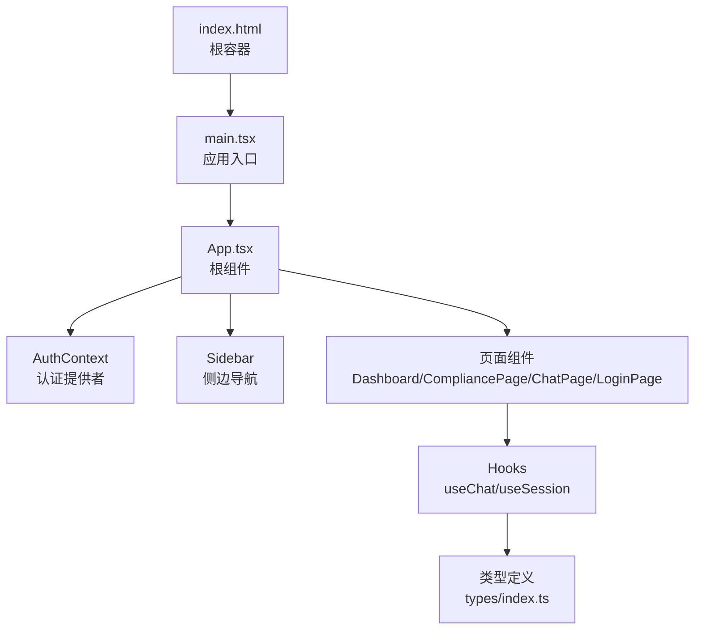
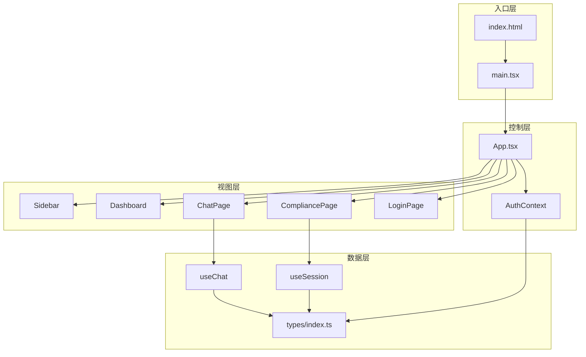
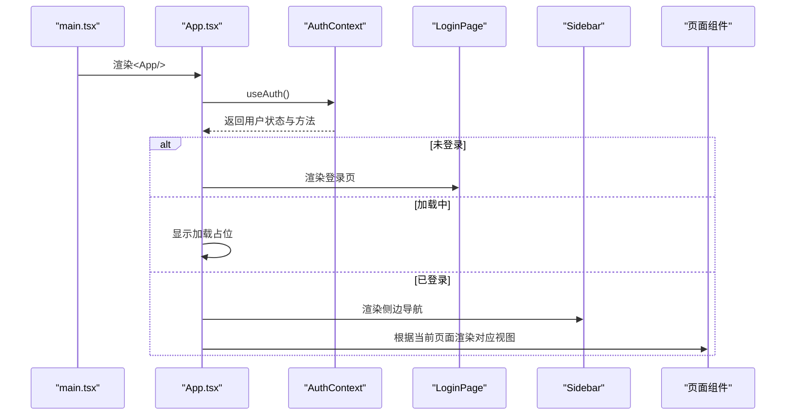
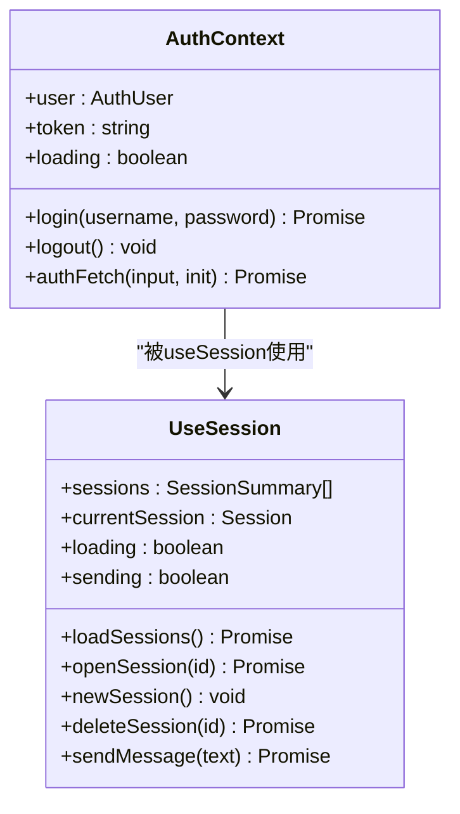
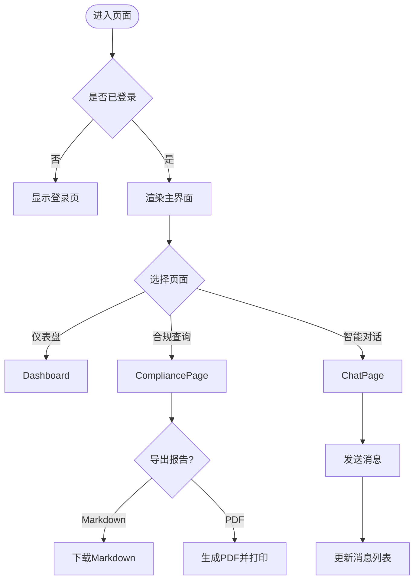
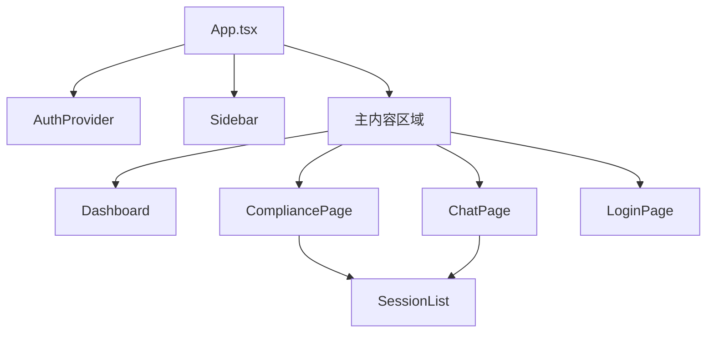
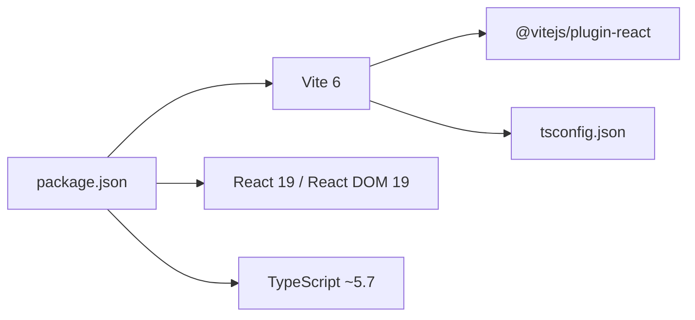

# React应用架构

<cite>
**本文档引用的文件**
- [main.tsx](file://frontend/src/main.tsx)
- [App.tsx](file://frontend/src/App.tsx)
- [index.html](file://frontend/index.html)
- [vite.config.ts](file://frontend/vite.config.ts)
- [tsconfig.json](file://frontend/tsconfig.json)
- [package.json](file://frontend/package.json)
- [AuthContext.tsx](file://frontend/src/context/AuthContext.tsx)
- [Sidebar.tsx](file://frontend/src/components/Sidebar.tsx)
- [Dashboard.tsx](file://frontend/src/pages/Dashboard.tsx)
- [LoginPage.tsx](file://frontend/src/pages/LoginPage.tsx)
- [CompliancePage.tsx](file://frontend/src/pages/CompliancePage.tsx)
- [ChatPage.tsx](file://frontend/src/pages/ChatPage.tsx)
- [useChat.ts](file://frontend/src/hooks/useChat.ts)
- [useSession.ts](file://frontend/src/hooks/useSession.ts)
- [index.ts](file://frontend/src/types/index.ts)
</cite>

## 目录
1. [简介](#简介)
2. [项目结构](#项目结构)
3. [核心组件](#核心组件)
4. [架构总览](#架构总览)
5. [详细组件分析](#详细组件分析)
6. [依赖分析](#依赖分析)
7. [性能考虑](#性能考虑)
8. [故障排除指南](#故障排除指南)
9. [结论](#结论)
10. [附录](#附录)

## 简介
本项目是一个基于 React 19、TypeScript 和 Vite 的前端应用，采用模块化设计与清晰的组件分层，提供跨境合规智能体的可视化界面。应用通过上下文提供者管理认证状态，使用自定义 Hook 封装会话与聊天逻辑，并通过 Vite 提供开发服务器与代理配置，支持热重载与快速构建。

## 项目结构
前端代码位于 `frontend/src` 目录，采用按功能域分层的组织方式：
- 入口与根组件：main.tsx、App.tsx
- 页面组件：Dashboard、LoginPage、CompliancePage、ChatPage 等
- 功能组件：Sidebar、SessionList 等
- 上下文与 Hooks：AuthContext、useChat、useSession
- 类型定义：types/index.ts
- 构建与配置：index.html、vite.config.ts、tsconfig.json、package.json

**图表来源**
- [index.html:12-14](file://frontend/index.html#L12-L14)
- [main.tsx:1-9](file://frontend/src/main.tsx#L1-L9)
- [App.tsx:16-74](file://frontend/src/App.tsx#L16-L74)
- [AuthContext.tsx:23-98](file://frontend/src/context/AuthContext.tsx#L23-L98)
- [Sidebar.tsx:23-147](file://frontend/src/components/Sidebar.tsx#L23-L147)
- [Dashboard.tsx:62-427](file://frontend/src/pages/Dashboard.tsx#L62-L427)
- [CompliancePage.tsx:29-564](file://frontend/src/pages/CompliancePage.tsx#L29-L564)
- [ChatPage.tsx:258-489](file://frontend/src/pages/ChatPage.tsx#L258-L489)
- [useChat.ts:6-60](file://frontend/src/hooks/useChat.ts#L6-L60)
- [useSession.ts:7-161](file://frontend/src/hooks/useSession.ts#L7-L161)
- [index.ts:1-305](file://frontend/src/types/index.ts#L1-L305)

**章节来源**
- [main.tsx:1-9](file://frontend/src/main.tsx#L1-L9)
- [App.tsx:1-75](file://frontend/src/App.tsx#L1-L75)
- [index.html:1-16](file://frontend/index.html#L1-L16)

## 核心组件
- 应用入口与渲染：main.tsx 使用 React 18+ 的 createRoot API 渲染 App 根组件，严格模式包裹确保开发期的额外检查。
- 根组件 App：集中管理页面状态与导航，根据认证状态决定显示登录页或主界面；通过 AuthProvider 提供全局认证上下文。
- 认证上下文 AuthContext：封装登录、登出、token 管理与带鉴权的网络请求，支持从本地存储恢复会话。
- 页面与功能组件：Dashboard 展示概览与快捷查询；CompliancePage 提供合规查询与报告导出；ChatPage 实现会话管理与消息展示；Sidebar 提供导航与用户信息。
- 自定义 Hooks：useChat 封装聊天 API 调用；useSession 封装会话列表、打开、删除与消息发送逻辑。
- 类型系统：types/index.ts 定义了合规结果、会话消息、操作链、事件链、风险预警等核心数据结构。

**章节来源**
- [main.tsx:1-9](file://frontend/src/main.tsx#L1-L9)
- [App.tsx:16-74](file://frontend/src/App.tsx#L16-L74)
- [AuthContext.tsx:23-98](file://frontend/src/context/AuthContext.tsx#L23-L98)
- [Dashboard.tsx:62-427](file://frontend/src/pages/Dashboard.tsx#L62-L427)
- [CompliancePage.tsx:29-564](file://frontend/src/pages/CompliancePage.tsx#L29-L564)
- [ChatPage.tsx:258-489](file://frontend/src/pages/ChatPage.tsx#L258-L489)
- [Sidebar.tsx:23-147](file://frontend/src/components/Sidebar.tsx#L23-L147)
- [useChat.ts:6-60](file://frontend/src/hooks/useChat.ts#L6-L60)
- [useSession.ts:7-161](file://frontend/src/hooks/useSession.ts#L7-L161)
- [index.ts:1-305](file://frontend/src/types/index.ts#L1-L305)

## 架构总览
应用采用“根组件 + 页面组件 + 功能组件 + 上下文/Hook”的分层架构：
- 入口层：index.html 提供根容器，main.tsx 渲染根组件。
- 控制层：App.tsx 管理页面状态与导航，AuthContext 提供认证能力。
- 视图层：页面组件负责业务视图，功能组件负责通用 UI 交互。
- 数据层：Hooks 封装 API 调用与状态管理，类型系统保证数据一致性。

**图表来源**
- [index.html:12-14](file://frontend/index.html#L12-L14)
- [main.tsx:1-9](file://frontend/src/main.tsx#L1-L9)
- [App.tsx:16-74](file://frontend/src/App.tsx#L16-L74)
- [AuthContext.tsx:23-98](file://frontend/src/context/AuthContext.tsx#L23-L98)
- [Sidebar.tsx:23-147](file://frontend/src/components/Sidebar.tsx#L23-L147)
- [Dashboard.tsx:62-427](file://frontend/src/pages/Dashboard.tsx#L62-L427)
- [CompliancePage.tsx:29-564](file://frontend/src/pages/CompliancePage.tsx#L29-L564)
- [ChatPage.tsx:258-489](file://frontend/src/pages/ChatPage.tsx#L258-L489)
- [LoginPage.tsx:4-153](file://frontend/src/pages/LoginPage.tsx#L4-L153)
- [useChat.ts:6-60](file://frontend/src/hooks/useChat.ts#L6-L60)
- [useSession.ts:7-161](file://frontend/src/hooks/useSession.ts#L7-L161)
- [index.ts:1-305](file://frontend/src/types/index.ts#L1-L305)

## 详细组件分析

### 根组件与应用生命周期
- App.tsx 作为应用的外壳，内部通过 AuthProvider 包裹 AppInner，后者维护当前页面状态与导航函数。在用户未登录时显示 LoginPage，在加载中显示占位视图，登录后渲染 Sidebar 与主内容区域。
- 生命周期要点：初始化时根据用户状态切换视图；支持从合规查询页面携带初始消息进入 ChatPage 并自动发送。

**图表来源**
- [main.tsx:1-9](file://frontend/src/main.tsx#L1-L9)
- [App.tsx:16-74](file://frontend/src/App.tsx#L16-L74)
- [AuthContext.tsx:23-98](file://frontend/src/context/AuthContext.tsx#L23-L98)
- [LoginPage.tsx:4-153](file://frontend/src/pages/LoginPage.tsx#L4-L153)
- [Sidebar.tsx:23-147](file://frontend/src/components/Sidebar.tsx#L23-L147)

**章节来源**
- [App.tsx:16-74](file://frontend/src/App.tsx#L16-L74)
- [AuthContext.tsx:23-98](file://frontend/src/context/AuthContext.tsx#L23-L98)

### 认证上下文与会话管理
- AuthContext：提供登录、登出、鉴权请求封装与用户角色判断；从 localStorage 恢复 token 与用户信息；在登录成功后持久化到本地存储。
- useSession：封装会话列表加载、打开、删除、消息发送；统一通过 authFetch 发起带 Bearer Token 的请求；维护本地消息草稿与发送状态。

**图表来源**
- [AuthContext.tsx:23-98](file://frontend/src/context/AuthContext.tsx#L23-L98)
- [useSession.ts:7-161](file://frontend/src/hooks/useSession.ts#L7-L161)

**章节来源**
- [AuthContext.tsx:23-98](file://frontend/src/context/AuthContext.tsx#L23-L98)
- [useSession.ts:7-161](file://frontend/src/hooks/useSession.ts#L7-L161)

### 页面组件与数据流
- Dashboard：提供快速查询与市场覆盖展示，支持跳转到合规查询或智能对话。
- CompliancePage：实现合规查询、历史会话管理、报告导出（Markdown/PDF），支持从历史会话恢复查询条件。
- ChatPage：管理会话列表、消息展示、输入与发送，支持从外部携带初始消息自动发起对话。

**图表来源**
- [App.tsx:16-74](file://frontend/src/App.tsx#L16-L74)
- [Dashboard.tsx:62-427](file://frontend/src/pages/Dashboard.tsx#L62-L427)
- [CompliancePage.tsx:29-564](file://frontend/src/pages/CompliancePage.tsx#L29-L564)
- [ChatPage.tsx:258-489](file://frontend/src/pages/ChatPage.tsx#L258-L489)

**章节来源**
- [Dashboard.tsx:62-427](file://frontend/src/pages/Dashboard.tsx#L62-L427)
- [CompliancePage.tsx:29-564](file://frontend/src/pages/CompliancePage.tsx#L29-L564)
- [ChatPage.tsx:258-489](file://frontend/src/pages/ChatPage.tsx#L258-L489)

### 组件树结构图

**图表来源**
- [App.tsx:16-74](file://frontend/src/App.tsx#L16-L74)
- [Sidebar.tsx:23-147](file://frontend/src/components/Sidebar.tsx#L23-L147)
- [Dashboard.tsx:62-427](file://frontend/src/pages/Dashboard.tsx#L62-L427)
- [CompliancePage.tsx:29-564](file://frontend/src/pages/CompliancePage.tsx#L29-L564)
- [ChatPage.tsx:258-489](file://frontend/src/pages/ChatPage.tsx#L258-L489)
- [LoginPage.tsx:4-153](file://frontend/src/pages/LoginPage.tsx#L4-L153)

## 依赖分析
- 构建工具：Vite 提供开发服务器与代理，支持 TypeScript 与 React JSX 编译；通过插件 @vitejs/plugin-react 启用 Fast Refresh。
- 类型系统：TypeScript 配置启用严格模式、ESNext 模块解析与 bundler 模式，确保类型安全与现代语法支持。
- 依赖管理：package.json 中声明 React 19、React DOM 19、Vite 6、@vitejs/plugin-react、TypeScript 等依赖。

**图表来源**
- [package.json:1-22](file://frontend/package.json#L1-L22)
- [vite.config.ts:1-15](file://frontend/vite.config.ts#L1-L15)
- [tsconfig.json:1-20](file://frontend/tsconfig.json#L1-L20)

**章节来源**
- [package.json:1-22](file://frontend/package.json#L1-L22)
- [vite.config.ts:1-15](file://frontend/vite.config.ts#L1-L15)
- [tsconfig.json:1-20](file://frontend/tsconfig.json#L1-L20)

## 性能考虑
- 组件渲染优化：App.tsx 使用 useState 与 useCallback 控制导航状态与回调，避免不必要的重渲染。
- 会话与消息管理：useSession 在发送消息时维护本地草稿与发送状态，减少无效请求与 UI 抖动。
- 类型约束：通过 types/index.ts 的强类型定义，降低运行时错误概率，提升开发效率与可维护性。
- 开发体验：Vite 的热重载与代理配置（/api -> http://localhost:8000）显著提升调试效率。

## 故障排除指南
- 登录失败：检查 AuthContext 的登录接口返回与错误处理，确认后端地址与凭据正确。
- API 请求异常：useChat 与 useSession 在请求失败时会捕获错误并反馈到消息列表或错误提示。
- 代理配置：vite.config.ts 中的 /api 代理需指向正确的后端地址，确保开发环境跨域访问正常。
- 类型错误：如遇到 TypeScript 类型相关报错，检查 tsconfig.json 的编译选项与模块解析策略。

**章节来源**
- [AuthContext.tsx:44-65](file://frontend/src/context/AuthContext.tsx#L44-L65)
- [useChat.ts:11-57](file://frontend/src/hooks/useChat.ts#L11-L57)
- [useSession.ts:66-148](file://frontend/src/hooks/useSession.ts#L66-L148)
- [vite.config.ts:8-13](file://frontend/vite.config.ts#L8-L13)

## 结论
该 React 应用通过清晰的分层架构与模块化设计，实现了认证、会话、聊天与合规查询的核心功能。配合 Vite 的开发体验与 TypeScript 的类型保障，为后续扩展与维护提供了良好的基础。建议在后续迭代中进一步完善错误边界、国际化与主题系统，并持续优化数据流与状态管理。

## 附录
- 开发环境配置：通过 package.json 的 dev 脚本启动 Vite 开发服务器，端口默认 5173；tsconfig.json 启用严格模式与现代模块解析。
- 生产构建：使用 tsc -b 与 vite build 进行类型检查与打包，输出静态资源至 dist 目录。
- 热重载机制：Vite 的 Fast Refresh 与 React 插件共同实现组件级别的热替换，无需刷新整个页面。

**章节来源**
- [package.json:6-9](file://frontend/package.json#L6-L9)
- [vite.config.ts:6-14](file://frontend/vite.config.ts#L6-L14)
- [tsconfig.json:1-20](file://frontend/tsconfig.json#L1-L20)