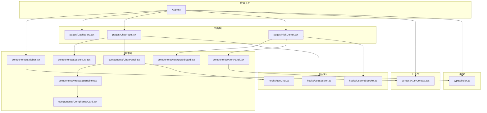
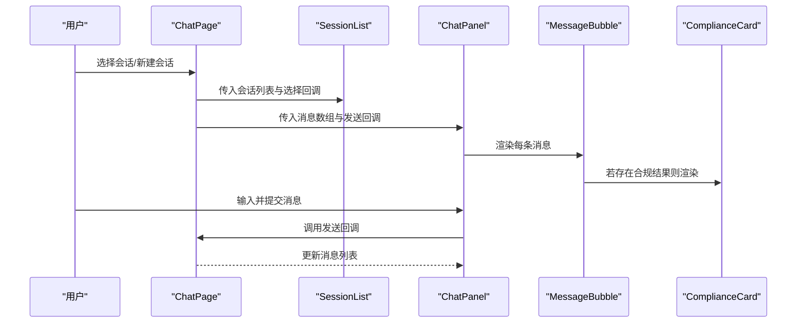
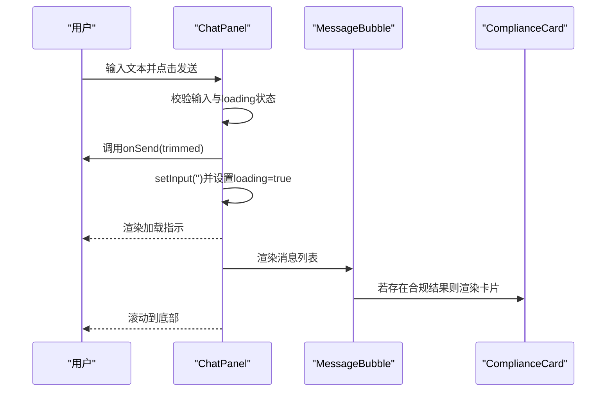
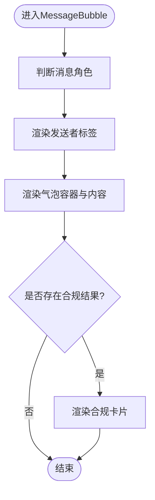
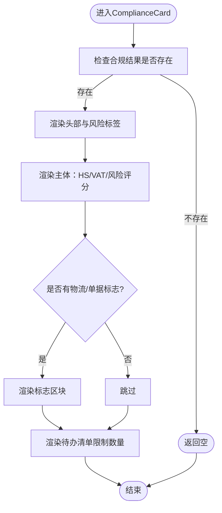
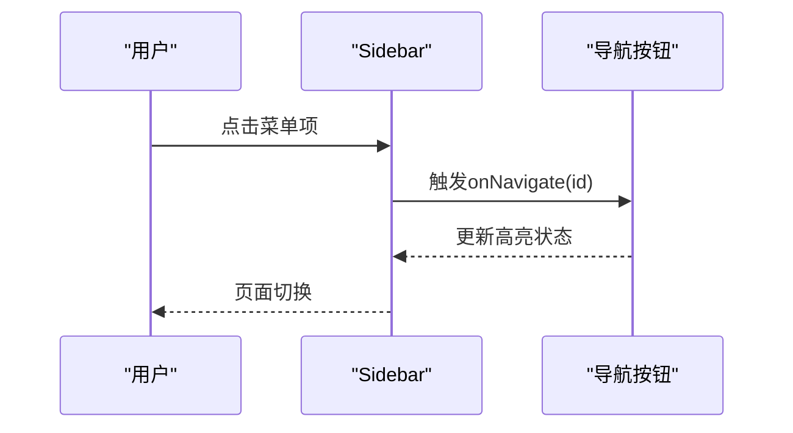
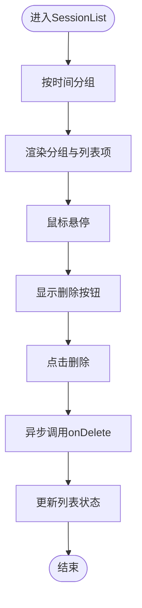
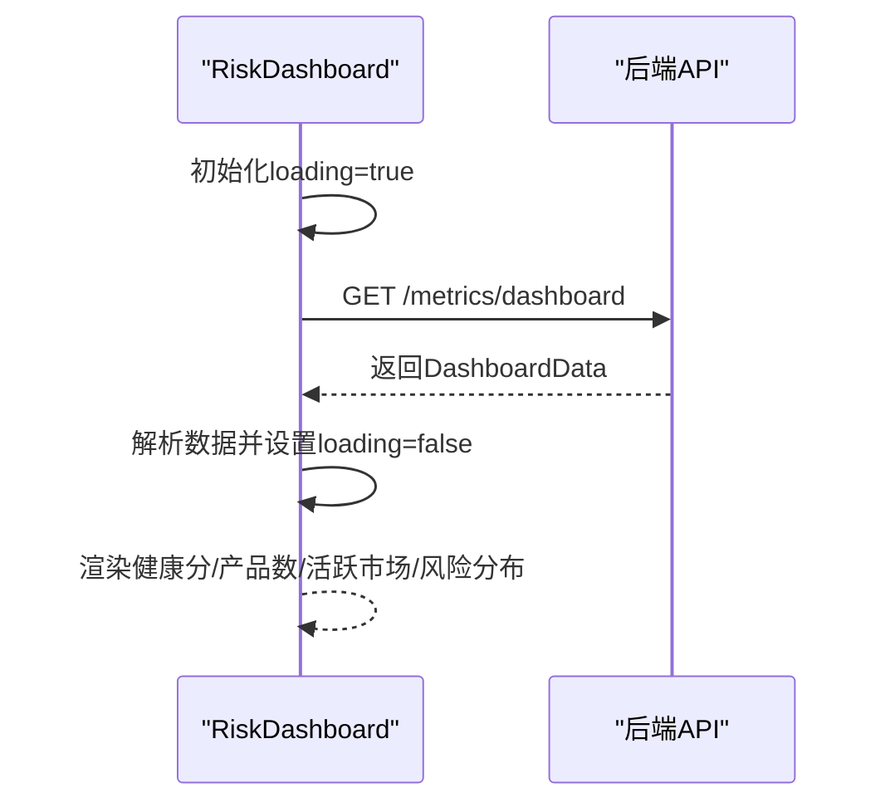
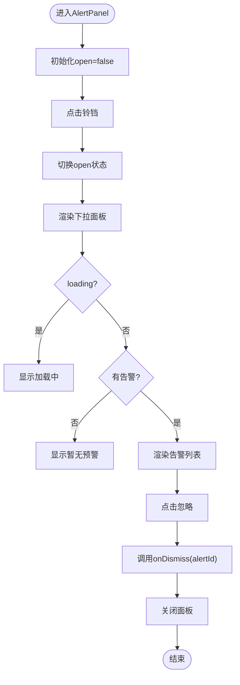
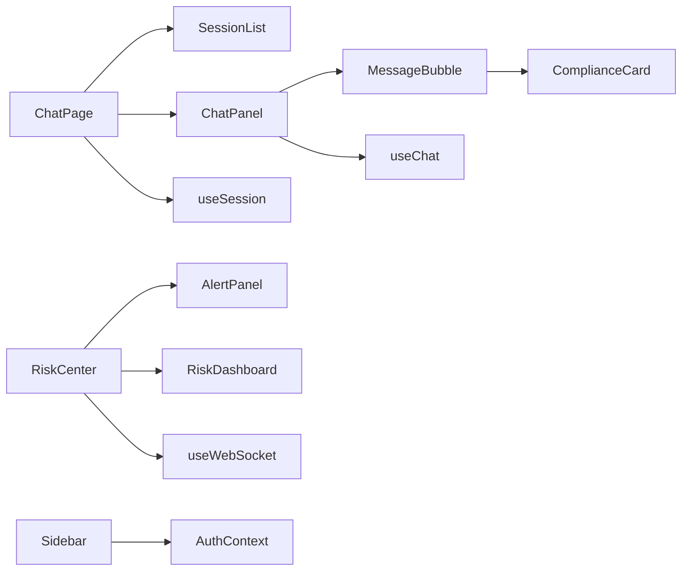

# UI组件系统

<cite>
**本文档引用的文件**
- [ChatPanel.tsx](file://frontend/src/components/ChatPanel.tsx)
- [MessageBubble.tsx](file://frontend/src/components/MessageBubble.tsx)
- [ComplianceCard.tsx](file://frontend/src/components/ComplianceCard.tsx)
- [Sidebar.tsx](file://frontend/src/components/Sidebar.tsx)
- [SessionList.tsx](file://frontend/src/components/SessionList.tsx)
- [RiskDashboard.tsx](file://frontend/src/components/RiskDashboard.tsx)
- [AlertPanel.tsx](file://frontend/src/components/AlertPanel.tsx)
- [types/index.ts](file://frontend/src/types/index.ts)
- [hooks/useChat.ts](file://frontend/src/hooks/useChat.ts)
- [hooks/useSession.ts](file://frontend/src/hooks/useSession.ts)
- [hooks/useWebSocket.ts](file://frontend/src/hooks/useWebSocket.ts)
- [context/AuthContext.tsx](file://frontend/src/context/AuthContext.tsx)
- [pages/ChatPage.tsx](file://frontend/src/pages/ChatPage.tsx)
- [pages/Dashboard.tsx](file://frontend/src/pages/Dashboard.tsx)
- [pages/RiskCenter.tsx](file://frontend/src/pages/RiskCenter.tsx)
- [App.tsx](file://frontend/src/App.tsx)
</cite>

## 目录
1. [简介](#简介)
2. [项目结构](#项目结构)
3. [核心组件](#核心组件)
4. [架构总览](#架构总览)
5. [详细组件分析](#详细组件分析)
6. [依赖关系分析](#依赖关系分析)
7. [性能考量](#性能考量)
8. [故障排查指南](#故障排查指南)
9. [结论](#结论)
10. [附录](#附录)

## 简介
本文件系统性梳理前端UI组件体系，围绕聊天面板、消息气泡、合规卡片、侧边栏、会话列表、风险仪表盘与告警面板等核心组件，阐述设计理念、实现细节、数据流与事件处理机制，并给出组件间通信模式、props传递策略与自定义样式的最佳实践。

## 项目结构
前端采用按功能域组织的目录结构，核心组件位于 components 目录，页面组件位于 pages 目录，类型定义集中在 types 目录，业务逻辑通过 hooks 抽离，全局状态通过 context 管理。

图表来源
- [App.tsx:1-75](file://frontend/src/App.tsx#L1-L75)
- [pages/ChatPage.tsx:1-491](file://frontend/src/pages/ChatPage.tsx#L1-L491)
- [pages/RiskCenter.tsx:1-180](file://frontend/src/pages/RiskCenter.tsx#L1-L180)
- [components/Sidebar.tsx:1-182](file://frontend/src/components/Sidebar.tsx#L1-L182)
- [components/ChatPanel.tsx:1-142](file://frontend/src/components/ChatPanel.tsx#L1-L142)
- [components/SessionList.tsx:1-223](file://frontend/src/components/SessionList.tsx#L1-L223)
- [components/MessageBubble.tsx:1-64](file://frontend/src/components/MessageBubble.tsx#L1-L64)
- [components/ComplianceCard.tsx:1-141](file://frontend/src/components/ComplianceCard.tsx#L1-L141)
- [components/RiskDashboard.tsx:1-98](file://frontend/src/components/RiskDashboard.tsx#L1-L98)
- [components/AlertPanel.tsx:1-167](file://frontend/src/components/AlertPanel.tsx#L1-L167)
- [hooks/useChat.ts:1-61](file://frontend/src/hooks/useChat.ts#L1-L61)
- [hooks/useSession.ts:1-162](file://frontend/src/hooks/useSession.ts#L1-L162)
- [hooks/useWebSocket.ts](file://frontend/src/hooks/useWebSocket.ts)
- [context/AuthContext.tsx:1-106](file://frontend/src/context/AuthContext.tsx#L1-L106)
- [types/index.ts:1-305](file://frontend/src/types/index.ts#L1-L305)

章节来源
- [App.tsx:1-75](file://frontend/src/App.tsx#L1-L75)
- [types/index.ts:1-305](file://frontend/src/types/index.ts#L1-L305)

## 核心组件
- 聊天面板 ChatPanel：负责消息展示、输入处理与滚动定位；内部组合消息气泡与合规卡片。
- 消息气泡 MessageBubble：渲染单条消息内容，支持基础Markdown渲染与合规卡片嵌入。
- 合规卡片 ComplianceCard：展示HS编码、VAT税率、风险等级、认证要求、物流与单据标志及待办清单。
- 侧边栏 Sidebar：提供导航与用户信息展示，支持管理员专属菜单与登出。
- 会话列表 SessionList：按日期分组展示历史会话，支持新建、选择与删除。
- 风险仪表盘 RiskDashboard：从后端API拉取仪表盘数据，展示健康分、产品数、活跃市场与风险分布。
- 告警面板 AlertPanel：下拉式告警面板，支持未读计数、忽略与查看全部。

章节来源
- [ChatPanel.tsx:1-142](file://frontend/src/components/ChatPanel.tsx#L1-L142)
- [MessageBubble.tsx:1-64](file://frontend/src/components/MessageBubble.tsx#L1-L64)
- [ComplianceCard.tsx:1-141](file://frontend/src/components/ComplianceCard.tsx#L1-L141)
- [Sidebar.tsx:1-182](file://frontend/src/components/Sidebar.tsx#L1-L182)
- [SessionList.tsx:1-223](file://frontend/src/components/SessionList.tsx#L1-L223)
- [RiskDashboard.tsx:1-98](file://frontend/src/components/RiskDashboard.tsx#L1-L98)
- [AlertPanel.tsx:1-167](file://frontend/src/components/AlertPanel.tsx#L1-L167)

## 架构总览
组件间通过props向下传递数据，通过回调向上游传递事件；页面组件协调多个子组件与hooks，形成“页面-组件-钩子-上下文”的层次化架构。

图表来源
- [pages/ChatPage.tsx:258-491](file://frontend/src/pages/ChatPage.tsx#L258-L491)
- [components/SessionList.tsx:32-109](file://frontend/src/components/SessionList.tsx#L32-L109)
- [components/ChatPanel.tsx:11-142](file://frontend/src/components/ChatPanel.tsx#L11-L142)
- [components/MessageBubble.tsx:8-51](file://frontend/src/components/MessageBubble.tsx#L8-L51)
- [components/ComplianceCard.tsx:19-131](file://frontend/src/components/ComplianceCard.tsx#L19-L131)

## 详细组件分析

### 聊天面板 ChatPanel
- 设计理念
  - 单页内聚：在单一容器中完成头部、消息区域与输入区的布局与交互。
  - 响应式滚动：消息新增或加载完成后自动滚动到底部。
  - 加载态：通过loading状态与动画指示器提升反馈。
- 实现要点
  - 使用表单提交处理输入，防重复提交与空输入校验。
  - 消息为空时展示引导文案；加载中显示脉冲点阵。
  - 消息渲染通过MessageBubble组件复用，支持合规卡片嵌入。
- props与事件
  - 接收 messages、loading、onSend 三个属性。
  - onSend在表单提交时被调用，返回字符串文本。
- 交互流程

图表来源
- [components/ChatPanel.tsx:11-142](file://frontend/src/components/ChatPanel.tsx#L11-L142)
- [components/MessageBubble.tsx:8-51](file://frontend/src/components/MessageBubble.tsx#L8-L51)
- [components/ComplianceCard.tsx:19-131](file://frontend/src/components/ComplianceCard.tsx#L19-L131)

章节来源
- [components/ChatPanel.tsx:1-142](file://frontend/src/components/ChatPanel.tsx#L1-L142)

### 消息气泡 MessageBubble
- 设计理念
  - 区分用户与助手消息，采用不同圆角与背景以增强辨识度。
  - 支持基础Markdown渲染（标题、加粗、列表、分割线、换行），保证内容可读性。
  - 合规卡片作为消息扩展，仅在存在合规结果时渲染。
- 实现要点
  - 通过renderContent函数进行简单转换，避免引入复杂依赖。
  - 根据消息角色决定对齐方式、气泡背景与圆角方向。
- props与事件
  - 接收message对象，内部不向外抛出事件。
- 渲染流程

图表来源
- [components/MessageBubble.tsx:8-51](file://frontend/src/components/MessageBubble.tsx#L8-L51)
- [components/ComplianceCard.tsx:19-131](file://frontend/src/components/ComplianceCard.tsx#L19-L131)

章节来源
- [components/MessageBubble.tsx:1-64](file://frontend/src/components/MessageBubble.tsx#L1-L64)

### 合规卡片 ComplianceCard
- 设计理念
  - 以卡片形式聚合合规关键指标，突出风险等级颜色编码。
  - 分区块展示HS编码、VAT税率、风险评分、认证要求、物流与单据标志、待办清单。
- 实现要点
  - 风险等级映射颜色与标签，统一视觉语言。
  - 认证要求与待办清单采用紧凑布局，支持截断与展开。
- props与事件
  - 接收ComplianceResult对象，内部不向外抛出事件。
- 展示流程

图表来源
- [components/ComplianceCard.tsx:19-131](file://frontend/src/components/ComplianceCard.tsx#L19-L131)

章节来源
- [components/ComplianceCard.tsx:1-141](file://frontend/src/components/ComplianceCard.tsx#L1-L141)

### 侧边栏 Sidebar
- 设计理念
  - 清晰的主菜单与管理员专属菜单分区，支持当前页高亮与悬停态。
  - 展示当前用户信息与角色徽章，底部提供登出入口。
- 实现要点
  - 通过useAuth读取用户状态与权限，动态渲染管理员菜单。
  - 导航按钮根据current状态切换样式，点击触发onNavigate回调。
- props与事件
  - 接收current与onNavigate，内部不向外抛出事件。
- 导航流程

图表来源
- [components/Sidebar.tsx:23-147](file://frontend/src/components/Sidebar.tsx#L23-L147)
- [context/AuthContext.tsx:101-106](file://frontend/src/context/AuthContext.tsx#L101-L106)

章节来源
- [components/Sidebar.tsx:1-182](file://frontend/src/components/Sidebar.tsx#L1-L182)

### 会话列表 SessionList
- 设计理念
  - 按“今天/昨天/最近7天/更早”分组展示，提升可读性。
  - 行内悬停显示删除按钮，支持异步删除与状态反馈。
- 实现要点
  - dateGroup与fmtTime辅助函数进行时间分组与格式化。
  - SessionItem内部维护hover与deleting状态，避免并发删除。
- props与事件
  - 接收sessions、currentId、onSelect、onDelete、onNew。
- 选择与删除流程

图表来源
- [components/SessionList.tsx:32-109](file://frontend/src/components/SessionList.tsx#L32-L109)
- [components/SessionList.tsx:111-223](file://frontend/src/components/SessionList.tsx#L111-L223)

章节来源
- [components/SessionList.tsx:1-223](file://frontend/src/components/SessionList.tsx#L1-L223)

### 风险仪表盘 RiskDashboard
- 设计理念
  - 三列指标网格展示健康分、产品数与活跃市场。
  - 风险分布采用四象限颜色编码，直观呈现风险态势。
- 实现要点
  - 首屏加载时通过fetch获取仪表盘数据，异常时降级显示。
  - 健康分颜色根据阈值动态计算。
- 数据来源
  - 通过API路径拼接访问后端metrics接口。
- 渲染流程

图表来源
- [components/RiskDashboard.tsx:6-98](file://frontend/src/components/RiskDashboard.tsx#L6-L98)
- [types/index.ts:254-262](file://frontend/src/types/index.ts#L254-L262)

章节来源
- [components/RiskDashboard.tsx:1-98](file://frontend/src/components/RiskDashboard.tsx#L1-L98)

### 告警面板 AlertPanel
- 设计理念
  - 钉钉图标与未读计数联动，点击展开下拉面板。
  - 支持忽略单条告警、查看全部，具备外层点击关闭。
- 实现要点
  - 通过useEffect绑定/解绑document点击事件，实现外部点击关闭。
  - 严重级别映射颜色与标签，突出关键信息。
- props与事件
  - 接收alerts、unreadCount、loading、onDismiss、onViewAll。
- 展示与交互流程

图表来源
- [components/AlertPanel.tsx:26-167](file://frontend/src/components/AlertPanel.tsx#L26-L167)
- [types/index.ts:225-238](file://frontend/src/types/index.ts#L225-L238)

章节来源
- [components/AlertPanel.tsx:1-167](file://frontend/src/components/AlertPanel.tsx#L1-L167)

## 依赖关系分析
- 组件耦合
  - ChatPanel与MessageBubble强耦合（组合关系），MessageBubble与ComplianceCard弱耦合（条件渲染）。
  - SessionList与ChatPage通过回调解耦，实现选择/删除/新建的跨组件通信。
  - RiskCenter与AlertPanel、RiskDashboard通过props与事件回调解耦。
- 数据流向
  - 页面组件通过hooks获取数据与状态，再以props向下传递给子组件。
  - 上层事件通过回调向上游传递，保持单向数据流。
- 外部依赖
  - 风险仪表盘与告警面板依赖后端API；侧边栏依赖认证上下文；会话列表依赖会话管理hooks。

图表来源
- [pages/ChatPage.tsx:258-491](file://frontend/src/pages/ChatPage.tsx#L258-L491)
- [components/ChatPanel.tsx:11-142](file://frontend/src/components/ChatPanel.tsx#L11-L142)
- [components/MessageBubble.tsx:8-51](file://frontend/src/components/MessageBubble.tsx#L8-L51)
- [components/ComplianceCard.tsx:19-131](file://frontend/src/components/ComplianceCard.tsx#L19-L131)
- [pages/RiskCenter.tsx:9-180](file://frontend/src/pages/RiskCenter.tsx#L9-L180)
- [components/AlertPanel.tsx:26-167](file://frontend/src/components/AlertPanel.tsx#L26-L167)
- [components/RiskDashboard.tsx:6-98](file://frontend/src/components/RiskDashboard.tsx#L6-L98)
- [components/Sidebar.tsx:23-147](file://frontend/src/components/Sidebar.tsx#L23-L147)
- [hooks/useSession.ts:1-162](file://frontend/src/hooks/useSession.ts#L1-L162)
- [hooks/useChat.ts:1-61](file://frontend/src/hooks/useChat.ts#L1-L61)
- [hooks/useWebSocket.ts](file://frontend/src/hooks/useWebSocket.ts)
- [context/AuthContext.tsx:23-99](file://frontend/src/context/AuthContext.tsx#L23-L99)

章节来源
- [hooks/useSession.ts:1-162](file://frontend/src/hooks/useSession.ts#L1-L162)
- [hooks/useChat.ts:1-61](file://frontend/src/hooks/useChat.ts#L1-L61)
- [hooks/useWebSocket.ts](file://frontend/src/hooks/useWebSocket.ts)
- [context/AuthContext.tsx:1-106](file://frontend/src/context/AuthContext.tsx#L1-L106)

## 性能考量
- 渲染优化
  - ChatPanel与ChatPage均使用滚动到视图的副作用，建议在消息量大时结合虚拟列表或分页加载。
  - MessageBubble的Markdown转换为轻量正则替换，避免引入重型解析器。
- 状态管理
  - useSession与useChat分别管理会话与聊天状态，避免跨组件共享导致的重复渲染。
  - RiskDashboard与AlertPanel在首屏加载时进行错误降级，减少阻塞。
- 网络请求
  - RiskCenter使用Promise.all并发加载告警与未读数，降低等待时间。
  - useAuth封装authFetch，统一注入Authorization头，减少重复代码。

## 故障排查指南
- 登录与鉴权
  - 若登录失败，检查AuthContext中的login流程与后端返回的错误信息。
  - 确认localStorage中token与user信息是否正确写入与清理。
- 聊天与会话
  - ChatPanel无法发送：检查loading状态与输入trim后的空值判断。
  - useSession发送消息失败：关注sending状态与错误分支的消息注入。
- 风险监控
  - RiskDashboard无数据：确认API路径与后端服务连通性。
  - AlertPanel未读计数异常：检查onDismiss回调是否正确更新状态。
- WebSocket
  - RiskCenter扫描状态未更新：检查WebSocket消息类型与payload字段。

章节来源
- [context/AuthContext.tsx:44-82](file://frontend/src/context/AuthContext.tsx#L44-L82)
- [hooks/useChat.ts:11-57](file://frontend/src/hooks/useChat.ts#L11-L57)
- [hooks/useSession.ts:66-148](file://frontend/src/hooks/useSession.ts#L66-L148)
- [pages/RiskCenter.tsx:18-65](file://frontend/src/pages/RiskCenter.tsx#L18-L65)

## 结论
该UI组件系统以清晰的职责划分与简洁的props/event模式实现了高内聚、低耦合的前端架构。组件间通过hooks与上下文进行状态与数据的解耦传递，既保证了可维护性，也便于扩展新的业务场景。建议后续在大数据量场景下引入虚拟列表与缓存策略，在样式层面统一设计令牌与主题变量以提升一致性与可定制性。

## 附录
- 组件使用示例与最佳实践
  - 聊天面板
    - 在页面中接收messages与loading，传入onSend回调；在提交前确保输入非空且未处于loading。
    - 参考路径：[ChatPanel.tsx:11-142](file://frontend/src/components/ChatPanel.tsx#L11-L142)
  - 消息气泡
    - 传入完整Message对象即可渲染；合规卡片仅在存在compliance字段时显示。
    - 参考路径：[MessageBubble.tsx:8-51](file://frontend/src/components/MessageBubble.tsx#L8-L51)
  - 合规卡片
    - 传入ComplianceResult对象；注意风险等级与认证列表可能为空。
    - 参考路径：[ComplianceCard.tsx:19-131](file://frontend/src/components/ComplianceCard.tsx#L19-L131)
  - 侧边栏
    - 传入current与onNavigate；通过useAuth控制管理员菜单显隐。
    - 参考路径：[Sidebar.tsx:23-147](file://frontend/src/components/Sidebar.tsx#L23-L147)
  - 会话列表
    - 传入sessions、currentId、onSelect、onDelete、onNew；删除操作需处理异步状态。
    - 参考路径：[SessionList.tsx:32-109](file://frontend/src/components/SessionList.tsx#L32-L109)
  - 风险仪表盘
    - 通过API获取DashboardData；异常时降级显示“暂无数据”。
    - 参考路径：[RiskDashboard.tsx:6-22](file://frontend/src/components/RiskDashboard.tsx#L6-L22)
  - 告警面板
    - 传入alerts、unreadCount、loading与onDismiss；点击外部区域自动关闭。
    - 参考路径：[AlertPanel.tsx:26-167](file://frontend/src/components/AlertPanel.tsx#L26-L167)
- 类型定义参考
  - 消息、合规结果、风险告警、会话摘要等类型定义集中于types/index.ts。
  - 参考路径：[types/index.ts:44-52](file://frontend/src/types/index.ts#L44-L52), [types/index.ts:18-32](file://frontend/src/types/index.ts#L18-L32), [types/index.ts:225-238](file://frontend/src/types/index.ts#L225-L238), [types/index.ts:291-299](file://frontend/src/types/index.ts#L291-L299)