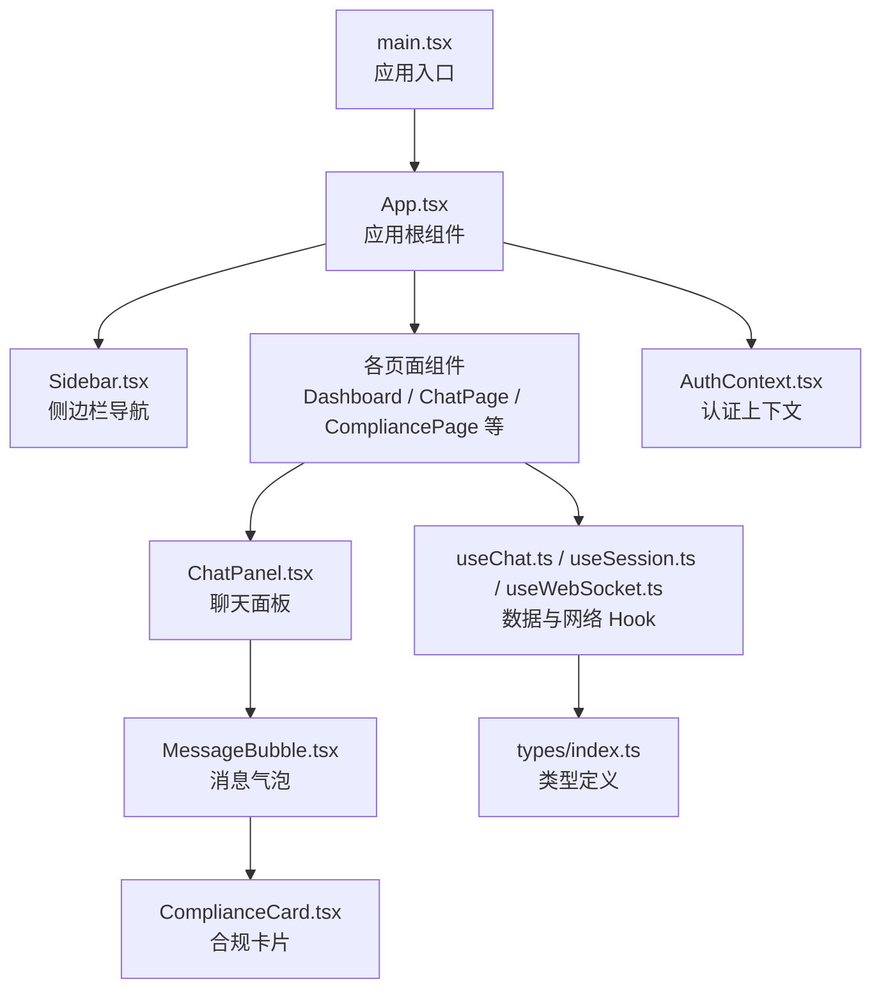
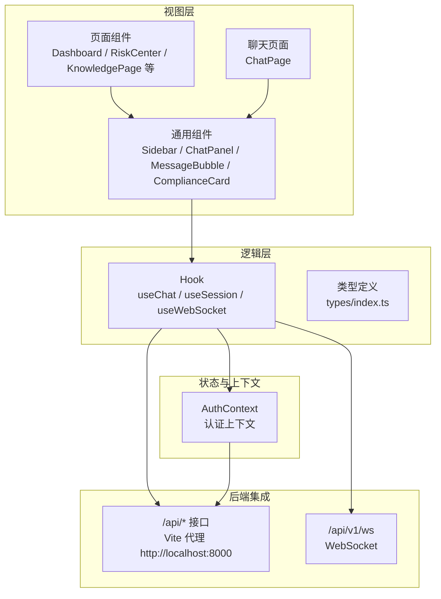
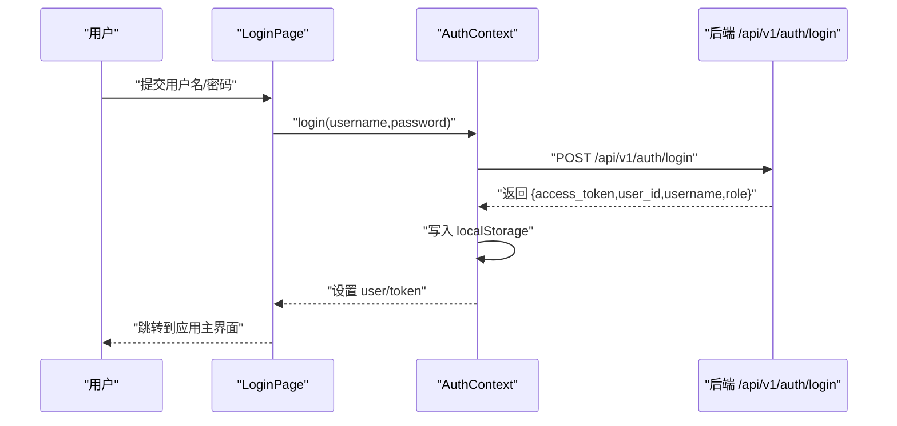
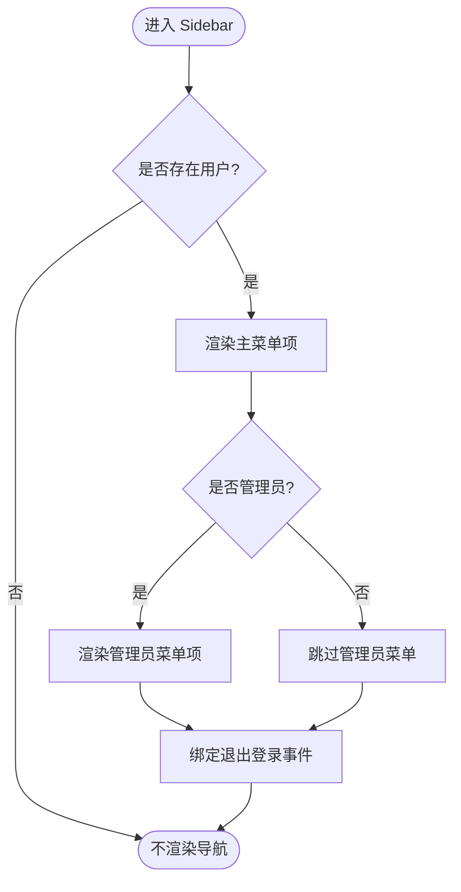
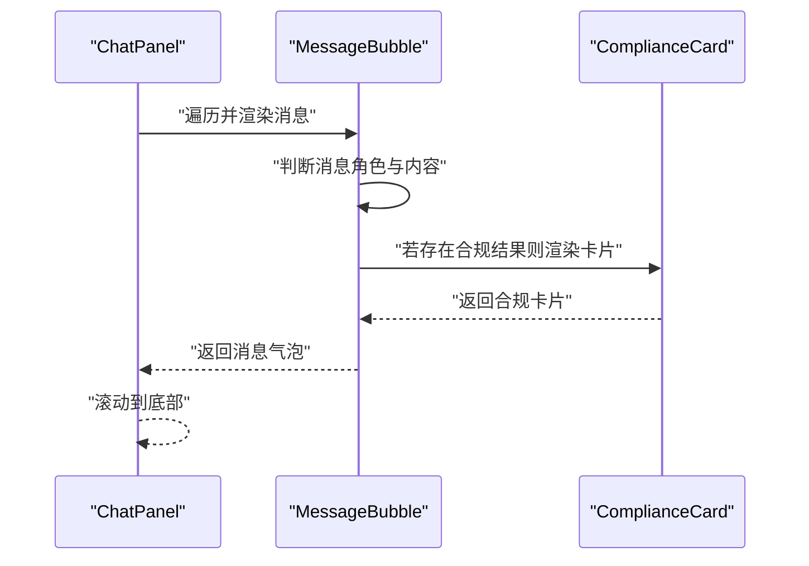
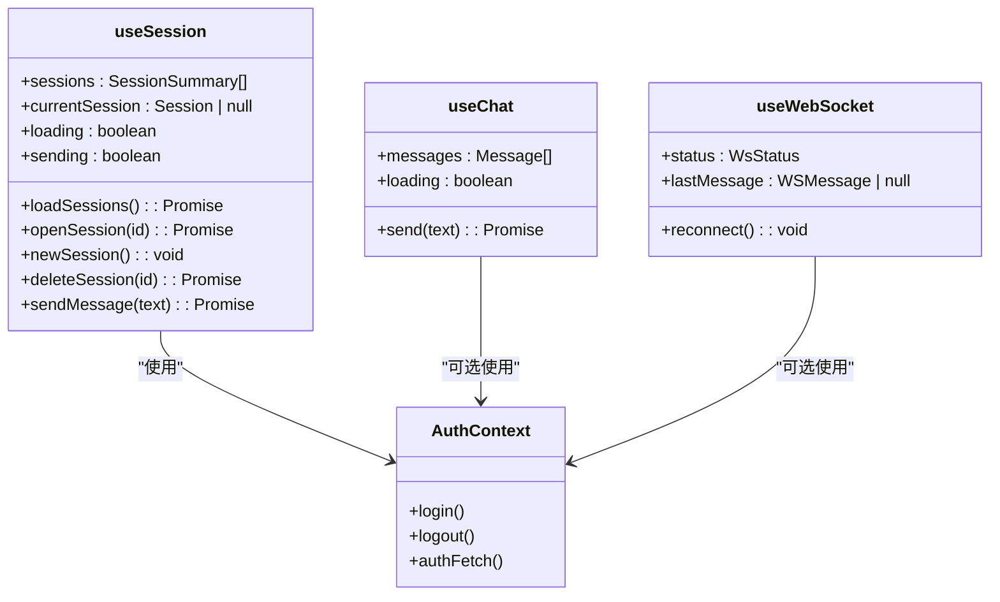
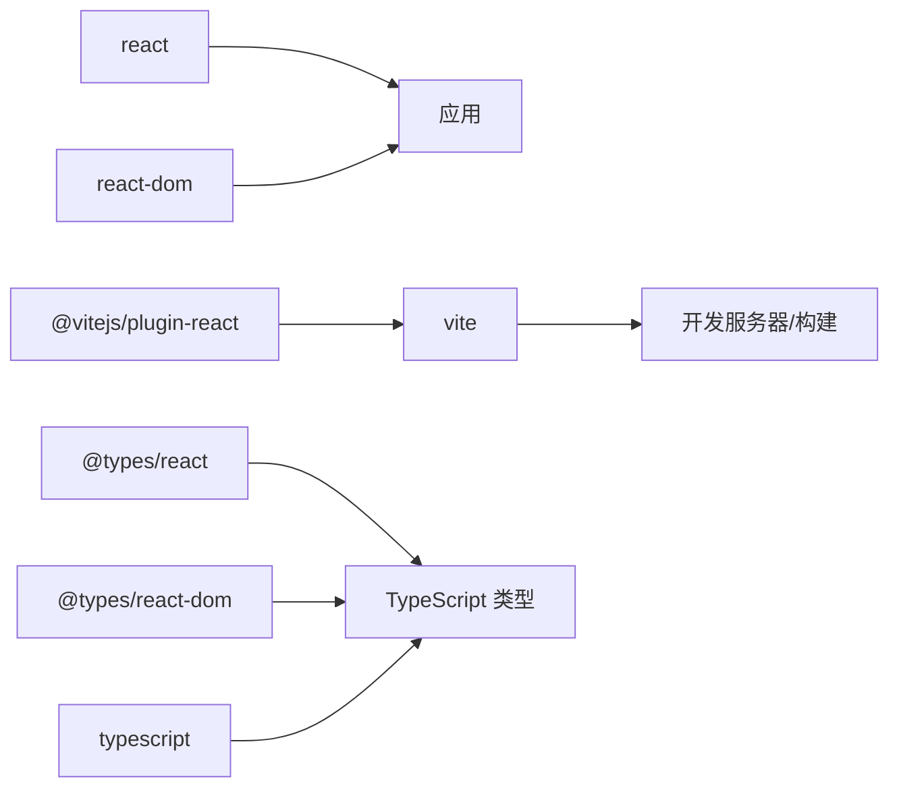

# 前端开发

<cite>
**本文引用的文件**
- [frontend/src/App.tsx](file://frontend/src/App.tsx)
- [frontend/src/main.tsx](file://frontend/src/main.tsx)
- [frontend/package.json](file://frontend/package.json)
- [frontend/tsconfig.json](file://frontend/tsconfig.json)
- [frontend/vite.config.ts](file://frontend/vite.config.ts)
- [frontend/src/context/AuthContext.tsx](file://frontend/src/context/AuthContext.tsx)
- [frontend/src/components/Sidebar.tsx](file://frontend/src/components/Sidebar.tsx)
- [frontend/src/components/ChatPanel.tsx](file://frontend/src/components/ChatPanel.tsx)
- [frontend/src/components/MessageBubble.tsx](file://frontend/src/components/MessageBubble.tsx)
- [frontend/src/components/ComplianceCard.tsx](file://frontend/src/components/ComplianceCard.tsx)
- [frontend/src/hooks/useChat.ts](file://frontend/src/hooks/useChat.ts)
- [frontend/src/hooks/useSession.ts](file://frontend/src/hooks/useSession.ts)
- [frontend/src/hooks/useWebSocket.ts](file://frontend/src/hooks/useWebSocket.ts)
- [frontend/src/types/index.ts](file://frontend/src/types/index.ts)
- [frontend/src/pages/LoginPage.tsx](file://frontend/src/pages/LoginPage.tsx)
</cite>

## 目录
1. [简介](#简介)
2. [项目结构](#项目结构)
3. [核心组件](#核心组件)
4. [架构总览](#架构总览)
5. [详细组件分析](#详细组件分析)
6. [依赖分析](#依赖分析)
7. [性能考虑](#性能考虑)
8. [故障排查指南](#故障排查指南)
9. [结论](#结论)
10. [附录](#附录)

## 简介
本指南面向前端开发者，系统梳理该跨境合规智能体项目的前端架构与实现要点，覆盖应用结构、组件层次、Hook 设计模式、UI 组件细节、状态管理策略、API 集成模式、TypeScript 类型最佳实践、响应式与用户体验优化、组件复用与代码组织原则，以及调试与开发工具使用建议。目标是帮助新成员快速上手并高质量交付功能。

## 项目结构
前端采用 Vite + React 19 + TypeScript 构建，目录按“页面-组件-上下文-钩子-类型”分层组织，入口在 main.tsx，根组件 App.tsx 负责路由与布局，页面组件负责业务视图，通用 UI 组件封装为可复用模块，Hook 抽象数据与网络逻辑，AuthContext 提供认证上下文，类型定义集中于 types/index.ts。

图表来源
- [frontend/src/main.tsx:1-9](file://frontend/src/main.tsx#L1-L9)
- [frontend/src/App.tsx:1-75](file://frontend/src/App.tsx#L1-L75)
- [frontend/src/components/Sidebar.tsx:1-182](file://frontend/src/components/Sidebar.tsx#L1-L182)
- [frontend/src/components/ChatPanel.tsx:1-142](file://frontend/src/components/ChatPanel.tsx#L1-L142)
- [frontend/src/components/MessageBubble.tsx:1-64](file://frontend/src/components/MessageBubble.tsx#L1-L64)
- [frontend/src/components/ComplianceCard.tsx:1-141](file://frontend/src/components/ComplianceCard.tsx#L1-L141)
- [frontend/src/context/AuthContext.tsx:1-106](file://frontend/src/context/AuthContext.tsx#L1-L106)
- [frontend/src/hooks/useChat.ts:1-61](file://frontend/src/hooks/useChat.ts#L1-L61)
- [frontend/src/hooks/useSession.ts:1-162](file://frontend/src/hooks/useSession.ts#L1-L162)
- [frontend/src/hooks/useWebSocket.ts:1-68](file://frontend/src/hooks/useWebSocket.ts#L1-L68)
- [frontend/src/types/index.ts:1-305](file://frontend/src/types/index.ts#L1-L305)

章节来源
- [frontend/src/main.tsx:1-9](file://frontend/src/main.tsx#L1-L9)
- [frontend/src/App.tsx:1-75](file://frontend/src/App.tsx#L1-L75)
- [frontend/package.json:1-22](file://frontend/package.json#L1-L22)
- [frontend/tsconfig.json:1-20](file://frontend/tsconfig.json#L1-L20)
- [frontend/vite.config.ts:1-15](file://frontend/vite.config.ts#L1-L15)

## 核心组件
- 应用根组件 App.tsx：统一管理当前页面、登录态与页面切换；支持从合规查询跳转至智能对话并传递初始消息。
- 认证上下文 AuthContext.tsx：提供登录、登出、token 管理与带鉴权的 fetch 封装，自动从 localStorage 恢复登录状态。
- 侧边栏 Sidebar.tsx：根据用户角色渲染主菜单与管理员菜单，支持点击导航与退出登录。
- 聊天相关组件：ChatPanel.tsx（输入与消息区域）、MessageBubble.tsx（消息渲染与合规卡片）、ComplianceCard.tsx（合规报告卡片）。
- Hook：useChat.ts（轻量聊天发送）、useSession.ts（会话列表/打开/新建/删除/发送消息）、useWebSocket.ts（WebSocket 连接与自动重连）。
- 类型：types/index.ts（消息、合规、会话、风险、操作链等类型定义）。

章节来源
- [frontend/src/App.tsx:14-75](file://frontend/src/App.tsx#L14-L75)
- [frontend/src/context/AuthContext.tsx:1-106](file://frontend/src/context/AuthContext.tsx#L1-L106)
- [frontend/src/components/Sidebar.tsx:1-182](file://frontend/src/components/Sidebar.tsx#L1-L182)
- [frontend/src/components/ChatPanel.tsx:1-142](file://frontend/src/components/ChatPanel.tsx#L1-L142)
- [frontend/src/components/MessageBubble.tsx:1-64](file://frontend/src/components/MessageBubble.tsx#L1-L64)
- [frontend/src/components/ComplianceCard.tsx:1-141](file://frontend/src/components/ComplianceCard.tsx#L1-L141)
- [frontend/src/hooks/useChat.ts:1-61](file://frontend/src/hooks/useChat.ts#L1-L61)
- [frontend/src/hooks/useSession.ts:1-162](file://frontend/src/hooks/useSession.ts#L1-L162)
- [frontend/src/hooks/useWebSocket.ts:1-68](file://frontend/src/hooks/useWebSocket.ts#L1-L68)
- [frontend/src/types/index.ts:1-305](file://frontend/src/types/index.ts#L1-L305)

## 架构总览
前端采用“页面-组件-Hook-上下文-类型”的分层架构，页面组件负责业务视图与交互编排，通用组件负责 UI 展示与复用，Hook 抽象数据与网络逻辑，上下文提供全局状态（认证），类型定义确保接口一致性与可维护性。

图表来源
- [frontend/src/App.tsx:16-66](file://frontend/src/App.tsx#L16-L66)
- [frontend/src/components/Sidebar.tsx:23-148](file://frontend/src/components/Sidebar.tsx#L23-L148)
- [frontend/src/components/ChatPanel.tsx:11-142](file://frontend/src/components/ChatPanel.tsx#L11-L142)
- [frontend/src/hooks/useChat.ts:6-61](file://frontend/src/hooks/useChat.ts#L6-L61)
- [frontend/src/hooks/useSession.ts:7-162](file://frontend/src/hooks/useSession.ts#L7-L162)
- [frontend/src/hooks/useWebSocket.ts:18-68](file://frontend/src/hooks/useWebSocket.ts#L18-L68)
- [frontend/src/context/AuthContext.tsx:23-99](file://frontend/src/context/AuthContext.tsx#L23-L99)
- [frontend/vite.config.ts:6-14](file://frontend/vite.config.ts#L6-L14)

## 详细组件分析

### 认证上下文与登录流程
- 登录：调用后端登录接口，成功后持久化 token 与用户信息，设置上下文状态。
- 登出：移除本地存储并清空上下文。
- 带鉴权请求：authFetch 自动注入 Authorization 头。
- 初始化恢复：应用启动时尝试从 localStorage 恢复登录态。

图表来源
- [frontend/src/pages/LoginPage.tsx:11-23](file://frontend/src/pages/LoginPage.tsx#L11-L23)
- [frontend/src/context/AuthContext.tsx:44-72](file://frontend/src/context/AuthContext.tsx#L44-L72)
- [frontend/src/context/AuthContext.tsx:75-82](file://frontend/src/context/AuthContext.tsx#L75-L82)

章节来源
- [frontend/src/pages/LoginPage.tsx:1-154](file://frontend/src/pages/LoginPage.tsx#L1-L154)
- [frontend/src/context/AuthContext.tsx:1-106](file://frontend/src/context/AuthContext.tsx#L1-L106)

### 侧边栏与页面导航
- 根据用户角色显示不同菜单项。
- 支持当前选中态样式与悬停高亮。
- 提供退出登录按钮，触发上下文登出。

图表来源
- [frontend/src/components/Sidebar.tsx:23-148](file://frontend/src/components/Sidebar.tsx#L23-L148)

章节来源
- [frontend/src/components/Sidebar.tsx:1-182](file://frontend/src/components/Sidebar.tsx#L1-L182)

### 聊天面板与消息气泡
- ChatPanel：负责输入框、发送按钮、消息滚动、加载指示与占位提示。
- MessageBubble：根据消息角色渲染不同样式，支持简单 Markdown 渲染，必要时展示合规卡片。
- ComplianceCard：展示合规报告的核心字段与风险等级标签，支持截断与展开。

图表来源
- [frontend/src/components/ChatPanel.tsx:11-142](file://frontend/src/components/ChatPanel.tsx#L11-L142)
- [frontend/src/components/MessageBubble.tsx:8-51](file://frontend/src/components/MessageBubble.tsx#L8-L51)
- [frontend/src/components/ComplianceCard.tsx:19-131](file://frontend/src/components/ComplianceCard.tsx#L19-L131)

章节来源
- [frontend/src/components/ChatPanel.tsx:1-142](file://frontend/src/components/ChatPanel.tsx#L1-L142)
- [frontend/src/components/MessageBubble.tsx:1-64](file://frontend/src/components/MessageBubble.tsx#L1-L64)
- [frontend/src/components/ComplianceCard.tsx:1-141](file://frontend/src/components/ComplianceCard.tsx#L1-L141)

### Hook 设计模式与状态管理
- useChat：维护消息列表与加载状态，封装一次对话发送与错误兜底。
- useSession：维护会话列表、当前会话、发送状态；支持新建/打开/删除会话；通过 authFetch 或原生 fetch 与后端交互。
- useWebSocket：建立 WebSocket 连接，自动重连，暴露状态与最后一条消息。

图表来源
- [frontend/src/hooks/useChat.ts:6-61](file://frontend/src/hooks/useChat.ts#L6-L61)
- [frontend/src/hooks/useSession.ts:7-162](file://frontend/src/hooks/useSession.ts#L7-L162)
- [frontend/src/hooks/useWebSocket.ts:18-68](file://frontend/src/hooks/useWebSocket.ts#L18-L68)
- [frontend/src/context/AuthContext.tsx:23-99](file://frontend/src/context/AuthContext.tsx#L23-L99)

章节来源
- [frontend/src/hooks/useChat.ts:1-61](file://frontend/src/hooks/useChat.ts#L1-L61)
- [frontend/src/hooks/useSession.ts:1-162](file://frontend/src/hooks/useSession.ts#L1-L162)
- [frontend/src/hooks/useWebSocket.ts:1-68](file://frontend/src/hooks/useWebSocket.ts#L1-L68)

### API 集成与错误处理
- Vite 代理：/api 前缀转发到 http://localhost:8000，便于本地联调。
- 认证：登录成功后保存 token，后续请求通过 authFetch 注入 Authorization。
- 错误处理：Hook 内对网络异常进行兜底消息注入，页面层也应有统一错误提示与重试机制建议。

章节来源
- [frontend/vite.config.ts:6-14](file://frontend/vite.config.ts#L6-L14)
- [frontend/src/context/AuthContext.tsx:44-82](file://frontend/src/context/AuthContext.tsx#L44-L82)
- [frontend/src/hooks/useChat.ts:21-57](file://frontend/src/hooks/useChat.ts#L21-L57)
- [frontend/src/hooks/useSession.ts:66-148](file://frontend/src/hooks/useSession.ts#L66-L148)

### TypeScript 类型最佳实践
- 类型集中：所有接口与实体类型集中在 types/index.ts，避免分散定义。
- 明确字段：消息、合规、会话、风险、操作链等类型字段清晰，便于 IDE 提示与编译期校验。
- 可选字段：合理使用可选字段（如合规结果、意图、来源），避免强制必填导致的类型污染。
- 一致命名：遵循语义化命名，如 SessionSummary、SessionMessage、RiskAlert 等，提升可读性。

章节来源
- [frontend/src/types/index.ts:1-305](file://frontend/src/types/index.ts#L1-L305)

### 响应式设计与用户体验优化
- 布局：App.tsx 使用 Flex 布局，侧边栏固定宽度，主内容区自适应。
- 滚动：聊天面板自动滚动到底部，保证用户看到最新消息。
- 状态反馈：加载态与禁用态明确，按钮与输入框在不同状态下颜色与光标变化。
- 占位提示：无消息时提供引导文案与示例，降低认知负担。

章节来源
- [frontend/src/App.tsx:42-66](file://frontend/src/App.tsx#L42-L66)
- [frontend/src/components/ChatPanel.tsx:15-25](file://frontend/src/components/ChatPanel.tsx#L15-L25)
- [frontend/src/components/ChatPanel.tsx:64-78](file://frontend/src/components/ChatPanel.tsx#L64-L78)
- [frontend/src/pages/LoginPage.tsx:120-144](file://frontend/src/pages/LoginPage.tsx#L120-L144)

### 组件复用与代码组织
- 页面组件：按功能划分，职责单一，通过 props 与回调与子组件通信。
- 通用组件：UI 组件尽量无副作用，仅依赖输入 props，便于复用。
- Hook：将数据与网络逻辑抽离到 Hook，减少组件内重复代码。
- 上下文：认证上下文集中管理全局状态，避免跨层级传参。

章节来源
- [frontend/src/App.tsx:16-66](file://frontend/src/App.tsx#L16-L66)
- [frontend/src/components/Sidebar.tsx:23-148](file://frontend/src/components/Sidebar.tsx#L23-L148)
- [frontend/src/hooks/useChat.ts:6-61](file://frontend/src/hooks/useChat.ts#L6-L61)
- [frontend/src/hooks/useSession.ts:7-162](file://frontend/src/hooks/useSession.ts#L7-L162)

## 依赖分析
- 运行时依赖：React 19、React DOM 19。
- 开发依赖：Vite、@vitejs/plugin-react、TypeScript、@types/react、@types/react-dom。
- 构建与运行：Vite 提供开发服务器与代理配置，TypeScript 编译与严格模式保障类型安全。

图表来源
- [frontend/package.json:11-21](file://frontend/package.json#L11-L21)
- [frontend/tsconfig.json:2-17](file://frontend/tsconfig.json#L2-L17)
- [frontend/vite.config.ts:1-6](file://frontend/vite.config.ts#L1-L6)

章节来源
- [frontend/package.json:1-22](file://frontend/package.json#L1-L22)
- [frontend/tsconfig.json:1-20](file://frontend/tsconfig.json#L1-L20)
- [frontend/vite.config.ts:1-15](file://frontend/vite.config.ts#L1-L15)

## 性能考虑
- 渲染优化：消息列表使用 key 标识，避免不必要的重渲染；聊天面板在消息变更时才触发滚动。
- 网络优化：WebSocket 自动重连，降低长连接中断影响；Hook 中对错误进行本地兜底，避免阻塞 UI。
- 资源优化：Vite 按需打包，TypeScript 关闭未使用变量检查以减少编译压力（结合项目实际调整）。
- 代理优化：开发环境通过 Vite 代理减少跨域问题，提高联调效率。

章节来源
- [frontend/src/components/ChatPanel.tsx:15-17](file://frontend/src/components/ChatPanel.tsx#L15-L17)
- [frontend/src/hooks/useWebSocket.ts:24-51](file://frontend/src/hooks/useWebSocket.ts#L24-L51)
- [frontend/vite.config.ts:6-14](file://frontend/vite.config.ts#L6-L14)

## 故障排查指南
- 登录失败：检查后端 /api/v1/auth/login 是否可用，确认用户名/密码正确；查看控制台网络请求与错误信息。
- 无法发送消息：确认 /api/v1/chat 可用，检查 token 是否存在；查看 useChat/useSession 的错误兜底消息。
- WebSocket 断开：关注 useWebSocket 的状态变化，确认 ws://localhost:8000/api/v1/ws 可达；利用 reconnect 方法手动重连。
- 类型报错：核对 types/index.ts 中的接口定义，确保前后端字段一致；避免在组件中硬编码类型。

章节来源
- [frontend/src/pages/LoginPage.tsx:11-23](file://frontend/src/pages/LoginPage.tsx#L11-L23)
- [frontend/src/hooks/useChat.ts:21-57](file://frontend/src/hooks/useChat.ts#L21-L57)
- [frontend/src/hooks/useSession.ts:66-148](file://frontend/src/hooks/useSession.ts#L66-L148)
- [frontend/src/hooks/useWebSocket.ts:24-67](file://frontend/src/hooks/useWebSocket.ts#L24-L67)
- [frontend/src/types/index.ts:1-305](file://frontend/src/types/index.ts#L1-L305)

## 结论
该前端工程结构清晰、职责分明，通过上下文与 Hook 实现了良好的状态与数据抽象，配合完善的类型定义与代理配置，能够高效支撑跨境合规智能体的多页面与实时交互需求。建议在后续迭代中持续完善错误处理与可观测性，强化组件测试与文档，保持类型定义与后端接口的一致性。

## 附录
- 开发命令：dev/build/preview 由 Vite 提供，TypeScript 与 React JSX 配置见 tsconfig.json 与 vite.config.ts。
- 入口文件：main.tsx 渲染根组件 App.tsx，应用根组件负责页面切换与布局。

章节来源
- [frontend/package.json:6-10](file://frontend/package.json#L6-L10)
- [frontend/tsconfig.json:2-17](file://frontend/tsconfig.json#L2-L17)
- [frontend/vite.config.ts:1-6](file://frontend/vite.config.ts#L1-L6)
- [frontend/src/main.tsx:5-8](file://frontend/src/main.tsx#L5-L8)
- [frontend/src/App.tsx:68-74](file://frontend/src/App.tsx#L68-L74)