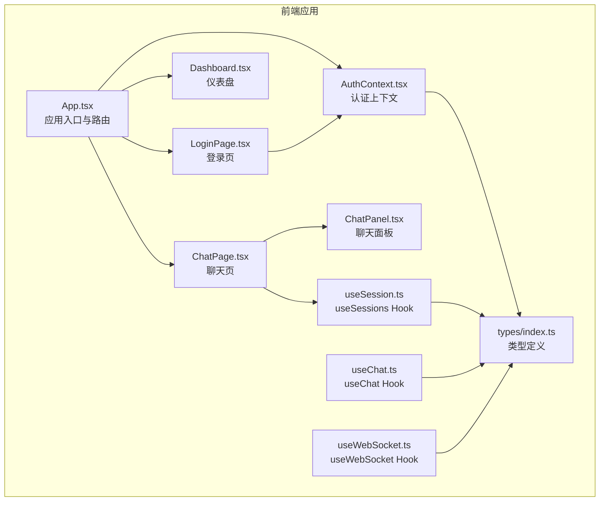
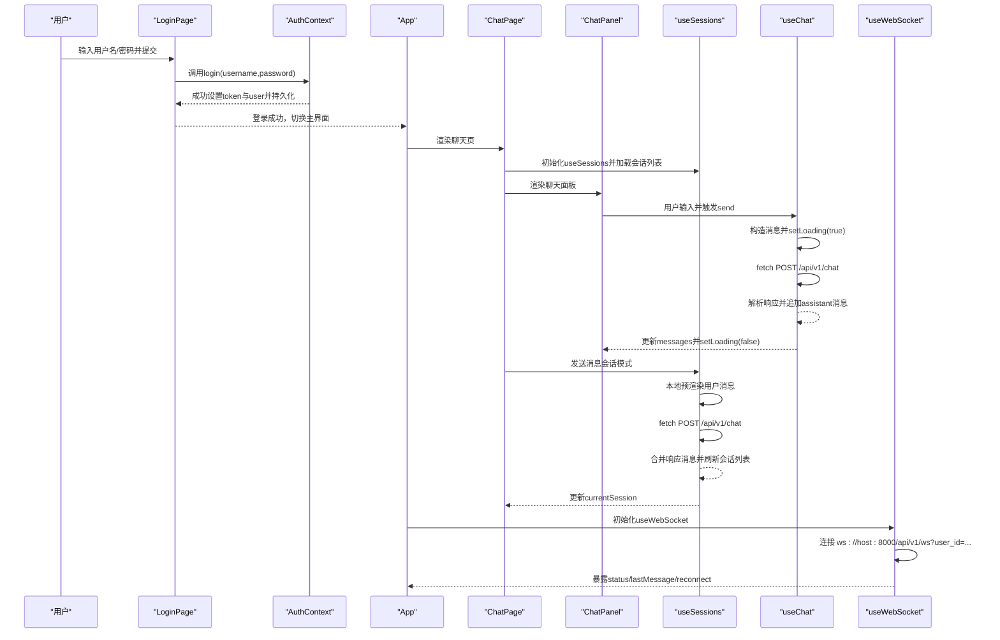
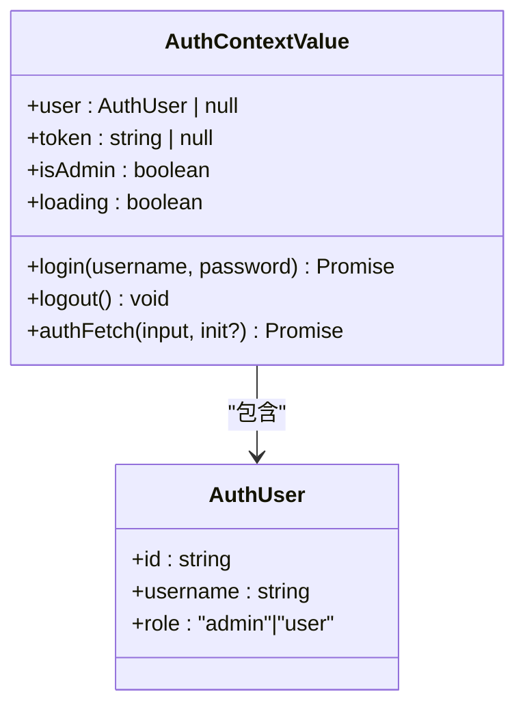
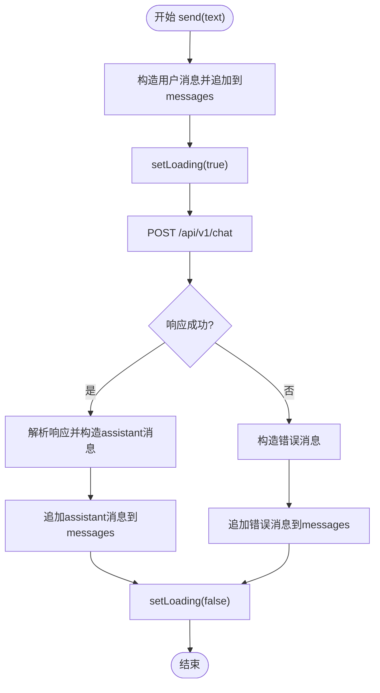
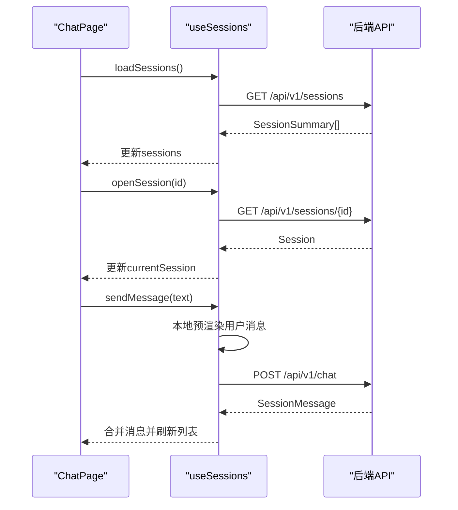
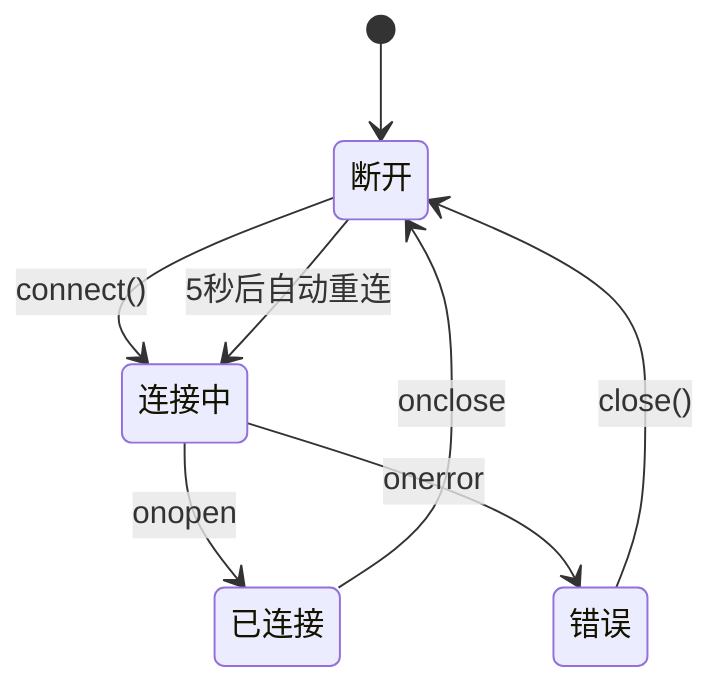
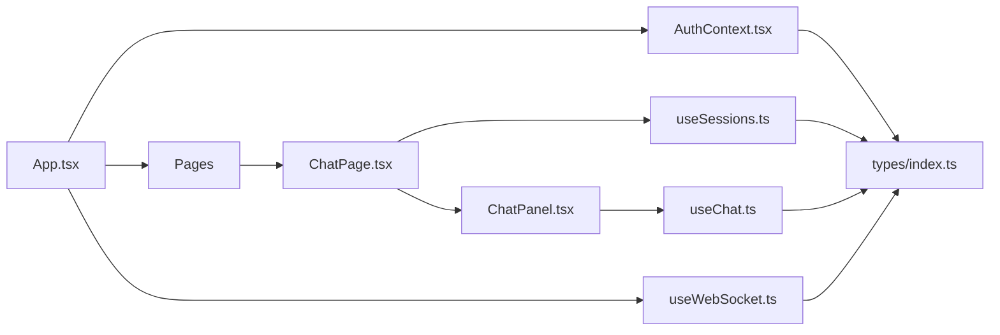

# 状态管理

<cite>
**本文引用的文件**
- [AuthContext.tsx](file://frontend/src/context/AuthContext.tsx)
- [useChat.ts](file://frontend/src/hooks/useChat.ts)
- [useSession.ts](file://frontend/src/hooks/useSession.ts)
- [useWebSocket.ts](file://frontend/src/hooks/useWebSocket.ts)
- [index.ts](file://frontend/src/types/index.ts)
- [LoginPage.tsx](file://frontend/src/pages/LoginPage.tsx)
- [Dashboard.tsx](file://frontend/src/pages/Dashboard.tsx)
- [ChatPage.tsx](file://frontend/src/pages/ChatPage.tsx)
- [ChatPanel.tsx](file://frontend/src/components/ChatPanel.tsx)
- [App.tsx](file://frontend/src/App.tsx)
- [package.json](file://frontend/package.json)
</cite>

## 目录
1. [简介](#简介)
2. [项目结构](#项目结构)
3. [核心组件](#核心组件)
4. [架构总览](#架构总览)
5. [详细组件分析](#详细组件分析)
6. [依赖关系分析](#依赖关系分析)
7. [性能考量](#性能考量)
8. [故障排查指南](#故障排查指南)
9. [结论](#结论)
10. [附录](#附录)

## 简介
本指南围绕前端状态管理展开，系统讲解以下内容：
- JWT认证上下文AuthContext的设计与实现：用户登录状态管理、token存储与恢复、鉴权fetch封装。
- 自定义Hook的设计模式：useChat聊天状态管理、useSession会话数据处理、useWebSocket实时通信连接。
- TypeScript类型定义最佳实践：接口设计、类型安全与泛型使用。
- 状态提升、Context API使用与Hook组合策略。
- 状态持久化、错误边界与性能优化技术细节。
- 实际代码示例路径与常见问题解决方案。

## 项目结构
前端采用按功能分层的组织方式：
- context：全局状态容器（认证上下文）
- hooks：自定义Hook（聊天、会话、WebSocket）
- types：统一的TypeScript类型定义
- pages：页面组件（登录、仪表盘、聊天等）
- components：可复用UI组件（聊天面板、消息气泡、侧边栏等）

图表来源
- [App.tsx:1-75](file://frontend/src/App.tsx#L1-L75)
- [AuthContext.tsx:1-106](file://frontend/src/context/AuthContext.tsx#L1-L106)
- [LoginPage.tsx:1-154](file://frontend/src/pages/LoginPage.tsx#L1-L154)
- [Dashboard.tsx:1-429](file://frontend/src/pages/Dashboard.tsx#L1-L429)
- [ChatPage.tsx:1-491](file://frontend/src/pages/ChatPage.tsx#L1-L491)
- [ChatPanel.tsx:1-142](file://frontend/src/components/ChatPanel.tsx#L1-L142)
- [useChat.ts:1-61](file://frontend/src/hooks/useChat.ts#L1-L61)
- [useSession.ts:1-162](file://frontend/src/hooks/useSession.ts#L1-L162)
- [useWebSocket.ts:1-68](file://frontend/src/hooks/useWebSocket.ts#L1-L68)
- [index.ts:1-305](file://frontend/src/types/index.ts#L1-L305)

章节来源
- [App.tsx:1-75](file://frontend/src/App.tsx#L1-L75)
- [package.json:1-22](file://frontend/package.json#L1-L22)

## 核心组件
本节聚焦于认证上下文、聊天Hook、会话Hook与WebSocket Hook，并结合类型定义说明其职责与交互。

- 认证上下文AuthContext
  - 提供用户信息、token、登录/登出、鉴权fetch封装。
  - 启动时从localStorage恢复token与用户信息，避免刷新丢失。
  - 登录成功后写入localStorage，logout时清理。
  - 提供isAdmin便捷判断。

- useChat Hook
  - 管理本地消息数组与发送状态。
  - 通过POST /api/v1/chat发送消息，接收标准响应并追加assistant消息。
  - 错误时构造错误消息并显示，finally统一收尾loading。

- useSessions Hook
  - 基于AuthContext提供的authFetch进行受保护的会话操作。
  - 支持加载会话列表、打开指定会话、新建会话、删除会话、发送消息。
  - 本地预渲染用户消息，调用后端接口获取响应并合并至当前会话。
  - 自动刷新会话列表，保持UI一致性。

- useWebSocket Hook
  - 建立ws://host:8000/api/v1/ws连接，附加user_id参数。
  - 管理连接状态（connecting/connected/disconnected/error），自动重连。
  - 解析JSON消息并暴露lastMessage，便于上层组件订阅。

- TypeScript类型定义
  - 统一定义消息、会话、合规结果、操作链、事件链、风险预警等类型。
  - 为Hook返回值与API交互提供强类型约束，降低运行时错误。

章节来源
- [AuthContext.tsx:1-106](file://frontend/src/context/AuthContext.tsx#L1-L106)
- [useChat.ts:1-61](file://frontend/src/hooks/useChat.ts#L1-L61)
- [useSession.ts:1-162](file://frontend/src/hooks/useSession.ts#L1-L162)
- [useWebSocket.ts:1-68](file://frontend/src/hooks/useWebSocket.ts#L1-L68)
- [index.ts:1-305](file://frontend/src/types/index.ts#L1-L305)

## 架构总览
下图展示了认证、聊天、会话与WebSocket在应用中的交互关系与数据流。

图表来源
- [LoginPage.tsx:1-154](file://frontend/src/pages/LoginPage.tsx#L1-L154)
- [AuthContext.tsx:1-106](file://frontend/src/context/AuthContext.tsx#L1-L106)
- [App.tsx:1-75](file://frontend/src/App.tsx#L1-L75)
- [ChatPage.tsx:1-491](file://frontend/src/pages/ChatPage.tsx#L1-L491)
- [ChatPanel.tsx:1-142](file://frontend/src/components/ChatPanel.tsx#L1-L142)
- [useChat.ts:1-61](file://frontend/src/hooks/useChat.ts#L1-L61)
- [useSession.ts:1-162](file://frontend/src/hooks/useSession.ts#L1-L162)
- [useWebSocket.ts:1-68](file://frontend/src/hooks/useWebSocket.ts#L1-L68)

## 详细组件分析

### 认证上下文AuthContext
- 设计要点
  - 使用React Context暴露上下文值，包含user、token、isAdmin、loading、login、logout、authFetch。
  - 启动时从localStorage恢复token与user，若解析失败则清理残留数据。
  - login成功后写入localStorage并更新内存状态；logout清理localStorage并重置状态。
  - authFetch基于token自动注入Authorization头，简化后续网络请求。

- 关键流程
  - 启动恢复：读取localStorage -> 设置loading=false
  - 登录：POST /api/v1/auth/login -> 写入localStorage -> 更新user/token
  - 登出：移除localStorage -> 清空user/token
  - 鉴权请求：authFetch -> fetch(input, { headers: { Authorization: Bearer token } })

- 类型与接口
  - AuthUser与AuthContextValue接口定义了上下文对外暴露的数据结构。
  - useAuth Hook对未包裹Provider的情况抛出错误，保证使用安全。

图表来源
- [AuthContext.tsx:5-19](file://frontend/src/context/AuthContext.tsx#L5-L19)

章节来源
- [AuthContext.tsx:1-106](file://frontend/src/context/AuthContext.tsx#L1-L106)
- [LoginPage.tsx:1-154](file://frontend/src/pages/LoginPage.tsx#L1-L154)
- [App.tsx:1-75](file://frontend/src/App.tsx#L1-L75)

### useChat Hook（聊天状态管理）
- 设计要点
  - 本地维护messages与loading，使用session_id标识会话。
  - send函数负责构建用户消息、调用后端API、解析响应并追加assistant消息。
  - 错误分支构造错误消息，确保UI始终有反馈。
  - finally统一关闭loading，避免阻塞。

- 流程图

图表来源
- [useChat.ts:11-57](file://frontend/src/hooks/useChat.ts#L11-L57)

章节来源
- [useChat.ts:1-61](file://frontend/src/hooks/useChat.ts#L1-L61)

### useSessions Hook（会话数据处理）
- 设计要点
  - 依赖AuthContext的authFetch与token，确保所有会话相关请求均带Authorization。
  - 支持加载会话列表、打开指定会话、新建会话、删除会话、发送消息。
  - 本地预渲染用户消息，调用后端接口获取响应并合并至currentSession。
  - 自动刷新会话列表，保持UI一致性。

- 关键流程
  - 加载会话列表：GET /api/v1/sessions
  - 打开会话：GET /api/v1/sessions/{id}
  - 新建会话：清空currentSession并重置pendingSessionId
  - 删除会话：DELETE /api/v1/sessions/{id}
  - 发送消息：POST /api/v1/chat，合并响应消息并刷新列表

- 错误处理
  - 所有异步操作均try/catch，失败时追加错误消息或静默失败，避免中断UI。

图表来源
- [useSession.ts:16-148](file://frontend/src/hooks/useSession.ts#L16-L148)
- [ChatPage.tsx:258-327](file://frontend/src/pages/ChatPage.tsx#L258-L327)

章节来源
- [useSession.ts:1-162](file://frontend/src/hooks/useSession.ts#L1-L162)
- [ChatPage.tsx:1-491](file://frontend/src/pages/ChatPage.tsx#L1-L491)

### useWebSocket Hook（实时通信连接）
- 设计要点
  - 连接URL形如ws://host:8000/api/v1/ws?user_id=...，支持传入userId。
  - 管理连接状态（connecting/connected/disconnected/error），断线自动重连（5秒间隔）。
  - onmessage解析JSON消息并更新lastMessage，提供reconnect方法手动重连。

- 状态机

图表来源
- [useWebSocket.ts:18-67](file://frontend/src/hooks/useWebSocket.ts#L18-L67)

章节来源
- [useWebSocket.ts:1-68](file://frontend/src/hooks/useWebSocket.ts#L1-L68)

### TypeScript类型定义最佳实践
- 接口设计
  - 明确区分“列表项”与“完整实体”，例如SessionSummary与Session。
  - 将字段语义化命名，如created_at、updated_at，便于时间轴与排序。
  - 对可选字段使用?，对必填字段明确类型。

- 类型安全
  - Hook返回值与API响应一一对应，避免any。
  - 使用联合类型限制枚举值，如风险等级、消息角色、会话状态等。

- 泛型使用
  - 当前代码未直接使用泛型，但类型定义已足够表达复杂嵌套结构（如ActionNode/ActionChain、EventNode/EventChain）。

章节来源
- [index.ts:1-305](file://frontend/src/types/index.ts#L1-L305)

## 依赖关系分析
- 组件耦合
  - App作为根组件，包裹AuthProvider，向下提供认证上下文。
  - ChatPage依赖useSessions，ChatPanel依赖useChat（在独立场景下）。
  - useSessions内部依赖AuthContext的authFetch与token，形成“Hook依赖Hook”的模式。

- 外部依赖
  - fetch用于REST API调用，WebSocket用于实时消息。
  - localStorage用于token与用户信息的持久化。

图表来源
- [App.tsx:1-75](file://frontend/src/App.tsx#L1-L75)
- [AuthContext.tsx:1-106](file://frontend/src/context/AuthContext.tsx#L1-L106)
- [ChatPage.tsx:1-491](file://frontend/src/pages/ChatPage.tsx#L1-L491)
- [ChatPanel.tsx:1-142](file://frontend/src/components/ChatPanel.tsx#L1-L142)
- [useSessions.ts:1-162](file://frontend/src/hooks/useSession.ts#L1-L162)
- [useChat.ts:1-61](file://frontend/src/hooks/useChat.ts#L1-L61)
- [useWebSocket.ts:1-68](file://frontend/src/hooks/useWebSocket.ts#L1-L68)
- [index.ts:1-305](file://frontend/src/types/index.ts#L1-L305)

章节来源
- [App.tsx:1-75](file://frontend/src/App.tsx#L1-L75)
- [AuthContext.tsx:1-106](file://frontend/src/context/AuthContext.tsx#L1-L106)
- [ChatPage.tsx:1-491](file://frontend/src/pages/ChatPage.tsx#L1-L491)
- [ChatPanel.tsx:1-142](file://frontend/src/components/ChatPanel.tsx#L1-L142)
- [useSessions.ts:1-162](file://frontend/src/hooks/useSession.ts#L1-L162)
- [useChat.ts:1-61](file://frontend/src/hooks/useChat.ts#L1-L61)
- [useWebSocket.ts:1-68](file://frontend/src/hooks/useWebSocket.ts#L1-L68)
- [index.ts:1-305](file://frontend/src/types/index.ts#L1-L305)

## 性能考量
- 状态粒度与更新范围
  - useSessions将“本地预渲染用户消息”与“后端响应合并”分离，减少不必要的重渲染。
  - ChatPanel仅在messages变化时滚动到底部，避免每次输入都触发滚动。

- 异步控制
  - useSessions在发送中设置sending，防止重复提交。
  - useChat在请求期间设置loading，finally统一收尾。

- 依赖稳定化
  - AuthContext中login、logout、authFetch使用useCallback，避免Provider值频繁变更导致子组件重渲染。
  - useSessions内部对authFetch与token建立依赖数组，确保authFetch稳定。

- 本地存储与启动恢复
  - AuthContext在启动时一次性从localStorage恢复，避免多次IO。

- WebSocket连接管理
  - 断线自动重连，避免长时间无响应；同时在组件卸载时清理定时器与连接，防止内存泄漏。

章节来源
- [AuthContext.tsx:28-98](file://frontend/src/context/AuthContext.tsx#L28-L98)
- [useSession.ts:66-148](file://frontend/src/hooks/useSession.ts#L66-L148)
- [useChat.ts:11-57](file://frontend/src/hooks/useChat.ts#L11-L57)
- [useWebSocket.ts:53-67](file://frontend/src/hooks/useWebSocket.ts#L53-L67)

## 故障排查指南
- 登录失败
  - 现象：登录页抛出错误或无反应。
  - 排查：检查后端地址与接口是否可达；确认用户名/密码正确；查看浏览器Network面板与Console日志。
  - 参考：[LoginPage.tsx:11-23](file://frontend/src/pages/LoginPage.tsx#L11-L23)，[AuthContext.tsx:44-65](file://frontend/src/context/AuthContext.tsx#L44-L65)

- 会话加载/发送异常
  - 现象：会话列表为空或发送消息无响应。
  - 排查：确认已登录且token存在；检查useSessions的authFetch是否注入Authorization；查看后端返回状态码与响应体。
  - 参考：[useSession.ts:16-26](file://frontend/src/hooks/useSession.ts#L16-L26)，[useSession.ts:66-148](file://frontend/src/hooks/useSession.ts#L66-L148)

- 聊天消息不显示
  - 现象：发送后无assistant消息。
  - 排查：检查API响应格式是否符合ChatResponse；确认useChat的解析逻辑；查看错误分支是否被触发。
  - 参考：[useChat.ts:21-57](file://frontend/src/hooks/useChat.ts#L21-L57)，[index.ts:35-42](file://frontend/src/types/index.ts#L35-L42)

- WebSocket无法连接
  - 现象：状态停留在“连接中/错误/断开”。
  - 排查：确认后端WebSocket服务可用；检查防火墙与跨域配置；验证用户ID参数；观察自动重连行为。
  - 参考：[useWebSocket.ts:24-51](file://frontend/src/hooks/useWebSocket.ts#L24-L51)，[useWebSocket.ts:61-67](file://frontend/src/hooks/useWebSocket.ts#L61-L67)

- 刷新后登录状态丢失
  - 现象：刷新页面后回到登录页。
  - 排查：检查localStorage中是否存在astra_token与astra_user；确认AuthContext启动恢复逻辑执行。
  - 参考：[AuthContext.tsx:29-42](file://frontend/src/context/AuthContext.tsx#L29-L42)

章节来源
- [LoginPage.tsx:11-23](file://frontend/src/pages/LoginPage.tsx#L11-L23)
- [AuthContext.tsx:29-65](file://frontend/src/context/AuthContext.tsx#L29-L65)
- [useSession.ts:16-148](file://frontend/src/hooks/useSession.ts#L16-L148)
- [useChat.ts:21-57](file://frontend/src/hooks/useChat.ts#L21-L57)
- [useWebSocket.ts:24-67](file://frontend/src/hooks/useWebSocket.ts#L24-L67)

## 结论
本项目在前端状态管理方面体现了清晰的分层与职责划分：
- 认证上下文提供统一的登录态与鉴权能力，配合localStorage实现持久化。
- useChat与useSessions分别面向“单次对话”和“会话管理”，通过类型定义保障API交互的类型安全。
- useWebSocket为实时场景提供稳定的连接与自动重连机制。
- 通过Hook组合与Context API，实现了状态提升与共享，降低了组件间耦合。

建议后续可进一步引入：
- Token自动续期（如基于后端返回的refresh token或JWT过期时间）。
- 全局错误边界与统一错误提示。
- 状态快照与离线缓存策略（如IndexedDB）。
- Hook依赖注入与测试桩（Mock）以提升可测试性。

## 附录
- 代码示例路径
  - 认证上下文初始化与登录：[AuthContext.tsx:23-65](file://frontend/src/context/AuthContext.tsx#L23-L65)
  - 登录页调用登录：[LoginPage.tsx:11-23](file://frontend/src/pages/LoginPage.tsx#L11-L23)
  - 聊天Hook发送消息：[useChat.ts:11-57](file://frontend/src/hooks/useChat.ts#L11-L57)
  - 会话Hook加载与发送：[useSession.ts:16-148](file://frontend/src/hooks/useSession.ts#L16-L148)
  - WebSocket连接与重连：[useWebSocket.ts:24-67](file://frontend/src/hooks/useWebSocket.ts#L24-L67)
  - 类型定义参考：[index.ts:1-305](file://frontend/src/types/index.ts#L1-L305)