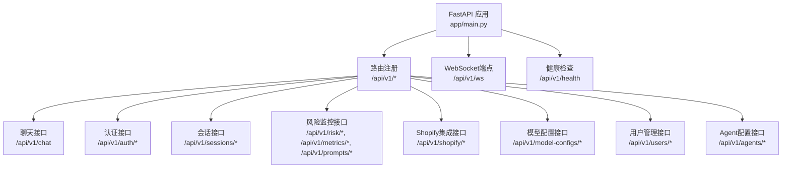
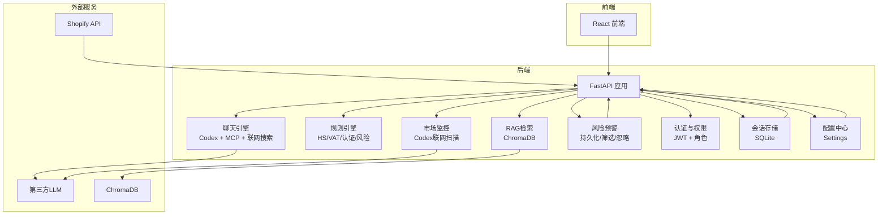
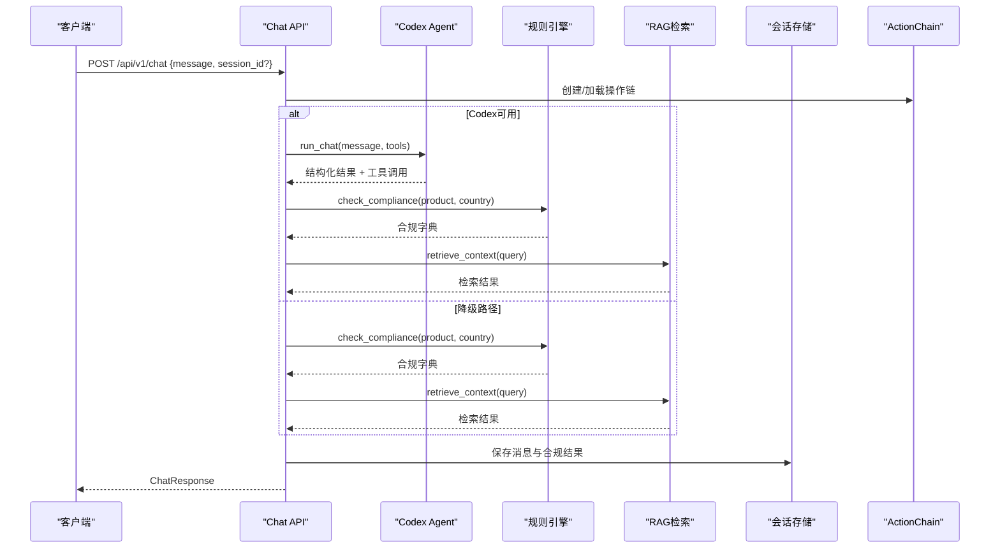
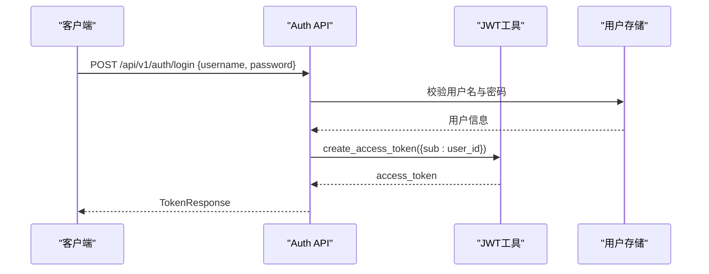
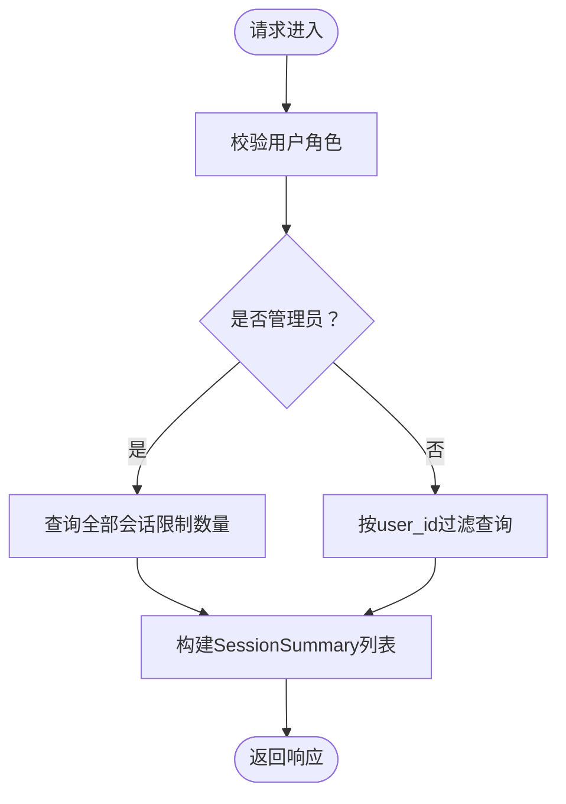
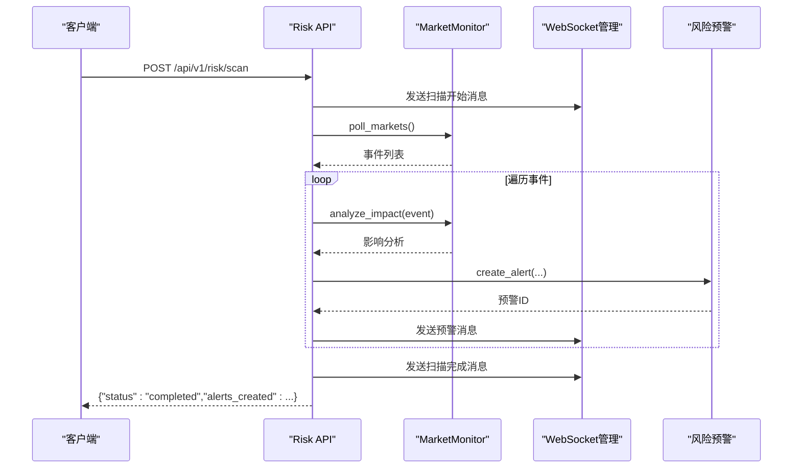
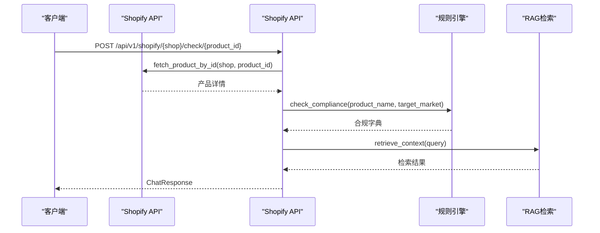
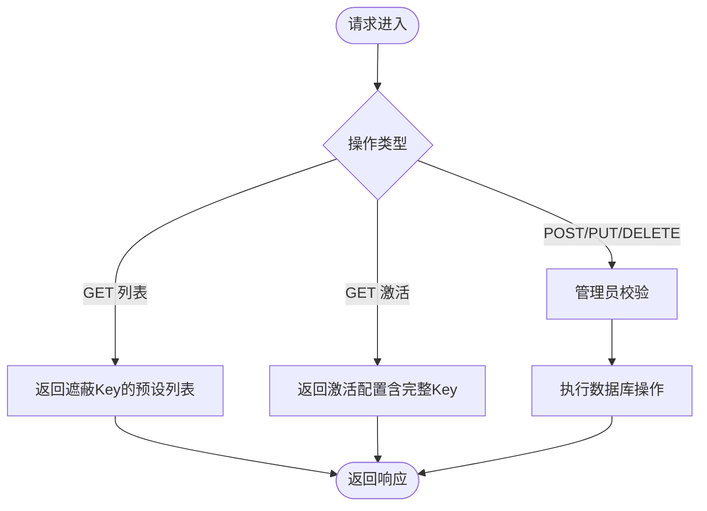
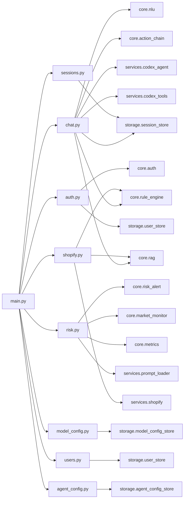

# API接口设计

<cite>
**本文引用的文件**
- [backend/app/main.py](file://backend/app/main.py)
- [backend/app/api/chat.py](file://backend/app/api/chat.py)
- [backend/app/api/auth.py](file://backend/app/api/auth.py)
- [backend/app/api/sessions.py](file://backend/app/api/sessions.py)
- [backend/app/api/risk.py](file://backend/app/api/risk.py)
- [backend/app/api/shopify.py](file://backend/app/api/shopify.py)
- [backend/app/api/model_config.py](file://backend/app/api/model_config.py)
- [backend/app/api/users.py](file://backend/app/api/users.py)
- [backend/app/api/agent_config.py](file://backend/app/api/agent_config.py)
- [backend/app/models/schemas.py](file://backend/app/models/schemas.py)
- [backend/app/core/auth.py](file://backend/app/core/auth.py)
- [backend/app/storage/session_store.py](file://backend/app/storage/session_store.py)
- [backend/app/config.py](file://backend/app/config.py)
- [README.md](file://README.md)
</cite>

## 目录
1. [简介](#简介)
2. [项目结构](#项目结构)
3. [核心组件](#核心组件)
4. [架构总览](#架构总览)
5. [详细组件分析](#详细组件分析)
6. [依赖关系分析](#依赖关系分析)
7. [性能考虑](#性能考虑)
8. [故障排查指南](#故障排查指南)
9. [结论](#结论)
10. [附录](#附录)

## 简介
本文件面向后端API接口设计与实现，系统采用FastAPI框架，提供RESTful API与WebSocket实时推送能力。API遵循统一的版本前缀“/api/v1”，并围绕以下核心能力展开：
- 聊天接口：合规问答（Codex主路径 + NLU/规则引擎/RAG降级路径）
- 认证接口：JWT令牌签发与校验、用户管理
- 会话管理：会话历史持久化与权限控制
- 风险监控：市场扫描、预警管理、仪表盘指标
- Shopify集成：OAuth授权、产品同步、合规检查、Webhook
- 模型配置：多LLM预设管理与激活
- 多Agent配置：Agent开关与系统提示词管理
- 错误处理与状态码：统一异常与HTTP状态码
- 安全与认证：JWT Bearer、CORS、HMAC校验
- 版本控制与生命周期：API版本前缀、应用生命周期钩子

## 项目结构
后端采用按功能域划分的模块化组织，API路由集中于app/api目录，核心业务逻辑位于app/core，数据模型位于app/models，持久化与存储位于app/storage，配置位于app/config。

图表来源
- [backend/app/main.py:21-35](file://backend/app/main.py#L21-L35)

章节来源
- [backend/app/main.py:1-76](file://backend/app/main.py#L1-L76)
- [README.md:92-200](file://README.md#L92-L200)

## 核心组件
- FastAPI应用与中间件：CORS跨域、路由注册、WebSocket、生命周期钩子
- 数据模型：Pydantic模型定义请求/响应结构
- 认证与权限：JWT令牌、用户依赖注入、管理员校验
- 会话存储：SQLite持久化、消息与会话CRUD
- 配置中心：Settings封装LLM、JWT、Shopify、调度器等配置

章节来源
- [backend/app/main.py:1-76](file://backend/app/main.py#L1-L76)
- [backend/app/models/schemas.py:1-264](file://backend/app/models/schemas.py#L1-L264)
- [backend/app/core/auth.py:1-60](file://backend/app/core/auth.py#L1-L60)
- [backend/app/storage/session_store.py:1-251](file://backend/app/storage/session_store.py#L1-L251)
- [backend/app/config.py:1-75](file://backend/app/config.py#L1-L75)

## 架构总览
系统采用“前端-后端-FastAPI-业务核心”的分层架构，核心组件包括：
- 聊天引擎：Codex SDK + MCP工具 + 联网搜索
- 规则引擎：确定性合规检查（HS/VAT/认证/风险）
- RAG检索：ChromaDB多市场知识库
- 市场监控：Codex联网扫描 + 预警推送
- 认证与权限：JWT + 角色鉴权
- 会话与存储：SQLite + 分层文件存储

图表来源
- [README.md:7-31](file://README.md#L7-L31)
- [backend/app/main.py:1-76](file://backend/app/main.py#L1-L76)

## 详细组件分析

### 聊天接口（合规问答）
- HTTP方法与URL：POST /api/v1/chat
- 请求体：ComplianceQuery（message, session_id可选）
- 响应体：ChatResponse（message, compliance_result, sources, session_id, action_chain_id, intent）
- 认证方式：可选Bearer Token（匿名兼容）
- 处理流程：
  - Codex主路径：Codex Agent处理 + MCP工具 + 联网搜索 + 规则引擎 + RAG检索 + 报告组装
  - 降级路径：NLU意图解析（关键词兜底）→ 规则引擎 → RAG检索 → 报告组装
- 会话与记忆：ActionChain记录每步操作，持久化用户消息与合规结果至会话存储
- 错误处理：Codex失败自动降级，规则引擎异常返回空合规字典，RAG异常不影响主流程

图表来源
- [backend/app/api/chat.py:228-541](file://backend/app/api/chat.py#L228-L541)
- [backend/app/api/chat.py:269-377](file://backend/app/api/chat.py#L269-L377)
- [backend/app/api/chat.py:415-540](file://backend/app/api/chat.py#L415-L540)

章节来源
- [backend/app/api/chat.py:1-541](file://backend/app/api/chat.py#L1-L541)
- [backend/app/models/schemas.py:73-104](file://backend/app/models/schemas.py#L73-L104)

### 认证接口（JWT令牌管理）
- HTTP方法与URL：
  - POST /api/v1/auth/login（登录）
  - POST /api/v1/auth/register（注册，admin）
  - GET /api/v1/auth/me（当前用户）
  - PUT /api/v1/auth/me/password（修改密码）
  - POST /api/v1/auth/token（OAuth2兼容）
- 请求体：LoginRequest/RegisterRequest/ChangePasswordRequest
- 响应体：TokenResponse/UserInfoResponse
- 认证方式：Bearer Token（JWT），支持可选认证（聊天接口）
- 权限控制：注册/修改密码需管理员；当前用户信息与密码修改需登录
- 安全要点：密码使用哈希存储，JWT密钥与过期时间可配置

图表来源
- [backend/app/api/auth.py:54-108](file://backend/app/api/auth.py#L54-L108)
- [backend/app/core/auth.py:19-59](file://backend/app/core/auth.py#L19-L59)

章节来源
- [backend/app/api/auth.py:1-108](file://backend/app/api/auth.py#L1-L108)
- [backend/app/core/auth.py:1-60](file://backend/app/core/auth.py#L1-L60)
- [backend/app/config.py:65-67](file://backend/app/config.py#L65-L67)

### 会话管理接口（状态维护机制）
- HTTP方法与URL：
  - GET /api/v1/sessions（会话列表）
  - GET /api/v1/sessions/{id}（会话详情）
  - DELETE /api/v1/sessions/{id}（删除会话）
- 权限控制：普通用户仅可见自身会话，管理员可见全部
- 数据模型：Session/SessionSummary/SessionMessage
- 存储实现：SQLite（sessions/messages表），支持消息JSON字段存储合规结果、意图、来源
- 功能特性：会话标题、消息计数、最近用户消息预览、按更新时间倒序

图表来源
- [backend/app/api/sessions.py:17-26](file://backend/app/api/sessions.py#L17-L26)
- [backend/app/storage/session_store.py:87-131](file://backend/app/storage/session_store.py#L87-L131)

章节来源
- [backend/app/api/sessions.py:1-79](file://backend/app/api/sessions.py#L1-L79)
- [backend/app/models/schemas.py:234-264](file://backend/app/models/schemas.py#L234-L264)
- [backend/app/storage/session_store.py:1-251](file://backend/app/storage/session_store.py#L1-L251)

### 风险监控接口（数据采集与分析）
- HTTP方法与URL：
  - GET /api/v1/risk/alerts（预警列表，支持分页与筛选）
  - GET /api/v1/risk/alerts/unread-count（未读数）
  - POST /api/v1/risk/alerts/{id}/dismiss（忽略预警）
  - POST /api/v1/risk/scan（手动触发市场扫描）
  - GET /api/v1/risk/market-status（市场监控状态）
  - GET /api/v1/metrics/dashboard（用户仪表盘）
  - POST /api/v1/prompts/reload（热加载Prompt模板）
- 数据流：Codex联网搜索市场变更 → 影响分析 → 创建预警 → WebSocket推送
- 实时推送：WebSocket端点“/api/v1/ws”支持“alert”与“scan_update”消息类型
- 存储：风险预警持久化目录、最后扫描时间记录

图表来源
- [backend/app/api/risk.py:63-108](file://backend/app/api/risk.py#L63-L108)
- [backend/app/api/risk.py:25-58](file://backend/app/api/risk.py#L25-L58)

章节来源
- [backend/app/api/risk.py:1-154](file://backend/app/api/risk.py#L1-L154)
- [backend/app/main.py:40-56](file://backend/app/main.py#L40-L56)

### Shopify集成接口（电商合规检查）
- HTTP方法与URL：
  - GET /api/v1/shopify/auth（发起OAuth授权）
  - GET /api/v1/shopify/callback（OAuth回调）
  - GET /api/v1/shopify/shops（已连接店铺）
  - GET /api/v1/shopify/{shop}/products（产品列表）
  - POST /api/v1/shopify/{shop}/check/{product_id}（产品合规检查）
  - POST /api/v1/shopify/webhook（接收Shopify Webhook）
- 安全要点：回调参数校验、HMAC签名验证、授权状态校验
- 数据流：导入产品 → NLU解析 → 规则引擎 → RAG检索 → 合规报告
- 存储：Webhook日志写入本地文件

图表来源
- [backend/app/api/shopify.py:127-201](file://backend/app/api/shopify.py#L127-L201)

章节来源
- [backend/app/api/shopify.py:1-257](file://backend/app/api/shopify.py#L1-L257)

### 模型配置接口（参数管理）
- HTTP方法与URL：
  - GET /api/v1/model-configs（预设列表，仅名称与遮蔽Key）
  - GET /api/v1/model-configs/active（当前激活配置，含完整Key）
  - POST /api/v1/model-configs（新建预设，admin）
  - PUT /api/v1/model-configs/{id}（更新预设，admin）
  - DELETE /api/v1/model-configs/{id}（删除预设，admin）
  - POST /api/v1/model-configs/{id}/activate（激活预设，admin）
- 数据模型：ModelConfigResponse/ModelConfigRequest/ActiveConfigResponse
- 安全要点：激活配置返回完整Key，需通过JWT保护；预设列表不返回敏感Key

图表来源
- [backend/app/api/model_config.py:62-151](file://backend/app/api/model_config.py#L62-L151)

章节来源
- [backend/app/api/model_config.py:1-173](file://backend/app/api/model_config.py#L1-L173)
- [backend/app/models/schemas.py:21-59](file://backend/app/models/schemas.py#L21-L59)

### 用户管理接口（管理员）
- HTTP方法与URL：
  - GET /api/v1/users（用户列表，admin）
  - DELETE /api/v1/users/{id}（删除用户，admin）
  - PUT /api/v1/users/{id}/role（修改角色，admin）
- 权限控制：仅管理员可调用
- 安全要点：禁止删除自身；角色仅允许admin或user

章节来源
- [backend/app/api/users.py:1-55](file://backend/app/api/users.py#L1-L55)

### 多Agent配置接口（管理员）
- HTTP方法与URL：
  - GET /api/v1/agents（Agent列表，含预览）
  - GET /api/v1/agents/{id}（Agent详情，含完整system_prompt）
  - POST /api/v1/agents（新建Agent，admin）
  - PUT /api/v1/agents/{id}（更新Agent，admin）
  - DELETE /api/v1/agents/{id}（删除Agent，admin）
  - PUT /api/v1/agents/{id}/toggle（启用/禁用Agent，admin）
- 数据模型：AgentResponse/AgentListItem/AgentUpsertRequest/ToggleRequest
- 安全要点：内置Agent不可删除；启用/禁用需管理员

章节来源
- [backend/app/api/agent_config.py:1-174](file://backend/app/api/agent_config.py#L1-L174)
- [backend/app/models/schemas.py:21-59](file://backend/app/models/schemas.py#L21-L59)

## 依赖关系分析
- 应用入口依赖：main.py注册所有路由、CORS中间件、WebSocket管理器、调度器生命周期
- 聊天接口依赖：nlu、rule_engine、rag、action_chain、session_store、codex_agent、codex_tools
- 认证接口依赖：core.auth（JWT）、storage.user_store（用户存储）
- 会话接口依赖：storage.session_store（SQLite）
- 风险监控接口依赖：core.risk_alert、core.market_monitor、core.metrics、services.prompt_loader
- Shopify接口依赖：services.shopify（OAuth/产品/Webhook）、core.rule_engine、core.rag
- 配置接口依赖：storage.model_config_store
- 用户与Agent接口依赖：storage.user_store、storage.agent_config_store

图表来源
- [backend/app/main.py:1-30](file://backend/app/main.py#L1-L30)
- [backend/app/api/chat.py:14-25](file://backend/app/api/chat.py#L14-L25)
- [backend/app/api/auth.py:3-14](file://backend/app/api/auth.py#L3-L14)
- [backend/app/api/risk.py:6-18](file://backend/app/api/risk.py#L6-L18)
- [backend/app/api/shopify.py:13-36](file://backend/app/api/shopify.py#L13-L36)
- [backend/app/api/model_config.py:3-14](file://backend/app/api/model_config.py#L3-L14)
- [backend/app/api/users.py:3-7](file://backend/app/api/users.py#L3-L7)
- [backend/app/api/agent_config.py:3-14](file://backend/app/api/agent_config.py#L3-L14)

章节来源
- [backend/app/main.py:1-76](file://backend/app/main.py#L1-L76)
- [backend/app/api/chat.py:1-541](file://backend/app/api/chat.py#L1-L541)
- [backend/app/api/auth.py:1-108](file://backend/app/api/auth.py#L1-L108)
- [backend/app/api/sessions.py:1-79](file://backend/app/api/sessions.py#L1-L79)
- [backend/app/api/risk.py:1-154](file://backend/app/api/risk.py#L1-L154)
- [backend/app/api/shopify.py:1-257](file://backend/app/api/shopify.py#L1-L257)
- [backend/app/api/model_config.py:1-173](file://backend/app/api/model_config.py#L1-L173)
- [backend/app/api/users.py:1-55](file://backend/app/api/users.py#L1-L55)
- [backend/app/api/agent_config.py:1-174](file://backend/app/api/agent_config.py#L1-L174)

## 性能考虑
- 会话存储：SQLite按会话ID建立索引，支持按更新时间倒序查询；消息JSON字段避免频繁JOIN
- RAG检索：ChromaDB持久化，多市场collection检索，减少重复计算
- Codex主路径：并行执行规则引擎与RAG检索，提升吞吐
- 降级路径：当LLM不可用时快速切换NLU+规则引擎+RAG，保障可用性
- WebSocket：轻量消息推送，避免长轮询，降低服务器压力

## 故障排查指南
- 认证失败
  - 现象：401 Unauthorized
  - 排查：确认JWT密钥与算法配置、Token是否过期、用户是否存在
- 会话权限
  - 现象：403 Forbidden
  - 排查：非管理员用户尝试访问他人会话
- 风险扫描
  - 现象：500 Internal Server Error
  - 排查：Codex联网异常、事件分析失败、WebSocket推送失败
- Shopify授权
  - 现象：400/401/502
  - 排查：域名格式错误、授权码无效、HMAC校验失败、未授权访问
- 模型配置
  - 现象：404 Not Found
  - 排查：预设不存在、激活失败
- 用户管理
  - 现象：400 Bad Request
  - 排查：角色非法、禁止删除自身

章节来源
- [backend/app/api/auth.py:58-68](file://backend/app/api/auth.py#L58-L68)
- [backend/app/api/sessions.py:40-42](file://backend/app/api/sessions.py#L40-L42)
- [backend/app/api/risk.py:105-107](file://backend/app/api/risk.py#L105-L107)
- [backend/app/api/shopify.py:51-58](file://backend/app/api/shopify.py#L51-L58)
- [backend/app/api/shopify.py:92-93](file://backend/app/api/shopify.py#L92-L93)
- [backend/app/api/model_config.py:134-135](file://backend/app/api/model_config.py#L134-L135)
- [backend/app/api/users.py:34-35](file://backend/app/api/users.py#L34-L35)

## 结论
本API体系以“合规问答”为核心，结合规则引擎、RAG与Codex主路径/降级路径，形成高可用、可回溯的智能合规服务。通过JWT认证、管理员权限、SQLite会话存储与ChromaDB知识库，系统在保证安全性的同时具备良好的扩展性。Shopify集成进一步打通电商合规场景，风险监控与WebSocket推送确保用户及时获知市场变化。

## 附录

### API版本控制策略
- 版本前缀：/api/v1
- 升级策略：新增端点保持向后兼容，不破坏现有行为；重大变更通过新增版本号推进

章节来源
- [backend/app/main.py:22-30](file://backend/app/main.py#L22-L30)

### 速率限制与安全防护
- CORS：允许本地开发源，生产环境建议收紧
- 认证：JWT Bearer Token，支持可选认证（聊天接口）
- Shopify：HMAC签名验证，授权状态校验
- 权限：管理员专用端点，用户间会话隔离

章节来源
- [backend/app/main.py:13-19](file://backend/app/main.py#L13-L19)
- [backend/app/api/shopify.py:224-225](file://backend/app/api/shopify.py#L224-L225)
- [backend/app/api/sessions.py:40-42](file://backend/app/api/sessions.py#L40-L42)

### 错误处理与状态码
- 400 Bad Request：参数错误、角色非法、域名格式错误
- 401 Unauthorized：认证失败、Token无效或过期
- 403 Forbidden：权限不足、无权访问他人会话
- 404 Not Found：资源不存在（会话、用户、Agent、预设）
- 409 Conflict：注册冲突（用户名已存在）
- 500 Internal Server Error：服务端异常（扫描失败、授权失败）

章节来源
- [backend/app/api/auth.py:58-68](file://backend/app/api/auth.py#L58-L68)
- [backend/app/api/sessions.py:37-42](file://backend/app/api/sessions.py#L37-L42)
- [backend/app/api/risk.py:105-107](file://backend/app/api/risk.py#L105-L107)
- [backend/app/api/shopify.py:51-58](file://backend/app/api/shopify.py#L51-L58)
- [backend/app/api/model_config.py:134-135](file://backend/app/api/model_config.py#L134-L135)
- [backend/app/api/users.py:34-35](file://backend/app/api/users.py#L34-L35)