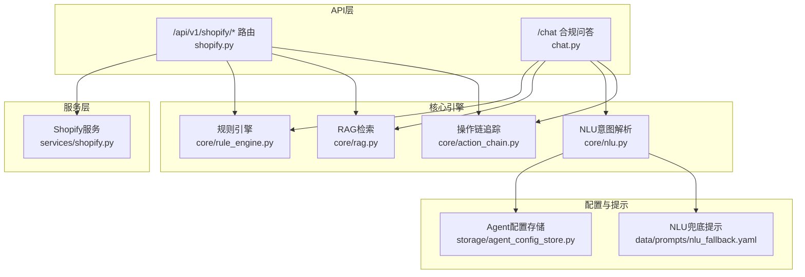
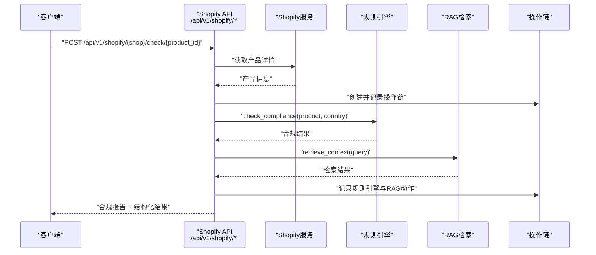
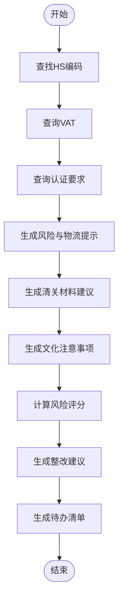
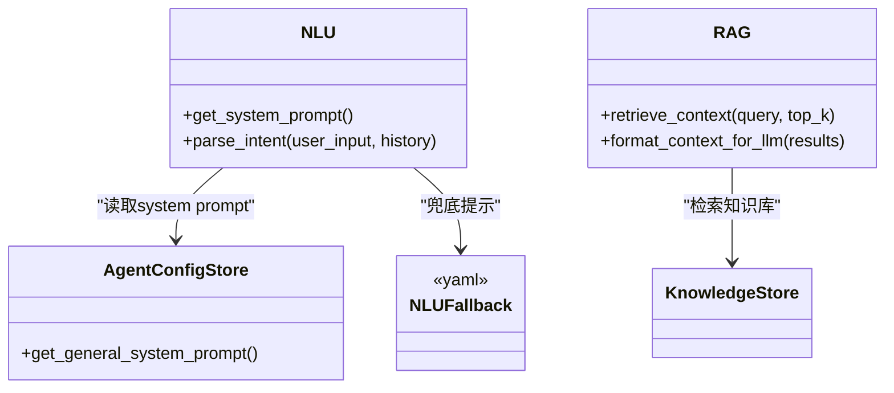
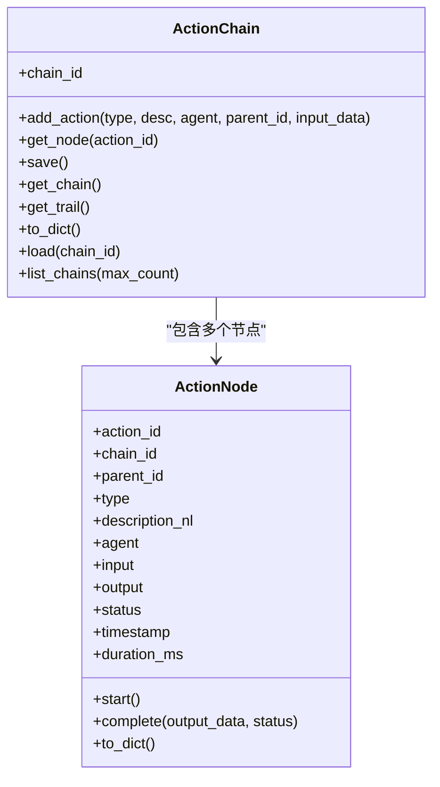
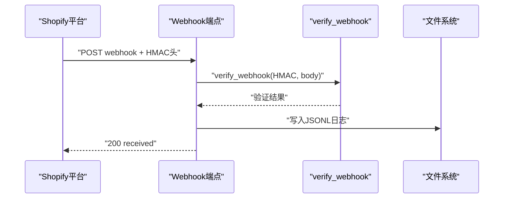
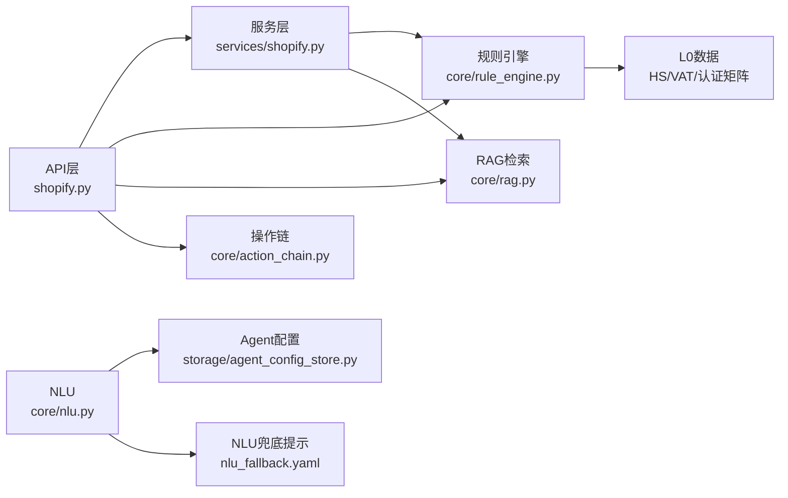

# Shopify集成接口

<cite>
**本文档引用的文件**
- [backend/app/api/shopify.py](file://backend/app/api/shopify.py)
- [backend/app/services/shopify.py](file://backend/app/services/shopify.py)
- [backend/app/models/schemas.py](file://backend/app/models/schemas.py)
- [backend/app/core/rule_engine.py](file://backend/app/core/rule_engine.py)
- [backend/app/core/rag.py](file://backend/app/core/rag.py)
- [backend/app/core/nlu.py](file://backend/app/core/nlu.py)
- [backend/app/core/action_chain.py](file://backend/app/core/action_chain.py)
- [backend/app/api/chat.py](file://backend/app/api/chat.py)
- [backend/app/storage/agent_config_store.py](file://backend/app/storage/agent_config_store.py)
- [backend/data/prompts/nlu_fallback.yaml](file://backend/data/prompts/nlu_fallback.yaml)
</cite>

## 目录
1. [简介](#简介)
2. [项目结构](#项目结构)
3. [核心组件](#核心组件)
4. [架构总览](#架构总览)
5. [详细组件分析](#详细组件分析)
6. [依赖关系分析](#依赖关系分析)
7. [性能考虑](#性能考虑)
8. [故障排除指南](#故障排除指南)
9. [结论](#结论)
10. [附录](#附录)

## 简介
本文件为Shopify电商集成接口的详细API文档，涵盖以下能力：
- Shopify店铺OAuth授权与回调
- 已连接店铺管理
- 产品列表获取与合规检查
- Shopify Webhook事件接收与验证
- 电商合规检查规则引擎、RAG知识检索与NLU意图解析
- 数据格式转换、错误处理与最佳实践

该系统采用“规则引擎+RAG+NLU”的三层合规检查流水线，结合操作链(ActionChain)追踪每次检查的完整决策过程，支持Codex Agent降级与回退路径。

## 项目结构
后端采用FastAPI框架，API路由集中在app/api目录，业务逻辑分布在app/services与app/core，数据模型位于app/models/schemas.py，知识检索与规则引擎分别在app/core/rag.py与app/core/rule_engine.py中实现。

图表来源
- [backend/app/api/shopify.py:1-257](file://backend/app/api/shopify.py#L1-L257)
- [backend/app/api/chat.py:1-541](file://backend/app/api/chat.py#L1-L541)
- [backend/app/services/shopify.py](file://backend/app/services/shopify.py)
- [backend/app/core/rule_engine.py:1-247](file://backend/app/core/rule_engine.py#L1-L247)
- [backend/app/core/rag.py:1-59](file://backend/app/core/rag.py#L1-L59)
- [backend/app/core/nlu.py:1-99](file://backend/app/core/nlu.py#L1-L99)
- [backend/app/core/action_chain.py:1-236](file://backend/app/core/action_chain.py#L1-L236)
- [backend/app/storage/agent_config_store.py:1-310](file://backend/app/storage/agent_config_store.py#L1-L310)
- [backend/data/prompts/nlu_fallback.yaml:1-20](file://backend/data/prompts/nlu_fallback.yaml#L1-L20)

章节来源
- [backend/app/api/shopify.py:1-257](file://backend/app/api/shopify.py#L1-L257)
- [backend/app/api/chat.py:1-541](file://backend/app/api/chat.py#L1-L541)

## 核心组件
- Shopify API路由：提供OAuth授权、回调、店铺列表、产品列表、合规检查、Webhook接收等端点。
- Shopify服务：封装Shopify SDK调用，负责授权URL构建、授权码换Token、产品拉取、Webhook HMAC验证等。
- 规则引擎：基于L0数据（HS编码、VAT、认证矩阵）执行确定性合规检查，输出结构化结果。
- RAG检索：从知识库检索相关法规，格式化为LLM可读上下文。
- NLU意图解析：将用户自然语言转为结构化意图（产品、目标国家、动作类型）。
- 操作链：记录每次合规检查的完整步骤，便于溯源与审计。

章节来源
- [backend/app/api/shopify.py:1-257](file://backend/app/api/shopify.py#L1-L257)
- [backend/app/core/rule_engine.py:1-247](file://backend/app/core/rule_engine.py#L1-L247)
- [backend/app/core/rag.py:1-59](file://backend/app/core/rag.py#L1-L59)
- [backend/app/core/nlu.py:1-99](file://backend/app/core/nlu.py#L1-L99)
- [backend/app/core/action_chain.py:1-236](file://backend/app/core/action_chain.py#L1-L236)

## 架构总览
Shopify集成遵循“API层-服务层-核心引擎”分层设计。API层负责HTTP协议与参数校验；服务层对接Shopify SDK与外部系统；核心引擎提供规则、检索与解析能力；操作链贯穿全流程，记录每个动作的输入输出与耗时。

图表来源
- [backend/app/api/shopify.py:127-201](file://backend/app/api/shopify.py#L127-L201)
- [backend/app/core/rule_engine.py:197-247](file://backend/app/core/rule_engine.py#L197-L247)
- [backend/app/core/rag.py:10-59](file://backend/app/core/rag.py#L10-L59)
- [backend/app/core/action_chain.py:77-184](file://backend/app/core/action_chain.py#L77-L184)

## 详细组件分析

### Shopify API路由与端点
- OAuth授权
  - 方法与路径：GET /api/v1/shopify/auth
  - 参数：shop（形如*.myshopify.com）
  - 返回：授权URL、shop、state（用于CSRF校验）
  - 错误：域名格式错误返回400
- OAuth回调
  - 方法与路径：GET /api/v1/shopify/callback
  - 参数：code、shop、state、timestamp、hmac
  - 返回：授权成功信息（包含shop与scope）
  - 错误：授权失败返回502
- 已连接店铺列表
  - 方法与路径：GET /api/v1/shopify/shops
  - 返回：ShopifyShopInfo数组
- 产品列表
  - 方法与路径：GET /api/v1/shopify/{shop}/products
  - 参数：max_count（默认50，上限250）
  - 返回：ShopifyProductInfo数组
  - 错误：未授权返回401，其他错误返回502
- 产品合规检查
  - 方法与路径：POST /api/v1/shopify/{shop}/check/{product_id}
  - 请求体：ShopifyComplianceCheckRequest（包含target_market）
  - 返回：ChatResponse（含合规结果与来源）
  - 流程：获取产品 → 构建查询 → 规则引擎 → RAG检索 → 组装报告 → 记录操作链
- Webhook接收
  - 方法与路径：POST /api/v1/shopify/webhook
  - 请求头：X-Shopify-Hmac-SHA256、X-Shopify-Topic、X-Shopify-Shop
  - 校验：HMAC SHA256签名验证
  - 返回：收到确认（包含topic与shop）

章节来源
- [backend/app/api/shopify.py:41-257](file://backend/app/api/shopify.py#L41-L257)

### Shopify服务层
- 授权URL构建：根据shop与state生成授权URL
- 授权码换Token：使用exchange_code_for_token换取访问令牌
- 店铺列表：list_connected_shops返回已授权店铺
- 产品获取：fetch_products与fetch_product_by_id支持分页与单个产品查询
- Webhook验证：verify_webhook对HMAC进行验证
- 数据转换：product_to_compliance_request将Shopify产品转换为合规查询数据

章节来源
- [backend/app/services/shopify.py](file://backend/app/services/shopify.py)

### 规则引擎（合规检查）
- 输入：产品名称、目标国家
- 输出：合规结果字典（HS编码、VAT、认证、风险等级、风险评分、物流提示、清关材料建议、文化注意事项、整改建议、待办清单）
- 关键函数：
  - lookup_hs：模糊匹配产品到HS编码
  - lookup_vat：查询目标国家标准VAT
  - get_certifications：查询目标国家所需认证
  - get_risk_flags/get_logistics_flags/get_customs_documents/get_cultural_notes：生成风险、物流、清关与文化提示
  - score_risk/build_remediation_steps：计算风险评分与整改建议
  - check_compliance：主流程整合上述能力

图表来源
- [backend/app/core/rule_engine.py:197-247](file://backend/app/core/rule_engine.py#L197-L247)

章节来源
- [backend/app/core/rule_engine.py:1-247](file://backend/app/core/rule_engine.py#L1-L247)

### RAG检索与NLU
- RAG检索：retrieve_context根据查询词检索知识库，format_context_for_llm格式化为LLM可读上下文
- NLU意图解析：parse_intent将用户输入转为结构化意图（产品、目标国家、动作、置信度），支持多轮历史上下文注入
- Agent配置：通用合规Agent的system prompt可从Agent配置存储或YAML兜底文件加载

图表来源
- [backend/app/core/nlu.py:1-99](file://backend/app/core/nlu.py#L1-L99)
- [backend/app/storage/agent_config_store.py:1-310](file://backend/app/storage/agent_config_store.py#L1-L310)
- [backend/data/prompts/nlu_fallback.yaml:1-20](file://backend/data/prompts/nlu_fallback.yaml#L1-L20)
- [backend/app/core/rag.py:1-59](file://backend/app/core/rag.py#L1-L59)

章节来源
- [backend/app/core/nlu.py:1-99](file://backend/app/core/nlu.py#L1-L99)
- [backend/app/storage/agent_config_store.py:1-310](file://backend/app/storage/agent_config_store.py#L1-L310)
- [backend/data/prompts/nlu_fallback.yaml:1-20](file://backend/data/prompts/nlu_fallback.yaml#L1-L20)
- [backend/app/core/rag.py:1-59](file://backend/app/core/rag.py#L1-L59)

### 操作链（ActionChain）
- 作用：记录每次合规检查的完整步骤，支持添加动作、开始/完成、持久化为JSON文件、回溯展示
- 字段：action_id、chain_id、parent_id、type、description_nl、agent、input、output、status、timestamp、duration_ms
- 用途：前端可按action_chain_id回溯决策链路，便于审计与问题定位

图表来源
- [backend/app/core/action_chain.py:23-236](file://backend/app/core/action_chain.py#L23-L236)

章节来源
- [backend/app/core/action_chain.py:1-236](file://backend/app/core/action_chain.py#L1-L236)

### 数据模型与Schema
- ShopifyAuthRequest、ShopifyShopInfo、ShopifyProductInfo、ShopifyComplianceCheckRequest、ShopifyImportRequest、ChatResponse、ComplianceResult等模型定义了API请求与响应的数据结构，确保前后端一致的契约。

章节来源
- [backend/app/models/schemas.py](file://backend/app/models/schemas.py)

### Webhook处理与安全
- 接收：POST /api/v1/shopify/webhook
- 校验：X-Shopify-Hmac-SHA256头参与HMAC验证
- 记录：事件写入本地JSONL文件（按shop域名单独文件），便于离线分析与重放

图表来源
- [backend/app/api/shopify.py:203-257](file://backend/app/api/shopify.py#L203-L257)

章节来源
- [backend/app/api/shopify.py:203-257](file://backend/app/api/shopify.py#L203-L257)

## 依赖关系分析
- API层依赖服务层与核心引擎：Shopify API路由调用Shopify服务与规则引擎、RAG检索，并通过操作链记录全流程。
- 服务层依赖Shopify SDK与配置：负责授权、产品获取与Webhook验证。
- 核心引擎依赖数据层与提示配置：规则引擎读取L0数据，NLU依赖Agent配置与YAML兜底提示。

图表来源
- [backend/app/api/shopify.py:1-257](file://backend/app/api/shopify.py#L1-L257)
- [backend/app/services/shopify.py](file://backend/app/services/shopify.py)
- [backend/app/core/rule_engine.py:1-247](file://backend/app/core/rule_engine.py#L1-L247)
- [backend/app/core/rag.py:1-59](file://backend/app/core/rag.py#L1-L59)
- [backend/app/core/nlu.py:1-99](file://backend/app/core/nlu.py#L1-L99)
- [backend/app/core/action_chain.py:1-236](file://backend/app/core/action_chain.py#L1-L236)
- [backend/app/storage/agent_config_store.py:1-310](file://backend/app/storage/agent_config_store.py#L1-L310)
- [backend/data/prompts/nlu_fallback.yaml:1-20](file://backend/data/prompts/nlu_fallback.yaml#L1-L20)

章节来源
- [backend/app/api/shopify.py:1-257](file://backend/app/api/shopify.py#L1-L257)
- [backend/app/core/rule_engine.py:1-247](file://backend/app/core/rule_engine.py#L1-L247)
- [backend/app/core/rag.py:1-59](file://backend/app/core/rag.py#L1-L59)
- [backend/app/core/nlu.py:1-99](file://backend/app/core/nlu.py#L1-L99)
- [backend/app/core/action_chain.py:1-236](file://backend/app/core/action_chain.py#L1-L236)
- [backend/app/storage/agent_config_store.py:1-310](file://backend/app/storage/agent_config_store.py#L1-L310)
- [backend/data/prompts/nlu_fallback.yaml:1-20](file://backend/data/prompts/nlu_fallback.yaml#L1-L20)

## 性能考虑
- 分页与限流：产品列表接口支持max_count参数，默认50，上限250，避免一次性拉取过多数据。
- 异步与并发：产品获取与合规检查采用异步模式，规则引擎与RAG检索并行执行，提升响应速度。
- 缓存与降级：当Codex不可用时自动降级至NLU→规则引擎→RAG路径，保证基础合规查询可用。
- 操作链持久化：操作链以JSON文件形式落盘，便于后续分析与回放，但需关注磁盘IO开销。

## 故障排除指南
- OAuth授权失败
  - 检查shop域名格式是否为*.myshopify.com
  - 确认state参数与回调一致，避免CSRF攻击
  - 查看回调参数完整性（code、shop、state、timestamp、hmac）
- 产品获取失败
  - 未授权返回401，确认店铺已授权并具备相应权限
  - 其他错误返回502，查看服务端异常日志
- Webhook验证失败
  - X-Shopify-Hmac-SHA256头缺失或不匹配，检查Shopify应用配置
  - 事件日志写入失败，检查data_dir目录权限
- 合规检查结果为空
  - 产品名称或目标国家识别不足，尝试更具体的描述
  - L0数据缺失（HS/VAT/认证矩阵），检查数据文件完整性

章节来源
- [backend/app/api/shopify.py:49-94](file://backend/app/api/shopify.py#L49-L94)
- [backend/app/api/shopify.py:118-124](file://backend/app/api/shopify.py#L118-L124)
- [backend/app/api/shopify.py:224-225](file://backend/app/api/shopify.py#L224-L225)

## 结论
本Shopify集成接口通过清晰的分层设计与成熟的合规检查流水线，实现了从OAuth授权、产品同步到合规检查与Webhook处理的全链路能力。规则引擎提供确定性检查，RAG增强法规上下文，NLU与Agent配置保障意图解析质量，操作链贯穿始终，便于审计与优化。建议在生产环境中强化Webhook签名验证、完善日志与监控，并持续扩展L0数据与知识库内容以提升准确性。

## 附录

### API端点一览
- GET /api/v1/shopify/auth
  - 查询参数：shop
  - 返回：authorization_url、shop、state
- GET /api/v1/shopify/callback
  - 查询参数：code、shop、state、timestamp、hmac
  - 返回：授权成功信息
- GET /api/v1/shopify/shops
  - 返回：已连接店铺列表
- GET /api/v1/shopify/{shop}/products
  - 查询参数：max_count（默认50，上限250）
  - 返回：产品列表
- POST /api/v1/shopify/{shop}/check/{product_id}
  - 请求体：ShopifyComplianceCheckRequest（target_market）
  - 返回：合规报告与结构化结果
- POST /api/v1/shopify/webhook
  - 请求头：X-Shopify-Hmac-SHA256、X-Shopify-Topic、X-Shopify-Shop
  - 返回：收到确认

章节来源
- [backend/app/api/shopify.py:41-257](file://backend/app/api/shopify.py#L41-L257)