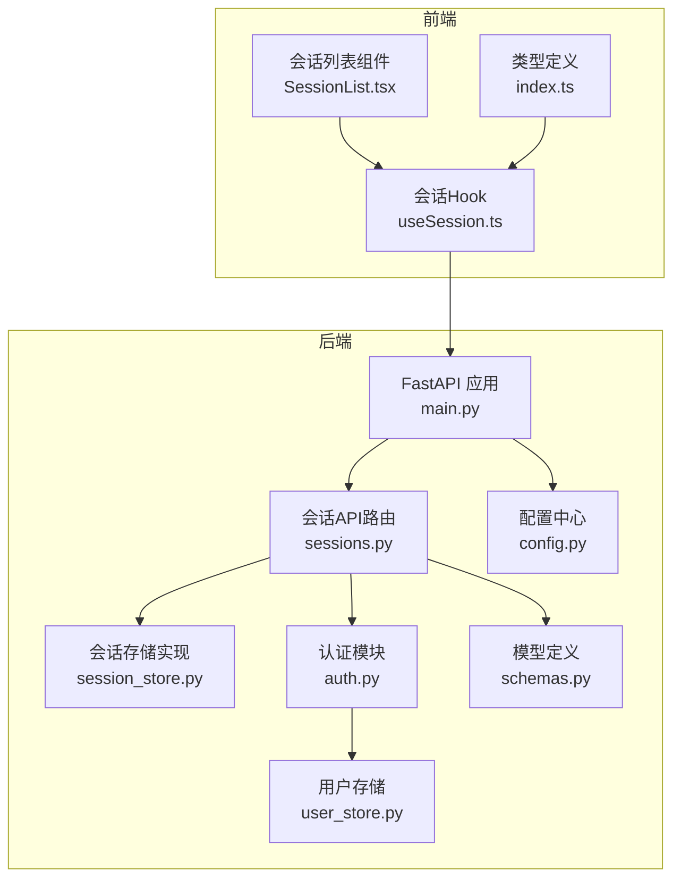
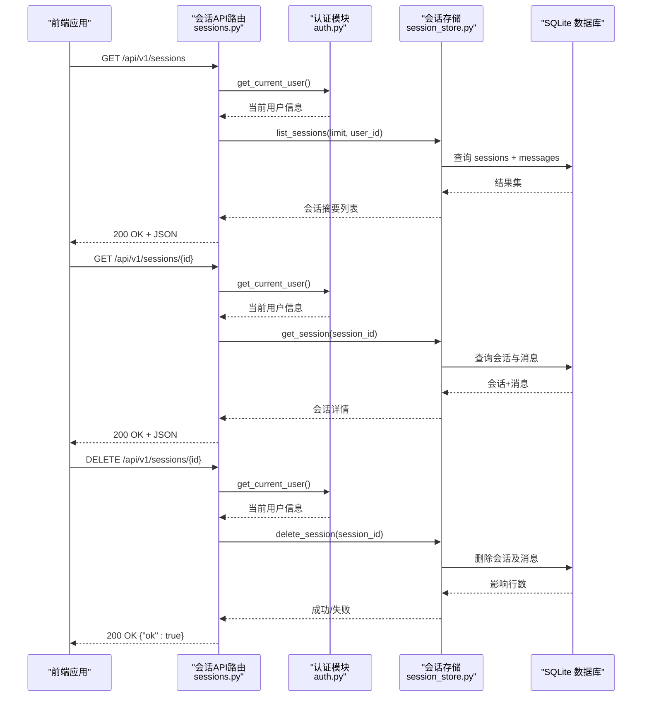
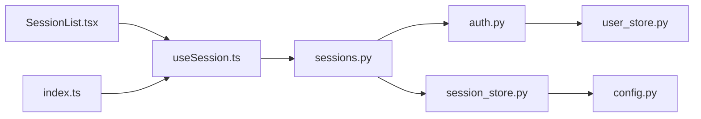

# 会话管理接口

<cite>
**本文引用的文件**
- [sessions.py](file://backend/app/api/sessions.py)
- [session_store.py](file://backend/app/storage/session_store.py)
- [schemas.py](file://backend/app/models/schemas.py)
- [auth.py](file://backend/app/core/auth.py)
- [main.py](file://backend/app/main.py)
- [config.py](file://backend/app/config.py)
- [user_store.py](file://backend/app/storage/user_store.py)
- [local_store.py](file://backend/app/core/local_store.py)
- [useSession.ts](file://frontend/src/hooks/useSession.ts)
- [SessionList.tsx](file://frontend/src/components/SessionList.tsx)
- [index.ts](file://frontend/src/types/index.ts)
</cite>

## 目录
1. [简介](#简介)
2. [项目结构](#项目结构)
3. [核心组件](#核心组件)
4. [架构总览](#架构总览)
5. [详细组件分析](#详细组件分析)
6. [依赖分析](#依赖分析)
7. [性能考虑](#性能考虑)
8. [故障排查指南](#故障排查指南)
9. [结论](#结论)
10. [附录](#附录)

## 简介
本文件面向“会话管理接口”的使用者与维护者，提供完整的API文档与实现细节说明。内容涵盖：
- 会话的创建、查询、删除等CRUD操作
- 会话状态与消息历史的持久化机制
- 会话ID生成策略
- 多轮对话上下文管理与消息历史存储格式
- 会话恢复机制与超时处理策略
- 访问控制与隐私保护
- 性能优化方案
- 完整的CRUD操作示例、数据格式规范与错误处理指南

## 项目结构
后端采用FastAPI框架，会话管理接口位于API路由层，数据持久化由SQLite存储模块负责，模型定义统一在schemas中。

图表来源
- [main.py:22-32](file://backend/app/main.py#L22-L32)
- [sessions.py:14](file://backend/app/api/sessions.py#L14)
- [session_store.py:27-34](file://backend/app/storage/session_store.py#L27-L34)
- [auth.py:41-52](file://backend/app/core/auth.py#L41-L52)
- [schemas.py:234-264](file://backend/app/models/schemas.py#L234-L264)
- [config.py:173-176](file://backend/app/config.py#L173-L176)
- [user_store.py:22-33](file://backend/app/storage/user_store.py#L22-L33)
- [useSession.ts:5](file://frontend/src/hooks/useSession.ts#L5)
- [SessionList.tsx:1](file://frontend/src/components/SessionList.tsx#L1)
- [index.ts:278-304](file://frontend/src/types/index.ts#L278-L304)

章节来源
- [main.py:22-32](file://backend/app/main.py#L22-L32)
- [sessions.py:14](file://backend/app/api/sessions.py#L14)

## 核心组件
- API路由层：提供会话列表查询、单个会话获取、会话删除三个端点，并基于JWT进行鉴权与权限校验。
- 存储层：基于SQLite的会话与消息表，支持会话创建、列表查询、详情获取、消息追加、删除会话等操作。
- 模型层：定义会话、消息、合规结果等数据结构，确保前后端一致的数据契约。
- 认证与权限：JWT解析与用户角色判定，admin可查看全部会话，普通用户仅能访问自身会话。
- 前端集成：提供会话列表、打开会话、新建会话等交互逻辑。

章节来源
- [sessions.py:17-78](file://backend/app/api/sessions.py#L17-L78)
- [session_store.py:74-236](file://backend/app/storage/session_store.py#L74-L236)
- [schemas.py:234-264](file://backend/app/models/schemas.py#L234-L264)
- [auth.py:41-59](file://backend/app/core/auth.py#L41-L59)

## 架构总览
会话管理接口遵循“路由-服务-存储-模型”分层设计，请求经由FastAPI路由进入，通过认证中间件获取当前用户身份，随后调用存储模块完成数据读写，最终以Pydantic模型序列化响应返回。

图表来源
- [sessions.py:23-78](file://backend/app/api/sessions.py#L23-L78)
- [auth.py:41-52](file://backend/app/core/auth.py#L41-L52)
- [session_store.py:87-225](file://backend/app/storage/session_store.py#L87-L225)

## 详细组件分析

### 1) 会话API路由与权限控制
- 路由注册：在应用启动时将会话路由挂载到/api/v1前缀。
- 权限控制：通过依赖注入解析JWT，获取当前用户；admin可查看全部会话，普通用户仅能查看自身会话。
- 访问控制要点：
  - 列表查询：admin不限制，普通用户按user_id过滤。
  - 单个会话查询：需存在且属于当前用户或admin。
  - 删除会话：需存在且属于当前用户或admin。

章节来源
- [main.py:27](file://backend/app/main.py#L27)
- [sessions.py:23-78](file://backend/app/api/sessions.py#L23-L78)
- [auth.py:41-59](file://backend/app/core/auth.py#L41-L59)

### 2) 会话存储与消息持久化
- 数据库与表结构：
  - sessions表：保存会话的基本信息（id、title、created_at、updated_at、user_id）。
  - messages表：保存消息明细（id、session_id、role、content、合规结果JSON、意图JSON、来源JSON、created_at），并建立外键约束与索引。
- 会话操作：
  - 创建：生成UUID作为会话ID，插入sessions表。
  - 列表：支持按user_id过滤与按updated_at倒序分页（默认限制50条）。
  - 获取：返回会话基本信息与全部消息，消息包含合规结果、意图、来源等结构化数据。
  - 删除：级联删除messages与sessions。
- 消息操作：
  - 添加：向messages表插入一条消息，同时更新sessions.updated_at。
  - 最近消息：按created_at倒序取N条，用于多轮上下文传递。

章节来源
- [session_store.py:37-70](file://backend/app/storage/session_store.py#L37-L70)
- [session_store.py:74-84](file://backend/app/storage/session_store.py#L74-L84)
- [session_store.py:87-131](file://backend/app/storage/session_store.py#L87-L131)
- [session_store.py:134-167](file://backend/app/storage/session_store.py#L134-L167)
- [session_store.py:170-183](file://backend/app/storage/session_store.py#L170-L183)
- [session_store.py:186-217](file://backend/app/storage/session_store.py#L186-L217)
- [session_store.py:220-225](file://backend/app/storage/session_store.py#L220-L225)

### 3) 消息历史存储格式与合规数据
- 消息字段：
  - id：消息唯一ID（UUID）
  - role：角色（user/assistant）
  - content：消息内容（Markdown格式化报告或用户输入）
  - compliance_result：合规检查结果（结构化JSON，包含HS编码、风险等级、整改建议等）
  - intent：NLU解析结果（结构化JSON）
  - sources：RAG来源列表（字符串数组）
  - created_at：Unix时间戳（秒）
- 存储策略：
  - 合规结果、意图、来源均以JSON字符串形式存储在messages表对应列中，读取时再反序列化为Python对象；异常时返回None，保证健壮性。

章节来源
- [schemas.py:236-244](file://backend/app/models/schemas.py#L236-L244)
- [session_store.py:148-158](file://backend/app/storage/session_store.py#L148-L158)
- [session_store.py:240-250](file://backend/app/storage/session_store.py#L240-L250)

### 4) 会话ID生成策略
- 会话ID与消息ID均采用UUID v4生成，具备高熵与强随机性，适合分布式与并发场景下的唯一性保障。
- 生成位置：
  - 会话ID：创建会话时生成。
  - 消息ID：添加消息时生成。

章节来源
- [session_store.py:77](file://backend/app/storage/session_store.py#L77)
- [session_store.py:196](file://backend/app/storage/session_store.py#L196)

### 5) 多轮对话上下文管理
- 上下文提取：通过“最近N条消息”查询，按created_at倒序取N条，再逆序还原时间顺序，形成连贯的多轮对话上下文。
- 上下文用途：用于后续LLM推理或规则引擎判断，减少重复传输与提升响应速度。
- 默认取值：最近6条消息（可在调用处调整N）。

章节来源
- [session_store.py:170-183](file://backend/app/storage/session_store.py#L170-L183)

### 6) 会话恢复机制与超时处理
- 会话恢复：当前代码未提供显式的“恢复会话”端点或逻辑，但可通过SDK配置项与会话ID进行外部集成（例如CLI参数或SDK会话ID字段），与后端会话表关联。
- 超时处理：后端未实现会话超时清理逻辑；如需超时控制，可在业务侧通过定时任务或外部调度器实现会话归档/清理策略。

章节来源
- [config.py:23-30](file://backend/app/config.py#L23-L30)

### 7) 访问控制与隐私保护
- 访问控制：
  - 列表：admin可见全部，普通用户仅见自身。
  - 单个会话：仅会话归属者或admin可见。
  - 删除：仅会话归属者或admin可删。
- 隐私保护：
  - 消息内容与合规结果均为结构化数据，存储为JSON字符串，避免明文敏感信息直接暴露。
  - 建议在生产环境开启HTTPS、限制CORS白名单、定期审计日志与访问行为。

章节来源
- [sessions.py:23-78](file://backend/app/api/sessions.py#L23-L78)

### 8) 前端集成与数据契约
- 前端通过useSession Hook封装会话列表与打开会话的HTTP调用，类型定义与后端模型保持一致。
- 会话列表组件按时间分组展示，支持删除操作触发后端DELETE端点。

章节来源
- [useSession.ts:15-49](file://frontend/src/hooks/useSession.ts#L15-L49)
- [SessionList.tsx:32-134](file://frontend/src/components/SessionList.tsx#L32-L134)
- [index.ts:278-304](file://frontend/src/types/index.ts#L278-L304)

## 依赖分析
- API路由依赖认证模块与存储模块，认证模块依赖用户存储与配置中心。
- 存储模块依赖配置中心以确定数据库路径与索引策略。
- 前端依赖后端API与类型定义，保持数据一致性。

图表来源
- [sessions.py:9-12](file://backend/app/api/sessions.py#L9-L12)
- [auth.py:48-51](file://backend/app/core/auth.py#L48-L51)
- [user_store.py:22-33](file://backend/app/storage/user_store.py#L22-L33)
- [session_store.py:19](file://backend/app/storage/session_store.py#L19)
- [config.py:151](file://backend/app/config.py#L151)
- [useSession.ts:5](file://frontend/src/hooks/useSession.ts#L5)
- [SessionList.tsx:1](file://frontend/src/components/SessionList.tsx#L1)
- [index.ts:278-304](file://frontend/src/types/index.ts#L278-L304)

## 性能考虑
- 索引优化：messages表按session_id建立索引，sessions表按updated_at建立索引，提升列表与详情查询效率。
- 分页与限制：列表默认限制50条，避免一次性返回过多数据。
- JSON序列化：合规结果、意图、来源以JSON字符串存储，读取时惰性反序列化，异常时返回None，降低解析成本。
- 建议优化：
  - 引入缓存层（如Redis）缓存热门会话的最近消息，减少数据库压力。
  - 对消息内容进行压缩存储（如gzip），在读取时解压，平衡存储与I/O。
  - 在高频场景下，对会话列表进行分页游标查询，避免OFFSET过大导致的性能问题。

章节来源
- [session_store.py:58-61](file://backend/app/storage/session_store.py#L58-L61)
- [session_store.py:87-131](file://backend/app/storage/session_store.py#L87-L131)

## 故障排查指南
- 401 未授权：检查JWT是否有效、是否过期、是否携带正确的Authorization头。
- 403 禁止访问：确认当前用户角色与会话归属关系，admin可绕过归属限制。
- 404 会话不存在：确认session_id是否正确，是否存在该会话。
- JSON反序列化异常：当合规结果、意图或来源字段损坏时，读取时会返回None，不影响整体流程。
- 数据库连接问题：确认data_dir配置正确，sessions.db文件存在且可写。

章节来源
- [sessions.py:37-78](file://backend/app/api/sessions.py#L37-L78)
- [session_store.py:240-250](file://backend/app/storage/session_store.py#L240-L250)
- [config.py:151](file://backend/app/config.py#L151)

## 结论
会话管理接口以清晰的分层设计实现了会话的全生命周期管理，结合SQLite的轻量存储与JWT的权限控制，满足中小型应用场景的需求。建议在生产环境中进一步完善超时清理、缓存与压缩等优化措施，并持续关注合规与隐私保护的最佳实践。

## 附录

### A. API端点一览
- GET /api/v1/sessions
  - 功能：获取会话列表
  - 权限：登录用户；admin可见全部，普通用户仅见自身
  - 响应：会话摘要数组
- GET /api/v1/sessions/{session_id}
  - 功能：获取单个会话详情（含全部消息）
  - 权限：登录用户；admin或会话归属者
  - 响应：完整会话对象
- DELETE /api/v1/sessions/{session_id}
  - 功能：删除会话及其全部消息
  - 权限：登录用户；admin或会话归属者
  - 响应：{"ok": true}

章节来源
- [sessions.py:17-78](file://backend/app/api/sessions.py#L17-L78)

### B. 数据模型与字段规范
- 会话摘要（SessionSummary）
  - 字段：id、title、created_at、updated_at、message_count、preview
- 会话消息（SessionMessage）
  - 字段：id、role、content、compliance_result、intent、sources、created_at
- 完整会话（Session）
  - 字段：id、title、created_at、updated_at、messages（数组）

章节来源
- [schemas.py:247-264](file://backend/app/models/schemas.py#L247-L264)

### C. 前端调用示例（路径参考）
- 加载会话列表：[useSession.ts:16-26](file://frontend/src/hooks/useSession.ts#L16-L26)
- 打开会话详情：[useSession.ts:29-43](file://frontend/src/hooks/useSession.ts#L29-L43)
- 删除会话：[SessionList.tsx:125-134](file://frontend/src/components/SessionList.tsx#L125-L134)

### D. 会话恢复与超时策略（建议）
- 会话恢复：通过SDK配置项与会话ID进行外部集成，建议在业务层实现“fork新会话”或“继续对话”逻辑。
- 超时处理：建议引入定时任务或调度器，定期清理长时间未更新的会话，释放资源。

章节来源
- [config.py:23-30](file://backend/app/config.py#L23-L30)