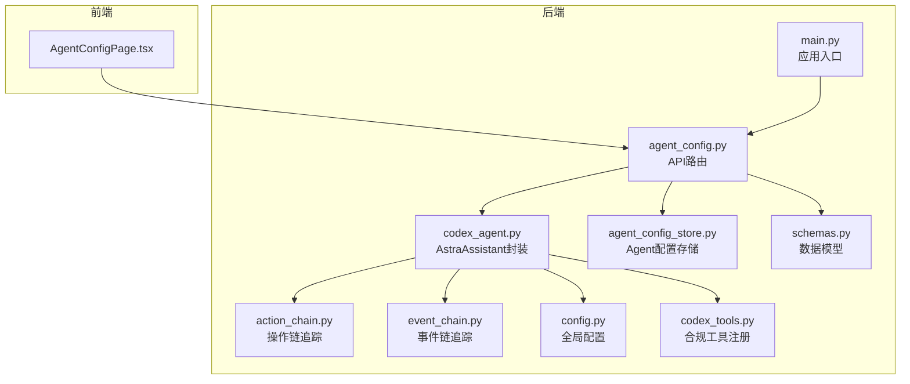
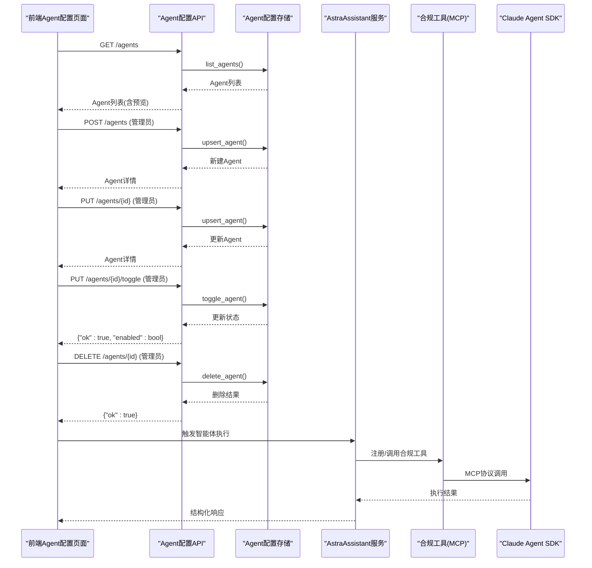
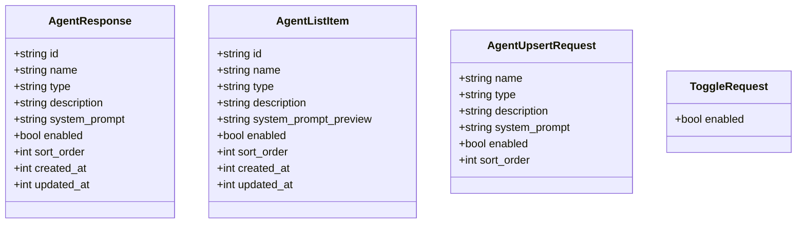
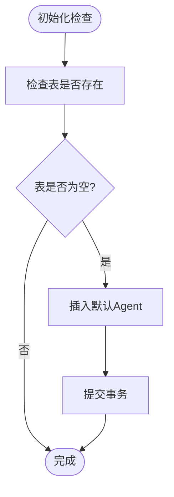
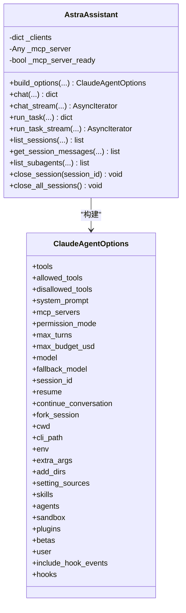
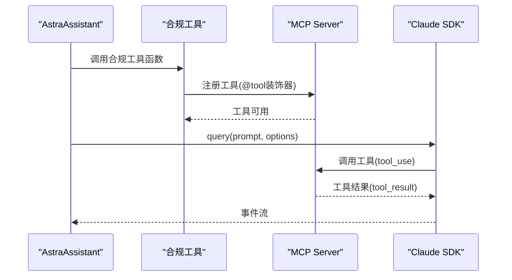
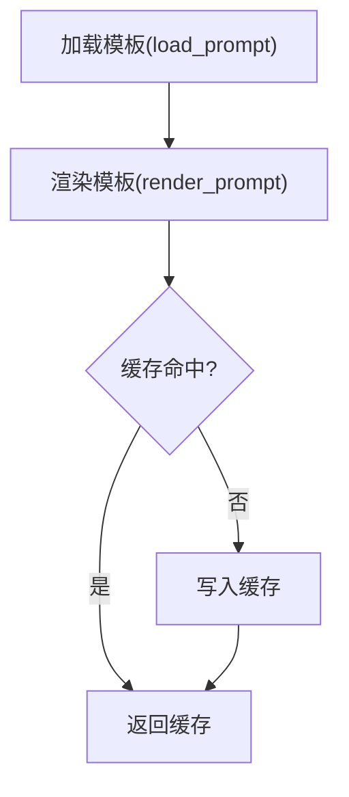
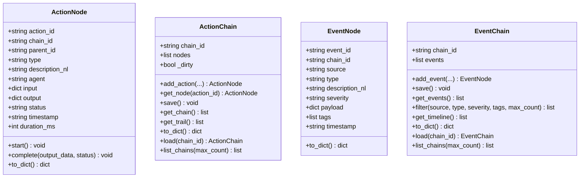
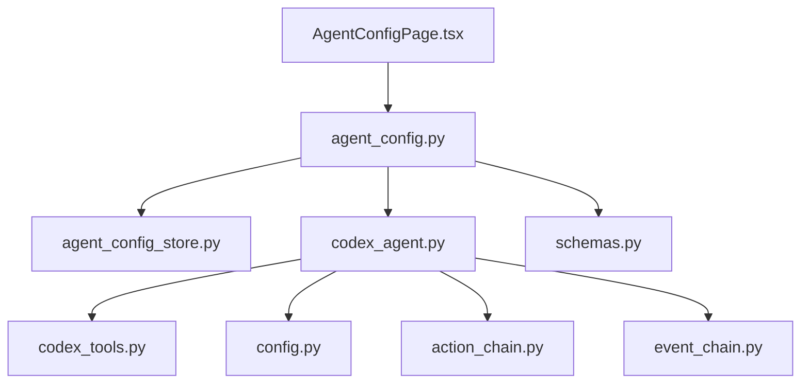

# 智能体配置接口

<cite>
**本文档引用的文件**
- [agent_config.py](file://backend/app/api/agent_config.py)
- [codex_agent.py](file://backend/app/services/codex_agent.py)
- [agent_config_store.py](file://backend/app/storage/agent_config_store.py)
- [action_chain.py](file://backend/app/core/action_chain.py)
- [event_chain.py](file://backend/app/core/event_chain.py)
- [config.py](file://backend/app/config.py)
- [codex_tools.py](file://backend/app/services/codex_tools.py)
- [schemas.py](file://backend/app/models/schemas.py)
- [main.py](file://backend/app/main.py)
- [chat_compliance.yaml](file://backend/data/prompts/chat_compliance.yaml)
- [prompt_loader.py](file://backend/app/services/prompt_loader.py)
- [AgentConfigPage.tsx](file://frontend/src/pages/AgentConfigPage.tsx)
- [metrics.py](file://backend/app/core/metrics.py)
</cite>

## 目录
1. [简介](#简介)
2. [项目结构](#项目结构)
3. [核心组件](#核心组件)
4. [架构概览](#架构概览)
5. [详细组件分析](#详细组件分析)
6. [依赖分析](#依赖分析)
7. [性能考虑](#性能考虑)
8. [故障排除指南](#故障排除指南)
9. [结论](#结论)
10. [附录](#附录)

## 简介
本文件面向Codex Agent的智能体配置接口，提供全面的API文档与实现解析。内容涵盖配置管理、技能设置、工具调用、工作流程配置、工具链管理、响应格式定制、状态监控、性能优化与调试模式，并包含配置模板、默认设置、自定义扩展指导，以及配置验证、热更新与版本管理的最佳实践。

## 项目结构
后端采用FastAPI框架，路由集中在API层，业务逻辑分布在服务层，配置与存储位于独立模块。前端提供Agent配置页面，支持管理员增删改查与启用/禁用操作。

**图表来源**
- [agent_config.py:1-174](file://backend/app/api/agent_config.py#L1-L174)
- [codex_agent.py:1-970](file://backend/app/services/codex_agent.py#L1-L970)
- [agent_config_store.py:1-310](file://backend/app/storage/agent_config_store.py#L1-L310)
- [action_chain.py:1-236](file://backend/app/core/action_chain.py#L1-L236)
- [event_chain.py:1-215](file://backend/app/core/event_chain.py#L1-L215)
- [config.py:1-183](file://backend/app/config.py#L1-L183)
- [codex_tools.py:1-247](file://backend/app/services/codex_tools.py#L1-L247)
- [schemas.py:1-264](file://backend/app/models/schemas.py#L1-L264)
- [main.py:1-78](file://backend/app/main.py#L1-L78)

**章节来源**
- [main.py:1-78](file://backend/app/main.py#L1-L78)
- [agent_config.py:1-174](file://backend/app/api/agent_config.py#L1-L174)

## 核心组件
- Agent配置API：提供Agent列表、详情、创建、更新、删除、启用/禁用等REST接口，支持管理员权限控制与只读用户视图。
- Agent配置存储：SQLite存储Agent配置，包含默认内置Agent与自定义Agent，支持排序、启用状态与时间戳管理。
- AstraAssistant封装：基于Claude Agent SDK的完整封装，负责构建ClaudeAgentOptions、工具链、子代理、钩子、技能、沙箱、插件等配置，并提供多轮对话与一次性任务执行。
- 合规工具注册：通过MCP协议注册合规工具（HS编码、VAT税率、认证要求、风险评估、物流要求、文化注意事项等），并与规则引擎与RAG检索集成。
- Prompt模板系统：从YAML文件加载与渲染系统提示词，支持热加载，便于微调与快速迭代。
- 操作链与事件链：记录系统内每一步操作与重要事件，支持回溯与可视化展示。
- 全局配置：集中管理SDK开关、API Key、会话与模型、工具权限、MCP配置、子代理、技能、沙箱、插件、环境变量、额外CLI参数、高级选项等。
- 前端Agent配置页面：提供管理员友好的Agent管理界面，支持新建、编辑、启用/禁用、删除（内置Agent保护）。

**章节来源**
- [agent_config.py:1-174](file://backend/app/api/agent_config.py#L1-L174)
- [agent_config_store.py:1-310](file://backend/app/storage/agent_config_store.py#L1-L310)
- [codex_agent.py:1-970](file://backend/app/services/codex_agent.py#L1-L970)
- [codex_tools.py:1-247](file://backend/app/services/codex_tools.py#L1-L247)
- [prompt_loader.py:1-79](file://backend/app/services/prompt_loader.py#L1-L79)
- [action_chain.py:1-236](file://backend/app/core/action_chain.py#L1-L236)
- [event_chain.py:1-215](file://backend/app/core/event_chain.py#L1-L215)
- [config.py:1-183](file://backend/app/config.py#L1-L183)
- [AgentConfigPage.tsx:1-450](file://frontend/src/pages/AgentConfigPage.tsx#L1-L450)

## 架构概览
智能体配置接口围绕Agent配置与Claude SDK封装展开，前端通过API进行管理，后端通过存储层持久化配置，服务层负责构建与执行智能体工作流，工具层提供合规工具，配置层统一管理SDK与模型参数。

**图表来源**
- [agent_config.py:61-157](file://backend/app/api/agent_config.py#L61-L157)
- [agent_config_store.py:203-294](file://backend/app/storage/agent_config_store.py#L203-L294)
- [codex_agent.py:193-381](file://backend/app/services/codex_agent.py#L193-L381)
- [codex_tools.py:172-186](file://backend/app/services/codex_tools.py#L172-L186)

## 详细组件分析

### Agent配置API
- 端点设计
  - GET /agents：返回Agent列表，包含预览字段，节省带宽。
  - GET /agents/{agent_id}：返回Agent完整详情，含system_prompt。
  - POST /agents：新建Agent（管理员）。
  - PUT /agents/{agent_id}：更新Agent（管理员）。
  - DELETE /agents/{agent_id}：删除Agent（管理员，内置Agent不可删除）。
  - PUT /agents/{agent_id}/toggle：启用/禁用Agent（管理员）。
- 权限控制
  - 列表与详情对登录用户开放，新建/更新/删除/启用/禁用仅管理员。
- 数据模型
  - AgentResponse：包含id、name、type、description、system_prompt、enabled、sort_order、created_at、updated_at。
  - AgentListItem：列表视图，不含完整system_prompt。
  - AgentUpsertRequest：创建/更新请求体，包含name、type、description、system_prompt、enabled、sort_order。
  - ToggleRequest：启用/禁用请求体。

**图表来源**
- [agent_config.py:21-57](file://backend/app/api/agent_config.py#L21-L57)

**章节来源**
- [agent_config.py:61-157](file://backend/app/api/agent_config.py#L61-L157)

### Agent配置存储
- 默认Agent预设
  - 通用合规Agent、出境法律Agent、税务Agent、民俗文化Agent、认证标准Agent。
  - 每个内置Agent包含name、type、description、system_prompt、enabled、sort_order。
- 存储结构
  - 表：agent_configs(id, name, type, description, system_prompt, enabled, sort_order, created_at, updated_at)。
  - 初始化：若表为空，写入默认Agent。
- CRUD操作
  - list_agents：支持按enabled过滤与排序。
  - get_agent/get_agent_by_type：按id或type查询。
  - upsert_agent：创建或更新，自动生成id（自定义Agent）。
  - delete_agent：保护内置Agent不被删除。
  - toggle_agent：切换启用状态。
  - get_general_system_prompt：获取通用Agent的system_prompt（用于NLU）。

**图表来源**
- [agent_config_store.py:183-198](file://backend/app/storage/agent_config_store.py#L183-L198)

**章节来源**
- [agent_config_store.py:24-158](file://backend/app/storage/agent_config_store.py#L24-L158)
- [agent_config_store.py:203-294](file://backend/app/storage/agent_config_store.py#L203-L294)

### AstraAssistant封装与Claude SDK配置
- 构建ClaudeAgentOptions
  - 工具集：preset=claude_code。
  - 自动批准工具：sdk_allowed_tools或默认Read/Write/Edit/Bash/Glob/Grep/WebSearch/WebFetch，加上合规工具。
  - 禁用工具：sdk_disallowed_tools。
  - 环境变量：ANTHROPIC_API_KEY + sdk_env_json + 额外env。
  - 会话参数：session_id、resume、continue_conversation、fork_session。
  - 子代理：sdk_agents_json解析为AgentDefinition。
  - 技能：sdk_skills_json支持列表或"all"。
  - 沙箱：sdk_sandbox_json映射为SandboxSettings。
  - 插件：sdk_plugins_json映射为SdkPluginConfig列表。
  - 额外CLI参数：sdk_extra_args_json，支持启用文件检查点。
  - 额外目录：sdk_add_dirs_json。
  - 设置源：sdk_setting_sources_json。
  - Beta功能：sdk_betas_json。
  - 模型：sdk_model、sdk_fallback_model。
  - System Prompt：可覆盖默认ASTRA_SYSTEM_PROMPT。
  - MCP服务器：注入合规MCP server。
  - 钩子：PreToolUse注入记忆上下文（L0-L4）。
- 记忆系统钩子
  - 在工具调用前注入会话上下文、用户偏好与最近搜索，提升个性化与准确性。
- 会话管理
  - list_sessions、get_session_info、get_session_messages、delete_session、fork_session、rename_session、tag_session。
- 子代理管理
  - list_subagents、get_subagent_messages。
- 多轮对话与一次性任务
  - chat/chat_stream：支持流式事件推送（delta/tool_use/tool_result/task_*等）。
  - run_task/run_task_stream：一次性任务，适合无需持久化会话的后台任务。
- SDK可用性检查
  - 检查sdk_enabled、claude-agent-sdk安装、anthropic_api_key。

**图表来源**
- [codex_agent.py:193-381](file://backend/app/services/codex_agent.py#L193-L381)
- [codex_agent.py:138-154](file://backend/app/services/codex_agent.py#L138-L154)

**章节来源**
- [codex_agent.py:193-381](file://backend/app/services/codex_agent.py#L193-L381)
- [codex_agent.py:383-446](file://backend/app/services/codex_agent.py#L383-L446)

### 合规工具与MCP集成
- 工具注册
  - 通过@tool装饰器注册合规工具，包括HS编码查询、VAT税率查询、认证要求、风险评估、合规检查、法规检索、物流要求、文化注意事项。
  - 工具结果统一转换为MCP text content响应。
- MCP Server工厂
  - get_compliance_mcp_server：单例，按需创建，注入合规工具集合。
- 工具函数映射
  - TOOL_FUNCTIONS提供直接调用映射，支持向后兼容。
  - ALL_MCP_TOOLS/ALL_MCP_TOOL_SCHEMAS：工具清单与Schema。

**图表来源**
- [codex_tools.py:64-164](file://backend/app/services/codex_tools.py#L64-L164)
- [codex_tools.py:172-186](file://backend/app/services/codex_tools.py#L172-L186)

**章节来源**
- [codex_tools.py:64-164](file://backend/app/services/codex_tools.py#L64-L164)
- [codex_tools.py:172-186](file://backend/app/services/codex_tools.py#L172-L186)

### Prompt模板与系统提示词
- Prompt加载器
  - 从YAML文件加载模板，支持热加载与简单变量渲染。
  - render_prompt：将模板变量替换为传入参数。
- 合规对话模板
  - chat_compliance.yaml：定义Codex Agent的能力边界、回答风格与处理流程。

**图表来源**
- [prompt_loader.py:23-70](file://backend/app/services/prompt_loader.py#L23-L70)
- [chat_compliance.yaml:1-21](file://backend/data/prompts/chat_compliance.yaml#L1-L21)

**章节来源**
- [prompt_loader.py:23-70](file://backend/app/services/prompt_loader.py#L23-L70)
- [chat_compliance.yaml:1-21](file://backend/data/prompts/chat_compliance.yaml#L1-L21)

### 操作链与事件链
- 操作链（ActionChain）
  - 记录一次交互中的所有操作步骤，支持添加节点、开始/完成、保存、回溯与可视化展示。
  - 存储为JSON文件，按chain_id组织。
- 事件链（EventChain）
  - 记录系统内外部事件，支持按来源/类型/严重度筛选与时间线展示。
  - 存储为JSON文件，按chain_id组织。

**图表来源**
- [action_chain.py:23-184](file://backend/app/core/action_chain.py#L23-L184)
- [event_chain.py:24-166](file://backend/app/core/event_chain.py#L24-L166)

**章节来源**
- [action_chain.py:23-236](file://backend/app/core/action_chain.py#L23-L236)
- [event_chain.py:24-215](file://backend/app/core/event_chain.py#L24-L215)

### 全局配置与SDK参数
- SDK开关与认证
  - sdk_enabled、anthropic_api_key。
- 会话与模型
  - sdk_session_id、sdk_resume_session、sdk_continue_conversation、sdk_fork_session、sdk_model、sdk_fallback_model、sdk_max_turns、sdk_max_budget_usd。
- 工具与权限
  - sdk_allowed_tools、sdk_disallowed_tools、sdk_permission_mode。
- MCP与钩子
  - sdk_strict_mcp_config、sdk_include_hook_events。
- 子代理、技能、沙箱、插件
  - sdk_agents_json、sdk_skills_json、sdk_sandbox_json、sdk_plugins_json。
- 额外参数与高级选项
  - sdk_extra_args_json、sdk_add_dirs_json、sdk_env_json、sdk_cli_path、sdk_setting_sources_json、sdk_betas_json、sdk_enable_file_checkpointing、sdk_user。
- LLM主备配置
  - llm_api_key/llm_base_url/llm_model与备用openrouter配置。

**章节来源**
- [config.py:6-183](file://backend/app/config.py#L6-L183)

### 前端Agent配置页面
- 功能特性
  - 列表展示：内置Agent类型标签、启用状态、预览system_prompt。
  - 新建/编辑：管理员可编辑name、type、description、system_prompt、enabled、sort_order。
  - 启用/禁用：管理员可切换状态。
  - 删除保护：内置Agent不可删除。
  - 提示说明：System Prompt编写建议与影响范围。
- 数据流
  - 通过authFetch调用后端API，实时更新列表与状态。

**章节来源**
- [AgentConfigPage.tsx:1-450](file://frontend/src/pages/AgentConfigPage.tsx#L1-L450)

## 依赖分析
- 组件耦合
  - API层依赖存储层与服务层；服务层依赖工具层与配置层；前端依赖API层。
- 外部依赖
  - Claude Agent SDK（可选，通过settings.sdk_enabled控制降级）。
  - MCP协议与合规工具注册。
  - YAML模板系统与SQLite存储。
- 潜在循环依赖
  - 未发现直接循环；模块职责清晰，通过服务层协调。

**图表来源**
- [agent_config.py:1-174](file://backend/app/api/agent_config.py#L1-L174)
- [agent_config_store.py:1-310](file://backend/app/storage/agent_config_store.py#L1-L310)
- [codex_agent.py:1-970](file://backend/app/services/codex_agent.py#L1-L970)
- [codex_tools.py:1-247](file://backend/app/services/codex_tools.py#L1-L247)
- [config.py:1-183](file://backend/app/config.py#L1-L183)
- [action_chain.py:1-236](file://backend/app/core/action_chain.py#L1-L236)
- [event_chain.py:1-215](file://backend/app/core/event_chain.py#L1-L215)
- [schemas.py:1-264](file://backend/app/models/schemas.py#L1-L264)
- [AgentConfigPage.tsx:1-450](file://frontend/src/pages/AgentConfigPage.tsx#L1-L450)

**章节来源**
- [main.py:1-78](file://backend/app/main.py#L1-L78)

## 性能考虑
- SDK可用性检查与降级
  - 当SDK不可用时，服务层返回模拟结果，保证系统可用性。
- 会话资源管理
  - 通过_close_session/close_all_sessions释放SDK客户端资源，避免内存泄漏。
- 工具调用与钩子
  - 合规工具同步执行，钩子在PreToolUse注入上下文，减少重复检索。
- Prompt热加载
  - 模板缓存与热加载避免频繁I/O，提升响应速度。
- 存储层优化
  - SQLite按需查询，列表预览system_prompt避免大字段传输。

[本节为通用性能讨论，无需特定文件来源]

## 故障排除指南
- SDK不可用
  - 现象：对话返回模拟结果。
  - 排查：检查settings.sdk_enabled、claude-agent-sdk安装、anthropic_api_key。
- MCP工具不可用
  - 现象：工具注册失败或调用异常。
  - 排查：确认claude-agent-sdk安装，检查工具注册日志。
- Agent删除失败
  - 现象：返回“内置Agent不可删除”。
  - 排查：确认agent_id是否为内置Agent集合。
- 权限模式与工具限制
  - 现象：工具调用被拒绝或弹窗。
  - 排查：调整sdk_permission_mode与sdk_allowed_tools/sd_disallowed_tools。
- Prompt渲染错误
  - 现象：模板缺失或变量替换异常。
  - 排查：确认模板文件存在与变量传入正确，必要时reload_all。

**章节来源**
- [codex_agent.py:105-120](file://backend/app/services/codex_agent.py#L105-L120)
- [codex_tools.py:47-51](file://backend/app/services/codex_tools.py#L47-L51)
- [agent_config_store.py:273-283](file://backend/app/storage/agent_config_store.py#L273-L283)
- [prompt_loader.py:38-46](file://backend/app/services/prompt_loader.py#L38-L46)

## 结论
智能体配置接口通过清晰的API设计、完善的存储与服务封装、灵活的Prompt模板系统与合规工具集成，实现了对Codex Agent的全生命周期管理。管理员可通过前端直观地配置Agent，系统通过Claude SDK与MCP协议实现强大的工具链与工作流控制。配合操作链与事件链追踪、全局配置与热加载机制，系统具备良好的可观测性、可维护性与可扩展性。

[本节为总结性内容，无需特定文件来源]

## 附录

### 配置模板与默认设置
- 默认内置Agent
  - 通用合规Agent：包含JSON输出格式要求，用于NLU意图解析。
  - 出境法律Agent：法律领域覆盖。
  - 税务Agent：VAT/GST、关税、税收协定等。
  - 民俗文化Agent：文化禁忌、消费习惯、本地化标准。
  - 认证标准Agent：CE、FCC、PSE、KC等认证。
- Prompt模板
  - chat_compliance.yaml：定义Agent能力边界与处理流程。
- 全局配置
  - SDK开关、API Key、会话与模型、工具权限、MCP配置、子代理、技能、沙箱、插件、环境变量、额外CLI参数、LLM主备配置等。

**章节来源**
- [agent_config_store.py:24-158](file://backend/app/storage/agent_config_store.py#L24-L158)
- [chat_compliance.yaml:1-21](file://backend/data/prompts/chat_compliance.yaml#L1-L21)
- [config.py:6-183](file://backend/app/config.py#L6-L183)

### 自定义扩展指导
- 新建Agent
  - 通过POST /agents创建自定义Agent，type建议以custom_开头，便于区分。
  - system_prompt需明确Agent职责、专业领域、回答风格与输出格式。
- 工具链扩展
  - 通过MCP协议注册新工具，确保输入Schema与输出格式一致。
  - 在AstraAssistant.build_options中纳入新工具或调整权限。
- 技能与子代理
  - 在sdk_skills_json中启用技能，在sdk_agents_json中定义子代理。
- Prompt微调
  - 修改YAML模板后，调用reload_all实现热加载，无需重启。

**章节来源**
- [agent_config.py:106-142](file://backend/app/api/agent_config.py#L106-L142)
- [codex_tools.py:172-186](file://backend/app/services/codex_tools.py#L172-L186)
- [prompt_loader.py:49-70](file://backend/app/services/prompt_loader.py#L49-L70)

### 配置验证、热更新与版本管理
- 配置验证
  - API层对必填字段进行校验（名称与system_prompt）。
  - 存储层对内置Agent进行保护，防止误删。
- 热更新
  - Prompt模板热加载：reload_all清除缓存后重新加载。
  - 模型配置热重载：激活预设后同步更新全局settings。
- 版本管理
  - 建议在Agent system_prompt中加入版本号或变更说明，便于追踪。
  - 工具Schema与MCP Server版本需保持一致，避免调用失败。

**章节来源**
- [AgentConfigPage.tsx:94-125](file://frontend/src/pages/AgentConfigPage.tsx#L94-L125)
- [agent_config_store.py:273-283](file://backend/app/storage/agent_config_store.py#L273-L283)
- [prompt_loader.py:49-70](file://backend/app/services/prompt_loader.py#L49-L70)
- [model_config_store.py:118-132](file://backend/app/storage/model_config_store.py#L118-L132)