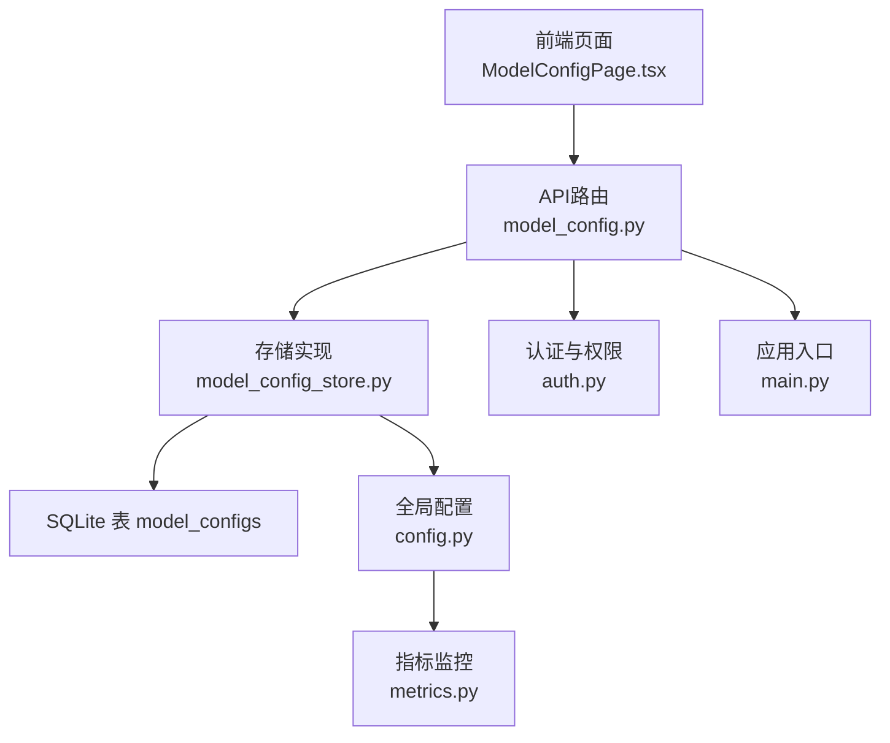
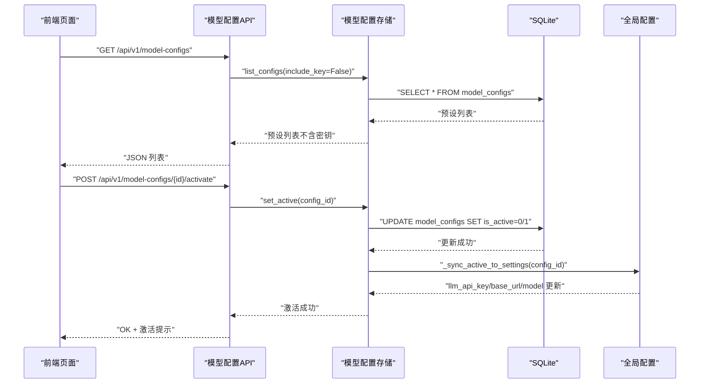
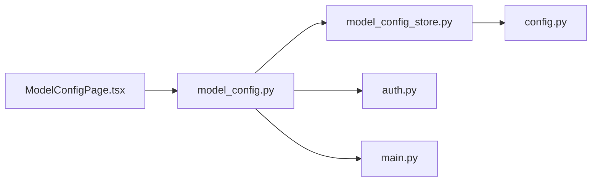

# 模型配置接口

<cite>
**本文引用的文件**
- [backend/app/api/model_config.py](file://backend/app/api/model_config.py)
- [backend/app/storage/model_config_store.py](file://backend/app/storage/model_config_store.py)
- [backend/app/config.py](file://backend/app/config.py)
- [backend/app/main.py](file://backend/app/main.py)
- [backend/app/core/auth.py](file://backend/app/core/auth.py)
- [frontend/src/pages/ModelConfigPage.tsx](file://frontend/src/pages/ModelConfigPage.tsx)
- [backend/app/core/metrics.py](file://backend/app/core/metrics.py)
- [backend/app/storage/agent_config_store.py](file://backend/app/storage/agent_config_store.py)
</cite>

## 目录
1. [简介](#简介)
2. [项目结构](#项目结构)
3. [核心组件](#核心组件)
4. [架构总览](#架构总览)
5. [详细组件分析](#详细组件分析)
6. [依赖分析](#依赖分析)
7. [性能考虑](#性能考虑)
8. [故障排除指南](#故障排除指南)
9. [结论](#结论)
10. [附录](#附录)

## 简介
本文件为“模型配置接口”的完整API文档，聚焦于大模型服务提供商的配置管理、API密钥管理、模型参数调整、多供应商支持与切换机制、性能监控指标、配置验证与热更新、回滚策略、模型选择策略、成本控制与质量评估方法，并提供配置模板、最佳实践与故障排除指南。该系统支持管理员维度的模型预设管理与激活，普通用户仅能查看已激活配置；激活后配置通过热更新同步至全局设置，实现即时生效。

## 项目结构
模型配置接口位于后端FastAPI应用中，采用“API层-存储层-配置层”分层设计：
- API层：提供REST接口，负责请求/响应模型、权限校验与路由转发。
- 存储层：SQLite持久化模型预设，提供CRUD与激活逻辑。
- 配置层：全局settings对象，支持热重载与多供应商参数覆盖。

图表来源
- [backend/app/api/model_config.py:1-173](file://backend/app/api/model_config.py#L1-L173)
- [backend/app/storage/model_config_store.py:1-174](file://backend/app/storage/model_config_store.py#L1-L174)
- [backend/app/config.py:1-183](file://backend/app/config.py#L1-L183)
- [backend/app/main.py:1-78](file://backend/app/main.py#L1-L78)
- [frontend/src/pages/ModelConfigPage.tsx:1-441](file://frontend/src/pages/ModelConfigPage.tsx#L1-L441)

章节来源
- [backend/app/api/model_config.py:1-173](file://backend/app/api/model_config.py#L1-L173)
- [backend/app/storage/model_config_store.py:1-174](file://backend/app/storage/model_config_store.py#L1-L174)
- [backend/app/config.py:1-183](file://backend/app/config.py#L1-L183)
- [backend/app/main.py:1-78](file://backend/app/main.py#L1-L78)
- [frontend/src/pages/ModelConfigPage.tsx:1-441](file://frontend/src/pages/ModelConfigPage.tsx#L1-L441)

## 核心组件
- 模型配置API路由：提供列表、详情、创建、更新、删除、激活等端点，响应模型包含遮蔽后的API Key展示字段。
- 模型配置存储：提供CRUD与激活逻辑，保证同一时刻仅有一条激活配置；激活时同步更新全局settings，实现热重载。
- 全局配置settings：集中管理LLM API Key、Base URL、模型名称等参数，支持多供应商参数覆盖。
- 认证与权限：基于JWT的用户解析与管理员权限校验，确保配置变更仅管理员可操作。
- 前端页面：提供模型预设的可视化管理界面，支持新建、编辑、激活、删除与后端连通性测试。

章节来源
- [backend/app/api/model_config.py:62-151](file://backend/app/api/model_config.py#L62-L151)
- [backend/app/storage/model_config_store.py:52-174](file://backend/app/storage/model_config_store.py#L52-L174)
- [backend/app/config.py:125-143](file://backend/app/config.py#L125-L143)
- [backend/app/core/auth.py:41-60](file://backend/app/core/auth.py#L41-L60)
- [frontend/src/pages/ModelConfigPage.tsx:55-198](file://frontend/src/pages/ModelConfigPage.tsx#L55-L198)

## 架构总览
模型配置接口的调用链路如下：

图表来源
- [backend/app/api/model_config.py:62-151](file://backend/app/api/model_config.py#L62-L151)
- [backend/app/storage/model_config_store.py:118-156](file://backend/app/storage/model_config_store.py#L118-L156)
- [backend/app/config.py:136-143](file://backend/app/config.py#L136-L143)

## 详细组件分析

### API层：模型配置接口
- 端点概览
  - GET /api/v1/model-configs：列出所有预设（不含密钥）
  - GET /api/v1/model-configs/active：获取当前激活配置（含完整API Key）
  - POST /api/v1/model-configs：新建预设（管理员）
  - PUT /api/v1/model-configs/{id}：更新预设（管理员）
  - DELETE /api/v1/model-configs/{id}：删除预设（管理员）
  - POST /api/v1/model-configs/{id}/activate：激活预设（管理员）

- 请求/响应模型
  - ModelConfigRequest：包含名称、API Key、Base URL、模型名、采样参数与嵌入模型等
  - ModelConfigResponse：返回预设信息，包含遮蔽后的API Key
  - ActiveConfigResponse：返回激活配置的完整信息（含API Key）

- 权限控制
  - 列表与激活读取：普通用户可访问
  - 新建/更新/删除/激活：仅管理员可用

章节来源
- [backend/app/api/model_config.py:21-58](file://backend/app/api/model_config.py#L21-L58)
- [backend/app/api/model_config.py:62-151](file://backend/app/api/model_config.py#L62-L151)
- [backend/app/core/auth.py:55-60](file://backend/app/core/auth.py#L55-L60)

### 存储层：模型配置持久化
- 表结构与约束
  - model_configs：包含id、name、api_key、base_url、model、temperature、top_p、max_tokens、embed_model、is_active、created_at、updated_at
  - is_active：全局唯一激活标志，激活某条时会将其他记录置为非激活

- 核心功能
  - list_configs：支持隐藏密钥返回
  - get_active_config：返回当前激活配置（含完整密钥）
  - upsert_config：新建或更新预设
  - set_active：激活指定预设并同步至全局settings
  - delete_config：删除预设
  - init_default_config_if_empty：启动时从settings导入默认配置

- 热更新机制
  - set_active后调用_sync_active_to_settings，将激活配置写入全局settings，实现即时生效

章节来源
- [backend/app/storage/model_config_store.py:20-47](file://backend/app/storage/model_config_store.py#L20-L47)
- [backend/app/storage/model_config_store.py:52-174](file://backend/app/storage/model_config_store.py#L52-L174)

### 配置层：全局settings与多供应商支持
- 多供应商参数覆盖
  - llm_api_key与openrouter_api_key：llm_api_key优先
  - llm_base_url与openrouter_base_url：llm_base_url优先
  - active_llm_api_key/active_llm_base_url：属性方法返回当前有效值

- 热重载实现
  - set_active时同步更新settings.llm_api_key、settings.llm_base_url、settings.llm_model
  - NLU客户端在_key不匹配时重建，确保参数即时生效

章节来源
- [backend/app/config.py:125-143](file://backend/app/config.py#L125-L143)
- [backend/app/storage/model_config_store.py:143-156](file://backend/app/storage/model_config_store.py#L143-L156)

### 前端集成：模型配置页面
- 功能特性
  - 预设列表展示与选择
  - 新建/编辑表单（管理员）
  - 激活、删除按钮（管理员）
  - 后端连通性测试（/api/v1/health）
  - 遮蔽显示API Key（仅管理员可见完整Key）

- 交互流程
  - 选择预设后拉取激活配置（含完整Key）
  - 保存时根据是否新建走不同路由
  - 激活后刷新列表状态

章节来源
- [frontend/src/pages/ModelConfigPage.tsx:55-198](file://frontend/src/pages/ModelConfigPage.tsx#L55-L198)

### 性能监控与质量评估
- 指标监控
  - dashboard聚合：产品总数、风险分布、最近预警、活跃市场、健康分、趋势
  - 健康分算法：综合产品数量、高风险产品、无HS编码、待处理高危预警、近期合规检查次数
  - 趋势统计：近30天合规检查次数

- 质量评估
  - 风险评分：基于HS编码、认证要求、风险提示、物流提示等维度计算0-100分
  - 风险等级映射：>=70高风险，>=40中风险，否则低风险

章节来源
- [backend/app/core/metrics.py:20-176](file://backend/app/core/metrics.py#L20-L176)

### 模型切换机制与回滚策略
- 切换机制
  - set_active原子更新：先清零其余记录，再将目标置为激活
  - 热重载：同步settings，NLU客户端下次调用重建
  - 幂等性：重复激活同一条记录不会产生副作用

- 回滚策略
  - 当前实现：无自动回滚，可通过再次激活上一版本预设实现“手动回滚”
  - 建议：在生产环境保留至少两条最近预设，避免误操作导致不可逆

章节来源
- [backend/app/storage/model_config_store.py:118-132](file://backend/app/storage/model_config_store.py#L118-L132)

### 配置验证与参数校验
- 请求参数
  - temperature、top_p、max_tokens等具备默认值，前端表单进行基础数值校验
- 存储层约束
  - SQLite列类型约束与默认值保证数据一致性
- 运行时校验
  - 激活前检查config_id是否存在
  - 前端测试连接调用后端健康检查端点

章节来源
- [backend/app/api/model_config.py:36-44](file://backend/app/api/model_config.py#L36-L44)
- [backend/app/storage/model_config_store.py:122-128](file://backend/app/storage/model_config_store.py#L122-L128)
- [frontend/src/pages/ModelConfigPage.tsx:186-198](file://frontend/src/pages/ModelConfigPage.tsx#L186-L198)

### 成本控制与模型选择策略
- 成本控制
  - 通过切换不同供应商与模型组合，结合max_tokens与temperature等参数控制调用成本
  - 建议：在测试环境使用较低cost模型，在生产环境使用更高可靠性的模型
- 模型选择策略
  - 依据任务类型与SLA要求选择合适供应商与模型
  - 通过预设管理快速切换与对比效果

章节来源
- [backend/app/config.py:125-143](file://backend/app/config.py#L125-L143)
- [backend/app/api/model_config.py:36-44](file://backend/app/api/model_config.py#L36-L44)

## 依赖分析
- 组件耦合
  - API层依赖存储层与认证模块
  - 存储层依赖SQLite与全局settings
  - 前端依赖API层提供的REST接口
- 外部依赖
  - FastAPI、Pydantic、JWT库、SQLite

图表来源
- [backend/app/api/model_config.py:1-173](file://backend/app/api/model_config.py#L1-L173)
- [backend/app/storage/model_config_store.py:1-174](file://backend/app/storage/model_config_store.py#L1-L174)
- [backend/app/config.py:1-183](file://backend/app/config.py#L1-L183)
- [backend/app/main.py:1-78](file://backend/app/main.py#L1-L78)
- [frontend/src/pages/ModelConfigPage.tsx:1-441](file://frontend/src/pages/ModelConfigPage.tsx#L1-L441)

## 性能考虑
- 热重载延迟：激活后settings更新立即生效，但部分组件可能在下一次调用时重建客户端
- 查询性能：SQLite在小规模预设场景性能良好；若预设数量增长，建议增加索引或迁移至更高效存储
- 并发安全：激活操作为原子更新，避免竞态条件
- 前端渲染：列表与表单交互流畅，建议在大数据量时启用虚拟滚动与懒加载

## 故障排除指南
- 无法激活预设
  - 检查config_id是否存在
  - 确认管理员权限
- API Key显示异常
  - 非激活预设仅显示遮蔽Key；激活预设才返回完整Key
- 后端连接失败
  - 前端点击“测试后端连接”，检查/health端点返回
- 配置未生效
  - 确认已激活新预设
  - 检查settings是否正确同步（可通过重启服务验证）

章节来源
- [backend/app/storage/model_config_store.py:122-132](file://backend/app/storage/model_config_store.py#L122-L132)
- [frontend/src/pages/ModelConfigPage.tsx:70-104](file://frontend/src/pages/ModelConfigPage.tsx#L70-L104)
- [backend/app/main.py:35-37](file://backend/app/main.py#L35-L37)

## 结论
模型配置接口提供了完善的多供应商支持、参数管理与热更新能力，配合管理员权限与前端可视化界面，实现了从配置创建、切换到监控评估的闭环。建议在生产环境中保留历史预设以便回滚，并结合成本与质量策略制定模型选择与参数调优规范。

## 附录

### API定义与示例
- 获取所有预设
  - 方法：GET
  - 路径：/api/v1/model-configs
  - 权限：用户
  - 响应：预设数组（不含密钥）
- 获取当前激活配置
  - 方法：GET
  - 路径：/api/v1/model-configs/active
  - 权限：用户
  - 响应：激活配置（含完整API Key）
- 新建预设（管理员）
  - 方法：POST
  - 路径：/api/v1/model-configs
  - 请求体：ModelConfigRequest
  - 响应：ModelConfigResponse
- 更新预设（管理员）
  - 方法：PUT
  - 路径：/api/v1/model-configs/{id}
  - 请求体：ModelConfigRequest
  - 响应：ModelConfigResponse
- 删除预设（管理员）
  - 方法：DELETE
  - 路径：/api/v1/model-configs/{id}
  - 响应：{"ok": true}
- 激活预设（管理员）
  - 方法：POST
  - 路径：/api/v1/model-configs/{id}/activate
  - 响应：{"ok": true, "message": "..."}

章节来源
- [backend/app/api/model_config.py:62-151](file://backend/app/api/model_config.py#L62-L151)

### 配置模板与最佳实践
- 配置模板字段
  - 名称、API Key、Base URL、模型名、temperature、top_p、max_tokens、embed_model
- 最佳实践
  - 为每个供应商维护独立预设，便于切换与成本对比
  - 在测试环境使用较低cost模型，生产环境使用高可靠模型
  - 保留至少两条最近预设，支持快速回滚
  - 定期评估健康分与风险分布，优化参数与供应商选择

章节来源
- [backend/app/api/model_config.py:36-44](file://backend/app/api/model_config.py#L36-L44)
- [backend/app/core/metrics.py:112-143](file://backend/app/core/metrics.py#L112-L143)