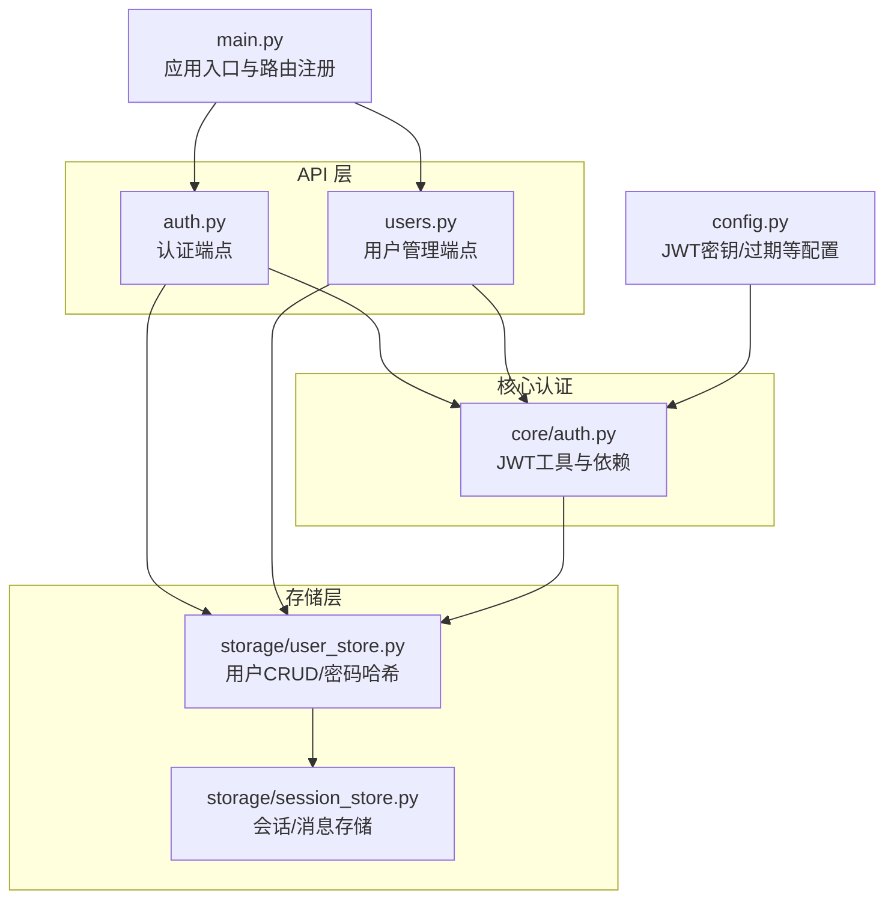
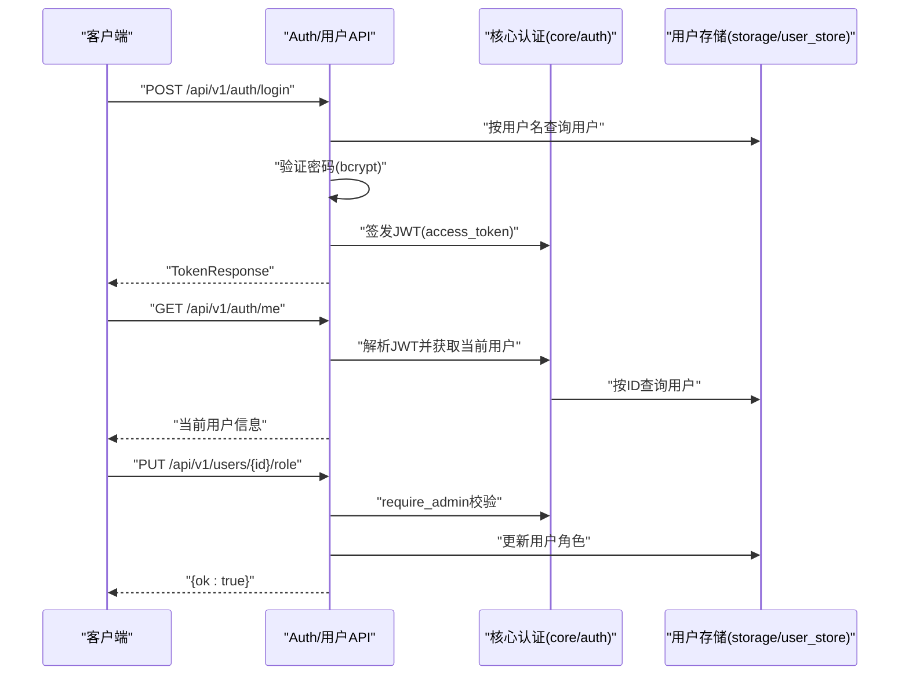
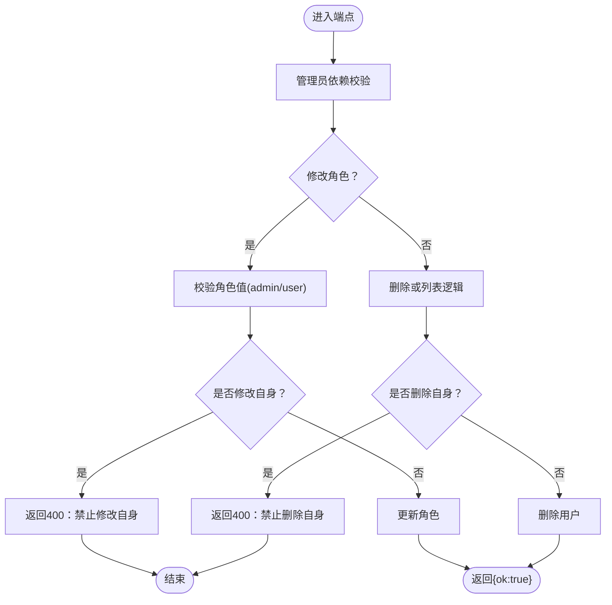
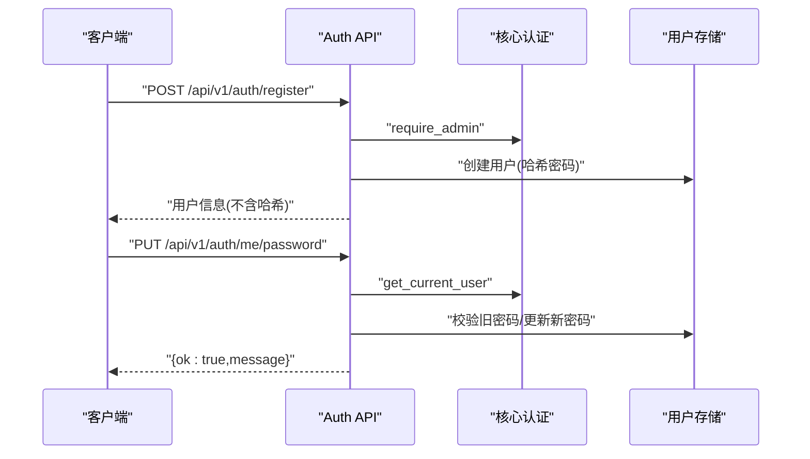
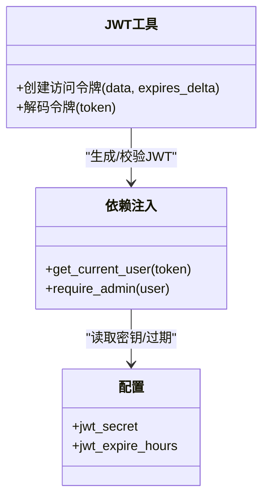
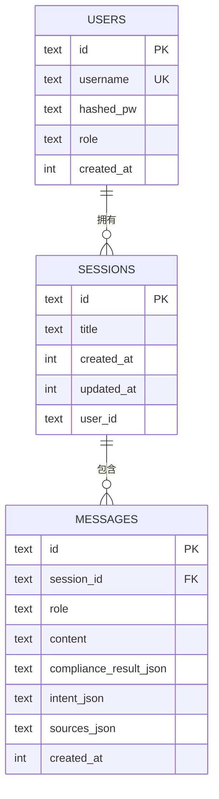
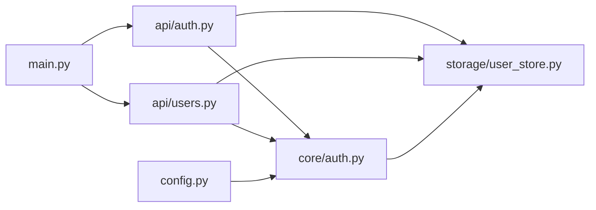

# 用户管理接口

<cite>
**本文引用的文件**
- [backend/app/api/users.py](file://backend/app/api/users.py)
- [backend/app/api/auth.py](file://backend/app/api/auth.py)
- [backend/app/core/auth.py](file://backend/app/core/auth.py)
- [backend/app/storage/user_store.py](file://backend/app/storage/user_store.py)
- [backend/app/storage/session_store.py](file://backend/app/storage/session_store.py)
- [backend/app/main.py](file://backend/app/main.py)
- [backend/app/config.py](file://backend/app/config.py)
- [backend/requirements.txt](file://backend/requirements.txt)
</cite>

## 目录
1. [简介](#简介)
2. [项目结构](#项目结构)
3. [核心组件](#核心组件)
4. [架构总览](#架构总览)
5. [详细组件分析](#详细组件分析)
6. [依赖分析](#依赖分析)
7. [性能考虑](#性能考虑)
8. [故障排查指南](#故障排查指南)
9. [结论](#结论)
10. [附录](#附录)

## 简介
本文件面向“用户管理接口”的完整API文档，聚焦以下能力：
- 用户信息管理：用户列表、删除、角色变更
- 权限控制与RBAC：基于JWT的认证、管理员专用端点
- 用户生命周期：登录、注册、当前用户信息、修改密码
- 安全与隐私：密码哈希、JWT密钥与过期策略
- 状态与账户：默认管理员初始化、会话与消息存储
- 批量与导入导出：当前实现以单用户CRUD为主，未提供批量导入导出端点
- API限流：当前仓库未实现限流中间件或装饰器

## 项目结构
后端采用FastAPI应用，路由按功能模块划分，用户管理相关模块如下：
- API层：用户管理端点与认证端点
- 核心认证：JWT生成与校验、依赖注入
- 存储层：SQLite用户表、会话与消息存储

图表来源
- [backend/app/main.py:1-78](file://backend/app/main.py#L1-L78)
- [backend/app/api/users.py:1-55](file://backend/app/api/users.py#L1-L55)
- [backend/app/api/auth.py:1-108](file://backend/app/api/auth.py#L1-L108)
- [backend/app/core/auth.py:1-60](file://backend/app/core/auth.py#L1-L60)
- [backend/app/storage/user_store.py:1-133](file://backend/app/storage/user_store.py#L1-L133)
- [backend/app/storage/session_store.py:1-251](file://backend/app/storage/session_store.py#L1-L251)
- [backend/app/config.py:173-176](file://backend/app/config.py#L173-L176)

章节来源
- [backend/app/main.py:1-78](file://backend/app/main.py#L1-L78)
- [backend/app/api/users.py:1-55](file://backend/app/api/users.py#L1-L55)
- [backend/app/api/auth.py:1-108](file://backend/app/api/auth.py#L1-L108)
- [backend/app/core/auth.py:1-60](file://backend/app/core/auth.py#L1-L60)
- [backend/app/storage/user_store.py:1-133](file://backend/app/storage/user_store.py#L1-L133)
- [backend/app/storage/session_store.py:1-251](file://backend/app/storage/session_store.py#L1-L251)
- [backend/app/config.py:173-176](file://backend/app/config.py#L173-L176)

## 核心组件
- 用户管理API（仅管理员）
  - 获取用户列表
  - 删除用户（禁止删除自身）
  - 修改用户角色（admin/user）
- 认证API（通用）
  - 登录（用户名+密码）
  - 注册（仅管理员）
  - 当前用户信息
  - 修改密码
- 核心认证
  - JWT生成与校验
  - 当前用户解析
  - 管理员依赖校验
- 存储
  - 用户表：id、username、hashed_pw、role、created_at
  - 密码哈希：bcrypt
  - 默认管理员初始化

章节来源
- [backend/app/api/users.py:23-54](file://backend/app/api/users.py#L23-L54)
- [backend/app/api/auth.py:54-107](file://backend/app/api/auth.py#L54-L107)
- [backend/app/core/auth.py:19-59](file://backend/app/core/auth.py#L19-L59)
- [backend/app/storage/user_store.py:22-133](file://backend/app/storage/user_store.py#L22-L133)

## 架构总览
用户管理与认证的整体调用链如下：

图表来源
- [backend/app/api/auth.py:54-94](file://backend/app/api/auth.py#L54-L94)
- [backend/app/api/users.py:41-54](file://backend/app/api/users.py#L41-L54)
- [backend/app/core/auth.py:41-59](file://backend/app/core/auth.py#L41-L59)
- [backend/app/storage/user_store.py:68-110](file://backend/app/storage/user_store.py#L68-L110)

## 详细组件分析

### 用户管理API（仅管理员）
- 端点概览
  - GET /api/v1/users：列出所有用户
  - DELETE /api/v1/users/{user_id}：删除用户（禁止删除自身）
  - PUT /api/v1/users/{user_id}/role：修改用户角色（admin/user）

- 关键行为
  - 管理员依赖：所有端点均依赖管理员校验
  - 自身保护：禁止删除或修改自身角色
  - 错误处理：用户不存在返回404，非法角色返回400

图表来源
- [backend/app/api/users.py:23-54](file://backend/app/api/users.py#L23-L54)

章节来源
- [backend/app/api/users.py:23-54](file://backend/app/api/users.py#L23-L54)

### 认证与当前用户API
- 端点概览
  - POST /api/v1/auth/login：登录获取JWT
  - POST /api/v1/auth/register：注册用户（仅管理员）
  - GET /api/v1/auth/me：获取当前用户信息
  - PUT /api/v1/auth/me/password：修改当前用户密码

- 关键行为
  - 登录：校验用户名与密码，签发JWT
  - 注册：仅管理员可用，校验角色值
  - 当前用户：解析JWT，查询用户信息
  - 修改密码：校验旧密码长度，更新新密码

图表来源
- [backend/app/api/auth.py:81-107](file://backend/app/api/auth.py#L81-L107)
- [backend/app/core/auth.py:41-52](file://backend/app/core/auth.py#L41-L52)
- [backend/app/storage/user_store.py:48-119](file://backend/app/storage/user_store.py#L48-L119)

章节来源
- [backend/app/api/auth.py:54-107](file://backend/app/api/auth.py#L54-L107)
- [backend/app/core/auth.py:19-59](file://backend/app/core/auth.py#L19-L59)
- [backend/app/storage/user_store.py:38-119](file://backend/app/storage/user_store.py#L38-L119)

### 核心认证与依赖
- JWT工具
  - HS256算法，密钥与过期小时数来自配置
  - 生成access_token，携带用户sub
  - 解析并校验token，返回用户字典
- 依赖注入
  - get_current_user：解析token并查询用户
  - require_admin：仅管理员可访问

图表来源
- [backend/app/core/auth.py:19-59](file://backend/app/core/auth.py#L19-L59)
- [backend/app/config.py:173-176](file://backend/app/config.py#L173-L176)

章节来源
- [backend/app/core/auth.py:19-59](file://backend/app/core/auth.py#L19-L59)
- [backend/app/config.py:173-176](file://backend/app/config.py#L173-L176)

### 存储层（用户与会话）
- 用户存储
  - 表结构：id、username（唯一）、hashed_pw、role、created_at
  - 密码哈希：bcrypt
  - 默认管理员初始化：若表为空，创建默认admin/admin123
- 会话与消息存储
  - sessions表与messages表，支持按用户过滤、最近消息查询
  - 会话删除级联删除消息

图表来源
- [backend/app/storage/user_store.py:22-33](file://backend/app/storage/user_store.py#L22-L33)
- [backend/app/storage/session_store.py:37-62](file://backend/app/storage/session_store.py#L37-L62)

章节来源
- [backend/app/storage/user_store.py:22-133](file://backend/app/storage/user_store.py#L22-L133)
- [backend/app/storage/session_store.py:37-251](file://backend/app/storage/session_store.py#L37-L251)

## 依赖分析
- 模块耦合
  - API层依赖核心认证与存储层
  - 核心认证依赖配置与存储层
  - 应用入口统一注册路由
- 外部依赖
  - FastAPI、Pydantic、passlib(crypt上下文)、jose(jwt)
  - SQLite（内置）

图表来源
- [backend/app/api/auth.py:1-108](file://backend/app/api/auth.py#L1-L108)
- [backend/app/api/users.py:1-55](file://backend/app/api/users.py#L1-L55)
- [backend/app/core/auth.py:1-60](file://backend/app/core/auth.py#L1-L60)
- [backend/app/storage/user_store.py:1-133](file://backend/app/storage/user_store.py#L1-L133)
- [backend/app/main.py:1-78](file://backend/app/main.py#L1-L78)
- [backend/app/config.py:1-183](file://backend/app/config.py#L1-L183)

章节来源
- [backend/app/api/auth.py:1-108](file://backend/app/api/auth.py#L1-L108)
- [backend/app/api/users.py:1-55](file://backend/app/api/users.py#L1-L55)
- [backend/app/core/auth.py:1-60](file://backend/app/core/auth.py#L1-L60)
- [backend/app/storage/user_store.py:1-133](file://backend/app/storage/user_store.py#L1-L133)
- [backend/app/main.py:1-78](file://backend/app/main.py#L1-L78)
- [backend/app/config.py:1-183](file://backend/app/config.py#L1-L183)
- [backend/requirements.txt:1-28](file://backend/requirements.txt#L1-L28)

## 性能考虑
- 数据库
  - 用户表与会话表均为轻量级，无复杂索引，适合小规模部署
  - 会话消息查询按会话ID与时间排序，具备基础索引
- 认证
  - bcrypt哈希成本适中，满足一般场景
  - JWT解码与用户查询为O(1)级别
- 建议
  - 生产环境建议引入连接池与缓存
  - 合理设置JWT过期时间，平衡安全与体验

## 故障排查指南
- 登录失败
  - 检查用户名是否存在与密码是否正确
  - 确认JWT密钥与过期配置
- 无权限
  - 确认当前用户角色为admin
  - 检查管理员依赖是否生效
- 用户不存在
  - 查询用户ID或用户名是否正确
  - 检查数据库初始化与默认管理员创建
- 自身操作被拒
  - 删除或修改自身角色会被拒绝
- 密码修改失败
  - 确认旧密码正确且新密码长度符合要求

章节来源
- [backend/app/api/auth.py:54-107](file://backend/app/api/auth.py#L54-L107)
- [backend/app/api/users.py:23-54](file://backend/app/api/users.py#L23-L54)
- [backend/app/core/auth.py:41-59](file://backend/app/core/auth.py#L41-L59)
- [backend/app/storage/user_store.py:122-133](file://backend/app/storage/user_store.py#L122-L133)

## 结论
- 本项目实现了最小可用的用户管理与认证体系：JWT认证、管理员RBAC、用户CRUD与密码管理
- 安全方面采用bcrypt与JWT，配置可调
- 当前未提供批量导入导出与API限流，可在后续版本扩展

## 附录

### API定义与示例路径
- 登录
  - 方法与路径：POST /api/v1/auth/login
  - 请求体：用户名与密码
  - 返回：access_token、token_type、role、username、user_id
  - 示例路径：[backend/app/api/auth.py:54-68](file://backend/app/api/auth.py#L54-L68)
- 注册（管理员）
  - 方法与路径：POST /api/v1/auth/register
  - 请求体：用户名、密码、角色
  - 返回：用户信息（不含哈希）
  - 示例路径：[backend/app/api/auth.py:81-89](file://backend/app/api/auth.py#L81-L89)
- 当前用户
  - 方法与路径：GET /api/v1/auth/me
  - 返回：用户信息
  - 示例路径：[backend/app/api/auth.py:92-94](file://backend/app/api/auth.py#L92-L94)
- 修改密码
  - 方法与路径：PUT /api/v1/auth/me/password
  - 请求体：旧密码、新密码
  - 返回：操作结果
  - 示例路径：[backend/app/api/auth.py:97-107](file://backend/app/api/auth.py#L97-L107)
- 获取用户列表（管理员）
  - 方法与路径：GET /api/v1/users
  - 返回：用户信息数组
  - 示例路径：[backend/app/api/users.py:23-25](file://backend/app/api/users.py#L23-L25)
- 删除用户（管理员）
  - 方法与路径：DELETE /api/v1/users/{user_id}
  - 返回：操作结果
  - 示例路径：[backend/app/api/users.py:28-38](file://backend/app/api/users.py#L28-L38)
- 修改用户角色（管理员）
  - 方法与路径：PUT /api/v1/users/{user_id}/role
  - 请求体：角色
  - 返回：操作结果
  - 示例路径：[backend/app/api/users.py:41-54](file://backend/app/api/users.py#L41-L54)

### RBAC与权限模型
- 角色
  - admin：管理员，可访问用户管理端点
  - user：普通用户，仅可访问认证相关端点
- 依赖
  - require_admin：强制管理员身份
  - get_current_user：解析JWT并获取用户

章节来源
- [backend/app/api/users.py:4-7](file://backend/app/api/users.py#L4-L7)
- [backend/app/api/auth.py:8,14:8-14](file://backend/app/api/auth.py#L8-L14)
- [backend/app/core/auth.py:55-59](file://backend/app/core/auth.py#L55-L59)

### 安全与隐私要点
- 密码存储：bcrypt哈希，不存储明文
- JWT配置：密钥与过期时间可配置
- 默认管理员：首次启动自动创建，需立即修改密码

章节来源
- [backend/app/storage/user_store.py:38-43](file://backend/app/storage/user_store.py#L38-L43)
- [backend/app/config.py:173-176](file://backend/app/config.py#L173-L176)
- [backend/app/storage/user_store.py:122-133](file://backend/app/storage/user_store.py#L122-L133)

### 审计日志与合规
- 当前仓库未提供审计日志实现
- 建议在核心认证与用户管理端点增加操作日志记录（如用户ID、时间、IP、操作类型）

### 批量操作与导入导出
- 当前未提供批量导入导出端点
- 若需扩展，可在现有用户CRUD基础上增加批量写入与导出任务队列

### API限流
- 当前未实现限流中间件或装饰器
- 建议在生产环境引入速率限制（如基于IP或用户ID）