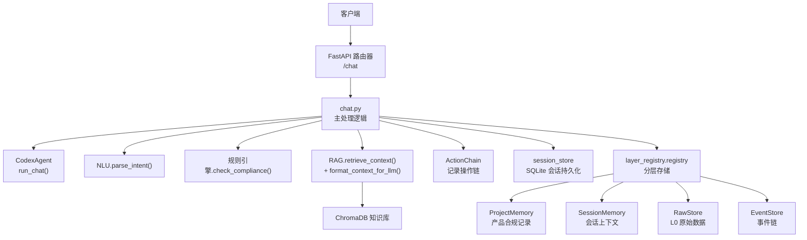
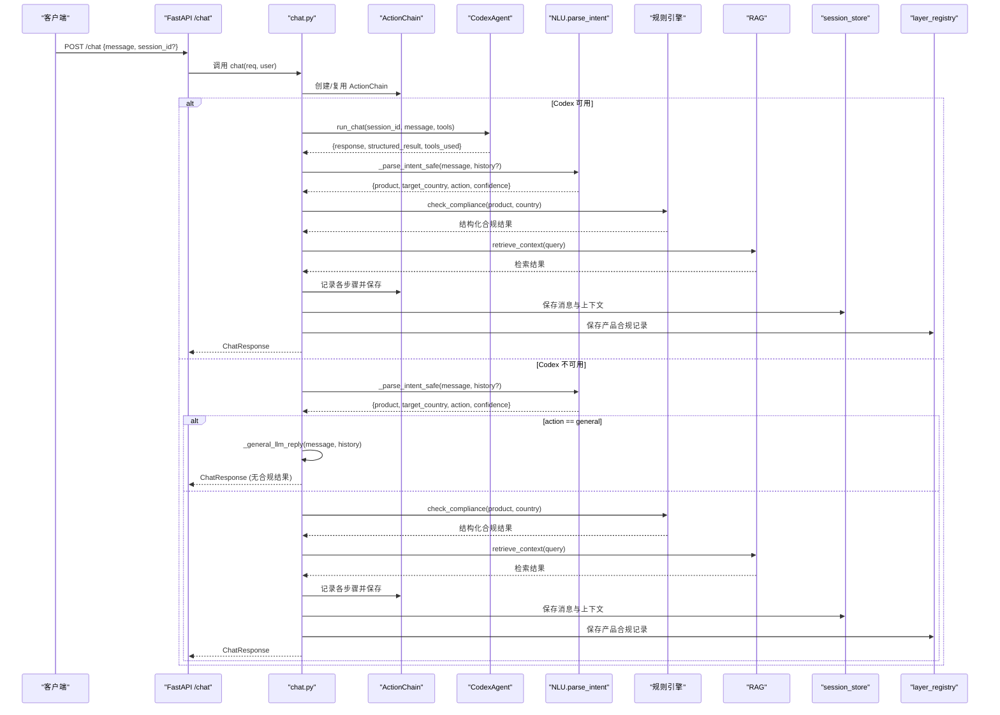
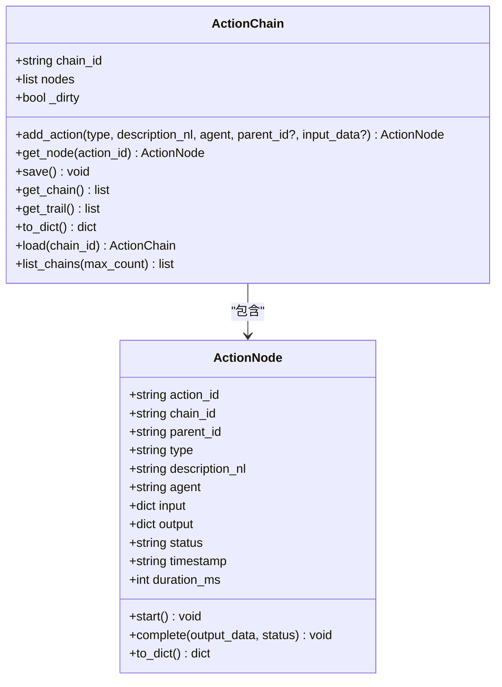
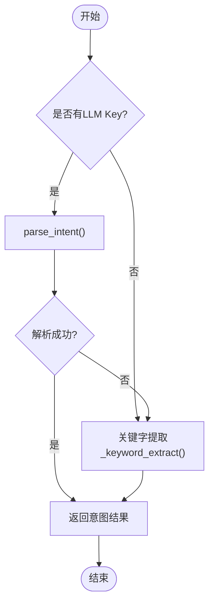
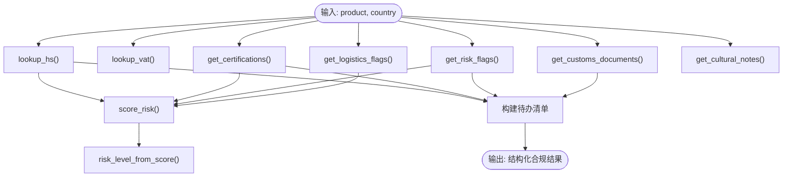
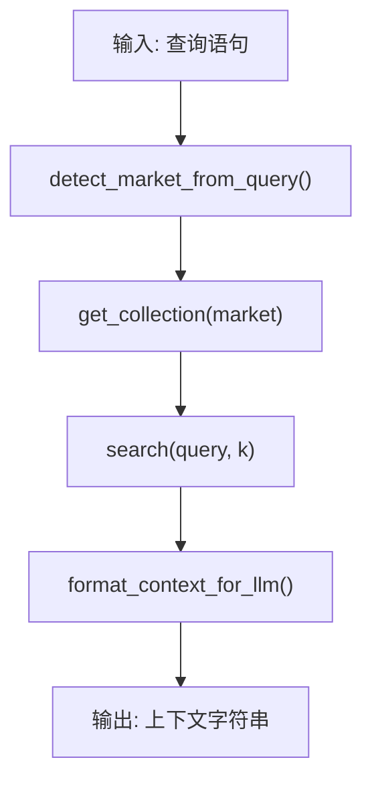
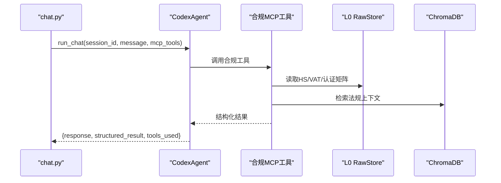
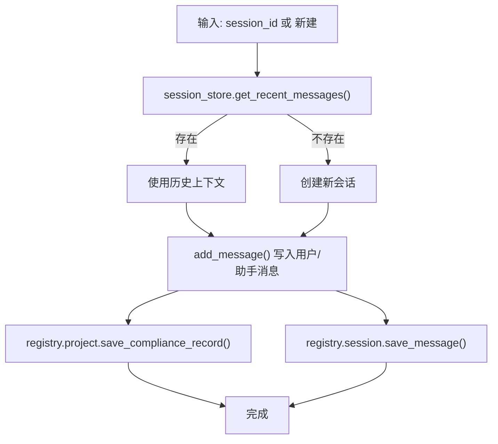
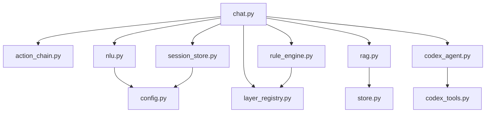

# 聊天接口

<cite>
**本文引用的文件**
- [chat.py](file://backend/app/api/chat.py)
- [action_chain.py](file://backend/app/core/action_chain.py)
- [nlu.py](file://backend/app/core/nlu.py)
- [rag.py](file://backend/app/core/rag.py)
- [codex_agent.py](file://backend/app/services/codex_agent.py)
- [schemas.py](file://backend/app/models/schemas.py)
- [session_store.py](file://backend/app/storage/session_store.py)
- [rule_engine.py](file://backend/app/core/rule_engine.py)
- [codex_tools.py](file://backend/app/services/codex_tools.py)
- [store.py](file://backend/app/knowledge/store.py)
- [config.py](file://backend/app/config.py)
- [layer_registry.py](file://backend/app/storage/layer_registry.py)
- [sessions.py](file://backend/app/api/sessions.py)
</cite>

## 目录
1. [简介](#简介)
2. [项目结构](#项目结构)
3. [核心组件](#核心组件)
4. [架构总览](#架构总览)
5. [详细组件分析](#详细组件分析)
6. [依赖分析](#依赖分析)
7. [性能考虑](#性能考虑)
8. [故障排查指南](#故障排查指南)
9. [结论](#结论)
10. [附录](#附录)

## 简介
本文件为“聊天接口”的详细API文档，聚焦HTTP POST /chat端点，阐述合规问答的完整处理流程。系统采用双路径设计：
- 主路径：Codex Agent驱动的智能处理管线（skills + MCP工具 + 联网搜索），并行执行规则引擎，随后RAG检索法规知识库，最终组装结构化合规报告。
- 降级路径：当Codex不可用时，自动切换至NLU → 规则引擎 → RAG组合，保证基本合规查询能力。

此外，文档还解释了ActionChain操作链追踪机制、自然语言理解的意图识别过程、产品与目标市场的提取逻辑、合规检查的多阶段处理流程、错误处理策略、会话管理机制与内存持久化功能，并提供请求/响应示例、状态码说明与性能优化建议。

## 项目结构
后端采用FastAPI框架，核心模块分布如下：
- API层：对外提供HTTP接口，负责路由与响应模型。
- 核心服务层：NLU、规则引擎、RAG、ActionChain等。
- 服务层：Codex Agent与合规工具（MCP）。
- 存储层：会话持久化、分层存储注册表、知识库向量存储。
- 配置层：统一配置管理。

图表来源
- [chat.py:205-541](file://backend/app/api/chat.py#L205-L541)
- [codex_agent.py:235-277](file://backend/app/services/codex_agent.py#L235-L277)
- [nlu.py:59-99](file://backend/app/core/nlu.py#L59-L99)
- [rule_engine.py:197-247](file://backend/app/core/rule_engine.py#L197-L247)
- [rag.py:10-59](file://backend/app/core/rag.py#L10-L59)
- [action_chain.py:77-236](file://backend/app/core/action_chain.py#L77-L236)
- [session_store.py:74-251](file://backend/app/storage/session_store.py#L74-L251)
- [layer_registry.py:23-45](file://backend/app/storage/layer_registry.py#L23-L45)
- [store.py:127-227](file://backend/app/knowledge/store.py#L127-L227)

章节来源
- [chat.py:1-541](file://backend/app/api/chat.py#L1-L541)
- [config.py:1-78](file://backend/app/config.py#L1-L78)

## 核心组件
- HTTP端点：POST /chat，接收ComplianceQuery，返回ChatResponse。
- ActionChain：记录每次对话的完整操作链，支持保存与回溯。
- NLU：基于LLM的意图解析，抽取产品、目标市场与动作类型。
- 规则引擎：基于L0原始数据的确定性合规检查，产出HS编码、VAT、认证、风险、物流、清关材料、文化注意事项、整改建议与待办清单。
- RAG：ChromaDB向量检索，格式化法规引用上下文。
- Codex Agent：Claude Agent SDK封装，提供skills + MCP工具 + 联网搜索能力。
- 会话存储：SQLite持久化，支持会话列表、详情、删除与消息读写。
- 分层存储：统一访问L0-L5层，便于扩展与维护。

章节来源
- [schemas.py:73-104](file://backend/app/models/schemas.py#L73-L104)
- [action_chain.py:77-236](file://backend/app/core/action_chain.py#L77-L236)
- [nlu.py:59-99](file://backend/app/core/nlu.py#L59-L99)
- [rule_engine.py:197-247](file://backend/app/core/rule_engine.py#L197-L247)
- [rag.py:10-59](file://backend/app/core/rag.py#L10-L59)
- [codex_agent.py:107-292](file://backend/app/services/codex_agent.py#L107-L292)
- [session_store.py:74-251](file://backend/app/storage/session_store.py#L74-L251)
- [layer_registry.py:23-45](file://backend/app/storage/layer_registry.py#L23-L45)

## 架构总览
下图展示了主路径与降级路径的端到端流程，以及各组件之间的交互关系。

图表来源
- [chat.py:228-541](file://backend/app/api/chat.py#L228-L541)
- [codex_agent.py:235-277](file://backend/app/services/codex_agent.py#L235-L277)
- [nlu.py:93-101](file://backend/app/core/nlu.py#L93-L101)
- [rule_engine.py:197-247](file://backend/app/core/rule_engine.py#L197-L247)
- [rag.py:10-59](file://backend/app/core/rag.py#L10-L59)
- [session_store.py:170-218](file://backend/app/storage/session_store.py#L170-L218)
- [layer_registry.py:23-45](file://backend/app/storage/layer_registry.py#L23-L45)

## 详细组件分析

### HTTP POST /chat 接口
- 请求体：ComplianceQuery
  - message: 用户自然语言消息（必填）
  - session_id: 会话ID（可选）
- 响应体：ChatResponse
  - message: 格式化的合规报告（Markdown）
  - compliance_result: 结构化合规结果（可选）
  - sources: 检索来源摘要（可选）
  - session_id: 会话ID（可选）
  - action_chain_id: 操作链ID（可选）
  - intent: NLU解析结果（透传前端展示）

- 状态码
  - 200：成功返回合规报告与结构化结果
  - 422：请求参数校验失败（例如缺少message字段）

- 认证
  - 可选Bearer Token；未携带则匿名访问

- 会话管理
  - 若传入session_id且有效，恢复最近N条消息作为多轮上下文
  - 若传入无效session_id，自动创建新会话
  - 无论主路径还是降级路径，均会将用户消息与助手回复持久化到SQLite

- 错误处理
  - Codex调用异常时自动降级到NLU → 规则引擎 → RAG
  - 规则引擎异常时返回空合规字典并标记
  - RAG无结果时返回空上下文，不影响主流程
  - 会话持久化失败不影响响应返回

章节来源
- [chat.py:205-227](file://backend/app/api/chat.py#L205-L227)
- [chat.py:228-541](file://backend/app/api/chat.py#L228-L541)
- [schemas.py:73-104](file://backend/app/models/schemas.py#L73-L104)
- [session_store.py:170-218](file://backend/app/storage/session_store.py#L170-L218)

### ActionChain 操作链追踪机制
- 作用：记录一次交互中每一步操作的自然语言描述、执行者、输入/输出、状态与耗时。
- 行为：
  - 添加节点：add_action(type, description_nl, agent, parent_id?, input_data?)
  - 开始/完成：start()/complete(output_data, status?)
  - 保存：save() → 本地JSON文件（按chain_id组织）
  - 加载：load(chain_id) → 重建链对象
  - 展示：get_trail() → 可读的步骤列表（含耗时与状态图标）
- 用途：前端可基于action_chain_id回溯完整决策链路，便于审计与调试。

图表来源
- [action_chain.py:23-236](file://backend/app/core/action_chain.py#L23-L236)

章节来源
- [action_chain.py:77-236](file://backend/app/core/action_chain.py#L77-L236)

### 自然语言理解（NLU）与意图识别
- 目的：从用户消息中抽取产品、目标市场、动作类型与置信度。
- 流程：
  - 优先使用LLM进行意图解析，返回严格JSON结构
  - 支持多轮上下文注入（最多6条），助手消息截断避免污染
  - 若无LLM Key或解析失败，退化为关键字提取（关键词匹配+启发式规则）
- 关键词提取（降级）：
  - 识别出口/合规相关关键词，提取国家与产品
  - 通用问题（无合规关键词）返回action=general

图表来源
- [chat.py:93-101](file://backend/app/api/chat.py#L93-L101)
- [nlu.py:59-99](file://backend/app/core/nlu.py#L59-L99)

章节来源
- [chat.py:58-101](file://backend/app/api/chat.py#L58-L101)
- [nlu.py:59-99](file://backend/app/core/nlu.py#L59-L99)

### 规则引擎：合规检查的多阶段处理
- 输入：产品名称、目标国家
- 输出：结构化合规结果（HS编码、品名描述、VAT、认证、风险等级/分数、风险提示、物流提示、清关材料、文化注意事项、整改建议、待办清单）
- 数据来源：L0原始数据（通过layer_registry.raw）
- 关键函数：
  - lookup_hs/product fuzzy match
  - lookup_vat/country
  - get_certifications/country
  - get_risk_flags/country+product
  - get_logistics_flags/country+product
  - get_customs_documents/country+product
  - get_cultural_notes/country+product
  - score_risk() → 量化风险分
  - risk_level_from_score() → 风险等级
  - build_remediation_steps() → 整改建议
  - check_compliance() → 主流程编排

图表来源
- [rule_engine.py:17-247](file://backend/app/core/rule_engine.py#L17-L247)
- [layer_registry.py:23-45](file://backend/app/storage/layer_registry.py#L23-L45)

章节来源
- [rule_engine.py:197-247](file://backend/app/core/rule_engine.py#L197-L247)
- [layer_registry.py:23-45](file://backend/app/storage/layer_registry.py#L23-L45)

### RAG：法规知识库检索与上下文格式化
- 检索：根据查询语义相似度在ChromaDB中检索相关法规片段
- 格式化：将检索结果格式化为带来源链接与生效日期的上下文字符串
- 降级：当知识库为空或查询失败时返回空结果，不影响主流程

图表来源
- [rag.py:10-59](file://backend/app/core/rag.py#L10-L59)
- [store.py:127-193](file://backend/app/knowledge/store.py#L127-L193)

章节来源
- [rag.py:10-59](file://backend/app/core/rag.py#L10-L59)
- [store.py:127-193](file://backend/app/knowledge/store.py#L127-L193)

### Codex Agent：智能处理管线
- 能力：skills + MCP工具 + 联网搜索 + 多步推理 + 文件操作
- 工具：合规MCP工具集合（HS查询、VAT查询、认证查询、风险评估、合规检查、法规检索、物流与文化提示）
- 会话：按session_id维持多轮上下文，支持关闭会话释放资源
- 降级：当SDK不可用或API Key缺失时，返回mock响应

图表来源
- [codex_agent.py:235-277](file://backend/app/services/codex_agent.py#L235-L277)
- [codex_tools.py:64-135](file://backend/app/services/codex_tools.py#L64-L135)
- [layer_registry.py:23-45](file://backend/app/storage/layer_registry.py#L23-L45)
- [store.py:127-193](file://backend/app/knowledge/store.py#L127-L193)

章节来源
- [codex_agent.py:107-292](file://backend/app/services/codex_agent.py#L107-L292)
- [codex_tools.py:64-135](file://backend/app/services/codex_tools.py#L64-L135)
- [layer_registry.py:23-45](file://backend/app/storage/layer_registry.py#L23-L45)

### 会话管理与内存持久化
- 会话存储：SQLite（sessions/messages表），支持会话列表、详情、删除与消息读写
- 多轮上下文：恢复最近N条消息（history），用于NLU与LLM上下文注入
- 消息持久化：用户消息与助手回复（含合规结果、意图、来源）均写入数据库
- 产品/项目记忆：按产品+国家维度保存合规记录，便于后续追溯
- 会话生命周期：按需创建/恢复，更新会话时间戳

图表来源
- [chat.py:184-203](file://backend/app/api/chat.py#L184-L203)
- [session_store.py:170-218](file://backend/app/storage/session_store.py#L170-L218)
- [layer_registry.py:23-45](file://backend/app/storage/layer_registry.py#L23-L45)

章节来源
- [chat.py:184-203](file://backend/app/api/chat.py#L184-L203)
- [session_store.py:170-218](file://backend/app/storage/session_store.py#L170-L218)
- [layer_registry.py:23-45](file://backend/app/storage/layer_registry.py#L23-L45)

## 依赖分析
- 组件耦合
  - chat.py对ActionChain、NLU、规则引擎、RAG、CodexAgent、会话存储与分层存储有直接依赖
  - CodexAgent依赖合规MCP工具与Claude SDK，工具依赖规则引擎与RAG
  - RAG依赖ChromaDB向量存储
  - 规则引擎依赖L0原始数据（通过layer_registry.raw）
- 外部依赖
  - OpenAI兼容客户端（用于NLU与通用LLM回复）
  - ChromaDB（向量检索）
  - SQLite（会话持久化）
  - Claude Agent SDK（可选，用于Codex能力）

图表来源
- [chat.py:14-26](file://backend/app/api/chat.py#L14-L26)
- [codex_agent.py:23-27](file://backend/app/services/codex_agent.py#L23-L27)
- [codex_tools.py:14-25](file://backend/app/services/codex_tools.py#L14-L25)
- [rag.py:7-8](file://backend/app/core/rag.py#L7-L8)
- [layer_registry.py:16-21](file://backend/app/storage/layer_registry.py#L16-L21)
- [config.py:5-78](file://backend/app/config.py#L5-L78)
- [session_store.py:19-22](file://backend/app/storage/session_store.py#L19-L22)

章节来源
- [chat.py:14-26](file://backend/app/api/chat.py#L14-L26)
- [codex_agent.py:23-27](file://backend/app/services/codex_agent.py#L23-L27)
- [codex_tools.py:14-25](file://backend/app/services/codex_tools.py#L14-L25)
- [rag.py:7-8](file://backend/app/core/rag.py#L7-L8)
- [layer_registry.py:16-21](file://backend/app/storage/layer_registry.py#L16-L21)
- [config.py:5-78](file://backend/app/config.py#L5-L78)
- [session_store.py:19-22](file://backend/app/storage/session_store.py#L19-L22)

## 性能考虑
- Codex优先：启用Claude Agent SDK可获得更强的多步推理与工具调用能力，但需关注API Key与网络延迟。
- NLU与LLM：通过禁用“思考模式”（llm_disable_thinking）降低响应延迟；合理设置temperature与max_tokens。
- RAG检索：top_k控制召回数量，避免过多上下文影响LLM效率；ChromaDB懒加载嵌入模型，首次查询会有冷启动开销。
- 会话与存储：SQLite写入为同步操作，建议在高并发场景下考虑异步写入或批量提交策略。
- ActionChain保存：仅在关键节点保存，避免频繁磁盘IO；JSON文件按chain_id组织，便于清理与审计。

## 故障排查指南
- Codex不可用
  - 现象：抛出异常后自动降级
  - 处理：检查claude-agent-sdk是否安装、ANTHROPIC_API_KEY是否配置、codex_enabled开关
- LLM Key缺失
  - 现象：NLU解析失败，退回关键字提取；通用LLM回复提示未配置Key
  - 处理：在配置中设置active_llm_api_key与active_llm_base_url
- RAG无结果
  - 现象：retrieve_context返回空，format_context_for_llm返回提示
  - 处理：确认知识库已初始化、ChromaDB可访问、查询语句包含产品与国家信息
- 会话异常
  - 现象：session_id无效或数据库异常
  - 处理：检查session_store初始化、数据库路径与权限；必要时删除无效会话
- ActionChain保存失败
  - 现象：操作链未落盘
  - 处理：检查data_dir与权限；不影响响应返回，但会丢失审计信息

章节来源
- [chat.py:251-264](file://backend/app/api/chat.py#L251-L264)
- [codex_agent.py:194-201](file://backend/app/services/codex_agent.py#L194-L201)
- [nlu.py:35-49](file://backend/app/core/nlu.py#L35-L49)
- [rag.py:16-18](file://backend/app/core/rag.py#L16-L18)
- [session_store.py:27-34](file://backend/app/storage/session_store.py#L27-L34)
- [action_chain.py:133-139](file://backend/app/core/action_chain.py#L133-L139)

## 结论
本聊天接口通过“Codex主路径 + NLU+规则引擎+RAG降级路径”的双轨设计，既满足高性能智能处理，又保障基础合规查询能力。ActionChain提供完整的操作链追踪，结合会话与产品记忆实现良好的用户体验与可审计性。通过合理的配置与优化策略，可在稳定性与性能之间取得平衡。

## 附录

### 请求/响应示例

- 请求（主路径）
  - 方法：POST
  - 路径：/chat
  - 头部：Authorization: Bearer <token>（可选）
  - 请求体：
    - message: "手机出口德国需要什么认证？"
    - session_id: "session_abc123"（可选）
  - 响应体：
    - message: 合规报告（Markdown）
    - compliance_result: 结构化合规结果
    - sources: 检索来源摘要
    - session_id: 会话ID
    - action_chain_id: 操作链ID
    - intent: NLU解析结果

- 请求（降级路径）
  - 当Codex不可用或NLU解析失败时，行为同上，但返回的message为通用LLM回复或结构化合规报告（取决于action类型）。

- 响应（通用LLM回复）
  - message: 引导提示或LLM回复
  - compliance_result: null
  - sources: []

章节来源
- [chat.py:205-227](file://backend/app/api/chat.py#L205-L227)
- [chat.py:381-413](file://backend/app/api/chat.py#L381-L413)
- [schemas.py:73-104](file://backend/app/models/schemas.py#L73-L104)

### 状态码说明
- 200：成功
- 422：请求参数校验失败（如缺少message字段）

章节来源
- [chat.py:223-227](file://backend/app/api/chat.py#L223-L227)

### 配置要点
- 主LLM配置：llm_api_key、llm_base_url、llm_model、llm_disable_thinking
- Codex配置：codex_enabled、anthropic_api_key、codex_model、codex_search_model、codex_cwd
- 数据目录：data_dir、chroma_persist_dir
- 会话与事件：scheduler_enabled、risk_alert_dir

章节来源
- [config.py:5-78](file://backend/app/config.py#L5-L78)