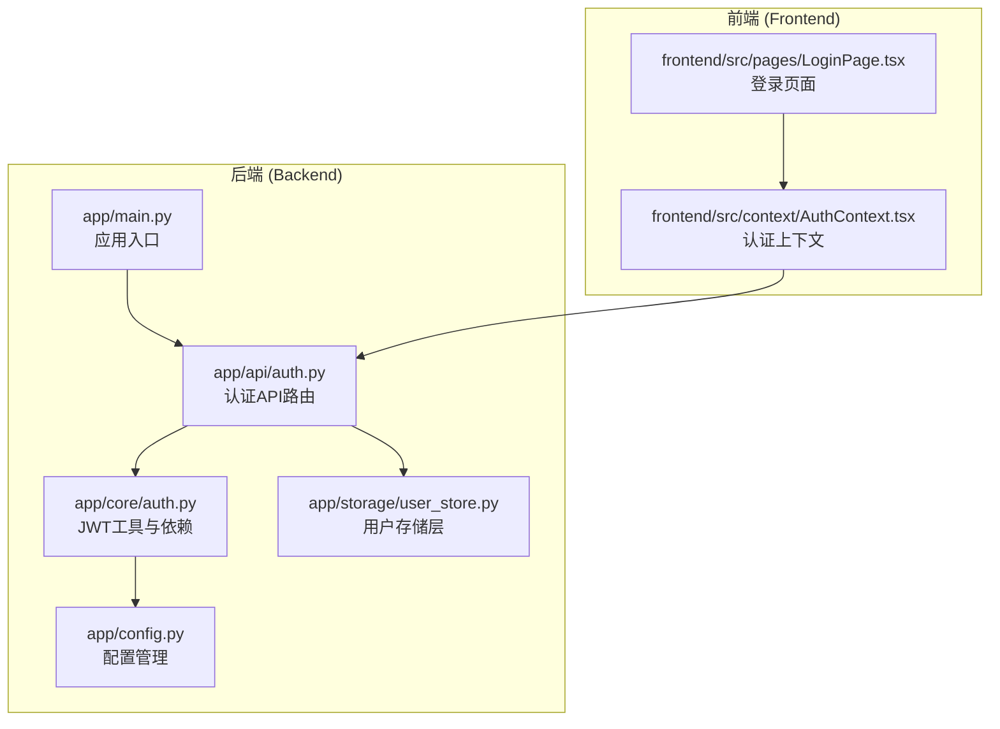
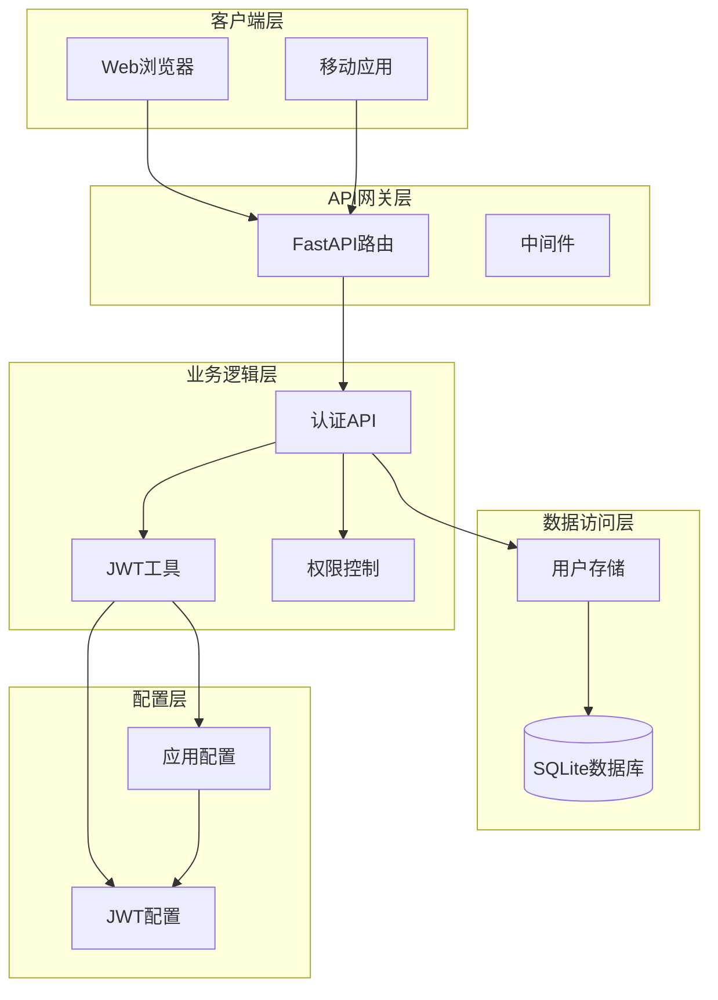
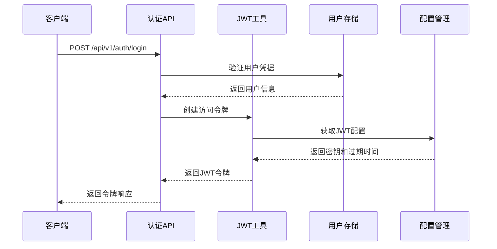
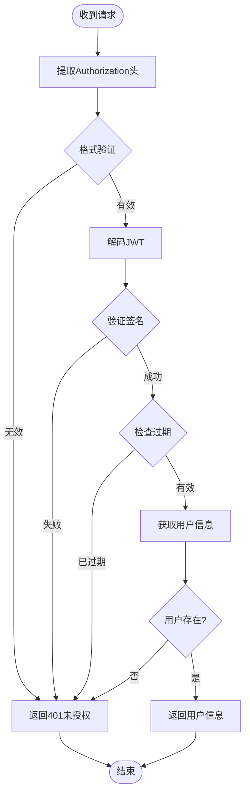
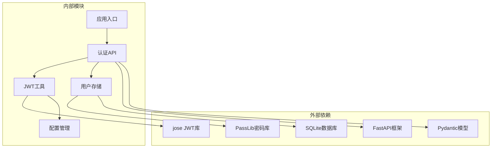

# 认证接口

<cite>
**本文引用的文件**
- [backend/app/api/auth.py](file://backend/app/api/auth.py)
- [backend/app/core/auth.py](file://backend/app/core/auth.py)
- [backend/app/storage/user_store.py](file://backend/app/storage/user_store.py)
- [backend/app/config.py](file://backend/app/config.py)
- [backend/app/main.py](file://backend/app/main.py)
- [frontend/src/context/AuthContext.tsx](file://frontend/src/context/AuthContext.tsx)
- [frontend/src/pages/LoginPage.tsx](file://frontend/src/pages/LoginPage.tsx)
</cite>

## 目录
1. [简介](#简介)
2. [项目结构](#项目结构)
3. [核心组件](#核心组件)
4. [架构概览](#架构概览)
5. [详细组件分析](#详细组件分析)
6. [依赖关系分析](#依赖关系分析)
7. [性能考虑](#性能考虑)
8. [故障排除指南](#故障排除指南)
9. [结论](#结论)
10. [附录](#附录)

## 简介
本文件提供避风港项目的认证接口完整API文档。该系统基于JWT（JSON Web Token）实现用户身份认证，支持用户登录、注册、获取当前用户信息和修改密码等功能。系统采用FastAPI框架构建，结合SQLite存储用户信息，并通过React前端提供用户界面。

## 项目结构
认证相关的核心文件分布如下：



**图表来源**
- [backend/app/main.py:1-76](file://backend/app/main.py#L1-L76)
- [backend/app/api/auth.py:1-108](file://backend/app/api/auth.py#L1-L108)
- [backend/app/core/auth.py:1-60](file://backend/app/core/auth.py#L1-L60)
- [backend/app/storage/user_store.py:1-133](file://backend/app/storage/user_store.py#L1-L133)
- [backend/app/config.py:1-183](file://backend/app/config.py#L1-L183)

**章节来源**
- [backend/app/main.py:1-76](file://backend/app/main.py#L1-L76)
- [backend/app/api/auth.py:1-108](file://backend/app/api/auth.py#L1-L108)

## 核心组件
认证系统由以下核心组件构成：

### 1. API路由层
- 提供认证相关的REST API端点
- 包含登录、注册、用户信息查询、密码修改功能
- 使用FastAPI的依赖注入机制进行权限控制

### 2. JWT工具层
- 实现JWT令牌的生成和验证
- 提供OAuth2密码模式支持
- 管理令牌过期时间和算法

### 3. 用户存储层
- 基于SQLite的用户数据持久化
- 实现密码哈希和验证
- 提供用户CRUD操作

### 4. 配置管理层
- 管理JWT密钥和过期时间
- 提供应用配置参数

**章节来源**
- [backend/app/api/auth.py:1-108](file://backend/app/api/auth.py#L1-L108)
- [backend/app/core/auth.py:1-60](file://backend/app/core/auth.py#L1-L60)
- [backend/app/storage/user_store.py:1-133](file://backend/app/storage/user_store.py#L1-L133)
- [backend/app/config.py:173-176](file://backend/app/config.py#L173-L176)

## 架构概览
认证系统的整体架构采用分层设计：



**图表来源**
- [backend/app/main.py:21-30](file://backend/app/main.py#L21-L30)
- [backend/app/api/auth.py:8-14](file://backend/app/api/auth.py#L8-L14)
- [backend/app/core/auth.py:12-12](file://backend/app/core/auth.py#L12-L12)
- [backend/app/storage/user_store.py:15-15](file://backend/app/storage/user_store.py#L15-L15)

## 详细组件分析

### JWT令牌机制

#### 令牌生成流程


**图表来源**
- [backend/app/api/auth.py:54-68](file://backend/app/api/auth.py#L54-L68)
- [backend/app/core/auth.py:19-25](file://backend/app/core/auth.py#L19-L25)
- [backend/app/config.py:173-176](file://backend/app/config.py#L173-L176)

#### 令牌验证流程


**图表来源**
- [backend/app/core/auth.py:41-52](file://backend/app/core/auth.py#L41-L52)
- [backend/app/core/auth.py:28-36](file://backend/app/core/auth.py#L28-L36)

#### 令牌结构
JWT令牌包含以下标准声明：
- `sub`: 用户唯一标识符
- `exp`: 过期时间戳
- `iat`: 签发时间
- `iss`: 签发者

**章节来源**
- [backend/app/core/auth.py:19-25](file://backend/app/core/auth.py#L19-L25)
- [backend/app/core/auth.py:41-52](file://backend/app/core/auth.py#L41-L52)

### 认证端点详解

#### 用户登录
**端点**: `POST /api/v1/auth/login`
**功能**: 用户凭据验证并返回JWT访问令牌

**请求参数**:
- `username`: 用户名 (字符串)
- `password`: 密码 (字符串)

**响应数据**:
- `access_token`: JWT访问令牌
- `token_type`: 令牌类型 (固定为"bearer")
- `role`: 用户角色
- `username`: 用户名
- `user_id`: 用户唯一标识符

**错误处理**:
- 401 未授权: 用户名或密码错误
- 422 验证错误: 请求参数格式不正确

**章节来源**
- [backend/app/api/auth.py:54-68](file://backend/app/api/auth.py#L54-L68)

#### OAuth2密码模式
**端点**: `POST /api/v1/auth/token`
**功能**: 兼容OAuth2密码模式，用于Swagger UI等工具

**请求参数**:
- `username`: 用户名
- `password`: 密码

**响应数据**:
- `access_token`: JWT访问令牌
- `token_type`: 令牌类型 (固定为"bearer")

**章节来源**
- [backend/app/api/auth.py:72-78](file://backend/app/api/auth.py#L72-L78)

#### 用户注册
**端点**: `POST /api/v1/auth/register`
**功能**: 创建新用户账户
**权限要求**: 需要管理员权限

**请求参数**:
- `username`: 用户名
- `password`: 密码
- `role`: 用户角色 (默认"user")

**响应数据**:
- `id`: 用户唯一标识符
- `username`: 用户名
- `role`: 用户角色
- `created_at`: 创建时间戳

**错误处理**:
- 400 错误: 角色必须是"admin"或"user"
- 403 禁止: 需要管理员权限
- 409 冲突: 用户名已存在
- 422 验证错误: 请求参数格式不正确

**章节来源**
- [backend/app/api/auth.py:81-89](file://backend/app/api/auth.py#L81-L89)

#### 获取当前用户信息
**端点**: `GET /api/v1/auth/me`
**功能**: 返回当前已认证用户的详细信息

**响应数据**:
- `id`: 用户唯一标识符
- `username`: 用户名
- `role`: 用户角色
- `created_at`: 创建时间戳

**权限要求**: 需要有效JWT令牌

**章节来源**
- [backend/app/api/auth.py:92-94](file://backend/app/api/auth.py#L92-L94)

#### 修改密码
**端点**: `PUT /api/v1/auth/me/password`
**功能**: 修改当前用户的密码

**请求参数**:
- `old_password`: 原密码
- `new_password`: 新密码

**响应数据**:
- `ok`: 操作结果 (布尔值)
- `message`: 操作状态描述

**错误处理**:
- 400 错误: 原密码不正确或新密码长度不足6位
- 401 未授权: 需要有效JWT令牌

**章节来源**
- [backend/app/api/auth.py:97-107](file://backend/app/api/auth.py#L97-L107)

### 权限控制机制

#### 角色权限
系统支持两种用户角色：
- `admin`: 管理员角色，拥有最高权限
- `user`: 普通用户角色，基础权限

#### 权限装饰器
- `require_admin`: 仅管理员可访问的依赖装饰器
- `get_current_user`: 获取当前认证用户信息的依赖装饰器

**章节来源**
- [backend/app/api/auth.py:82-89](file://backend/app/api/auth.py#L82-L89)
- [backend/app/core/auth.py:55-59](file://backend/app/core/auth.py#L55-L59)

### 前端集成

#### 认证上下文
前端使用React Context管理认证状态，提供以下功能：
- 用户登录和登出
- 令牌存储和管理
- 自动化的Authorization头添加
- 用户信息缓存

#### HTTP认证头使用
前端通过Authorization头发送JWT令牌：
```
Authorization: Bearer <JWT_TOKEN>
```

**章节来源**
- [frontend/src/context/AuthContext.tsx:74-82](file://frontend/src/context/AuthContext.tsx#L74-L82)
- [frontend/src/context/AuthContext.tsx:44-65](file://frontend/src/context/AuthContext.tsx#L44-L65)

## 依赖关系分析



**图表来源**
- [backend/app/main.py:1-11](file://backend/app/main.py#L1-L11)
- [backend/app/api/auth.py:3-8](file://backend/app/api/auth.py#L3-L8)
- [backend/app/core/auth.py:6-10](file://backend/app/core/auth.py#L6-L10)
- [backend/app/storage/user_store.py:13-13](file://backend/app/storage/user_store.py#L13-L13)

**章节来源**
- [backend/app/main.py:1-11](file://backend/app/main.py#L1-L11)
- [backend/app/api/auth.py:3-8](file://backend/app/api/auth.py#L3-L8)
- [backend/app/core/auth.py:6-10](file://backend/app/core/auth.py#L6-L10)
- [backend/app/storage/user_store.py:13-13](file://backend/app/storage/user_store.py#L13-L13)

## 性能考虑
- **令牌过期时间**: 默认24小时，可根据安全需求调整
- **密码哈希**: 使用bcrypt算法，安全性高但计算成本较高
- **数据库连接**: SQLite连接池优化，避免频繁连接建立
- **内存使用**: JWT令牌在内存中验证，减少数据库查询

## 故障排除指南

### 常见认证问题

#### 401 未授权错误
**可能原因**:
- 令牌格式不正确
- 令牌已过期
- 用户不存在
- 密码错误

**解决方法**:
1. 检查Authorization头格式是否正确
2. 确认令牌未过期
3. 重新登录获取新令牌
4. 验证用户名和密码

#### 403 禁止访问
**可能原因**:
- 需要管理员权限
- 用户角色不匹配

**解决方法**:
1. 确认用户具有相应角色
2. 联系管理员获取权限
3. 检查API端点的权限要求

#### 409 冲突错误
**可能原因**:
- 用户名已存在
- 数据库约束冲突

**解决方法**:
1. 更换用户名
2. 检查数据库状态
3. 清理重复数据

### 安全最佳实践

#### 密码安全
- 最小密码长度6位
- 使用bcrypt进行密码哈希
- 定期更换密码

#### 令牌安全
- 设置合理的过期时间
- 在HTTPS环境下传输令牌
- 定期轮换JWT密钥
- 实施令牌撤销机制

#### 前端安全
- 令牌存储在安全的localStorage中
- 避免在URL中传递敏感信息
- 实施适当的CORS策略

**章节来源**
- [backend/app/api/auth.py:104-105](file://backend/app/api/auth.py#L104-L105)
- [backend/app/config.py:173-176](file://backend/app/config.py#L173-L176)
- [frontend/src/context/AuthContext.tsx:30-42](file://frontend/src/context/AuthContext.tsx#L30-L42)

## 结论
避风港项目的认证系统提供了完整的用户身份验证解决方案，采用JWT令牌机制确保安全性，结合FastAPI的依赖注入实现灵活的权限控制。系统设计简洁明了，易于扩展和维护。通过前后端分离的架构，实现了良好的用户体验和安全保证。

## 附录

### API调用示例

#### 用户登录
```bash
curl -X POST "http://localhost:8000/api/v1/auth/login" \
  -H "Content-Type: application/json" \
  -d '{
    "username": "admin",
    "password": "admin123"
  }'
```

#### 获取用户信息
```bash
curl -X GET "http://localhost:8000/api/v1/auth/me" \
  -H "Authorization: Bearer YOUR_JWT_TOKEN"
```

### 配置参数说明

| 参数名 | 类型 | 默认值 | 描述 |
|--------|------|--------|------|
| jwt_secret | string | "astra-change-me-in-production-2024" | JWT签名密钥 |
| jwt_expire_hours | integer | 24 | 令牌过期时间（小时） |

### 错误代码对照表

| 状态码 | 错误类型 | 描述 |
|--------|----------|------|
| 400 | Bad Request | 请求参数错误或业务逻辑错误 |
| 401 | Unauthorized | 未认证或认证失败 |
| 403 | Forbidden | 权限不足 |
| 409 | Conflict | 资源冲突（如用户名已存在） |
| 422 | Unprocessable Entity | 数据验证失败 |
| 500 | Internal Server Error | 服务器内部错误 |