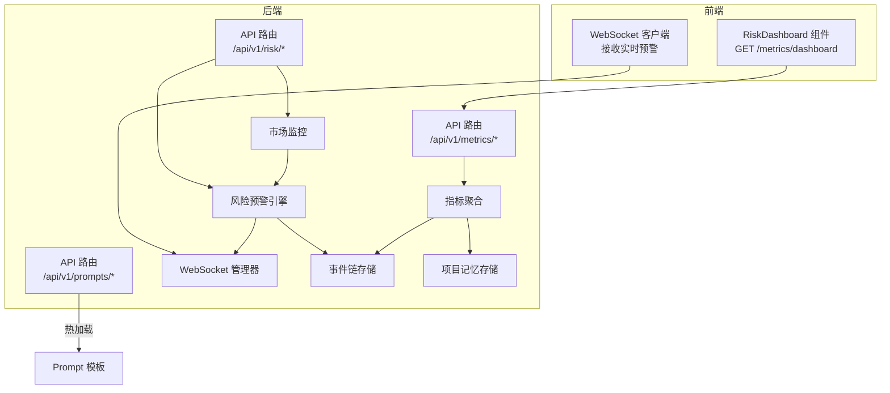
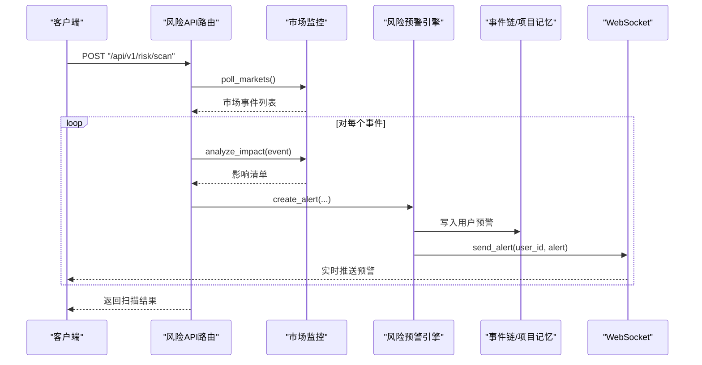
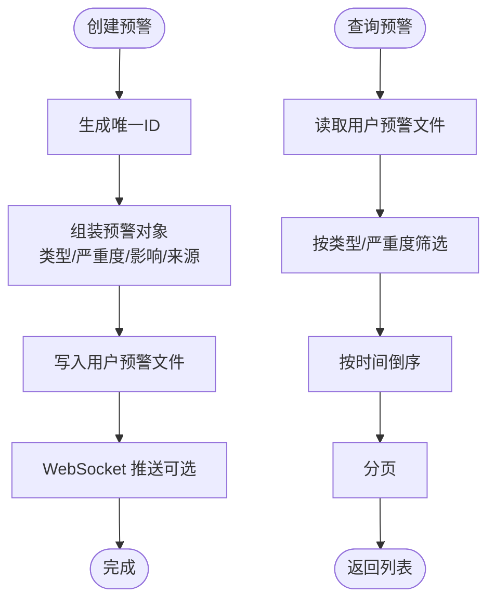
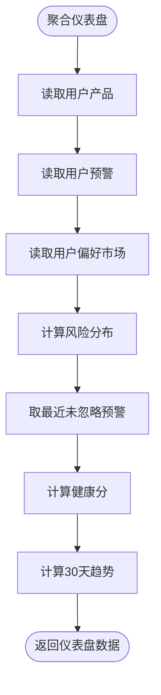
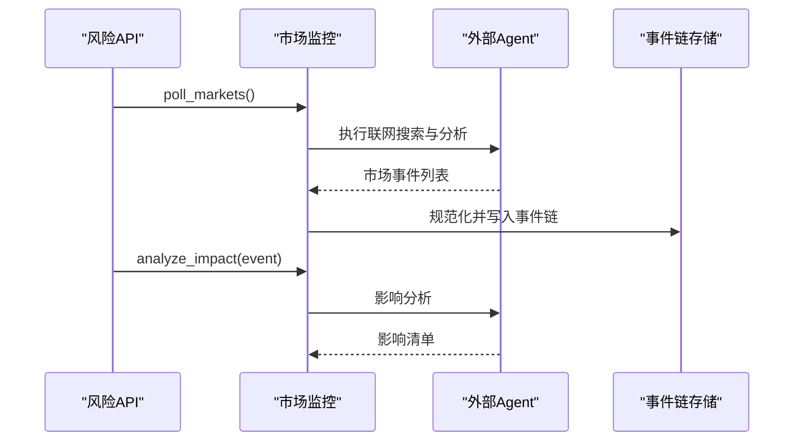
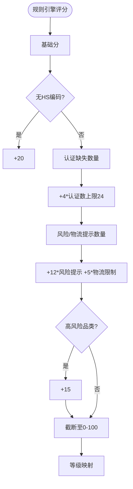
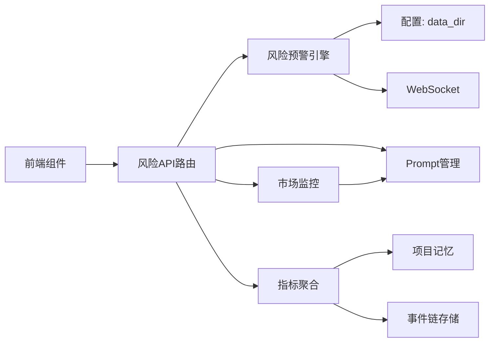

# 风险监控接口

<cite>
**本文引用的文件**
- [backend/app/api/risk.py](file://backend/app/api/risk.py)
- [backend/app/core/risk_alert.py](file://backend/app/core/risk_alert.py)
- [backend/app/core/metrics.py](file://backend/app/core/metrics.py)
- [backend/app/core/market_monitor.py](file://backend/app/core/market_monitor.py)
- [backend/app/core/rule_engine.py](file://backend/app/core/rule_engine.py)
- [backend/app/storage/event_store.py](file://backend/app/storage/event_store.py)
- [backend/app/storage/project_memory.py](file://backend/app/storage/project_memory.py)
- [backend/app/services/ws_manager.py](file://backend/app/services/ws_manager.py)
- [backend/data/prompts/market_monitor.yaml](file://backend/data/prompts/market_monitor.yaml)
- [backend/data/prompts/impact_analysis.yaml](file://backend/data/prompts/impact_analysis.yaml)
- [backend/data/prompts/risk_summary.yaml](file://backend/data/prompts/risk_summary.yaml)
- [backend/app/models/schemas.py](file://backend/app/models/schemas.py)
- [backend/app/config.py](file://backend/app/config.py)
- [frontend/src/components/RiskDashboard.tsx](file://frontend/src/components/RiskDashboard.tsx)
- [frontend/src/types/index.ts](file://frontend/src/types/index.ts)
</cite>

## 目录
1. [简介](#简介)
2. [项目结构](#项目结构)
3. [核心组件](#核心组件)
4. [架构总览](#架构总览)
5. [详细组件分析](#详细组件分析)
6. [依赖分析](#依赖分析)
7. [性能考虑](#性能考虑)
8. [故障排查指南](#故障排查指南)
9. [结论](#结论)
10. [附录](#附录)

## 简介
本文件为“风险监控接口”的完整API文档，涵盖风险评估、风险预警、风险统计等能力的设计与实现。文档围绕以下目标展开：
- 明确风险评分算法、风险等级分类与风险指标计算方法
- 说明实时风险监控的数据采集流程、异常检测机制与风险报告生成
- 提供风险数据的存储格式、查询接口与可视化支持
- 给出风险阈值设置、告警配置与历史数据分析的实现细节

## 项目结构
后端采用FastAPI路由与分层存储架构，前端通过REST与WebSocket接收实时风险数据。关键模块包括：
- API路由层：对外暴露风险、指标与Prompt管理接口
- 风险引擎层：负责预警生成、持久化与查询
- 指标聚合层：基于用户数据生成仪表盘与趋势
- 市场监控层：委托外部Agent执行联网搜索与影响分析
- 存储层：事件链、项目记忆与风险预警文件化存储
- 通信层：WebSocket实时推送与REST轮询

图表来源
- [backend/app/api/risk.py:20-154](file://backend/app/api/risk.py#L20-L154)
- [backend/app/core/risk_alert.py:1-181](file://backend/app/core/risk_alert.py#L1-L181)
- [backend/app/core/metrics.py:20-176](file://backend/app/core/metrics.py#L20-L176)
- [backend/app/core/market_monitor.py:24-156](file://backend/app/core/market_monitor.py#L24-L156)
- [backend/app/storage/event_store.py:59-221](file://backend/app/storage/event_store.py#L59-L221)
- [backend/app/storage/project_memory.py:20-141](file://backend/app/storage/project_memory.py#L20-L141)
- [backend/app/services/ws_manager.py:20-95](file://backend/app/services/ws_manager.py#L20-L95)

章节来源
- [backend/app/api/risk.py:1-154](file://backend/app/api/risk.py#L1-L154)
- [backend/app/core/risk_alert.py:1-181](file://backend/app/core/risk_alert.py#L1-L181)
- [backend/app/core/metrics.py:1-176](file://backend/app/core/metrics.py#L1-L176)
- [backend/app/core/market_monitor.py:1-156](file://backend/app/core/market_monitor.py#L1-L156)
- [backend/app/storage/event_store.py:1-269](file://backend/app/storage/event_store.py#L1-L269)
- [backend/app/storage/project_memory.py:1-141](file://backend/app/storage/project_memory.py#L1-L141)
- [backend/app/services/ws_manager.py:1-95](file://backend/app/services/ws_manager.py#L1-L95)

## 核心组件
- 风险预警引擎：负责生成、持久化、查询与忽略预警，支持按用户隔离存储与实时推送
- 指标聚合模块：基于用户产品与预警数据生成仪表盘指标（健康分、风险分布、趋势等）
- 市场监控模块：委托外部Agent执行联网搜索与影响分析，产出市场事件并驱动预警
- 事件链存储：统一记录系统事件与用户操作链，支撑审计与回溯
- 项目记忆存储：保存产品合规历史，为趋势与健康分计算提供依据
- WebSocket管理：向前端推送实时预警与扫描状态

章节来源
- [backend/app/core/risk_alert.py:32-181](file://backend/app/core/risk_alert.py#L32-L181)
- [backend/app/core/metrics.py:20-176](file://backend/app/core/metrics.py#L20-L176)
- [backend/app/core/market_monitor.py:24-156](file://backend/app/core/market_monitor.py#L24-L156)
- [backend/app/storage/event_store.py:59-221](file://backend/app/storage/event_store.py#L59-L221)
- [backend/app/storage/project_memory.py:20-141](file://backend/app/storage/project_memory.py#L20-L141)
- [backend/app/services/ws_manager.py:20-95](file://backend/app/services/ws_manager.py#L20-L95)

## 架构总览
风险监控体系以“事件驱动 + 文件化存储 + 实时推送”为核心：
- 数据采集：市场监控模块通过外部Agent抓取法规变更与合规热点，标准化为市场事件
- 影响分析：对用户产品进行影响评估，生成受影响产品清单
- 风险预警：根据事件严重度与影响清单创建预警，持久化至用户目录
- 指标统计：聚合用户产品与预警数据，计算健康分与风险分布
- 可视化与通知：前端通过REST与WebSocket获取仪表盘与实时预警

图表来源
- [backend/app/api/risk.py:63-108](file://backend/app/api/risk.py#L63-L108)
- [backend/app/core/market_monitor.py:35-104](file://backend/app/core/market_monitor.py#L35-L104)
- [backend/app/core/risk_alert.py:32-82](file://backend/app/core/risk_alert.py#L32-L82)
- [backend/app/services/ws_manager.py:46-68](file://backend/app/services/ws_manager.py#L46-L68)

## 详细组件分析

### 风险预警引擎（创建、查询、忽略）
- 存储位置：按用户隔离，目录为“data/risk_alerts/{user_id}/alerts.json”，另存“last_scan.json”
- 创建预警：生成唯一ID、标准化字段、写入用户文件；支持批量推送
- 忽略预警：按ID定位并标记dismissed，覆盖写入
- 查询预警：支持类型/严重度筛选、分页、按创建时间倒序
- 未读计数：统计未忽略预警数量

图表来源
- [backend/app/core/risk_alert.py:32-130](file://backend/app/core/risk_alert.py#L32-L130)
- [backend/app/core/risk_alert.py:144-181](file://backend/app/core/risk_alert.py#L144-L181)

章节来源
- [backend/app/core/risk_alert.py:1-181](file://backend/app/core/risk_alert.py#L1-L181)

### 指标聚合与健康分算法
- 指标来源：用户产品（项目记忆）、用户预警（风险预警）、用户偏好市场（用户记忆）
- 指标计算：
  - 风险分布：按严重度统计未忽略预警数量
  - 最近预警：取未忽略预警Top N
  - 健康分（0-100）：基础100，扣分项包括高风险产品、无HS编码、待处理高危预警；加分项为近7天合规检查次数（上限）
  - 趋势：近30天每日合规检查次数
- 仪表盘返回字段：产品总数、风险分布、最近预警、活跃市场、健康分、趋势

图表来源
- [backend/app/core/metrics.py:20-46](file://backend/app/core/metrics.py#L20-L46)
- [backend/app/core/metrics.py:112-144](file://backend/app/core/metrics.py#L112-L144)
- [backend/app/core/metrics.py:146-160](file://backend/app/core/metrics.py#L146-L160)

章节来源
- [backend/app/core/metrics.py:1-176](file://backend/app/core/metrics.py#L1-L176)

### 市场监控与影响分析
- 市场监控：委托外部Agent执行联网搜索，标准化为市场事件（含严重度、影响品类、摘要、来源等）
- 影响分析：读取用户产品列表，评估事件对产品的潜在影响，输出影响清单
- 事件存储：事件链统一存储于事件链目录，支持系统与用户两类链

图表来源
- [backend/app/core/market_monitor.py:35-104](file://backend/app/core/market_monitor.py#L35-L104)
- [backend/app/storage/event_store.py:59-158](file://backend/app/storage/event_store.py#L59-L158)
- [backend/data/prompts/market_monitor.yaml:1-36](file://backend/data/prompts/market_monitor.yaml#L1-L36)
- [backend/data/prompts/impact_analysis.yaml:1-19](file://backend/data/prompts/impact_analysis.yaml#L1-L19)

章节来源
- [backend/app/core/market_monitor.py:1-156](file://backend/app/core/market_monitor.py#L1-L156)
- [backend/app/storage/event_store.py:1-269](file://backend/app/storage/event_store.py#L1-L269)
- [backend/data/prompts/market_monitor.yaml:1-36](file://backend/data/prompts/market_monitor.yaml#L1-L36)
- [backend/data/prompts/impact_analysis.yaml:1-19](file://backend/data/prompts/impact_analysis.yaml#L1-L19)

### 风险评分与等级映射（规则引擎）
- 风险评分（0-100）：基础分+扣分项（无HS编码、高风险品类、认证缺失、物流限制等）+加分项（近期合规检查）
- 等级映射：≥70高危，≥40中危，否则低
- 修复建议：基于规则引擎生成优先级修复步骤

图表来源
- [backend/app/core/rule_engine.py:148-174](file://backend/app/core/rule_engine.py#L148-L174)
- [backend/app/core/rule_engine.py:197-247](file://backend/app/core/rule_engine.py#L197-L247)

章节来源
- [backend/app/core/rule_engine.py:1-247](file://backend/app/core/rule_engine.py#L1-L247)

### Prompt 管理与模板热加载
- 热加载：重新加载所有Prompt模板，使后续推理使用最新版本
- 模板类型：市场监控、影响分析、风险摘要等

章节来源
- [backend/app/api/risk.py:139-154](file://backend/app/api/risk.py#L139-L154)
- [backend/data/prompts/market_monitor.yaml:1-36](file://backend/data/prompts/market_monitor.yaml#L1-L36)
- [backend/data/prompts/impact_analysis.yaml:1-19](file://backend/data/prompts/impact_analysis.yaml#L1-L19)
- [backend/data/prompts/risk_summary.yaml:1-16](file://backend/data/prompts/risk_summary.yaml#L1-L16)

### WebSocket 实时推送
- 推送类型：alert（预警）、scan_update（扫描状态）
- 连接管理：按用户ID维护连接集合，自动清理失效连接
- 前端协议：JSON消息，包含type与payload

章节来源
- [backend/app/services/ws_manager.py:20-95](file://backend/app/services/ws_manager.py#L20-L95)
- [backend/app/api/risk.py:68-107](file://backend/app/api/risk.py#L68-L107)

## 依赖分析
- API路由依赖风险引擎、市场监控、指标聚合与Prompt管理
- 风险引擎依赖配置中的数据目录与WebSocket管理器
- 指标聚合依赖项目记忆与事件链存储
- 市场监控依赖外部Agent与Prompt模板
- 前端依赖类型定义与REST/WS接口

图表来源
- [backend/app/api/risk.py:1-154](file://backend/app/api/risk.py#L1-L154)
- [backend/app/core/risk_alert.py:1-181](file://backend/app/core/risk_alert.py#L1-L181)
- [backend/app/core/metrics.py:1-176](file://backend/app/core/metrics.py#L1-L176)
- [backend/app/core/market_monitor.py:1-156](file://backend/app/core/market_monitor.py#L1-L156)
- [backend/app/config.py:150-155](file://backend/app/config.py#L150-L155)
- [frontend/src/components/RiskDashboard.tsx:1-98](file://frontend/src/components/RiskDashboard.tsx#L1-L98)

章节来源
- [backend/app/config.py:1-183](file://backend/app/config.py#L1-L183)
- [frontend/src/components/RiskDashboard.tsx:1-98](file://frontend/src/components/RiskDashboard.tsx#L1-L98)

## 性能考虑
- 文件化存储：预警与事件均以JSON文件持久化，I/O成本较低，适合中小规模用户
- 分页与筛选：预警查询支持分页与筛选，避免一次性加载过多数据
- 趋势计算：按日聚合合规检查次数，复杂度O(n)，n为产品数
- WebSocket：按用户连接池推送，自动清理失效连接，降低广播成本
- 外部Agent：市场监控依赖外部Agent，建议合理控制扫描频率与并发

## 故障排查指南
- 预警未显示
  - 检查用户是否有活跃WebSocket连接
  - 确认预警未被忽略（dismissed=false）
  - 核对用户ID与存储目录是否存在
- 仪表盘为空
  - 确认项目记忆与用户偏好市场文件存在
  - 检查事件链与预警文件是否可读
- 扫描失败
  - 查看外部Agent错误日志
  - 确认Prompt模板可用且格式正确
- 健康分异常
  - 检查产品是否缺少HS编码或风险等级
  - 核对近期合规检查记录的时间戳格式

章节来源
- [backend/app/services/ws_manager.py:46-82](file://backend/app/services/ws_manager.py#L46-L82)
- [backend/app/core/risk_alert.py:97-135](file://backend/app/core/risk_alert.py#L97-L135)
- [backend/app/core/metrics.py:69-91](file://backend/app/core/metrics.py#L69-L91)
- [backend/app/core/market_monitor.py:42-54](file://backend/app/core/market_monitor.py#L42-L54)

## 结论
该风险监控接口以清晰的分层架构实现了从数据采集、影响分析、预警生成到指标统计与实时推送的闭环。通过规则引擎与文件化存储，系统在保证可扩展性的同时，提供了直观的可视化与灵活的阈值配置空间。建议结合业务规模逐步引入数据库与缓存优化，并完善异常告警与审计日志。

## 附录

### API 设计与接口规范

- 预警列表
  - 方法与路径：GET /api/v1/risk/alerts
  - 查询参数：
    - user_id：用户ID，默认"default"
    - alert_type：预警类型（可选）
    - severity：严重度（可选）
    - page：页码（>=1）
    - size：每页条数（1-100）
  - 返回：alerts数组、page、size

- 未读预警数
  - 方法与路径：GET /api/v1/risk/alerts/unread-count
  - 查询参数：user_id
  - 返回：unread_count

- 忽略预警
  - 方法与路径：POST /api/v1/risk/alerts/{alert_id}/dismiss
  - 路径参数：alert_id
  - 查询参数：user_id
  - 返回：status与alert_id

- 手动触发市场扫描
  - 方法与路径：POST /api/v1/risk/scan
  - 查询参数：user_id
  - 返回：status、创建的预警数、发现的事件数
  - 实时推送：扫描开始、完成、错误状态

- 市场监控状态
  - 方法与路径：GET /api/v1/risk/market-status
  - 查询参数：user_id
  - 返回：last_scan、active_alerts、各市场的预警数

- 用户仪表盘
  - 方法与路径：GET /api/v1/metrics/dashboard
  - 查询参数：user_id
  - 返回：total_products、risk_distribution、recent_alerts、active_markets、health_score、trend

- Prompt热加载
  - 方法与路径：POST /api/v1/prompts/reload
  - 返回：status、reloaded数量、prompts列表

章节来源
- [backend/app/api/risk.py:25-154](file://backend/app/api/risk.py#L25-L154)

### 风险数据存储格式
- 预警文件：data/risk_alerts/{user_id}/alerts.json
  - 字段：alert_id、alert_type、severity、title、description、affected_products、affected_markets、source、source_url、dismissed、created_at
- 最后扫描时间：data/risk_alerts/{user_id}/last_scan.json
  - 字段：last_scan
- 事件链：data/event_chain/system_events/{chain_id}.json
  - 字段：chain_id、type、total_events、events[]
- 项目记忆：data/project_memory/{product_id}/compliance.json
  - 字段：product_id、product_name、checks[]（每次合规检查记录）

章节来源
- [backend/app/core/risk_alert.py:59-82](file://backend/app/core/risk_alert.py#L59-L82)
- [backend/app/core/risk_alert.py:144-162](file://backend/app/core/risk_alert.py#L144-L162)
- [backend/app/storage/event_store.py:22-56](file://backend/app/storage/event_store.py#L22-L56)
- [backend/app/storage/project_memory.py:64-87](file://backend/app/storage/project_memory.py#L64-L87)

### 前端类型与可视化
- 仪表盘数据类型：DashboardData（total_products、risk_distribution、recent_alerts、active_markets、health_score、trend）
- 风险仪表盘组件：RiskDashboard，通过GET /api/v1/metrics/dashboard获取数据并渲染
- 颜色映射：健康分≥80绿色，≥50橙色，否则红色；风险分布按严重度着色

章节来源
- [frontend/src/types/index.ts:254-276](file://frontend/src/types/index.ts#L254-L276)
- [frontend/src/components/RiskDashboard.tsx:1-98](file://frontend/src/components/RiskDashboard.tsx#L1-L98)