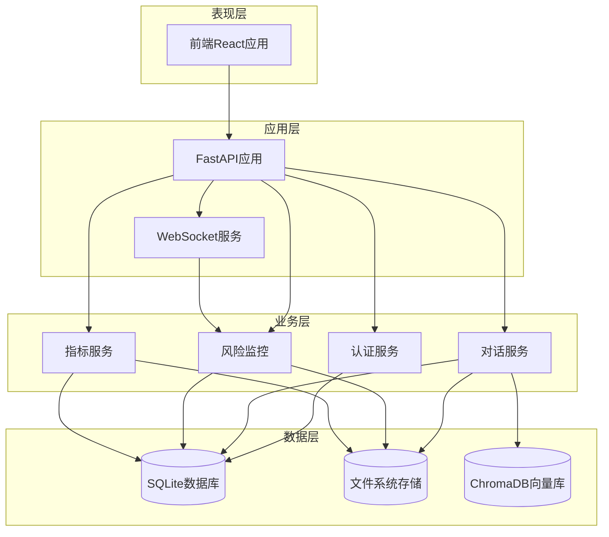
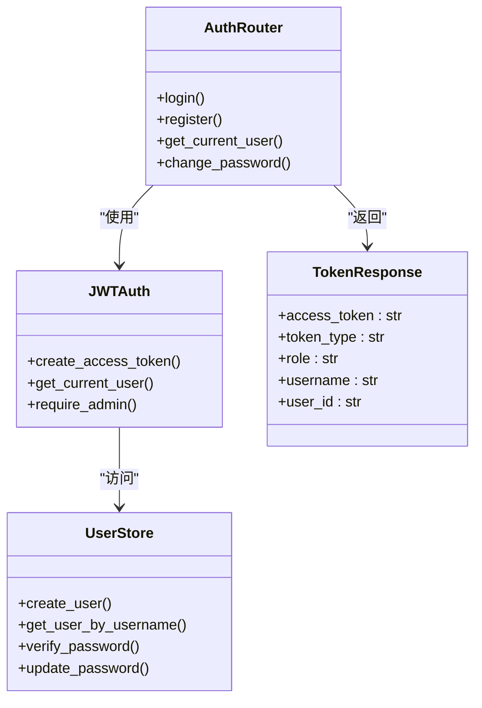
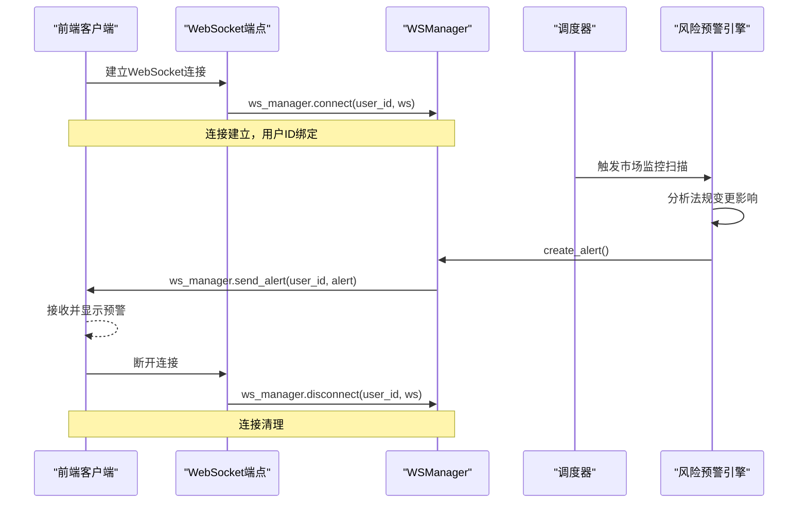
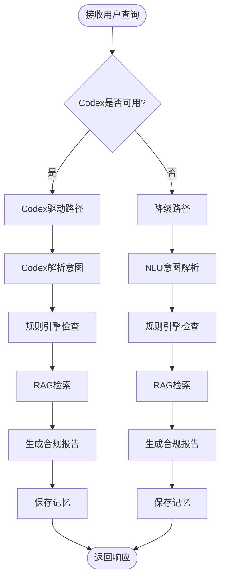
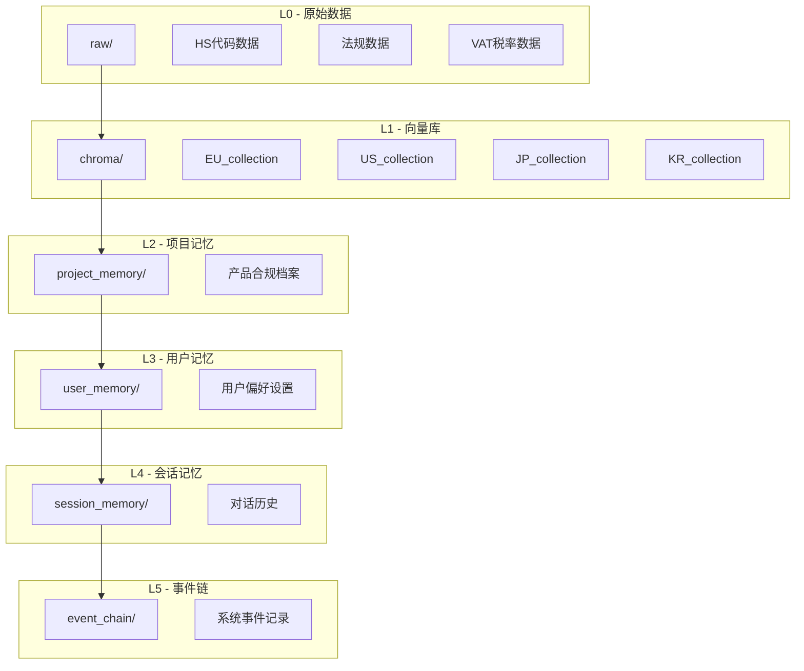
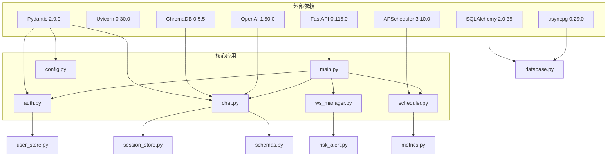

# FastAPI应用架构

<cite>
**本文档引用的文件**
- [main.py](file://backend/app/main.py)
- [config.py](file://backend/app/config.py)
- [auth.py](file://backend/app/api/auth.py)
- [ws_manager.py](file://backend/app/services/ws_manager.py)
- [database.py](file://backend/app/models/database.py)
- [auth_core.py](file://backend/app/core/auth.py)
- [user_store.py](file://backend/app/storage/user_store.py)
- [chat.py](file://backend/app/api/chat.py)
- [metrics.py](file://backend/app/core/metrics.py)
- [scheduler.py](file://backend/app/core/scheduler.py)
- [session_store.py](file://backend/app/storage/session_store.py)
- [schemas.py](file://backend/app/models/schemas.py)
- [requirements.txt](file://backend/requirements.txt)
- [README.md](file://README.md)
</cite>

## 目录
1. [简介](#简介)
2. [项目结构](#项目结构)
3. [核心组件](#核心组件)
4. [架构概览](#架构概览)
5. [详细组件分析](#详细组件分析)
6. [依赖关系分析](#依赖关系分析)
7. [性能考虑](#性能考虑)
8. [故障排除指南](#故障排除指南)
9. [结论](#结论)

## 简介

避风港是一个基于FastAPI构建的跨境合规智能体应用，旨在为中小出海企业提供AI合规助手服务。该应用通过Codex SDK驱动的多Agent架构，结合规则引擎、RAG知识库和市场监控系统，为企业提供HS编码、税率、认证要求等合规信息的实时查询和风险预警服务。

## 项目结构

该项目采用模块化设计，按照功能层次进行组织：

```mermaid
graph TB
subgraph "后端应用 (backend/app)"
A[main.py<br/>应用入口]
B[config.py<br/>配置管理]
subgraph "API层"
C[api/]
C1[auth.py<br/>认证API]
C2[chat.py<br/>对话API]
C3[risk.py<br/>风险监控API]
C4[sessions.py<br/>会话管理API]
C5[users.py<br/>用户管理API]
C6[shopify.py<br/>Shopify集成API]
end
subgraph "核心层"
D[core/]
D1[auth.py<br/>JWT认证工具]
D2[scheduler.py<br/>调度器]
D3[metrics.py<br/>指标监控]
D4[market_monitor.py<br/>市场监控]
D5[risk_alert.py<br/>风险预警]
end
subgraph "服务层"
E[services/]
E1[ws_manager.py<br/>WebSocket管理]
E2[codex_agent.py<br/>Codex代理]
E3[shopify.py<br/>Shopify服务]
end
subgraph "存储层"
F[storage/]
F1[user_store.py<br/>用户存储]
F2[session_store.py<br/>会话存储]
F3[agent_config_store.py<br/>Agent配置存储]
F4[model_config_store.py<br/>模型配置存储]
end
subgraph "模型层"
G[models/]
G1[schemas.py<br/>数据模型]
G2[database.py<br/>数据库模型]
end
end
subgraph "前端应用 (frontend)"
H[React应用]
end
A --> C
A --> D
A --> E
A --> F
A --> G
H --> A
```



**图表来源**
- [main.py:1-76](file://backend/app/main.py#L1-L76)
- [config.py:1-75](file://backend/app/config.py#L1-L75)

**章节来源**
- [README.md:92-200](file://README.md#L92-L200)

## 核心组件

### 应用入口点设计

应用入口点位于`backend/app/main.py`，采用FastAPI框架的核心特性：

- **应用实例配置**：设置应用名称、描述、版本信息
- **中间件配置**：CORS跨域资源共享配置
- **路由注册机制**：统一的API版本控制（/api/v1前缀）
- **生命周期事件**：启动和关闭时的资源管理

### 路由组织结构

所有API路由都采用统一的版本控制策略：

```mermaid
graph LR
A[FastAPI应用] --> B[/api/v1 前缀]
B --> C[聊天API]
B --> D[认证API]
B --> E[风险监控API]
B --> F[会话管理API]
B --> G[用户管理API]
B --> H[Shopify集成API]
B --> I[Agent配置API]
B --> J[模型配置API]
```

**图表来源**
- [main.py:21-30](file://backend/app/main.py#L21-L30)

### 配置管理

应用配置采用Pydantic Settings模式，支持多种配置源：

- **环境变量加载**：通过.env文件进行配置
- **数据库连接配置**：支持PostgreSQL异步连接
- **服务端配置选项**：包括LLM配置、调度器设置、Shopify集成等

**章节来源**
- [config.py:5-75](file://backend/app/config.py#L5-L75)

## 架构概览

应用采用分层架构设计，实现了业务逻辑与基础设施的分离：



**图表来源**
- [README.md:7-31](file://README.md#L7-L31)
- [main.py:1-76](file://backend/app/main.py#L1-L76)

## 详细组件分析

### 认证系统

认证系统基于JWT（JSON Web Token）实现，提供了完整的用户身份验证和授权机制：



**图表来源**
- [auth.py:16-108](file://backend/app/api/auth.py#L16-L108)
- [auth_core.py:12-60](file://backend/app/core/auth.py#L12-L60)
- [user_store.py:22-133](file://backend/app/storage/user_store.py#L22-L133)

认证流程包括：

1. **用户登录**：验证用户名和密码，生成JWT令牌
2. **令牌验证**：解析JWT令牌，验证用户身份
3. **权限控制**：基于角色的访问控制（admin/user）
4. **密码管理**：密码哈希存储和安全更新

**章节来源**
- [auth.py:54-108](file://backend/app/api/auth.py#L54-L108)
- [auth_core.py:41-60](file://backend/app/core/auth.py#L41-L60)

### WebSocket实时通信

WebSocket服务实现了风险预警的实时推送功能：



**图表来源**
- [main.py:40-56](file://backend/app/main.py#L40-L56)
- [ws_manager.py:20-95](file://backend/app/services/ws_manager.py#L20-L95)
- [scheduler.py:68-131](file://backend/app/core/scheduler.py#L68-L131)

WebSocket管理器的关键特性：

- **连接管理**：维护user_id到WebSocket连接集合的映射
- **消息推送**：支持单用户推送和广播消息
- **断线处理**：自动清理失效连接
- **协议规范**：定义了alert和scan_update两种消息类型

**章节来源**
- [ws_manager.py:46-83](file://backend/app/services/ws_manager.py#L46-L83)

### 对话处理系统

对话处理系统采用双路径架构，支持Codex驱动和降级路径：



**图表来源**
- [chat.py:228-265](file://backend/app/api/chat.py#L228-L265)
- [chat.py:269-377](file://backend/app/api/chat.py#L269-L377)
- [chat.py:415-541](file://backend/app/api/chat.py#L415-L541)

对话系统的处理流程：

1. **意图解析**：使用Codex或NLU解析用户意图
2. **合规检查**：通过规则引擎获取结构化合规数据
3. **知识检索**：使用RAG从ChromaDB检索相关法规
4. **报告生成**：整合所有信息生成合规报告
5. **记忆保存**：将对话和结果保存到存储层

**章节来源**
- [chat.py:205-377](file://backend/app/api/chat.py#L205-L377)

### 数据存储架构

应用采用分层文件存储系统，实现了数据的有序管理和高效访问：



**图表来源**
- [README.md:148-161](file://README.md#L148-L161)

存储层的关键特性：

- **分层设计**：从原始数据到高级抽象的渐进式组织
- **持久化策略**：不同层级采用不同的存储方式（文件系统vs向量数据库）
- **数据一致性**：通过操作链确保数据变更的可追溯性

**章节来源**
- [session_store.py:27-70](file://backend/app/storage/session_store.py#L27-L70)

### 调度系统

调度系统负责定时执行各种后台任务：

```mermaid
stateDiagram-v2
[*] --> 初始化
初始化 --> 启动调度器
启动调度器 --> 等待任务触发
state 等待任务触发 {
[*] --> 市场轮询
[*] --> 指标聚合
市场轮询 --> 触发Codex扫描
触发Codex扫描 --> 分析影响
分析影响 --> 生成预警
生成预警 --> 推送WebSocket
推送WebSocket --> 等待任务触发
指标聚合 --> 读取用户数据
读取用户数据 --> 计算健康分
计算健康分 --> 等待任务触发
}
等待任务触发 --> 停止调度器
停止调度器 --> [*]
```

**图表来源**
- [scheduler.py:24-64](file://backend/app/core/scheduler.py#L24-L64)
- [scheduler.py:68-152](file://backend/app/core/scheduler.py#L68-L152)

调度任务包括：

- **市场轮询**：定期扫描法规变更，生成风险预警
- **指标聚合**：计算用户合规健康分和其他指标
- **数据清理**：维护系统数据的一致性和完整性

**章节来源**
- [scheduler.py:68-131](file://backend/app/core/scheduler.py#L68-L131)

## 依赖关系分析

应用的依赖关系体现了清晰的分层架构：



**图表来源**
- [requirements.txt:1-27](file://backend/requirements.txt#L1-L27)
- [main.py:1-76](file://backend/app/main.py#L1-L76)

**章节来源**
- [requirements.txt:1-27](file://backend/requirements.txt#L1-L27)

## 性能考虑

### 异步处理

应用充分利用了Python的异步特性：

- **数据库操作**：使用SQLAlchemy异步引擎
- **WebSocket通信**：非阻塞的实时通信
- **文件I/O**：异步文件操作优化
- **网络请求**：异步HTTP客户端

### 缓存策略

- **会话缓存**：SQLite内存缓存提升查询性能
- **向量检索**：ChromaDB本地缓存减少查询延迟
- **配置缓存**：Pydantic Settings缓存避免重复解析

### 资源管理

- **连接池**：数据库连接池管理
- **内存管理**：及时释放不再使用的对象
- **文件句柄**：正确的文件操作和关闭

## 故障排除指南

### 常见问题诊断

1. **认证失败**
   - 检查JWT密钥配置
   - 验证用户密码哈希
   - 确认令牌过期时间设置

2. **WebSocket连接问题**
   - 检查CORS配置
   - 验证用户ID参数
   - 查看连接池状态

3. **数据库连接异常**
   - 确认数据库URL格式
   - 检查异步连接参数
   - 验证数据库服务状态

4. **调度器任务失败**
   - 查看调度器日志
   - 检查任务间隔设置
   - 验证依赖服务可用性

### 错误处理策略

应用采用了多层次的错误处理机制：

- **API层**：HTTP异常处理和状态码返回
- **业务层**：业务逻辑异常捕获和转换
- **基础设施层**：底层异常的优雅降级
- **日志记录**：详细的错误日志和调试信息

**章节来源**
- [auth.py:58-68](file://backend/app/api/auth.py#L58-L68)
- [ws_manager.py:55-63](file://backend/app/services/ws_manager.py#L55-L63)

## 结论

避风港应用展现了现代FastAPI应用的最佳实践，通过清晰的分层架构、完善的认证机制、实时的WebSocket通信和高效的存储系统，为企业提供了全面的跨境合规解决方案。

该应用的主要优势包括：

1. **模块化设计**：清晰的功能分离便于维护和扩展
2. **异步架构**：充分利用异步特性提升性能
3. **实时通信**：WebSocket实现实时风险预警推送
4. **数据分层**：多层级存储系统保证数据一致性
5. **配置灵活**：环境变量驱动的配置管理
6. **监控完善**：调度器和指标系统确保系统稳定运行

通过遵循这些架构原则和最佳实践，该应用为类似的企业级AI应用提供了优秀的参考模板。