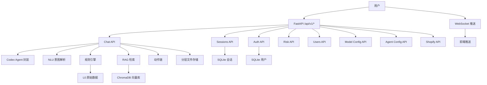
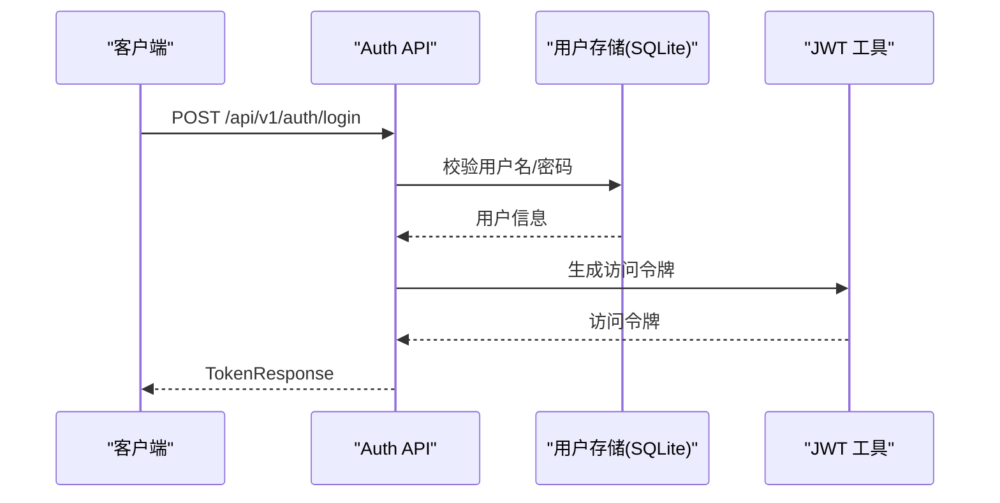
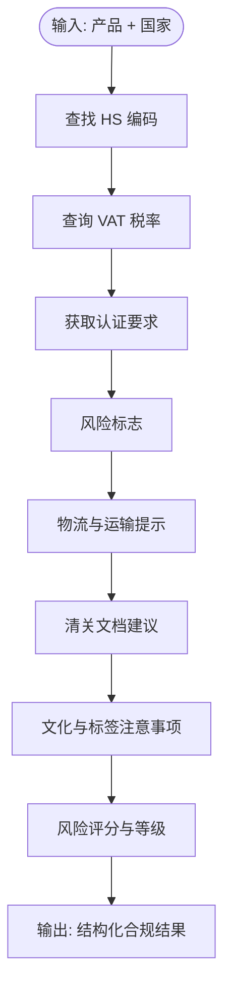
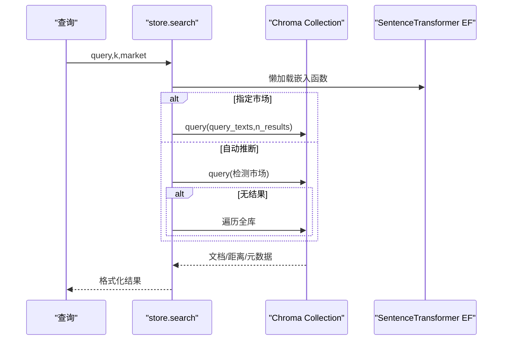
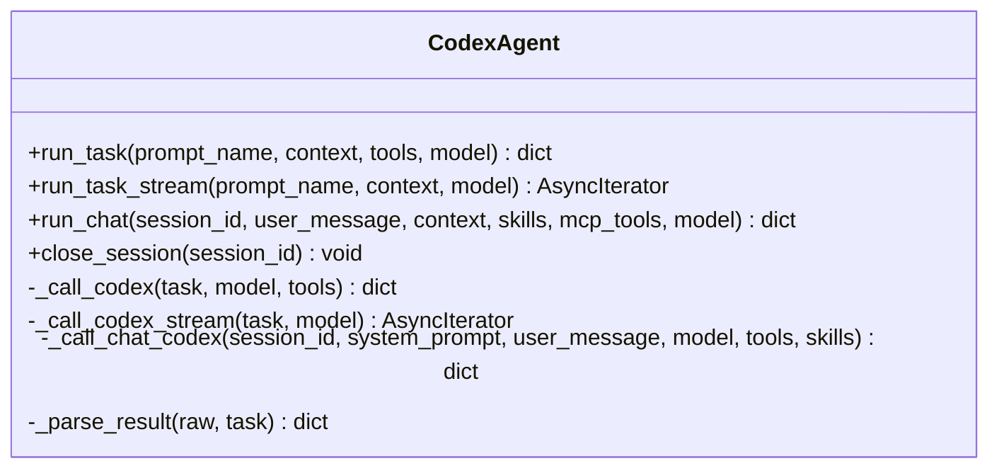
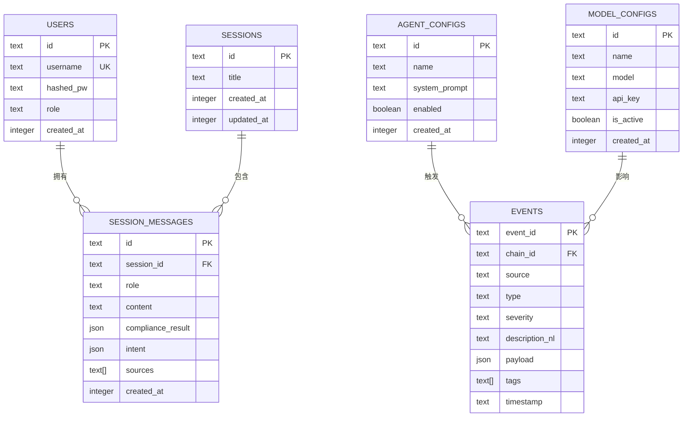
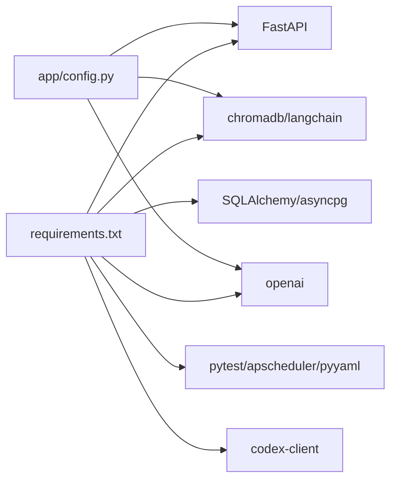

# 后端开发

<cite>
**本文引用的文件**
- [backend/app/main.py](file://backend/app/main.py)
- [backend/app/config.py](file://backend/app/config.py)
- [backend/requirements.txt](file://backend/requirements.txt)
- [README.md](file://README.md)
- [DEVELOPMENT_PLAN.md](file://DEVELOPMENT_PLAN.md)
- [backend/app/api/auth.py](file://backend/app/api/auth.py)
- [backend/app/core/rule_engine.py](file://backend/app/core/rule_engine.py)
- [backend/app/core/rag.py](file://backend/app/core/rag.py)
- [backend/app/core/nlu.py](file://backend/app/core/nlu.py)
- [backend/app/services/codex_agent.py](file://backend/app/services/codex_agent.py)
- [backend/app/storage/user_store.py](file://backend/app/storage/user_store.py)
- [backend/app/knowledge/store.py](file://backend/app/knowledge/store.py)
- [backend/app/services/compliance.py](file://backend/app/services/compliance.py)
- [backend/app/api/chat.py](file://backend/app/api/chat.py)
- [backend/app/models/schemas.py](file://backend/app/models/schemas.py)
</cite>

## 目录
1. [简介](#简介)
2. [项目结构](#项目结构)
3. [核心组件](#核心组件)
4. [架构总览](#架构总览)
5. [详细组件分析](#详细组件分析)
6. [依赖分析](#依赖分析)
7. [性能考虑](#性能考虑)
8. [故障排查指南](#故障排查指南)
9. [结论](#结论)
10. [附录](#附录)

## 简介
本指南面向后端开发者，系统梳理基于 FastAPI 的“避风港”跨境合规智能体项目的工程结构、API 设计与路由组织、核心业务模块（规则引擎、RAG 检索、NLU 意图识别）、存储层设计（SQLite、分层文件存储、向量数据库）、认证授权机制（JWT）、服务层模式（Codex Agent 封装、MCP 工具集成、WebSocket 实时推送）、以及 API 接口文档与最佳实践。文档以“可落地”的方式呈现，既适合初学者快速上手，也便于资深工程师深入优化。

## 项目结构
后端采用 FastAPI + 多模块分层组织，核心目录与职责如下：
- app/main.py：应用入口，注册路由、中间件、生命周期钩子与 WebSocket 端点
- app/api/*：按领域划分的 API 控制器（认证、聊天、会话、风险、模型配置、代理配置、Shopify 等）
- app/core/*：核心算法与服务（规则引擎、RAG、NLU、动作链、事件链、本地存储、市场监控、调度器等）
- app/knowledge/*：知识库与向量检索（文档加载、嵌入、ChromaDB 存取、市场路由）
- app/models/schemas.py：Pydantic 数据模型（请求/响应、会话、操作链、事件链、自然语言存储等）
- app/services/*：服务编排与第三方集成（Codex Agent、Prompt 热加载、Shopify 封装、WebSocket 管理等）
- app/storage/*：分层文件存储与 SQLite 持久化（用户、会话、代理配置、模型配置、事件链等）
- app/config.py：集中式配置（LLM、数据库、Chroma、调度器、Shopify、JWT 等）
- data/*：知识库、Prompts、Skills、原始数据与脚本
- scripts/*：知识库初始化、存储迁移等脚本
- tests/*：规则引擎、API、OpenAPI 合同等测试

```mermaid
graph TB
subgraph "应用入口"
M["app/main.py"]
end
subgraph "API 控制器"
A1["api/auth.py"]
A2["api/chat.py"]
A3["api/sessions.py"]
A4["api/risk.py"]
A5["api/users.py"]
A6["api/model_config.py"]
A7["api/agent_config.py"]
A8["api/shopify.py"]
end
subgraph "核心服务"
C1["core/nlu.py"]
C2["core/rule_engine.py"]
C3["core/rag.py"]
C4["core/action_chain.py"]
C5["core/event_chain.py"]
C6["core/local_store.py"]
C7["core/market_monitor.py"]
C8["core/risk_alert.py"]
C9["core/scheduler.py"]
end
subgraph "知识库与向量"
K1["knowledge/store.py"]
K2["knowledge/loader.py"]
K3["knowledge/embeddings.py"]
K4["knowledge/market_routing.py"]
end
subgraph "服务编排"
S1["services/compliance.py"]
S2["services/codex_agent.py"]
S3["services/codex_tools.py"]
S4["services/prompt_loader.py"]
S5["services/ws_manager.py"]
S6["services/shopify.py"]
end
subgraph "存储层"
ST1["storage/user_store.py"]
ST2["storage/session_store.py"]
ST3["storage/agent_config_store.py"]
ST4["storage/model_config_store.py"]
ST5["storage/event_store.py"]
ST6["storage/project_memory.py"]
ST7["storage/user_memory.py"]
ST8["storage/session_memory.py"]
ST9["storage/raw_store.py"]
ST10["storage/layer_registry.py"]
end
M --> A1
M --> A2
M --> A3
M --> A4
M --> A5
M --> A6
M --> A7
M --> A8
A2 --> S1
A2 --> C1
A2 --> C2
A2 --> C3
A2 --> C4
S1 --> C1
S1 --> C2
S1 --> C3
C3 --> K1
K1 --> K2
K1 --> K3
K1 --> K4
S2 --> S3
S2 --> S4
A1 --> ST1
A2 --> ST10
ST10 --> ST1
ST10 --> ST2
ST10 --> ST3
ST10 --> ST4
ST10 --> ST5
ST10 --> ST6
ST10 --> ST7
ST10 --> ST8
ST10 --> ST9
```

图表来源
- [backend/app/main.py:1-76](file://backend/app/main.py#L1-L76)
- [backend/app/api/chat.py:1-541](file://backend/app/api/chat.py#L1-L541)
- [backend/app/api/auth.py:1-108](file://backend/app/api/auth.py#L1-L108)
- [backend/app/services/compliance.py:1-35](file://backend/app/services/compliance.py#L1-L35)
- [backend/app/core/nlu.py:1-99](file://backend/app/core/nlu.py#L1-L99)
- [backend/app/core/rule_engine.py:1-247](file://backend/app/core/rule_engine.py#L1-L247)
- [backend/app/core/rag.py:1-59](file://backend/app/core/rag.py#L1-L59)
- [backend/app/knowledge/store.py:1-227](file://backend/app/knowledge/store.py#L1-L227)
- [backend/app/services/codex_agent.py:1-370](file://backend/app/services/codex_agent.py#L1-L370)
- [backend/app/storage/user_store.py:1-133](file://backend/app/storage/user_store.py#L1-L133)

章节来源
- [backend/app/main.py:1-76](file://backend/app/main.py#L1-L76)
- [README.md:92-316](file://README.md#L92-L316)

## 核心组件
- FastAPI 应用与路由组织
  - 应用入口注册 CORS、多个 API 路由前缀 /api/v1，提供健康检查与 WebSocket 实时推送
  - 路由注册集中在入口文件，遵循“按领域分包”的组织方式
- 配置中心
  - Settings 使用 pydantic-settings，集中管理 LLM、数据库、Chroma、调度器、Shopify、JWT 等配置
- 认证与授权
  - JWT 登录/注册/当前用户/修改密码；支持角色鉴权（admin/user）
- 会话与动作链
  - 会话历史 SQLite 持久化；每次交互创建动作链记录每步操作，支持回溯
- 知识库与检索
  - ChromaDB 多集合（eu/us/jp/kr）本地嵌入；检索返回带来源的上下文
- 规则引擎
  - 基于 L0 原始数据的确定性合规检查（HS/VAT/认证/风险/物流/文档/文化提示）
- NLU 意图识别
  - 通过 LLM 结构化解析用户输入，支持多轮上下文注入
- 服务编排与 Agent
  - Codex Agent 封装（run_task/run_chat/stream），MCP 工具集成，Prompt 热加载
- 存储层
  - 分层文件存储（L0-L5）+ SQLite；LayerRegistry 统一访问入口

章节来源
- [backend/app/main.py:1-76](file://backend/app/main.py#L1-L76)
- [backend/app/config.py:1-75](file://backend/app/config.py#L1-L75)
- [backend/app/api/auth.py:1-108](file://backend/app/api/auth.py#L1-L108)
- [backend/app/api/chat.py:1-541](file://backend/app/api/chat.py#L1-L541)
- [backend/app/core/rule_engine.py:1-247](file://backend/app/core/rule_engine.py#L1-L247)
- [backend/app/core/rag.py:1-59](file://backend/app/core/rag.py#L1-L59)
- [backend/app/core/nlu.py:1-99](file://backend/app/core/nlu.py#L1-L99)
- [backend/app/services/codex_agent.py:1-370](file://backend/app/services/codex_agent.py#L1-L370)
- [backend/app/knowledge/store.py:1-227](file://backend/app/knowledge/store.py#L1-L227)
- [backend/app/storage/user_store.py:1-133](file://backend/app/storage/user_store.py#L1-L133)

## 架构总览
系统采用“LLM + 规则引擎 + RAG + Agent + 向量库 + 存储”的组合架构，核心流程：
- 用户输入 → Codex（skills + MCP + 联网搜索）或 NLU → 规则引擎 → RAG → 组合报告
- 每次交互记录动作链，支持回溯；会话历史持久化；风险扫描与预警通过调度器与 WebSocket 推送

图表来源
- [backend/app/main.py:1-76](file://backend/app/main.py#L1-L76)
- [backend/app/api/chat.py:1-541](file://backend/app/api/chat.py#L1-L541)
- [backend/app/api/auth.py:1-108](file://backend/app/api/auth.py#L1-L108)
- [backend/app/core/rule_engine.py:1-247](file://backend/app/core/rule_engine.py#L1-L247)
- [backend/app/core/rag.py:1-59](file://backend/app/core/rag.py#L1-L59)
- [backend/app/knowledge/store.py:1-227](file://backend/app/knowledge/store.py#L1-L227)

## 详细组件分析

### API 路由与端点设计
- 健康检查：GET /api/v1/health
- 认证与会话：登录、注册、当前用户、修改密码；会话列表/详情/删除
- 用户管理：用户列表、删除、修改角色（admin）
- Agent 配置：列表/详情/增删改/启用/禁用
- 模型配置：列表/详情/增删改/激活（admin）
- 操作链与事件链：列表/详情/创建事件
- 风险监控：预警列表/未读数/忽略、手动扫描、市场状态、仪表盘指标
- Shopify 集成：授权 URL、回调、已连接店铺、产品列表、合规检查、Webhook
- 系统工具：Prompt 热加载、自然语言存储 CRUD
- WebSocket：/api/v1/ws，用于实时推送

章节来源
- [backend/app/main.py:21-30](file://backend/app/main.py#L21-L30)
- [README.md:222-281](file://README.md#L222-L281)

### 认证与授权（JWT）
- 登录/注册/当前用户/修改密码
- 角色：admin/user
- 密码使用 bcrypt 哈希存储
- 依赖注入：当前用户、require_admin
- 默认管理员初始化

图表来源
- [backend/app/api/auth.py:54-108](file://backend/app/api/auth.py#L54-L108)
- [backend/app/storage/user_store.py:48-119](file://backend/app/storage/user_store.py#L48-L119)

章节来源
- [backend/app/api/auth.py:1-108](file://backend/app/api/auth.py#L1-L108)
- [backend/app/storage/user_store.py:1-133](file://backend/app/storage/user_store.py#L1-L133)

### 会话与动作链
- 会话历史 SQLite 持久化，支持多轮上下文恢复
- 每次交互创建动作链，记录每步操作（NLU、规则引擎、RAG、报告生成等）
- 支持回溯展示（trail）

章节来源
- [backend/app/api/chat.py:238-377](file://backend/app/api/chat.py#L238-L377)
- [backend/app/models/schemas.py:106-140](file://backend/app/models/schemas.py#L106-L140)

### 规则引擎（确定性合规检查）
- 数据源：L0 原始数据（HS/VAT/认证矩阵/风险）
- 能力：HS 编码匹配、VAT 查询、认证要求、风险标志、物流提示、清关文档建议、文化提示、风险评分与整改建议
- 输出：结构化合规结果（ComplianceResult）

图表来源
- [backend/app/core/rule_engine.py:197-247](file://backend/app/core/rule_engine.py#L197-L247)

章节来源
- [backend/app/core/rule_engine.py:1-247](file://backend/app/core/rule_engine.py#L1-L247)
- [backend/app/models/schemas.py:79-93](file://backend/app/models/schemas.py#L79-L93)

### RAG 检索（ChromaDB 向量库）
- 多集合：eu_knowledge、us_knowledge、jp_knowledge、kr_knowledge
- 本地嵌入：sentence-transformers（离线）
- 检索：按市场或自动推断，支持全库回退
- 输出：带来源的上下文字符串

图表来源
- [backend/app/knowledge/store.py:127-193](file://backend/app/knowledge/store.py#L127-L193)
- [backend/app/core/rag.py:10-59](file://backend/app/core/rag.py#L10-L59)

章节来源
- [backend/app/knowledge/store.py:1-227](file://backend/app/knowledge/store.py#L1-L227)
- [backend/app/core/rag.py:1-59](file://backend/app/core/rag.py#L1-L59)

### NLU 意图识别
- 通过 LLM 结构化 JSON 输出解析用户输入
- 支持多轮上下文注入（最多 6 条）
- 支持 MiMo 思维模式开关
- Prompt 来源：Agent 配置或 YAML 热加载

章节来源
- [backend/app/core/nlu.py:1-99](file://backend/app/core/nlu.py#L1-L99)

### 服务编排与 Codex Agent
- CodexAgent 封装 run_task/run_chat/stream，隐藏 SDK 细节
- 多轮会话：持久化 Thread，维持上下文
- MCP 工具：HS/VAT/认证/风险/RAG 等
- 降级策略：未启用时返回模拟响应
- 结果解析：尝试提取 JSON，否则返回原始文本

图表来源
- [backend/app/services/codex_agent.py:40-370](file://backend/app/services/codex_agent.py#L40-L370)

章节来源
- [backend/app/services/codex_agent.py:1-370](file://backend/app/services/codex_agent.py#L1-L370)

### 存储层设计
- 分层文件存储（L0-L5）+ SQLite
- LayerRegistry 统一访问入口，屏蔽底层差异
- 用户存储：SQLite，bcrypt 哈希
- 会话存储：SQLite，支持多轮消息与合规结果
- 代理配置、模型配置、事件链等独立表

图表来源
- [backend/app/storage/user_store.py:22-33](file://backend/app/storage/user_store.py#L22-L33)
- [backend/app/models/schemas.py:234-264](file://backend/app/models/schemas.py#L234-L264)

章节来源
- [backend/app/storage/user_store.py:1-133](file://backend/app/storage/user_store.py#L1-L133)
- [backend/app/models/schemas.py:1-264](file://backend/app/models/schemas.py#L1-L264)

### WebSocket 实时推送
- 端点：/api/v1/ws
- 连接管理：ws_manager 维护 user_id → WebSocket 列表
- 推送格式：{ type: "alert" | "scan_update", payload: {...} }

章节来源
- [backend/app/main.py:38-56](file://backend/app/main.py#L38-L56)
- [backend/app/services/ws_manager.py](file://backend/app/services/ws_manager.py)

### API 接口文档与示例
- Chat API：POST /api/v1/chat
  - 请求：ComplianceQuery（message, session_id）
  - 响应：ChatResponse（message, compliance_result, sources, session_id, action_chain_id, intent）
  - 降级：NLU → RuleEngine → RAG
- Auth API：POST /api/v1/auth/login、POST /api/v1/auth/register、GET /api/v1/auth/me、PUT /api/v1/auth/me/password
- Sessions API：GET /api/v1/sessions、GET /api/v1/sessions/{id}、DELETE /api/v1/sessions/{id}
- Users API：GET /api/v1/users、DELETE /api/v1/users/{id}、PUT /api/v1/users/{id}/role
- Agent 配置 API：GET/POST/PUT/DELETE /api/v1/agents/*
- 模型配置 API：GET/POST/PUT/DELETE /api/v1/model-configs/*
- 风险监控 API：GET /api/v1/risk/alerts、POST /api/v1/risk/alerts/{id}/dismiss、POST /api/v1/risk/scan、GET /api/v1/risk/market-status
- Shopify API：授权、回调、产品列表、合规检查、Webhook
- 系统工具 API：POST /api/v1/prompts/reload、GET/POST/DELETE /api/v1/nl-store/*

章节来源
- [backend/app/api/chat.py:205-227](file://backend/app/api/chat.py#L205-L227)
- [backend/app/models/schemas.py:73-104](file://backend/app/models/schemas.py#L73-L104)
- [README.md:222-281](file://README.md#L222-L281)

## 依赖分析
- 核心依赖：FastAPI、SQLAlchemy、asyncpg、chromadb、langchain、openai、python-dotenv、alembic、pytest、apscheduler、pyyaml、codex-client
- 配置：Settings 读取 .env，支持多 LLM 提供商与备用字段
- Docker Compose：PostgreSQL（pgvector）+ ChromaDB

图表来源
- [backend/requirements.txt:1-27](file://backend/requirements.txt#L1-L27)
- [backend/app/config.py:5-75](file://backend/app/config.py#L5-L75)

章节来源
- [backend/requirements.txt:1-27](file://backend/requirements.txt#L1-L27)
- [backend/app/config.py:1-75](file://backend/app/config.py#L1-L75)

## 性能考虑
- LLM 调用
  - 控制温度与采样参数，必要时禁用思维模式（MiMo）
  - Prompt 热加载减少重复初始化
- 向量检索
  - 懒加载嵌入函数，避免启动时网络下载
  - 自动市场推断 + 全库回退，兼顾准确性与鲁棒性
- 存储
  - SQLite 适合中小规模；会话与用户表建立索引（建议）
  - 分层文件存储按需读取，避免一次性加载
- 并发与降级
  - Codex 不可用时自动降级为 NLU → RuleEngine → RAG
  - WebSocket 连接池与异常处理保证稳定性

## 故障排查指南
- 认证失败
  - 检查用户名/密码是否正确；确认用户角色与权限
  - 查看默认管理员初始化日志
- LLM 未配置
  - active_llm_api_key 为空时，部分功能降级为关键字提取或引导提示
- ChromaDB 异常
  - 检查 persist_dir 权限与磁盘空间；确认集合创建与嵌入函数加载
- Codex 未安装
  - codex-client 未安装时返回模拟响应；按需启用
- WebSocket 断连
  - 检查前端连接参数与后端连接管理；确认异常捕获与清理

章节来源
- [backend/app/api/auth.py:54-108](file://backend/app/api/auth.py#L54-L108)
- [backend/app/storage/user_store.py:122-133](file://backend/app/storage/user_store.py#L122-L133)
- [backend/app/core/nlu.py:95-101](file://backend/app/core/nlu.py#L95-L101)
- [backend/app/knowledge/store.py:31-41](file://backend/app/knowledge/store.py#L31-L41)
- [backend/app/services/codex_agent.py:296-300](file://backend/app/services/codex_agent.py#L296-L300)
- [backend/app/main.py:48-55](file://backend/app/main.py#L48-L55)

## 结论
本项目以 FastAPI 为核心，结合规则引擎、RAG、NLU、Codex Agent 与向量数据库，构建了“确定性 + 增强”的合规问答体系。通过分层存储与动作链回溯，实现了可解释、可审计、可扩展的后端架构。建议在生产环境中强化密钥管理、监控告警、缓存与限流策略，并持续完善知识库与 Prompt 热加载机制。

## 附录
- 快速开始
  - 启动基础设施：docker compose up -d
  - 初始化知识库：python scripts/init_knowledge.py
  - 启动后端：uvicorn app.main:app --reload --port 8000
  - 首次登录：admin/admin123（登录后立即修改密码）
- 测试
  - pytest tests/ -v

章节来源
- [README.md:33-87](file://README.md#L33-L87)
- [DEVELOPMENT_PLAN.md:104-182](file://DEVELOPMENT_PLAN.md#L104-L182)