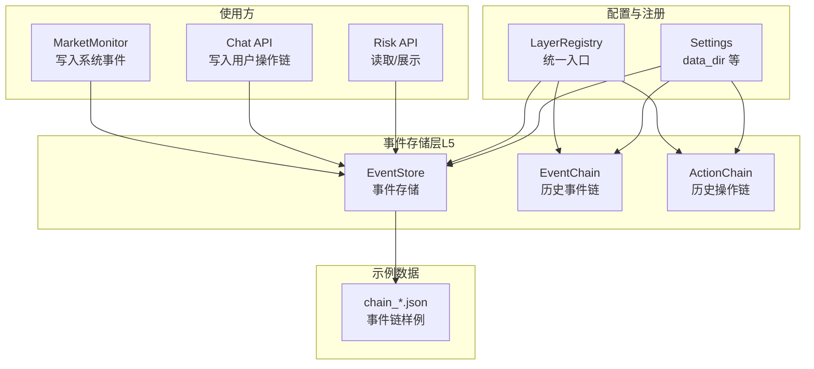
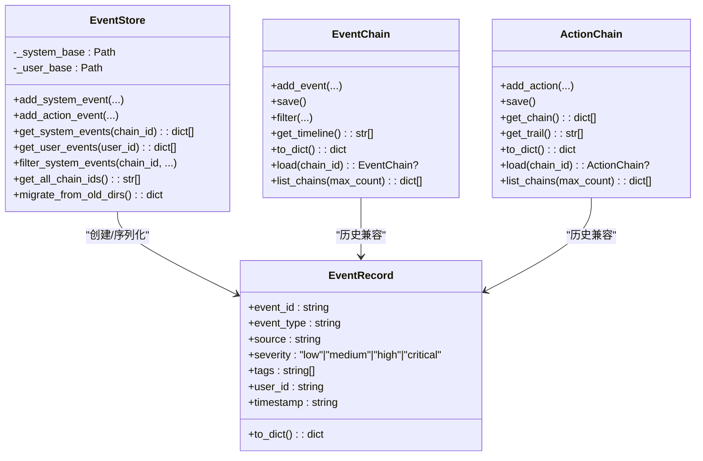
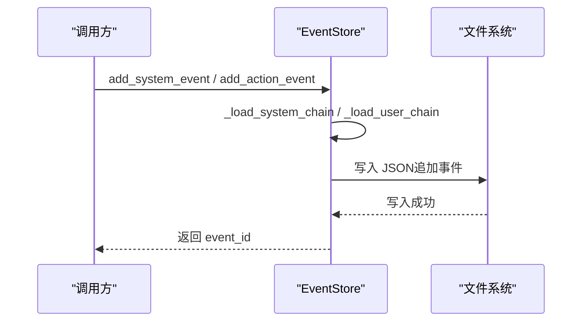
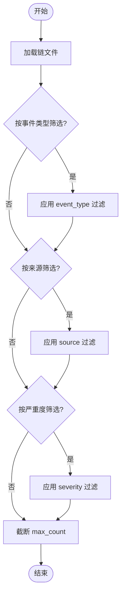
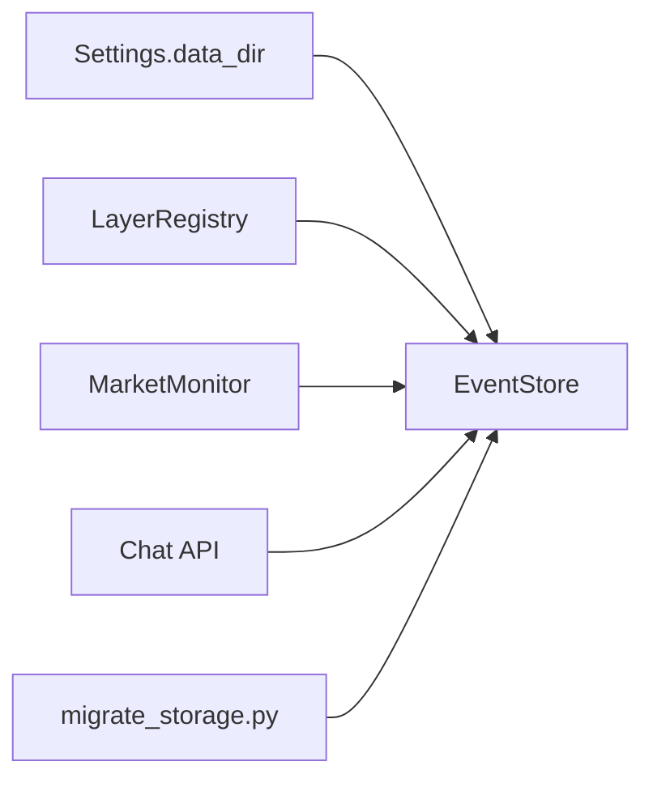

# 事件存储

<cite>
**本文引用的文件**
- [event_store.py](file://backend/app/storage/event_store.py)
- [schemas.py](file://backend/app/models/schemas.py)
- [event_chain.py](file://backend/app/core/event_chain.py)
- [action_chain.py](file://backend/app/core/action_chain.py)
- [config.py](file://backend/app/config.py)
- [layer_registry.py](file://backend/app/storage/layer_registry.py)
- [market_monitor.py](file://backend/app/core/market_monitor.py)
- [risk.py](file://backend/app/api/risk.py)
- [chat.py](file://backend/app/api/chat.py)
- [migrate_storage.py](file://backend/scripts/migrate_storage.py)
- [chain_2b1e9289634c.json](file://backend/data/event_chain/system_events/chain_2b1e9289634c.json)
- [chain_55ee20513c0f.json](file://backend/data/event_chain/system_events/chain_55ee20513c0f.json)
</cite>

## 目录
1. [简介](#简介)
2. [项目结构](#项目结构)
3. [核心组件](#核心组件)
4. [架构总览](#架构总览)
5. [详细组件分析](#详细组件分析)
6. [依赖分析](#依赖分析)
7. [性能考量](#性能考量)
8. [故障排查指南](#故障排查指南)
9. [结论](#结论)
10. [附录](#附录)

## 简介
本文件系统化梳理事件存储模块的设计与实现，围绕事件数据的持久化、事件类型分类、时间序列存储优化、生命周期管理、查询接口、性能优化策略、扩展性设计以及运维考虑展开。事件存储模块承担“L5 事件链层”的职责，统一记录系统事件与用户操作链，服务于审计追踪、事件监控、决策回溯与仪表盘展示。

## 项目结构
事件存储相关代码主要分布在以下位置：
- 存储层：backend/app/storage/event_store.py（事件存储核心）
- 数据模型：backend/app/models/schemas.py（事件/操作链模型）
- 旧版事件链：backend/app/core/event_chain.py（历史事件链）
- 旧版操作链：backend/app/core/action_chain.py（历史操作链）
- 配置：backend/app/config.py（data_dir 等路径配置）
- 分层注册：backend/app/storage/layer_registry.py（统一访问入口）
- 使用场景：backend/app/core/market_monitor.py（写入系统事件）、backend/app/api/chat.py（写入用户操作链）
- 迁移脚本：backend/scripts/migrate_storage.py（从旧结构迁移）
- 示例数据：backend/data/event_chain/system_events/*.json（事件链样例）

图表来源
- [event_store.py:1-269](file://backend/app/storage/event_store.py#L1-L269)
- [event_chain.py:1-215](file://backend/app/core/event_chain.py#L1-L215)
- [action_chain.py:1-236](file://backend/app/core/action_chain.py#L1-L236)
- [config.py:144-152](file://backend/app/config.py#L144-L152)
- [layer_registry.py:23-45](file://backend/app/storage/layer_registry.py#L23-L45)
- [market_monitor.py:1-156](file://backend/app/core/market_monitor.py#L1-L156)
- [chat.py:205-541](file://backend/app/api/chat.py#L205-L541)
- [chain_2b1e9289634c.json:1-123](file://backend/data/event_chain/system_events/chain_2b1e9289634c.json#L1-L123)
- [chain_55ee20513c0f.json:1-123](file://backend/data/event_chain/system_events/chain_55ee20513c0f.json#L1-L123)

章节来源
- [event_store.py:1-269](file://backend/app/storage/event_store.py#L1-L269)
- [config.py:144-152](file://backend/app/config.py#L144-L152)
- [layer_registry.py:23-45](file://backend/app/storage/layer_registry.py#L23-L45)

## 核心组件
- EventRecord：统一的事件/操作记录结构，包含事件ID、类型、来源、严重度、标签、用户ID、时间戳等字段。
- EventStore：事件存储核心，负责系统事件与用户操作事件的写入、读取、筛选与迁移。
- EventChain（历史）：旧版事件链，提供事件节点、筛选、时间线生成与持久化。
- ActionChain（历史）：旧版操作链，提供操作节点、计时、状态计算与持久化。
- LayerRegistry：统一注册 L0-L5 存储层，事件存储在此注册为 self.event。
- 配置 Settings：提供 data_dir，决定事件链文件的落盘路径。

章节来源
- [event_store.py:22-115](file://backend/app/storage/event_store.py#L22-L115)
- [event_store.py:59-269](file://backend/app/storage/event_store.py#L59-L269)
- [event_chain.py:24-192](file://backend/app/core/event_chain.py#L24-L192)
- [action_chain.py:23-212](file://backend/app/core/action_chain.py#L23-L212)
- [layer_registry.py:23-45](file://backend/app/storage/layer_registry.py#L23-L45)
- [config.py:144-152](file://backend/app/config.py#L144-L152)

## 架构总览
事件存储模块采用“分层存储 + 统一注册”的架构：
- L5 事件链层：EventStore 负责系统事件与用户操作事件的统一持久化。
- 历史兼容：EventChain/ActionChain 仍可读取旧文件，但新写入统一走 EventStore。
- 使用方：MarketMonitor（系统事件）、Chat API（用户操作链）、Risk API（读取/展示）。
- 路径：基于 Settings.data_dir，事件链文件位于 data/event_chain/system_events 与 data/event_chain/action_chains。

图表来源
- [event_store.py:22-115](file://backend/app/storage/event_store.py#L22-L115)
- [event_store.py:59-269](file://backend/app/storage/event_store.py#L59-L269)
- [event_chain.py:24-192](file://backend/app/core/event_chain.py#L24-L192)
- [action_chain.py:23-212](file://backend/app/core/action_chain.py#L23-L212)

## 详细组件分析

### 事件表结构与数据模型
- 事件统一结构：EventRecord 提供事件ID、类型、来源、严重度、标签、用户ID、时间戳等字段，并提供 to_dict 序列化。
- 事件链结构：EventChain/ActionChain 的 to_dict 输出包含 chain_id、total_*、events/actions、timeline/trail 等字段。
- Pydantic 模型：schemas.py 中的 EventNodeSchema/EventChainSchema 与 EventCreateRequest 为 API 层提供结构化约束与示例。

章节来源
- [event_store.py:22-56](file://backend/app/storage/event_store.py#L22-L56)
- [event_chain.py:143-166](file://backend/app/core/event_chain.py#L143-L166)
- [action_chain.py:108-171](file://backend/app/core/action_chain.py#L108-L171)
- [schemas.py:143-181](file://backend/app/models/schemas.py#L143-L181)

### 事件类型分类
- 系统事件：来源于外部系统（如法规变更、Shopify Webhook），通过 EventStore.add_system_event 写入。
- 用户操作事件：来源于用户交互（如查询、规则检查、RAG 检索、报告生成），通过 EventStore.add_action_event 写入。
- 严重度：统一使用 "low"/"medium"/"high"/"critical"。
- 标签：支持多标签，便于筛选与聚合。

章节来源
- [event_store.py:76-158](file://backend/app/storage/event_store.py#L76-L158)
- [event_store.py:19](file://backend/app/storage/event_store.py#L19)

### 时间序列存储优化
- 文件组织：系统事件按 chain_id 分片存储于 system_events 目录；用户事件按 user_id 分片存储于 action_chains 目录。
- 路径来源：基于 Settings.data_dir，确保可配置与可迁移。
- 读取策略：按需加载 JSON，避免全量内存占用；提供 get_*_events 与 filter_*_events 降低客户端负担。
- 迁移策略：migrate_from_old_dirs 将旧目录 data/chains/actions 与 data/chains/events 迁移至新结构，保证历史数据可用。

章节来源
- [event_store.py:62-72](file://backend/app/storage/event_store.py#L62-L72)
- [config.py:150-151](file://backend/app/config.py#L150-L151)
- [event_store.py:224-268](file://backend/app/storage/event_store.py#L224-L268)
- [migrate_storage.py:61-68](file://backend/scripts/migrate_storage.py#L61-L68)

### 事件生命周期管理
- 产生：MarketMonitor 与 Chat API 在关键节点调用 EventStore 写入事件；历史 EventChain/ActionChain 仍可写入旧文件。
- 存储：EventStore 将事件追加到对应链末尾，更新 total_* 与 updated_at。
- 查询：提供 get_*_events 与 filter_*_events；支持按事件类型、来源、严重度筛选。
- 归档：通过迁移脚本将旧链迁移至新目录，归档历史数据；未见显式“物理归档”策略，建议结合业务定期迁移与压缩。

图表来源
- [event_store.py:76-158](file://backend/app/storage/event_store.py#L76-L158)
- [event_store.py:198-220](file://backend/app/storage/event_store.py#L198-L220)

章节来源
- [event_store.py:76-158](file://backend/app/storage/event_store.py#L76-L158)
- [event_chain.py:86-106](file://backend/app/core/event_chain.py#L86-L106)
- [action_chain.py:101-122](file://backend/app/core/action_chain.py#L101-L122)

### 查询接口与聚合统计
- 系统事件查询：get_system_events 返回链内事件；filter_system_events 支持按 event_type/source/severity 筛选与 max_count 截断。
- 用户事件查询：get_user_events 返回用户链事件。
- 列表查询：get_all_chain_ids 列出所有系统事件链 ID。
- 历史兼容：EventChain/ActionChain 提供 filter/get_timeline/list_chains 等能力，便于回溯与展示。

图表来源
- [event_store.py:172-188](file://backend/app/storage/event_store.py#L172-L188)

章节来源
- [event_store.py:162-194](file://backend/app/storage/event_store.py#L162-L194)
- [event_store.py:172-188](file://backend/app/storage/event_store.py#L172-L188)
- [event_chain.py:119-141](file://backend/app/core/event_chain.py#L119-L141)
- [action_chain.py:143-162](file://backend/app/core/action_chain.py#L143-L162)

### 性能优化策略
- 写入优化：每次写入为追加写，避免全量重写；使用 ensure_ascii=False、indent=2 的 JSON 写入，兼顾可读性与一致性。
- 读取优化：按需加载链文件；filter_*_events 在内存中进行列表推导，复杂度 O(n)；max_count 控制返回规模。
- 存储优化：按 chain_id/user_id 分片，减少单文件过大；迁移脚本统一目录结构，便于后续分片策略扩展。
- 建议：引入索引（如按时间戳、类型、来源的倒排索引）与批量写入缓冲（异步队列）可进一步提升吞吐；对超大链文件可考虑滚动切分与压缩。

章节来源
- [event_store.py:105-115](file://backend/app/storage/event_store.py#L105-L115)
- [event_store.py:172-188](file://backend/app/storage/event_store.py#L172-L188)
- [event_store.py:224-268](file://backend/app/storage/event_store.py#L224-L268)

### 扩展性设计
- 事件格式标准化：EventRecord 与 EventChain/ActionChain 的 to_dict 统一了事件结构，便于跨模块共享。
- 插件化事件处理器：可在 EventStore 外围扩展事件处理器（如写入数据库、发送消息队列），不影响现有 JSON 写入。
- 事件路由机制：通过 event_type/source/tags 实现事件路由与筛选，便于接入不同处理管线（如风控、审计、监控）。
- 分层注册：LayerRegistry 将 EventStore 暴露为 self.event，便于上层业务统一调用。

章节来源
- [event_store.py:22-56](file://backend/app/storage/event_store.py#L22-L56)
- [layer_registry.py:23-45](file://backend/app/storage/layer_registry.py#L23-L45)

### 实际应用场景与使用示例
- 系统事件：MarketMonitor 通过 Codex 搜索与分析后，将市场事件写入系统事件链，供风险中心与仪表盘消费。
- 用户事件：Chat API 在用户每次对话的关键步骤（如 NLU、规则引擎、RAG、报告生成）写入用户操作链，支持决策回溯。
- 示例数据：backend/data/event_chain/system_events 下的 chain_*.json 展示了完整的操作链结构与 trail。

章节来源
- [market_monitor.py:35-54](file://backend/app/core/market_monitor.py#L35-L54)
- [chat.py:269-376](file://backend/app/api/chat.py#L269-L376)
- [chain_2b1e9289634c.json:1-123](file://backend/data/event_chain/system_events/chain_2b1e9289634c.json#L1-L123)
- [chain_55ee20513c0f.json:1-123](file://backend/data/event_chain/system_events/chain_55ee20513c0f.json#L1-L123)

## 依赖分析
- EventStore 依赖 Settings.data_dir 决定存储路径。
- LayerRegistry 统一注册 EventStore，供上层业务调用。
- MarketMonitor 与 Chat API 在关键节点写入事件，形成事件链。
- 迁移脚本将旧目录数据迁移至新结构，保证历史数据可用。

图表来源
- [config.py:150-151](file://backend/app/config.py#L150-L151)
- [layer_registry.py:39-40](file://backend/app/storage/layer_registry.py#L39-L40)
- [market_monitor.py:43-46](file://backend/app/core/market_monitor.py#L43-L46)
- [chat.py:308-333](file://backend/app/api/chat.py#L308-L333)
- [migrate_storage.py:61-68](file://backend/scripts/migrate_storage.py#L61-L68)

章节来源
- [config.py:150-151](file://backend/app/config.py#L150-L151)
- [layer_registry.py:39-40](file://backend/app/storage/layer_registry.py#L39-L40)
- [migrate_storage.py:61-68](file://backend/scripts/migrate_storage.py#L61-L68)

## 性能考量
- I/O 模式：顺序追加写入，避免随机写；单文件规模随事件增长而增大，建议定期迁移与分片。
- 内存占用：读取时一次性加载整个链文件，适合中小规模链；大规模链建议分片或滚动窗口。
- 并发安全：当前实现未见锁机制，多进程/多线程并发写入需谨慎；建议引入文件锁或异步队列。
- 索引与查询：内存中进行筛选，复杂度 O(n)；建议引入倒排索引或外部搜索引擎以支持高效查询。
- 压缩与归档：对历史链文件进行压缩与归档，减少磁盘占用与读取开销。

[本节为通用性能讨论，不直接分析特定文件]

## 故障排查指南
- 写入失败：检查 data_dir 路径是否存在可写权限；确认 system_events/action_chains 目录创建成功。
- 读取为空：确认链文件是否存在且格式合法；检查 filter 条件是否过于严格。
- 迁移异常：运行 migrate_storage.py 确认旧目录存在且新目录创建成功；查看统计输出。
- 严重度/标签不一致：确认事件创建时 severity 与 tags 的值是否符合预期。

章节来源
- [event_store.py:111-115](file://backend/app/storage/event_store.py#L111-L115)
- [event_store.py:198-220](file://backend/app/storage/event_store.py#L198-L220)
- [migrate_storage.py:61-68](file://backend/scripts/migrate_storage.py#L61-L68)

## 结论
事件存储模块通过 EventStore 实现了系统事件与用户操作事件的统一持久化，采用分片文件组织与简单筛选接口满足审计与回溯需求。配合 LayerRegistry 与上层业务（MarketMonitor、Chat API），实现了从数据采集到展示的闭环。未来可在索引、批量写入、分片与压缩等方面进一步优化，以支撑更大规模与更复杂的查询场景。

[本节为总结性内容，不直接分析特定文件]

## 附录
- 相关 API：Risk API 提供风险列表与市场状态，可结合事件链进行聚合统计与展示。
- 示例数据：system_events 目录下的 chain_*.json 展示了事件链的完整结构与 trail。

章节来源
- [risk.py:25-126](file://backend/app/api/risk.py#L25-L126)
- [chain_2b1e9289634c.json:1-123](file://backend/data/event_chain/system_events/chain_2b1e9289634c.json#L1-L123)
- [chain_55ee20513c0f.json:1-123](file://backend/data/event_chain/system_events/chain_55ee20513c0f.json#L1-L123)